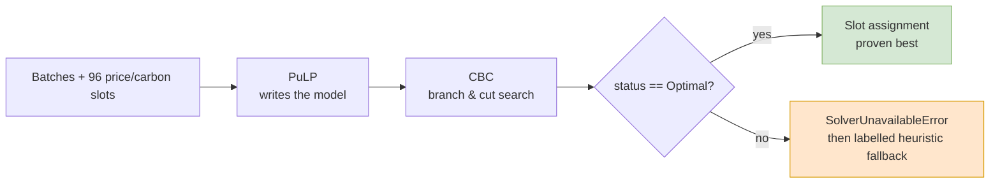
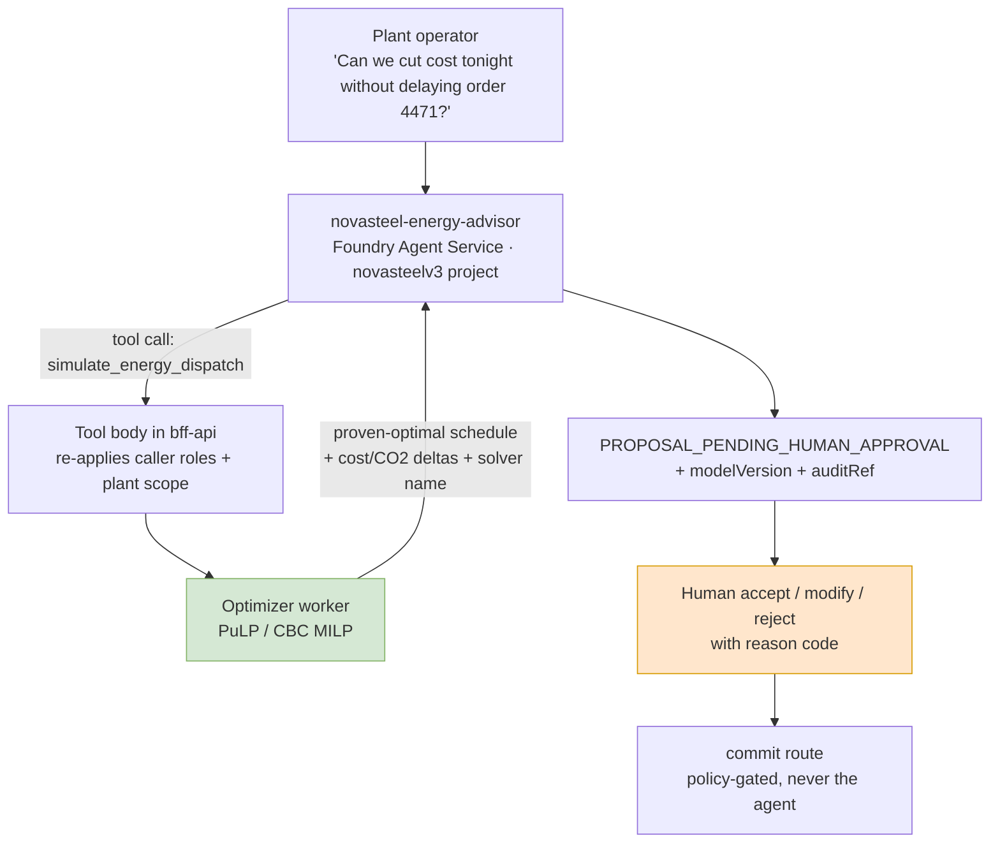
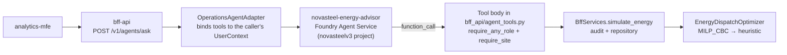

# MILP with PuLP/CBC — why the energy-dispatch optimizer is built this way

**Audience:** anyone who has to defend or extend the energy-dispatch optimizer without
being a data scientist.
**Scope:** what the algorithm is, why it was chosen, what Azure could replace it with,
and whether it belongs behind an agent.
**Code:** [`services/optimizer-worker/src/optimizer_worker/milp.py`](../../../services/optimizer-worker/src/optimizer_worker/milp.py)
and [`service.py`](../../../services/optimizer-worker/src/optimizer_worker/service.py).

---

## 1. What is "MILP with PuLP/CBC" in plain language

Think of it as a **super-powered Excel Solver**.

| Term | Plain meaning |
|---|---|
| **LP** — Linear Program | You describe a goal as a formula ("total cost = sum of MWh × price") and a list of rules ("no more than 3 batches at once"). Everything is proportional — no curves, no exponentials. A solver then finds the combination that gives the lowest possible cost. |
| **MI** — Mixed-Integer | Some decisions must be **whole yes/no answers**. You cannot start 37 % of a steel heat at 14:00. So the variables are binary flags: `x[batch B, slot S] = 1` means "batch B starts in slot S". "Mixed" means the model mixes those yes/no variables with ordinary continuous numbers. |
| **PuLP** | A Python **library for writing the model** in readable code — declare variables, add constraints, state the objective. It is *not* the maths engine; it is the spec sheet. |
| **CBC** | **COIN-OR Branch-and-Cut** — the free, open-source **engine** that actually crunches the numbers, bundled with PuLP. It is the chef that cooks the recipe PuLP wrote. |

### What our model actually does

From `milp.py`:

- **Decision** — for each production batch, which 15-minute slot does it start in?
  (`x[b, s]` binary, one variable per feasible batch/slot pair)
- **Rules** (hard constraints)
  - each batch starts exactly once — `assign_<b>`
  - at most `max_concurrent` batches per slot — `capacity_<s>`
  - urgent batches are **pinned** to their planned slot
  - non-urgent batches may only move within `max_shift_slots` and `max_hold_minutes`
- **Goal** — minimise `energy_MWh × (co2_weight × carbon + cost_weight × price)`
- **Tie-break** — a tiny `epsilon` penalty for drifting from the planned slot, so ties
  always resolve to the same schedule.

Brute force would be impossible — 20 batches over 96 slots is 96²⁰ combinations. CBC
prunes the search tree with branch-and-cut and returns the **proven best** answer in
milliseconds.

---

## 2. Why this algorithm and this library

### Why MILP rather than ML or an LLM

1. **Hard constraints are non-negotiable.** An urgent heat must never move; furnace
   concurrency must never be exceeded. MILP makes those violations *mathematically
   impossible*. A machine-learning model or a language model can only be "usually
   right", which is not a defensible property in a steel plant.
2. **Provable optimality.** `milp.py` rejects anything that is not `Optimal`
   (`LpStatus[prob.status] != "Optimal"` raises). We can tell a plant manager "this is
   the cheapest schedule that exists under your rules", not "this one looked better".
3. **Determinism and auditability.** `threads=1` plus the epsilon tie-break means the
   same input always produces the same schedule. That is what the EU AI Act posture in
   [`docs/business/compliance/eu-ai-act.md`](../../business/compliance/eu-ai-act.md)
   needs: a reproducible decision an auditor can replay.
4. **Explainability for free.** Every output traces back to a named constraint
   (`capacity_12`, `assign_3`) and a linear cost term. There is no black box to
   interpret.
5. **Right-sized problem.** Roughly 96 slots × tens of batches is a few thousand binary
   variables. CBC solves that instantly; a paid solver would buy nothing.

### Why PuLP and CBC specifically

- **Zero licence cost, zero external calls.** One `pip install pulp` from the protected
  feed, CBC binary bundled. It runs fully offline inside the container — no plant data
  leaves the boundary.
- **Solver-agnostic.** PuLP is only the modelling layer. Swapping CBC for HiGHS or
  Gurobi later is a one-line change (`pulp.PULP_CBC_CMD` → another solver command).
- **Safe degradation.** PuLP is imported *lazily* inside `solve_milp`, so the worker
  still runs its deterministic bounded-enumeration heuristic when the solver is
  missing — and `service.py` reports which strategy produced the result
  (`"solver": "MILP_CBC" | "DETERMINISTIC_HEURISTIC"`). The fallback is labelled, never
  silent.

> ML is **complementary, not a replacement**. Use forecasting to predict price and
> demand, then feed those numbers into the MILP. Never let a learned model choose the
> schedule.

---

## 3. Is there an Azure service that could replace it?

**Short answer: there is no drop-in managed "MILP-as-a-Service" on Azure.** What Azure
changes is *where you host it*, not the mathematics.

| Option | Verdict |
|---|---|
| **Azure Container Apps** — what we run today ([`infra/bicep/modules/containerapps.bicep`](../../../infra/bicep/modules/containerapps.bicep)) | ✅ **Keep.** Correct pattern: scale-to-zero, per-request isolation, sub-second solves. |
| **Azure Container Apps Jobs / Azure Batch** | ✅ Good *addition* if we later run many scenarios in parallel (e.g. 500 price forecasts → 500 solves). Batch is built for embarrassingly-parallel compute. |
| **Azure Functions** | ⚠️ Works for small solves, but CBC is a native binary and cold starts plus execution timeouts make it fragile. Not worth the migration. |
| **Azure Machine Learning** (pipeline component or managed endpoint) | ⚠️ Useful *wrapper*: experiment tracking, model/version lineage, chaining forecasting → optimisation in one pipeline. It still runs the same PuLP code. Adds MLOps value and operational cost. |
| **Azure Quantum optimization (QIO)** | ❌ **Retired by Microsoft in 2023.** Not an option. |
| **Commercial solvers (Gurobi, IBM CPLEX) via Azure Marketplace** | ⚠️ Only if the model grows by two orders of magnitude — thousands of batches, multi-site, multi-day. Significant licence cost, not justified today. |
| **HiGHS** (open source, drop-in behind PuLP) | ✅ A free performance upgrade path if CBC ever becomes the bottleneck. |

**Recommendation:** keep CBC in Container Apps. The real Azure value-add sits *around*
the optimizer — Azure Monitor / OpenTelemetry (already in the worker's
`requirements.txt`), Container Apps Jobs for batch scenarios, and Foundry Agent Service
for the conversational layer.

---

## 4. Deploying the optimizer into an agent — relevant? What benefits?

**Highly relevant — and the platform already does it.** The decision is recorded as
**ADR-019** in [solution-architecture.md](../solution-architecture.md), which asked this
exact question and answered it deliberately.

### The principle

> **The agent is the interface. The MILP is the decision engine. Never swap them.**

The key move in ADR-019 is what it *refused*: the calculations do **not** move into the
agent. They stay in Python and are *exposed to* agents as client-side function tools. The
language model does not compute the schedule — it calls `simulate_energy_dispatch` as a
tool, and then explains the result. A deny-by-default registry in
[`agent_tools.py`](../../../services/knowledge-orchestrator/src/knowledge_orchestrator/agent_tools.py)
refuses any tool not declared on that agent's own definition, so there is no `commit` or
`approve` tool to reach.

### Benefits

1. **Natural-language access to a rigorous engine.** Operators ask in plain
   French/English instead of filling a parameter form. The agent maps "don't move
   anything more than an hour" onto `maxShiftMinutes=60`.
2. **Conversational what-if loops.** "What if I allow two hours of shift?" re-runs the
   solve and compares. Each run is still a proven-optimal MILP, not a model's guess.
3. **Explanation layer.** MILP emits numbers; the agent turns them into "we saved
   €1,240 and 3.1 t CO₂ by moving four non-urgent batches into the 02:00–04:00 wind
   window, with the urgent automotive coil untouched."
4. **Composition across advisors.** The energy advisor and the maintenance advisor
   (`lining_rul_forecast`) can be reasoned about together — "if I delay this batch, what
   does it do to the hearth?" — which no single screen answers today.
5. **Safety is structural, not prompted.** Because the model never *computes* the
   answer, a hallucination cannot produce an infeasible schedule — the worst case is
   odd tool arguments, and the MILP constraints still hold. Combined with the
   propose-only boundary (ADR-006, ADR-007) and the human commit gate, the architecture
   is EU-AI-Act-defensible.
6. **Platform-owned observability.** Foundry Agent Service emits OpenTelemetry GenAI
   spans — model, tokens, tool calls, latency — into the same Application Insights
   workspace as the worker's own dispatch metrics, with no extra instrumentation.

### Caveats we hold ourselves to

- The agent **must not** generate or "adjust" the schedule itself. Determinism and
  auditability die the moment it does. The instructions say so and the tool is the only
  path to a number.
- **Log both layers:** the agent's tool-call arguments *and* the MILP solve
  inputs/outputs, so an audit can replay the exact solve.
- **Keep the propose/approve split.** The agent proposes; a human commits. That boundary
  is what makes the whole thing deployable in a real plant.
- **The chat panel is not the door.** ADR-011 gives the Copilot chat no tools at all;
  routing dispatch questions from the chat into the optimizer would silently revoke that
  guarantee. Tool-calling agents are reached through `POST /v1/agents/ask` instead.

---

## 5. How it is wired in this repository

| Concern | Where |
|---|---|
| MILP model | `optimizer_worker/milp.py` |
| Strategy switch + savings maths | `optimizer_worker/service.py` |
| Agent roster (declared as data) | `knowledge_orchestrator/agent_manifest.py` |
| Tool schemas + deny-by-default registry | `knowledge_orchestrator/agent_tools.py` |
| Release-time reconciliation of the roster | `knowledge_orchestrator/agent_reconciler.py` |
| Tool *bodies*, scoped to the caller | `bff_api/agent_tools.py` |
| Run loop + caller-scope context | `bff_api/agent_adapter.py` |
| Foundry project, BYO stores, App Insights | `infra/bicep/modules/foundry-agents.bicep` |

### Environment

| Variable | Effect |
|---|---|
| `FOUNDRY_PROJECT_ENDPOINT` | The `novasteelv3` project — hosts the whole roster, including this advisor (ADR-020). |
| `FOUNDRY_AGENT_SERVICE_MODE=local` | Explicit override, forces local agents. |
| `FOUNDRY_CHAT_DEPLOYMENT` | Model behind the hosted agents. |

### One design note worth keeping

A model asked for a plant code will confidently invent a plausible one. The schema lets
it propose a `site`, but the proposal is never trusted: the tool body resolves and
validates it against the caller's plant scope with `require_site`, so an invented plant
identifier is refused rather than solved. The general rule — *never let the model's
answer be the authority on a value a service already owns* — is worth applying to every
tool schema, not just this one.

Dependencies resolve only from the protected feed
(`https://packagefeedproxy.microsoft.io/pypi/simple`) — see
[`docs/tech/security_requirement.md`](../../tech/security_requirement.md).
