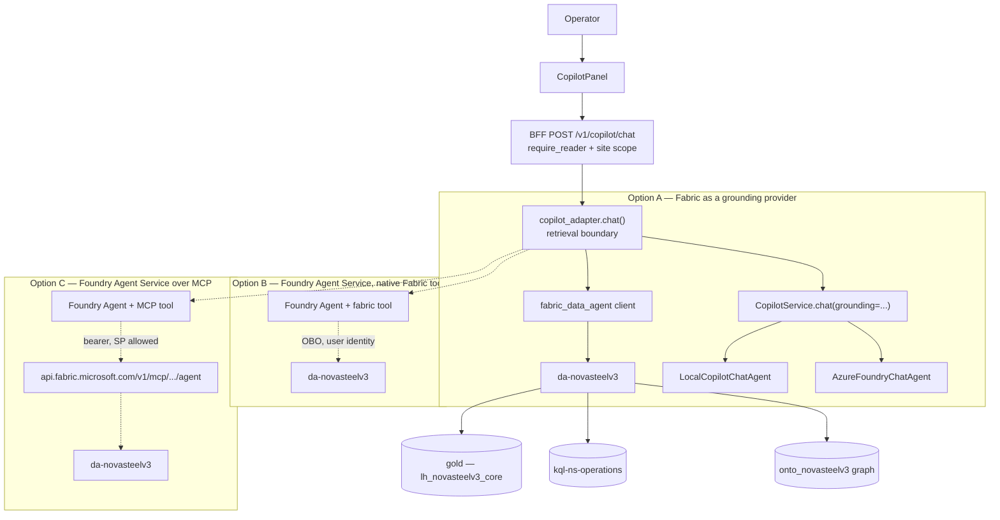

# Design — connecting the Copilot panel to the Fabric data agent

**Status:** Proposed. No code written.
**Decides:** whether, and how, the front-end Copilot's predefined questions and free-text
answers may be backed by `da-novasteelv3`, the Fabric data agent.
**Amends:** ADR-011 (the chat explains, it does not retrieve operational values).
**Related:** ADR-012 (conversations never leave the process), ADR-019/ADR-020 (operations agents hold
tools; the chat surface does not), ADR-007 (no direct OT action), ADR-018 (two data streams).

---

## 1. The question

Two things were asked, and they are not independent:

1. Can the predefined Copilot questions be replaced with the analytical questions written for
   the Fabric data agent (`docs/demo/data-agent-question-script.md`)?
2. Is `Copilot → Foundry Agent Service → Fabric data agent (MCP)` possible, and is it
   relevant?

The honest short answer: (1) is a two-line edit and a bad idea on its own, because the chat
has no path to Fabric today and would render chips it cannot answer. (2) is possible, in two
supported variants, but the obvious variant is the wrong one for this application. The
recommendation below is a third option that neither question proposed.

---

## 2. What exists today

### 2.1 Three separate answering surfaces

| Surface | Route | Backend | Grounding | Can it read plant data? |
|---|---|---|---|---|
| **Copilot chat** | `POST /v1/copilot/chat` | `LocalCopilotChatAgent` (default) or `AzureFoundryChatAgent` | screen context, glossary, curated corpora | **No — by decision (ADR-011)** |
| **Operations agents** | `POST /v1/copilot/agent` | Foundry, tool-calling | function tools re-applying caller roles/site | Yes, through audited BFF services |
| **Dashboards** | `/v1/*` REST | BFF services | Fabric SQL or fixture pack | Yes |
| **Fabric data agent** | Fabric portal only | `da-novasteelv3` | gold lakehouse, KQL, ontology graph | Yes — **but unreachable from the app** |

The fourth row is the gap. `da-novasteelv3` is fully built and its prompt now carries the
usecase.md narrative, the KPI targets and the ontology routing rules — and nothing in the
product can call it.

### 2.2 The predefined questions

`services/knowledge-orchestrator/src/knowledge_orchestrator/copilot/suggestion_data.py`

- `SUGGESTIONS_BY_SECTION` — **11 screens × 5 languages × exactly 5 questions = 275 strings**
  (`command-center`, `operations`, `furnace-health`, `energy-optimization`, `quality`,
  `sustainability-compliance`, `knowledge-hub`, `executive-overview`, `platform-ops`,
  `device-operations`, `dashboards`), plus `DEFAULT_SUGGESTIONS`.
- Two tests pin the shape: `test_every_screen_has_five_suggestions_in_every_language` and an
  API test asserting five per set. `MAX_SUGGESTIONS = 5`.

The existing chips are **screen-scoped, persona-scoped and action-oriented** — "Draft the
inspection work-order rationale", "Search for recent refractory guidance", "Explain how the
thermal signature works". The data-agent script's questions are **analytical and tabular** —
"What was the average energy intensity in GJ/t in July 2026 against the 19.5 baseline?" They
are different genres served by different backends. A straight replacement loses the drafting
and explaining questions, and produces chips the current chat cannot answer.

### 2.3 The grounding seam already exists

`services/bff-api/src/bff_api/copilot_adapter.py::chat()` already performs retrieval at the
BFF boundary and hands the hits down as `GroundingItem`s, with a comment stating the intent:

> Retrieval happens here, at the boundary that owns the demo corpora, and is handed to the
> agent as grounding so the answer text itself is built on it — rather than bolting citations
> onto a finished answer.

Two retrievers exist (`search_offline_corpus`, `search_steel_corpus`), each producing a
`SourceKind`. `ChatSource` provenance is stitched back onto the response afterwards. **This is
the extension point**, and it is what makes option A below cheap.

---

## 3. The constraint that governs the choice

ADR-011 is not a gap to be filled; it is a decision with stated consequences:

> The chat agents receive no tools. […] The chat cannot leak a value the caller is not
> entitled to see […]. It also cannot answer a genuinely novel operational question — that
> is the dashboard's job, and the answer says so.

Anything proposed here must either respect that or amend it deliberately. The three
authorization facts that follow from it:

1. **The chat route is `require_reader` only.** Site scoping is not applied at
   `/v1/copilot/chat` because today nothing behind it can read plant data. The moment it can,
   the route needs the plant-scope treatment the dashboard routes already get.
2. **A hosted agent carries no caller identity.** `agent_adapter.py` states it plainly: the
   agent runs as the project managed identity, so tool bodies close over the request's
   validated `UserContext` and re-apply `require_any_role` / `require_site`. Any Fabric path
   must do the same or it becomes a second, unaudited data API.
3. **ADR-012 keeps conversations in-process.** Options that hand conversation state to
   Foundry (server-side threads) qualify it, exactly as ADR-019 already had to.

---

## 4. The options

### Option A — Fabric data agent as a grounding provider *(recommended)*

Add a third retriever in `copilot_adapter.chat()`. When the question is routed as analytical,
call the data agent, take its answer and the tables behind it, and inject them as
`GroundingItem(kind=SourceKind.FABRIC)`. The existing chat agent then composes the reply in
the operator's language, with the Fabric result cited as a source.

- **Both chat agents gain Fabric grounding**, including `LocalCopilotChatAgent`. The offline
  demo default keeps working and starts quoting real numbers when the capacity is up.
- No new orchestration layer, no server-side threads, ADR-012 untouched.
- The BFF stays the authorization boundary — site scoping is applied before the call, in the
  same place as everything else.
- Degrades to today's behaviour on any Fabric failure, matching the `create_chat_agents()`
  fallback style already used.
- Cost: ~a client module plus ~40 lines in the adapter, plus routing.
- Limitation: single-shot. No multi-step reasoning across Fabric and the function tools. That
  is what the operations agent surface is for.

### Option B — Foundry Agent Service with the native Fabric tool

A project connection of type *Microsoft Fabric* (`workspace_id` + `artifact_id`), attached as
the `fabric` tool. Full SDK support, no protocol plumbing.

**Blocked for this application by authentication.** The tool uses On-Behalf-Of identity
passthrough, and the documentation is explicit: *"Use user identity authentication. Service
principal authentication isn't supported for the Fabric data agent."* Every operator would
need a real Fabric identity with `READ` on the data agent **and** the underlying sources
(`Read` on `lh_novasteelv3_core`, `Reader` on `kql-ns-operations`, `Build` on
`sm-novasteelv3-operations`). Demo evaluators are given an app URL, not a Fabric tenant
account. It also inverts the app's authorization model, where the BFF — not Fabric — decides
what a caller may see.

Correct choice if the audience is internal Fabric users; wrong for a demonstrable product.

### Option C — Foundry Agent Service over the Fabric MCP server

`https://api.fabric.microsoft.com/v1/mcp/workspaces/{workspaceId}/dataagents/{dataAgentId}/agent`
— streamable HTTP, one tool, bearer token for scope `https://api.fabric.microsoft.com/.default`.

For `NovaSteelV3-Demo` that resolves to workspace `3d9c0b49-5201-4914-8149-06071b529918`,
data agent `8d05f5f4-5e31-4180-90e9-bfa84ba7127d`.

- **The token may represent a service principal.** This is the decisive difference from
  option B and the reason MCP, not the native connection, is the right variant *if* an agent
  layer is wanted.
- Requires the data agent to be **published** — an unpublished agent errors even with a
  correct URL. **Unverified for `da-novasteelv3`.**
- Requires F2+ capacity **running**, and the cross-geo AI tenant settings enabled.
- The published agent's *description* becomes the MCP tool description and therefore drives
  the orchestrator's routing decisions. The current one reads *"NovaSteel manufacturing AI
  data agent — queries real-time KQL telemetry and Lakehouse analytics"* — it does not
  mention the ontology or the graph, so an orchestrator would never route a class or
  genealogy question to it. Needs rewriting before any MCP work, and it is a one-line
  `PATCH` that works even with the capacity paused.
- Brings back the identity problem in a different form: a service-principal token sees
  everything, so site scoping must be enforced by us, before the call.

### Option D — no agent at all, for the deterministic chips

`BFF_DATA_SOURCE=fabric` and the SQL endpoint already exist. "Energy intensity in July 2026
against the 19.5 baseline" is a `SELECT` against `fact_energy_ledger` and `dim_kpi_target` —
faster, testable, auditable, and it works in fixture mode with no capacity running. Worth
using for the fixed KPI chips, keeping the data agent for open-ended and ontology questions,
where NL2SQL and GQL actually earn their cost.

---

## 5. Comparison

| | A — grounding provider | B — native Fabric tool | C — MCP tool | D — direct SQL |
|---|---|---|---|---|
| Service-principal auth | ✅ | ❌ not supported | ✅ | ✅ |
| Works with offline default | ✅ | ❌ | ❌ | ✅ |
| Needs capacity running | only when used | yes | yes | only in `fabric` mode |
| Preview dependency | ✅ none | ❌ preview | ❌ preview | ✅ none |
| ADR-012 (in-process history) | unchanged | qualified | qualified | unchanged |
| Multi-step reasoning | ❌ | ✅ | ✅ | ❌ |
| Ontology / GQL questions | ✅ | ✅ | ✅ | ❌ |
| Build cost | low | medium | medium-high | low |

---

## 6. Recommendation

**Adopt A, with D for the fixed KPI chips. Keep C on the roadmap for the operations-agent
surface, not the chat panel.**

Rationale: A delivers the demonstrable capability — the Copilot answering real questions over
gold facts and the ontology, with citations — without a preview dependency, without breaking
the offline default that the whole demo rests on, and without moving the authorization
boundary out of the BFF. C is the right shape for genuine multi-step agentic work, and that
work already has a home at `/v1/copilot/agent` (ADR-019), where tool-level role and site
checks exist. Putting it behind the *chat* panel would mean amending ADR-011 and ADR-012 to
buy capability the chat panel was deliberately not given.

### ADR-011 amendment this implies

The chat still holds no tools and still performs no free-form query generation of its own.
It gains **one additional grounding source** — a Fabric data agent result retrieved by the
BFF, under the caller's already-validated site scope, cited like every other source and
labelled as synthetic. The consequence in ADR-011 that "it cannot answer a genuinely novel
operational question" is narrowed: it can now answer questions the data agent can ground,
and must continue to say so plainly when it cannot.

---

## 7. Phased plan

**Phase 0 — verify prerequisites** (nothing can be promised before this)
1. Is `da-novasteelv3` **published**? Required for C; also worth knowing for A.
2. Are the cross-geo AI tenant settings enabled?
3. Confirm the service principal (or the app's managed identity) can call the data agent and
   read `lh_novasteelv3_core`, `kql-ns-operations` and the ontology graph.
4. Measure a cold-capacity round trip. Resume F2, time three questions, scale back, pause.

**Phase 1 — the client** — `knowledge_orchestrator/fabric_data_agent.py`: token acquisition,
one call, structured result (answer text, tables, the SQL/GQL it ran). Unit-tested against a
recorded response, no network in CI.

**Phase 2 — the retriever** — `SourceKind.FABRIC`; wire into `copilot_adapter.chat()` behind
`COPILOT_FABRIC_MODE` (`off` default | `on`). Apply site scope before the call. Fail soft.

**Phase 3 — routing** — decide when a question goes to Fabric. Start deterministic: an
explicit "Ask the data" affordance on the chip, plus a keyword/section heuristic. Do not put
an LLM router in front of it for a demo.

**Phase 4 — the chips** — blend, do not replace (below).

**Phase 5 — provenance in the UI** — a Fabric-sourced answer must be visibly distinguishable
from a glossary answer, consistent with ADR-017's honesty rule and the synthetic-data
disclaimer.

---

## 8. What to do with the predefined questions

**Blend, do not replace.** Per screen keep 3 action/explain chips and convert 2 to
Fabric-backed analytical questions, preserving the 5-per-screen-per-language contract. Only
ship the converted chips once phase 2 is live, or they will fail in front of an audience.

Mapping from the question script to the screens that fit cleanly:

| Screen | Fabric-backed chips to add | Source |
|---|---|---|
| `furnace-health` | the BE-EAF-01 21-day episode (alert 2026-06-19 at `rul_days_p50` = 21.0 → reline 2026-07-10, no unplanned outage) | §3, §4.2 |
| `energy-optimization` | July 2026 energy intensity vs the 19.5 GJ/t baseline; cost avoided | §4.1, §4.5 |
| `sustainability-compliance` | tCO₂e/t vs the 2.10 baseline; ETS exposure | §4.3, §4.5 |
| `quality` | high-grade FPY vs the 0.972 target (currently **not met** at 0.9494) | §4.4, §4.5 |
| `executive-overview` | the four programme KPIs against target in one answer | §4.5 |
| `command-center` | dispatch adoption and realised avoidance, 0 hard-constraint violations | §4.5 |

Leave `knowledge-hub`, `platform-ops`, `device-operations` and `dashboards` alone — they are
served correctly today by the glossary, screen context and the device simulator.

Costs to budget: **10 new questions × 5 languages = 50 translated strings**, plus the two
existing tests, plus the offline `OFFLINE_SUGGESTIONS` list in `copilotClient.ts`.

### 8.1 What shipped instead — option D for all 44 non-search chips

The chips were not rewritten. Every existing chip that asks about the plant rather than about the
public world now carries a **curated Fabric answer**, served deterministically:

- 11 screens × 5 chips = 55 questions. The 11 "Search for recent …" chips keep the online-search
  corpus; the other **44** resolve to a card in
  `services/knowledge-orchestrator/src/knowledge_orchestrator/copilot/fabric_answer_data.py`.
- Bodies live in `fabric_answers_{en,fr,de,nl,es}.py` — **44 cards × 5 languages = 220 answers** —
  and every figure in them is the synthetic value the screen behind the panel is already showing,
  the simulator is emitting, or the July-2026 gold scorecard in
  `docs/demo/data-agent-question-script.md` records.
- `fabric_answers.py` matches on question text alone, normalised (case- and punctuation-free), in
  any of the five languages. It cannot key off the screen: the panel's **Screen context** toggle is
  off by default, so a chip usually arrives with no section.
- `LocalCopilotChatAgent` short-circuits on a match, serves the body verbatim and cites the Fabric
  datasets as `SourceKind.FABRIC` (rendered as "Microsoft Fabric" in the panel).
  `AzureFoundryChatAgent` passes a Fabric-served result through unchanged, so the model can never
  reword a figure the dashboard is displaying.

This is option D applied at demo scope: no capacity has to be resumed, the answers are reproducible
and work offline, and the wiring — a `SourceKind`, a citation list, a short-circuit in the local
agent — is the same seam a live data agent would plug into under option A. When phase 2 lands, the
card body becomes the fallback and the live Fabric result takes precedence.

---

## 9. Configuration

| Variable | Default | Meaning |
|---|---|---|
| `COPILOT_FABRIC_MODE` | `off` | `off` \| `on`. Mirrors `COPILOT_CHAT_MODE`. |
| `FABRIC_WORKSPACE_ID` | — | `3d9c0b49-5201-4914-8149-06071b529918` |
| `FABRIC_DATA_AGENT_ID` | — | `8d05f5f4-5e31-4180-90e9-bfa84ba7127d` |
| `FABRIC_DATA_AGENT_TIMEOUT_S` | `20` | Fail soft to today's behaviour past this. |

Existing and unchanged: `COPILOT_CHAT_MODE`, `FOUNDRY_ENDPOINT`, `BFF_DATA_SOURCE`,
`fabric_sql_endpoint` / `fabric_workspace` / `fabric_lakehouse` in `config.py`.

---

## 10. Risks

| Risk | Severity | Mitigation |
|---|---|---|
| Authorization bypass — a service-principal path sees all sites | **High** | Apply site scope in the BFF before the call; never pass an unvalidated site from the model. Reuse the `agent_tools.py` pattern. |
| Latency — cold F2 plus NL2SQL, three hops | Medium | Streaming plus a thinking state; timeout and fail soft; pre-warm before a demo. |
| Cost — chips imply a running capacity | Medium | `COPILOT_FABRIC_MODE=off` is the default; option D for the deterministic chips; keep pausing between demos. |
| Compliance — MCP responses may leave Fabric's geo/compliance boundary | Medium | Only relevant to option C. Weigh against the GDPR / EU AI Act framing in `usecase.md` before adopting. |
| Preview churn | Medium | Option A depends on no preview surface. |
| Losing the offline guarantee | Medium | Fail soft to `LocalCopilotChatAgent`; never let a Fabric outage break the panel. |
| Data window — gold ends 2026-07-29 | Low | Already handled in the agent prompt; the chips must not say "today". |

---

## 11. Open questions

1. Is `da-novasteelv3` published? *(blocks option C entirely — `getDefinition` returns 404
   while the capacity is paused, so this needs a resume to answer)*
2. Are the cross-geo AI tenant settings enabled?
3. Should Fabric answers be gated on a role beyond `require_reader`?
4. Should the chips carry an explicit "ask the data" affordance, or should routing be
   invisible? Explicit is more honest and more demonstrable.
5. Does the 10.63 GJ/t synthetic figure get corrected before these chips quote it? It
   undershoots its own 19.5 baseline and makes KPI-ENE-01 look trivially met.

---

## 12. References

- `docs/demo/data-agent-question-script.md` — the verified question bank
- `docs/architecture/solution-architecture.md` — ADR-007, ADR-011, ADR-012, ADR-017, ADR-019
- `docs/architecture/fabric-brain-mapping.md` — data agent sources and the ontology
- `services/bff-api/src/bff_api/copilot_adapter.py` — the retrieval seam
- `services/bff-api/src/bff_api/agent_tools.py` — the authorization pattern to copy
- [Fabric data agent in Foundry](https://learn.microsoft.com/fabric/data-science/data-agent-foundry)
- [Fabric data agent MCP server](https://learn.microsoft.com/fabric/data-science/data-agent-mcp-server)
- [Foundry Fabric tool](https://learn.microsoft.com/azure/foundry/agents/how-to/tools/fabric)
