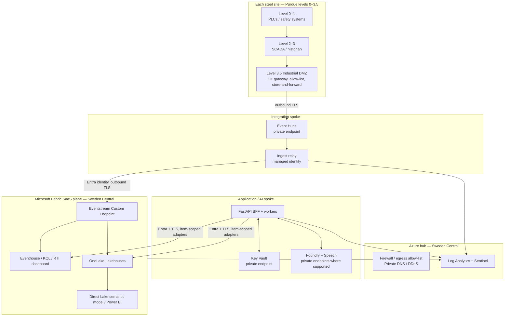
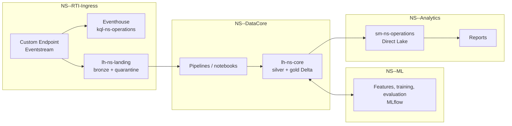

# NovaSteel — Deployment Topology and Operations

> **Status:** Authoritative deployment topology v1.0  
> **Date:** 2026-07-25  
> **Companion:** [solution-architecture.md](solution-architecture.md)  
> **Scope:** Environment placement, network/identity boundaries, capacity lifecycle, resilience, and deployment runbooks.

## 1. Topology decisions at a glance

| Decision | Authoritative choice |
|---|---|
| Primary EU region | **Sweden Central** for Fabric capacity, Event Hubs, application services, Foundry project, and Speech. |
| Fabric core | RTI Eventstream → Eventhouse/KQL and OneLake landing Lakehouse → core Lakehouse → Direct Lake semantic model → Power BI. |
| Environments | `dev`, `test`, `demo`, and `prod` are separate resource groups, identities, Fabric workspaces, data paths, and capacity assignments. |
| Demo isolation | `NS-DEMO-*` only; F2 initially, F4 after measured need, F8 as the pre-approved demo-day burst tier; no production capacity, source, identity, shortcut, or audio. |
| OT crossing | Per-plant industrial DMZ gateway → Event Hubs buffer; no cloud-initiated OT connection. |
| Capacity lifecycle | Demo/non-production only: scheduled **01:00 Europe/Luxembourg** Logic App pause check; authorized GUI request for resume; production capacity is never automatically paused. |
| AI placement | Sweden Central Foundry/Speech with Data Zone (EU) model deployment unless a single-region legal requirement selects a regional deployment. |
| DR posture | Reproducible Sweden Central primary; West Europe is an approved EU recovery target to validate, not automatic Fabric failover. |

## 2. Environment and regional placement

### 2.1 Environment topology

| Environment | Fabric capacity/workspaces | Data | Intended use | Capacity policy |
|---|---|---|---|---|
| `dev` | Isolated `NS-dev-*` workspaces/capacity assignment | Synthetic or approved masked test data only | Developer integration, contract tests | Pause when unused; no business demo dependency |
| `test` | Isolated `NS-test-*` workspaces/capacity assignment | Synthetic and approved test fixtures | Security, integration, performance, release validation | Scheduled pause permitted after test drain |
| `demo` | Isolated `NS-DEMO-*` RTI/DataCore/ML/Analytics workspaces | 100% `SYNTHETIC` / `DEMO-NONPERSONAL` | Repeatable 15-minute defense and rehearsal | F2 initial / F4 measured fallback / F8 demo-day burst, requestable from the portal capacity dialog with a recorded reason; 01:00 lifecycle check |
| `prod` | Isolated `NS-prod-*` Fabric workspaces and production application resources | Real EU operational/personal data only after gates | Pilot and production operations | No automated pause; capacity/SLO decision made after pilot measurement |

No Fabric workspace, OneLake shortcut, Eventstream connection, application configuration, Key Vault secret, or managed identity may bridge `demo` and `prod`. The synthetic dataset rule that entities start with `NS-DEMO-` is enforced in schema validation and UI banners.

### 2.2 Region placement matrix

| Service / data plane | Primary | Secondary/recovery posture | Reasoning and constraint |
|---|---|---|---|
| Fabric F capacity, workspaces, OneLake, Lakehouse, Eventhouse, Power BI | Sweden Central | West Europe recovery design to be tested | Fabric research and current region table support all Fabric workloads in Sweden Central. Power BI BCDR is not available by default there because its paired region does not support it; do not claim automatic BCDR. |
| Azure Event Hubs, relay, BFF/workers, Key Vault, monitoring | Sweden Central | West Europe only after DPO/data-transfer review and recovery test | Keeps operational data in one EU primary region and reduces cross-region paths. |
| Microsoft Foundry Agent Service | Sweden Central | West Europe alternative; France Central is viable if the narrowly available preview groundedness feature becomes an approved need | Sweden Central supports Agents/Responses API. North Europe is not an Agent Service anchor. Model/tool availability must be checked at deployment. |
| Azure Speech | Sweden Central | West Europe for separately approved custom-speech training/Whisper batch need | Sweden Central supports real-time, fast, and batch STT, but custom-speech training and Whisper batch are not assumed there. |
| Raw interview audio/transcript store | Sweden Central | No cross-region replication without DPO approval | Highly Confidential personal data; retention/deletion takes precedence over generic DR replication. |
| Offline demo pack | Access-controlled presenter's device plus controlled demo repository/artifact store | Local checked fallback | It must be usable when cloud/network access is unavailable and contains no production data or credential. |

### 2.3 Residency interpretation

- **Fabric location** is Sweden Central. Validate capacity provisioning, tenant home-region/Multi-Geo implications, and each workload in the target tenant before locking procurement.
- **Foundry Data Zone (EU)** stores data at rest in the selected region and processes prompts/responses within the EU data zone. It is not a guarantee that every inference remains in Sweden Central.
- **Foundry regional deployment** is required where policy says processing must stay in Sweden Central. The chosen model and deployment type must be validated against current regional catalog/quota.
- **West Europe** is not silently enabled as a replica. A production recovery copy needs a data inventory, DPO approval, encryption/retention controls, and a tested restore runbook.

## 3. Logical and network topology



### 3.1 Network rules

| Flow | Permit | Deny / control |
|---|---|---|
| OT to DMZ | Only approved plant protocol and source allow-list | No cloud-originated command, RDP, or general IT routing to PLC/safety networks |
| DMZ to Azure ingress | Outbound Event Hubs route over TLS with per-plant identity and certificate/egress policy | No inbound Azure session into the OT network |
| Azure integration to Fabric Custom Endpoint | Outbound TLS and Entra authentication from relay | No SAS key in code/configuration; endpoint/tenant feature tested before production |
| Fabric to Azure Event Hubs/IoT Hub | Fabric Managed Private Endpoint where the chosen Eventstream source uses it | Do not assume private endpoints apply to every Fabric SaaS/custom-endpoint path |
| Application to Key Vault/Event Hubs/AI services | Private endpoints, private DNS, managed identity | Public network access disabled except an approved documented service limitation |
| Browser to application | HTTPS 443 through approved ingress/WAF | CORS restricted to portal origins, no admin management endpoint exposed to browser |
| Application to Fabric | TLS/Entra with approved Fabric query/semantic endpoints | No static connection strings or broad workspace admin identity |

Fabric is SaaS, not a customer-managed VNet subnet. The design uses Fabric managed private endpoints only where the service documents them; it does not falsely represent the Eventstream Custom Endpoint or every Fabric data-plane endpoint as a private IP. Any remaining Fabric SaaS route is an approved outbound TLS/Entra exception with explicit firewall/DNS policy, monitoring, and no OT reachability.

### 3.2 Subnet and resource-group recommendation

| Resource group / subnet | Contents | Notes |
|---|---|---|
| `rg-ns-<env>-hub` / `snet-hub-services` | Firewall, DNS resolver, Bastion if approved, monitoring connectivity | Shared hub services; no workload data plane. |
| `rg-ns-<env>-integration` / `snet-integration` | Event Hubs private endpoint, relay, approved queue/replay services | Per-plant Event Hub authorization and telemetry ingress. |
| `rg-ns-<env>-apps` / `snet-apps` | BFF, workers, knowledge orchestrator, internal ingress | No direct OT network route. |
| `rg-ns-<env>-ai` / `snet-ai-private-endpoints` | Foundry/Speech private endpoints where supported, private DNS links | Separate AI boundary and outbound policy. |
| `rg-ns-<env>-fabric` | Fabric F capacity ARM resource only | Capacity is Azure control-plane resource; Fabric items live in workspaces. |
| `rg-ns-<env>-monitoring` | Application Insights, Log Analytics, Sentinel connections, alerts | Retention/diagnostics set per security policy. |

Resource names carry `novasteel`, `<env>`, and `sc`/`we` placement, for example `cap-novasteel-demo-sc`, `evh-novasteel-prod-sc`, and `ca-novasteel-bff-prod-sc`. Tags include `environment`, `dataClassification`, `owner`, `costCenter`, `expiry` (mandatory for demo), and `recoveryTier`.

## 4. Fabric deployment topology



### 4.1 Fabric capacity assignment

| Workload | Demo assignment | Production assignment |
|---|---|---|
| RTI/Eventstream/Eventhouse/KQL | Demo F capacity, bounded replay rate and narrow hot tables | Production F capacity selected from measured concurrent ingestion/query/Power BI/Spark profile |
| Lakehouse/pipelines/notebooks | Same demo capacity, scheduled so rehearsal does not collide with live stream | Production capacity/workload isolation decision after pilot |
| Direct Lake/Power BI | Same demo capacity, all users Pro/PPU/trial below F64 | User licensing/capacity sizing based on audience and report workload |
| Spark autoscale | Disabled by default | Opt-in only after workload/cost review |

The Fabric workload table says all workspaces are a shared capacity pool. F2 is the smallest listed F SKU and is the cost-conscious starting point; F4 is a measured-contention fallback and F8 the pre-approved demo-day burst tier. Each step doubles the hourly rate, so the portal capacity dialog requires an explicit reason and writes the change to the append-only audit trail. The architecture neither guarantees F2 performance nor encodes an hourly price. Query the official pricing page and calculator for Sweden Central at purchase time.

### 4.2 Item deployment and promotion

1. Store deployable Fabric definitions, notebooks, pipelines, semantic-model metadata, data contracts, and parameter files in source control where the specific Fabric item supports Git/deployment integration.
2. Deploy `dev` → `test` → `demo`/`prod` with environment-specific identifiers, capacities, workspace IDs, and connection references; never copy a production connection into demo.
3. Use Fabric APIs only after endpoint-specific identity, throttling, long-running operation, and service-principal support is proven. Fabric item automation is separate from ARM capacity lifecycle.
4. Run post-deploy smoke tests: workspace/item existence, OneLake roles, Eventstream input/output, KQL table query, bronze/silver/gold reconciliation, semantic model refresh/query, alert notification, and policy/label verification.
5. Roll back application/Fabric definitions through a previously validated version. Do not “roll back” by deleting source data, Eventstream history, audit facts, or a shared capacity.

## 5. Capacity startup, pause, and shutdown runbook

### 5.1 State model

```mermaid
stateDiagram-v2
  [*] --> Paused
  Paused --> ResumeRequested: GUI request / approved schedule
  ResumeRequested --> Resuming: BFF calls ARM resume
  Resuming --> ReadinessCheck: ARM operation succeeds
  ReadinessCheck --> Running: Fabric + app health green
  ReadinessCheck --> Paused: health fails; alert operator
  Running --> DrainRequested: manual end-demo / 01:00 lifecycle policy
  DrainRequested --> Draining: stop simulator; check jobs and consumers
  Draining --> SuspendRequested: safe-to-pause checks pass
  SuspendRequested --> Paused: ARM suspend succeeds
  Draining --> Running: check fails; alert and leave capacity available
  Resuming --> Failed: ARM operation fails
  SuspendRequested --> Failed: ARM operation fails
  Failed --> Paused: operator investigates/acknowledges
```



### 5.2 Roles and responsibilities

| Action | Initiator | Execution identity | Required authority |
|---|---|---|---|
| Read capacity status | Any authenticated UI user | BFF read adapter | No mutation permission |
| Request demo resume/pause/scale | `Platform.Capacity.Manage` user | BFF `capacity-operator` | Application role plus audited reason |
| Perform ARM operation | BFF or Logic App | `mi-ns-capacity-demo` | Capacity-scoped `Microsoft.Fabric/capacities/read`, `write`, `suspend/action`, `resume/action` |
| Schedule 01:00 lifecycle check | Logic App workflow | Its dedicated system/user-assigned MI | Same capacity-only custom role |
| Production capacity lifecycle | Platform SRE/change process | Separate production identity | Approved change; never a demo GUI action |

The lifecycle identity has no Fabric workspace, OneLake, Key Vault-secret, application, Foundry, or subscription-wide Contributor role. Capacity ARM permissions do not grant data-plane access.

### 5.3 Daily 01:00 Logic App policy

**Scope:** `dev`, `test`, and `demo` only. The schedule is configured as **01:00 Europe/Luxembourg every day**, using the deployed Logic Apps time-zone mapping and explicitly tested across DST transitions. Production is hard-denied by environment tag and resource ID allow-list.

The 01:00 workflow is a **lifecycle check whose default action is orderly pause**, not an unsafe unconditional shutdown:

1. Read capacity state through ARM and record a correlation ID.
2. Verify the capacity is an allow-listed non-production F capacity and that the current time is outside an approved demo/rehearsal window.
3. Ask the BFF operations endpoint whether the simulator is stopped, Event Hubs/relay has drained or a replay checkpoint is recorded, no protected rehearsal is active, and no pipeline/notebook/semantic refresh is in the critical phase.
4. If any precondition fails, log `SKIPPED_BUSY`, notify the Platform Ops channel, and **leave the capacity running**. It must not kill a rehearsal or lose evidence to satisfy a cost timer.
5. If safe, submit:

   ```text
   POST https://management.azure.com/subscriptions/{subscriptionId}/resourceGroups/{resourceGroupName}/providers/Microsoft.Fabric/capacities/{capacityName}/suspend?api-version=2023-11-01
   ```

6. Treat `202 Accepted` as asynchronous. Poll the returned `Location`/`Azure-AsyncOperation` URL respecting `Retry-After`; do not report success until terminal success is returned.
7. Persist actor (`LogicApp:daily-0100`), policy version, precondition evidence, start/end state, ARM operation ID, duration, and result to the audit log/Log Analytics. Alert on failure without retry storms.

An organization may deploy a separately approved 01:00 **resume** policy for a specific scheduled event, but it must use the same allow-list, ARM polling, readiness check, cost approval, and audit. The default is pause because a generic automatic resume defeats the cost-control and attendance checks. Neither mode is enabled for production.

### 5.4 GUI start request and readiness procedure

The Platform Ops UI presents a read-only status pill to everyone. A real action is available only outside Demo Mode to `Platform.Capacity.Manage`; Demo Mode always simulates transitions.

1. The user enters a reason and requests start. The Blazor/React client calls `POST /v1/platform/capacity/start-requests`; it never calls ARM directly.
2. The FastAPI BFF validates Entra app role, environment, capacity allow-list, cost/budget state, no conflicting transition, and a current capacity state of `Paused`.
3. The BFF logs the human actor/reason and uses `mi-ns-capacity-demo` to submit the official ARM `resume?api-version=2023-11-01` operation.
4. It polls the long-running operation and exposes `Resuming` state via SSE/poll; 202 is not treated as started.
5. After ARM reports success, run a readiness checklist: Fabric workspace available, Eventstream/Eventhouse query succeeds, Lakehouse/semantic model reachable, required application APIs healthy, budget not breached, and demo simulator remains **paused**.
6. Only after readiness is green does Platform Ops mark the capacity `Running`. The presenter then starts the simulator/replay intentionally; capacity resume never starts a live scenario by itself.
7. A failed readiness check leaves the simulator stopped, reports correlation ID/log link, and provides a cached/offline fallback rather than retrying in front of a demo audience.

### 5.5 Orderly shutdown procedure

1. Pause the simulator/accelerated clock and prevent new demo requests.
2. Stop publishers; wait for in-flight batches to drain or record an explicit replay checkpoint.
3. Preserve run manifest, scenario seed, health report, capacity metrics, and audit records.
4. Confirm no presentation/rehearsal window, active data-refresh critical phase, or approved consumer operation is running.
5. Request pause through the BFF/Logic App only for the non-production capacity; ARM operation is polled to completion.
6. Remove temporary grants, close presenter sessions, and verify no publisher remains connected.

A paused Fabric capacity prevents content assigned to it from being available. It is therefore never paused while a live demo, RTI ingest, reporting consumer, scheduled pipeline, or production monitoring function needs it.

## 6. Cost model and controls

| Cost driver | Architecture control | Decision gate |
|---|---|---|
| Fabric capacity CU consumption | F2 initial demo, bounded stream, schedule notebooks, pause non-production safely, Capacity Metrics review | F4 on measured contention and F8 for a demo-day burst, both self-service through the audited portal dialog; any SKU above F8 needs a cost-owner sign-off and a policy allow-list change before the pilot load test |
| Power BI licenses | Pro/PPU/trial for consumers below F64 | Do not buy F64 solely to avoid per-user licensing |
| OneLake/KQL/Activator retained data | Explicit retention/cache settings; quarantine and raw telemetry lifecycle; storage budget | Review after rehearsal/pilot; paused capacity does not erase storage cost |
| Spark/autoscale | Off initially; batch windows and measured notebook duration | Enable only with owner, budget, and workload evidence |
| Foundry model/token and Speech usage | Smaller approved model where suitable, transcript/upload quotas, budget alarms, cached demo responses | Re-evaluate model/deployment after actual usage and regional quota check |
| Event Hubs and relay | Partition/retention sized from observed throughput, store-and-forward rather than overprovisioning | Test peak/recovery replay, then reserve/scale only where justified |
| Logs/Sentinel | Classification-aware sampling/retention, no raw audio/prompt payload logging | Confirm security retention and budget jointly |
| DR | Reproducible infrastructure and artifacts first; cold/warm West Europe only after a justified RTO/RPO | Do not pay for untested duplicate capacity |

Capacity budgets, Azure cost alerts, tags, and the Fabric Capacity Metrics app are required. Capacity overage is disabled by default for the demo; any limited exception has a named owner and an expiry. Exact regional currency price is intentionally not written here because it is offer-, currency-, and date-specific.

## 7. Resilience and recovery topology

### 7.1 Availability posture

| Layer | Primary resilience mechanism | Degraded mode |
|---|---|---|
| OT telemetry | DMZ store-and-forward + Event Hubs replay, sequence/idempotency | Freshness/gap is visible; do not invent interpolated operational truth |
| Fabric hot path | Eventstream dual destination to KQL and bronze; replay from buffer/bronze | Cached semantic data/RTI screenshot for demo; production incident runbook |
| Lakehouse data | Immutable bronze, reconciled silver/gold, source-controlled transformations | Restore/reprocess from retained bronze/source extracts |
| Application/AI | Stateless BFF/workers, health probes, retry/backoff, queue/replay semantics | Manual/cached recommendation and text-based knowledge workflow |
| Foundry/Speech | Human review remains independent from model availability | Queue consented capture; manual transcript/draft; no auto-publish |
| Demo | Deterministic local replay, cached interactive assets, recording, static proof pack | First working fallback level is announced as replay/cached |
| Region | Sweden Central primary; reproducible infrastructure/deployables | West Europe recovery only after approved data/restoration validation |

### 7.2 Recovery principles

1. **No untested automatic cross-region Fabric failover.** Sweden Central’s documented Power BI BCDR caveat means RTO/RPO cannot be promised until a specific recovery design is exercised.
2. **Infrastructure and definitions are recoverable from source control/IaC.** Fabric item automation is validated per item; non-exportable state has a documented rebuild procedure.
3. **Bronze/replay data is the recovery source.** Reprocessing is preferred to manual silver/gold correction. Audit facts are retained as evidence and not deleted to “reset” a run.
4. **Demonstration resilience is local first.** The demo must finish even if Fabric, Foundry, Speech, market data, or the network is unavailable.
5. **Production recovery needs explicit service targets.** Before go-live, the business, OT, DPO, security, and platform owners agree RTO/RPO per data domain and test a restore in an EU recovery location.

## 8. Deployment sequence

| Step | Deployment action | Evidence required before next step |
|---|---|---|
| 1 | Provision resource groups, tags, budgets, hub/spokes, private DNS/endpoints, Key Vault, monitoring, and identities with Bicep/IaC | `what-if` review, Azure Policy/security gate, no public access exception unreviewed |
| 2 | Create F capacity and Fabric workspaces; assign workspace/OneLake roles, labels, and capacity | Region/SKU creation verified; demo and prod physically/logically separate |
| 3 | Deploy Event Hubs, DMZ gateway/relay, Eventstream Custom Endpoint, KQL/landing destinations | Identity path proven; no SAS secret; duplicate/late/invalid messages quarantined |
| 4 | Deploy Lakehouse tables, pipeline/notebook definitions, data-quality checks, Purview lineage | Bronze/silver/gold reconciliation and schema tests pass |
| 5 | Deploy model workers, BFF, Foundry/Speech connections, tool allow-lists, content controls, tracing | Entra-only auth; no direct write/OT path; evaluation and tool audit pass |
| 6 | Deploy Direct Lake model/Power BI and Blazor/MFE client | Persona/RLS checks, API contract/e2e, accessibility and stale/error behavior pass |
| 7 | Configure capacity lifecycle Logic App and GUI request flow | 01:00 skip/pause, resume LRO polling, denial, concurrency, and audit tests pass |
| 8 | Load demo seed/fallback pack and rehearse | Two consecutive successful scripts; full offline path verified |
| 9 | Production onboarding approval | DPO/legal, OT, security/RAI, capacity/DR, source/market-license gates are signed |

## 9. Topology validation checklist

### Before the demo

- [ ] `NS-DEMO-*` namespaces only; every displayed record carries synthetic classification and visible banner.
- [ ] Demo F capacity is running and within budget, or local replay/fallback has been selected deliberately.
- [ ] Eventstream, KQL, landing/core lakehouse, semantic model, and API freshness checks are green.
- [ ] Simulator is seed/manifest matched; event sequence, expected values, and quarantine report are verified.
- [ ] GUI capacity control is visibly **Simulated** when Demo Mode is on.
- [ ] Browser, recording, screenshots/PDF, JSON results, WAV/transcript, and static proof pack work without network.

### Before non-synthetic pilot/production

- [ ] Target Fabric/Foundry/Speech regional availability, quota, deployment type, and private-network support were rechecked at deployment time.
- [ ] DPO approved DPIA, lawful basis, consent/erasure workflow, retention, and any West Europe recovery copy.
- [ ] Legal confirmed AI Act classification and production human-oversight evidence requirements.
- [ ] OT/ICS owner signed off the DMZ protocol/egress design; no cloud-to-OT control path exists.
- [ ] Custom Endpoint Contributor blast-radius test, Fabric tenant switches, and query adapter identity test passed.
- [ ] Capacity, Power BI license, cost budget, performance, recovery, and incident-response tests passed.
- [ ] Security release gates (identity, protected feeds, threat model, logging, data labels, agent tools, and supply chain) passed.

## 10. Official evidence used

| Topic | Citation |
|---|---|
| Fabric primary capability and cost/region research | [Fabric platform research](../research/fabric-platform.md) |
| Fabric region support and Sweden Central BCDR caveat | [Fabric region availability](https://learn.microsoft.com/fabric/admin/region-availability) |
| Capacity licensing/F SKU and viewer requirements | [Understand Microsoft Fabric licenses](https://learn.microsoft.com/fabric/enterprise/licenses) |
| Pause/resume behavior and required ARM actions | [Pause and resume your Fabric capacity](https://learn.microsoft.com/fabric/enterprise/pause-resume) |
| ARM resume/suspend async operation/API version | [Resume API](https://learn.microsoft.com/rest/api/microsoftfabric/fabric-capacities/resume), [Suspend API](https://learn.microsoft.com/rest/api/microsoftfabric/fabric-capacities/suspend) |
| Eventstream managed identity Custom Endpoint role requirement | [Connect to Eventstream using Managed Identity](https://learn.microsoft.com/fabric/real-time-intelligence/event-streams/connect-using-managed-identity) |
| Eventstream managed private endpoint support/limits | [Connect to Azure resources securely using managed private endpoints](https://learn.microsoft.com/fabric/real-time-intelligence/event-streams/set-up-private-endpoint) |
| Foundry/Speech region, identity, deployment, and tool caveats | [Azure AI regions research](../research/azure-ai-regions.md), [Foundry Agent Service limits/regions](https://learn.microsoft.com/azure/foundry/agents/concepts/limits-quotas-regions), [Foundry authentication](https://learn.microsoft.com/azure/foundry/concepts/authentication-authorization-foundry), [deployment types](https://learn.microsoft.com/azure/ai-foundry/foundry-models/concepts/deployment-types) |
| Security control baseline | [Security governance and threat model](../security/security-governance-and-threat-model.md) |
| Synthetic/demo operational behavior | [Synthetic data and simulators](../data/synthetic-data-and-simulators.md), [demo runbook](../demo/demo-runbook.md) |
