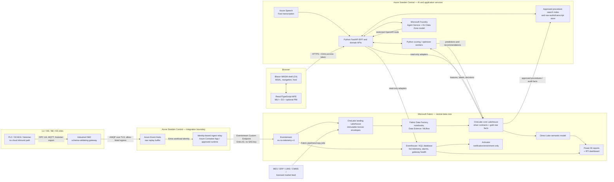
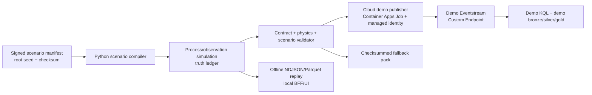
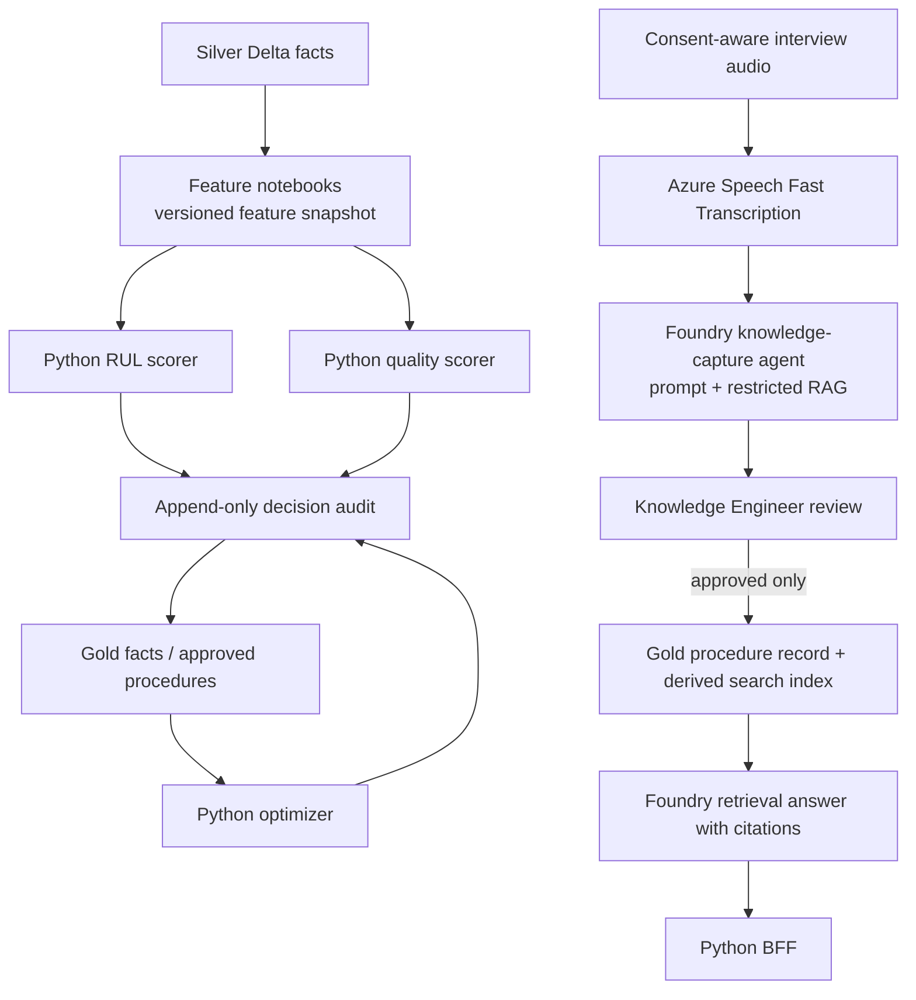
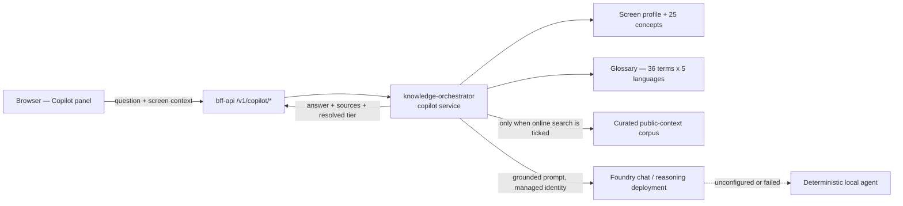
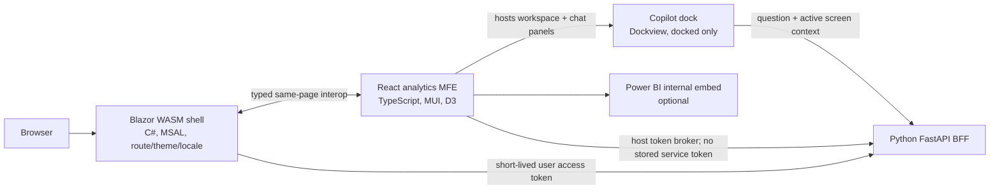

# NovaSteel — Authoritative Solution Architecture

> **Status:** Authoritative architecture v1.0  
> **Date:** 2026-07-25  
> **Scope:** Phase 0 synthetic demonstration and the production-ready target shape; this document does not authorize production control.  
> **Owning workstream:** `solution-architecture`  
> **Companion topology:** [deployment-topology.md](deployment-topology.md)

## 1. Authority, goals, and guardrails

This document resolves system-design choices across the completed business, data, UX, security, Fabric, and Foundry research workstreams. The use case and requirements remain authoritative for business outcomes; the security document remains authoritative for mandatory controls. Where those documents leave a technical choice open, this architecture is authoritative.

| Required outcome | Architecture response |
|---|---|
| 14% energy reduction target | Constraint-aware Python optimization service, Fabric energy/production history, human approval, and an auditable savings ledger. |
| 22% CO₂ reduction target | Gold emissions and ETS facts, Direct Lake reporting, and traceability from dispatch recommendation to outcome. |
| 21-day lining warning target | Physics-informed Python model with feature lineage, uncertainty, daily scoring in the pilot, and advisory-only alert/work-order flow. |
| 8% high-grade-yield target | Quality/genealogy gold model, explainable risk prediction, what-if recommendation, and no automatic recipe or setpoint write. |
| Knowledge preservation | Consent-aware Speech-to-Text (STT), Foundry Agent Service, reviewed procedures, and citations to an approved source corpus. |
| Four-country scale | EU-hosted, Fabric-centred OneLake data product with plant-scoped security and a stable event/API contract. |

### 1.1 Non-negotiable boundaries

1. **Microsoft Fabric is the central operational analytics core.** Real-Time Intelligence (RTI), Eventstream, Eventhouse/KQL, OneLake/Lakehouse, governed gold data, semantic model, and Power BI are not optional side systems.
2. **The platform is decision support, not a safety or control system.** No application, agent, Activator rule, pipeline, or demo control writes to a PLC, safety interlock, furnace, or production setpoint. Existing OT safety systems remain authoritative.
3. **Phase 0 is synthetic-only.** The demo has isolated `NS-DEMO-*` data, identities, workspaces, capacity, and fallback assets. It never shares a table, storage path, semantic model, or credential with production.
4. **EU-only processing is required.** Sweden Central is the primary placement. A Data Zone (EU) model deployment is EU-zone processing, not a single-region guarantee; a regional deployment is required if policy requires processing only in Sweden Central.
5. **Every consequential AI output is append-only auditable.** Inputs/feature snapshot, version, output, confidence, rationale, human decision, and outcome are correlated and retained under the security retention policy.

### 1.2 Architecture scope by delivery phase

| Capability | Phase 0 — defense/demo | Phase 1 — pilot | Phase 2+ — production scale |
|---|---|---|---|
| Sources | Deterministic simulator and approved replay files | One site, read-only historian/MES/CMMS/market feeds | Four sites, approved integrations |
| Ingestion | Eventstream custom endpoint from a demo simulator | OT gateway → Event Hubs buffer → identity-based relay → Eventstream | Same contract, per-plant relay and capacity measurement |
| AI | Cached/replayable results; optional live Foundry/STT | Shadow scoring; recommendations logged | Human-approved CMMS/scheduling write-back only after gates |
| Capacity | F2 initially; F4 only if measured rehearsal load requires it | Capacity sized from workload measurements | Capacity and resilience sized from agreed SLOs |
| Operational action | Simulated acknowledgement, work order, and schedule apply | Read-only/shadow | Explicit human approval, never autonomous OT control |

## 2. Explicit reconciliation of source documents

| Topic | Conflicting or incomplete input | Authoritative resolution |
|---|---|---|
| “C# for front” with Material UI/D3 and Python backend | The toolchain research prefers pure React for a Python backend; the UX recommends a Blazor shell hosting React/MUI. | Use a **Blazor WebAssembly C# shell** for sign-in, shell routing, navigation, locale/theme, and host lifecycle. Mount a **React/TypeScript analytics microfrontend** for MUI, D3, virtualized tables, and optional Power BI embedding. All business/data APIs remain Python/FastAPI. This honours the C# presentation requirement without pretending C# is the data backend. |
| MUI/D3 versions | Earlier UX/toolchain inputs named exact package versions from non-authoritative sources. | MUI and D3 are functional choices, not version promises. The lockfile pins a mutually compatible, vendor-supported release selected during bootstrap from the protected feed. No date-specific version in research is adopted without official support verification. |
| Runtime versions | Earlier toolchain notes stated exact future `.NET`, Python, React, FastAPI, and SDK versions that could not be treated as verified support commitments. | Use supported release channels and an explicit version-resolution policy in §12. Exact versions live only in lockfiles, `global.json`, CI provenance, SBOM, and release evidence. The one deliberately pinned service API version is Fabric capacity ARM `2023-11-01`, rechecked from the official REST reference. |
| Fabric capacity and Power BI licensing | F2 is cost-efficient; F64 changes free-viewer licensing. The UX wireframe illustrates F64. | Demo baseline is **F2** and all report consumers have Pro/PPU/trial. Move to F4 only after measurement. F64 is not selected merely for viewer licensing. Production SKU is a sizing decision, not an assumed architecture fact. |
| Fabric versus Foundry region | Fabric research selects Sweden Central; Foundry research discusses Data Zone and several EU regions. | Fabric, Event Hubs, application services, Foundry project, and Speech use **Sweden Central** by default. Foundry model deployments use **Data Zone (EU)** unless a confirmed legal requirement needs a regional deployment. West Europe is an EU contingency, not an implicit cross-region data replica. North Europe is not an Agent Service target. |
| Native Event Hubs source versus secretless identity | Fabric Eventstream’s documented basic Azure Event Hubs connector uses a Shared Access Key, while security policy prohibits standing secrets. | The canonical ingestion route is **Azure Event Hubs as a buffer + a managed-identity relay to an Eventstream Custom Endpoint using Entra ID**. The Custom Endpoint’s current contributor-role limitation is isolated to a dedicated ingress workspace (§8.1). Native Event Hubs source/SAS is rejected unless CISO grants a documented exception. |
| Managed identity assumptions | Azure managed identities, Fabric workspace permissions, Foundry identities, and browser identities are different authorization planes. | Identity boundaries are explicit in §9. An Azure identity does not inherit Fabric, Foundry, or OT permissions. The browser never receives a workload identity, capacity credential, or Foundry key. |
| Demo capacity control | UX makes capacity controls interactive in demo mode; Fabric research warns a paused capacity is unavailable. | The **Demo Mode toggle is always simulated**. The separate Platform Ops control can request a real demo-capacity resume only outside Demo Mode and only for an authorized operator. It never controls production capacity from the presentation path. |
| Embedded Power BI | Earlier UX input suggested “Embed for your customers,” while the platform serves internal Entra users with persona-scoped access. | Use **Embed for your organization (user owns data)** for internal users. Do not use app-owns-data/“for your customers” to bypass employee/RLS authorization. Any external-user embedding needs a separate ADR, application, data-sharing review, and threat model. |
| Demo and production retention | Synthetic-data retention is a small demo design; security policy defines production retention. | The synthetic catalog governs the demo. Production follows the security retention schedule; Eventhouse is an operational query store/cache, while OneLake/Lakehouse preserves governed history. “Hot” must name the store and duration, never be used ambiguously. |

## 3. Target architecture



### 3.1 Exact Fabric component choices

| Fabric layer | Chosen item and responsibility | Explicitly not used for |
|---|---|---|
| RTI ingress | `es-ns-telemetry-v1` Eventstream, Custom Endpoint source, lightweight route/shape/schema-version checks, dual delivery to KQL and landing Lakehouse | Complex joins, authoritative deduplication, long-running model scoring, or control decisions |
| Hot operations store | `evh-ns-operations` Eventhouse containing `kql-ns-operations` | Long-term master/reference data, PLC control, or the sole audit store |
| KQL tables | `telemetry_hot`, `alarm_hot`, `gateway_health_hot`, `model_inference_hot`, `ingest_quarantine_hot`; event-time/asset-oriented KQL materialized views | Replacing silver/gold Delta contracts |
| RTI visual | KQL/Real-Time dashboard for current signal, alert, data freshness, and gateway health | Board reporting or semantic KPI definitions |
| Landing | `lh-ns-landing` in OneLake; immutable `bronze_event_envelope`, `bronze_batch_*`, contract failures/quarantine | Direct user edits, semantic model source, or mixed production/demo data |
| Curated core | `lh-ns-core` in OneLake; typed Delta silver facts/SCD dimensions and gold star schema | Raw mutable landing or ungoverned notebooks |
| Transformation | Fabric pipelines/copy jobs for batch, Fabric notebooks/Data Science for validation, features, training, and batch scoring | Introducing an unmeasured always-on Spark/autoscale cost in the demo |
| Semantic | `sm-ns-operations` Direct Lake model over gold Delta tables only | Live 1–10 second telemetry; that stays in KQL/RTI |
| Power BI | `rpt-ns-executive`, `rpt-ns-sustainability`, and persona reports backed by `sm-ns-operations`; embedded only where a board/report surface adds value | The primary interactive operational UI, which remains MUI/D3 through the BFF |
| Activator | Threshold/state-transition/missing-heartbeat notification to Teams/email/approved workflow; may initiate enrichment | Safety alarms, direct OT action, or automatic capacity pause |

The core pattern follows the documented Fabric RTI/Eventstream/Eventhouse/Lakehouse/Direct Lake architecture in [fabric-platform.md](../research/fabric-platform.md). Eventhouse is deliberately a hot investigation layer; Lakehouse Delta is the governed historical, ML, and KPI substrate.

### 3.2 Workspace and item isolation

| Workspace | Items | Access and purpose |
|---|---|---|
| `NS-<env>-RTI-Ingress` | Eventstream, Eventhouse/KQL, `lh-ns-landing`, RTI dashboard | Narrow ingress blast radius. The Eventstream publisher identity is Contributor here only because current Custom Endpoint managed-identity guidance requires Contributor or higher. |
| `NS-<env>-DataCore` | `lh-ns-core`, pipelines, notebooks, semantic source tables | Curated data, OneLake security roles, Purview labels, no publisher identity. |
| `NS-<env>-ML` | feature notebooks, MLflow experiments/registry, evaluation artifacts | Data Scientist/ML identity only; no direct raw production-table mutation. |
| `NS-<env>-Analytics` | Direct Lake semantic model and Power BI reports | Persona viewers and report authors; no raw-audio access. |
| `NS-DEMO-<env>` | Separate demo copies of all required Fabric items | Synthetic-only, disposable namespaces, separate F capacity and no shortcuts to non-demo workspaces. |

`<env>` is `dev`, `test`, `demo`, or `prod`. A Fabric workspace role is a coarse boundary. OneLake security roles, sensitivity labels, and app authorization further restrict files/tables/columns. No shortcut crosses the `NS-DEMO-*`/production boundary. A OneLake shortcut is a read-through reference, not an isolation mechanism.

### 3.3 Lakehouse contracts

| Zone | Tables / contract | Rules |
|---|---|---|
| Bronze | Raw envelope JSON plus source metadata; `bronze_event_envelope`, `bronze_batch_mes`, `bronze_batch_cmms`, `bronze_batch_market` | Immutable append, original `event_ts`, `ingest_ts`, `event_id`, source, schema version, classification, seed/run when synthetic. |
| Quarantine | `quarantine_event`, `quarantine_batch` | Invalid units, missing reference key, conflicting duplicate, late/out-of-policy event, and schema failure are retained with reason; never silently repaired. |
| Silver | `fact_telemetry`, `fact_energy_interval`, `fact_quality_measurement`, `fact_maintenance_event`, `fact_model_inference`, `fact_ai_decision`; SCD2 `dim_plant`, `dim_asset`, `dim_sensor`, `dim_grade`, `dim_calendar` | Canonical units, idempotent `event_id`, event-time SCD lookup, late-data watermarking, source quality flag retained. |
| Gold | `fact_energy_daily`, `fact_emissions_daily`, `fact_production_shift`, `fact_quality_yield`, `fact_furnace_rul`, `fact_dispatch_recommendation`, `fact_knowledge_procedure`, `fact_ai_decision_audit` | Star schema, stable KPI definitions from requirements, semantic-model source only. |

The v1 event envelope is the one defined in [synthetic-data-and-simulators.md](../data/synthetic-data-and-simulators.md): UUIDv7 `event_id`, UTC timestamps, per-source sequence, asset/plant IDs, correlation ID, schema version, classification, scenario/seed for synthetic events, and a typed payload. Consumers tolerate additive fields within a major version; removals or semantic changes require a new major contract.

### 3.4 Retention resolution

| Data domain | Demo retention | Production retention / store | Resolution |
|---|---|---|---|
| Furnace telemetry | 90 days operational history; 3 years demo lake history | 13 months online raw history in OneLake, then governed aggregate/archive; Eventhouse operational cache starts at 90 days | The security retention policy governs production. “Hot” means available online history, not necessarily Eventhouse cache. |
| Rolling telemetry | 30 days operational history; 2 years demo lake history | 13 months online raw history in OneLake, then governed aggregate/archive; Eventhouse cache starts at 30 days | KQL retention is tuned for investigations, while Lakehouse retains the governed source. |
| Energy/dispatch decisions | Synthetic scenario history | 6 years | Supports finance/ETS evidence and recommendation reconciliation. |
| Furnace predictions/model evidence | Synthetic scenario history | Model lifetime plus 3 years; safety-relevant decision evidence retained for the applicable audit minimum | Model registry and audit records are separate, correlated assets. |
| Interview audio | Approved synthetic artifact only | 30 days by default after transcription/QA unless approved extension | Consent withdrawal/deletion is propagated from source. |
| De-identified approved knowledge | Demo session | Indefinite only after identity is decoupled and publication is approved | Unapproved transcript/draft does not become a general knowledge record. |
| Security/decision audit | Demo manifest and audit pack | 1 year hot + 6 years archive at minimum for applicable audit evidence | Requirements’ ≥7-year safety-audit assumption is met through the combined retention period; legal may extend it. |

## 4. Data and AI flows

### 4.1 Operational telemetry and batch flow

```mermaid
sequenceDiagram
  participant G as Production OT gateway
  participant H as Azure Event Hubs buffer
  participant R as Identity relay
  participant E as Fabric Eventstream
  participant K as Eventhouse / KQL
  participant L as OneLake landing
  participant C as Core Lakehouse

  G->>H: Versioned envelope; at-least-once delivery
  H->>R: Consume with scoped Entra identity
  R->>E: Custom Endpoint, Entra identity, correlation ID
  E->>K: Hot telemetry/alarm/event row
  E->>L: Immutable bronze envelope
  L->>C: Validate, deduplicate, normalize, SCD lookup
  C-->>C: Build gold facts and audit record
  Note over G,C: Late, duplicate, invalid-unit, and unknown-asset paths are visible and quarantined.
```

1. A per-plant gateway in the industrial DMZ terminates OPC UA, MQTT, or historian-export protocols. It emits only allow-listed, schema-validated telemetry through an outbound route; cloud systems never initiate a connection below the DMZ.
2. Azure Event Hubs is the source-side buffer and replay boundary. The gateway retains disk-backed store-and-forward state and preserves event time on recovery.
3. An approved relay consumes Event Hubs using its scoped workload identity and publishes to the Fabric Eventstream Custom Endpoint with Entra ID. This avoids a standing Eventstream SAS key.
4. Eventstream does only light shaping/routing and writes hot KQL data and immutable bronze data in parallel. Silver is the single deduplication/normalization contract, so streaming and batch converge.
5. Fabric Data Factory pipelines/copy jobs bring MES, ERP, LIMS, CMMS, and licensed market extracts to bronze on an incremental/CDC cadence. They do not replace their systems of record.

### 4.1.1 Synthetic simulator path

The simulator is a first-class workload, not a spreadsheet import. It uses the event envelope, SCD data, anomaly logic, physical checks, and named seeds from [synthetic-data-and-simulators.md](../data/synthetic-data-and-simulators.md).



- **Cloud rehearsal/demo:** a Python simulator runs as an Azure Container Apps Job (or equivalent supported Azure workload) with `mi-ns-demo-simulator`. It publishes directly to the isolated demo Eventstream Custom Endpoint with Entra ID. This avoids needing a live OT/Event Hubs dependency in the 15-minute demonstration.
- **Production-path test:** a separate integration test runs the gateway → Event Hubs → relay → Eventstream route to prove buffering, duplicate replay, late events, and recovery. It is not required to keep the scripted demo alive.
- **Offline replay:** the same signed event files and cached inference/optimization/transcript results are served by a local BFF/UI mode. It makes no cloud calls and is the second fallback level after live cloud.
- Every run records root seed, scenario ID, generator version, configuration checksum, simulated clock, row counts, truth-ledger checksum, and expected cue values. The default demo manifest uses the approved `240725` root seed; named anomaly scenarios use the documented scenario-seed policy. A run is presentable only after contract, physical, and scenario assertions pass.

### 4.2 Four AI capability flows

| Capability | Authoritative compute path | Input/output and governance |
|---|---|---|
| Furnace lining RUL | Python physics-informed model, trained/evaluated in Fabric notebooks/Data Science and served/scored by an approved Python worker | Silver thermal/cooling features → feature snapshot → P10/P50/P90 RUL, risk, drivers → `fact_furnace_rul`/audit. Pilot frequency is daily; near-real-time is a measured later enhancement, not an MVP claim. |
| Energy dispatch | Deterministic Python optimization worker is the authoritative solver; Foundry agent explains/orchestrates approved tool calls only | Forecast, market data, production constraints, maintenance windows → feasible baseline/optimized schedule → recommendation and constraint rationale. The agent cannot invent or commit a schedule. |
| Quality | Python quality-risk model, batch/nearline scoring with genealogy features | Heat/coil/process/quality context → risk, drivers, bounded what-if suggestion → gold model and audit facts. No direct recipe/setpoint write. |
| Knowledge capture | Azure Speech Fast Transcription plus Microsoft Foundry Agent Service | Consent + audio/text → transcript → draft procedure → human review → approved procedure/gold record → derived retrieval index. Drafts and unapproved transcripts never become operational instruction. |



### 4.3 Foundry Agent Service and STT design

1. Deploy one Foundry resource/project in **Sweden Central**. Use Microsoft Entra ID/RBAC, not application API keys, for production workloads.
2. Select a model only after the release gate verifies the required model, tool, quota, and Data Zone (EU) availability in Sweden Central. A currently supported general-purpose model may be chosen at deployment time; the architecture does not hard-code an unverified model family or future version.
3. Use a **Data Zone Standard (EU)** deployment for the normal knowledge/agent flow. It keeps inference in the EU data zone but can route within that zone. Use a regional Standard/Provisioned deployment only when legal policy requires single-region inference.
4. Use Speech **Fast Transcription** for recorded interview sessions because predictable synchronous latency, speaker separation, and language identification are needed; use batch only for approved historical backfill. Sweden Central supports the interview-critical STT modes. Custom-speech training/Whisper batch are not assumed there; West Europe requires a separate approved design if needed.
5. The raw recording is held in a restricted EU store for the approved retention period. The BFF records consent state, language, speaker role, retention deadline, and deletion request linkage before submitting audio. A transcript is classified Highly Confidential until de-identified/approved.
6. The Foundry knowledge agent has a restricted procedure search/retrieval corpus and a separate draft-writing tool. It cannot publish. The `Knowledge Engineer/Admin` approves, edits, or rejects a versioned draft; only the approved version is indexed for general retrieval.
7. The energy agent is an explanatory/orchestration surface. Its only OpenAPI tools are read/forecast/simulate and a separated propose endpoint. A commit endpoint independently validates a human approval record and is disabled outside approved production phases.
8. The **Copilot chat agents** are a third, read-only Foundry surface. They have **no tools at all**: the grounding material — screen profile, glossary definitions, and optionally the curated public-context corpus — is assembled by `knowledge-orchestrator` and passed in the prompt, so the model cannot reach data the caller is not entitled to see. One deployment serves the `default` tier and a separate reasoning deployment serves the `high` tier; `auto` is resolved before the deployment is chosen and the resolved tier is returned to the browser. If Foundry is unconfigured or a call fails, the service answers from the same grounding material through a deterministic local agent rather than failing or inventing.

### 4.4 Copilot chat grounding boundary



The chat never queries the lakehouse, the KQL database, or any operational API. It answers about *meaning* — what a metric is, how a model reaches it, what the regulation requires — while the dashboard itself remains the only source of *values*. That separation is what keeps a free-text surface inside the demo's data-protection envelope.

Conversation history is held in the `bff-api` process, scoped to the calling user, and is deliberately **not** persisted to Fabric: free-text questions attributable to a named operator would widen the classification surface for no demonstrative benefit. A container restart clears history, and the temporary-chat toggle skips the store entirely.

## 5. Experience, backend, and API design

### 5.1 Frontend boundary



The shell is a host, not a second business backend. The React bundle is versioned with the shell for Phase 0 to avoid shell/MFE contract skew. The shell exposes only typed context/events: `themeMode`, `locale`, `activePersona`, `site`, `demoMode`, navigation intent, toast, capacity request, and telemetry. It does **not** hand a workload credential to React.

The Copilot dock is a layout host inside the MFE, not a second application. Dockview manages a two-panel grid — the analytics workspace and the chat — with floating groups disabled, so the panel can be moved to any edge but never detaches into a free window. While the chat is closed no grid is mounted at all, which keeps the default dashboard render path unchanged. The layout is persisted per browser in `localStorage`; a stored layout that does not restore exactly the two known panels is discarded in favour of the default. The chat sends the active section, sub-view, and site with every question so an under-specified question such as "what is the risk" resolves against what the user is actually looking at.

### 5.2 Python service responsibilities

| Python service | Responsibility | Forbidden responsibility |
|---|---|---|
| `bff-api` | Entra token validation, persona/plant authorization, response shaping, SSE, audit initiation, capacity request mediation, Power BI internal embed mediation | Direct browser-to-Fabric credentials, direct PLC/MES control, authorization based only on hidden UI elements |
| `optimizer-worker` | Price/constraint validation, deterministic feasible schedule, what-if and recommendation persistence | Autonomous production schedule commit |
| `scoring-worker` | Approved RUL/quality scoring, model-version capture, drift metrics | Retraining/promotion without review |
| `ingest-relay` | Event Hubs consumer, canonical envelope validation, Custom Endpoint publisher, replay/health metrics | Curated-data access or user-facing APIs |
| `knowledge-orchestrator` | Consent/workflow coordination, STT request, draft/review state, Foundry tool mediation, Copilot chat grounding and conversation state | Publishing unreviewed procedures, answering from ungrounded model knowledge |
| `capacity-operator` | ARM long-running-operation mediation after policy checks | Browser-accessible capacity credentials or production auto-pause |

### 5.3 API contract

All HTTP APIs are `/v1`, JSON, TLS-only, Entra-protected, and return `correlationId` and `asOf` (UTC). Mutating requests require an `Idempotency-Key`, emit an append-only audit event, and reject stale/duplicate approvals. List responses use:

```json
{
  "items": [],
  "total": 0,
  "page": 1,
  "size": 50,
  "asOf": "2026-07-25T08:15:10Z",
  "correlationId": "01J..."
}
```

AI-derived values use a common shape:

```json
{
  "value": 19.65,
  "unit": "d",
  "confidence": {"p10": 18.69, "p50": 19.65, "p90": 20.61},
  "modelVersion": "lining-rul-piml:1.3.0-demo",
  "scoredAt": "2026-07-25T08:30:00Z",
  "drivers": [{"name": "heat_flux_6h_slope", "contribution": 0.29}],
  "sourceRefs": ["event:...", "procedure:..."]
}
```

| Route | Method | Caller/authorization | Contractual behavior |
|---|---|---|---|
| `/v1/me` | GET | Any authenticated user | Roles, plant scope, persona union, locale, permitted actions. |
| `/v1/command-center/summary` | GET | Persona-scoped reader | Gold/KQL summary with freshness; no raw personal data. |
| `/v1/realtime/alerts` | GET (SSE) | Authorized user | SSE preferred; reconnect/poll fallback exposes stale state. |
| `/v1/furnaces/{assetId}/lining-forecast` | GET | Assigned plant reader | RUL uncertainty, drivers, source snapshot, audit link. |
| `/v1/energy/schedules:simulate` | POST | `EnergyPlanner.Approve` or simulator role | Returns a feasible proposed schedule and constraint report; never writes an operational schedule. |
| `/v1/energy/recommendations/{id}:approve` | POST | `EnergyPlanner.Approve` + policy gate | Requires reason/approval context; Phase 0/1 returns simulated or shadow state. Phase 2 validates separate approved write connector. |
| `/v1/quality/batches` | GET | Quality-scoped reader | Genealogy/risk data filtered by plant/product permission. |
| `/v1/knowledge/interviews` | POST | Knowledge workflow role and consent | Creates consent-bound session; no raw audio appears in general analytics. |
| `/v1/knowledge/procedures/{id}:approve` | POST | Knowledge publisher role | Publishes a reviewed immutable version and triggers derived-index update. |
| `/v1/audit/decisions` | GET | Auditor/authorized owner | Queryable, export-audited record with model/input/decision/outcome lineage. |
| `/v1/platform/capacity` | GET | Authenticated user | Read-only lifecycle state; cached safely and marked stale if unknown. |
| `/v1/platform/capacity/start-requests` | POST | `Platform.Capacity.Manage` | Requests a demo-capacity resume outside Demo Mode; server-side policy and ARM polling only. |
| `/v1/platform/capacity/pause-requests` | POST | `Platform.Capacity.Manage` | Requests a demo-capacity pause after drain checks; never accepts an alert-triggered request. |
| `/v1/platform/capacity/sku-requests` | POST | `Platform.Capacity.Manage` | Resizes the non-production capacity within the policy-enforced SKU allow-list; leaves lifecycle state unchanged and is refused mid-transition. |
| `/v1/copilot/chat` | POST | Any persona-scoped reader | Answers from assembled grounding material only; returns the sources used, the resolved reasoning tier, and whether the curated public corpus was consulted. Never returns an operational value the caller could not already see. |
| `/v1/copilot/conversations/{id}` | GET, DELETE | Owning user only | History is owner-scoped and in-process; a conversation belonging to another user is indistinguishable from one that does not exist (`404`). |

Errors use `{ "code", "message", "correlationId", "retryable" }`. The BFF is the enforcement point; the frontend can hide an action but cannot authorize it.

## 6. Component responsibility matrix

| Component | Owns | Reads | Writes | Does not own |
|---|---|---|---|---|
| OT gateway | Protocol break, source sequence, local buffer, source quality | OT allow-list | Event Hubs buffer | Cloud business logic or inbound control |
| Event Hubs | Buffered transport/replay | Gateway events | Retained event partitions | Fabric semantic data |
| Ingest relay | Identity-based Fabric publishing, delivery telemetry | Event Hubs | Eventstream Custom Endpoint | Data curation/model scoring |
| Eventstream | Lightweight transform/route | Relay messages | KQL + landing | Long-term dedup or safety workflow |
| Eventhouse/KQL | Hot operational querying/dashboards | Eventstream hot data | Materialized views/RTI alert inputs | Master data and durable audit authority |
| Lakehouse/OneLake | Bronze/silver/gold data products and lineage | Eventstream/batch/pipeline data | Delta facts/dimensions | Direct OT control |
| Fabric Data Science | Feature engineering, training/evaluation, MLflow lineage | Silver/gold | Evaluations, approved predictions | Autonomous model promotion |
| Python workers | Optimization/scoring and domain validation | Gold/features/approved inputs | Recommendations, predictions, audit intent | Fabric security administration |
| Foundry Agent Service | Grounded dialogue, retrieval, structured draft/explanation, per-tier Copilot chat answers | Approved corpus, constrained API results, and prompt-supplied chat grounding | Agent traces/drafts | Direct planner/CMMS/OT mutation, or reading data the caller cannot see |
| Azure Speech | STT only | Consent-approved audio | Transcript result | Procedure publication |
| BFF | User API, authorization, mediation, audit/correlation | KQL/gold/domain services | API response, workflow requests | Raw data lake ownership |
| Blazor/React | Persona experience and accessibility | BFF/Power BI only | User intent | Authorization or workload operations |
| Activator/Power Automate | Notification/enrichment | KQL condition | Teams/email/approved workflow signal | Capacity control or physical action |

## 7. Interfaces, ports, and protocols

| From → to | Protocol / port | Identity and data rule | Notes |
|---|---|---|---|
| PLC/SCADA/historian → DMZ gateway | OPC UA, MQTT, vendor historian export; plant-local only | OT identities; allow-list source tags | No cloud-originated session below DMZ. |
| DMZ gateway → Azure Event Hubs | AMQP over TLS 1.2+ / 5671 or HTTPS 443 if policy requires | Per-plant workload identity, mTLS/egress policy, producer-only scope | Store-and-forward and at-least-once semantics. |
| Relay → Eventstream Custom Endpoint | Event Hubs-compatible endpoint over TLS 443/AMQP as supported | Azure managed identity with Contributor only in isolated ingress workspace | No SAS key. Recheck feature/tenant settings before production. |
| Eventstream → Eventhouse/Lakehouse | Fabric-managed data plane | Fabric item permissions | Eventstream routes; no control semantics. |
| Batch systems → Fabric pipelines | HTTPS 443, SFTP/approved connector as applicable | Per-source connection identity, private path where supported | Connector/authentication is an integration acceptance gate. |
| Browser → BFF | HTTPS 443 + SSE over HTTPS | Entra user access token, role/plant scope | CORS restricted to portal origin; no token logging. |
| BFF → KQL/OneLake query adapter | HTTPS KQL / supported SQL or OneLake API over TLS | Dedicated read identity, item/table scope | Validate exact Fabric endpoint/service-principal support in each tenant before production. |
| BFF/worker → Foundry/Speech | HTTPS 443 | Entra managed identity, Foundry RBAC | No model API keys in production. |
| Foundry agent → BFF OpenAPI tools | HTTPS 443, OpenAPI | Foundry project/agent identity, tool allow-list | Read/simulate by default; commit is separately policy-gated. |
| Capacity operator/Logic App → ARM | HTTPS 443 `management.azure.com` | Dedicated capacity lifecycle identity | Uses official suspend/resume ARM operation; polls 202 async operation. |
| Telemetry/traces → App Insights/Sentinel | HTTPS 443/OpenTelemetry | Component identity, classified fields only | Redact audio, transcript, secrets, and sensitive prompt content. |

## 8. Security, privacy, and identity boundaries

The detailed mandatory control catalog is in [security-governance-and-threat-model.md](../security/security-governance-and-threat-model.md). This architecture applies it to the runtime boundaries below.

### 8.1 Identity matrix

| Principal | Granted scope | Deliberately excluded |
|---|---|---|
| Human user | Entra app role, plant/persona scope, BFF access token | Azure resource management, raw transcript/audio unless specifically approved |
| `mi-ns-otgw-<plant>` | Event Hubs producer for its plant only | Fabric, Key Vault outside gateway scope, other plants |
| `mi-ns-ingest-relay-<env>` | Event Hubs consumer; Contributor in `NS-<env>-RTI-Ingress` only | `DataCore`, `ML`, `Analytics`, production/demo cross-access |
| `mi-ns-bff-<env>` | Key Vault retrieval and specifically approved read adapters | Capacity lifecycle, raw data mutation, Foundry management |
| `mi-ns-worker-<env>` | Feature/gold read and prediction/recommendation append path | OT/MES/CMMS direct write |
| Foundry project/agent identity | Named AI Search/storage/BFF tools required by that agent | Fabric workspace administration, broad subscription/resource group access |
| `mi-ns-capacity-demo` | Capacity-scoped `read`, `write`, `suspend/action`, `resume/action` only | Fabric data plane, production capacity, broad Contributor |
| GitHub OIDC deployment identity | Environment/resource-group scoped control-plane deployment | Persistent client secret, subscription Owner |

**Boundary rules**

- Azure RBAC, Fabric workspace/OneLake roles, Foundry RBAC, and application app roles are separate. Assignment in one plane confers no permission in another.
- Managed identity works only for a supported Azure/Arc workload. An arbitrary on-premises gateway cannot be described as a managed identity merely because it sends Azure telemetry. The plant gateway must run on a supported Arc/Azure-connected runtime or use a formally approved, short-lived certificate/workload-identity exception.
- The Eventstream Custom Endpoint documentation currently requires a Contributor-or-higher workspace role for the publishing identity. This is wider than desired, so the publisher is isolated in an ingress-only workspace and has no access to curated, BI, ML, or knowledge workspaces. Re-evaluate when Fabric offers a finer publisher role.
- Browser tokens are user tokens only. The BFF never returns Azure management tokens, Fabric capacity credentials, Foundry secrets, or Power BI service credentials.
- Agents receive an independent, narrow tool identity. A model response is never authorization.

### 8.2 Data classification and privacy

| Data class | Primary store | Access/handling |
|---|---|---|
| Synthetic `DEMO-NONPERSONAL` | `NS-DEMO-*` OneLake/approved fallback pack | Persistent UI banner; no production mix; safe replay only. |
| Confidential operational data | Fabric landing/core, Eventhouse | OneLake roles, label inheritance, plant scope, no public sharing. |
| Highly Confidential interview audio/transcript | Restricted EU audio/transcript store, derived reviewed records in Fabric | Consent, DLP, retention/deletion workflow, no broad report export. |
| Audit/model evidence | Gold audit facts plus immutable export/evidence path | Append-only API, access logging, retention required by security policy. |

Prompt shields, separation of untrusted retrieved content from instructions, tool allow-lists, full tool-call audit, human approval, and the security document’s STRIDE controls are mandatory. Neither an interview transcript nor a market-data payload is treated as trusted agent instruction.

## 9. Resilience, observability, and fallback modes

### 9.1 Service posture

This is a monitoring and decision-support platform, not hard real-time control. “Real-time” means promptly visible data for operational awareness; it is not a deterministic safety SLA. Capacity suspension, Eventhouse idle reactivation, source connector behavior, and model quotas must be tested rather than represented as guaranteed latency.

| Failure / degradation | Production response | Demo response |
|---|---|---|
| OT link/gateway outage | Buffer locally and in Event Hubs; retain original event time; show freshness/gap/queue depth; throttle backfill | Switch simulator to replay, preserve sequence/seed, show stale state |
| Eventstream/KQL issue | Bronze/replay path, alert platform team, use last known curated data with freshness indicator | Use cached KQL/lineage clip or local replay |
| Fabric capacity unavailable | No live dashboard claim; use approved recovery runbook; never pause capacity serving operations | Local deterministic replay → cached interactive → recorded flow → proof pack |
| Foundry/Speech unavailable | Do not block procedure approval; queue capture, use text/manual approved capture workflow | Approved WAV/transcript and pre-extracted draft |
| Price provider unavailable | Use last licensed snapshot with expiry; no new recommendation after freshness threshold | Deterministic price scenario/cached feasible result |
| Optimizer/model slow or infeasible | Surface reason/constraints; no implicit constraint relaxation | Show signed/cached result for matching seed after five seconds |
| BFF unavailable | Fail visibly, retain audit evidence, use Power BI/RTI direct read only where approved | Cached browser assets and fallback pack |

The demo fallback order is binding: **live cloud → local deterministic replay → cached interactive → recorded flow → static proof pack**. It must be rehearsed offline and no diagnosis consumes more than ten presentation seconds.

### 9.2 Observability and audit signals

| Layer | Required signals |
|---|---|
| Gateway/relay | `source_id`, partition/sequence, queue depth, oldest buffered event, connection state, event-time lag, duplicate count, publish retry count |
| Eventstream/KQL | input/output rate, failures, KQL ingestion/query latency, materialized-view health, quarantine rate, freshness |
| Lakehouse/pipeline | bronze→silver→gold row reconciliation, contract pass rate, late/invalid record count, pipeline duration, data freshness |
| Capacity | CU/utilization/throttling/cost from Capacity Metrics, pause/resume transition, active jobs, F SKU, budget alert |
| Models | input data version, model/config version, latency, confidence distribution, drift, prediction-vs-outcome, evaluation result |
| Foundry/STT | model deployment, response/tool-call outcome, safety filter result, quota/429 retry, evaluation, transcript status; redact sensitive content |
| Application | OpenTelemetry traces, request/error/latency, SSE reconnects, authorization denial, correlation ID |
| Security | Entra sign-in/audit, Key Vault, Fabric/Power BI activity, Purview, Sentinel detections, capacity lifecycle ARM activity |

Every flow propagates `correlation_id`; a decision audit record links it to event IDs, source snapshots, model/agent configuration, prompt/template version where applicable, human action, and outcome. The authoritative audit table is append-only through the BFF; a scheduled evidence export to immutable storage is the tamper-evidence boundary, not an unrestricted editable Delta table.

## 10. Architecture decision records

### ADR-001 — Fabric is the data and analytics core

**Status:** Accepted.  
**Decision:** Use Eventstream, Eventhouse/KQL, OneLake/Lakehouse, Fabric pipelines/notebooks, Direct Lake semantic model, and Power BI as the canonical analytics path.  
**Consequences:** Do not build a parallel generic data lake or BI store. Azure application services exist only for integration, API, and domain compute that Fabric does not provide.

### ADR-002 — Separate hot KQL from governed Delta

**Status:** Accepted.  
**Decision:** KQL/Eventhouse serves hot telemetry, operations investigation, RTI dashboards, and Activator input; Lakehouse Delta serves bronze/silver/gold, historical KPI, training, and semantic data.  
**Consequences:** KQL data is not the durable master for reference/audit history; dashboard queries choose the correct store by freshness need.

### ADR-003 — Sweden Central primary, EU-zone-aware AI

**Status:** Accepted, with deployment validation gate.  
**Decision:** Place Fabric and application resources in Sweden Central. Use Foundry Data Zone (EU) for ordinary inference; choose regional only for confirmed single-region requirements.  
**Consequences:** West Europe is a tested EU contingency. No automatic regional claim, Data Zone single-region claim, or unsupported North Europe Agent Service dependency is permitted.

### ADR-004 — Blazor shell plus React/MUI/D3 microfrontend

**Status:** Accepted.  
**Decision:** C# owns the Blazor WebAssembly shell; React/TypeScript owns data-dense dashboard components. Python/FastAPI owns domain APIs.  
**Consequences:** The interop contract is versioned and tested. A pure React replacement requires a documented stakeholder waiver; a second C# BFF is rejected.

### ADR-005 — Identity-based Custom Endpoint ingress

**Status:** Accepted with least-privilege mitigation.  
**Decision:** Use Event Hubs buffering and a managed-identity relay to an Eventstream Custom Endpoint rather than a SAS-based native Event Hubs connection.  
**Consequences:** Isolate the required Fabric Contributor publisher role in `RTI-Ingress`; do not place curated assets there. Reassess if Fabric adds a narrower role or direct Entra-authenticated Event Hubs source.

### ADR-006 — Python is authoritative for optimization/scoring; Foundry is not the controller

**Status:** Accepted.  
**Decision:** Deterministic, testable Python services calculate RUL, quality risk, and feasible dispatch schedules. Foundry agents explain, retrieve, and call restricted simulation tools.  
**Consequences:** LLM output cannot be the only calculation, cannot relax hard constraints, and cannot make a physical or financial commitment.

### ADR-007 — Human approval and no direct OT action

**Status:** Accepted.  
**Decision:** All safety-adjacent and financial decisions have an explicit human approval event. Phase 0 simulations have no real write connector.  
**Consequences:** Any request for automatic schedule/CMMS/OT action triggers security, legal, OT, and RAI-board review plus an updated threat model.

### ADR-008 — Demo is a separate deterministic product slice

**Status:** Accepted.  
**Decision:** The demo uses isolated namespaces, deterministic seeds/manifests, synthetic labels, cached results, and an offline pack.  
**Consequences:** Demo simplicity never becomes a justification for production data access, non-consented audio, or an untested cloud dependency.

### ADR-009 — No guessed runtime versions

**Status:** Accepted.  
**Decision:** Version selections are resolved through supported channels and protected feeds at build/release time, captured in lockfiles/SBOM/provenance.  
**Consequences:** The architecture will not perpetuate exact future-looking versions from research. Upgrade decisions are compatibility-tested and security-reviewed.

### ADR-010 — Internal Power BI embedding is user-owned data

**Status:** Accepted.  
**Decision:** Internal NovaSteel personas use Entra-based Embed for your organization/direct Power BI access, with RLS/role scope preserved.  
**Consequences:** App-owns-data embedding is not an internal authorization workaround and needs a new external-sharing design if ever proposed.

### ADR-011 — The Copilot chat explains, it does not retrieve operational values

**Status:** Accepted.  
**Decision:** The chat agents receive no tools. `knowledge-orchestrator` assembles the grounding material — active screen profile, matched glossary definitions, and, only when the user ticks Online search, a curated corpus of durable public-context entries with official sources. The model answers from that material and the answer carries the sources it used. Live web search is not enabled.  
**Consequences:** The chat cannot leak a value the caller is not entitled to see, and it cannot cite a page that changed after the demo was rehearsed. It also cannot answer a genuinely novel operational question — that is the dashboard's job, and the answer says so. Extending coverage means extending the glossary and screen profiles, which are reviewable artifacts, rather than widening a model's reach.

### ADR-012 — Conversations are in-process and never persisted to Fabric

**Status:** Accepted.  
**Decision:** Chat history lives in the `bff-api` process, keyed by the calling user, and is dropped on restart. A temporary-chat toggle skips storage entirely, and any conversation can be deleted by its owner.  
**Consequences:** Free-text questions attributable to a named operator never enter the governed estate, so no new retention, classification, or subject-access obligation is created for a demonstration. The cost is that history does not survive a deployment; that is stated in the UI rather than hidden. Dictation is likewise browser-side only, so no audio reaches the backend.

## 11. Implemented repository topology

```text
/
├── apps/
│   ├── portal-shell/                 # Blazor WASM C# host, MSAL, typed host bridge
│   └── analytics-mfe/                # React/TypeScript, MUI, D3, Power BI adapter
├── services/
│   ├── bff-api/                      # FastAPI routes, authz, query adapters, SSE
│   ├── optimizer-worker/             # Constraint solver and recommendation worker
│   ├── scoring-worker/               # RUL/quality inference and monitoring
│   ├── ingest-relay/                 # Event Hubs → Eventstream Custom Endpoint
│   └── knowledge-orchestrator/       # Consent, STT, draft/review workflow, Copilot chat grounding
├── simulator/
│   ├── manifests/                     # Seeded JSON scenarios, no personal data
│   ├── cli.py, generator.py           # Deterministic scenario entry point/orchestrator
│   ├── process/                       # Furnace, rolling, energy, quality process models
│   └── validators/                    # Contract, physics, scenario, checksum/schema checks
├── contracts/
│   ├── events/                       # JSON Schema: telemetry, quality, inference, alert
│   ├── openapi/                      # Versioned BFF and Foundry tool OpenAPI definitions
│   └── data/                         # Delta schema/SCD/KPI contract definitions
├── fabric/
│   ├── items/                        # Exported/Git-integrated Fabric definitions where supported
│   ├── notebooks/
│   ├── pipelines/
│   ├── semantic-model/
│   └── deployment-parameters/
├── infra/
│   ├── bicep/                        # Resource groups, identities, networking, monitoring
│   ├── policy/
│   └── scripts/                      # Idempotent deployment/validation; no credentials
├── tests/
│   ├── contract/
│   ├── integration/
│   ├── simulator/
│   └── e2e/
├── .github/workflows/                # OIDC only; protected feeds; SBOM/scanning
├── docs/
│   └── architecture/
└── NuGet.Config / pip configuration   # protected feed only
```

The local baseline was delivered in the order contract → simulator/validators →
Fabric item definitions → Python services → shell/MFE → integration tests.
Generated clients come from `contracts/openapi`, not duplicated hand-maintained
DTOs. All packages resolve only through the protected Python/NuGet feeds
mandated in the security document; JavaScript package acquisition requires the
same organization-approved supply-chain route before a clean restore or CI
audit.

## 12. Runtime and dependency resolution policy

1. Pin language SDK bands in source-controlled tool manifests (`global.json`, Python project constraints, `package.json`) only after compatibility testing; pin exact transitive versions in lockfiles.
2. Select an actively supported .NET LTS/runtime channel and an actively supported CPython release from their official support policies at bootstrap. Do not infer support from a blog, release aggregator, or the research matrix.
3. Resolve FastAPI, Pydantic, Uvicorn, React, TypeScript, Vite, MUI, D3, Azure SDKs, and Foundry/Fabric clients through the approved protected feed. Record the resolver output, hash, SBOM, security scan, and test result in release provenance.
4. Azure SDKs are service-specific; choose the minimum stable client API that supports the required Entra-ID path. Pin the Fabric capacity REST API only where the official ARM reference names it (`2023-11-01` at this review).
5. A dependency upgrade requires lockfile diff review, SBOM generation, vulnerability scan, contract/integration test, and rollback-compatible deployment. Preview packages/features cannot be on the demo critical path.

## 13. Deployment sequence and acceptance gates

1. **Foundation:** create EU resource groups, capacity, workspaces, names, tags, budgets, Entra groups, private endpoints where supported, Key Vault, monitoring, and GitHub OIDC trust.
2. **Fabric core:** provision Eventstream, Eventhouse/KQL tables, landing/core Lakehouses, OneLake roles/labels, pipelines, notebooks, semantic model, RTI dashboard, and Power BI reports.
3. **Ingress:** deploy Event Hubs, relay, Eventstream Custom Endpoint, and simulator. Prove identity, duplicate/late/quarantine, replay, and no cross-workspace access.
4. **Domain services:** deploy FastAPI/workers, query adapters, audit append path, optimizer, scoring, and Foundry tool OpenAPI surface.
5. **Knowledge path:** deploy Speech/Foundry, restricted storage/search, consent/review workflow, content filters, Prompt Shields, and traces.
6. **Experience:** deploy Blazor host/MFE, role-aware routes, API contract tests, SSE/poll degradation, accessibility checks, and Power BI internal embedding where needed.
7. **Demo proof:** load signed seed manifests, validate all scenario assertions, verify two consecutive 15-minute runs, exercise every fallback level, and verify no real action/production data.
8. **Production gate:** obtain DPO/legal classification, OT sign-off, model evaluation, capacity/region/connector proof, threat-model update, DR test, and security acceptance gates before onboarding any real site.

## 14. Evidence and re-check ledger

Research links below are official-source research documents; direct Microsoft Learn links were rechecked on 2026-07-25 for high-risk claims.

| Claim used | Evidence |
|---|---|
| Fabric RTI/Eventstream/Eventhouse/Lakehouse/Direct Lake choices, capacity caveats, pause behavior | [Fabric platform research](../research/fabric-platform.md); [Pause and resume Fabric capacity](https://learn.microsoft.com/fabric/enterprise/pause-resume) |
| Capacity ARM endpoint, `2023-11-01`, asynchronous 202 response | [Fabric Capacity Resume REST API](https://learn.microsoft.com/rest/api/microsoftfabric/fabric-capacities/resume) and [Suspend REST API](https://learn.microsoft.com/rest/api/microsoftfabric/fabric-capacities/suspend) |
| F2/F4/F64 licensing and Pro/PPU requirement below F64 | [Understand Microsoft Fabric licenses](https://learn.microsoft.com/fabric/enterprise/licenses) |
| Sweden Central Fabric availability/BCDR caveat | [Fabric region availability](https://learn.microsoft.com/fabric/admin/region-availability) |
| Eventstream Custom Endpoint supports Entra/managed identity but uses workspace Contributor-or-higher | [Connect to Eventstream using Managed Identity](https://learn.microsoft.com/fabric/real-time-intelligence/event-streams/connect-using-managed-identity) |
| Eventstream managed private endpoint limits and Event Hubs path | [Connect Azure resources securely using managed private endpoints](https://learn.microsoft.com/fabric/real-time-intelligence/event-streams/set-up-private-endpoint) |
| Foundry agent regions, tools, identity, EU model placement, STT | [Azure AI regions research](../research/azure-ai-regions.md); [Agent limits/regions](https://learn.microsoft.com/azure/foundry/agents/concepts/limits-quotas-regions); [Foundry authentication](https://learn.microsoft.com/azure/foundry/concepts/authentication-authorization-foundry); [model deployment types](https://learn.microsoft.com/azure/ai-foundry/foundry-models/concepts/deployment-types); [Fast transcription](https://learn.microsoft.com/azure/ai-services/speech-service/fast-transcription-create) |
| Functional, security, demo, and synthetic contract requirements | [Solution requirements](../specs/solution-requirements.md), [personas](../personas/personas-and-journeys.md), [synthetic data](../data/synthetic-data-and-simulators.md), [demo runbook](../demo/demo-runbook.md), [UX specification](../ux/dashboard-specification.md), [security/governance](../security/security-governance-and-threat-model.md) |

## 15. Open production-validation items

These are gates, not reasons to weaken the design:

1. Confirm the Fabric SKU/quota can be provisioned in the target subscription and measure F2/F4 demo load before spending approval.
2. Validate Eventstream Custom Endpoint managed-identity publishing, tenant switches, its Contributor-role blast radius, and the permitted network path in the target tenant.
3. Verify the selected Foundry model, Data Zone (EU) deployment type, Agent Service tool set, quota, and private-network design in Sweden Central immediately before deployment.
4. Confirm the exact Fabric data-plane query adapter supports the desired Entra service identity and item-level authorization; use a separately governed read projection if it does not.
5. Obtain legal/DPO confirmation of lawful basis, retention, EU AI Act classification, and any single-region requirement before processing non-synthetic interviews or production data.
6. Confirm OT vendor protocols, source ownership, historian export rate, and industrial-DMZ design with each plant.
7. Confirm market-data licensing, freshness SLA, and the approved CMMS/MES write-back interface before Phase 2.
