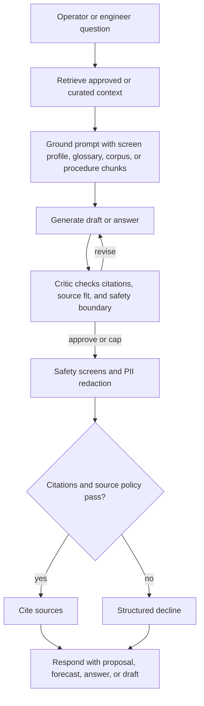

# AI Design

> **Artifact:** AI Design · **Audience:** architects, data science, risk · **Status:** baseline · **Source of truth:** [solution architecture](../architecture/solution-architecture.md)

NovaSteel uses AI only for decision support in a synthetic AxelorMetal steel-production scenario. Deterministic Python services remain authoritative for optimization and scoring; generative agents explain, retrieve, draft, and call restricted simulation tools without any OT, recipe, setpoint, schedule-commit, or plant-control write path.

## AI capability portfolio

| Capability | Technique | Inputs | Output | Human decision point | Determinism |
|---|---|---|---|---|---|
| Energy dispatch optimisation | Mixed-integer linear program in Python, modelled with PuLP and solved by CBC | Forecast/market slots, carbon intensity, production batches, urgent flags, hold/shift/concurrency constraints | Baseline and optimized schedules, whole-dispatch cost/CO2/peak deltas, constraint report, `modelVersion`, `auditRef` | Energy Planner reviews, approves, modifies, or rejects; approval remains simulated in the demo | Deterministic CBC with `threads=1` plus epsilon tie-break; labelled deterministic heuristic fallback |
| Refractory lining RUL | Physics-informed ordinary-least-squares regression over thermal features | Furnace telemetry for refractory thickness, heat flux, cooling water temperatures/flow, component/asset identity | P10/P50/P90 days, risk score/level, confidence, drivers, feature snapshot | Maintenance/Reliability Engineer decides whether to inspect or plan work | Pure Python regression and fixed risk/confidence formulas; raises when telemetry is insufficient |
| Quality prediction and what-if | Explainable deterministic risk/first-pass-yield model with bounded adjustments | Batch quality row, genealogy context, coiling-temperature bias, carbon-equivalent and bounded process adjustments | Current yield/risk and proposed first-pass-yield percentage with drivers | Process/Quality Engineer decides whether to act; no recipe or setpoint write exists | Deterministic formulas and explicit adjustment bounds |
| Knowledge orchestration | Consent-aware STT, grounded extraction, RAG, critic loop, human publish workflow | Consent record, audio/text, transcript segments, approved procedures | Draft procedure, approved procedure records, grounded answers with citations or decline | Knowledge Engineer/Admin reviews, edits, approves, rejects, or publishes | Local fixture adapters are deterministic; hosted agents are constrained by grounding, citations, safety, and review |
| Copilot explanation chat | Tool-free Foundry or deterministic local chat grounded by screen context, glossary and curated corpus | User question, optional screen context, five-locale language, glossary hits, BFF-provided grounding | Explanation answer, sources, resolved reasoning tier, concepts, persistence flag | User interprets explanation; dashboards remain the source of operational values | Deterministic local fallback; hosted chat has no tools and no data-plane access |

## Energy optimisation model

- **Authoritative module:** `services/optimizer-worker/src/optimizer_worker/milp.py`, surfaced through `EnergyDispatchOptimizer` in `service.py`.
- **Route:** `POST /v1/energy/schedules:simulate`.
- **Decision variable:** binary `x[b, s] = 1` means batch `b` starts in 15-minute slot `s`.
- **Feasible slots:** urgent batches are pinned to their planned slot.
- **Feasible slots:** non-urgent batches can move only within global/per-process shift limits and `maxHoldMinutes`.
- **Objective:** minimize `energyMWh * (co2_weight * carbon + cost_weight * price)`.
- **Tie-break:** tiny epsilon penalty for distance from planned slot and slot index.
- **Constraint 1:** each batch starts exactly once (`assign_b`).
- **Constraint 2:** no slot exceeds `maxConcurrentBatches` (`capacity_s`).
- **Constraint 3:** `minSoakMinutes` and `maxHoldMinutes` must form a valid hard constraint.
- **Solver:** PuLP formulates the model; CBC solves it with deterministic single-thread settings.
- **Fallback:** missing PuLP/CBC or non-optimal solve raises into a labelled `DETERMINISTIC_HEURISTIC` path.
- **Invariant:** baseline and optimized tonnage must match; otherwise the service raises an optimization error.
- **Invariant:** hard-constraint reports cover tonnage, urgent fixed batches, soak, hold, and capacity.
- **No violation posture:** the agent never computes the schedule itself and cannot commit it.
- **Measured demo result:** 960 = 960 tonnes conserved and zero hard-constraint violations.
- **Measured whole-dispatch result:** 7.25% cost reduction, 3.29% CO2 reduction, 7.89% peak reduction.
- **Measured peak:** 56.0 MW to 51.58 MW at a 280 EUR/MWh scarcity peak.
- **Transparency metric:** movable-reheat-load-only savings are exposed separately as `rawFlexibleCostPct` 21.74% and `rawFlexibleCo2Pct` 31.71%.

## RUL model

- **Authoritative modules:** `services/scoring-worker/src/scoring_worker/physics_features.py`, `rul_model.py`, and `service.py`.
- **Route:** `GET /v1/furnaces/{assetId}/lining-forecast`.
- **Feature extraction:** groups telemetry by sector and timestamp.
- **Thickness features:** current refractory thickness, fitted thickness slope, r-squared and slope standard error.
- **Corroborating features:** heat-flux current/slope/r-squared, cooling-water delta, flow, water-heat proxy, apparent thermal resistance.
- **Health feature:** normalized health index from current thickness against 300 mm minimum safe thickness and 400 mm healthy baseline.
- **Physics constraint:** the lining must be declining; slopes above the minimum wear-rate threshold are treated as non-actionable or horizon-clamped.
- **P50 derivation:** time-to-failure is `(currentThickness - minSafeThickness) / abs(thicknessSlope)`.
- **Uncertainty band:** slope standard error is propagated with a delta-method approximation.
- **Band formula:** `sigma_TTF = TTF * (se_slope / abs(slope))`.
- **Quantiles:** P10/P90 use z = 1.2816 around P50.
- **Risk score:** `risk = 1.32 - 0.0214 * RUL`, clamped to the model range.
- **Confidence:** weighted by regression r-squared, observation-window length, slope magnitude, and heat-flux fit.
- **Measured band:** P10/P50/P90 = 18.69/19.65/20.61 days.
- **Measured risk:** 0.8995 HIGH.
- **Measured confidence:** 0.7846.
- **Measured wear signal:** slope -3.21 mm/day at r2 = 0.88.

## Agentic layer

- Operations agents are separate from the Copilot chat route.
- `POST /v1/copilot/agent` reaches only operations agents and returns routing evidence.
- The single Foundry project is `novasteelv3`; the read/call boundary is now in `agent_manifest.py`.
- Knowledge agents hold retrieval tools only.
- Operations specialists hold one calculation tool each.
- The operations orchestrator is the deliberate exception and can call all four calculation tools.
- Tool routing is deterministic keyword scoring, not a supervisor model.
- Tool definitions live in `knowledge_orchestrator/agent_tools.py`.
- Tool bodies live in `bff_api/agent_tools.py` because the BFF owns caller identity, role, and plant scope.
- The registry is deny-by-default and refuses hallucinated or undeclared tools.

## Grounding and retrieval

- Approved-procedure RAG uses hybrid BM25 lexical ranking plus cosine semantic similarity.
- Reciprocal rank fusion combines the rankings with a fixed RRF damping constant.
- The system does not treat fused score as an absolute relevance threshold.
- A separate content-term overlap guard declines when no retrieved chunk shares a query content token of at least four characters.
- Chunks are deterministic section chunks over observation, recommended check, rationale, and safety boundary.
- Only `APPROVED` procedures can be indexed; drafts and review versions are rejected at index time.
- Retrieval answers must cite approved procedure ids or chunk ids.
- Hosted procedure-agent instructions embed the same canonical decline sentence enforced locally.
- Copilot chat grounding is assembled before generation rather than appended after the answer.
- Copilot material includes screen profiles, 36 glossary terms in five languages, and curated public-context entries.
- Supported locales are EN, FR, DE, NL, and ES.
- Screen context is opt-in and off by default.
- General mode omits screen/persona/site inference when no context is supplied.
- Reasoning tiers are explicit: `auto`, `default`, and `high`.
- `auto` resolves to high for long or why/compare/simulate-style questions and reports the resolved tier.

## Safety, guardrails, and refusal behaviour

- PII redaction runs before model and safety processing for the knowledge pipeline.
- Azure Content Safety can screen input and output through `AZURE_CONTENT_SAFETY_ENDPOINT`.
- The local heuristic fallback is deterministic and does not fail open.
- Severity at or above the configured threshold blocks.
- Structured decline reasons include `no_grounded_source`, `content_policy_violation`, and `citation_enforcement_failed`.
- Copilot chat has no tools.
- Copilot chat does not query the lakehouse, KQL database, or operational APIs.
- Copilot conversations are owner-scoped, in process, and never persisted to Fabric.
- Temporary chat skips the conversation store.
- `ONLINE_SEARCH_MODE` defaults to offline.
- Web IQ or web-search grounding leaves the Azure compliance boundary and needs DPO sign-off before enabling.
- `POST /v1/energy/schedules:simulate` and `POST /v1/quality/what-if` return proposals only.
- No OT control write, production schedule commit, CMMS write, recipe write, or setpoint write exists on any path.

## Model and deployment inventory

| Model/Service | Purpose | Where it runs | Enabling env var | Offline fallback |
|---|---|---|---|---|
| `EnergyDispatchOptimizer` / `energy-dispatch-deterministic:2.1.0` | Feasible dispatch proposal and savings | Python optimizer module, packaged with the BFF/Container Apps slice | Not yet defined for enabling; input source is selected by `BFF_DATA_SOURCE` | `DETERMINISTIC_HEURISTIC` when PuLP/CBC is unavailable |
| `ScoringWorker` / `lining-rul-piml:1.3.0-demo` | Furnace lining RUL | Python scoring module, packaged with the BFF/Container Apps slice | Not yet defined | No alternate model; invalid or insufficient telemetry raises a scoring error |
| `ScoringWorker` / `quality-risk:1.0.0-demo` | Quality risk and bounded what-if | Python scoring module, packaged with the BFF/Container Apps slice | Not yet defined | Deterministic formula remains local |
| Foundry knowledge agent | Draft procedure extraction and approved-procedure answers | `knowledge-orchestrator` plus Foundry Agent Service | `KNOWLEDGE_AGENT_MODE`, `FOUNDRY_ENDPOINT`, `FOUNDRY_PROJECT_ENDPOINT`, `FOUNDRY_CHAT_DEPLOYMENT` | `LocalFoundryKnowledgeAgent` |
| Speech Fast Transcription | Interview transcription | Azure Speech through `knowledge-orchestrator` | `KNOWLEDGE_SPEECH_MODE`, `SPEECH_ENDPOINT`, `SPEECH_REGION` | `LocalSpeechTranscriptionAdapter` |
| Procedure store and embeddings | Approved-procedure indexing and hybrid retrieval | Local store or Azure AI Search / Foundry embeddings | `PROCEDURE_STORE_MODE`, `FOUNDRY_ENDPOINT`, `FOUNDRY_EMBED_DEPLOYMENT`, `FOUNDRY_KNOWLEDGE_BASE` | Local store and `HashingEmbeddingProvider` |
| Copilot chat default/high tiers | Tool-free explanation chat | Foundry chat deployments or local deterministic chat | `COPILOT_CHAT_MODE`, `FOUNDRY_ENDPOINT`, `FOUNDRY_CHAT_DEPLOYMENT`, `FOUNDRY_REASONING_DEPLOYMENT` | `LocalCopilotChatAgent` |
| Online public context | Optional curated or web/IQ context | Offline corpus, Web IQ, or web-search provider | `ONLINE_SEARCH_MODE`, `COPILOT_SEARCH_ENDPOINT` | Offline mode and curated local corpus |
| Content safety | Input/output safety screening | Azure AI Content Safety or local heuristic | `AZURE_CONTENT_SAFETY_ENDPOINT` | `LocalHeuristicContentSafety` |

## Evaluation and acceptance

- Determinism is asserted through seeded simulator fixtures, fixed scenario packs, and repeatable Python calculations.
- The README validated proof reports 1,139 automated tests: 874 Python and 265 frontend.
- Repository validation has 19 gates through `tools/validation/Validate-Repository.ps1`.
- Live BFF validation reports 66/66 checks against the deterministic scenario.
- Fallback/no-network validation reports 12/12 checks.
- Energy acceptance includes equal tonnage, zero hard violations, and measured whole-dispatch savings.
- RUL acceptance includes the measured P10/P50/P90 band and the responsive wear slope.
- Quality acceptance includes a bounded synthetic what-if from 88% to 95% with no operational write.
- AI behaviour tests include `tests/knowledge/test_retrieval.py`, `test_grounding.py`, `test_content_safety.py`, `test_pii.py`, `test_critic.py`, `test_prompt_defense.py`, `test_agent_manifest.py`, `test_agent_router.py`, `test_agent_tools.py`, `test_agent_run_loop.py`, `test_copilot_agents.py`, `test_copilot_reasoning.py`, and `test_evaluation.py`.
- Backend AI tests include `tests/backend/test_optimizer_milp.py`, `test_physics_rul_model.py`, `test_copilot_api.py`, `test_agent_routes.py`, and `test_agent_tool_authorization.py`.

## Responsible AI posture

- The EU AI Act analysis classifies NovaSteel as high-risk-adjacent by conservative design, not currently Annex III high-risk.
- The product-safety high-risk route is held out by advisory-only design and absence of safety-function write-back.
- GenAI assistant transparency obligations apply because users interact with an AI system.
- Human-in-the-loop oversight is mandatory for consequential energy, maintenance, quality, and procedure outputs.
- Outputs are proposals, forecasts, explanations, or drafts, never automated decisions.
- Audit records capture model/version/output/human action for consequential flows.
- All demonstration data is deterministic, synthetic, and non-personal.
- No foundation model is trained or fine-tuned by NovaSteel.
- Formal Legal/DPO/DPIA/EU AI Act pilot decisions remain production gates.

## Known AI limitations

- Fixture/local fallbacks are intentional and must be labelled; they are not proof that cloud Foundry, Speech, Fabric, or AI Search are live in a target tenant.
- The Fabric scoring notebook still derives RUL P10/P90 from fixed multipliers while the Python service derives the band from fit residuals; the paths can disagree until aligned.
- The measured energy, CO2, RUL, and quality figures are single synthetic-scenario proof points, not realized production outcomes.
- The 14% energy, 22% CO2, 21-day warning, and 8% yield values remain pilot targets.
- Fabric data-agent grounding for Copilot is proposed in the design note and not implemented as a live app path unless explicitly enabled in a future change.
- Online search remains offline by default pending DPO sign-off.
- Model and deployment choices are verified at release time; unsupported or unconfigured hosted services fall back rather than inventing.

## Related artifacts

- [Glossary](glossary.md)
- [Diagrams](diagrams/README.md)
- [Solution Architecture](solution-architecture.md)
- [Data Baseline](data-baseline.md)
- [Security Baseline](security-baseline.md)
- [Compliance](compliance.md)
- [Operating Model](operating-model.md)
- [Test Strategy](test-strategy.md)
- [Business Value Assessment](business-value-assessment.md)
