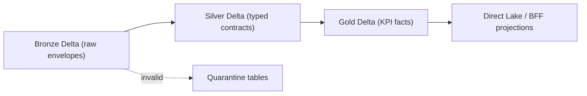

# Data Baseline

> **Artifact:** Data Baseline · **Audience:** data engineering, governance · **Status:** baseline · **Source of truth:** [synthetic data specification](../data/synthetic-data-and-simulators.md)

NovaSteel's data baseline is deterministic, synthetic, non-personal, and designed to exercise the same contracts the production target would use. This artifact summarizes domains, grain, contracts, Fabric assets, validation, lineage, and known gaps without replacing the full simulator and data-contract specifications.

## Data domains

| Domain | Entities | Owner persona | Refresh cadence |
|---|---|---|---|
| Plant and asset reference | Plant, area, line, asset, component, sensor, grade, calendar | Data/platform owner | On change; SCD2 for plants, assets, sensors, grades, tariffs. |
| Furnace and process telemetry | Sensor observations, heat flux, shell temperature, cooling circuits, blast data | Furnace Operator, Maintenance Engineer | 1-10 seconds; RUL features nearline/daily in pilot. |
| Rolling mill telemetry | Reheat furnace, stands, force, current, thickness, strip speed, coiling | Process Engineer, Quality Engineer | 100 ms raw to 10 seconds; demo-thinned to 1 second where needed. |
| Energy, emissions, and market | Meters, intervals, spot price, ETS price, carbon intensity, dispatch | Energy Manager, Sustainability Officer | Energy 1 minute; price 15 minutes; analytical facts daily. |
| Production and genealogy | Heat, slab, coil, bar, operation, shipment, route | Plant Manager, Quality Engineer | Event-driven and shift/day facts. |
| Quality | Samples, characteristics, chemistry, dimensions, defects, disposition | Quality Engineer | Event-driven; model warnings before visible off-spec samples. |
| Maintenance and reliability | Work orders, inspections, condition snapshots, failure modes | Maintenance Engineer | Event-driven; warning/work-order lifecycle retained. |
| Model inference and alerts | RUL, quality risk, alert lifecycle, top factors, model version | Data Scientist, Reliability Engineer | 1-15 minutes in synthetic catalog; daily pilot RUL claim. |
| Knowledge capture | Interview sessions, transcript segments, facts, procedure drafts | Knowledge Engineer/Admin | Event-driven; reviewed procedures only become approved knowledge. |
| Audit and platform | Decision audit, capacity lifecycle, correlation IDs, evidence exports | Compliance Auditor, Platform Ops | Append-only per consequential event. |

## Medallion layers



| Layer | Store | Format | Content | Retention |
|---|---|---|---|---|
| Real-time hot | `kql-ns-operations` in Eventhouse | KQL tables and mappings | `telemetry_hot`, `alarm_hot`, `gateway_health_hot`, `model_inference_hot`, `ingest_quarantine_hot` | 90 days telemetry, 365 days alarms, 30 days gateway/quarantine, 90 days inference. |
| Bronze | `lh_novasteelv3_landing` | Delta with JSON payload | `bronze_event_envelope`, batch sources, immutable accepted envelopes | Demo furnace 90 days hot / 3 years lake; rolling 30 days hot / 2 years lake. |
| Quarantine | Landing/core Lakehouse | Delta | `quarantine_event`, `quarantine_batch` with failure reasons | Queryable evidence; not silently repaired or deleted. |
| Silver | `lh_novasteelv3_core` | Delta | Canonical units, deduplicated facts, event-time SCD lookup, retained source quality | Governed history; production raw online starts at 13 months then aggregate/archive. |
| Gold | `lh_novasteelv3_core` | Delta star facts | Daily, shift, RUL, dispatch, procedure, audit, and semantic-model facts | Domain-specific: energy 6 years; model evidence lifetime plus 3 years; audit 1 year hot plus 6 years archive minimum. |
| Operational envelopes | `lh_novasteelv3_core` | Delta rows containing envelope JSON | Nine application-grain tables plus `manifest` for BFF Fabric reads | Same synthetic fixture provenance; regenerated/load-idempotent. |

## Canonical entities and grain

| Entity / table family | Grain | Primary or idempotency key |
|---|---|---|
| `bronze_event_envelope` | One accepted canonical event envelope. | `event_id`. |
| `quarantine_event` | One rejected event retained for investigation. | `quarantine_id`; idempotent by original event and reason. |
| `fact_telemetry` | One canonical telemetry observation at event time. | `event_id`. |
| `fact_energy_interval` | One plant energy interval. | `event_id`. |
| `fact_quality_measurement` | One quality measurement for batch and metric. | `event_id`. |
| `fact_maintenance_event` | One work-order or maintenance lifecycle transition. | `event_id`. |
| `fact_model_inference` | One model output for asset, model version, score time. | `event_id`. |
| `fact_ai_decision` | One append-only decision or outcome event. | `audit_id`; idempotent by correlation and decision sequence. |
| `dim_plant` | SCD2 version of a plant. | `plant_key`; idempotent by `plant_id`, `valid_from`. |
| `dim_asset` | SCD2 version of an asset. | `asset_key`; idempotent by `asset_id`, `valid_from`. |
| `dim_sensor` | SCD2 version of sensor and signal channel. | `sensor_key`; idempotent by `sensor_id`, `signal_code`, `valid_from`. |
| `dim_grade` | SCD2 version of a product grade. | `grade_key`; idempotent by `grade_code`, `valid_from`. |
| `fact_energy_daily` | One plant-day energy KPI. | `date_key`, `plant_id`. |
| `fact_emissions_daily` | One plant-day emissions KPI. | `date_key`, `plant_id`. |
| `fact_production_shift` | One plant production shift. | `shift_id`. |
| `fact_quality_yield` | One plant, grade, production-day yield KPI. | `date_key`, `plant_id`, `grade_code`. |
| `fact_furnace_rul` | One asset scored forecast. | `inference_id`. |
| `fact_dispatch_recommendation` | One energy dispatch recommendation. | `recommendation_id`. |
| `fact_knowledge_procedure` | One approved immutable procedure version. | `procedure_id`, `version`. |
| `fact_ai_decision_audit` | One append-only audit evidence record. | `audit_id`. |
| Operational envelope tables | One BFF-readable full envelope row. | `{event_id, envelope}` per dataset plus `manifest`. |

## Data contracts

| Contract file | Purpose |
|---|---|
| `contracts/data/bronze.v1.json` | Defines immutable bronze envelope and batch landing contracts. |
| `contracts/data/silver.v1.json` | Defines canonical units, event-time SCD lookup, event facts, and SCD dimensions. |
| `contracts/data/gold.v2.json` | Defines natural-key gold facts used by Direct Lake and BFF read projections. |
| `contracts/data/quarantine.v1.json` | Defines retained rejected-event and rejected-batch evidence contracts. |

Gold contract v2 intentionally uses natural business keys because the deterministic analytical demo emits gold facts directly and no SCD2 dimension load mints surrogate keys for that path. A future SCD2 dimension load can reintroduce surrogate keys only under a new contract version.

## Fabric asset inventory

| Asset | Type | Name |
|---|---|---|
| Demo workspace | Fabric workspace | `NovaSteelV3-Demo` |
| Demo capacity | Fabric F capacity | `novasteelv3fabric` |
| Eventstream | Eventstream | `es-ns-telemetry-v1` |
| Eventhouse | Eventhouse | `evh-novasteelv3-operations` |
| KQL database | KQLDatabase | `kql-ns-operations` |
| Landing Lakehouse | Lakehouse | `lh_novasteelv3_landing` |
| Core Lakehouse | Lakehouse | `lh_novasteelv3_core` |
| Initialize notebook | Notebook | `v3-initialize-lakehouses` |
| Reference load notebook | Notebook | `v3-load-reference-data` |
| Bronze seed notebook | Notebook | `v3-seed-bronze-from-pack` |
| Analytical gold load notebook | Notebook | `v3-load-analytical-gold` |
| Bronze-to-silver notebook | Notebook | `v3-bronze-to-silver` |
| Silver-to-gold notebook | Notebook | `v3-silver-to-gold` |
| Deterministic scoring notebook | Notebook | `v3-deterministic-demo-scoring` |
| Quality validation notebook | Notebook | `v3-validate-data-quality` |
| Ontology bindings notebook | Notebook | `v3-ontology-bindings` |
| Medallion pipeline | DataPipeline | `pl-novasteelv3-medallion` |
| Demo scoring pipeline | DataPipeline | `pl-novasteelv3-demo-scoring` |
| Semantic source asset | SemanticModel | `sm-novasteelv3-operations` |
| Data agent source asset | DataAgent | `da-novasteelv3` |
| Ontology source asset | Ontology | `onto_novasteelv3` |
| Graph model source asset | GraphModel | `onto_novasteelv3_graph_851e6dd07bb1441fa9e879bb6d2bb3b1` |
| RTI dashboard spec | KQLDashboard definition | `fabric/rti/dashboard-spec.json` |
| Activator spec | Reflex template | `fabric/rti/activator-rules.template.json` |
| Power BI catalog | Report metadata | `fabric/powerbi/report-catalog.json` |

## Data quality and validation rules

- Envelope fields are mandatory: event IDs, timestamps, source, plant, schema, classification, correlation, and payload.
- `event_id` must be UUIDv7 and globally unique after idempotent deduplication.
- `event_ts` may be at most five seconds beyond `ingest_ts` unless accelerated synthetic clock mode is declared.
- Demo rows must carry `SYNTHETIC`, `DEMO-NONPERSONAL`, and `NS-DEMO-*` plant scope.
- Conflicting duplicate payloads are quarantined; exact duplicates are deduplicated and measured.
- Plant, asset, sensor, material, grade, and work-order references must resolve at event time.
- Units must match the canonical registry or a versioned compatible conversion; invalid units are rejected.
- Numeric values must be finite; `NaN` and infinities are rejected.
- Enumerations are case-sensitive and versioned.
- Late records beyond policy go to quarantine; within-watermark lateness remains visible.
- SCD2 intervals are half-open, non-overlapping, and have exactly one current row per active natural key.
- Healthy sensor observations should stay inside configured hard ranges at least 99.7% of the time.
- Furnace heat balance must close within plus/minus 5%; rolling mass within plus/minus 0.8%; energy intervals within plus/minus 1.5%.
- RUL quantiles must be ordered and non-negative.
- Predicted lining thickness may not increase without a recorded repair or reline.
- Dispatch recommendations may not publish with hard production, safety, quality, or contractual constraint violations.
- Demo seeds must satisfy scenario assertions for 21-day RUL, cost-lowering dispatch, and quality warning before off-spec results.

## Lineage and audit

- Every generated run writes `manifest.json`, `checksums.json`, row counts, event-time bounds, anomaly intervals, expected KPI ranges, and validator results.
- Event envelopes carry `scenario_id`, `seed`, `generator_version`, `correlation_id`, classification, and privacy label.
- Silver joins facts to valid-time reference data at `event_ts`, not `ingest_ts`.
- Consequential AI outputs link input snapshots, model/config versions, output, confidence, rationale, human decision, and outcome.
- The audit chain is hash-chained and append-only; outcomes and erasure tombstones are appended rather than mutating prior records.
- GDPR Article 17 erasure targets four stores: interview transcripts, knowledge procedures, Copilot conversations, and the audit chain.
- Erasure hard-deletes transcripts/conversations, pseudonymizes procedure attribution, and appends an `erasure.executed` audit tombstone.
- `GET /v1/meta` reports `dataSource` so consumers know whether Fabric, fixtures, or Fabric fallback supplied the rows.

## Retention and residency

- Fabric, application services, Foundry, Speech, and the demo capacity are placed in Sweden Central unless a gate explicitly approves otherwise.
- West Europe is a recovery design to validate, not an automatic replica.
- Synthetic demo data is isolated in `NS-DEMO-*` namespaces and must not mix with production workspaces, storage, semantic models, or identities.
- Production raw history starts with 13 months online in OneLake, then governed aggregate/archive handling.
- Furnace telemetry has 90 days hot operational history and 3 years demo lake history.
- Rolling telemetry has 30 days hot operational history and 2 years demo lake history.
- Energy and dispatch decisions are retained for 6 years.
- Furnace predictions and model evidence are retained for model lifetime plus 3 years.
- Interview audio defaults to 30 days after transcription/QA unless an approved extension exists.
- Security and decision audit evidence is retained for 1 year hot plus 6 years archive minimum.
- The F2 capacity is paused outside demo windows for cost control; pausing capacity does not erase OneLake data.

## Synthetic data provenance

All NovaSteel demonstration data is deterministic synthetic data generated by the simulator, not production or personal data. Records are non-personal, reproducible from signed seeds and manifests, and labelled `SYNTHETIC` / `DEMO-NONPERSONAL`; generated identifiers use `NS-DEMO-*` plants and invented operator IDs.

Root README simulator commands:

```powershell
& .\services\bff-api\.venv\Scripts\python.exe -m simulator.cli demo --out .\output\demo
& .\services\bff-api\.venv\Scripts\python.exe -m simulator.cli validate --run-dir .\output\demo
& .\services\bff-api\.venv\Scripts\python.exe -m simulator.cli reset --out .\output\demo
```

Additional simulator commands documented in `simulator/README.md`:

```powershell
python -m simulator.cli list-analytical-scenarios
python -m simulator.cli generate-analytics --scenario analytical-programme-24m [--fast] [--parquet]
python -m simulator.cli validate-analytics --run-dir output\analytical-programme-24m [--skip-checksum]
python -m simulator.cli generate-operational
python -m simulator.cli generate-reference
```

## Known data gaps

- The Fabric deterministic scoring notebook derives RUL P10/P90 with fixed 0.80 and 1.30 multipliers, while the Python scoring service derives uncertainty from regression residuals.
- No Power BI report or Direct Lake semantic model is published for the workspace according to the documentation index, even though source and parameterized assets exist.
- The F2 Fabric capacity is paused outside demonstration windows, so live Fabric reads can fall back to committed fixtures.
- Root README known limitations still describe several tenant resources as gated; wave-10 docs describe the Fabric data streams as deployed and verified, so reviewers should confirm current tenant state before relying on live assets.
- Accelerator data-agent scoring measured DAX execution rather than answer accuracy; any Data Agent use needs answer-correctness gating.
- The platform has no connection to real sensors, ERP, MES, CMMS, or market feeds; all current streams are synthetic.
- Semantic reporting and dashboard import require tenant-bound RLS, labels, report definitions, and accessibility validation before executive use.

## Related artifacts

- [Glossary](glossary.md)
- [Diagrams](diagrams/README.md)
- [Solution Architecture](solution-architecture.md)
- [AI Design](ai-design.md)
- [Security Baseline](security-baseline.md)
- [Compliance](compliance.md)
- [Operating Model](operating-model.md)
- [Test Strategy](test-strategy.md)
- [Business Value Assessment](business-value-assessment.md)
