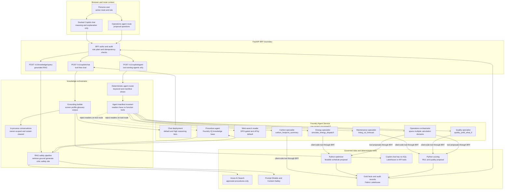
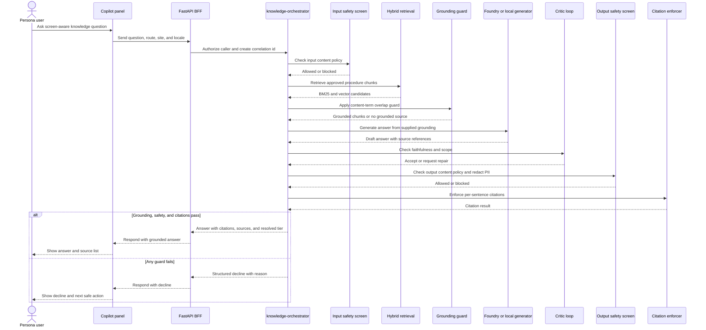

# Diagram - Agents Orchestration

> **Artifact:** Diagram / AI Agents Orchestration · **Audience:** AI architects and security reviewers · **Status:** baseline · **Source of truth:** [solution architecture](../../architecture/solution-architecture.md)

## Purpose

This page shows the NovaSteel agent topology and the grounded knowledge-answer path. It distinguishes Copilot chat, which receives prompt-supplied grounding and no tools, from operations agents that can call deterministic BFF tools only as proposal surfaces.

## Orchestration topology

How to read this: the chat route and agent route are separate admission surfaces. The chat route cannot call tools or query Fabric directly. The operations route admits only agents that declare calculation tools in the manifest, and the BFF tool body re-applies the caller's role and plant scope before returning a proposal.

## Grounded knowledge question sequence

How to read this: a knowledge answer must retrieve approved content, survive grounding checks, pass safety screens, and carry citations. If any control fails, the service declines rather than inventing or using ungrounded model knowledge.

## Guardrails and ADR alignment

| Guardrail | Repository baseline |
|---|---|
| Copilot chat has no tools | ADR-011 states chat receives no tools and answers only from prompt-supplied grounding material. |
| Chat has no data-plane access | Chat does not query KQL, Lakehouse, operational APIs, or Fabric values; the dashboard remains the source of values. |
| Conversations are in-process | ADR-012 keeps Copilot chat history in the BFF process, owner-scoped, restart-cleared, and not persisted to Fabric. |
| Deterministic compute remains in Python | ADR-006 keeps MILP dispatch, RUL, quality, and carbon calculations outside LLM reasoning. |
| Human approval remains mandatory | ADR-007 requires explicit approval for safety-adjacent or financial decisions and forbids automatic operational commitments. |
| Single Foundry project with manifest boundary | ADR-020 places reader and tool-calling agents in one project but enforces the no-reader-tools invariant in the agent manifest and tests. |
| RAG safety pipeline | Input and output safety, hybrid retrieval, overlap guard, PII redaction, citation enforcement, and structured decline are required. |
| Online search is gated | Web IQ or web-search grounding is off by default and needs DPO approval because it leaves the Azure compliance boundary. |

## Related artifacts

[Glossary](../glossary.md) · [Solution Architecture](../solution-architecture.md) · [Data Baseline](../data-baseline.md) · [AI Design](../ai-design.md) · [Security Baseline](../security-baseline.md) · [Compliance](../compliance.md) · [Operating Model](../operating-model.md) · [Test Strategy](../test-strategy.md) · [Business Value Assessment](../business-value-assessment.md)
