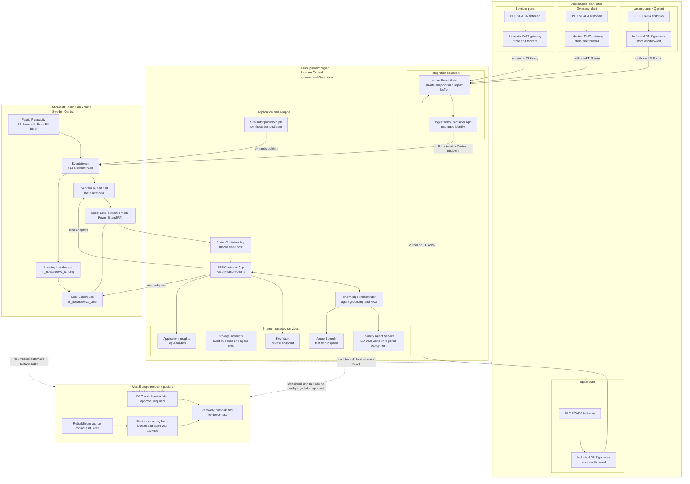

# Diagram - Deployment and Region Strategy

> **Artifact:** Diagram / Deployment and Region · **Audience:** platform architects and operations · **Status:** baseline · **Source of truth:** [deployment topology](../../architecture/deployment-topology.md)

## Purpose

This page places the NovaSteel baseline across four plant sites, Azure Sweden Central, the Fabric SaaS plane, and the West Europe recovery posture. It highlights data residency, environment isolation, and the tested-not-automatic recovery strategy.

## EU deployment topology

How to read this: Sweden Central is the primary runtime location for the deployed demo slice and the target EU production baseline. Fabric remains SaaS rather than a customer VNet subnet, so private endpoints are used where supported and remaining Fabric data-plane paths are explicit outbound TLS and Entra exceptions.

## Environment and region matrix

| Environment | Primary placement | Data allowed | Capacity posture | Recovery posture |
|---|---|---|---|---|
| `dev` | Isolated `NS-dev-*` workspaces and Azure resources in Sweden Central | Synthetic or approved masked test data | Pause when unused | Rebuild from source; no business demo dependency. |
| `test` | Isolated `NS-test-*` workspaces and Azure resources in Sweden Central | Synthetic and approved test fixtures | Scheduled pause after test drain | Restore and replay tests before release gates. |
| `demo` | `rg-novasteelv3-demo-sc` and isolated `NS-DEMO-*` Fabric workspaces in Sweden Central | `SYNTHETIC` and `DEMO-NONPERSONAL` only | F2 initial, F4 measured fallback, F8 demo-day burst, paused outside windows | Local fixture fallback first; West Europe only as tested recovery design. |
| `prod` | Isolated `NS-prod-*` workspaces and production Azure resources in Sweden Central after gates | Real EU operational or personal data only after approval | No automated pause; SLO and capacity set after pilot measurement | West Europe recovery requires DPO approval, data inventory, restore runbook, and exercised evidence. |

## Regional placement summary

| Service or data plane | Primary | Secondary or recovery posture | Notes |
|---|---|---|---|
| Fabric F capacity, workspaces, OneLake, Lakehouse, Eventhouse, Power BI | Sweden Central | West Europe recovery design to be tested | Do not claim automatic Power BI BCDR or automatic Fabric failover. |
| Azure Event Hubs, relay, BFF, workers, Key Vault, monitoring | Sweden Central | West Europe only after DPO review and recovery test | Keeps operational data in one EU primary region. |
| Foundry Agent Service | Sweden Central | West Europe alternative if approved | Model, quota, tool, and deployment type are checked at deployment time. |
| Azure Speech | Sweden Central | West Europe for separately approved custom-speech or batch needs | Fast transcription is the interview-critical mode. |
| Raw interview audio and transcripts | Sweden Central restricted stores | No cross-region replication without DPO approval | Highly Confidential personal data requires retention and erasure controls. |
| Offline demo pack | Access-controlled presenter device and repository artifacts | Local fallback | Contains no production data or credentials. |

## Data residency note

Fabric location is Sweden Central for the baseline. Foundry Data Zone EU keeps data processing within the EU data zone but is not a single-region guarantee, so a regional deployment is selected when policy requires Sweden Central-only processing. West Europe is a recovery target to validate, not a silent replica, and any production copy requires DPO, legal, encryption, retention, and restore-run evidence.

## Related artifacts

[Glossary](../glossary.md) · [Solution Architecture](../solution-architecture.md) · [Data Baseline](../data-baseline.md) · [AI Design](../ai-design.md) · [Security Baseline](../security-baseline.md) · [Compliance](../compliance.md) · [Operating Model](../operating-model.md) · [Test Strategy](../test-strategy.md) · [Business Value Assessment](../business-value-assessment.md)
