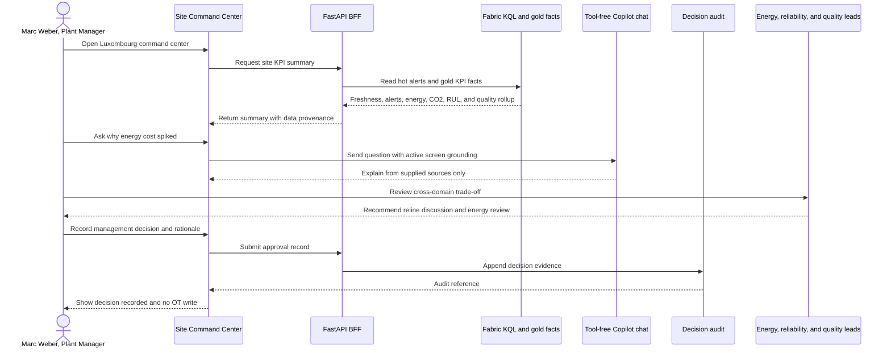
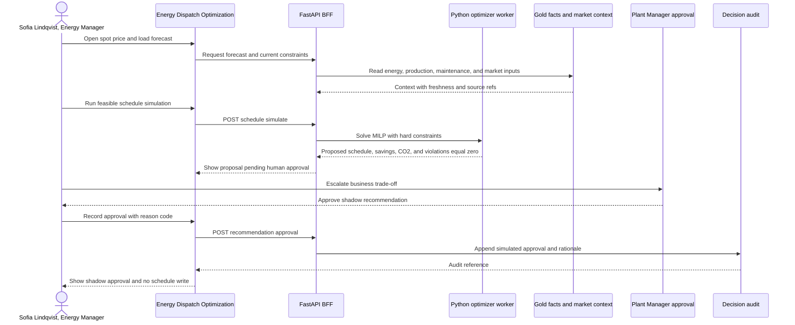
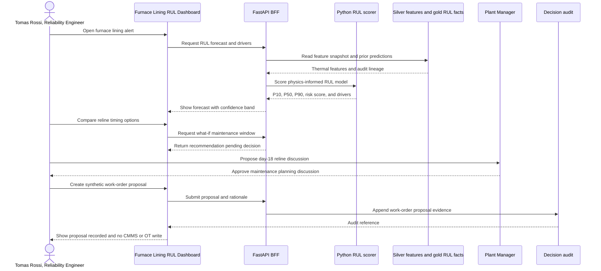
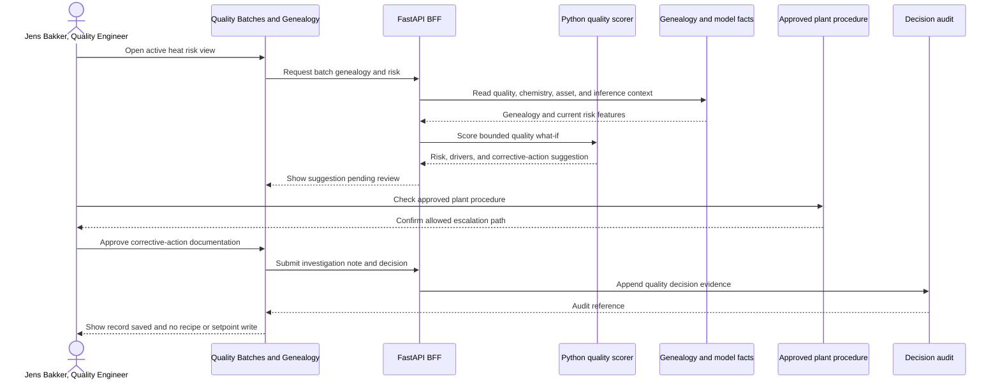
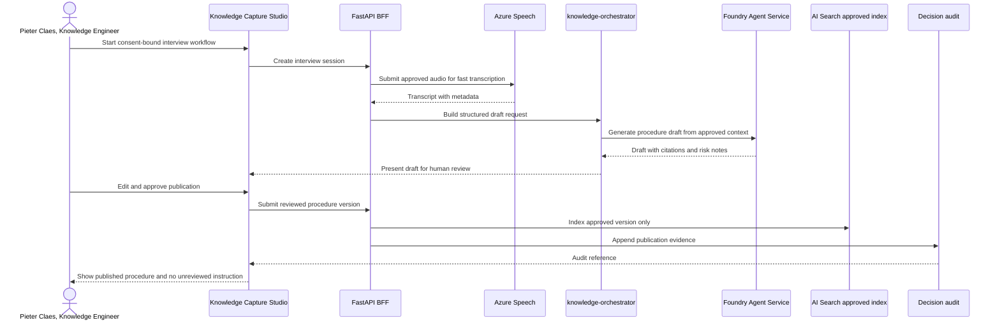
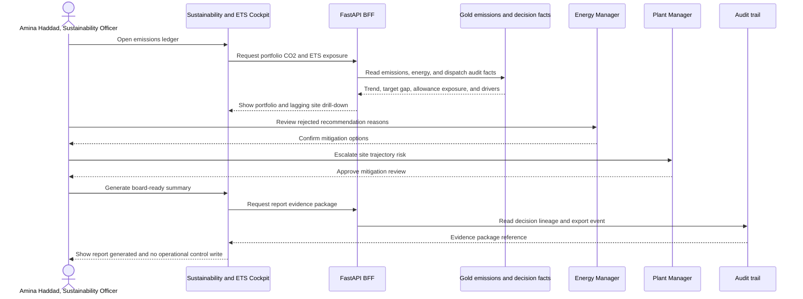

# Diagram - Key Persona Sequences

> **Artifact:** Diagram / Key Persona Sequences · **Audience:** product owners and reviewers · **Status:** baseline · **Source of truth:** [personas and journeys](../../business/personas-and-journeys.md)

## Purpose

This page connects the architecture to the principal NovaSteel decision journeys. Each sequence ends with human review, audit evidence, and no OT write or production-system commitment from NovaSteel.

## Plant Manager - site command review

How to read this: Marc receives a site rollup and explanation, then records a management decision. The final system action is audit evidence, not an operational schedule, recipe, interlock, or PLC change.

## Energy Manager - dispatch recommendation

How to read this: the optimizer computes a feasible proposal, but the platform records only a simulated or shadow approval in the baseline. A real production schedule connector is a separately governed future phase.

## Reliability Engineer - furnace lining forecast

How to read this: Tomás can create a synthetic CMMS-linked proposal for the demo, but NovaSteel does not update the production CMMS or plant equipment.

## Quality Engineer - in-line deviation risk

How to read this: quality recommendations stay bounded and documentary. Any real process intervention happens through existing plant procedures outside NovaSteel, then the outcome is recorded for evidence and model feedback.

## Knowledge Engineer - procedure publication

How to read this: the agent drafts, but Pieter publishes. Drafts and unapproved transcripts do not become operational instructions or generally retrievable knowledge.

## Sustainability Officer - emissions and audit review

How to read this: Amina influences action through escalation and reporting. NovaSteel provides traceable evidence, not direct control of schedules, process parameters, or plant systems.

## Persona-to-route table

| Persona | Primary route from the root README | Decision supported | Human approval point |
|---|---|---|---|
| Plant Manager | `/lu/command-center` | Cross-domain site trade-offs and audit review | Manager records decision and rationale. |
| Energy Manager | `/lu/energy-optimization/spot-price-schedule` | Accept, modify, or reject dispatch recommendation | Energy Manager and Plant Manager approve shadow decision. |
| Reliability Engineer | `/lu/furnace-health/lining-forecast` | Recommend reline timing based on RUL forecast | Reliability Engineer proposes and Plant Manager approves discussion. |
| Quality Engineer | `/lu/quality/batches` | Quarantine, release, or document corrective action | Quality Engineer approves documentation under plant procedure. |
| Knowledge Engineer | `/lu/knowledge-hub/procedures` | Approve and publish reviewed procedures | Knowledge Engineer edits and approves publication. |
| Sustainability Officer | `/lu/sustainability-compliance/emissions-ledger` | Escalate emissions trajectory and prepare evidence | Sustainability Officer escalates and leadership approves mitigation review. |

## Related artifacts

[Glossary](../glossary.md) · [Solution Architecture](../solution-architecture.md) · [Data Baseline](../data-baseline.md) · [AI Design](../ai-design.md) · [Security Baseline](../security-baseline.md) · [Compliance](../compliance.md) · [Operating Model](../operating-model.md) · [Test Strategy](../test-strategy.md) · [Business Value Assessment](../business-value-assessment.md)
