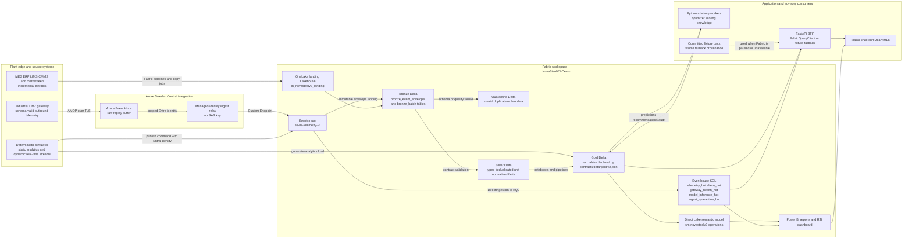

# Diagram - Medallion Data Flow

> **Artifact:** Diagram / Medallion Data Flow · **Audience:** data architects · **Status:** baseline · **Source of truth:** [solution architecture](../../architecture/solution-architecture.md)

## Purpose

This page shows how NovaSteel data lands in Fabric and becomes governed decision-support evidence. The same pattern supports hot KQL investigation, OneLake medallion history, Direct Lake reporting, and deterministic fixture fallback when the demo capacity is paused.

## End-to-end Fabric flow

How to read this: Eventstream intentionally fans out to both hot KQL and immutable bronze. KQL is the operational investigation cache; Lakehouse Delta is the governed historical and semantic source. The BFF reports whether data came from Fabric, the fixture pack, or a Fabric-to-fixture fallback.

## Confirmed Fabric assets and contracts

| Layer | Confirmed names | Contract or source file | Contract summary |
|---|---|---|---|
| Workspace | `NovaSteelV3-Demo` | `docs/README.md` and Fabric deployment state | Synthetic demo workspace with paused-capacity fallback posture. |
| Eventstream | `es-ns-telemetry-v1` | `fabric/items/es-ns-telemetry-v1.Eventstream` and deployment docs | Routes dynamic real-time envelopes to KQL hot tables and bronze Delta. |
| Eventhouse | `evh-novasteelv3-operations`, `kql-novasteelv3-operations` | `fabric/items/kql-ns-operations.KQLDatabase/DatabaseSchema.kql` | Hot operational tables for telemetry, alarms, gateway health, model inference, and ingest quarantine. |
| Landing Lakehouse | `lh_novasteelv3_landing` | `fabric/items/lh-ns-landing.Lakehouse/.platform` | Raw and quarantine landing boundary. |
| Core Lakehouse | `lh_novasteelv3_core` | `fabric/items/lh-ns-core.Lakehouse/.platform` | Delta tables for static analytical gold and application-grain operational envelopes. |
| Medallion catalog | Bronze, silver, gold zones | `fabric/lakehouse/schema/medallion-catalog.json` | Structural catalog for tables, partitioning, columns, and data-quality checks. |
| Gold v2 contract | Eight stable gold fact tables | `contracts/data/gold.v2.json` | Natural-key star-schema facts used by Direct Lake and BFF read projections. |

## Bronze, silver, and gold table map

| Zone | Tables confirmed in repository | Contract behavior |
|---|---|---|
| Bronze | `bronze_event_envelope`, `bronze_batch_mes`, `bronze_batch_cmms`, `bronze_batch_market` | Immutable append of original event time, ingest time, event id, source, schema version, classification, scenario, and seed fields. |
| Quarantine | `quarantine_event`, `quarantine_batch` | Retains invalid units, missing references, conflicting duplicates, late events, and schema failures with reason codes. |
| Silver dimensions | `dim_plant`, `dim_asset`, `dim_sensor`, `dim_grade`, `dim_calendar` | SCD and calendar lookup tables used to normalize event-time facts. |
| Silver facts | `fact_telemetry`, `fact_energy_interval`, `fact_quality_measurement`, `fact_maintenance_event`, `fact_alarm_event`, `fact_model_inference`, `fact_ai_decision` | Canonical units, deduplication keys, retained source quality, and late-data watermarking. |
| Gold v2 facts | `fact_energy_daily`, `fact_emissions_daily`, `fact_production_shift`, `fact_quality_yield`, `fact_furnace_rul`, `fact_dispatch_recommendation`, `fact_knowledge_procedure`, `fact_ai_decision_audit` | Stable KPI facts with natural primary keys and idempotency keys declared in `contracts/data/gold.v2.json`. |
| Gold catalog extensions | `dim_kpi_target`, `fact_model_evaluation`, `fact_customer_claim`, `fact_knowledge_usage`, `fact_platform_usage` | Catalogued semantic and governance facts that extend the Fabric model beyond the eight v2 analytical facts. |
| Application grain | `telemetry`, `energy_interval`, `heat_batch`, `quality_measurement`, `model_inference`, `alarm_event`, `maintenance_event`, `operator_knowledge`, `truth_ledger`, `manifest` | Operational envelope tables in `lh_novasteelv3_core` read by the BFF when `BFF_DATA_SOURCE=fabric`. |

## Flow contracts and caveats

| Flow | Rule |
|---|---|
| Gateway to Event Hubs | At-least-once outbound telemetry only; event time survives replay. |
| Relay to Eventstream | Managed identity and isolated Fabric publisher scope; no standing Eventstream SAS key. |
| Eventstream to KQL | Eventhouse destinations use direct ingestion mappings for hot tables. |
| Eventstream to bronze | The immutable `bronze_event_envelope` keeps raw envelope evidence for replay and recovery. |
| Bronze to silver | Validation, deduplication, unit normalization, SCD lookup, and quarantine are explicit. |
| Silver to gold | Gold facts are stable KPI and audit records, not raw mutable operational truth. |
| Fabric to BFF | Fabric is preferred but not a hard dependency; paused capacity falls back to the signed fixture pack. |
| Reports | Direct Lake and Power BI consume gold facts; live operational freshness stays in KQL and RTI. |

## Source references used

| Repository source | Used for |
|---|---|
| `docs/architecture/solution-architecture.md` | Target architecture, component choices, medallion zones, and ADR-018 two-stream decision. |
| `docs/data/synthetic-data-and-simulators.md` | Static analytical stream, dynamic real-time stream, operational envelope tables, and simulator determinism. |
| `docs/architecture/fabric-brain-mapping.md` | Confirmed Fabric display names for lakehouses, Eventhouse, KQL database, notebooks, pipelines, and semantic model. |
| `contracts/data/gold.v2.json` | Gold v2 table names, natural primary keys, idempotency keys, and stable fact contract. |
| `fabric/lakehouse/schema/medallion-catalog.json` | Bronze, quarantine, silver, gold, and catalog extension table inventory. |
| `fabric/kql/README.md` | Eventhouse role as the hot operational query layer rather than governed history. |

These references also confirm that both Fabric streams are synthetic in the demo baseline and must not be presented as production telemetry.

## Related artifacts

[Glossary](../glossary.md) · [Solution Architecture](../solution-architecture.md) · [Data Baseline](../data-baseline.md) · [AI Design](../ai-design.md) · [Security Baseline](../security-baseline.md) · [Compliance](../compliance.md) · [Operating Model](../operating-model.md) · [Test Strategy](../test-strategy.md) · [Business Value Assessment](../business-value-assessment.md)
