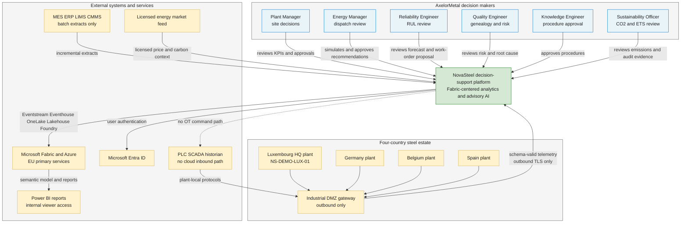
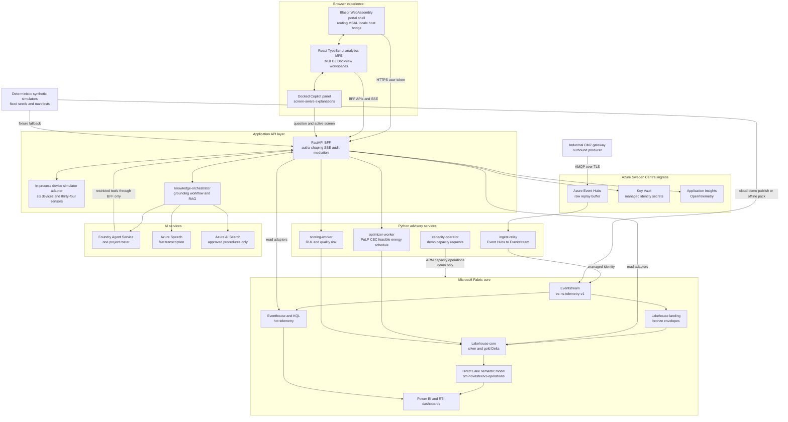

# Diagram - System Context (C4)

> **Artifact:** Diagram / System Context · **Audience:** architects · **Status:** baseline · **Source of truth:** [solution architecture](../../architecture/solution-architecture.md)

## Purpose

This page shows NovaSteel as a C4-style decision-support platform for AxelorMetal. It separates users, external systems, the NovaSteel system boundary, and the container responsibilities that keep analytics advisory-only with no OT control write path.

## System context

How to read this: the central system is NovaSteel, not a plant controller. Human personas consume recommendations and evidence, while OT gateways send only outbound telemetry. The dotted edge marks a deliberate absence: NovaSteel does not send commands to PLCs, interlocks, recipes, schedules, or CMMS production connectors.

## Container view

How to read this: browser code never receives Fabric, Foundry, Key Vault, or Azure management credentials. The BFF is the enforcement point for role, plant, idempotency, audit, and fallback behavior. Advisory workers compute proposals, not committed operational actions.

## C4 notation legend

| C4 element | Used here as | NovaSteel examples |
|---|---|---|
| Person | Human role making a decision or approval | Plant Manager, Energy Manager, Reliability Engineer, Quality Engineer, Knowledge Engineer, Sustainability Officer |
| Software system | The system whose responsibilities are being explained | NovaSteel decision-support platform |
| External system | System outside the NovaSteel boundary | PLC and historian estate, MES, ERP, LIMS, CMMS, market feed, Entra ID, Power BI |
| Container | Deployable or separately owned runtime or data store | Blazor shell, React MFE, FastAPI BFF, Python workers, Event Hubs, Fabric Lakehouses, Foundry, AI Search |
| Boundary | Trust, ownership, location, or deployment grouping | Browser, Azure ingress, Fabric core, AI plane, four-country plant estate |

## Key constraints captured

| Constraint | Diagram cue |
|---|---|
| Decision support only | Human personas approve or reject proposals before any real-world action. |
| No OT write path | The only OT edge is outbound telemetry from the industrial DMZ gateway. |
| Fabric is the analytics core | Eventstream, Eventhouse, OneLake, Lakehouse, Direct Lake, and reports sit in the central data plane. |
| Synthetic demo fallback | Simulators publish to cloud demo paths and also feed the offline fixture fallback. |
| Tool boundary for agents | Foundry can reach calculations only through BFF-governed, role-checked tools. |

## Related artifacts

[Glossary](../glossary.md) · [Solution Architecture](../solution-architecture.md) · [Data Baseline](../data-baseline.md) · [AI Design](../ai-design.md) · [Security Baseline](../security-baseline.md) · [Compliance](../compliance.md) · [Operating Model](../operating-model.md) · [Test Strategy](../test-strategy.md) · [Business Value Assessment](../business-value-assessment.md)
