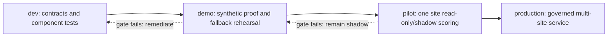

# Operating Model

> **Artifact:** Operating Model · **Audience:** operations, platform team, service management · **Status:** baseline · **Source of truth:** [operations and cost](../operations/operations-and-cost.md)

Purpose: define how NovaSteel is operated, changed, monitored, recovered, and improved as an EU-oriented decision-support platform for AxelorMetal. This page summarizes the working model from the operations, architecture, infrastructure, demo, and agentic-development materials; it does not introduce an OT control path, production write-back, or a production SLO beyond the documented gates.

## Roles and responsibilities

RACI legend: **A** accountable, **R** responsible, **C** consulted, **I** informed.

| Activity | Plant ops | Platform team | Data/AI team | Security/Compliance | Vendor/Partner |
|---|---|---|---|---|---|
| Confirm business priority, site readiness, and demo/pilot go/no-go | A/R | C | C | C | I |
| Operate Fabric capacity, Container Apps, Key Vault, Event Hubs, monitoring, and budgets | I | A/R | C | C | C |
| Run deterministic simulator, fixture pack, demo reset, and rehearsal controls | C | A/R | R | I | I |
| Maintain medallion data contracts, Eventstream/Eventhouse objects, notebooks, and semantic definitions | C | C | A/R | C | C |
| Own MILP energy optimizer, RUL regressor, quality scorer, knowledge orchestrator, model evaluation, and drift review | C | C | A/R | C | C |
| Approve operational recommendations in demo or pilot shadow mode | A/R | I | C | I | I |
| Review publication of operator knowledge procedures and role-assignment requests | C | C | A/R | A/C | I |
| Maintain STRIDE model, DPIA/AI Act evidence, RBAC, Sentinel detections, and audit review | I | C | C | A/R | C |
| Execute release gates, pull-request evidence, and environment promotion | I | A/R | R | A/C | I |
| Clear target-tenant capacity, Fabric, Foundry, Speech, market-data, OT/DMZ, and DR gates | C | R | R | A/R | C/R |
| Handle incidents, fallback decisions, and post-incident reviews | C | A/R | R | A/R for security/privacy | C |

Human roles map to the documented personas: Plant Manager, Furnace Operator, Energy Manager, Maintenance and Reliability Engineer, Quality Engineer, Sustainability Officer, Knowledge Engineer/Admin, Executive, OT Systems Engineer, and Platform Ops.

## Service model

| Service | Owner | Hours | SLO | Degraded mode |
|---|---|---|---|---|
| Portal shell, analytics microfrontend, and FastAPI BFF | Platform team | Demo windows; pilot business hours until re-baselined | `bff-api` 99.5% non-prod pilot target; p95 read latency < 800 ms | Browser assets and fixture-backed BFF; fail visibly if BFF unavailable |
| Alert delivery and operational awareness | Platform team | Active ingest/demo windows | SSE alert latency < 5 s from KQL event to client-visible alert | Polling or stale-state indicator; no safety-control claim |
| Fabric hot path: Eventstream, Eventhouse/KQL, RTI dashboard | Data platform team | Active ingest/demo windows | Data freshness < 5 s during active ingestion | Committed fixture pack, cached KQL/lineage clip, or local replay |
| Medallion pipelines and semantic model | Data platform team | Scheduled pipeline windows | 100% row reconciliation or explicit quarantine reason | Reprocess from bronze/source extracts; never hand-patch gold |
| Energy optimizer | Data/AI team | On demand during demo/pilot analysis | Cached or signed fallback within 5 s if solver has not returned | Show matching signed result; never relax hard constraints silently |
| Furnace RUL scoring | Data/AI team | Daily in pilot; demo on deterministic scenario | Daily scoring cadence per plant/asset | Surface confidence, uncertainty, and stale-source status |
| Knowledge capture and Copilot grounding | Data/AI team | Business hours; demo windows | Foundry/Speech best-effort; failure never blocks approval workflow | Queue capture, manual transcript/draft, approved cached transcript |
| Capacity lifecycle | Platform team | 01:00 Europe/Luxembourg non-prod check; GUI start by operator | Resume readiness < 10 minutes for demo F2/F4, re-measured per SKU | Leave capacity running if busy; use offline fallback if readiness fails |
| Demo reset and hard recovery | Platform team with presenter | Rehearsal/demo windows | Soft reset < 5 minutes; hard recovery < 20 minutes | New run ID, reload signed snapshot, replay manifest, re-verify |

## Environments and promotion

| Environment | Purpose | Region | Deployment method | Gate |
|---|---|---|---|---|
| `dev` | Developer integration and contract tests | Sweden Central by default; West Europe only by reviewed parameter change | Bicep validation, local scripts, service builds | Protected feeds, contracts, unit/integration tests, IaC validation |
| `test` | Security, integration, performance, and release validation | Sweden Central | GitHub Actions with OIDC, Bicep what-if, Fabric deployment validation | GitHub Environment approval, all relevant CI gates, evidence artifacts |
| `demo` | Repeatable synthetic defense and rehearsal | Sweden Central; deployed slice is `rg-novasteelv3-demo-sc` | `infra\scripts`, Container Apps promotion, Fabric scripts where tenant gates clear | Two 10-minute runs, fallback exercise, synthetic labels, no production data/action |
| `pilot` | One real site, read-only/shadow scoring after governance approval | EU target region validated at deployment time | Same IaC-first path plus target-tenant Fabric/Fabric SaaS item deployment | DPO/legal, OT/DMZ, model evaluation, source licensing, DR, security gates |
| `production` | Post-pilot operating service across approved sites | Sweden Central primary; West Europe recovery only after tested design | Reviewed release through GitHub Environment, OIDC, IaC, service/Fabric promotion | SLO/capacity evidence, no automatic pause, human-approved non-OT integrations only |

Promotion is a gate sequence, not a branch naming convention. A release can move forward only when the repository evidence, tenant readiness, and human gate-holders agree.

## Release and change management

- NovaSteel is **IaC-first**: Azure control-plane resources are represented in Bicep; Fabric SaaS items live under `fabric/` and are deployed through the Fabric workstream.
- Before deployment, run Bicep build/parameter validation and a what-if diff; attach the what-if evidence to the release or pull request.
- Deployment is **OIDC-only**. The scripts use the active Azure CLI/OIDC context and `deploy.ps1` fails closed if client-secret style credentials are present.
- GitHub workflows cover CI, service-image build, infrastructure CD, service CD, Fabric item CD, CodeQL, and the presentation package.
- Release acceptance includes contracts, simulator, BFF/integration, knowledge workflow, frontend lint/test/build, portal restore/build, IaC, Fabric assets, security, dependency integrity, SBOM, and evidence artifacts.
- Production onboarding requires DPO/legal classification, OT sign-off, model evaluation, capacity/region/connector proof, threat-model update, DR test, and security acceptance.
- No release ever includes a PLC, safety interlock, furnace, recipe, production setpoint, or autonomous OT control change. Energy/quality approvals remain simulated or shadow until separately governed write-back is approved.
- Rollback is deployment-slot and IaC-reproducible; data recovery uses retained bronze/source extracts and audit evidence, not manual table surgery.

## Observability

| Signal | Source | Tool | Alert threshold | Owner |
|---|---|---|---|---|
| Request/error/latency traces, SSE reconnects, auth denials, correlation ID | BFF and apps via OpenTelemetry | Application Insights | `bff-api` error rate > 5% over 5 minutes | Platform team |
| Structured JSON logs with `correlation_id` | Gateway, relay, BFF, workers | Log Analytics | Freshness stale > 60 s during expected active ingestion | Platform team / Data platform |
| Eventstream/KQL rate, failures, latency, materialized-view health, quarantine rate, freshness | Fabric RTI and KQL | Fabric monitoring and Log Analytics export | Quarantine rate > 2% over 15 minutes | Data platform team |
| Bronze-to-silver-to-gold reconciliation and pipeline duration | Fabric pipelines/notebooks | Fabric monitoring and Purview lineage | Any unexplained row-count gap | Data platform team |
| Capacity CU, throttling, cost, F SKU, active jobs, pause/resume | Fabric Capacity Metrics and ARM activity | Capacity Metrics app and Azure Cost Management | Budget 50/80/100%; ARM operation failure | Platform team / FinOps |
| Model latency, confidence, drift, prediction-vs-outcome, evaluation result | Optimizer/scoring/MLflow | MLflow, App Insights | Drift or failed 21-day-warning evaluation | Data/AI team / RAI board |
| Audit hash-chain and decision lineage | BFF append-only audit table | Audit API, Sentinel, regulator export | Agent tool call without matching human approval | Security/Compliance |
| Health and readiness | `/health/ready`, capacity operation endpoints, readiness checklist | App Insights, scripts, demo control panel | Capacity readiness fails after ARM success | Platform team |
| Data-source indicator | `GET /v1/meta` and UI banner | Portal header and telemetry | Any mismatch between claimed and actual source | Platform team |

The UI honesty rule is mandatory: every screen states whether rows came from Fabric, the fixture pack, or a fallback path. Synthetic demo data is always labelled as non-operational.

## Incident management

| Severity | Example | Initial response | Escalation |
|---|---|---|---|
| Sev-1 | Confirmed highly confidential breach, OT control-system compromise, or unauthorized energy-agent scheduling action | 15-minute triage; IR commander engaged | Security on-call, DPO, OT owner, RAI board, executive sponsor |
| Sev-2 | Compromised credential/managed identity, Key Vault anomaly, high Defender for IoT alert, ARM capacity operation stuck unknown | 1 hour | Platform on-call plus Security/Compliance; vendor if service-side |
| Sev-3 | Quarantine-rate spike, repeated blocked prompt-injection attempts, failed Conditional Access bypass attempt | 4 hours | Owning platform/data/AI team with weekly review |
| Sev-4 | Policy drift, expired non-critical certificate, repeated `SKIPPED_BUSY` pause result | Next business day | Platform Ops and FinOps cadence |

Escalation path: detecting owner opens the incident, Platform on-call confirms severity, Security/Compliance leads privacy/security cases, OT Systems Engineer owns plant-network isolation decisions, Data/AI owns model drift and evaluation issues, and vendor/partner support is engaged only through the accountable service owner.

Fallback ladder for demonstrations and rehearsals:

1. Live Fabric and live BFF path.
2. Committed fixture pack with source indicator.
3. Local deterministic replay with the same seed and manifest.
4. Cached interactive or local browser assets.
5. Recorded evidence and static proof pack.

Do not spend more than ten presentation seconds diagnosing live. Switch deliberately, say what source is being shown, preserve evidence, and rehearse the failed chapter before the next presentation.

## Runbooks

Primary runbook: [demo runbook](../demo/demo-runbook.md). Key operational commands and scripts:

| Task | Command or script |
|---|---|
| Repository validation | `pwsh .\tools\validation\Validate-Repository.ps1` |
| Infra validation | `pwsh -File .\infra\scripts\validate.ps1 -Environment demo` |
| Infra what-if evidence | `pwsh -File .\infra\scripts\what-if.ps1 -Environment demo -OutFile .\artifacts\validation\whatif-demo.txt` |
| Infra deploy | `pwsh -File .\infra\scripts\deploy.ps1 -Environment demo` |
| Initial GitHub OIDC managed identity grant | `pwsh -File .\infra\scripts\setup-github-oidc-managed-identity.ps1 -Environment demo` |
| Tenant-admin-gated OIDC app-registration alternative | `pwsh -File .\infra\scripts\setup-github-oidc-app-registration.ps1` |
| Fabric asset deploy | `pwsh -File .\fabric\scripts\Deploy-FabricAssets.ps1 -ParameterFile .\fabric\deployment-parameters\demo.parameters.json` |
| Fabric deployment test | `pwsh -File .\fabric\scripts\Test-FabricDeployment.ps1 -ParameterFile .\fabric\deployment-parameters\demo.parameters.json -StateFile .\fabric\deployment-state\demo.json -Deep` |
| Local BFF health | `Invoke-RestMethod http://127.0.0.1:8080/health/ready` |
| Scripted API demo | `.\services\bff-api\.venv\Scripts\python.exe .\artifacts\demo-validation\drive_demo.py` |
| Simulator generate/validate/reset | `.\services\bff-api\.venv\Scripts\python.exe -m simulator.cli demo --out .\output\demo` |
| Device simulator control | `POST /v1/devices/simulator/commands` through the BFF with `Platform.Capacity.Manage` |

Reset rules are strict: preserve run manifests and audit records, never truncate shared or production tables, never clear shared streams, never reuse production secrets, and never bridge demo and production identities.

## Capacity and cost management

- Demo uses Fabric **F2** in Sweden Central and is paused outside demonstration windows through the documented 01:00 Europe/Luxembourg non-production lifecycle check.
- The pause applies to `dev`, `test`, and `demo` only. **Production capacity is never auto-paused**, even under cost pressure.
- The F2 to F4 decision is measurement-driven: capture Capacity Metrics during the scripted demo and stress rehearsal, then scale only if throttling or latency degrades the presenter experience.
- Main cost drivers are Fabric capacity CU consumption, Power BI licensing, OneLake/KQL/Activator retained data, Spark/autoscale, Foundry/Speech tokens, Event Hubs and relay, logs/Sentinel retention, DR posture, Container Apps, storage, and AI services.
- Every environment has cost tags; demo resources require `expiry`. Budgets alert at 50%, 80%, and 100%.
- Exact currency prices are not copied into operations decisions. Stakeholder quotes must be pulled live from the official pricing calculator for the target date, offer, and region.

## Continuous improvement

NovaSteel treats agentic development as an auditable SDLC, not an exception to it. Work is decomposed into bounded scopes, contracts are frozen before implementation, one owner edits a file at a time, tests and CI are the ground truth, skeptical review checks claims against source, and evidence artifacts survive beyond an agent session. Operational learnings, model drift, incident reviews, cost reviews, and user adoption feedback re-enter the backlog as requirements and gates.

## Related artifacts

- [Glossary](glossary.md)
- [Diagrams](diagrams/README.md)
- [Solution Architecture](solution-architecture.md)
- [Data Baseline](data-baseline.md)
- [AI Design](ai-design.md)
- [Security Baseline](security-baseline.md)
- [Compliance](compliance.md)
- [Test Strategy](test-strategy.md)
- [Business Value Assessment](business-value-assessment.md)
