# Security Baseline

> **Artifact:** Security Baseline · **Audience:** security, risk, architecture · **Status:** baseline · **Source of truth:** [security governance and threat model](../tech/security-governance-and-threat-model.md)

NovaSteel is an EU-oriented, Microsoft-Fabric-centered decision-support platform for AxelorMetal's synthetic four-country steel estate. This baseline condenses the verified repository security posture into one review page: identities, trust boundaries, data protection, supply chain controls, threat model, control mapping, and production gates.

## Security principles

- **Decision support only / no OT write:** no NovaSteel component writes to a PLC, safety interlock, furnace, recipe, setpoint, operational schedule, or production CMMS.
- **Least privilege:** application roles, OneLake roles, Fabric workspace roles, Key Vault RBAC, and Azure RBAC are scoped separately and do not imply each other.
- **Managed identity over secrets:** Azure-to-Azure calls use managed identities; GitHub deployment uses OIDC workload identity federation; no standing cloud credential is accepted in CI.
- **EU data residency:** Sweden Central is the primary placement; West Europe is a reviewed EU recovery option, not an automatic replica.
- **Defence in depth:** Conditional Access, PIM, private endpoints, sensitivity labels, Purview lineage, audit chains, Sentinel, and validation gates are layered.
- **Deny-by-default egress:** public network access is denied where supported; firewall/egress policy allows only documented destinations such as protected package feeds.
- **Synthetic-only data in the demo:** `NS-DEMO-*` namespaces and `DEMO-NONPERSONAL` labels are used; the deployed slice does not claim production data onboarding.

## Identity and access

| Actor/Workload | Identity type | Credential | Scope | Notes |
|---|---|---|---|---|
| Browser / Blazor shell / React MFE | Entra user context mediated by BFF | Opaque token reference in the browser; no workload bearer token | Persona and plant-scoped `/v1` API access | Browser never receives Azure management, Fabric capacity, Foundry, or Power BI service credentials. |
| Demo user surface | Demo identity | Local/demo route scope | `NS-DEMO-LUX-01` only | Root README states local mode accepts only `NS-DEMO-*`; demo identity is scoped to Luxembourg demo site. |
| FastAPI BFF workload | Dedicated managed identity (`mi-ns-bff-{env}` in the architecture) | Managed identity | Key Vault retrieval and approved read adapters | Excludes capacity lifecycle, raw data mutation, and Foundry management. |
| Event Hubs relay | Managed identity (`mi-ns-ingest-relay-{env}`) | Managed identity | Event Hubs consumer; Fabric Contributor only in isolated RTI ingress workspace | Avoids SAS-based Eventstream ingestion; Contributor blast radius is isolated until Fabric offers a narrower publisher role. |
| Fabric item-level authorization | Fabric workspace + OneLake security roles | Entra/Fabric authorization | Gated per workspace/item/table/plant | Production item-level authorization remains a root README production gate. |
| GitHub Actions deployment | OIDC federated managed identity / app registration | Short-lived OIDC token; no client secret | Environment/resource-group scoped deployment | Infra scripts refuse `AZURE_CLIENT_SECRET` / `AZURE_CREDENTIALS`; workflows request `id-token: write` and use `azure/login`. |

## Network and boundary controls

```mermaid
flowchart LR
  OT["Plant OT zone\nPLC / SCADA / historian"]
  DMZ["Industrial DMZ\noutbound-only gateway\nprotocol break + schema validation"]
  AZ["Azure ingress\nEvent Hubs + managed-identity relay"]
  FAB["Fabric SaaS plane\nEventstream + Eventhouse + OneLake"]
  APP["Application boundary\nFastAPI BFF + workers"]
  USER["User zone\nBrowser + Power BI / dashboard"]

  OT -->|"read/export only"| DMZ
  DMZ -->|"outbound TLS / mTLS only"| AZ
  AZ -->|"Entra identity; no SAS"| FAB
  FAB -->|"scoped query/read adapters"| APP
  APP -->|"HTTPS + Entra user context"| USER
```

- The OT crossing is per-plant historian/export through Level 3.5 industrial DMZ; cloud-originated sessions below the DMZ are denied.
- Azure topology is hub/spoke with private DNS, NSGs/ASGs, optional firewall, private endpoints for supported PaaS data planes, and monitoring in a dedicated resource group.
- `deny-public-network-access.json` denies public network access on Key Vault, Storage, Event Hubs namespaces, and Cognitive Services accounts.
- Fabric is SaaS, not a customer VNet subnet; managed private endpoints are used only where documented, and remaining SaaS routes are monitored outbound TLS/Entra exceptions.
- Demo/prod isolation is explicit: no workspace, OneLake shortcut, Eventstream connection, Key Vault secret, application config, or managed identity may bridge demo and production.

## Data protection

- **Classification:** `DEMO-NONPERSONAL` for synthetic demo data; `Confidential` for operational telemetry, quality/yield, and energy contracts; `Highly Confidential` for operator interview audio/transcripts and safety-incident material; audit/model evidence is append-only and access logged.
- **Transit protection:** TLS 1.2 minimum, TLS 1.3 preferred; OT-to-cloud telemetry crosses the DMZ through mTLS/protocol break rather than plaintext OT protocols.
- **At-rest protection:** platform-managed encryption by default; CMK from Key Vault is required by the security model for `Confidential` / `Highly Confidential` stores; Key Vault uses soft-delete and purge protection.
- **PII controls:** RAG responses redact emails, phone numbers, IBANs, role-contextual names, employee IDs, IPv4 addresses, and dates of birth before returning output.
- **Pseudonymization:** GDPR erasure receipts return a salted SHA-256 `subjectPseudonym`; raw `subjectId` is write-only and not echoed.
- **GDPR Art. 17 erasure targets:** interview transcripts are hard-deleted, knowledge-procedure attribution is pseudonymized while the procedure body is retained under documented Art. 17(3) rationale, Copilot conversations are hard-deleted, and the audit chain receives an `erasure.executed` tombstone.
- **Hash-chain invariance:** erasure never mutates the existing SHA-256 audit chain; receipts carry `chainVerifiedBefore` and `chainVerifiedAfter`.
- **Audit durability:** local demo audit can be in-process; when `NOVASTEEL_TABLE_ENDPOINT` is configured, audit hash-chain and idempotency records persist in Azure Table Storage.
- **Retention:** security/audit logs are documented as 1 year hot plus 6 years archive; energy spot-price and dispatch decisions are retained 6 years for ETS/financial audit support.

## Secrets and configuration

- Azure Key Vault is one-vault-per-environment/per-bounded-context, RBAC-only, private-endpoint-only, and administered through PIM-eligible roles.
- No secret value is committed, logged, or echoed; GitHub secret scanning and push protection are release controls.
- Adapter selection is environment-driven: Azure implementations activate only when endpoints/configuration such as `FOUNDRY_ENDPOINT`, `NOVASTEEL_TABLE_ENDPOINT`, or Application Insights are present; otherwise deterministic fixtures are used.
- The BFF and workers retrieve secrets/configuration through managed identity and Key Vault references; no model API key or Fabric SAS key is a production pattern.
- GitHub OIDC federated credentials are created for specific repository/environment subjects; production wildcard branch trusts are prohibited by the threat model.
- Infra scripts use the caller's Azure CLI/OIDC session and fail closed if static cloud credentials are present.

## Software supply chain

- **Protected feeds are mandatory:** pip/PyPI uses `https://packagefeedproxy.microsoft.io/pypi/simple`; NuGet uses `https://packagefeedproxy.microsoft.io/nuget/v3/index.json`; npm uses `https://packagefeedproxy.microsoft.io/npm/`.
- `NuGet.Config` clears inherited package sources, defines only `MicrosoftProtectedFeed`, and maps every package pattern to that source.
- `pip.conf` supplies the only Python `index-url`; no extra Python index is permitted.
- `.npmrc` points npm at the protected registry and keeps lockfile generation exact.
- .NET restore uses repository configuration and `--locked-mode`; frontend restore uses `npm ci --ignore-scripts`.
- CI has a `verify-protected-feeds` job that scans executable feed configuration and uploads evidence.
- `security_scan.py` checks workflow hardening and locked requirements; CodeQL runs for Python, TypeScript, and C#.
- `generate_sbom.py` produces a CycloneDX SBOM; the validation script includes an SBOM suite.
- Dependency integrity gates include `pip check`, npm audit against the approved registry, and NuGet vulnerability reporting/checking.
- CD workflows require immutable image digests and use OIDC login with pinned action references.

## Validation evidence

| Evidence | What it proves | Location |
|---|---|---|
| Protected feed scan | No executable package configuration points at blocked public PyPI/NuGet endpoints | `tools/validation/verify_protected_feeds.py` and `.github/workflows/ci.yml` |
| Repository validation entry point | Local feasible checks cover feeds, contracts, simulator, BFF, frontend, portal, IaC, Fabric, security, and SBOM | `tools/validation/Validate-Repository.ps1` |
| Workflow hardening scan | Workflow and dependency requirements are checked before release | `tools/validation/security_scan.py` |
| CycloneDX SBOM | Release provenance includes dependency inventory | `tools/validation/generate_sbom.py` |
| CodeQL | SAST runs for Python, TypeScript, and C# | `.github/workflows/codeql.yml` |
| OIDC CD | Deployment workflows use `id-token: write` and `azure/login` rather than stored cloud credentials | `.github/workflows/cd-infra.yml`, `.github/workflows/cd-services.yml` |
| Infra validation | Bicep build, parameter build, and Azure deployment validation are scripted | `infra/scripts/validate.ps1` |
| Azure Policy guardrails | Public-network denial, Fabric ARM-type restriction, and SKU guardrails are source controlled | `infra/policy/README.md` |
| Security gates | Release gates require identity, RBAC, network, secrets, supply chain, classification, AI controls, threat model, privacy, logging, and OT boundary checks | Security governance §21 |

## Implemented versus gated controls

| Area | Implemented / evidenced now | Gated before production |
|---|---|---|
| Demo isolation | `NS-DEMO-*`, fixture fallback, synthetic banners, local loopback BFF | No demo/prod bridge in Fabric, Key Vault, Eventstream, identity, or data paths |
| Cloud slice | Container Apps, storage, networking, Key Vault, Event Hubs, monitoring are in the deployed slice | Fabric/Speech/Eventstream/Power BI tenant resources and private networking proof |
| Agents | Manifest/tests enforce no reader agent has a function tool; BFF re-applies role and site scope | Foundry Agent Service capability host, hosted agents, and Speech validation |
| Audit | Hash-chain implementation and Azure Table durability path are present | Retention, Sentinel export, and evidence export validation for target tenant |
| OT boundary | Architecture, IEC mapping, no-write-back routes, and simulator isolation are documented | Vendor protocol, physical DMZ, gateway BOM, and OT owner approval |
| Authorization | BFF route roles and demo identity are implemented | Entra/Fabric item-level authorization in target tenant |

## Threat model summary

| Threat | Vector | Control | Status |
|---|---|---|---|
| Spoofing | Attacker impersonates OT gateway or CI deployment identity | Per-plant identity and mTLS; OIDC scoped to repo/environment; MFA/Conditional Access | Designed / CI implemented |
| Tampering | Telemetry, model artifacts, labels, or audit rows altered | DMZ protocol break, TLS/mTLS, Purview lineage, model registry, hash-chain audit | Implemented for audit; gated for live OT |
| Repudiation | User, admin, or agent denies a consequential action | PIM logging, full tool-call/decision audit, append-only audit chain, Sentinel | Implemented / designed |
| Information disclosure | Over-broad OneLake, transcript, or Key Vault access | Sensitivity labels, OneLake roles, DLP, Key Vault RBAC/private endpoints, PII redaction | Designed; item auth gated |
| Denial of service | Malformed telemetry or AI request flood | Event Hubs buffer/replay, DDoS/firewall posture, quotas, fallback modes | Designed; target tenant validation gated |
| Elevation of privilege | Persona token or agent tool gains broader authority | App roles per plant, deny-by-default agent registry, PIM, tool allow-list, BFF authorization | Implemented / designed |

## Control matrix

| Control | IEC 62443 / CIS-style theme | Repository evidence | Current posture |
|---|---|---|---|
| Entra ID, managed identities, OIDC/WIF | 62443 FR1 Identification & Authentication; access-control theme | Security §2–3, infra identity module, workflows | Implemented for CI/cloud design |
| App roles, OneLake roles, PIM | 62443 FR2 Use Control; least privilege | Security app-role matrix and identity matrix | Designed; Fabric item auth gated |
| Hash-chained audit log and model/version lineage | 62443 FR3 System Integrity; logging/accountability | Audit implementation, Art.17 invariant, AI Act logging evidence | Implemented in app; durable store gated by config |
| Encryption, Key Vault, DLP, classification | 62443 FR4 Data Confidentiality; data protection | Security §5–8, Key Vault module, Purview/Fabric labels | Designed / partially deployed |
| Purdue zones, industrial DMZ, private endpoints | 62443 FR5 Restricted Data Flow; network security | Deployment topology, IEC 62443 mapping, network/policy modules | Designed; OT vendor approval gated |
| Sentinel/Log Analytics, IR runbook | 62443 FR6 Timely Response to Events; monitoring | Security §9–10, monitoring module, `deploySentinel` parameter | Designed / demo deployable |
| Store-and-forward, Event Hubs replay, fallback pack | 62443 FR7 Resource Availability; resilience | Deployment topology §7, solution architecture §9 | Designed; rehearsal required |
| Protected feeds, SBOM, SAST, dependency gates | 62443-4-1 SDL; secure-development theme | `tools/validation`, `.github/workflows`, package config | Implemented in validation/CI |
| Azure Policy guardrails | CIS-style secure configuration / cloud governance | `infra/policy` definitions and assignments | Designed; prod guardrail run owns subscription assignment |

## Residual risks and production gates

- Fabric, Speech, Eventstream, and Power BI tenant resources are not fully provisioned in the deployed slice; Fabric guest access remains unresolved.
- Foundry Agent Service capability host remains behind the manual validation gate; online agents/Search/hosted chat fall back to fixtures unless configured.
- Online search is `offline` by default because Web IQ / web search leaves the Azure compliance and geo boundary and needs DPO sign-off.
- Capacity actions remain simulated in the demo; production capacity is never auto-paused.
- Full browser click-through automation is not installed; evidence covers served assets, CORS, component tests, and live BFF HTTP assertions.
- Fabric scoring notebook P10/P90 still uses fixed multipliers while the Python service uses fit residuals; align before relying on both paths together.
- Outstanding production gates: target-tenant Fabric capacity/SKU/quota; Eventstream Custom Endpoint managed-identity/network proof; Entra and Fabric item-level authorization; Foundry Agent Service and Speech private-network validation; DPO/Legal/DPIA and EU AI Act decisions; OT vendor/DMZ approval; market-data licensing; DR, performance, accessibility, and live-cloud fallback rehearsal.

## Related artifacts

- [Glossary](glossary.md)
- [Diagrams](diagrams/README.md)
- [Solution Architecture](solution-architecture.md)
- [Data Baseline](data-baseline.md)
- [AI Design](ai-design.md)
- [Compliance](compliance.md)
- [Operating Model](operating-model.md)
- [Test Strategy](test-strategy.md)
- [Business Value Assessment](business-value-assessment.md)
