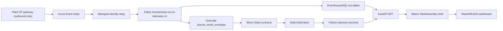

# Solution Architecture

> **Artifact:** Solution Architecture · **Audience:** architects, engineering · **Status:** baseline · **Source of truth:** [solution architecture](../architecture/solution-architecture.md)

NovaSteel is a Microsoft-Fabric-centered decision-support platform for AxelorMetal's synthetic four-country steel estate. This one-page artifact condenses the authoritative architecture and deployment topology; the long-form architecture document remains the source of truth for detailed ADRs, controls, and gates.

## Architecture at a glance

- Industrial sources publish northbound only; cloud services never initiate OT sessions.
- Eventstream fans out telemetry to hot KQL tables and immutable bronze Delta.
- Lakehouse medallion processing creates governed silver contracts and gold KPI facts.
- Python services remain authoritative for RUL, quality, dispatch, and knowledge workflows.
- Browser experiences receive user-scoped API responses, not Fabric or Azure workload credentials.

## Guardrails and non-negotiables

- Decision support only: NovaSteel is not a safety, recipe, setpoint, scheduling, CMMS, or PLC control system.
- No OT write path exists from applications, agents, Eventstream, Activator, pipelines, or demo controls.
- EU residency is the baseline: Sweden Central primary, with EU-zone-aware Foundry deployment and West Europe only as a tested recovery option.
- Managed identity, Entra ID, and OIDC are preferred; standing secrets, SAS shortcuts, and client-side workload credentials are rejected except where explicitly gated.
- The browser receives an opaque token reference through the shell broker, never a raw service or management bearer token.
- Synthetic data is labelled on every record with `SYNTHETIC` / `DEMO-NONPERSONAL` and surfaced by an unconditional UI banner.
- Demo assets are scoped to isolated `NS-DEMO-*` namespaces, identities, workspaces, capacity, and fallback packs.
- The BFF enforces roles, plant scope, idempotency, correlation IDs, and append-only audit behavior.
- Foundry and Copilot surfaces explain, retrieve, or propose; models never authorize a physical or financial action.
- Production onboarding requires DPO/legal, OT, security, AI, connector, capacity, and recovery gates.

## Layers and components

| Layer | Component | Technology | Responsibility |
|---|---|---|---|
| OT boundary | Per-plant gateway | OPC UA, MQTT, historian export | Validate allow-listed source telemetry and emit outbound envelopes. |
| Ingress buffer | Event Hubs | AMQP over TLS, replay partitions | Store-and-forward buffer before Fabric publishing. |
| Ingress relay | `ingest-relay` | Azure Container Apps, managed identity | Consume Event Hubs and publish to the Eventstream Custom Endpoint. |
| Real-time core | `es-ns-telemetry-v1` | Fabric Eventstream | Route schema families to KQL hot tables and bronze Delta. |
| Hot operations | `evh-novasteelv3-operations`, `kql-ns-operations` | Fabric Eventhouse/KQL | Serve telemetry, alarms, gateway health, inference, and quarantine investigation. |
| Governed data | `lh_novasteelv3_landing`, `lh_novasteelv3_core` | OneLake Lakehouse, Delta | Preserve bronze, normalize silver, publish gold and operational envelope tables. |
| Transformation | Fabric notebooks and pipelines | Spark notebooks, Data Pipelines | Initialize tables, load reference/gold data, validate quality, and run medallion jobs. |
| Advisory compute | `optimizer-worker`, `scoring-worker` | Python, PuLP/CBC, physics-informed regression | Produce feasible schedules, RUL, quality risk, and auditable recommendations. |
| Knowledge | `knowledge-orchestrator` | Python, STT, Foundry, AI Search | Manage consent, transcripts, procedures, grounded RAG, and Copilot grounding. |
| API boundary | `bff-api` | FastAPI | Enforce authz, mediate adapters, shape responses, SSE, audit, and device routes. |
| Device demo | `device-simulator` | Python in-process library or FastAPI app | Generate deterministic ring-buffer device telemetry for Device Operations. |
| Experience | `portal-shell` | Blazor WebAssembly, MSAL | Host navigation, localization, token broker, and shell lifecycle. |
| Analytics UI | `analytics-mfe` | React, TypeScript, MUI, D3, Dockview | Render persona workspaces, charts, tables, Copilot dock, and optional Power BI. |

## Runtime adapters and fallback

Runtime selection is explicit configuration, not a presenter-facing data-mode toggle.

| Variable | Azure path when configured | Fallback when absent or forced local |
|---|---|---|
| `FOUNDRY_ENDPOINT` | Foundry chat, embeddings, and knowledge extraction endpoint. | Deterministic local agent or hashing embedding provider. |
| `NOVASTEEL_TABLE_ENDPOINT` | Azure Table Storage for audit chain and idempotency persistence. | In-memory stores reset on process restart. |
| `APPLICATIONINSIGHTS_CONNECTION_STRING` | OpenTelemetry traces and business metrics export to Azure Monitor. | Instrumentation becomes a silent no-op. |
| `BFF_DATA_SOURCE` | `fabric` selects the lakehouse SQL analytics endpoint via `FabricQueryClient`. | Default `fixture` reads the committed simulator pack. |
| `KNOWLEDGE_AGENT_MODE` | `azure` opts knowledge extraction into Foundry. | `local` forces fixture extraction. |
| `COPILOT_CHAT_MODE` | `azure` opts Copilot chat into Foundry. | `local` forces the offline grounded chat agent. |
| `AI_SEARCH_ENDPOINT` | Approved procedures are stored and retrieved from Azure AI Search. | In-memory procedure store seeded from fixtures. |
| `FOUNDRY_PROJECT_ENDPOINT` | Hosted Agent Service roster in one project after ADR-020. | Tool-calling agent route is unavailable; manifest can still be listed. |
| `DEVICE_SIMULATOR_URL` | BFF calls standalone device simulator service. | BFF imports the in-process simulator adapter. |
| `ONLINE_SEARCH_MODE` | `web_iq` or `web_search` enables DPO-gated online grounding. | `offline` and unrecognized values stay inside curated/local context. |

`GET /v1/meta` reports the resolved `dataSource`, such as Fabric lakehouse, simulator fixture, or Fabric fallback to simulator fixture. A paused F2 capacity is therefore a visible soft failure, not a silent change in evidence.

## Key architecture decisions

| ID | Decision | Rationale |
|---|---|---|
| ADR-001 | Fabric is the data and analytics core. | Avoid parallel data lake and BI stores. |
| ADR-002 | Separate hot KQL from governed Delta. | Match freshness needs to durable history. |
| ADR-003 | Sweden Central primary, EU-zone-aware AI. | Keep processing EU-centered and validated. |
| ADR-004 | Blazor shell plus React/MUI/D3 microfrontend. | Match C# shell with data-dense React UI. |
| ADR-005 | Identity-based Custom Endpoint ingress. | Avoid SAS keys; isolate publisher blast radius. |
| ADR-006 | Python is authoritative for optimization/scoring. | Deterministic calculations must be testable. |
| ADR-007 | Human approval and no direct OT action. | Advisory outputs cannot commit plant actions. |
| ADR-008 | Demo is a deterministic product slice. | Reproducible synthetic evidence stays isolated. |
| ADR-009 | No guessed runtime versions. | Lock only tested, supported releases. |
| ADR-010 | Internal Power BI embedding is user-owned data. | Preserve employee identity and RLS. |
| ADR-011 | Copilot chat explains, not retrieves values. | Keep free text outside data-plane access. |
| ADR-012 | Conversations are in-process, not Fabric-persisted. | Avoid widening personal-data retention. |
| ADR-013 | Device simulator runs in-process inside BFF. | Avoid extra Container App for demo load. |
| ADR-014 | Two-level Dockview workspace. | Preserve chat while screens change. |
| ADR-015 | Help Assistant resolves topics from DOM. | Avoid per-screen duplicated help registries. |
| ADR-016 | Use Event Hubs, not IoT Hub. | IoT Hub adds unused control plane. |
| ADR-017 | Portal has one BFF-backed data path. | Honesty comes from `/v1/meta`, not toggles. |
| ADR-018 | Two Fabric streams feed different grains. | Support trends and real-time signal separately. |
| ADR-019 | Superseded: split read/call Foundry projects. | Recorded the retrieval/tool boundary rationale. |
| ADR-020 | One Foundry project; manifest enforces boundary. | Reduce operations while testing tool invariants. |

## Interfaces and ports

| From | To | Protocol / port | Rule |
|---|---|---|---|
| PLC/SCADA/historian | DMZ gateway | OPC UA, MQTT, historian export | Plant-local only; no cloud-originated session. |
| DMZ gateway | Azure Event Hubs | AMQP/TLS 5671 or HTTPS 443 | Producer-only, allow-listed egress. |
| Ingest relay | Eventstream Custom Endpoint | TLS 443 / AMQP as supported | Managed identity path is the target; no committed SAS. |
| Eventstream | Eventhouse and Lakehouse | Fabric-managed data plane | Route and lightly shape, not control. |
| Batch sources | Fabric pipelines | HTTPS 443 or approved connector | Connector proof is a production gate. |
| Browser | BFF | HTTPS 443 and SSE over HTTPS | Entra user token, CORS-restricted origins. |
| BFF/workers | Fabric adapters | KQL, SQL endpoint, OneLake APIs over TLS | Item-scoped read identity. |
| BFF/workers | Foundry, Speech, AI Search | HTTPS 443 | Managed identity and service RBAC. |
| Foundry agents | BFF OpenAPI tools | HTTPS 443 | Tool allow-list; proposals only. |
| Capacity operator | ARM | HTTPS 443 | Capacity-scoped lifecycle identity. |

## Non-functional posture

| Dimension | Baseline posture |
|---|---|
| Availability | Monitoring and decision support; not hard real-time control. |
| Degraded operation | Live cloud, local deterministic replay, cached interactive, recorded flow, static proof pack. |
| Latency | Real-time means promptly visible operational data, not deterministic safety SLA. |
| Scalability | F2 initial demo, F4 measured fallback, F8 demo-day burst; production sizing after pilot load evidence. |
| Resilience | DMZ store-and-forward, Event Hubs replay, immutable bronze, idempotent silver/gold processing. |
| Observability | Correlation IDs, OpenTelemetry, App Insights, KQL/freshness, model metrics, Fabric capacity metrics. |
| Auditability | Consequential AI outputs link inputs, features, model version, confidence, human action, and outcome. |
| Security | Entra app roles, managed identities, item scope, OneLake/Fabric permissions, Prompt Shields, tool tests. |
| Privacy | Synthetic default; transcripts/audio restricted; erasure handled by hard delete, pseudonymization, and tombstones. |
| Cost | F2 capacity is paused outside demo windows; pause never deletes storage or evidence. |

## Open production gates

- Confirm Fabric SKU/quota availability and measure F2/F4 demo load.
- Validate Eventstream Custom Endpoint managed-identity publishing and Contributor-role blast radius.
- Verify Foundry model, Data Zone (EU), Agent Service tools, quota, and private-network design.
- Confirm Fabric data-plane query adapter support for Entra service identity and item-level authorization.
- Complete legal/DPO review for lawful basis, retention, EU AI Act classification, and single-region needs.
- Obtain OT vendor and site sign-off for DMZ protocols, ownership, export rates, and no inbound control.
- Confirm market-data licensing, freshness SLA, and any CMMS/MES write-back interface before Phase 2.
- Prove Power BI/Direct Lake binding, RLS, sensitivity labels, and report publication before executive reporting.
- Rehearse live-cloud and offline fallback paths before relying on tenant services in a defense or pilot.

## Related artifacts

- [Glossary](glossary.md)
- [Diagrams](diagrams/README.md)
- [Data Baseline](data-baseline.md)
- [AI Design](ai-design.md)
- [Security Baseline](security-baseline.md)
- [Compliance](compliance.md)
- [Operating Model](operating-model.md)
- [Test Strategy](test-strategy.md)
- [Business Value Assessment](business-value-assessment.md)
