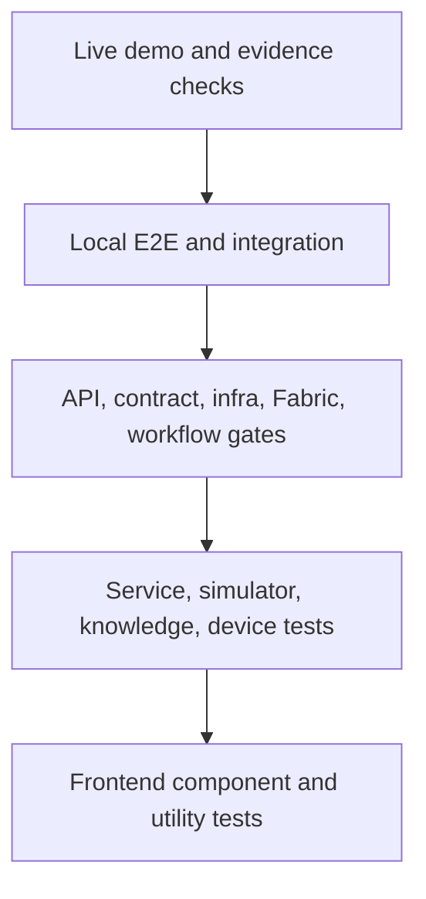

# Test Strategy

> **Artifact:** Test Strategy · **Audience:** QA, engineering, release, risk · **Status:** baseline · **Source of truth:** [local validation entry point](../../tools/validation/Validate-Repository.ps1)

NovaSteel’s test strategy proves that the synthetic decision-support slice is reproducible, contract-bound, secure-by-default, and honest about fallback. The repository validates deterministic simulators, Python services, frontend components, infrastructure definitions, Fabric assets, workflows, security scans, SBOM generation, live BFF checks, and presentation evidence without treating local success as production hardening.

## Test pyramid

| Level | Scope | Tooling | Location | Count/coverage |
|---|---|---|---|---|
| Frontend unit/component | React analytics MFE, operator capture MFE, help, charts, Dockview, devices, API clients | npm scripts, workspace test runners | `apps/analytics-mfe`, `apps/operator-capture-mfe` | README reports 265 frontend tests |
| Python unit/service | BFF, optimizer, scoring, knowledge orchestration, device simulator, contracts | `pytest` through Python from the protected feed | `services/*/tests`, `tests/backend`, `tests/knowledge`, `tests/devices`, `tests/simulator` | README reports 874 Python tests |
| Contract/schema | BFF OpenAPI alignment, schemas, event/data contracts, table semantics | `pytest`, contract validators | `tests/contract`, `services/bff-api/tests/test_contracts.py` | Covered by `contract-tests` gate |
| Integration/local E2E | BFF plus simulators, local demo API stack, persona journeys, validation tooling | `pytest`, live local HTTP checks | `tests/integration`, `tests/e2e`, `artifacts/demo-validation` evidence paths | README reports 66/66 live BFF checks and three further persona journeys |
| Infrastructure/Fabric/static | Bicep, policy, parameters, Foundry Agent Service, Fabric definitions, workflows | `pytest`, PowerShell validators, workflow tests | `tests/infra`, `tests/workflows`, `fabric/scripts/Test-FabricAssetsLocal.ps1` | Covered by infra, fabric and workflow CI gates |
| Security/evidence | Protected feeds, security scan, dependency integrity, SBOM, fallback/no-network, presentation package | validation scripts, SBOM generator, PPTX validator | `tools/validation`, `docs/validation-report.md`, `artifacts/validation` | 19 validation gates, 12/12 fallback checks, CycloneDX SBOM |

## Suites and ownership

| Test location | What it proves | Primary owner |
|---|---|---|
| `tests/contract` | BFF contract and schema drift checks stay aligned with source contracts | API/platform |
| `tests/simulator` | Deterministic scenario generation, authoritative fixtures, physics validation, loaders, CLI, sink HTTP and checksums | Data/simulation |
| `tests/backend` | Domain routes, Copilot API, agent routing, tool authorization, optimizer MILP, RUL model, telemetry and worker/BFF integration | Backend/AI services |
| `tests/integration` | Fabric operational round trip, local demo API stack, simulator-to-services path, validation tooling | Platform integration |
| `tests/e2e` | Local demo persona journeys through API-level flows | Demo/release |
| `tests/infra` | Bicep buildability, parameter completeness, naming, policy definitions, SKU allow-list, Foundry Agent Service and Fabric deployment parameters | Cloud platform |
| `tests/knowledge` | Consent, audio, grounding, retrieval, content safety, PII, prompt defense, critic, audit, erasure, agent manifest/router/tools/run loop, Copilot behaviour and evaluation | Knowledge/RAI |
| `tests/devices` | Device simulator catalog, engine, incidents, registry, series, signals, status, views and API-facing behaviours | Simulator/backend |
| `tests/presentation` | Marp deck source structure and timing/package validation | Presentation/demo |
| `tests/workflows` | GitHub Actions hardening and workflow consistency | DevEx/release |
| `services/bff-api/tests` | BFF app, adapters, fixture integrity, knowledge workflow, Fabric source and table query behaviour | Backend |
| `apps/*/*.test.*` | Frontend render logic, accessibility helpers, localized catalogs, API clients and component states | Frontend |

## Repository validation gates

`tools\validation\Validate-Repository.ps1` is the local validation entry point. Optional dependency restore and Bicep installation steps are setup helpers; the repository gate set is:

| # | Gate | Suite | Command name or evidence | What must pass |
|---:|---|---|---|---|
| 1 | Protected feed scan | `protected-feeds` | `verify-protected-feeds` | Executable/configuration scan finds no blocked package-feed usage |
| 2 | Contract tests | `contract` | `contract-tests` | `tests/contract` and BFF contract tests pass |
| 3 | Simulator tests | `simulator` | `simulator-tests` | Deterministic simulator suite passes |
| 4 | Backend and integration tests | `backend` | `backend-and-integration-tests` | BFF service tests, backend tests, integration tests and local E2E tests pass |
| 5 | Knowledge workflow tests | `knowledge` | `knowledge-workflow-tests` | Knowledge, RAG, safety, Copilot and agent tests pass |
| 6 | Frontend lint | `frontend` | `frontend-lint` | `npm run lint:frontend` succeeds |
| 7 | Frontend tests | `frontend` | `frontend-tests` | `npm run test:frontend` succeeds |
| 8 | Frontend build | `frontend` | `frontend-build` | `npm run build:analytics` succeeds |
| 9 | npm vulnerability audit | `frontend` | `npm-vulnerability-audit` | Runtime npm audit passes when an approved registry is configured |
| 10 | Portal protected restore | `portal` | `portal-protected-restore` | Blazor restore uses `NuGet.Config` and locked mode |
| 11 | Portal build | `portal` | `portal-build` | Release build succeeds without restore |
| 12 | Portal vulnerability gate | `portal` | `portal-vulnerability-report` plus `portal-vulnerability-gate` | Vulnerable package report is generated and evaluated |
| 13 | Infrastructure tests | `infra` | `infra-tests` | `tests/infra` passes |
| 14 | Infrastructure static validation | `infra` | `infra-static-validation` | `infra/scripts/validate.ps1 -Environment dev -SkipArmValidate` passes |
| 15 | Fabric local validator | `fabric` | `fabric-local-validator` | Fabric asset definitions validate locally |
| 16 | Presentation package validator | `presentation` | `presentation-package-validator` | Delivered PPTX package validates |
| 17 | Security gates | `security` | `security-gates` | Repository security scan passes |
| 18 | Python dependency integrity | `security` | `python-dependency-integrity` | `pip check` passes |
| 19 | SBOM generation | `sbom` | `generate-sbom` | CycloneDX SBOM is written |

## Continuous integration

| Workflow | Trigger | Gates | Evidence |
|---|---|---|---|
| `CI` (`ci.yml`) | Pull request, push to `main`, manual dispatch | Change detection, workflow lint, protected feeds, security/SBOM, contract, simulator, backend, knowledge, frontend, portal, infrastructure, Fabric, presentation | Per-suite artifacts under `artifacts/validation/{suite}` uploaded for 90 days |
| `CI build service images` (`ci-build-services.yml`) | PR or `main` push on service/app/contract paths; manual dispatch | Service image builds for BFF, optimizer, scoring, ingest relay, knowledge orchestrator, portal shell and capture MFE; non-PR ACR/OIDC checks; immutable image refs | Image digest outputs and optional demo deployment through `cd-services.yml` |
| `CodeQL` (`codeql.yml`) | Pull request, `main` push, weekly schedule, manual dispatch | Python and TypeScript CodeQL with no build; C# CodeQL with protected restore and Release build | Code scanning results in GitHub Security |
| `Presentation` (`presentation.yml`) | Presentation/docs/brand path changes on PR or `main`; manual dispatch | Presentation tests, Marp restore/build, HTML/PDF/notes/PPTX generation, artifact verification, optional Pages deploy | `novasteel-presentation-{run}` artifact and optional Pages site |
| `CD infrastructure` (`cd-infra.yml`) | Manual dispatch by environment | Protected feed policy, Bicep install, offline validation, production branch restriction, OIDC variables, what-if, deployment | `artifacts/deployment/infra` predeploy and deployment artifacts |
| `CD services` (`cd-services.yml`) | Manual dispatch or workflow call | Protected feed policy, immutable image digest, known environment/service, demo-only automatic promotion, OIDC service promotion | `artifacts/deployment/services` predeploy and deployment artifacts |
| `CD Fabric items` (`cd-fabric-items.yml`) | Manual dispatch by environment | Protected feed policy, Fabric local validator, environment-scoped configuration, production branch restriction, OIDC Fabric synchronization | `artifacts/deployment/fabric` validation and synchronization artifacts |

## Test data strategy

- The canonical demo pack is `services\bff-api\fixtures\demo-full`.
- The fixture pack contains NDJSON tables and a manifest/checksum file for deterministic replay.
- The local deterministic rehearsal uses seed `240725`, `DEMO_MODE=local`, and loopback-only BFF access.
- Simulator tests cover deterministic datasets, physics validation, scenario acceptance, reset and truth-ledger behaviour.
- Fabric and BFF paths are expected to tell the same story because they are generated from the same seeded scenario.
- `BFF_DATA_SOURCE` selects `fixture` or `fabric`; Fabric is a preferred source and not a hard dependency.
- When Fabric capacity is paused or unavailable, fallback to the committed fixture pack is visible through metadata rather than silent.
- All demonstration data is synthetic and non-personal.
- Measured evidence must stay separate from pilot targets.

## Non-functional and resilience testing

- Fallback/no-network evidence reports 12/12 checks.
- The local BFF uses loopback only during fallback checks.
- Fallback levels include local, cached and built-in data rungs.
- Capacity actions are simulated in the local/demo evidence path.
- Capacity workflow tests cover preconditions, allowed states and conflict behaviour.
- Audit tests validate append-only hash-chain invariance.
- Erasure tests preserve the audit-chain invariant while applying tombstone behaviour.
- Authorization checks re-apply role and plant scope in BFF routes and agent tool bodies.
- Agent tool authorization tests ensure a model-proposed site or tool is never trusted by itself.
- Security gates cover feed policy, workflow hardening, locked/pinned dependency posture and repository scans.
- CodeQL covers Python, TypeScript and C# on configured triggers.

## Evidence and artifacts

- `artifacts\validation\` is the default local evidence root.
- `artifacts\validation\evidence-manifest.json` is written by `Validate-Repository.ps1` unless overridden.
- `artifacts\validation\final\` is the documented final evidence location in `docs/validation-report.md`.
- `artifacts\demo-validation\http\` is the documented live-HTTP response evidence area.
- `artifacts\demo-validation\rehearsal-report.md` is the documented local rehearsal report.
- `artifacts\validation\novasteel.sbom.cdx.json` is generated by the SBOM gate.
- `artifacts\final-handoff.md` is referenced as final handoff evidence.
- README validated proof reports 66/66 live BFF checks, 1,139 automated tests, 19 validation gates and 12/12 fallback checks.
- README validated proof reports a 26-slide PowerPoint package.
- `docs/validation-report.md` records a separate 28-slide deck count, so the slide count should be reconciled before using slide quantity as a release assertion.
- Presentation validation checks no placeholders/TODO findings in the delivered deck package.

## Entry and exit criteria

| Stage | Entry criteria | Exit criteria |
|---|---|---|
| Local change | Dependencies already restored or restored through protected repo config; no public package-feed override | Targeted tests for touched area pass; docs-only changes are reviewed for factual accuracy |
| Pull request | Changed-component detection routes the relevant CI jobs | Required CI jobs for changed areas pass and artifacts upload |
| Demo rehearsal | `demo-full` fixture pack present; BFF reachable or fallback pack ready | 66/66 live BFF checks, persona journey evidence, fallback pack and rehearsal notes available |
| Release candidate | Local `Validate-Repository.ps1` evidence manifest available | 19 gates pass or intentional skips are justified outside strict mode |
| Cloud promotion | Environment variables, OIDC identity, protected feed policy and immutable image digest are present | What-if/deploy or synchronization evidence is uploaded; production dispatch is from `main` |
| Production pilot | Tenant capacity, Fabric, Foundry, Speech, Entra and DPO/Legal prerequisites complete | Not yet defined; production hardening and live-cloud rehearsal remain open gates |

## Explicitly out of scope

- Full browser click-through automation is not installed.
- Browser coverage is limited to component tests, served-asset probes, CORS checks and live BFF HTTP assertions.
- No OT hardware-in-the-loop testing is present.
- No PLC, MES, CMMS, recipe, setpoint, interlock, or production schedule write is tested because no write path exists.
- No production load test has been completed.
- No disaster-recovery rehearsal has been completed.
- No production accessibility rehearsal has been completed.
- No live target-tenant proof is inferred from local Fabric static validation.
- No real plant data, personal data, or production model accuracy claim is tested.
- No live web-search path is tested while `ONLINE_SEARCH_MODE` remains offline by default.

## Related artifacts

- [Glossary](glossary.md)
- [Diagrams](diagrams/README.md)
- [Solution Architecture](solution-architecture.md)
- [Data Baseline](data-baseline.md)
- [AI Design](ai-design.md)
- [Security Baseline](security-baseline.md)
- [Compliance](compliance.md)
- [Operating Model](operating-model.md)
- [Business Value Assessment](business-value-assessment.md)
