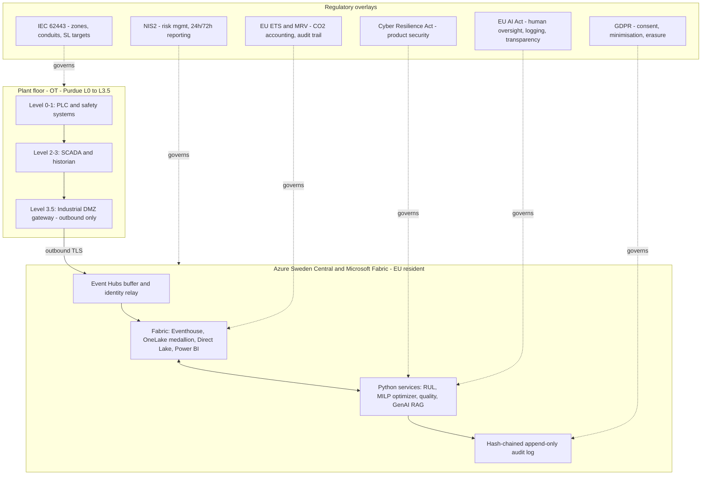

# NovaSteel — Regulatory & Compliance Analysis

> **Purpose:** map the EU and international regulations that bear on the NovaSteel platform to the *specific* articles/clauses they impose and to the *actual repository artifacts* that implement (or would implement) each obligation.
> **Status:** Analysis v1.0 — advisory register for enterprise architects, CISO, DPO and Legal. Not a legal opinion and not a conformity claim.
> **Last reviewed:** 2026-07-29
> **Back to:** [documentation index](../../README.md) · **Companion authority:** [security governance & threat model](../../security/security-governance-and-threat-model.md)

---

## 0. How to read this analysis

NovaSteel is a **synthetic-data demonstration and defense project**: an EU-resident, Microsoft Fabric-centred, **advisory-only** decision-support platform for a fictitious steel producer ("AxelorMetal") operating in Luxembourg, Germany, Belgium and Spain. It does **not** write back to any PLC, safety interlock, furnace, recipe or setpoint system ([solution architecture §1.1](../../architecture/solution-architecture.md)).

Every document in this folder separates, explicitly and consistently:

| Legend | Meaning |
|---|---|
| ✅ implemented | A control that exists and is evidenced in the running local baseline (code, tests, IaC, or source-controlled Fabric/policy assets). |
| 🟡 designed | A control that is architected and documented but not yet exercised against non-synthetic data or a live tenant. |
| ⬜ pilot gate | A control that is deliberately deferred to the shadow pilot or production write-back phase, and is a named go-live gate. |

We never claim certification, third-party verification, or a conformity assessment that does not exist. Where the platform produces *management information* rather than a *regulated filing*, we say so.

### Document set

| # | Document | Scope |
|---|---|---|
| 1 | **This README** | Landscape, applicability, consolidated obligations matrix. |
| 2 | [eu-ai-act.md](eu-ai-act.md) | Regulation (EU) 2024/1689 — risk tiering, Art. 8–15 & 26–27 duties, GPAI, timeline. |
| 3 | [eu-ets.md](eu-ets.md) | Directive 2003/87/EC (as amended by 2023/959), MRV, free allocation, CBAM. |
| 4 | [iec-62443.md](iec-62443.md) | IACS cybersecurity — Purdue zones/conduits, FR1–FR7, SL targets. |
| 5 | [other-regulations.md](other-regulations.md) | NIS2, GDPR, CSRD/ESRS, Machinery, IEC 61508/61511, Data Act, CRA, DORA, EED, IED, ISO/IEC 27001 & 42001, NIST AI RMF, Data Boundary. |
| 6 | [compliance-roadmap.md](compliance-roadmap.md) | Phased implementation, gates, RACI, residual-risk register. |

---

## 1. Regulatory landscape overview

NovaSteel sits at the intersection of five regulatory families, because it is simultaneously (a) an **AI system**, (b) an **industrial/OT-adjacent platform** for a **basic-metals** operator, (c) a **carbon-regulated installation's** reporting surface, (d) a **personal-data processor** (operator voice/knowledge capture), and (e) a **cloud software product**.

| Family | Primary instruments | Why it applies to NovaSteel |
|---|---|---|
| **AI regulation** | EU AI Act (Reg. (EU) 2024/1689); ISO/IEC 42001:2023; NIST AI RMF 1.0 | Physics-informed RUL model, MILP energy optimizer, in-line quality prediction, and a grounded GenAI/LLM knowledge assistant all influence industrial decisions. |
| **Industrial / OT cybersecurity** | IEC 62443 series; NIS2 (Dir. (EU) 2022/2555); Cyber Resilience Act (Reg. (EU) 2024/2847); ISO/IEC 27001:2022 | Per-plant OT gateways cross an industrial DMZ; "manufacture of basic metals" is a NIS2 sector; the platform is a software product with digital elements. |
| **Climate / environment** | EU ETS (Dir. 2003/87/EC, amended by Dir. (EU) 2023/959); MRV (Impl. Reg. (EU) 2018/2066 & 2018/2067); FAR (Reg. (EU) 2019/331); CBAM (Reg. (EU) 2023/956); IED (Dir. 2010/75/EU, amended by Dir. (EU) 2024/1785); EED (Dir. (EU) 2023/1791) | The platform tracks CO₂ intensity, Scope 1/2 emissions and ETS allowance exposure for an iron-&-steel installation. |
| **Data protection** | GDPR (Reg. (EU) 2016/679); EU Data Boundary; Data Act (Reg. (EU) 2023/2854) | Operator interviews are personal data (voice); automated decision-support touches Art. 22; IoT-generated OT data raises Data Act access questions. |
| **Corporate sustainability** | CSRD (Dir. (EU) 2022/2464) + ESRS; "Stop-the-clock" Dir. (EU) 2025/794 | A large EU producer must report climate metrics under ESRS E1; NovaSteel is a candidate data source for that reporting. |

### 1.1 How the regulations layer over the architecture

The single most important architectural fact for compliance is the **advisory-only, outbound-only boundary**: because no NovaSteel component writes to OT, several of the heaviest regimes (Machinery Regulation as a safety component, EU AI Act Annex I product-safety high-risk route, IEC 61511 SIS scope) are held *out of scope by design* rather than by claim. See [iec-62443.md §3](iec-62443.md#3-purdue-model-mapping-and-the-no-write-back-guarantee) and [other-regulations.md §4](other-regulations.md#4-eu-machinery-regulation-eu-20231230).

---

## 2. Applicability summary

| Regulation | Instrument | Applies to NovaSteel? | Role of the platform | Detail |
|---|---|---|---|---|
| EU AI Act | Reg. (EU) 2024/1689 | **Yes** | Provider *and* deployer of AI systems (advisory) | [eu-ai-act.md](eu-ai-act.md) |
| EU ETS + MRV | Dir. 2003/87/EC; 2018/2066; 2018/2067; 2019/331 | **Yes (indirect)** | Produces MRV-supporting management information, **not** the regulated report | [eu-ets.md](eu-ets.md) |
| CBAM | Reg. (EU) 2023/956 | **Contextual** | Not an importer; provides embedded-emissions data lineage | [eu-ets.md §7](eu-ets.md#7-cbam-linkage-regulation-eu-2023956) |
| IEC 62443 | 62443-2-1 / -3-2 / -3-3 / -4-1 / -4-2 | **Yes** | IACS security programme + component/system requirements | [iec-62443.md](iec-62443.md) |
| NIS2 | Dir. (EU) 2022/2555 | **Yes** | AxelorMetal = "important entity" (basic metals); NovaSteel is in-scope ICT | [other-regulations.md §1](other-regulations.md#1-nis2-directive-eu-20222555) |
| GDPR | Reg. (EU) 2016/679 | **Yes** | Controller/processor of operator personal data | [other-regulations.md §2](other-regulations.md#2-gdpr-regulation-eu-2016679) |
| CSRD / ESRS | Dir. (EU) 2022/2464; Dir. (EU) 2025/794 | **In flux** | Candidate ESRS E1 data source | [other-regulations.md §3](other-regulations.md#3-csrd--esrs-directive-eu-20222464--stop-the-clock-2025794) |
| Machinery Regulation | Reg. (EU) 2023/1230 | **No (by design)** | Advisory-only; not a safety component | [other-regulations.md §4](other-regulations.md#4-eu-machinery-regulation-eu-20231230) |
| IEC 61508 / 61511 | Functional safety | **Boundary only** | SIS stays independent; no SIF is implemented in NovaSteel | [other-regulations.md §5](other-regulations.md#5-functional-safety-boundary--iec-61508--iec-61511) |
| Data Act | Reg. (EU) 2023/2854 | **Yes (watch)** | IoT data access/sharing, cloud switching | [other-regulations.md §6](other-regulations.md#6-eu-data-act-regulation-eu-20232854) |
| Cyber Resilience Act | Reg. (EU) 2024/2847 | **Yes (future)** | Product with digital elements | [other-regulations.md §7](other-regulations.md#7-eu-cyber-resilience-act-regulation-eu-20242847) |
| DORA | Reg. (EU) 2022/2554 | **No** | Financial-entity scope only | [other-regulations.md §8](other-regulations.md#8-dora-regulation-eu-20222554--not-applicable) |
| EED | Dir. (EU) 2023/1791 | **Yes (indirect)** | Supports energy audits/EnMS (ISO 50001) | [other-regulations.md §9](other-regulations.md#9-energy-efficiency-directive-eu-20231791--iso-50001) |
| IED | Dir. 2010/75/EU (am. 2024/1785) | **Contextual** | Steel BAT context; not the permit system | [other-regulations.md §10](other-regulations.md#10-industrial-emissions-directive-201075eu-amended-by-eu-20241785) |
| ISO/IEC 27001:2022 | ISMS | **Voluntary/aligned** | Security controls mapped, not certified | [other-regulations.md §11](other-regulations.md#11-isoiec-270012022) |
| ISO/IEC 42001:2023 | AIMS | **Voluntary/aligned** | AI management system alignment | [other-regulations.md §12](other-regulations.md#12-isoiec-420012023-ai-management-system) |
| NIST AI RMF 1.0 | AI risk framework | **Voluntary/aligned** | Govern/Map/Measure/Manage crosswalk | [other-regulations.md §13](other-regulations.md#13-nist-ai-rmf-10) |

---

## 3. Consolidated compliance-obligations matrix

The columns are: **regulation → article/clause → concrete project impact → implementation → evidence artifact → status.** Each row links to the fuller treatment in the per-regulation document. Status uses the legend in §0.

### 3.1 EU AI Act

| Article/clause | Project impact | Implementation | Evidence artifact | Status |
|---|---|---|---|---|
| Art. 5 (prohibited practices) | No social scoring, no biometric/emotion recognition, no subliminal manipulation | Use cases confined to process optimization; no prohibited feature exists | [eu-ai-act.md §3.1](eu-ai-act.md#31-article-5--prohibited-practices) | ✅ |
| Art. 6 + Annex III (high-risk) | Classified **not** Annex III high-risk (no industrial-process entry); Art. 6(1) product route argued out via advisory-only boundary | Advisory-only, no OT write-back; documented posture | [solution architecture §1.1](../../architecture/solution-architecture.md); [security §16.2](../../security/security-governance-and-threat-model.md) | 🟡 |
| Art. 12 (logging / record-keeping) | Every consequential AI output must be traceable | SHA-256 hash-chained append-only audit log; `verify()` invariant | [`bff-api/.../audit.py`](../../../services/bff-api/src/bff_api/audit.py); FR-GOV-01 | ✅ |
| Art. 13 (transparency to deployer) | Plain-language rationale on each recommendation | Rationale/€/CO₂ surfaced pre-action | FR-ENE-04; [api-contracts](../../implementation/api-contracts.md) | ✅ |
| Art. 14 (human oversight) | No autonomous action with real-world effect | Forbidden-tool list; human approval gates; simulated/shadow decisions | [proofCatalog REG-02](../../../apps/analytics-mfe/src/proof/proofCatalog.ts); FR-GOV-05 | ✅ |
| Art. 15 (accuracy/robustness/cybersecurity) | Confidence bands; secure supply chain | Uncertainty on RUL; Prompt Shields; protected feeds | AI-08; security §12, §19 | ✅/🟡 |
| Art. 50 (transparency of AI interaction) | Users told they interact with AI | Copilot chat labelled; consent before interview | [security §12.1, §13](../../security/security-governance-and-threat-model.md) | ✅ |
| Art. 4 (AI literacy) | Staff competence | Illustrated app guide; persona training design | [app-guide 07](../../presentation/assets/app-guide/en/07-sustainability-and-compliance.md) | 🟡 |
| Art. 26 (deployer obligations) | Oversight, input data, logs kept | Deployer runbook design | [compliance-roadmap.md](compliance-roadmap.md) | ⬜ |
| Art. 27 (FRIA) | Fundamental-rights impact assessment | Templated at pilot gate | [compliance-roadmap.md §3](compliance-roadmap.md#3-gate-criteria-per-phase) | ⬜ |
| Chapter V Art. 51–55 (GPAI) | LLM used for RAG | Rely on model provider's GPAI compliance; grounded, tool-free chat | [eu-ai-act.md §8](eu-ai-act.md#8-general-purpose-ai-gpai-obligations) | 🟡 |

### 3.2 EU ETS / MRV

| Article/clause | Project impact | Implementation | Evidence artifact | Status |
|---|---|---|---|---|
| Dir. 2003/87/EC Annex I (iron & steel activity) | Installation is ETS-covered | Emissions modelled per plant/day | [`20_gold.sql` fact_emissions_daily](../../../fabric/lakehouse/sql/20_gold.sql) | 🟡 |
| Impl. Reg. 2018/2066 Art. 11–12 (monitoring plan, methodology) | Emission-factor lineage & calculation versioning | `calculation_version` column; Scope 1/2 split | [gold notebook](../../../fabric/notebooks/ns-silver-to-gold.Notebook/notebook-content.py) | 🟡 |
| Impl. Reg. 2018/2067 (verification by accredited verifier) | Independent verification required | **Not** performed — management info only | [app-guide 07 "before a real filing"](../../presentation/assets/app-guide/en/07-sustainability-and-compliance.md) | ⬜ |
| Reg. 2019/331 (free allocation, benchmarks) | Benchmark-based free allocation | `free_allocation_t = crude_steel × 1.50` (demo constant) | [gold notebook](../../../fabric/notebooks/ns-silver-to-gold.Notebook/notebook-content.py) | 🟡 |
| Art. 12 surrender / allowance cost | Cost signal in dispatch | CO₂ term in MILP objective; ETS € exposure | [`optimizer milp.py`](../../../services/optimizer-worker/src/optimizer_worker/milp.py) | ✅ |

### 3.3 IEC 62443

| Requirement | Project impact | Implementation | Evidence artifact | Status |
|---|---|---|---|---|
| 62443-3-2 (zones/conduits, SL-T) | Zone/conduit model & risk assessment | Purdue L0–L5 mapping; DMZ conduit | [iec-62443.md §4](iec-62443.md#4-zone-and-conduit-model); [deployment-topology §3](../../architecture/deployment-topology.md) | 🟡 |
| FR1 (identification & authentication) | Every identity verified | Entra ID, managed identities, per-plant gateway MI | [security §2, §3](../../security/security-governance-and-threat-model.md) | ✅/🟡 |
| FR5 (restricted data flow) | OT/IT segmentation | Outbound-only DMZ; deny public network access policy | [`deny-public-network-access.json`](../../../infra/policy/definitions/deny-public-network-access.json) | ✅ |
| 62443-4-1 (secure development) | SDLC controls | Protected feeds, SBOM, OIDC, secret scanning | [security §19–21](../../security/security-governance-and-threat-model.md) | ✅ |

### 3.4 NIS2 / GDPR / cross-cutting

| Article/clause | Project impact | Implementation | Evidence artifact | Status |
|---|---|---|---|---|
| NIS2 Art. 21 (risk-management measures) | 10 baseline measures | Zero Trust, encryption, MFA, supply chain | [security governance](../../security/security-governance-and-threat-model.md) | ✅/🟡 |
| NIS2 Art. 23 (incident reporting) | 24h/72h/1-month cadence | IR process; 72h GDPR notification embedded | [security §10.2](../../security/security-governance-and-threat-model.md) | 🟡 |
| GDPR Art. 5, 6, 9 (principles, lawful basis) | Voice = personal data | Consent-first interview; minimisation | [security §13, §16.1](../../security/security-governance-and-threat-model.md) | 🟡 |
| GDPR Art. 17 (erasure) | Right to erasure vs immutable audit | Crypto-shred + pseudonymise + tombstone | [`erasure.py`](../../../services/knowledge-orchestrator/src/knowledge_orchestrator/erasure.py); FR-PRI-01..04 | ✅ |
| GDPR Art. 22 (automated decisions) | No solely-automated decisions | Human-in-the-loop on every consequential output | FR-GOV-05; [security §15](../../security/security-governance-and-threat-model.md) | ✅ |
| GDPR Art. 32 (security of processing) | Encryption, access control | TLS 1.2+, CMK, RBAC, private endpoints | [security §8, §4](../../security/security-governance-and-threat-model.md) | ✅/🟡 |
| GDPR Art. 35 (DPIA) | High-risk voice processing | DPIA at pilot gate | [compliance-roadmap.md](compliance-roadmap.md) | ⬜ |

---

## 4. Cross-cutting evidence spine

Four artifacts recur across almost every obligation and are the compliance "spine":

1. **Hash-chained append-only audit log** — [`services/bff-api/src/bff_api/audit.py`](../../../services/bff-api/src/bff_api/audit.py) and [`services/knowledge-orchestrator/src/knowledge_orchestrator/audit.py`](../../../services/knowledge-orchestrator/src/knowledge_orchestrator/audit.py), durable via [`azure_audit.py`](../../../services/bff-api/src/bff_api/adapters/azure_audit.py). Serves AI Act Art. 12, ETS MRV integrity, NIS2 accountability, GDPR Art. 5(2) accountability.
2. **Advisory-only / no-write-back boundary** — [solution architecture §1.1](../../architecture/solution-architecture.md), [security §11](../../security/security-governance-and-threat-model.md). Keeps Machinery Regulation, AI Act product-route high-risk and IEC 61511 SIS out of scope.
3. **EU-resident, Zero-Trust cloud** — Sweden Central primary, private endpoints, [`deny-public-network-access.json`](../../../infra/policy/definitions/deny-public-network-access.json). Serves GDPR residency, NIS2/IEC 62443 network isolation.
4. **Requirement & proof catalogs** — `FR-GOV-*`, `FR-PRI-*` in [solution requirements](../../specs/solution-requirements.md); `REG-01/02/03` in [`proofCatalog.ts`](../../../apps/analytics-mfe/src/proof/proofCatalog.ts). Provide the traceability the AI Act, ETS and GDPR all demand.

---

## 5. Watch list (not yet in force at 2026-07-29)

| Item | Status | Trigger date | Note |
|---|---|---|---|
| EU AI Act — high-risk obligations (Art. 6(1) product route) | Enacted, deferred application | 2 Aug 2027 (Reg. 2024/1689 Art. 113) | Commission "Digital/AI Omnibus" (2025–2026) proposes further adjustment — treat as *proposed* pending confirmation. |
| CRA — main manufacturer obligations | Enacted | 11 Dec 2027 (reporting duties 11 Sep 2026) | Applies if NovaSteel is placed on the market as a product. |
| Machinery Regulation | Enacted | 20 Jan 2027 | Out of scope while advisory-only. |
| CSRD ESRS waves | In flux | Per Dir. (EU) 2025/794 "stop-the-clock" | Reporting timeline delayed; scope under Omnibus review. |
| Data Act | Applicable | 12 Sep 2025 | IoT data access/sharing and cloud-switching obligations live. |

---

## Sources

- Regulation (EU) 2024/1689 (AI Act) — official text: https://eur-lex.europa.eu/eli/reg/2024/1689/oj/eng (retrieved 2026-07-29)
- European Commission — Regulatory framework on AI (risk tiers, timeline): https://digital-strategy.ec.europa.eu/en/policies/regulatory-framework-ai (retrieved 2026-07-29)
- Directive (EU) 2022/2555 (NIS2): https://eur-lex.europa.eu/eli/dir/2022/2555/oj/eng (retrieved 2026-07-29)
- Directive (EU) 2023/959 (ETS revision): https://eur-lex.europa.eu/eli/dir/2023/959/oj/eng (retrieved 2026-07-29)
- Implementing Regulation (EU) 2018/2066 (MRR): https://eur-lex.europa.eu/eli/reg_impl/2018/2066/oj/eng (retrieved 2026-07-29)
- European Commission — Carbon Border Adjustment Mechanism (CBAM): https://taxation-customs.ec.europa.eu/carbon-border-adjustment-mechanism_en (retrieved 2026-07-29)
- Directive (EU) 2025/794 ("stop-the-clock"): https://eur-lex.europa.eu/eli/dir/2025/794/oj/eng (retrieved 2026-07-29)
- Regulation (EU) 2024/2847 (Cyber Resilience Act): https://eur-lex.europa.eu/eli/reg/2024/2847/oj/eng (retrieved 2026-07-29)
- Regulation (EU) 2023/2854 (Data Act): https://eur-lex.europa.eu/eli/reg/2023/2854/oj/eng (retrieved 2026-07-29)
- Directive (EU) 2024/1785 (IED amendment): https://eur-lex.europa.eu/eli/dir/2024/1785/oj/eng (retrieved 2026-07-29)
- Directive (EU) 2023/1791 (EED recast): https://eur-lex.europa.eu/eli/dir/2023/1791/oj/eng (retrieved 2026-07-29)
- Regulation (EU) 2023/1230 (Machinery): https://eur-lex.europa.eu/eli/reg/2023/1230/oj/eng (retrieved 2026-07-29)
