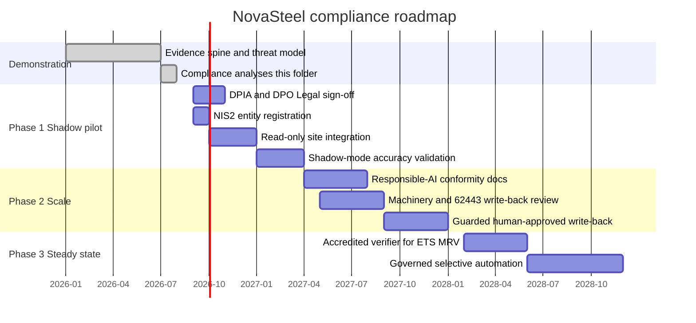
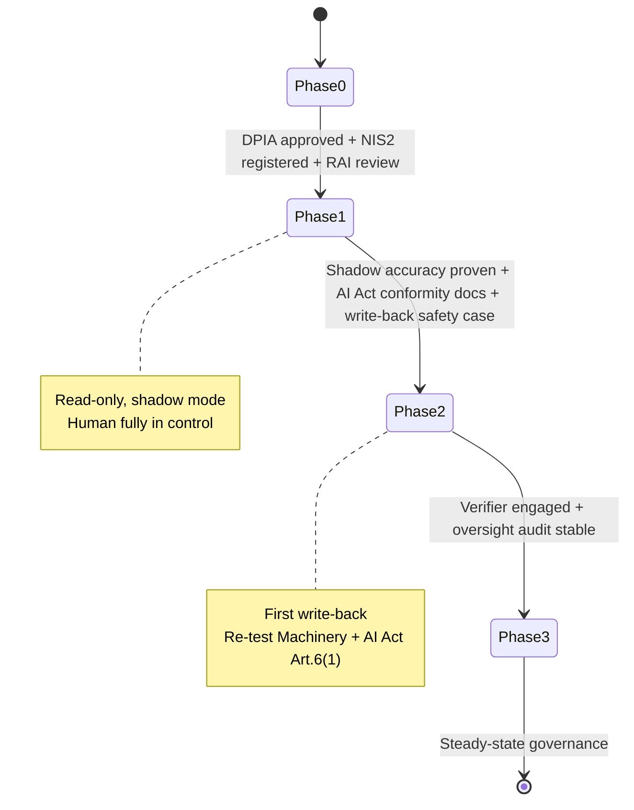
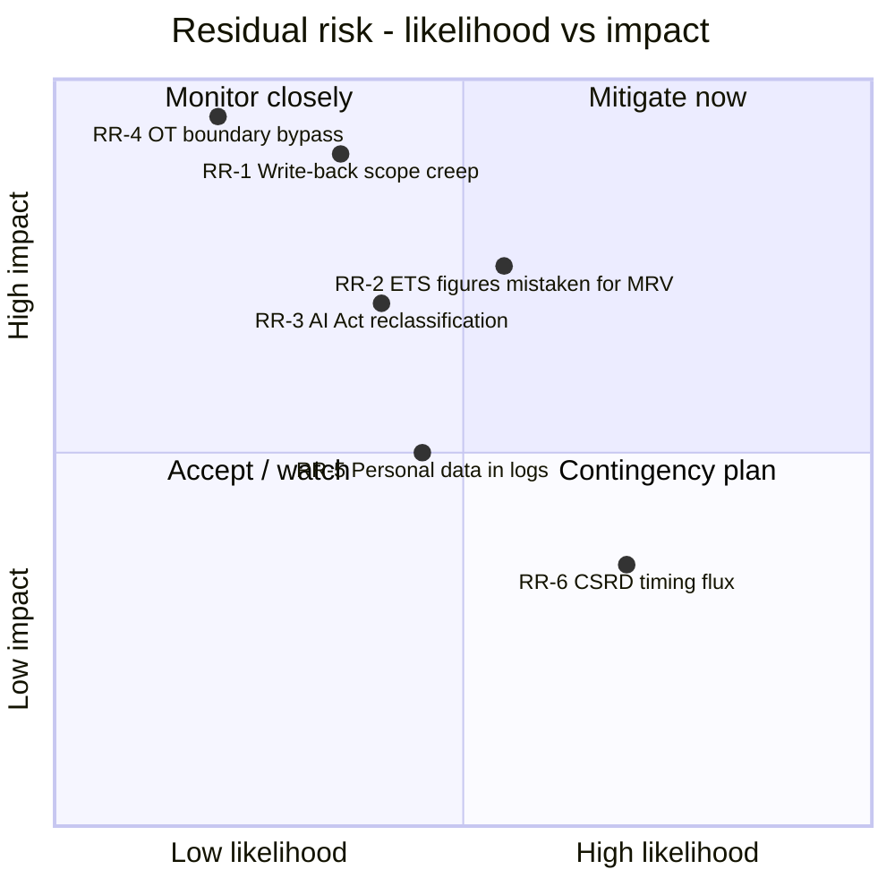

# Compliance Implementation Roadmap

> **Purpose:** a phased plan to move NovaSteel from a synthetic-data demonstration to a governed production deployment, with per-phase gate criteria, accountable roles (RACI), and a residual-risk register.
> **Status:** Planning v1.0 — aligns with the repo's demonstration → Phase 1–3 model ([solution-requirements §18](../../specs/solution-requirements.md)). Not a commitment or legal opinion.
> **Last reviewed:** 2026-07-29
> **Back to:** [compliance index](README.md) · **Related:** [eu-ai-act.md](eu-ai-act.md) · [eu-ets.md](eu-ets.md) · [iec-62443.md](iec-62443.md) · [other-regulations.md](other-regulations.md)

Status legend: ✅ done · 🟡 in progress / designed · ⬜ future gate.

---

## 1. Phase model

The compliance roadmap tracks the engagement's own phasing ([solution-requirements §18](../../specs/solution-requirements.md)); each phase raises both capability and regulatory burden.

| Phase | Data & integration | AI posture | Dominant compliance theme |
|---|---|---|---|
| **Demonstration** (now) | Synthetic/simulated only (O7); read-only | Advisory; human decides everything | Design conformance & evidence spine |
| **Phase 1 — One-site shadow pilot** (0–6 mo) | One real site, **read-only** historian/energy/quality/CMMS; GDPR consent live | **Shadow mode** — logged, not acted on | DPIA, DPO/Legal sign-off, NIS2 registration |
| **Phase 2 — Scale + guarded write-back** (6–18 mo) | 4 sites; **bi-directional** to CMMS/MES where approved | Human-approved execution (FR-ENE-07 guardrails) | AI Act conformity docs (C-08); Machinery/62443 re-assessment |
| **Phase 3 — Steady state** (18+ mo) | Full production lineage; long-term retention | Selective governed automation for low-risk classes | Continuous oversight audit; ETS/CBAM forecasting (still O3: report, not trade) |

---

## 2. Regulatory gate map

---

## 3. Gate criteria per phase

Each transition is blocked until **all** its gate criteria are met. A gate is owned by an accountable role (see §4).

### Gate G0→1 — enter the shadow pilot

| # | Criterion | Owner | Reg driver | Status |
|---|---|---|---|---|
| G0.1 | **DPIA** completed & accepted for real operator data | DPO | GDPR Art. 35 | ⬜ |
| G0.2 | **DPO/Legal sign-off** on lawful basis, retention, consent flow | DPO / Legal | GDPR Art. 5/6/9/13 | ⬜ |
| G0.3 | **NIS2 entity registration** with national competent authority | CISO | NIS2 Art. 3/27 | ⬜ |
| G0.4 | **Responsible-AI review** of the four AI systems & human-oversight design | RAI Board | AI Act Art. 14; ISO 42001 | 🟡 |
| G0.5 | **OT/site approval** for read-only historian tap; DMZ gateway BOM confirmed | OT/ICS Engineer | IEC 62443-3-2; NIS2 Art. 21 | ⬜ |
| G0.6 | AI-literacy training delivered to pilot users | RAI Board / HR | AI Act Art. 4 | ⬜ |
| G0.7 | Evidence spine live (audit hash-chain, lineage, retention) | Platform Lead | Cross-cutting | ✅ |

### Gate G1→2 — enable guarded write-back

| # | Criterion | Owner | Reg driver | Status |
|---|---|---|---|---|
| G1.1 | Shadow-mode **accuracy validated** vs real outcomes | Data Science Lead | AI Act Art. 15 | ⬜ |
| G1.2 | **AI Act conformity documentation** finalised (Annex IV-style tech file) (C-08) | RAI Board / Legal | AI Act Art. 11/6(1) | ⬜ |
| G1.3 | **Write-back safety case** — Machinery Regulation & AI Act Art. 6(1) re-assessment; confirm recommendation is **not** a safety function | Safety Engineer / Legal | Machinery 2023/1230; IEC 61511 | ⬜ |
| G1.4 | 62443 **SL-C assessment** for the write-back conduit (new inbound path) | OT/ICS Engineer | IEC 62443-3-3 FR3/FR5 | ⬜ |
| G1.5 | Approval-guardrail controls tested (FR-ENE-07); reason-coded human approval enforced | Product Lead | AI Act Art. 14 | 🟡 |
| G1.6 | NIS2 **incident-reporting** path exercised (24h/72h/1mo tabletop) | CISO | NIS2 Art. 23 | ⬜ |

### Gate G2→3 — steady-state governance

| # | Criterion | Owner | Reg driver | Status |
|---|---|---|---|---|
| G2.1 | **Accredited verifier** engaged for any ETS/CSRD figure to leave "management information" status | Sustainability Lead | ETS AVR 2018/2067; CSRD assurance | ⬜ |
| G2.2 | Approved **Monitoring Plan** & MRR-tiered metering for MRV-grade emissions | Sustainability Lead | MRR 2018/2066 | ⬜ |
| G2.3 | Continuous **human-oversight audit** stable (FR-GOV-05) | RAI Board | AI Act Art. 14/26 | ⬜ |
| G2.4 | Long-term audit retention (10y for ETS) operational | Platform Lead | MRR Art. 66; ETS | ⬜ |
| G2.5 | **Notified-body questions** resolved if any component becomes a regulated product (CE/Machinery/CRA) | Legal | Machinery; CRA | ⬜ |

---

## 4. RACI

Roles use the repo's persona/support vocabulary where possible ([security §22](../../security/security-governance-and-threat-model.md)). R = Responsible, A = Accountable, C = Consulted, I = Informed.

| Activity | DPO | CISO | RAI Board | OT/ICS Eng. | Sustainability Lead | Legal | Platform Lead | Data Science Lead |
|---|---|---|---|---|---|---|---|---|
| DPIA (G0.1) | A/R | C | C | I | I | C | I | I |
| NIS2 registration (G0.3) | I | A/R | I | C | I | C | I | I |
| Responsible-AI review (G0.4) | C | C | A/R | I | I | C | I | R |
| OT read-only tap approval (G0.5) | I | C | I | A/R | I | I | C | I |
| Shadow accuracy validation (G1.1) | I | I | C | I | I | I | C | A/R |
| AI Act conformity file (G1.2) | C | C | A/R | I | I | R | C | C |
| Write-back safety case (G1.3) | I | C | C | R | I | A | C | I |
| 62443 SL-C assessment (G1.4) | I | A | I | R | I | I | C | I |
| Accredited verifier / MRV (G2.1–2.2) | I | I | I | I | A/R | C | C | I |
| Continuous oversight audit (G2.3) | C | C | A/R | I | I | I | R | C |

---

## 5. Residual-risk register

Risks that persist after the designed controls; each has an owner and a phase by which it must be retired.

| ID | Residual risk | Existing control | Residual owner | Retire by | Status |
|---|---|---|---|---|---|
| **RR-1** | Write-back scope creep turns advisory tool into a safety/high-risk system | No-write-back boundary (FR-ENE-07); gate G1.3/G1.4 | Safety Eng. / Legal | Phase 2 gate | 🟡 |
| **RR-2** | ETS/CSRD **management info** presented as a regulated MRV/assurance figure | UI banners; proof REG-03 *partial*; §5 of [eu-ets.md](eu-ets.md#5-the-management-information-vs-regulated-mrv-boundary-be-explicit) | Sustainability Lead | Phase 3 (verifier) | 🟡 |
| **RR-3** | AI Act reclassification (Art. 6(1) product route / Omnibus shift) makes a future variant high-risk | Conservative "high-risk-adjacent" posture (C-08, A8) | RAI Board / Legal | Phase 2 | 🟡 |
| **RR-4** | OT boundary bypass (new inbound conduit) | 62443 zone/conduit; gate G11; protocol break | OT/ICS Eng. | Continuous | 🟡 |
| **RR-5** | Personal data leaks into audit/access logs | PII redaction (`_SENSITIVE_KEYS`); Art. 17 erasure; retention limits | DPO | Phase 1 | ✅/🟡 |
| **RR-6** | CSRD/Omnibus timing changes invalidate reporting assumptions | Treated as "in flux" ([other-regulations §3](other-regulations.md#3-csrd--esrs-directive-eu-20222464--stop-the-clock-2025794)) | Sustainability Lead / Legal | Ongoing watch | 🟡 |
| **RR-7** | Verifier/authority rejects methodology | `calculation_version` lineage; approved Monitoring Plan gate G2.2 | Sustainability Lead | Phase 3 | ⬜ |

---

## 6. Summary

The roadmap keeps the **hard boundaries** (no write-back, advisory-only, EU-resident, human-in-the-loop) intact through Phase 1, and treats every relaxation of those boundaries as an explicit, owned gate with a regulatory trigger — DPIA and NIS2 registration before real data, an AI-Act conformity file and a Machinery/62443 safety case before any write-back, and an accredited verifier before any emissions figure is allowed to leave "management information" status. Nothing in the demo asserts a certification, verification, or conformity that has not been earned.

---

## Sources

- Solution requirements — phasing (§18), objectives, out-of-scope O1–O7, C-08/A8: [solution-requirements.md](../../specs/solution-requirements.md) (repo, retrieved 2026-07-29)
- Security governance & threat model — RACI, security gates, IR runbook: [security-governance-and-threat-model.md](../../security/security-governance-and-threat-model.md) (repo, retrieved 2026-07-29)
- Cross-references: [eu-ai-act.md](eu-ai-act.md), [eu-ets.md](eu-ets.md), [iec-62443.md](iec-62443.md), [other-regulations.md](other-regulations.md).
