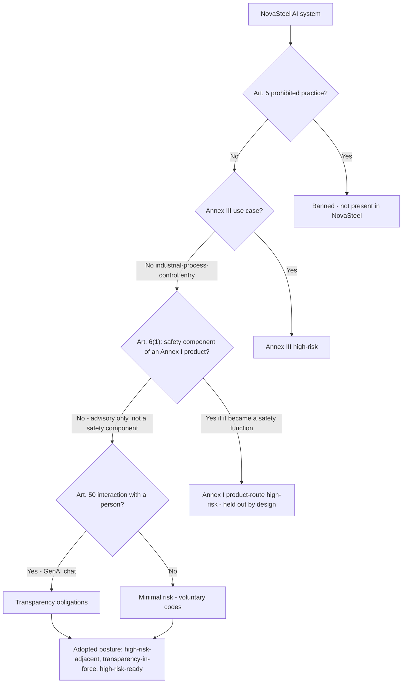

# EU AI Act — Regulation (EU) 2024/1689

> **Purpose:** determine how the EU AI Act applies to NovaSteel's AI systems, argue the risk classification, and map every triggered obligation to a concrete repository artifact.
> **Status:** Analysis v1.0 — conservative, deployer-and-provider posture pending formal Legal classification. Not a legal opinion.
> **Last reviewed:** 2026-07-29
> **Back to:** [compliance index](README.md) · **Authority:** [security governance §16.2](../../security/security-governance-and-threat-model.md)

---

## 1. The AI systems in scope

NovaSteel contains four distinct AI/algorithmic systems, each with a different regulatory profile. Naming them precisely is the prerequisite to any correct classification, because the AI Act regulates **systems and their intended purpose**, not "the platform".

| # | AI system | Technique | Intended purpose | Output consumed by | Requirement IDs |
|---|---|---|---|---|---|
| AI-1 | **Furnace-lining RUL** | Physics-informed OLS regression over thermal features | Estimate remaining useful life; ≥21-day advance warning | Maintenance/Reliability Engineer (advisory) | FR-FUR-02..07, AI-01, AI-08 |
| AI-2 | **Energy-dispatch optimizer** | PuLP/CBC mixed-integer linear program (MILP) | Recommend a lower-cost / lower-CO₂ schedule | Energy Manager (approve/modify/reject) | FR-ENE-01..07, AI-02 |
| AI-3 | **In-line quality prediction** | Explainable risk model over process/chemistry | Predict high-grade conformance; suggest what-if adjustments | Quality Engineer (advisory) | FR-QUA-01..05, AI-04 |
| AI-4 | **GenAI knowledge capture + grounded RAG** | LLM interview + hybrid retrieval, RRF, citation-enforced | Elicit tacit knowledge; answer grounded operator questions | All personas (read); Knowledge Engineer publishes | FR-KNW-01..08, AI-03, AI-07 |

All four are **advisory-only**: none writes to a PLC, setpoint, recipe or safety interlock ([solution architecture §1.1](../../architecture/solution-architecture.md); [security §11](../../security/security-governance-and-threat-model.md)). AI-2 and AI-4 are the highest-risk surfaces because they combine (semi-)untrusted input with tool-calling; the platform strips their ability to act (see §5).

---

## 2. Regulatory anatomy and timeline

### 2.1 Entry into force and staggered application (Art. 113)

Regulation (EU) 2024/1689 entered into force on **1 August 2024**. Its obligations apply on a staggered calendar under **Article 113**:

| Date | What becomes applicable |
|---|---|
| **1 Aug 2024** | Entry into force. |
| **2 Feb 2025** | Chapter I (general provisions incl. **Art. 4 AI literacy**) and Chapter II (**Art. 5 prohibited practices**). |
| **2 Aug 2025** | GPAI obligations (Chapter V), governance bodies, notified-body provisions, confidentiality and **penalties**. |
| **2 Aug 2026** | **General application**, including Annex III high-risk obligations and Art. 50 transparency. |
| **2 Aug 2027** | High-risk obligations for AI that is a **safety component of a product** covered by Union harmonisation legislation in **Annex I** (the "product route", Art. 6(1)). |

> **Digital/AI Omnibus caveat.** During 2025–2026 the Commission advanced a "Digital Omnibus" simplification package that proposes to adjust some of these dates (and the Commission's own AI-policy page now reflects an *AI Omnibus* that shifts certain high-risk timing toward **2 December 2027** and introduces a ninth prohibited practice effective **December 2026**). **Treat every such change as *proposed / in-flux and not yet confirmed as enacted* for this project** until Legal verifies the consolidated text. The dates in the table above are the canonical Article 113 dates as enacted in Reg. (EU) 2024/1689. (Unverified-as-enacted: the 2 Dec 2027 shift.)

### 2.2 What this means for NovaSteel's phasing

Because the local baseline is a **synthetic demonstration** with no market placement and no non-synthetic data, no operative AI Act obligation is yet *triggered in law*. The value of this analysis is to ensure the **design already satisfies** the obligations that would attach the moment a non-synthetic pilot begins — so classification, not retrofit, is the only remaining step. See [compliance-roadmap.md](compliance-roadmap.md).

---

## 3. Risk tiering

The AI Act sorts systems into four tiers: **prohibited** (Art. 5), **high-risk** (Art. 6 + Annexes I/III), **limited/transparency** (Art. 50), and **minimal**. GPAI models are governed separately under Chapter V.

### 3.1 Article 5 — prohibited practices

None of AI-1..AI-4 implements a prohibited practice. Concretely: there is **no** subliminal/manipulative technique, **no** exploitation of vulnerabilities, **no** social scoring, **no** biometric categorisation, **no** emotion recognition in the workplace, and **no** predictive individual-risk profiling. The knowledge-capture interview is explicitly **not** a performance-surveillance or emotion-recognition tool — the consent language scopes it out and a repurposing triggers a fresh DPIA and RAI-board review ([security §13, §18](../../security/security-governance-and-threat-model.md)). **Status: ✅** (no prohibited feature exists to remove).

> Note: emotion recognition in the workplace is one of the Art. 5 prohibitions. NovaSteel's Speech-to-Text captures *content of expertise*, not affective state, and derived knowledge entries are de-identifiable ([security §13](../../security/security-governance-and-threat-model.md)). This distinction must be preserved in any future feature.

### 3.2 Article 6 + Annex III — why NovaSteel is high-risk-*adjacent*, not Annex III high-risk

**Annex III has no "industrial process optimization / predictive maintenance / process control" entry.** Its eight areas are biometrics, critical infrastructure (as a *safety component* of the digital infrastructure/traffic/utility supply itself), education, employment, essential private/public services, law enforcement, migration/border, and administration of justice. An industrial-process advisory optimizer for a steel plant does not fall in any of those categories:

- It is not a **safety component in the management/operation of critical infrastructure** in the Annex III(2) sense — that entry targets systems whose failure endangers the supply of water, gas, heating or electricity to the public, or road/rail/air traffic safety. NovaSteel advises a *private producer's* internal process; it does not manage the public electricity grid. (A careful counter-argument exists if a plant were classified as critical infrastructure; Legal must confirm. Marked 🟡.)
- It is not an **employment** system (Annex III(4)): it does not recruit, allocate tasks, evaluate performance, or make decisions about workers. The knowledge-capture consent explicitly forbids this repurposing.

The **residual high-risk pathway is Art. 6(1) — the product-safety route.** A system is high-risk if it is intended to be used as a **safety component of a product** covered by Annex I Union harmonisation legislation (which includes the **Machinery Regulation (EU) 2023/1230**), *and* that product must undergo third-party conformity assessment. This is where the argument must be made explicitly rather than assumed:

> **Argument:** NovaSteel is **not** a safety component of the furnace/mill machinery because it performs **no safety function** and has **no path to actuate** the machine. Every output is advisory; the safety-instrumented systems (SIS) remain fully independent and authoritative ([iec-62443.md §3](iec-62443.md#3-purdue-model-mapping-and-the-no-write-back-guarantee); [other-regulations.md §4–5](other-regulations.md#4-eu-machinery-regulation-eu-20231230)). The "no-write-back" boundary is a hard architectural constraint, enforced by the absence of any commit/schedule/setpoint tool ([security §12.5](../../security/security-governance-and-threat-model.md)) and by the outbound-only DMZ ([deployment topology §3.1](../../architecture/deployment-topology.md)). If a future phase added a write-back connector making an AI output a safety function, the Art. 6(1) high-risk classification would attach and this analysis must be re-run.

**Adopted posture (conservative):** *high-risk-adjacent — designed to satisfy the Chapter III high-risk obligations even though NovaSteel is not presently Annex III high-risk, so a Legal reclassification requires zero architectural change.* This mirrors assumption **A8** in the [requirements](../../specs/solution-requirements.md) and the [security §16.2](../../security/security-governance-and-threat-model.md) "documented conservative posture". **Status: 🟡 (posture designed; formal classification is a pilot gate).**

### 3.3 Article 50 — transparency (in force route)

The GenAI knowledge assistant (AI-4) interacts with natural persons, so the **Art. 50 transparency obligation applies regardless of the high-risk question**: users must be informed they are interacting with an AI system. This is implemented today: the Copilot chat shows an enterprise-data-protection notice and is clearly an assistant, operators are told before an interview begins ([security §12.1, §13](../../security/security-governance-and-threat-model.md)). Any AI-generated procedure is human-reviewed before publication (FR-KNW-04). **Status: ✅.**

---

## 4. Chapter III high-risk requirements (Art. 8–15) — designed-for mapping

Even though NovaSteel is not presently classified high-risk, the design already answers each Art. 8–15 duty. This table is the core deliverable: **duty → concrete implementation → artifact → status.**

| Article | Duty | NovaSteel implementation | Evidence artifact | Status |
|---|---|---|---|---|
| **Art. 9** | Risk-management system across the lifecycle | Model-governance board + security acceptance gates + STRIDE re-review on any tool/flow change | [security §15, §17, §21](../../security/security-governance-and-threat-model.md) | 🟡 |
| **Art. 10** | Data & data governance (relevant, representative, error-checked) | Medallion bronze/silver/gold with data-quality validation notebook; Purview lineage; DQ-01..06 | [gold notebook](../../../fabric/notebooks/ns-silver-to-gold.Notebook/notebook-content.py); [validate-data-quality notebook](../../../fabric/notebooks/ns-validate-data-quality.Notebook/notebook-content.py); [requirements §10.2](../../specs/solution-requirements.md) | ✅/🟡 |
| **Art. 11 + Annex IV** | Technical documentation | This analysis + solution architecture + model cards (FR-GOV-02) | [solution architecture](../../architecture/solution-architecture.md); FR-GOV-02 | 🟡 |
| **Art. 12** | Logging / automatic record-keeping | **SHA-256 hash-chained, append-only audit log** capturing input snapshot, model version, output, human action, outcome; `verify()` invariant | [`bff-api/src/bff_api/audit.py`](../../../services/bff-api/src/bff_api/audit.py); [`knowledge-orchestrator/.../audit.py`](../../../services/knowledge-orchestrator/src/knowledge_orchestrator/audit.py); FR-GOV-01 | ✅ |
| **Art. 13** | Transparency & information to deployers | Plain-language rationale (€ saved, CO₂ avoided, constraints) before any action; explainability artifacts | FR-ENE-04, AI-04; [api-contracts](../../implementation/api-contracts.md) | ✅ |
| **Art. 14** | Human oversight | Human-in-the-loop on every consequential output; agents cannot approve their own work; forbidden-tool list | [proofCatalog REG-02](../../../apps/analytics-mfe/src/proof/proofCatalog.ts); FR-GOV-05, AI-05; [security §12.5, §15](../../security/security-governance-and-threat-model.md) | ✅ |
| **Art. 15** | Accuracy, robustness, cybersecurity | Calibrated uncertainty bands; drift monitoring; Prompt Shields; protected supply chain; encryption | AI-06, AI-08; [security §12, §19, §8](../../security/security-governance-and-threat-model.md) | ✅/🟡 |

### 4.1 Article 12 logging — the strongest evidence

Article 12 requires high-risk systems to technically allow the automatic recording of events over the system's lifetime. NovaSteel's audit log is a purpose-built implementation:

- **Append-only, hash-chained.** Each record's `record_hash = SHA-256(canonical JSON incl. previousHash)`; the first record chains to a genesis hash of 64 zeros. There is **no public mutation or deletion operation** ([`audit.py`](../../../services/bff-api/src/bff_api/audit.py) `class AppendOnlyAudit`).
- **Captures the AI-decision tuple** the Act cares about: `domain, entityId, correlationId, action, actor, inputSnapshotRef, modelVersion, output, humanAction, outcome, recordedAt` — i.e. the *input reference*, the *model version*, the *AI output*, and the *human decision*.
- **Tamper-evident.** `verify()` recomputes the whole chain and returns `False` on any edit; the sustainability Audit screen surfaces an "Immutability 100%" KPI ([app-guide 07](../../presentation/assets/app-guide/en/07-sustainability-and-compliance.md)).
- **Sensitive-field redaction** at write time (`audio, transcript, token, secret, key, prompt`) so the log itself is not a new personal-data or secret store.
- **Durable in cloud mode** via Table Storage ([`azure_audit.py`](../../../services/bff-api/src/bff_api/adapters/azure_audit.py)); in-process for the local demo.

This single control simultaneously serves AI Act Art. 12, GDPR Art. 5(2) accountability, EU ETS MRV data-integrity ([eu-ets.md §6](eu-ets.md#6-what-the-platform-supports-vs-what-still-needs-a-verifier)) and NIS2 record-keeping. **Status: ✅ (implemented and tested).**

### 4.2 Article 14 human oversight — the strongest boundary

The proof-of-execution requirement **REG-02** states it directly: *"No agent can act on the plant. Every consequential transition is a gated node in an explicit state graph that a human must clear, and the agents are physically unable to approve their own work: approve, publish, commit, schedule and delete are on a forbidden-tool list the registry refuses to dispatch"* ([`proofCatalog.ts`](../../../apps/analytics-mfe/src/proof/proofCatalog.ts)). Reinforcing controls:

- Energy-dispatch decisions in the demonstration and pilot phases are **simulated/shadow** records, never operational writes (FR-ENE-05, FR-ENE-07).
- The energy agent identity holds only *read, forecast, simulate, propose* tools — no commit/schedule tool ([security §12.5](../../security/security-governance-and-threat-model.md)).
- A future write-back connector is independently policy-gated behind a human `EnergyPlanner.Approve` event.

---

## 5. GPAI, prompt-injection and content safety (Art. 15 cybersecurity dimension)

The GenAI assistant introduces the AI-specific attack surface the Act's Art. 15 cybersecurity duty targets. NovaSteel implements defence-in-depth:

| Control | Implementation | Artifact |
|---|---|---|
| Spotlighting of untrusted content | External payloads/transcripts marked as data, never instruction | [security §12.1](../../security/security-governance-and-threat-model.md) |
| Prompt Shields (direct + indirect injection) | Enabled on Foundry deployments | [security §12.2](../../security/security-governance-and-threat-model.md) |
| Dual-stage content safety | Azure Content Safety on input and output; local heuristic fallback never "allow all"; severity ≥4 blocks | [security §25.3](../../security/security-governance-and-threat-model.md); `POST /v1/knowledge/query` | ✅ |
| PII redaction before model + before safety screen | Email, phone, IBAN, name, employee ID, IPv4, DOB | [`pii.py`](../../../services/knowledge-orchestrator/src/knowledge_orchestrator/pii.py); FR-PRI-05 | ✅ |
| Grounding + citation enforcement | Hybrid BM25+cosine, RRF, decline when no approved source | FR-KNW-08 | ✅ |

---

## 6. Article 4 — AI literacy

Art. 4 (applicable from 2 Feb 2025) requires providers and deployers to ensure a sufficient level of AI literacy among staff operating the systems. NovaSteel's design response is the **illustrated application guide** (EN/FR, per-persona), the in-app *Technical Requirements* and *Proof of Execution* screens, and the persona onboarding model (NFR-USAB-01). A formal, role-based AI-literacy training programme with attendance records is a **pilot gate** (⬜). **Status: 🟡 (materials exist; formal programme deferred).**

---

## 7. Article 25–27 — value-chain roles, deployer duties, FRIA

### 7.1 Article 25 — provider vs deployer

In the target operating model AxelorMetal is both the **provider** (it/its integrator builds and places the AI systems into service internally) and the **deployer** (it uses them under its authority). If the LLM is a third-party GPAI model, that model's vendor is the **GPAI provider** and AxelorMetal is a **downstream deployer/provider** of the RAG system built on it. These roles must be fixed in writing before go-live; the platform's per-service app-registration and managed-identity model ([security §2.1, §3](../../security/security-governance-and-threat-model.md)) already gives each system a distinct accountable owner. **Status: 🟡.**

### 7.2 Article 26 — deployer obligations

If any system is classified high-risk, the deployer must: use it per instructions, assign competent human oversight, ensure input-data relevance, monitor operation and keep logs, and inform workers/representatives. NovaSteel pre-positions these via human-oversight design (§4.2), the audit log (§4.1), data-quality controls (Art. 10), and the knowledge-capture consent/worker-information flow (FR-KNW-07). A formal **deployer operating procedure** is a pilot gate (⬜).

### 7.3 Article 27 — Fundamental Rights Impact Assessment (FRIA)

Art. 27 requires certain deployers of high-risk systems to perform a FRIA before first use. Given the worker-facing knowledge-capture surface, NovaSteel treats a FRIA (coordinated with the GDPR Art. 35 DPIA — [other-regulations.md §2](other-regulations.md#2-gdpr-regulation-eu-2016679)) as a **named pilot gate**, owned by DPO/Legal + RAI board. **Status: ⬜.**

---

## 8. General-Purpose AI (GPAI) obligations

The RAG assistant relies on a general-purpose LLM (Foundry-hosted GPT-series). Chapter V obligations (applicable 2 Aug 2025) fall primarily on the **GPAI model provider** (technical documentation, training-data summary, copyright policy, and — for models with systemic risk under Art. 51–52 — model evaluation, adversarial testing and incident reporting). NovaSteel's posture:

- **Rely on the model provider's GPAI compliance** for Art. 53–55 (Azure/Foundry-hosted enterprise model). NovaSteel does not train or fine-tune a foundation model.
- **As a downstream integrator**, NovaSteel constrains the model: tool-free chat, grounded answers, citation enforcement, dual content-safety screens, and prompt not used for training (enterprise deployment) ([security §12.1](../../security/security-governance-and-threat-model.md)).
- Confirm the specific model's GPAI status and any systemic-risk designation with the provider before go-live. **Status: 🟡.**

---

## 9. Summary posture and open items

| Question | Posture | Owner | Gate |
|---|---|---|---|
| Is any NovaSteel system Annex III high-risk? | **No** (no industrial-process entry) | Legal/Compliance | Formal classification before pilot |
| Could Art. 6(1) product-route attach? | Only if a write-back safety function is added — **held out by advisory-only design** | Architecture + Legal | Re-run on any write-back ADR |
| Are transparency duties (Art. 50) live? | **Yes — implemented** | Product + DPO | — |
| Is the Art. 12 logging duty satisfiable today? | **Yes — hash-chained audit log** | Platform | — |
| FRIA / DPIA done? | **No — pilot gate** | DPO/Legal + RAI board | Before non-synthetic pilot |

The single action that converts this from "designed" to "compliant-when-triggered" is the **formal Legal classification of each of AI-1..AI-4** (requirements assumption A8; [security §24 open item 2](../../security/security-governance-and-threat-model.md)). Nothing in the architecture needs to change for a high-risk determination — that is the point of the conservative posture.

---

## Sources

- Regulation (EU) 2024/1689 (Artificial Intelligence Act) — official text (Art. 4, 5, 6, 8–15, 25–27, 50, 51–55, 113; Annexes I, III, IV): https://eur-lex.europa.eu/eli/reg/2024/1689/oj/eng (retrieved 2026-07-29)
- European Commission — *Regulatory framework on AI* (risk tiers, high-risk categories, transparency, and the 2 Feb 2025 / Aug 2025 / Aug 2026 / Dec 2027 application dates, incl. AI Omnibus note): https://digital-strategy.ec.europa.eu/en/policies/regulatory-framework-ai (retrieved 2026-07-29)
- NovaSteel repository artifacts cited inline: [`services/bff-api/src/bff_api/audit.py`](../../../services/bff-api/src/bff_api/audit.py), [`services/knowledge-orchestrator/src/knowledge_orchestrator/pii.py`](../../../services/knowledge-orchestrator/src/knowledge_orchestrator/pii.py), [`apps/analytics-mfe/src/proof/proofCatalog.ts`](../../../apps/analytics-mfe/src/proof/proofCatalog.ts), [security governance §12–16](../../security/security-governance-and-threat-model.md), [solution requirements §8.1–8.8, §11](../../specs/solution-requirements.md).
