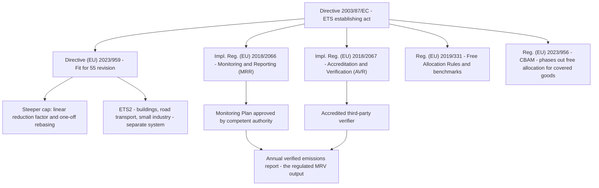

# EU Emissions Trading System (EU ETS) & MRV

> **Purpose:** map the EU ETS legal stack and its monitoring-reporting-verification (MRV) obligations to NovaSteel's emissions accounting, and be explicit about the boundary between *management information* and a *regulated MRV report*.
> **Status:** Analysis v1.0 — the platform produces decision-support emissions analytics, **not** a filed MRV report. Not a legal or verifier opinion.
> **Last reviewed:** 2026-07-29
> **Back to:** [compliance index](README.md) · **Related:** [eu-ai-act.md](eu-ai-act.md) · [other-regulations.md §10](other-regulations.md#10-industrial-emissions-directive-201075eu-amended-by-eu-20241785)

---

## 1. Why the ETS applies to NovaSteel's operator

AxelorMetal runs integrated iron-&-steel installations. **Annex I of Directive 2003/87/EC** lists, among the activities covered by the ETS, *"Production of pig iron or steel (primary or secondary fusion) including continuous casting, with a capacity exceeding 2.5 tonnes per hour"* and related coke/sinter/hot-metal activities. An integrated BF-BOF or EAF plant of the scale implied by the use case is squarely a **covered installation**, so the operator must hold a greenhouse-gas emissions permit, monitor and report annual emissions, have them independently verified, and surrender allowances (EUAs) equal to verified emissions.

NovaSteel is **not the regulated entity** — it is the operator's internal decision-support and analytics surface. Its regulatory value is to (a) give operational teams an early, traceable view of CO₂ intensity and ETS cost exposure, and (b) build the **data lineage and audit trail** that a real MRV process depends on. Everything below distinguishes what the platform *does* from what a compliant filing *requires*.

---

## 2. The legal stack



| Instrument | What it governs | NovaSteel touchpoint |
|---|---|---|
| **Directive 2003/87/EC** (as amended) | The cap-and-trade system, Annex I scope, surrender obligation (Art. 12) | Installation is covered; platform models CO₂ + exposure |
| **Directive (EU) 2023/959** (10 May 2023) | Fit-for-55 revision: steeper cap trajectory, one-off rebasing, higher linear reduction factor, MSR, extension; introduces **ETS2** | The tightening cap raises allowance scarcity/price — the core driver of NovaSteel's ETS-exposure story |
| **Impl. Reg. (EU) 2018/2066 (MRR)** | Monitoring & reporting methodologies (calculation/measurement, tiers, emission factors, Annex I activity thresholds referenced from Dir. 2003/87/EC Annex I) | Emission-factor lineage, Scope 1 process emissions, calculation versioning |
| **Impl. Reg. (EU) 2018/2067 (AVR)** | Verification by accredited verifiers; site visits; materiality | **Gap**: NovaSteel performs no accredited verification |
| **Reg. (EU) 2019/331 (FAR)** | Product benchmarks and free allocation; 2026–2030 allocation period benchmark update | Free-allocation subtraction in the exposure calculation |
| **Reg. (EU) 2023/956 (CBAM)** | Border carbon adjustment on imports (incl. iron & steel); definitive regime from 1 Jan 2026 | Embedded-emissions data lineage; free-allocation phase-out interaction |

### 2.1 Cap trajectory and linear reduction factor

The 2023/959 revision steepened the EU-wide cap: a one-off reduction ("rebasing") of the total quantity of allowances plus an increased **linear reduction factor (LRF)** applied year-on-year, driving the covered sectors toward ~62% emissions reduction by 2030 versus 2005. For NovaSteel this matters as a **modelling input**: allowance scarcity pushes the EUA price up, which is exactly the pressure the platform's ETS-exposure screen is built to make visible ([app-guide 07](../../presentation/assets/app-guide/en/07-sustainability-and-compliance.md)). The platform does not compute the Union cap; it prices *this installation's* residual exposure against a configurable allowance price.

### 2.2 Free allocation, benchmarks and the 2026–2030 update

Under FAR (Reg. (EU) 2019/331), industrial installations receive part of their allowances for free, calculated from **product benchmarks** (e.g. the hot-metal benchmark for steel) multiplied by activity level, adjusted by cross-sectoral correction and conditionality (e.g. energy-audit/decarbonisation-plan conditions introduced by the revision). Benchmark values are updated for the **2026–2030 allocation period**. NovaSteel models this as a **free-allocation subtraction** before pricing residual exposure (§3). The demo uses a single flat benchmark constant (1.50 t CO₂ per tonne of steel) — a deliberate simplification, not the legal benchmark.

### 2.3 ETS2

Directive (EU) 2023/959 also establishes **ETS2**, a separate emissions-trading system for fuel combustion in buildings, road transport and small industry not covered by ETS1, starting later this decade. ETS2 is **contextual** for NovaSteel: it could affect the cost of some purchased fuels/energy and thus the plant's total carbon cost, but the plant's core process emissions remain under ETS1. NovaSteel does not model ETS2 today (watch-list item).

---

## 3. What NovaSteel actually computes (implemented today)

The emissions and ETS figures are computed in the Fabric **gold** layer and surfaced on three sustainability screens. This is real, evidenced code — with honest, deterministic synthetic inputs.

### 3.1 The gold emissions fact

[`fabric/notebooks/ns-silver-to-gold.Notebook/notebook-content.py`](../../../fabric/notebooks/ns-silver-to-gold.Notebook/notebook-content.py) builds `fact_emissions_daily` (schema in [`fabric/lakehouse/sql/20_gold.sql`](../../../fabric/lakehouse/sql/20_gold.sql); Direct Lake table [`fact_emissions_daily.tmdl`](../../../fabric/semantic-model/sm-ns-operations.SemanticModel/definition/tables/fact_emissions_daily.tmdl)):

| Gold column | Formula in the notebook | MRV/ETS concept |
|---|---|---|
| `scope1_co2e_t` | Σ CO₂e from **non-electricity** energy (coke, BF gas, natural gas) | Scope 1 direct/process emissions (MRR Annex II/IV combustion + process) |
| `scope2_co2e_t` | Σ CO₂e from **electricity** consumption | Scope 2 indirect (GHG Protocol; not an ETS surrender obligation but a decarbonisation KPI) |
| `total_co2e_t` | `scope1 + scope2` | Total modelled footprint |
| `free_allocation_t` | `crude_steel_tons × 1.50` (demo benchmark constant) | FAR benchmark × activity |
| `ets_allowance_price_eur_per_t` | `82.0` (demo constant) | EUA price signal |
| `ets_exposure_eur` | `max(total − free_allocation, 0) × price` | Residual allowance cost exposure |
| `calculation_version` | literal version tag | **MRR-style methodology versioning / lineage** |

The `calculation_version` column is the compliance-relevant detail: it makes every emissions figure attributable to a specific, versioned calculation method — the kind of methodology traceability MRR Art. 12 (monitoring plan) and Art. 69 (record-keeping) require. **Status: 🟡 (implemented on synthetic data; not an approved monitoring methodology).**

### 3.2 The ETS allowance-cost signal in the energy dispatch objective

Carbon is a **first-class term in the optimizer's objective**, not a post-hoc report. In [`services/optimizer-worker/src/optimizer_worker/milp.py`](../../../services/optimizer-worker/src/optimizer_worker/milp.py) the per-slot cost minimised by the MILP is:

```
primary = co2_weight * energy_mwh * carbon_intensity   # kgCO2e term
        + cost_weight * energy_mwh * spot_price         # euro term
```

and [`service.py`](../../../services/optimizer-worker/src/optimizer_worker/service.py) reports `co2Pct`, `co2KgBaseline` and `co2KgOptimized` per dispatch. This means the platform trades **euro against kilograms of CO₂** with an explicit, tunable weight (proof **CHL-02**). The current objective uses **grid carbon intensity + spot price**; to make it a true *ETS allowance-cost* signal, the carbon term should be weighted by the marginal EUA price (i.e. internal carbon price), which is a small, documented extension. **Status: ✅ (CO₂ in objective) / 🟡 (explicit EUA-price weighting).**

### 3.3 The reporting surfaces (proof REG-03, CHL-02, OUT-02)

| Screen / route | What it shows | Artifact |
|---|---|---|
| Emissions Ledger — `/{site}/sustainability-compliance/emissions-ledger` | CO₂ Scope 1/2, intensity t/t, ETS headroom, immutable ledger rows | [`SustainabilityEmissions.tsx`](../../../apps/analytics-mfe/src/components/screens/SustainabilityEmissions.tsx) |
| ETS Exposure — `/{site}/sustainability-compliance/ets-exposure` | Allowance use vs cap, projection, €/t price, exposure | [`SustainabilityEts.tsx`](../../../apps/analytics-mfe/src/components/screens/SustainabilityEts.tsx) |
| Audit & Reports — `/{site}/sustainability-compliance/audit` | Read-only decision evidence over the hash-chained log | [`SustainabilityAudit.tsx`](../../../apps/analytics-mfe/src/components/screens/SustainabilityAudit.tsx) |

Proof **REG-03** (status *partial*): *"The Fabric gold layer computes Scope 1 and Scope 2 tonnes, subtracts the free allocation benchmark and prices the residual exposure in euro… the emissions ledger is append-only"* with the caveat that *"the allowance benchmark (1.50 t per tonne of steel) and the allowance price are demo constants. CBAM and the Industrial Emissions Directive are described in the documentation but not implemented in code"* ([`proofCatalog.ts`](../../../apps/analytics-mfe/src/proof/proofCatalog.ts)).

---

## 4. Obligation-by-obligation mapping

| MRV/ETS obligation (article) | Project impact | NovaSteel implementation | Status |
|---|---|---|---|
| Hold a GHG permit; Annex I scope (Dir. 2003/87/EC Art. 4, Annex I) | Installation is covered | Modelled per plant/day; no permit workflow | ⬜ (operator's permit, not the platform) |
| Approved **Monitoring Plan** (MRR Art. 11–12) | Methodology must be authority-approved | `calculation_version` provides methodology traceability, but the method is a demo formula | 🟡 → ⬜ |
| Tiered emission factors & activity data (MRR Art. 26–29, Annex II/IV) | Emission-factor lineage | Scope 1 from fuel type; medallion lineage + Purview | 🟡 |
| Data flow & control activities (MRR Art. 58–59) | Documented data flow, uncertainty, QA | Medallion bronze→silver→gold, data-quality validation notebook | 🟡 |
| Record-keeping (MRR Art. 66–69) | 10-year retention of monitoring records | Hash-chained audit log; 6-year+ retention for ETS-relevant data | ✅/🟡 |
| **Annual verified report** by accredited verifier (AVR 2018/2067) | Independent verification is mandatory | **Not performed** — platform output is management info | ⬜ |
| Free allocation (FAR 2019/331) | Benchmark × activity, conditionality | Flat 1.50 t/t benchmark constant | 🟡 |
| Surrender allowances = verified emissions (Art. 12) | Registry transactions | **Not implemented** — no Union Registry connection; O3 excludes trading | ⬜ |
| CBAM data for imports (Reg. 2023/956) | Embedded-emissions reporting | Data lineage supports it; not an importer flow | ⬜ |

### 4.1 Retention

The retention schedule already earmarks **"Energy spot-price + dispatch decisions — 6 years — EU ETS / financial audit trail"** and **security/audit logs 1 year hot + 6 years archive** for ETS data-integrity ([security §14, §9](../../security/security-governance-and-threat-model.md)). MRR Art. 66 requires monitoring records to be kept for at least 10 years; a production deployment must extend the ETS-lineage retention accordingly (⬜ gate).

---

## 5. The management-information vs regulated-MRV boundary (be explicit)

This is the most important honesty statement in the ETS analysis. NovaSteel today produces **management information**, not a regulated MRV report. To become MRV-grade the following are indispensable and are **not** present in the demo:

| Requirement for a real filing | Why | Current status |
|---|---|---|
| **Calibrated meters and measurement uncertainty** per MRR | Regulators require metering to defined tiers/uncertainty | Synthetic fixtures ([`repository.py`](../../../services/bff-api/src/bff_api/repository.py)) |
| **Monitoring Plan approved by the competent authority** | The method itself must be authorised | Demo calculation formula only |
| **Accredited independent verifier** (AVR) with site visit | Third-party assurance of the annual report | None |
| **Legal entity / permitted installation mapping** | ETS reports are per permitted installation, not a demo `NS-DEMO-*` site code | App uses `/{site}` and `NS-DEMO-*` data |
| **Union Registry account & surrender** | Allowances are held/surrendered in the registry | Not connected (O3 excludes trading) |
| **Real free-allocation & benchmark values** | Exposure depends on legal allocation, not a flat constant | 1.50 t/t demo constant |

This table is reproduced from, and consistent with, the in-app guide's *"What this screen would need before a real regulatory filing"* ([app-guide 07](../../presentation/assets/app-guide/en/07-sustainability-and-compliance.md)). **Unless NovaSteel is formally qualified (approved monitoring methodology + accredited verification), its ETS outputs must be labelled decision-support, exactly as the UI's "Synthetic demo data — not for operational control" banner does.**

---

## 6. What the platform supports vs what still needs a verifier

**Supports (✅/🟡):**

- CO₂ intensity tracking and Scope 1/2 accounting per plant/day (gold `fact_emissions_daily`).
- **Emission-factor lineage** via the medallion architecture and Purview lineage ([security §7](../../security/security-governance-and-threat-model.md)).
- ETS allowance-cost signal embedded in the dispatch objective (MILP).
- **Tamper-evident audit trail** (hash-chained log) that would let an auditor reconcile any figure to its source events and verify it was not silently edited — a genuine MRV data-integrity asset.
- Append-only emissions ledger and immutable decision evidence (screens above).

**Still needs (⬜):**

- An **approved Monitoring Plan** and MRR-tiered metering.
- An **accredited verifier** (AVR 2018/2067) and materiality assessment.
- Real benchmark/allocation values and a Union Registry linkage.
- Legal-entity/installation mapping replacing demo site codes.

---

## 7. CBAM linkage (Regulation (EU) 2023/956)

CBAM's **definitive regime applies from 1 January 2026**, covering imports in carbon-intensive sectors including **iron and steel**, with importer authorisation, reporting, and purchase/surrender of CBAM certificates priced off EU ETS auction prices; verification of embedded emissions follows an accreditation framework analogous to the ETS AVR. As free allocation for CBAM-covered goods is phased out, accurate **embedded-emissions data** becomes commercially critical.

NovaSteel is **not an importer**, so CBAM's operative obligations do not fall on it. Its relevance is **data provenance**: the same Scope 1 process-emissions lineage that feeds ETS analytics is the natural source for the *embedded emissions* an EU steel producer would need to substantiate for its own exported goods and for customers' CBAM diligence. A **2025 Omnibus simplification** introduced a de-minimis exemption (a mass threshold, widely cited as **50 tonnes** of net imported goods per importer per year) that removes most small/occasional importers from scope — contextual only for NovaSteel. **Status: ⬜ (documented, not implemented; caveat matches proof REG-03).**

---

## 8. Summary

NovaSteel makes CO₂ a first-class, traceable, tamper-evident dimension of operational decision-making, and it builds the lineage and audit spine a real MRV process needs. It deliberately stops short of being the regulated reporting system: no calibrated metering, no approved monitoring plan, no accredited verifier, no registry. The honest framing — *management information that is MRV-ready in structure, not MRV-qualified in law* — is consistently carried in the code (proof REG-03 marked *partial*), the UI banners, and this analysis.

---

## Sources

- Directive 2003/87/EC (EU ETS) consolidated — Annex I activities, Art. 12 surrender: https://eur-lex.europa.eu/eli/dir/2003/87/oj/eng (retrieved 2026-07-29)
- Directive (EU) 2023/959 (ETS revision / Fit for 55, ETS2, MSR): https://eur-lex.europa.eu/eli/dir/2023/959/oj/eng (retrieved 2026-07-29)
- Implementing Regulation (EU) 2018/2066 (Monitoring and Reporting Regulation): https://eur-lex.europa.eu/eli/reg_impl/2018/2066/oj/eng (retrieved 2026-07-29)
- Implementing Regulation (EU) 2018/2067 (Accreditation and Verification Regulation): https://eur-lex.europa.eu/eli/reg_impl/2018/2067/oj/eng (retrieved 2026-07-29)
- Regulation (EU) 2019/331 (Free Allocation Rules / benchmarks): https://eur-lex.europa.eu/eli/reg/2019/331/oj/eng (retrieved 2026-07-29)
- Regulation (EU) 2023/956 (CBAM): https://eur-lex.europa.eu/eli/reg/2023/956/oj/eng (retrieved 2026-07-29)
- European Commission — Carbon Border Adjustment Mechanism (definitive regime from 1 Jan 2026; iron & steel in scope; verification): https://taxation-customs.ec.europa.eu/carbon-border-adjustment-mechanism_en (retrieved 2026-07-29)
- NovaSteel artifacts: [gold notebook](../../../fabric/notebooks/ns-silver-to-gold.Notebook/notebook-content.py), [`20_gold.sql`](../../../fabric/lakehouse/sql/20_gold.sql), [`optimizer milp.py`](../../../services/optimizer-worker/src/optimizer_worker/milp.py) / [`service.py`](../../../services/optimizer-worker/src/optimizer_worker/service.py), [`proofCatalog.ts`](../../../apps/analytics-mfe/src/proof/proofCatalog.ts), [app-guide 07](../../presentation/assets/app-guide/en/07-sustainability-and-compliance.md).
