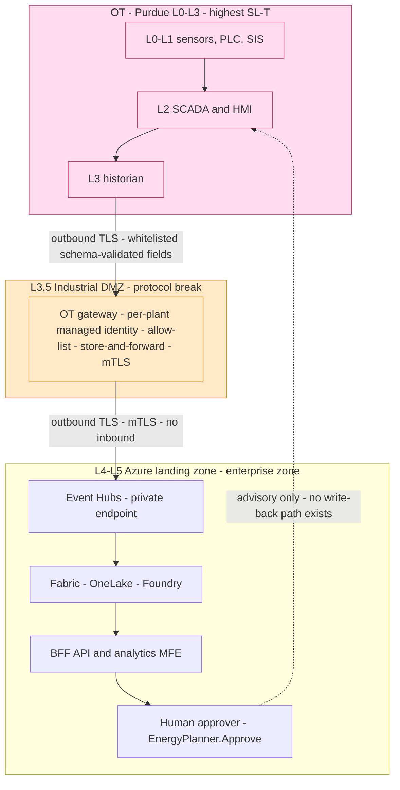

# IEC 62443 — Industrial Automation & Control System (IACS) Security

> **Purpose:** map the IEC 62443 series to NovaSteel's OT/IT topology, prove the outbound-only, no-write-back boundary against the standard's zone/conduit and Foundational-Requirement model, and state target security levels per zone.
> **Status:** Analysis v1.0 — design-conformance mapping on a synthetic-data demo. **No IEC 62443 certification is claimed.**
> **Last reviewed:** 2026-07-29
> **Back to:** [compliance index](README.md) · **Related:** [other-regulations.md §1 (NIS2)](other-regulations.md#1-nis2-directive-eu-20222555) · [eu-ai-act.md](eu-ai-act.md)

---

## 1. Why IEC 62443 is the governing security framework

NovaSteel connects to blast furnaces, EAFs and rolling mills — **Industrial Automation and Control Systems (IACS)**. IEC 62443 is the international consensus standard for IACS cybersecurity and is the framework NIS2 competent authorities and OT insurers expect a manufacturer of basic metals to demonstrate against. It is *risk-based* and *role-based*: obligations differ for the **asset owner** (AxelorMetal), the **system integrator**, and the **product supplier** (here, the NovaSteel platform team acts as a product supplier of an *IT-side analytics component* that consumes OT telemetry — it supplies **no Level 0–2 control component**).

The central NovaSteel design fact that makes 62443 tractable: **the platform is advisory-only and never writes back to OT/PLC/SIS.** Every recommendation terminates at a human approver; there is no cloud-initiated inbound path below the industrial DMZ ([deployment-topology §"OT crossing"](../../architecture/deployment-topology.md), [security §11](../../security/security-governance-and-threat-model.md), requirement **FR-ENE-07**). That collapses the platform's attack surface into a **read-mostly, outbound-only conduit**, which is the strongest possible posture against the standard's FR-family requirements.

---

## 2. The IEC 62443 series and NovaSteel's role

| Part | Scope | Primary responsible party | NovaSteel relevance |
|---|---|---|---|
| **62443-1-1** | Concepts, terminology, zones/conduits, security levels (SL 0–4) | All | Provides the vocabulary used throughout this doc |
| **62443-2-1** | IACS security-management system (asset owner's programme) | Asset owner (AxelorMetal) | Platform supplies audit/evidence data into the owner's programme |
| **62443-2-4** | Security-programme requirements for **IACS service providers** | Integrator / service provider | NovaSteel operations team as a service provider (patching, IR, access) |
| **62443-3-2** | Security **risk assessment** for system design — zones, conduits, target SL (SL-T) | Integrator + asset owner | §4 zone/conduit model and SL-T assignment |
| **62443-3-3** | **System security requirements** — the 7 Foundational Requirements (FR1–FR7) and system requirements (SR) at each SL | Integrator | §5 FR-by-FR evidence |
| **62443-4-1** | **Secure development lifecycle (SDL)** for product suppliers | Product supplier | §6 — mapped to GitHub OIDC CI/CD, SAST, model governance |
| **62443-4-2** | **Component** security requirements (CR) for embedded devices/hosts/apps | Product supplier | Applies to the OT gateway component and the BFF as a software application |

---

## 3. Purdue-model mapping and the no-write-back guarantee

NovaSteel's design follows the **Purdue Enterprise Reference Architecture** as used by Microsoft Defender for IoT ([security §11](../../security/security-governance-and-threat-model.md)). The mapping:

| Purdue level | NovaSteel elements | 62443 zone | Data direction |
|---|---|---|---|
| **L0–L1** — process & basic control (sensors, actuators, PLC) | Furnace/mill instrumentation, PLCs, **SIS** | Cell/Area control zone (highest SL-T) | None from NovaSteel — read via historian only |
| **L2** — supervisory (SCADA, HMI) | Site SCADA / HMI | Supervisory zone | Read (passive) |
| **L3** — site operations (historian) | Plant historian | Site-operations zone | Read (historian export) |
| **L3.5** — **Industrial DMZ** | **OT gateway** (per-plant managed identity `mi-ot-gateway-<plant>`), allow-list, store-and-forward, protocol break, mTLS | **DMZ zone** — the only OT↔IT crossing | **Outbound TLS only** |
| **L4–L5** — enterprise / cloud | Azure landing zone, Event Hubs, Fabric/OneLake, Foundry, BFF, MFE | Enterprise/cloud zone | Cloud-side processing; recommendations to humans |

The dotted line from the human approver back toward L2 is **organisational, not technical**: an operator may choose to act on a recommendation through the existing, separately-governed control system. **NovaSteel provides no software conduit that can issue a command below L3.5.** This is enforced by design (no write-back connector; FR-ENE-07 keeps recommendations shadow/simulated through Phase 1) and by the network rule set ([deployment-topology §"Network boundaries"](../../architecture/deployment-topology.md): *"No cloud-originated command, RDP, or general IT routing to PLC/safety networks"*; *"No inbound Azure session into the OT network"*).

---

## 4. Zone and conduit model

Per **62443-3-2**, assets are grouped into **zones** of common security requirements, connected by **conduits** whose traffic is controlled and monitored. NovaSteel's zones and their **target security level (SL-T)**:

| Zone | Assets | SL-T | Rationale |
|---|---|---|---|
| **Z-CTRL** Cell/Area control | PLC, SIS, basic control | **SL 3** | Safety-critical; must resist intentional violation with moderate resources/skills. NovaSteel adds **no** component here |
| **Z-SUP** Supervisory | SCADA, HMI | **SL 2–3** | Passive Defender-for-IoT monitoring only |
| **Z-HIST** Site operations | Historian | **SL 2** | Source of the outbound telemetry export |
| **Z-DMZ** Industrial DMZ | OT gateway | **SL 3** | The crossing point — hardened, single-purpose, identity-scoped |
| **Z-CLOUD** Enterprise/cloud | Landing zone, Fabric, BFF, MFE, AI | **SL 2** | Defence-in-depth via Azure controls (private endpoints, managed identity, Sentinel) |

**Conduits:**

| Conduit | Endpoints | Controls (62443-3-3 SR references) | Evidence |
|---|---|---|---|
| **C1** Historian → Gateway | Z-HIST → Z-DMZ | Allow-list of source + protocol; schema validation; store-and-forward | [deployment-topology §"Network boundaries"](../../architecture/deployment-topology.md) |
| **C2** Gateway → Cloud | Z-DMZ → Z-CLOUD | **Outbound-only** TLS/mTLS; per-plant managed identity; egress IP restriction (CA-06); no inbound | [security §3.1, §11](../../security/security-governance-and-threat-model.md) |
| **C3** Cloud internal | within Z-CLOUD | Private endpoints, private DNS, managed identity, public network access disabled | [`deny-public-network-access.json`](../../../infra/policy/definitions/deny-public-network-access.json) |
| **C4** Deploy-time | GitHub → ARM | OIDC/WIF federation, no long-lived secrets | [security §"deployment trust boundary"](../../security/security-governance-and-threat-model.md) |

The **protocol break at the DMZ** (the gateway terminates OT protocols and re-originates only whitelisted, schema-validated fields over TLS) is exactly the 62443-3-2 conduit control that prevents an OT protocol exploit from traversing to the cloud, and — critically — prevents any cloud payload from being interpreted as an OT command.

---

## 5. The seven Foundational Requirements (62443-3-3)

62443-3-3 organises system security into seven **Foundational Requirements**. Mapping each to NovaSteel's controls:

| FR | Foundational Requirement | NovaSteel implementation | Status |
|---|---|---|---|
| **FR1** | **Identification & Authentication Control (IAC)** | Entra ID for all human/service identities; per-plant user-assigned managed identities (`mi-ot-gateway-<plant>`); GitHub OIDC/WIF; no shared/SAS keys ([security §3](../../security/security-governance-and-threat-model.md)) | ✅ (cloud) / 🟡 (OT gateway is a design) |
| **FR2** | **Use Control (UC)** | RBAC personas (`EnergyPlanner.Approve`, `Compliance.Auditor`, `OTEngineer.Gateway`); Conditional Access; PIM for admin; CA-06 network/location restriction for OT-adjacent workloads | ✅/🟡 |
| **FR3** | **System Integrity (SI)** | mTLS + protocol break at DMZ; **SHA-256 hash-chained audit log** ([`audit.py`](../../../services/bff-api/src/bff_api/audit.py)); model-registry versioning + RAI sign-off; Purview lineage detects source tampering | ✅ (audit) / 🟡 |
| **FR4** | **Data Confidentiality (DC)** | Encryption in transit and at rest (NFR-SEC-01); Key Vault with public access disabled; sensitivity labels; EU-only residency (NFR-SEC-03) | ✅/🟡 |
| **FR5** | **Restricted Data Flow (RDF)** | **Zone/conduit segmentation**; industrial DMZ; hub-spoke + private endpoints; micro-segmentation between plants so a compromise in one plant cannot reach another's OT | 🟡 (design, §11) |
| **FR6** | **Timely Response to Events (TRE)** | Microsoft Sentinel/Defender for IoT passive monitoring; documented IR runbook with OT-isolation step; 72h reporting path (aligns NIS2) | 🟡 |
| **FR7** | **Resource Availability (RA)** | Store-and-forward + Event Hubs replay; the advisory-only design means a NovaSteel outage **cannot** stop production (no control dependency); capacity sizing/DR | ✅ (by design) / 🟡 |

**FR7 deserves emphasis:** because NovaSteel is decision-support and holds no control function, its availability is *not* a safety or production dependency. A total platform failure degrades *insight*, never *control* — the plant continues on its native control systems. This is the single most important resilience property and it is architectural, not bolted-on.

### 5.1 The no-write-back guarantee as an FR3/FR5 control

The advisory-only boundary is simultaneously an **integrity** (FR3 — no path exists to alter control state) and **restricted-data-flow** (FR5 — the C2 conduit is unidirectional outbound) control. It is evidenced in three independent places:

1. **Requirement**: FR-ENE-07 — recommendations remain simulated/shadow-only through Phase 1; autonomous execution out of scope (O1).
2. **Architecture**: no cloud-initiated inbound below L3.5; outbound-only conduit ([deployment-topology](../../architecture/deployment-topology.md)).
3. **Threat model**: gate **G11** — *"No new direct OT-to-cloud connection bypassing the industrial DMZ/gateway pattern"* owned by the OT/ICS Engineer ([security §"security gates"](../../security/security-governance-and-threat-model.md)).

---

## 6. Secure development lifecycle (62443-4-1) and component requirements (62443-4-2)

**62443-4-1 (SDL)** — the NovaSteel product-supplier practices that map to the eight SDL practice areas:

| 62443-4-1 practice | NovaSteel control | Status |
|---|---|---|
| Security management | Threat model + security gates (G1–G11) as release gates | 🟡 |
| Specification of security requirements | NFR-SEC-01/02/03, FR-GOV/FR-PRI requirement IDs | ✅ (documented) |
| Secure by design | Zone/conduit design; advisory-only; least-privilege managed identities | 🟡 |
| Secure implementation | Coding standards; secrets never in code (Key Vault/OIDC) | ✅/🟡 |
| Security verification & testing | CI SAST/dependency scanning; policy-as-code guardrails; package restore only via protected feeds | 🟡 |
| Defect management | Vulnerability handling via GitHub security workflow | 🟡 |
| Security update management | Patch cadence via 62443-2-4 service-provider process | ⬜ |
| Security guidelines | This compliance set + operations runbooks | ✅ |

**62443-4-2 (component requirements)** apply to the **OT gateway** (a host/network component — CRs for IAC, hardening, least functionality, secure boot where supported) and to the **BFF as a software application** (application CRs — session integrity, input validation, audit). The gateway CR set is a **pilot deliverable** (⬜) since the physical gateway BOM depends on plant PLC/SCADA vendor specifics still to be confirmed with plant engineering ([security §"next steps"](../../security/security-governance-and-threat-model.md)).

---

## 7. What is implemented vs pilot gate

| Area | Implemented today (✅) | Designed (🟡) | Pilot gate (⬜) |
|---|---|---|---|
| Identity | Entra + OIDC in code/CI | Per-plant OT gateway MI | Gateway hardware identity provisioning |
| Integrity | Hash-chain audit log | Purview lineage, model registry | Signed telemetry at source |
| Data flow | Cloud private-endpoint policy | Full zone/conduit segmentation | Physical DMZ appliance + SPAN/TAP sensors |
| SDL | Documented reqs, protected-feed CI | Threat-model release gates | 62443-4-1 formal assessment |
| Verification | — | — | Third-party 62443-3-3 SL-C assessment |

**No IEC 62443 certification is claimed.** The demo evidences *design conformance* and the strong advisory-only posture; **certification (SL-C) requires a third-party assessment and a live OT deployment.**

---

## Sources

- IEC 62443 series overview (parts and scope), ISA/IEC — https://www.isa.org/standards-and-publications/isa-standards/isa-iec-62443-series-of-standards (retrieved 2026-07-29)
- ISA Global Cybersecurity Alliance — 62443 quick-start / zones, conduits, security levels — https://gca.isa.org/ (retrieved 2026-07-29)
- Microsoft Defender for IoT — Purdue model & OT network architecture — https://learn.microsoft.com/azure/defender-for-iot/organizations/best-practices/understand-network-architecture (retrieved 2026-07-29)
- Microsoft — Zero Trust for OT networks — https://learn.microsoft.com/azure/defender-for-iot/organizations/concept-zero-trust (retrieved 2026-07-29)
- NovaSteel artifacts: [security §11 (Purdue/OT)](../../security/security-governance-and-threat-model.md), [deployment-topology](../../architecture/deployment-topology.md), [`audit.py`](../../../services/bff-api/src/bff_api/audit.py), [`deny-public-network-access.json`](../../../infra/policy/definitions/deny-public-network-access.json), [solution-requirements FR-ENE-07 / NFR-SEC](../../specs/solution-requirements.md).
