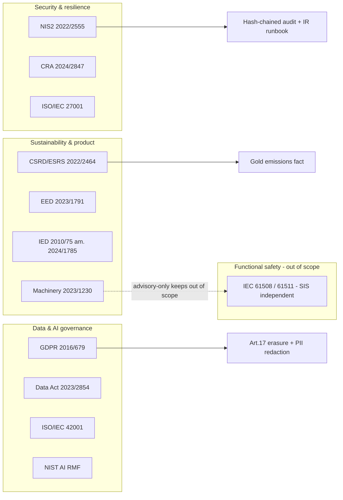

# Other Regulations & Standards

> **Purpose:** concise but concrete "impacted articles → project impact → implementation" analyses for every remaining regulation and standard in NovaSteel's landscape, plus a watch list of instruments not yet in force.
> **Status:** Analysis v1.0 — synthetic-data demo. Separates implemented (✅), designed (🟡), and pilot-gate (⬜) items. Not legal advice.
> **Last reviewed:** 2026-07-29
> **Back to:** [compliance index](README.md) · **Related:** [eu-ai-act.md](eu-ai-act.md) · [eu-ets.md](eu-ets.md) · [iec-62443.md](iec-62443.md) · [compliance-roadmap.md](compliance-roadmap.md)

Status legend: ✅ implemented & evidenced today · 🟡 designed / documented · ⬜ pilot or production gate.

---

## 1. NIS2 (Directive (EU) 2022/2555)

**Instrument:** Directive (EU) 2022/2555 (14 Dec 2022), repealing the original NIS Directive; national transposition deadline was 17 October 2024.

**Applicability:** Annex II of NIS2 lists **"manufacturing of basic metals"** among sectors whose sufficiently large entities are **important entities**. AxelorMetal (an EU steel producer above the size threshold) is therefore an **important entity** subject to NIS2 risk-management and reporting obligations. NovaSteel is a supporting IT/OT system inside that entity's scope.

| Article | Obligation | NovaSteel impact & implementation | Status |
|---|---|---|---|
| **Art. 21** | Risk-management measures (all-hazards): policies, incident handling, business continuity, supply-chain security, secure development, cryptography, access control, MFA | Entra ID + Conditional Access + PIM; encryption (NFR-SEC-01); IEC 62443 zone/conduit design; secure SDLC; hash-chained audit ([iec-62443.md §5](iec-62443.md#5-the-seven-foundational-requirements-62443-3-3)) | 🟡 |
| **Art. 23** | Incident reporting: **24 h** early warning → **72 h** incident notification → **1 month** final report | IR runbook with Sev-1/2 triage, identity disable, OT-zone isolation; the 72 h path is already documented ([security §10.2](../../security/security-governance-and-threat-model.md)) | 🟡 |
| **Art. 20** | **Management-body accountability** & training; governing bodies approve and oversee cyber-risk measures | RACI assigns accountable roles; Responsible-AI board and CISO sign-offs; AI-literacy programme (AI Act Art. 4 overlap) | 🟡 |
| **Art. 32–33** | Supervision & enforcement (important entities = *ex-post* supervision) | Evidence spine (audit log, lineage, policy-as-code) supports authority inspection | 🟡 |

**Key point:** NovaSteel's tamper-evident audit trail and Purdue/62443 segmentation are the concrete artifacts an authority would inspect under Art. 21/32. The **entity registration** with the national competent authority is an organisational action outside the platform (⬜ roadmap gate).

---

## 2. GDPR (Regulation (EU) 2016/679)

**Applicability:** NovaSteel is *not* a personal-data platform, but the **knowledge-capture** workflow processes operator **voice/text**, and personal data appears in access/audit logs. Lawful, minimised processing is therefore in scope (NFR-SEC-02).

| Article | Obligation | NovaSteel implementation | Status |
|---|---|---|---|
| **Art. 5** | Principles: lawfulness, minimisation, storage limitation, integrity | Data minimisation at capture; retention schedule ([security §14](../../security/security-governance-and-threat-model.md)); PII redaction in audit (`_SENSITIVE_KEYS`) | ✅/🟡 |
| **Art. 6 / Art. 9** | Lawful basis; special-category caution | Documented lawful basis for knowledge capture; consent-aware Speech workflow; no special-category data by design | 🟡 |
| **Art. 13–15** | Transparency & access rights | Privacy notice; audit/lineage supports subject-access | 🟡 |
| **Art. 17** | **Right to erasure** | Implemented: [`erasure.py`](../../../services/knowledge-orchestrator/src/knowledge_orchestrator/erasure.py) hard-deletes transcripts/conversations, **pseudonymises** procedure attribution (Art. 17(3)(b)/(d) retention exceptions), and appends an `erasure.executed` **tombstone** without ever mutating the hash chain — reconciling erasure with an immutable audit log (proof **REG-01**) | ✅ |
| **Art. 22** | Automated decision-making with legal/significant effect | **Avoided by design**: NovaSteel is advisory; a human approves every energy/maintenance decision (FR-GOV, FR-ENE-07). No solely-automated decision on a person | ✅ (by design) |
| **Art. 25 / 32** | Data protection by design/default; security of processing | Managed identities, encryption, private endpoints, least privilege | ✅/🟡 |
| **Art. 30** | Records of processing | Processing-activity records; Purview data map | 🟡 |
| **Art. 35** | **DPIA** where high risk | DPIA required before pilot with real operator data — **roadmap gate** | ⬜ |
| **Chapter V** | International transfers | **EU-only** processing (NFR-SEC-03); Sweden Central primary; EU Data Boundary posture (§14) | ✅ (design) |

The **erasure ↔ immutable-audit** reconciliation is the standout GDPR engineering result: personal content is destroyed while the *fact* of processing/erasure remains provable. See [eu-ai-act.md §Art. 12](eu-ai-act.md) for the same hash-chain used for AI logging.

---

## 3. CSRD / ESRS (Directive (EU) 2022/2464) — Stop-the-clock (2025/794)

**Instrument:** Corporate Sustainability Reporting Directive (EU) 2022/2464, with the **European Sustainability Reporting Standards (ESRS)**; **ESRS E1 (Climate change)** is the relevant topical standard.

**⚠️ In flux.** Directive (EU) 2025/794 (the **"stop-the-clock"** directive, 14 Apr 2025) **postponed** the application dates for certain CSRD reporting waves by two years, and a broader Omnibus simplification (scope thresholds, sector standards) was under negotiation through 2025–2026. **Treat wave timing and scope as proposed/moving, not settled** — do not assert a specific first-reporting year without checking the entity's confirmed wave.

| ESRS reference | Obligation | NovaSteel contribution | Status |
|---|---|---|---|
| **ESRS E1** (climate, GHG Scope 1/2/3, energy) | Disclose gross Scope 1 & 2, energy consumption, transition levers | Gold `fact_emissions_daily` Scope 1/2 tonnes + intensity; energy-dispatch CO₂ reduction (proof OUT-02, −22% target) supply *management data* for E1 | 🟡 |
| ESRS 2 (general, governance) | Governance of sustainability | Model governance + audit trail evidence | 🟡 |
| Assurance | Limited assurance of the sustainability statement | **Not performed** — same verifier gap as ETS ([eu-ets.md §5](eu-ets.md#5-the-management-information-vs-regulated-mrv-boundary-be-explicit)) | ⬜ |

NovaSteel feeds the **operational climate data** an E1 disclosure draws on; it does not produce the audited sustainability statement.

---

## 4. EU Machinery Regulation (EU) 2023/1230

**Instrument:** Regulation (EU) 2023/1230, repealing Directive 2006/42/EC; **applicable from 20 January 2027.** It introduces explicit provisions for **safety functions relying on AI/ML**.

**Why NovaSteel is out of scope:** the Machinery Regulation governs machinery and **safety components** placed on the market. NovaSteel is **advisory-only decision-support** that issues **no control command** and performs **no safety function** — it is not a safety component and is not integrated into machinery's safety-related control system (the no-write-back boundary; [iec-62443.md §3](iec-62443.md#3-purdue-model-mapping-and-the-no-write-back-guarantee)). If a future phase ever wired a recommendation into a safety-related function, the Machinery Regulation (and AI Act Art. 6(1) product-safety route) would engage — hence the boundary is a **hard design gate**, not merely a scoping opinion. **Status: ✅ out of scope by design; ⬜ re-assess before any write-back.**

---

## 5. Functional-safety boundary — IEC 61508 / IEC 61511

IEC 61508 (generic functional safety) and **IEC 61511** (process-industry Safety Instrumented Systems) govern the plant's **SIS** — the independent protection layer that trips the furnace/mill into a safe state. NovaSteel's design keeps the **SIS fully independent**: the platform reads telemetry via the historian, never participates in the safety loop, and adds no component at Purdue L0–L1 ([iec-62443.md §4, Z-CTRL SL 3](iec-62443.md#4-zone-and-conduit-model)). This preserves the SIS's independence and SIL claim. **Status: ✅ out of scope — SIS independence preserved by design.**

---

## 6. EU Data Act (Regulation (EU) 2023/2854)

**Instrument:** Regulation (EU) 2023/2854 (13 Dec 2023); **most provisions applicable from 12 September 2025.** It governs access to **IoT/connected-product data**, B2B/B2G data sharing, and **cloud-switching / interoperability**.

| Chapter | Obligation | NovaSteel impact | Status |
|---|---|---|---|
| Ch. II | User access to product/related-service data | Telemetry lineage (Purview) makes data provenance & access auditable; AxelorMetal is data holder for its own plant data | 🟡 |
| Ch. VI | **Cloud switching** — remove switching barriers, portability | Medallion data in **OneLake** (open Delta/Parquet) + IaC (Bicep) reduce lock-in; export tooling (FR-GOV export) | 🟡 |
| Ch. VIII | Interoperability standards | Open table formats; documented schemas ([`20_gold.sql`](../../../fabric/lakehouse/sql/20_gold.sql)) | 🟡 |

The **open-format lakehouse + infrastructure-as-code** posture is the concrete Data-Act-friendly property (portability, no proprietary trap).

---

## 7. EU Cyber Resilience Act (Regulation (EU) 2024/2847)

**Instrument:** Regulation (EU) 2024/2847 (23 Oct 2024) — horizontal cybersecurity requirements for **products with digital elements**. Phased application: **reporting obligations (Art. 14) from 11 September 2026**, and the **main obligations from 11 December 2027.**

**Applicability nuance:** the CRA targets products *placed on the market*. NovaSteel is (in this project) an **internal platform for a single operator**, not a commercial product placed on the EU market, so the CRA's manufacturer obligations are **not directly triggered** today. However, its Annex I essential requirements (secure-by-default, vulnerability handling, SBOM, security updates, **24 h early warning of actively exploited vulnerabilities to ENISA**) are **good-practice targets** and overlap heavily with 62443-4-1. Should NovaSteel ever be commercialised, CRA conformity (incl. CE marking) becomes mandatory.

| CRA element | NovaSteel alignment | Status |
|---|---|---|
| Secure by default | Private endpoints, public access disabled, managed identity | ✅/🟡 |
| Vulnerability handling + SBOM | GitHub security workflow; dependency scanning; protected package feeds | 🟡 |
| Coordinated disclosure / ENISA reporting | IR runbook; would extend to ENISA path | ⬜ |

**Status: 🟡 aligned as good practice; ⬜ formal CRA conformity only if commercialised.**

---

## 8. DORA (Regulation (EU) 2022/2554) — Not applicable

**Instrument:** Regulation (EU) 2022/2554 (Digital Operational Resilience Act), applicable **17 January 2025.**

**Why excluded:** DORA applies to **financial entities** (credit institutions, insurers, investment firms, crypto-asset service providers, etc.) and their critical ICT third-party providers. AxelorMetal is a **steel manufacturer**, not a financial entity, and NovaSteel provides **no ICT service to financial entities**. DORA is therefore **out of scope**. (Its operational-resilience concepts — ICT risk management, incident classification, resilience testing — are nonetheless mirrored voluntarily by the NIS2/62443 controls above.) **Status: ✅ not applicable — documented exclusion.**

---

## 9. Energy Efficiency Directive (EU) 2023/1791 / ISO 50001

**Instrument:** Directive (EU) 2023/1791 (13 Sep 2023, **recast** EED). The energy-audit / energy-management-system obligation for large enterprises and high-consumption entities is in **Article 11 of the recast** (this was **Article 8** of the previous Directive 2012/27/EU — the task's "Art. 8" reference is the legacy numbering; flagged honestly). Large energy consumers must undergo energy audits or implement an **ISO 50001-certified EnMS**.

| Reference | Obligation | NovaSteel contribution | Status |
|---|---|---|---|
| EED Art. 11 (ex-Art. 8) | Energy audit / EnMS for large consumers | Energy-dispatch optimiser + monitoring provide continuous energy-performance data feeding an EnMS; CO₂/energy KPIs on the sustainability screens | 🟡 |
| ISO 50001 | Plan-Do-Check-Act energy management, energy baselines & performance indicators | The optimiser's baseline-vs-optimised comparison (`co2KgBaseline`/`co2KgOptimized`, cost delta) is a natural EnPI source | 🟡 |

NovaSteel supplies **energy-performance evidence** for an EnMS; certification of the EnMS itself is organisational (⬜).

---

## 10. Industrial Emissions Directive 2010/75/EU amended by (EU) 2024/1785

**Instrument:** Directive 2010/75/EU (IED), amended by **Directive (EU) 2024/1785** (24 Apr 2024). Iron & steel installations operate under an **IED permit** and must meet **BAT conclusions** (Best Available Techniques, incl. BAT-associated emission levels) and, under the amendment, prepare **transformation plans** and tighter environmental-management-system obligations.

| IED element | Obligation | NovaSteel contribution | Status |
|---|---|---|---|
| Permit + BAT conclusions (steel) | Operate within BAT-AELs; monitor emissions to air/water | Emissions/energy analytics provide operational visibility toward BAT-AEL tracking | 🟡 (documented, not implemented in code — see proof REG-03 caveat) |
| Art. 14a EMS / transformation plan (2024/1785) | Environmental management system, decarbonisation transformation plan | Emissions lineage + audit trail feed EMS evidence | ⬜ |

NovaSteel is **not** the environmental-permit reporting system; IED is described but **not implemented in code** (consistent with [`proofCatalog.ts`](../../../apps/analytics-mfe/src/proof/proofCatalog.ts) REG-03). **Status: 🟡/⬜.**

---

## 11. ISO/IEC 27001:2022

The information-security management system (ISMS) standard. NovaSteel's controls map to the 2022 **Annex A** themes (organisational, people, physical, technological), e.g. A.5 access control, A.8 technological controls (crypto, logging, secure development, network security). The threat model, security gates, retention schedule, and policy-as-code are ISMS-grade artifacts. **No certification is claimed**; the design is *27001-aligned*. **Status: 🟡 aligned; ⬜ certification is organisational.**

---

## 12. ISO/IEC 42001:2023 AI management system

The first **AI Management System (AIMS)** standard. NovaSteel's AI governance — model cards/registry, Responsible-AI board sign-off (FR-GOV), human-oversight requirements (FR-ENE, FR-KNW), grounded RAG + Content Safety, AI logging via the hash chain — maps directly to 42001's management-system clauses and Annex A controls (AI policy, impact assessment, data governance, lifecycle). It is the natural certification target that operationalises the **EU AI Act** duties in [eu-ai-act.md](eu-ai-act.md). **Status: 🟡 aligned; ⬜ certification is a production goal.**

---

## 13. NIST AI RMF 1.0

The US **NIST AI Risk Management Framework 1.0** (voluntary) structures AI risk into **Govern, Map, Measure, Manage**. NovaSteel maps cleanly:

| Function | NovaSteel evidence | Status |
|---|---|---|
| **Govern** | RACI, RAI board, model governance §15 | 🟡 |
| **Map** | AI system inventory ([eu-ai-act.md §1](eu-ai-act.md)), context & risk-tiering | ✅ (documented) |
| **Measure** | Accuracy/robustness metrics, evaluation harness, physics-informed validation | 🟡 |
| **Manage** | Human oversight, guardrails (FR-ENE-05), Content Safety, incident response | ✅/🟡 |

NIST AI RMF is used as a **cross-check** on the AI Act mapping, not a legal obligation.

---

## 14. EU Data Boundary & Schrems II posture

Following *Schrems II* (CJEU C-311/18, invalidating Privacy Shield) and Chapter V GDPR, NovaSteel is designed **EU-resident and EU-processed**: Sweden Central primary region, EU **Data Zone** configuration for AI services where applicable, and the Microsoft **EU Data Boundary** for eligible services ([deployment-topology §2.2–2.3](../../architecture/deployment-topology.md), NFR-SEC-03). West Europe is only a documented secondary **after DPO/data-transfer review**. This minimises reliance on transfer mechanisms (SCCs) by keeping data in the EU by default. **Status: ✅ (design) / 🟡 (service-by-service EU-boundary confirmation is a pilot check).**

---

## 15. Watch list — not yet in force / moving

| Item | Why it matters | Posture |
|---|---|---|
| **AI Act Art. 6(1) product-route high-risk** (2 Aug 2027) & **AI/Digital Omnibus** possible shift toward Dec 2027 | Could reclassify a future write-back variant as high-risk | Monitor; advisory-only keeps out today ([eu-ai-act.md](eu-ai-act.md)) |
| **CSRD Omnibus / stop-the-clock (2025/794)** | Wave timing & scope thresholds moving | Treat dates as provisional (§3) |
| **CBAM definitive regime** (from 1 Jan 2026) + 50 t de-minimis Omnibus | Embedded-emissions data demand rises | Data lineage ready ([eu-ets.md §7](eu-ets.md#7-cbam-linkage-regulation-eu-2023956)) |
| **CRA obligations** (reporting 11 Sep 2026; main 11 Dec 2027) | Triggers if NovaSteel is commercialised | Align to Annex I now (§7) |
| **Machinery Regulation** (20 Jan 2027) | Engages only if a safety function is added | Hard design gate (§4) |
| **ETS2** (later this decade) | Fuel-combustion carbon cost | Not modelled yet (§eu-ets ETS2) |

---

## Sources

- NIS2 — Directive (EU) 2022/2555: https://eur-lex.europa.eu/eli/dir/2022/2555/oj/eng (retrieved 2026-07-29)
- GDPR — Regulation (EU) 2016/679: https://eur-lex.europa.eu/eli/reg/2016/679/oj/eng (retrieved 2026-07-29)
- CSRD — Directive (EU) 2022/2464: https://eur-lex.europa.eu/eli/dir/2022/2464/oj/eng (retrieved 2026-07-29)
- "Stop-the-clock" — Directive (EU) 2025/794: https://eur-lex.europa.eu/eli/dir/2025/794/oj/eng (retrieved 2026-07-29)
- Machinery Regulation — Regulation (EU) 2023/1230: https://eur-lex.europa.eu/eli/reg/2023/1230/oj/eng (retrieved 2026-07-29)
- Data Act — Regulation (EU) 2023/2854: https://eur-lex.europa.eu/eli/reg/2023/2854/oj/eng (retrieved 2026-07-29)
- Cyber Resilience Act — Regulation (EU) 2024/2847: https://eur-lex.europa.eu/eli/reg/2024/2847/oj/eng (retrieved 2026-07-29)
- DORA — Regulation (EU) 2022/2554: https://eur-lex.europa.eu/eli/reg/2022/2554/oj/eng (retrieved 2026-07-29)
- Energy Efficiency Directive (recast) — Directive (EU) 2023/1791: https://eur-lex.europa.eu/eli/dir/2023/1791/oj/eng (retrieved 2026-07-29)
- Industrial Emissions Directive amendment — Directive (EU) 2024/1785: https://eur-lex.europa.eu/eli/dir/2024/1785/oj/eng (retrieved 2026-07-29)
- ISO/IEC 27001:2022: https://www.iso.org/standard/27001 (retrieved 2026-07-29)
- ISO/IEC 42001:2023: https://www.iso.org/standard/81230.html (retrieved 2026-07-29)
- NIST AI Risk Management Framework 1.0: https://www.nist.gov/itl/ai-risk-management-framework (retrieved 2026-07-29)
- NovaSteel artifacts: [`erasure.py`](../../../services/knowledge-orchestrator/src/knowledge_orchestrator/erasure.py), [security governance & threat model](../../security/security-governance-and-threat-model.md), [deployment-topology](../../architecture/deployment-topology.md), [solution-requirements](../../specs/solution-requirements.md), [`proofCatalog.ts`](../../../apps/analytics-mfe/src/proof/proofCatalog.ts).
