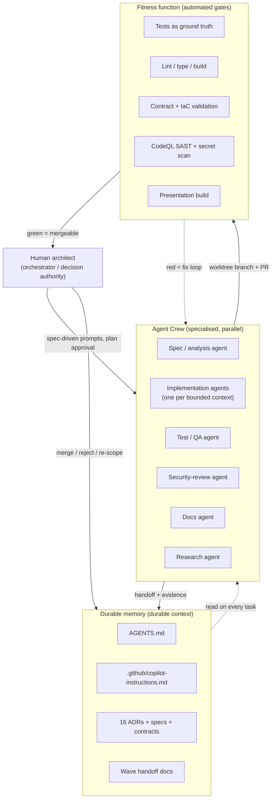
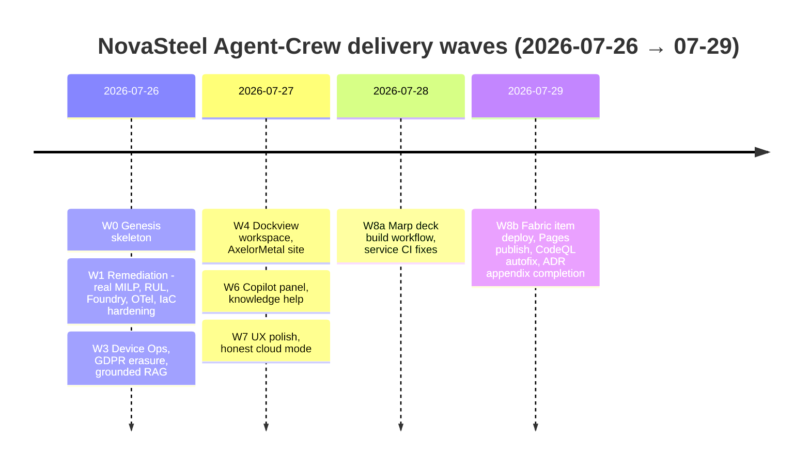
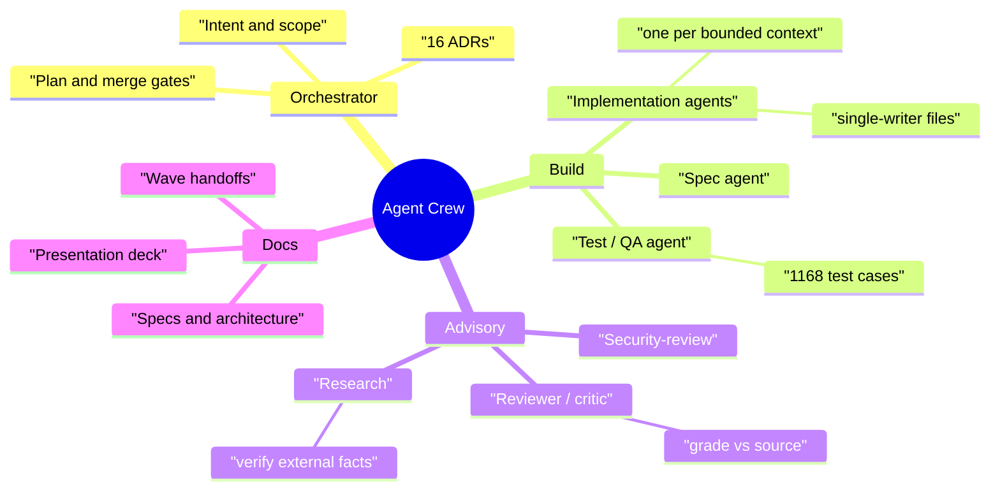
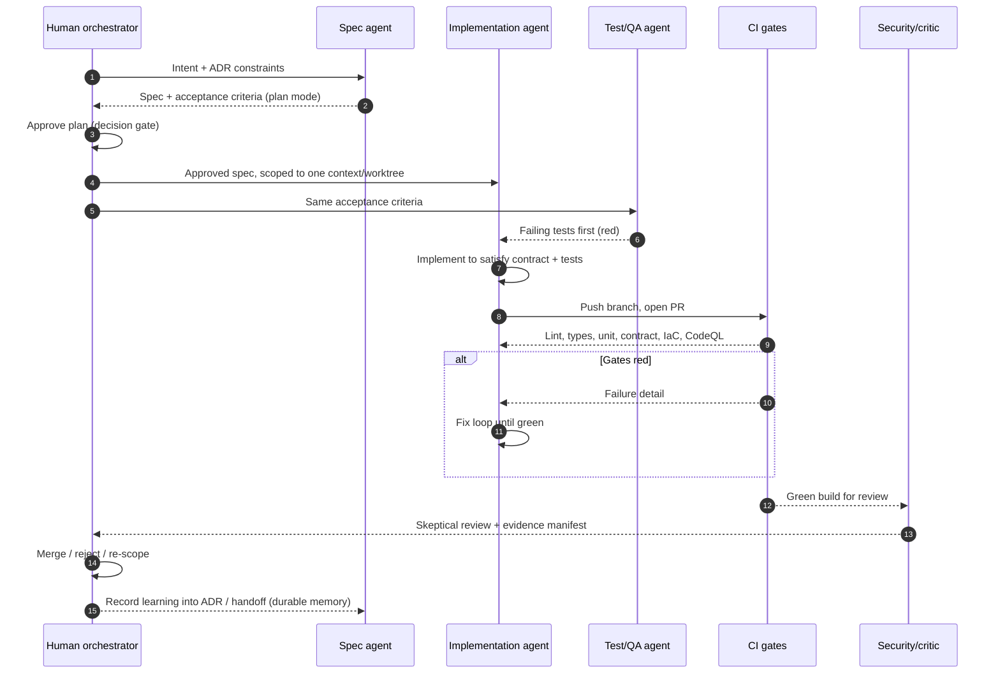
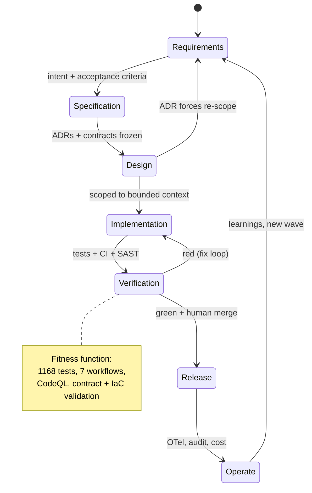
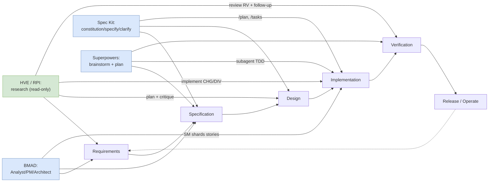

# Agentic Development — How NovaSteel Was Built by an Agent Crew

> **Purpose.** This document explains, with measured evidence from *this* repository, how the
> NovaSteel platform was produced through **agentic development** — a human architect directing a
> crew of specialised AI coding agents ("Agent Crew") — and how that method maps onto a rigorous,
> auditable Software Development Life Cycle (SDLC). It also positions the method against the leading
> spec-driven agentic frameworks (GitHub Spec Kit, Superpowers, BMAD-METHOD, and Microsoft's
> Hypervelocity Engineering / HVE), one of which (**GitHub Spec Kit**) seeded a previous iteration of
> this work.

| Field | Value |
| --- | --- |
| **Title** | Agentic Development — How NovaSteel Was Built by an Agent Crew |
| **Status** | Final — evidence-backed |
| **Last reviewed** | 2026-07-29 |
| **Audience** | Engineering leadership; the evaluation jury; delivery teams adopting agentic development |
| **Scope** | Engineering *method* and its SDLC mapping. The *business/technical* delivery narrative lives in [`implementation-process.md`](implementation-process.md); regulatory posture lives in [`../compliance/README.md`](../compliance/README.md). |
| **Companion docs** | [`implementation-process.md`](implementation-process.md) · [`../compliance/README.md`](../compliance/README.md) · [`../../architecture/solution-architecture.md`](../../architecture/solution-architecture.md) |

---

## 1. Executive summary

NovaSteel is an AI-powered, **advisory-only** steel-production optimisation platform (Microsoft
Fabric + Azure). Every line of it was produced by **agentic development**: a single human architect
acting as orchestrator, directing a *crew* of AI coding agents — GitHub Copilot CLI, the GitHub
Copilot cloud coding agent, and parallel background sub-agents — each working in an isolated git
worktree on a bounded slice of the system, under durable written instructions, behind automated
verification gates.

The method mirrors the product's own governing principle — **"AI advises, humans decide."** Agents
draft; the architect approves. Agents propose numbers; **tests are the ground truth**. Agents write
code; **CI, SAST, contract validation and the presentation build are the fitness function**.

The measured footprint of the crew's output (§3) is substantial: **1,115 tracked files**,
**~78,000 lines of application/infrastructure code** across nine languages, **~1,168 automated test
cases**, **7 GitHub Actions workflows**, **16 Architecture Decision Records**, and **130 Markdown
documents (19,315 lines)** — all landed across **99 commits in a four-day window**, of which **71
carry a `Co-authored-by: Copilot` trailer** and **70 carry a `Copilot-Session:` provenance trailer**.



The remainder of this document substantiates every claim above with the exact command used to
measure it, then generalises the method into a reusable playbook (§10) and an SDLC map (§6).

---

## 2. The Agent Crew operating model at a glance

Agentic development here is **not** "ask a chatbot to write a file." It is an operating model with
four moving parts:

1. **A human orchestrator** who owns intent, architecture, and every irreversible decision.
2. **A crew of role-specialised agents**, each given a *narrow* scope, a *file-ownership* boundary,
   and a *contract-first* interface so their work composes without collision.
3. **Durable memory** — [`AGENTS.md`](../../../AGENTS.md),
   [`.github/copilot-instructions.md`](../../../.github/copilot-instructions.md), the 16 ADRs, the
   JSON Schemas in [`contracts/`](../../../contracts), and per-wave handoff notes — that survives
   the death of any single agent's context window.
4. **An automated fitness function** — tests, linters, contract/IaC validators, CodeQL, and the deck
   build — that decides objectively whether a proposed change is fit to merge.

The key insight is that **context is the scarce resource**, not tokens or model capability. The crew
model exists to keep each agent's working set small, verifiable, and non-overlapping, and to persist
the learnings that matter into files that the *next* agent will read.

---

## 3. Evidence from this repository (measured, not asserted)

All numbers below were measured on the checked-out worktree on **2026-07-29**. Each table states the
command used. Nothing in this section is estimated; estimates appear only in §9 and are flagged
🎯 estimate.

### 3.1 Commit history and provenance

```powershell
# Commit count, contributors, co-author and session trailers
git --no-pager log --oneline | Measure-Object -Line
git --no-pager shortlog -sne HEAD
git --no-pager log --format="%B" | Select-String "Co-authored-by: Copilot" -SimpleMatch
git --no-pager log --format="%B" | Select-String "Copilot-Session:"       -SimpleMatch
git --no-pager log --merges --oneline
git --no-pager log --format="%ad" --date=short | Group-Object
```

| Metric | Measured value | What it shows about the method |
| --- | ---: | --- |
| Total commits | **99** | High-frequency, small-batch delivery — the agentic cadence. |
| Merge commits | **7** | Trunk-based with short-lived branches merged via PR (#5, #7, #9, #11, #13) plus 2 integration merges. |
| Distinct authoring identities | **5** | Human architect (3 email identities), `copilot-swe-agent[bot]`, `dependabot[bot]`. |
| Human-authored commits | **78** | The architect drove and committed the bulk of local CLI work. |
| `copilot-swe-agent[bot]` commits | **20** | The GitHub Copilot **cloud** coding agent, working autonomously on PR branches. |
| `Co-authored-by: Copilot` commits | **71** | Explicit AI-authorship provenance on ~72 % of commits (CLI trailer policy). |
| `Copilot-Session:` trailers | **70** | Machine-readable session provenance — every AI turn is traceable to a session. |
| Distinct Copilot session IDs | **3** | The cloud agent's autonomous PRs cluster into 3 traceable sessions. |
| `dependabot[bot]` commits | **1** | Automated supply-chain hygiene is part of the pipeline. |
| Delivery window | **2026-07-26 → 2026-07-29 (4 days)** | Entire platform produced in a four-day agentic sprint. |
| Commit cadence | **26 / 24 / 22 / 27 per day** | Sustained, near-constant throughput across the four days. |

**Interpretation.** 72 % of commits carry an explicit AI co-authorship trailer and 71 % carry a
session-provenance trailer. This is *auditable AI provenance*: a reviewer can attribute any change to
a human decision plus a named agent session — a property most hand-written codebases lack.

### 3.2 Codebase size and language mix

```powershell
git ls-files | Measure-Object                      # total tracked files
git ls-files | ForEach-Object {[IO.Path]::GetExtension($_)} | Group-Object   # by extension
# LOC per language: sum (Get-Content <file> | Measure-Object -Line) over git ls-files "*.<ext>"
```

| Language | Files | Lines of code | Role in the solution |
| --- | ---: | ---: | --- |
| Python | 218 | **35,583** | Services (optimizer/scoring/knowledge/BFF/ingest), simulator, Fabric notebooks, tests. |
| JSON | 233 | 29,935 | Contracts, fixtures, dashboard/semantic-model definitions, captured evidence. |
| Markdown | 130 | **19,315** | Specs, ADRs, architecture, security, presentation, handoffs (see §3.5). |
| TypeScript React (`.tsx`) | 100 | 17,003 | Analytics micro-frontend (MUI/D3 dashboards, Copilot panel). |
| TypeScript (`.ts`) | 69 | 12,386 | MFE API clients, i18n, hooks, tests. |
| Bicep | 26 | 5,249 | Azure landing zone (private endpoints, Foundry, Event Hubs, Fabric). |
| PowerShell | 22 | 4,193 | Deploy/validation/automation scripts. |
| CSS | 10 | 1,514 | Shell and dashboard styling. |
| C# | 9 | 1,049 | Blazor `portal-shell` host. |
| Razor | 10 | 996 | Blazor shell components. |
| **Application + IaC code total** | — | **≈ 77,973** | Python + TS/TSX + Bicep + PS + C# + Razor + CSS. |
| **Total tracked files** | **1,115** | — | Full repository surface. |

Nine programming languages, six deployable services, two front-end apps, a full Azure IaC estate and
a Fabric analytics tier were kept coherent by *one* orchestrator because the boundaries between them
are **contract-first** (§4.5), not tribal knowledge.

### 3.3 Test surface — the crew's ground truth

```powershell
(git ls-files "*.py" | %{ Select-String -Path $_ -Pattern "^\s*def test_" }).Count   # 903
(git ls-files "*.test.ts","*.test.tsx" | %{ Select-String $_ -Pattern "\b(it|test)\(" -AllMatches }).Count  # 265
git ls-files "*test*" | Measure-Object   # ~105 test files
```

| Metric | Measured value |
| --- | ---: |
| Python test functions (`def test_`) | **903** |
| TypeScript/React test cases (`it(` / `test(`) | **265** |
| **Total automated test cases** | **≈ 1,168** |
| Python test files (`test_*.py` / `*_test.py`) | 70 |
| TS/TSX test files (`*.test.ts(x)` / `*.spec.ts(x)`) | 30 |

A test-to-source ratio this high is not decoration — it is *how the crew avoided hallucinated
behaviour*. When an agent claimed "energy dispatch shifts load to the greenest window," a failing or
passing test — not the agent's prose — settled it. This is the operational meaning of
**verification-first** agentic development (§5.3).

### 3.4 CI/CD, IaC and decision records

```powershell
git ls-files ".github/workflows/*"          # 7 workflows
(git ls-files "infra/**/*.bicep").Count      # 21 bicep files
Select-String -Path docs\architecture\solution-architecture.md -Pattern "ADR-\d+"  # ADR-001..016
```

| Artifact | Count | Files / notes |
| --- | ---: | --- |
| GitHub Actions workflows | **7** | `ci.yml`, `ci-build-services.yml`, `cd-services.yml`, `cd-infra.yml`, `cd-fabric-items.yml`, `codeql.yml`, `presentation.yml`. |
| Bicep files (infra) | **21** | Private-endpoint landing zone; `disableLocalAuth: true`, public access disabled. |
| Architecture Decision Records | **16** | `ADR-001 … ADR-016` in [`solution-architecture.md`](../../architecture/solution-architecture.md). |
| Deployable services | **6** | `bff-api`, `optimizer-worker`, `scoring-worker`, `knowledge-orchestrator`, `ingest-relay`, `device-simulator`. |
| Front-end apps | **2** | `analytics-mfe` (React MFE), `portal-shell` (Blazor). |
| Event/data contracts | schemas + fixtures | [`contracts/events/*.schema.json`](../../../contracts/events), [`contracts/data/*.json`](../../../contracts/data), OpenAPI. |

The 16 ADRs are the single most important agentic artefact in the repo: they are the **frozen
decisions** the human made and the agents were *forbidden to relitigate* (e.g. ADR-006 "Python is
authoritative, Foundry is not the controller"; ADR-007 "human approval, no direct OT action";
ADR-016 "Event Hubs, not IoT Hub"). They are durable memory with legal-style precedence.

### 3.5 Documentation and process artefacts

```powershell
git ls-files "*.md" | Measure-Object     # 130 files
git ls-files "docs/*" | %{ ($_ -split '/')[1] } | Group-Object   # subdir distribution
```

| Documentation area | Files | Signal about the agentic process |
| --- | ---: | --- |
| `docs/presentation/*` | 84 | The jury deck + FAQ + defence plan — a *docs agent* deliverable. |
| `docs/_upgrade/*` | 11 | The **remediation pass**: comparative scoring + evidence reports (§3.6). |
| `docs/_wave6/*` | 6 | Six **wave-6 handoff** notes — direct proof of parallel front-end sub-agents. |
| `docs/architecture/*` | 3 | `solution-architecture.md` (16 ADRs), `fabric-brain-mapping.md`. |
| `docs/security`, `docs/operations`, `docs/tech`, `docs/research`, `docs/ux`, `docs/specs` | 11 | Specialist-agent outputs, one bounded area each. |
| **Total Markdown** | **130 (19,315 lines)** | Documentation-as-code, produced alongside the code by the crew. |

### 3.6 Reconstructed delivery waves (agent-crew iterations)

Reading the commit stream (`git --no-pager log --format="%ad %s" --date=short`) against the
`docs/_wave6`, `docs/_upgrade` and architecture "Wave" notes reconstructs the actual iteration
history. Each wave is an **agent-crew sprint**: decompose → parallel implement → verify → integrate →
document.

| Wave | Date(s) | Commit / doc evidence | What the crew delivered |
| --- | --- | --- | --- |
| **W0 — Genesis** | 07-26 | `Initial NovaSteel comprehensive solution` | First end-to-end skeleton: services, contracts, IaC, MFE, docs. |
| **W1 — Remediation ("real brains")** | 07-26 | `Replace fabricated KPIs with real MILP and physics-informed models`; `Add live Foundry model calls, critic loop, agent handoff and state graph`; `Add OpenTelemetry instrumentation, durable audit store`; `Provision alerts, zone redundancy… correct Foundry RBAC` | The `_upgrade` plan's **M1/M2/M3**: replace demo constants with real optimisation, add observability + audit, harden IaC. |
| **W3 — Device Operations** | 07-26 → 27 | `docs: document wave 3 across specs, architecture, security and demo`; `feat(backend): device simulator estate, GDPR erasure and grounded RAG` | Device Operations subsystem, GDPR Art. 17 erasure, grounded RAG, dashboard collections (ADR-013). |
| **W4 — Workspace shell** | 07-27 | `chore: refresh validation evidence for the wave-4 run`; `feat(mfe): dock every screen with Dockview…`; `feat(mfe): add the AxelorMetal corporate website section` | Two-level Dockview workspace, JSX-derived panels, corporate site (ADR-014). |
| **W6 — Copilot panel + knowledge** | 07-27 | `Land wave 6: multi-site device routes, knowledge help topics, doc restoration`; the **6 `docs/_wave6/*handoff.md`** notes | Grouped persona suggestions, online-search fallback, general steel-expert mode, glossary online fallback. |
| **W7 — UX polish + honesty** | 07-27 | `Land wave 7: bilingual help layout, chart select-zoom, semantic tiles, locale flags, honest cloud mode` | Bilingual help, chart zoom, "honest cloud mode" labelling. |
| **W8 — Deck + Fabric deploy** | 07-28 → 29 | Cloud-agent PRs #5/#7/#9/#11/#13: `Add Marp presentation build workflow…`, `deploy-fabric-items`, `fix-page-deployment`, `improve-presentation-doc` | Marp deck build + GitHub Pages publish; Fabric item deployment; CodeQL autofix. |



### 3.7 The `.github/`, `AGENTS.md`, `artifacts/` triangle

| Artefact | Location | What it *is* | What it reveals about the method |
| --- | --- | --- | --- |
| `AGENTS.md` | repo root | Cross-agent standing instructions (package-feed policy, links to durable config). | **Durable memory** every agent reads first; enforces the supply-chain guardrail (§8). |
| `copilot-instructions.md` | `.github/` | Copilot-specific mandatory policy (protected feeds, no public registries). | Machine-targeted constitution: the guardrail is *in the agent's system context*, not a wiki page. |
| `dependabot.yml` | `.github/` | Automated dependency PRs. | Supply-chain hygiene delegated to a bot, reviewed by the human. |
| 7 workflows | `.github/workflows/` | CI, service build, infra/service/Fabric CD, CodeQL, deck build. | The **fitness function** made executable and enforced on every branch. |
| `docs/_wave6/*handoff.md` | `docs/_wave6/` | 6 structured handoff notes (files created/modified, tests passed, env switches). | Proof of **parallel sub-agents** handing curated context to the integrator. |
| `docs/_upgrade/` | `docs/_upgrade/` | Comparative scoring + 6 specialist evidence reports (204 KB). | A **reviewer/critic crew** grading the work *skeptically against source*, not READMEs. |
| `artifacts/azure-deployment/`, `artifacts/demo-validation/` | `artifacts/` | Captured live-API JSON, browser screenshots, drive-demo scripts. | **Evidence manifests**: the crew proves execution, it does not assert it. |

The `docs/_upgrade/README.md` states the method verbatim: *"Six specialist agents analysed both
repositories in parallel, each owning specific rating-grid criteria… Every agent was instructed to
verify claims against source code rather than READMEs, and to grade skeptically."* This is the
Agent-Crew model applied to *evaluation*, and it is the template for §5.

---

## 4. The Agent Crew model

### 4.1 Roles and specialisation

The crew is a set of **role prompts**, each a persona with a narrow remit, an explicit file-ownership
boundary, and a hand-off contract. No single agent holds the whole system in context at once.

| Role | Mandate | Owns (writes) | Never touches |
| --- | --- | --- | --- |
| **Orchestrator / architect** (human) | Intent, decomposition, ADRs, merge authority. | ADRs, wave plans, final approvals. | — (owns everything by decision, delegates execution). |
| **Spec / analysis agent** | Turn intent into a testable spec + acceptance criteria. | `docs/specs/*`, acceptance lists. | Implementation code. |
| **Implementation agent** (one per bounded context) | Build one service/app slice to spec. | Its own `services/<x>/` or `apps/<y>/`. | Other contexts' folders; contracts (read-only). |
| **Test / QA agent** | Encode acceptance criteria as executable tests; run them. | `tests/`, `*_test.py`, `*.test.tsx`. | Production logic (writes tests that *drive* it). |
| **Security-review agent** | Threat-model, review diffs for auth/secret/injection flaws. | `docs/security/*`, review comments. | Feature code (advises; human/impl agent fixes). |
| **Docs agent** | Keep specs, architecture, deck and handoffs in sync with code. | `docs/**`, `docs/presentation/`. | Runtime code. |
| **Research agent** | Verify external facts (Azure regions, model availability, framework claims). | `docs/research/*`, citations. | Runtime code. |
| **Reviewer / critic agent** | Grade the delivered work skeptically against source; produce evidence reports. | `docs/_upgrade/evidence/*`. | Source (read-only). |

The `docs/_upgrade` evidence pack is a working instance of the last four roles: six critic/research
agents, each owning one rubric criterion, verifying against source and grading skeptically.



**Reading the mindmap.** Only the orchestrator (human) authors intent and merges. The *Build* branch
mutates source under a fitness function; the *Advisory* branch is read-only and feeds findings back to
the human; the *Docs* branch keeps the written system-of-record in step with code. No branch can
promote its own work — promotion is a human act.

### 4.2 How work is decomposed

Decomposition follows the **bounded contexts** of the system, which are themselves fixed by ADRs and
contracts. A wave's backlog is split so that each item:

1. maps to exactly **one** service/app folder (single-writer ownership),
2. depends on others only through a **versioned contract** (JSON Schema / OpenAPI), and
3. carries its own **acceptance tests** so it can be verified in isolation.

This is why 78 k LOC across six services stayed coherent: the *seams* are declared
(`contracts/events/event-envelope.v1.schema.json`, `contracts/data/{bronze,silver,gold}.v1.json`),
so two agents editing two services cannot silently break each other — the contract test does.

### 4.3 Task lifecycle (sequence)



### 4.4 Parallelism: worktrees, sessions, background agents

Parallelism is achieved physically, not just logically:

- **Git worktree per task.** Each agent works in its own worktree/branch (this very document is being
  produced in the worktree `frkim-fictional-pancake`; a sibling agent works `implementation-process.md`
  and a third works `docs/business/compliance/`). Worktrees give filesystem isolation with a shared
  object store — no lock contention, clean per-branch CI.
- **One session per branch.** The 3 distinct `Copilot-Session:` IDs and the 5 `copilot/*` remote
  branches show the cloud coding agent running **independent autonomous sessions**, each scoped to one
  PR (deck workflow, Fabric deploy, Pages fix, doc improvement).
- **Background sub-agents.** The `docs/_wave6/*handoff.md` set is the fingerprint of several
  front-end sub-agents (charts, chrome, devices, knowledge, personas, copilot) running concurrently
  and each returning a *curated handoff* — not raw context — to the integrator. The commit
  `wip(wave6): checkpoint in-flight parallel work before recovery` explicitly names parallel work.

### 4.5 Conflict avoidance: file ownership + contract-first

Two rules keep parallel agents from colliding:

1. **Single-writer file ownership.** A file has exactly one owning agent per wave. Cross-cutting
   changes (e.g. i18n keys across five locales) are assigned to *one* agent, not raced by many.
2. **Contract-first boundaries.** Interfaces are frozen as schemas *before* implementation. An agent
   consumes `energy-interval.v1.schema.json`; it does not reach into the optimizer's internals. The
   contract's fixtures (`contracts/events/fixtures/*.valid.v1.json`) are the shared truth both sides
   test against.

This is the same discipline that makes microservices scale organisationally — applied to *agents*
instead of teams.

### 4.6 Crew topology

```mermaid
flowchart LR
    H(("Human<br/>orchestrator"))
    subgraph MEM["Durable memory"]
        direction TB
        M1["AGENTS.md /<br/>copilot-instructions.md"]
        M2["16 ADRs + specs"]
        M3["contracts/*.schema.json"]
        M4["wave handoffs"]
    end
    H --- MEM
    subgraph CTX["Bounded contexts (single-writer)"]
        direction TB
        C1["optimizer-worker"]
        C2["scoring-worker"]
        C3["knowledge-orchestrator"]
        C4["bff-api"]
        C5["ingest-relay + simulator"]
        C6["analytics-mfe + portal-shell"]
        C7["infra (Bicep) + Fabric"]
    end
    H -->|"spec + plan approval"| CTX
    MEM -.->|"read-first context"| CTX
    CTX -->|"PR + evidence"| GATE{{"CI fitness function"}}
    GATE -->|"green"| H
    GATE -.->|"red"| CTX
    subgraph REV["Advisory crew (read-only)"]
        R1["Security-review"]
        R2["Critic / evidence"]
        R3["Research"]
    end
    REV -.->|"findings"| H
    CTX -.->|"artefacts to review"| REV
```



---

## 5. Human-in-the-loop governance

### 5.1 Where the human decides

The product's motto — **"AI advises, humans decide"** (ADR-007; the advisory-only, no-write-to-OT
posture) — is deliberately mirrored in the *build* process. The human orchestrator retains sole
authority over:

| Decision class | Example in this repo | Delegated to an agent? |
| --- | --- | --- |
| Architecture | The 16 ADRs (Fabric core, Event Hubs vs IoT Hub, Python-authoritative). | **Never.** Agents implement ADRs; they do not author them. |
| Regulatory / compliance claims | GDPR Art. 17 erasure, EU AI Act posture, "advisory-only." | **Never.** Human-owned; see [`../compliance/README.md`](../compliance/README.md). |
| Guardrails | Tool allow-lists, prompt-injection defence, no-direct-OT-action. | **Never** loosened by an agent. |
| Headline numbers | The energy/CO₂/RUL figures on the deck. | **Never** trusted from an agent; only from a test or a captured artifact. |
| Merge to `main` | All 7 merges are human-approved PRs. | **Never** auto-merged. |

### 5.2 Plan-mode approval and review gates

The lifecycle (§4.3) has two mandatory human checkpoints: **plan approval** (before any code, the
agent's plan is reviewed) and **merge approval** (after green CI, the diff + evidence is reviewed).
Between them the agent runs autonomously — the cloud agent's 20 commits across 3 sessions are exactly
this "approved plan, autonomous execution, human merge" pattern. The `Initial plan` commits that
precede each cloud-agent PR are the recorded plan checkpoints.

### 5.3 How hallucination risk was controlled

Agentic development's central risk is confident fabrication. Five controls, all visible in the repo,
neutralise it:

1. **Verification-first / tests as ground truth.** 1,168 test cases decide behaviour, not prose.
2. **Evidence manifests.** `artifacts/azure-deployment/live-api/*.json` and browser screenshots
   capture *real* responses; the deck cites captured evidence, not model output.
3. **No unverified numbers.** The `_upgrade` pass explicitly *hunted* fabricated KPIs — it found and
   flagged `min(15.0, savings*0.84)` (a CO₂ calibration constant) and a hard-coded `demo_warning`
   RUL, then W1 replaced them with a real MILP and a physics-informed model. The lesson is codified:
   demo numbers must be *labelled* demo (e.g. `energy-dispatch-deterministic:1.0.0`).
4. **Skeptical critic crew.** Six evidence agents graded against source, not documentation.
5. **Honest UI labelling.** "honest cloud mode" and the "offline demo corpus" chip surface the
   provenance of every answer to the end user — hallucination made *visible* rather than hidden.

### 5.4 What was never delegated

Architecture (ADRs), regulatory claims, guardrail definitions, the choice of headline metrics, and
the merge decision. Agents accelerate everything *inside* these boundaries and are forbidden from
moving the boundaries themselves.

---

## 6. Mapping agentic development onto a rigorous SDLC

A frequent objection is that AI-generated repos skip the SDLC. The opposite is true here: the SDLC
phases are *present and auditable* — they are simply executed by a human-directed crew at high
cadence. Importantly, this repository does **not** contain the *upstream* spec-authoring artefacts of
a framework like Spec Kit (there is no `constitution.md`/`spec.md`/`tasks.md` chain); it contains
their **functional equivalents** — ADRs, `docs/specs/solution-requirements.md`, contracts, and
handoffs. §7 explains how to reintroduce the upstream chain by starting from a framework.

### 6.1 The agentic SDLC loop



### 6.2 Phase-by-phase mapping

| Classical SDLC phase | Classical artifact | Agentic-crew equivalent | Evidence in this repo |
| --- | --- | --- | --- |
| Requirements | Requirements spec, user stories | Intent prompt + acceptance criteria authored with the spec agent | [`docs/specs/solution-requirements.md`](../../specs/solution-requirements.md); persona docs |
| Specification | Functional spec, SRS | Testable spec + fixtures; "what/why not how" | `docs/specs/*`, `contracts/**/fixtures/*` |
| Design | Architecture doc, ADRs, interface contracts | 16 ADRs + JSON Schema / OpenAPI contracts | [`solution-architecture.md`](../../architecture/solution-architecture.md) (ADR-001…016); [`contracts/`](../../../contracts) |
| Implementation | Source code, code review | Single-writer implementation agents per bounded context; PR review | 6 services, 2 apps, 21 Bicep files, 78 k LOC |
| Verification | Test plan, test cases, QA sign-off | Executable tests as ground truth + CI fitness function | 1,168 tests; `ci.yml`, `codeql.yml`; `docs/validation-report.md` |
| Release | Release notes, deployment runbook | CD workflows + IaC + evidence manifests | `cd-services.yml`, `cd-infra.yml`, `cd-fabric-items.yml`; `artifacts/azure-deployment/` |
| Operate | Monitoring, incident, audit | OpenTelemetry, durable audit store, cost model | `docs/operations/operations-and-cost.md`; `fact_ai_decision_audit` semantic-model table |
| Governance (cross-cutting) | Change control, traceability | ADR precedence + `Copilot-Session:`/`Co-authored-by:` provenance + skeptical critic pass | 70 session trailers; `docs/_upgrade/evidence/*` |

The mapping shows agentic development is **not a shortcut around** the SDLC — it is a **compression**
of it: the same phases, the same artefacts, executed in tight loops with machine-enforced gates and
per-change provenance.

---

## 7. Starting from a framework

NovaSteel was built with a *hand-rolled* crew model driven by GitHub Copilot CLI + cloud agent. That
works, but a new project should ideally **start from a spec-driven agentic framework** so that the
upstream spec-authoring chain (constitution → spec → plan → tasks) is standardised, versioned, and
tool-enforced rather than improvised. A **previous iteration of this work used
[GitHub Spec Kit](https://github.com/github/spec-kit)** to seed exactly that chain before the crew
implemented against it.

Below, each framework is described from its authoritative source (retrieved 2026-07-29; see
[§ Sources](#sources)).

### 7.1 GitHub Spec Kit — `github/spec-kit`

- **What it is.** An open-source toolkit for **Spec-Driven Development (SDD)**, in which
  *specifications become executable* and directly generate implementations rather than merely guiding
  them. Published by **GitHub**. Works with 30+ AI coding agents (Copilot, Claude, Cursor, Codex CLI,
  Gemini CLI, and more).
- **CLI.** `specify` (installed via `uv tool install specify-cli`); `specify init <project> --integration copilot` scaffolds the workflow; `specify self upgrade`, `specify integration list` manage it.
- **Slash-command workflow.** `/speckit.constitution` → `/speckit.specify` → `/speckit.clarify` →
  `/speckit.plan` → `/speckit.tasks` → `/speckit.analyze` → `/speckit.implement`, with extras
  `/speckit.checklist`, `/speckit.taskstoissues`, `/speckit.converge`. (Older docs use the bare
  `/constitution`, `/specify`, `/plan`, `/tasks`, `/analyze`, `/implement` names.)
- **Artifact chain.** `constitution.md` (governing principles) → `spec.md` (the *what/why*) →
  `plan.md` (tech stack + architecture) → `tasks.md` (actionable task list) → implementation.
- **When to choose it.** When you want a *vendor-neutral*, agent-agnostic SDD process with a crisp,
  auditable artefact chain and GitHub-native issue integration — the closest public analogue to what
  NovaSteel did by hand. **This is the framework a prior iteration of NovaSteel started from.**

### 7.2 Superpowers — `obra/superpowers`

- **What it is.** *"A complete software development methodology for your coding agents,"* built as a
  set of **composable skills** plus session-start instructions that make the agent use them.
  Published by **obra (Jesse Vincent)**; distributed via the official Claude plugin marketplace and
  installable into many harnesses (Claude Code, Codex, Cursor, Gemini CLI, GitHub Copilot CLI, etc.).
- **Workflow.** The agent refuses to jump straight to code: it **brainstorms** the spec out of the
  conversation, shows it in digestible chunks for sign-off, produces an **implementation plan**
  aimed at "an enthusiastic junior engineer" that emphasises **true red/green TDD, YAGNI and DRY**,
  then runs **subagent-driven development** — subagents work each task while the lead inspects and
  reviews, often autonomously for hours.
- **Skills.** Reusable procedural knowledge ("skills") trigger automatically from context, so the
  method is always-on without special commands.
- **When to choose it.** When your primary harness is Claude Code (or a supported plugin host) and you
  want an opinionated **brainstorm → plan → TDD subagent** loop with reusable skills, rather than a
  formal document chain.

### 7.3 HVE — Hypervelocity Engineering — `microsoft/hve-core`

- **What it is.** **Hypervelocity Engineering (HVE)** is a *"highly opinionated, rapidly evolving
  agentic SDLC framework"* whose reference implementation is **HVE Core** (`microsoft/hve-core`),
  published by **Microsoft (ISE)**; MIT-licensed (some OWASP-derived skill content under CC BY-SA
  4.0). The README frontmatter describes it as a *"Hypervelocity Engineering prompt library for
  GitHub Copilot with convention-driven AI workflows and validated artifacts"* (`ms.date:
  2026-07-23`). Docs: <https://microsoft.github.io/hve-core/>.
- **Honest self-caveat (quoted).** Microsoft explicitly states HVE Core *"is best treated as a source
  of patterns and learning rather than a stable platform, foundation, or production dependency,"* and
  that workflows, interfaces and architecture *"may change substantially, including in ways that are
  not backward compatible."* Adopt its **patterns**, not the repo as a dependency.
- **Building blocks (four artifact types).** **Agents** (specialised tasks: research, planning,
  implementation, review), **Prompts** (repeatable workflow entry points), **Instructions** (coding
  standards applied automatically), and **Skills** (reusable tool capabilities) — laid out under
  `.github/CUSTOM-AGENTS.md`, `.github/instructions/`, `.github/prompts/`, `.github/skills/`, with a
  CI/CD **validation pipeline for the AI artifacts themselves**.
- **Core methodology — RPI (Research → Plan → Implement → Review) + Follow-up.** Flow: *task context
  and evidence → Research when needed → Plan → Implement → Review → Follow-up*. **Research is
  read-only** and is activated **only on a demonstrated evidence gap**; adequate prior evidence is
  reused and the reuse/skip decision is recorded. Its stated insight: *"when AI knows it cannot
  implement, it stops optimizing for 'plausible code' and starts optimizing for 'verified truth' —
  the constraint changes the goal."*
- **Durable, dated artifacts under `.copilot-tracking/`** (the part most worth comparing to §3.7):
  - research → `.copilot-tracking/research/{YYYY-MM-DD}/{task_slug}-research.md`
  - plan → `.copilot-tracking/plans/.../{task_slug}-plan.md` + phase details
    (`.../details/.../{task_slug}-phase-details.md`) + an **independent plan critique**
    (`.../reviews/plans/.../{task_slug}-plan-critique.md`) with a required `Pass` / `Revise` /
    `Blocked` disposition **before** implementation
  - implementation → `.copilot-tracking/changes/.../{task_slug}-changes.md`; each material change
    gets a `CHG-xxx` id; a departure from the approved plan records linked `DIV-xxx` (divergence) +
    `AM-xxx` (amendment) and **returns for fresh plan critique**
  - review → `.copilot-tracking/reviews/logs/.../{task_slug}-review.md`; findings get severity-graded
    `RV-xxx` ids; execution **status** (`Complete` / `Partial` / `Blocked`) is kept deliberately
    separate from **outcome** (`Conformant` / `Conformant with justified divergence` / `Defects
    found` / `Residual work` / `Not accepted`)
  - stable `Pxx` phase and `Pxx-Txx` task ids with `<!-- rpi:... -->` markers
  - **Follow-up** routes defects → implement, decision gaps → plan, evidence gaps → research, and
    residual work → a new item.
- **Entry surfaces.** `RPI Agent` (a user-selected lifecycle wrapper), `/rpi-quick` (skill-based
  full-flow entry), or the focused skills `/rpi-research`, `/rpi-plan`, `/rpi-implement`,
  `/rpi-review`. It is explicitly **not** an autonomous dispatcher of specialised task workers.
- **Context management.** HVE tells you to `/clear` or start a new chat between lifecycle concepts,
  because the **dated durable artifacts — not the conversation — carry context forward**. This is a
  direct, citable countermeasure to the *context-rot* anti-pattern documented in §10.2, and the same
  principle as this repo's durable memory (§2, §3.7).
- **Responsible AI.** HVE Core ships a `TRANSPARENCY-NOTE.md` and points at Microsoft's Responsible
  AI Standard — consistent with the EU AI Act Art. 4 AI-literacy angle in §8.3.
- **Distribution.** VS Code Marketplace extensions `ise-hve-essentials.hve-core` and
  `ise-hve-essentials.hve-core-all`; **GitHub Copilot CLI** plugin via
  `copilot plugin marketplace add microsoft/hve-core` then `copilot plugin install hve-core@hve-core`.
- **When to choose it.** When you want a **Microsoft-authored, evidence-led agentic SDLC** on GitHub
  Copilot with a *durable, dated, id-tracked* artifact chain and a hard "no-plausible-code, only
  verified-truth" gate — the closest published analogue to NovaSteel's own verification-first,
  evidence-manifest discipline. Treat it as a pattern source to fork, per Microsoft's own caveat.

### 7.4 BMAD-METHOD — `bmad-code-org/BMAD-METHOD`

- **What it is.** The **Breakthrough Method of Agile AI-Driven Development** (branding also expanded
  as "Build More Architect Dreams"), a **scale-adaptive** agentic agile framework published by
  **BMad Code, LLC**; MIT-licensed, installed via `npx bmad-method install`. V6 adds a skills
  architecture, cross-platform agent teams and sub-agent inclusion.
- **Two-phase model — "context-engineered development."**
  1. **Agentic planning.** Specialised planning agents — **Analyst, PM, Architect** (plus UX and 12+
     domain experts) — collaborate to produce a **PRD** and an **Architecture** document. Planning can
     run in a flat-rate web LLM (Gemini Gems / ChatGPT Custom GPTs "web bundles") to save metered IDE
     tokens.
  2. **Implementation.** A **Scrum Master** agent *shards* the PRD + Architecture into
     **hyper-detailed story files**, each embedding full context and acceptance criteria, which
     **Dev** and **QA** agents implement one at a time — eliminating the context loss that plagues
     naive agent coding.
- **Extras.** *Expansion packs* / modules for specialised domains; **Party Mode** brings multiple
  personas into one session; `bmad-help` guides "what's next."
- **When to choose it.** When you want a **structured agile** wrapper (roles, ceremonies, sharded
  stories) that scales from bug fix to enterprise system, and you value the planning/implementation
  split and cheap web-bundle planning.

### 7.5 Framework comparison

> **RPI's `.copilot-tracking/` chain vs what this repo actually did.** HVE's dated, id-tracked
> artifact chain (research → plan → plan-critique → changes → review, with `Pxx`/`CHG-xxx`/`DIV-xxx`/
> `RV-xxx` ids and status-separate-from-outcome) is a *formalised, tool-enforced* version of exactly
> what NovaSteel grew organically: the `docs/_wave6/*handoff.md` notes are ad-hoc *changes* records,
> the `docs/_upgrade/` pack is an independent *review/critique* with skeptical dispositions, the
> `artifacts/` captures are *validation evidence manifests*, and `AGENTS.md` + the 16 ADRs are the
> durable memory that HVE keeps under `.copilot-tracking/`. In short, **this project reinvented a
> lighter-weight equivalent of RPI**. The lesson for the next project is explicit: **adopt one of
> these frameworks up front** (HVE for a Microsoft/Copilot-native evidence-led chain, Spec Kit for a
> neutral spec chain, BMAD for agile scale) rather than regrowing the same conventions by hand.


| Framework | Philosophy | Core artifacts | Orchestration | Best fit | Maturity (2026-07-29) |
| --- | --- | --- | --- | --- | --- |
| **GitHub Spec Kit** | Executable specs drive code (SDD) | `constitution.md`, `spec.md`, `plan.md`, `tasks.md` | `specify` CLI + `/speckit.*` slash commands | Vendor-neutral, agent-agnostic, GitHub-native | Actively released; 30+ agent integrations |
| **Superpowers** | Skills + always-on TDD methodology | Skills, brainstormed spec, impl plan | Session-start hook → subagent-driven dev | Claude Code / plugin hosts; TDD-first teams | Official Claude marketplace plugin |
| **HVE (Hypervelocity Engineering)** | Evidence-led agentic SDLC ("verified truth, not plausible code") | Dated `.copilot-tracking/` research / plan / critique / changes / review, `CHG/DIV/AM/RV` ids | `RPI Agent` + `/rpi-*` skills (research→plan→implement→review→follow-up) | Microsoft/Copilot teams wanting durable, id-tracked, verified delivery | Microsoft ISE; MIT; VS Code + Copilot CLI; rapidly evolving (self-described) |
| **BMAD-METHOD** | Context-engineered agentic agile | PRD, Architecture, sharded story files | Analyst/PM/Architect → SM shards → Dev/QA | Scale-adaptive agile, planning/impl split | V6, MIT, npm-distributed, active community |
| **NovaSteel (this repo)** | Hand-rolled crew + contract-first | ADRs, contracts, specs, handoffs | Copilot CLI + cloud agent + worktrees | Reference of the *pattern*, not a product | Delivered; see §3 |

### 7.6 Where each framework plugs into the SDLC loop



---

## 8. Quality, security and compliance in an agentic pipeline

The crew is only as trustworthy as its **fitness function**. In this repo the fitness function is a
seven-workflow gate that runs on every branch, plus contract and IaC validation.

| Gate | Mechanism | Workflow / location | Role in the crew |
| --- | --- | --- | --- |
| Unit / integration tests | pytest + Vitest/RTL | `ci.yml`, `ci-build-services.yml` | Ground truth for behaviour (1,168 cases). |
| Lint / type | ruff / tsc / build | `ci.yml` | Catches agent drift and dead code. |
| Contract validation | JSON Schema + fixtures | `contracts/**`, service tests | Enforces bounded-context seams (§4.5). |
| IaC validation | Bicep build/what-if | `cd-infra.yml` | Prevents insecure infra (private endpoints, `disableLocalAuth`). |
| SAST | **CodeQL** | `codeql.yml` | Static security scan; one finding was AI-autofixed (`github-advanced-security[bot]`). |
| Secret scanning / deps | GitHub secret scan + Dependabot | `dependabot.yml` | Supply-chain hygiene. |
| Presentation build | Marp deck build + Pages | `presentation.yml` | Docs/deck can never diverge from a broken build. |

### 8.1 Supply-chain controls (mandatory protected feeds)

Both [`AGENTS.md`](../../../AGENTS.md) and
[`.github/copilot-instructions.md`](../../../.github/copilot-instructions.md) place a **non-negotiable
guardrail directly in every agent's context**: public PyPI/NuGet registries are blocked; all package
restores must go through the Microsoft-protected Central Feed Services feeds —

| Manager | Approved feed |
| --- | --- |
| pip / PyPI | `https://packagefeedproxy.microsoft.io/pypi/simple` |
| NuGet | `https://packagefeedproxy.microsoft.io/nuget/v3/index.json` |

The repo ships `pip.conf`, `NuGet.Config` (with `<clear/>` + source mapping), and `.npmrc` so agents,
Dockerfiles and CI all resolve from the protected feed. If a package is missing from the feed, the
instruction is to **stop and ask** for the approved CFS exception process — *never* fall back to a
public registry. Encoding this in the agent's system context (not a wiki) is what makes it *actually*
enforced across 99 commits.

### 8.2 Provenance and auditability of AI-authored code

Every AI turn is attributable: **71** commits carry `Co-authored-by: Copilot`, **70** carry
`Copilot-Session: <uuid>`. Combined with human PR approval, this yields a two-party audit trail
(human decision + agent session) for essentially the whole history — a stronger provenance record
than a typical hand-written repo, and directly useful for a regulated audit.

### 8.3 EU AI Act Article 4 — AI literacy for the engineering team

EU AI Act **Article 4** requires providers and deployers to ensure a sufficient level of **AI
literacy** among staff operating AI systems. Agentic development advances this obligation *for the
engineering team itself*: the crew's operating rules (durable instructions, verification-first,
guardrails, honest labelling of AI output) are exactly the competencies Art. 4 targets, and they are
**written down and version-controlled** (`AGENTS.md`, ADRs, this document). The product-side AI Act
posture (advisory-only, human oversight, transparency) is documented separately in
[`../compliance/README.md`](../compliance/README.md).

---

## 9. Metrics & economics

Repository metrics below are **measured** (§3). The classical-delivery column is an **🎯 estimate**
for illustration only, under stated assumptions — it is *not* a measurement and should not be quoted
as one.

**Assumptions for the 🎯 estimate.** A conventional (non-agentic) delivery of an equivalent scope —
6 services, 2 front-ends, a private-endpoint Azure landing zone, a Fabric analytics tier, ~1,168
tests and a full documentation/deck set — by a small senior team, at an industry-typical ~40–60 LOC
of *reviewed, tested, documented* code per engineer-day (blended across code + tests + IaC + docs).
Cost order-of-magnitude only; excludes cloud consumption.

| Dimension | Measured (agentic) | 🎯 Estimate (classical) | Notes |
| --- | --- | --- | --- |
| Elapsed calendar time | **4 days** (07-26 → 07-29) | 🎯 ~3–5 months | Measured from first to last commit. |
| Application + IaC LOC | **~77,973** | 🎯 comparable scope | Excludes JSON/logs. |
| Automated test cases | **~1,168** | 🎯 similar target | Ground-truth gate. |
| Commits | **99** | 🎯 similar | Small-batch cadence. |
| Documentation | **130 files / 19,315 lines** | 🎯 often deferred/partial | Docs-as-code, in-band. |
| Human effort | **1 orchestrator, 4 days** | 🎯 ~4–6 engineers × months | The core economic delta. |
| Order-of-magnitude cost | agent tokens + 1 person-week | 🎯 tens of person-months | 🎯 estimate; assumptions above. |

**Reading.** The measured facts are the left column. The economic case for agentic development is the
*ratio* between the two columns — but the right column is an explicit estimate. The honest headline is
therefore: *a full, tested, documented, IaC-backed platform was delivered by one orchestrator plus an
agent crew in a four-day window*, which is the measurable claim; the multiplier versus classical
delivery is indicative.

---

## 10. Lessons learned, anti-patterns and a playbook

### 10.1 What worked

- **Contract-first seams** let 78 k LOC across six services be built in parallel without merge chaos
  (only 7 merges, all clean).
- **ADRs as frozen law** stopped agents relitigating settled decisions and kept the system coherent.
- **Tests as ground truth** turned "the agent says it works" into "CI proves it works" — and *caught*
  the fabricated KPIs that the W1 remediation then fixed.
- **Handoff notes** (`docs/_wave6/*`) let parallel sub-agents pass *curated* context, not raw
  transcripts, to the integrator.
- **Provenance trailers** made the whole history auditable.

### 10.2 Anti-patterns observed / guarded against

| Anti-pattern | Symptom | Guard used here |
| --- | --- | --- |
| **Context rot** | Agent forgets earlier decisions mid-task | Durable memory (`AGENTS.md`, ADRs) re-read each task; small scoped tasks. |
| **Agent drift** | Output wanders off-spec | Plan-mode approval before code; acceptance tests fix the target. |
| **Unverified claims / hallucinated KPIs** | Confident wrong numbers (`min(15.0, savings*0.84)`, hard-coded RUL) | Skeptical critic pass; W1 replaced them; demo values *labelled* demo. |
| **Over-parallelisation** | Too many agents, integration thrash | Single-writer ownership; contract seams; one integrator per wave. |
| **Merge storms** | Long-lived branches, painful conflicts | Short-lived `copilot/*` branches, frequent trunk merges. |
| **Docs/code divergence** | Docs describe a system that no longer exists | Docs-as-code in the same PR; `presentation.yml` fails on a broken deck. |

### 10.3 A reusable "run an Agent Crew" playbook

1. **Write the constitution first.** Put non-negotiables (security feeds, guardrails, "AI advises,
   humans decide") into `AGENTS.md` / agent instructions — the agent's *system context*, not a wiki.
2. **Freeze decisions as ADRs.** Every irreversible choice gets a numbered ADR before code.
3. **Declare contracts before implementation.** JSON Schema / OpenAPI + fixtures define every seam.
4. **Decompose by bounded context, single-writer per file.** One agent owns one folder per wave.
5. **Seed the spec chain from a framework** (HVE/RPI for a Copilot-native evidence-led chain; Spec Kit
   for a neutral doc chain; BMAD for agile scale; Superpowers for TDD subagents) rather than
   improvising a bespoke one as this project did.
6. **Parallelise physically.** One worktree + one branch + one session per task.
7. **Make the fitness function executable.** Tests, lint, contract/IaC validation, SAST, deck build
   on every branch. Green is the *only* definition of done.
8. **Verify, never trust.** No number ships unless a test or a captured artifact proves it; label
   demo data as demo.
9. **Approve plans and merges; delegate the middle.** Two human gates, autonomous execution between.
10. **Persist learnings.** After each wave, fold what was learned back into ADRs and handoffs so the
    *next* agent starts smarter.
11. **Keep provenance.** `Co-authored-by:` / session trailers on every AI-authored commit.
12. **Run a skeptical critic pass.** A read-only crew grades against source, not READMEs, before the
    milestone.

---

## 11. Appendix

### 11.1 Glossary

| Term | Definition |
| --- | --- |
| **Agent Crew** | A human orchestrator directing multiple role-specialised AI coding agents. |
| **Agentic development** | Building software by directing autonomous AI agents under human governance and automated gates. |
| **Bounded context** | A self-contained slice of the system (service/app) with an explicit contract boundary. |
| **Contract-first** | Freezing interfaces (JSON Schema / OpenAPI) *before* implementing either side. |
| **Durable memory** | Version-controlled files (`AGENTS.md`, ADRs, contracts, handoffs) that survive any agent's context window. |
| **Fitness function** | The automated gate (tests, lint, SAST, contract/IaC/deck validation) that decides mergeability. |
| **Handoff note** | A curated summary a sub-agent passes to the integrator (see `docs/_wave6/*`). |
| **Orchestrator** | The human who owns intent, decomposition, ADRs, and merge authority. |
| **Plan mode** | The pre-code checkpoint where the agent's plan is reviewed and approved. |
| **Provenance trailer** | `Co-authored-by: Copilot` / `Copilot-Session:` git trailers attributing a commit to an AI session. |
| **SDD** | Spec-Driven Development (Spec Kit): specs become executable and generate code. |
| **Single-writer ownership** | Exactly one agent may edit a given file within a wave. |
| **Wave** | One agent-crew iteration: decompose → parallel implement → verify → integrate → document. |
| **Worktree** | A git working tree on its own branch, giving per-task filesystem isolation. |

### 11.2 Artifact index

| Artefact | Path | Purpose |
| --- | --- | --- |
| Cross-agent instructions | [`AGENTS.md`](../../../AGENTS.md) | Standing policy for all agents. |
| Copilot instructions | [`.github/copilot-instructions.md`](../../../.github/copilot-instructions.md) | Machine-targeted mandatory policy. |
| CI/CD workflows | [`.github/workflows/`](../../../.github/workflows) | The executable fitness function (7 workflows). |
| Architecture + 16 ADRs | [`docs/architecture/solution-architecture.md`](../../architecture/solution-architecture.md) | Frozen design decisions. |
| Requirements spec | [`docs/specs/solution-requirements.md`](../../specs/solution-requirements.md) | Requirements artefact. |
| Contracts | [`contracts/`](../../../contracts) | Event/data/OpenAPI schemas + fixtures. |
| Wave-6 handoffs | `docs/_wave6/` *(working directory, not committed)* | Parallel sub-agent handoff notes. |
| Remediation / comparison pack | `docs/_upgrade/` *(working directory, not committed)* | Skeptical critic evidence + modification plan. |
| Evidence manifests | [`artifacts/`](../../../artifacts) | Captured live-API JSON + browser screenshots. |
| Validation report | [`docs/validation-report.md`](../../validation-report.md) | QA verification record. |
| Business implementation process | [`implementation-process.md`](implementation-process.md) | Companion (separate agent). |
| Compliance | [`../compliance/README.md`](../compliance/README.md) | Regulatory posture (separate agent). |

### Sources

Framework research retrieved **2026-07-29** via `web_fetch`:

1. GitHub Spec Kit — repository README and workflow. `https://github.com/github/spec-kit` (retrieved 2026-07-29).
2. Spec Kit slash-command reference (`/speckit.constitution … /speckit.implement`) — same README, extended fetch (retrieved 2026-07-29).
3. Superpowers — repository README (methodology, subagent-driven TDD, skills, install matrix). `https://github.com/obra/superpowers` (retrieved 2026-07-29).
4. BMAD-METHOD — repository README (scale-adaptive, 12+ agents, planning/impl split, web bundles). `https://github.com/bmad-code-org/BMAD-METHOD` (retrieved 2026-07-29).
5. BMAD-METHOD documentation site (framework overview, Tutorials/How-To/Explanation/Reference). `https://docs.bmad-method.org/` (retrieved 2026-07-29).
6. HVE — HVE Core repository README (Hypervelocity Engineering; building blocks; opinionated-framework caveat; CLI plugin install). `https://github.com/microsoft/hve-core` and `https://raw.githubusercontent.com/microsoft/hve-core/main/README.md` (retrieved 2026-07-29).
7. HVE — RPI workflow reference (Research→Plan→Implement→Review + Follow-up; `.copilot-tracking/` dated artifacts; `Pxx`/`CHG`/`DIV`/`AM`/`RV` ids; status-vs-outcome; entry surfaces; context management). `https://raw.githubusercontent.com/microsoft/hve-core/main/docs/rpi/README.md` (retrieved 2026-07-29).
8. HVE Core documentation site. `https://microsoft.github.io/hve-core/` (retrieved 2026-07-29).

Repository metrics in §3 were measured directly on the `frkim-fictional-pancake` worktree on
2026-07-29 with the `git`, PowerShell, `glob` and `grep` commands shown inline.
