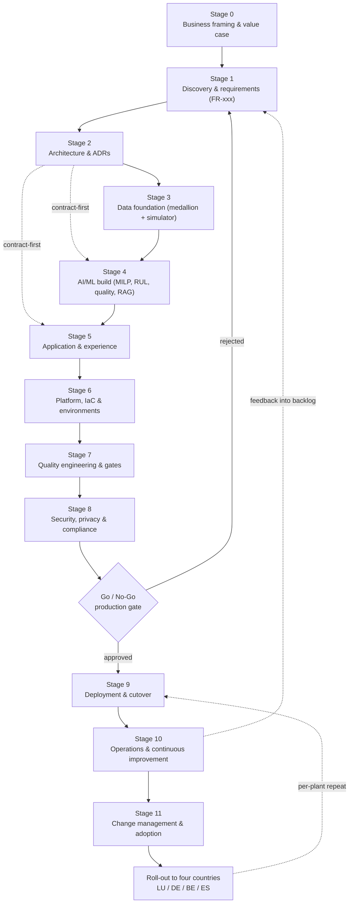
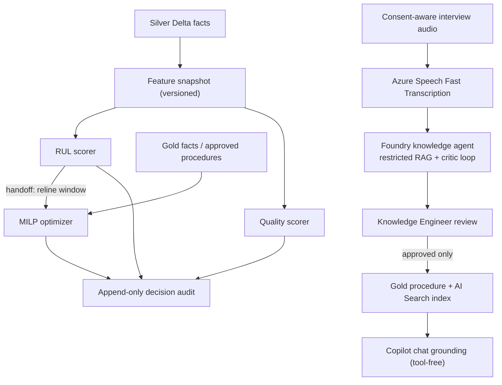
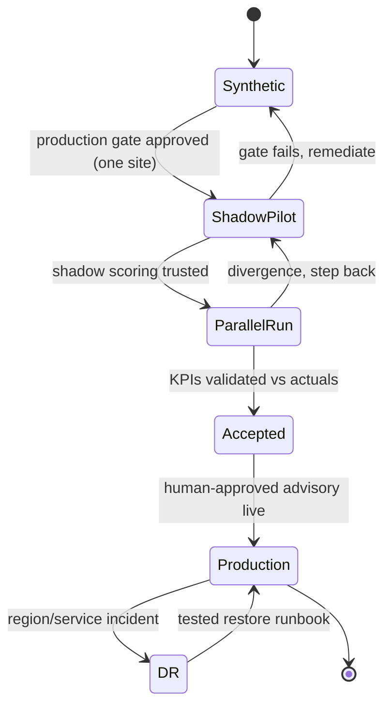
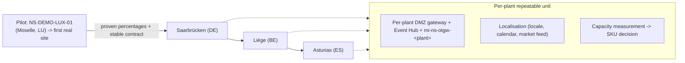
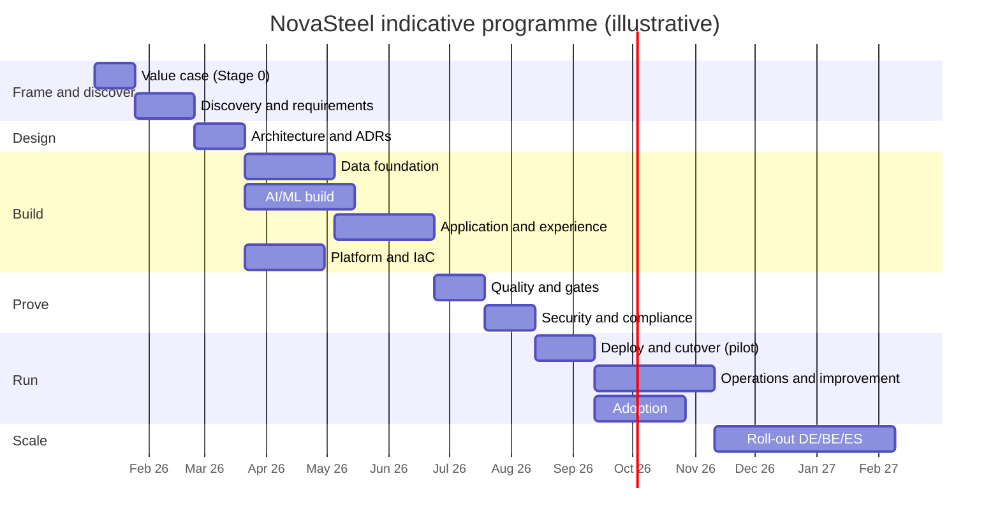
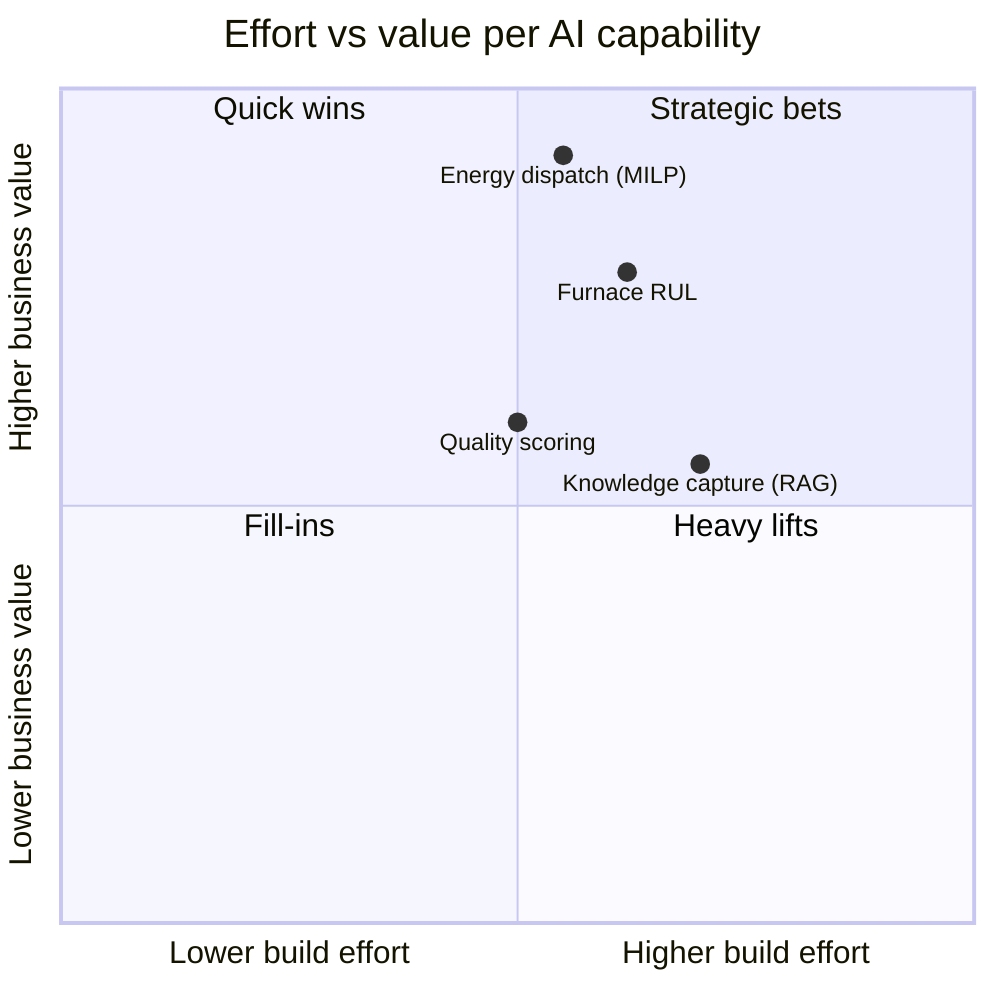
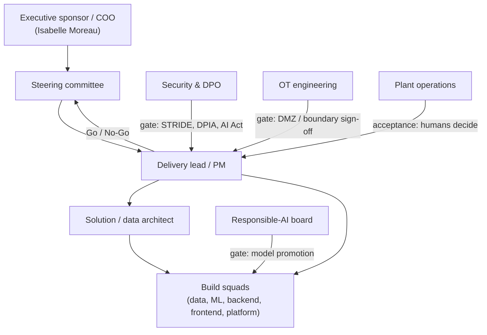

# NovaSteel — End-to-End Implementation Process

> **Purpose:** Explain the complete, ordered process an organisation actually follows to take the NovaSteel platform from *"we have a business problem"* to *"this advisory platform runs in production across four EU plants"* — who does what, in which order, with which gates, and against which concrete repository artifacts.
> **Status:** Authoritative process narrative v1.0 — grounded in the delivered repository baseline.
> **Last reviewed:** 2026-07-29
> **Audience:** Programme sponsor, delivery lead, solution/data architect, security & DPO, OT engineering, plant operations leadership, FinOps, and the AxelorMetal steering committee.
> **Scope discipline:** This document distinguishes throughout between 🔬 **EVIDENCE** (what this repository already demonstrates: a deterministic synthetic-data demo, local validation, and Bicep IaC deployed to Azure Sweden Central) and 🎯 **TARGET** (what a real, non-synthetic production rollout would additionally require). It never claims a production outcome that has not been measured.

---

## 1. Executive summary — the implementation in ten lines

1. **Frame the value case** on four AI capabilities — furnace-lining Remaining-Useful-Life (RUL), energy dispatch, in-line quality, and GenAI knowledge capture — against explicit KPI targets (−14% energy, −22% CO₂, ≥21-day lining warning, +8% high-grade yield).
2. **Elicit requirements** into the traceable `FR-xxx` catalogue, eight personas, and the non-negotiable constraints (EU residency, advisory-only, hard OT boundary).
3. **Derive the target architecture** and lock the sixteen decisions `ADR-001` … `ADR-016`, with Microsoft Fabric as the centre of gravity and a contract-first interface layer.
4. **Build the data foundation** — OT gateway → Event Hubs → Fabric Eventstream → Eventhouse/KQL + OneLake medallion — de-risked by a deterministic synthetic simulator (root seed `240725`).
5. **Build the AI/ML** — a PuLP/CBC MILP dispatcher, a physics-informed RUL regressor, a quality scorer, and grounded RAG on Azure AI Foundry with Content Safety — with a critic loop and human approval.
6. **Build the experience** — a Blazor WASM shell hosting a React/MUI/D3 Dockview analytics microfrontend, five locales, a tool-free Copilot chat.
7. **Provision the platform** via Bicep + Azure Policy + managed identity + GitHub OIDC, promoting `dev → test → demo → prod`; Fabric items are source-controlled.
8. **Prove quality** through a multi-layer test pyramid and 19 validation gates, then **deploy and cut over** in shadow → parallel → accepted stages, never writing to OT.
9. **Operate and improve** with OpenTelemetry, SLOs, model-drift monitoring, FinOps, and a feedback loop into the backlog.
10. **Adopt and scale** to four countries under *"AI advises, humans decide"* — the guardrail that makes the whole programme approvable.

### 1.1 Delivery lifecycle end to end

The rest of this document walks each stage: what is produced, who is accountable, which gate closes it, and — critically — which of the concrete repository folders and files (`services/`, `fabric/`, `infra/`, `contracts/`, `tests/`, `.github/workflows/`) already embody it. The **Appendix (§18)** is the full stage-to-artifact index.

---

## 2. Stage 0 — Business framing & value case

### 2.1 Problem statement

AxelorMetal is a Luxembourg-headquartered integrated steel producer operating blast furnaces and rolling mills across **four EU countries** (Luxembourg, Germany, Belgium, Spain). Its business challenge, taken verbatim from [`docs\usecase\usecase.md`](../../usecase/usecase.md), is five-fold: energy is ~35% of production cost with no real-time optimisation; CO₂ is under EU-ETS penalty pressure; furnace-lining wear is unpredictable and a catastrophic failure costs **~€8M per event**; high-grade automotive steel has quality-consistency issues; and skilled operators are retiring faster than their knowledge can be captured.

### 2.2 The four AI capabilities

| Capability | What it does | Authoritative compute | Primary persona |
|---|---|---|---|
| **Furnace-lining RUL** | Predicts refractory Remaining-Useful-Life from thermal signatures, targeting ≥21-day warning | Physics-informed OLS regression over heat-flux features (`scoring-worker`) | Reliability Engineer |
| **Energy dispatch** | Schedules energy-intensive processes around day-ahead/intraday spot prices | Deterministic PuLP/CBC MILP (`optimizer-worker`) | Energy Manager |
| **In-line quality** | Predicts first-pass high-grade yield and recommends bounded corrections | Quality-risk scorer with genealogy features (`scoring-worker`) | Quality Engineer |
| **GenAI knowledge capture** | Interviews operators, structures tacit knowledge into a searchable, reviewed procedure library | Azure Speech + Foundry Agent Service, grounded RAG with Content Safety (`knowledge-orchestrator`) | Knowledge Engineer/Admin |

### 2.3 Baselines, targets and the honesty contract

The four quantified outcomes and their KPI IDs (from [`docs\specs\solution-requirements.md`](../../specs/solution-requirements.md) §4) are the north star of the whole programme:

| # | Outcome | 🎯 Target | KPI ID | Illustrative baseline (§4.2) |
|---|---|---|---|---|
| 1 | Energy consumption per tonne | **−14%** | `KPI-ENE-01` | 19.5 GJ/t → ≈16.8 GJ/t |
| 2 | CO₂ emissions | **−22%** | `KPI-CO2-01` | 2.10 → ≈1.64 tCO₂/t |
| 3 | Lining-failure prediction | **≥21-day** warning | `KPI-FUR-01` | 0 days (unpredicted today) |
| 4 | High-grade yield | **+8%** | `KPI-QUA-01` | ~90% → ≈97% first-pass |

The programme runs under a strict **honesty contract** (operationalised in [`docs\operations\operations-and-cost.md`](../../operations/operations-and-cost.md) §8.5): every business figure is labelled 🎯 **TARGET** (a modelled, to-be-validated estimate) or 🔬 **EVIDENCE** (a measured output). The repository today produces the following **evidence** on one deterministic 24-hour scenario at one site (seed `240725`), which must never be confused with the annual four-country targets:

| Capability | 🔬 EVIDENCE (demonstrated) | 🎯 TARGET (annual pilot) |
|---|---|---|
| Energy dispatch | 7.25% whole-dispatch cost, 3.29% CO₂, 7.89% peak (56.0 → 51.58 MW) at a 280 EUR/MWh scarcity peak, 960 t conserved, zero hard-constraint violations | −14% cost, −22% CO₂ |
| Furnace RUL (`LUX-BF-01`) | P10/P50/P90 = 18.69 / 19.65 / 20.61 d, risk 0.8995 (HIGH), confidence 0.7846 (r²=0.88), wear slope −3.21 mm/day | ≥21-day fleet-mean warning |
| Quality | Bounded synthetic what-if 88% → 95%, no operational write | +8% first-pass yield |

> The flexible-load-only view (21.74% cost / 31.71% CO₂) is exposed transparently as `rawFlexibleCostPct` / `rawFlexibleCo2Pct` and is **deliberately never a headline** — its denominator counts only movable reheat load and would overstate CO₂ ~6×.

### 2.4 CAPEX/OPEX envelope and payback logic (🎯 TARGET, illustrative)

| Line | 🎯 TARGET (illustrative) | Basis |
|---|---|---|
| Build (one-off) | **€0.6M – €1.1M** | Foundation + three AI workloads + experience + compliance/change |
| Run (annual, pilot) | **€0.3M – €0.7M/yr** | Fabric capacity, Event Hubs, Data Science compute, Foundry tokens, apps, security, network |
| Energy benefit (O1) at scale | **~€24.5M/yr** | 1.0 Mt × €175/t × 14% (dominant lever) |
| Avoided failures (O3) | **~€3.2M/yr expected** | €8M × 1 event / 2.5 yr |
| **Payback** | **< 12 months** conservative; < 9 months base | Benefits vastly exceed build+run even after large haircuts |

The 🔬 **EVIDENCE** counterweight is the demo environment's *actual* cost: Fabric **F2** in Sweden Central, auto-paused nightly, ≈ **< €100/month** — which proves the mechanics, not the production cost model.

### 2.5 Go/No-Go criteria for Stage 0

- The four KPIs are agreed as **portfolio-wide** (all four sites), to be apportioned per-site during rollout (assumption A5).
- The honesty contract is accepted: pilots prove *percentages* on ~0.3 Mt before any multi-site commitment.
- The advisory-only boundary (no closed-loop OT control) is accepted as non-negotiable (scope item O1).
- A funded discovery is authorised. **Owner:** Executive sponsor (Isabelle Moreau, COO persona). **Artifact:** signed value case referencing `usecase.md` and `operations-and-cost.md` §8.5.8 (the CFO bridge).

---

## 3. Stage 1 — Discovery & requirements

### 3.1 Personas and journeys

Eight canonical personas plus two supporting technical roles are defined in [`docs\personas\personas-and-journeys.md`](../../personas/personas-and-journeys.md). Every functional requirement traces to the persona that acts on it.

| Persona | Name | Primary capability | Key screen(s) |
|---|---|---|---|
| Plant Manager | Marc Weber | Cross-domain command centre | `command-center/overview` |
| Furnace Operator | Elena Duarte | Thermal awareness, knowledge search | `furnace-health`, `knowledge-hub` |
| Energy Manager | Sofia Lindqvist | Dispatch optimisation | `energy-optimization/spot-price-schedule` |
| Maintenance/Reliability Engineer | Tomás Rossi | Lining RUL, work orders | `furnace-health/lining-forecast` |
| Quality Engineer | Jens Bakker | Genealogy, quality risk | `quality/batches` |
| Sustainability Officer | Amina Haddad | ETS/CO₂ ledger | `sustainability-compliance/emissions-ledger` |
| Knowledge Engineer/Admin | Pieter Claes | Interview review/approval | `knowledge-hub/procedures` |
| Executive (COO) | Isabelle Moreau | Portfolio roll-up, ROI, audit | `executive-overview` |
| *(support)* OT Systems Engineer | Rui Almeida | DMZ/gateway ownership | — |
| *(support)* Platform Ops | Nils Andersen | Capacity, device simulator | `platform-ops/capacity`, `device-operations/*` |

### 3.2 Requirement elicitation and the FR-xxx catalogue

Discovery converts business intent into the traceable requirement register (`solution-requirements.md` §8), grouped by domain:

| Group | Prefix | Coverage |
|---|---|---|
| Energy Dispatch | `FR-ENE-01…07` | Spot-price ingest, forecast, constrained schedule, rationale, accept/modify/reject, savings ledger |
| Furnace Lining | `FR-FUR-01…07` | Thermal ingest, RUL model, ≥21-day alert, uncertainty + drivers, synthetic work order, drift, escalation |
| Quality | `FR-QUA-01…05` | In-line risk, corrective what-if, root-cause, genealogy, precision/recall tracking |
| Knowledge Capture | `FR-KNW-01…08` | Interview agent, structuring, RAG search, human approval, versioning, gap report, DSR, grounded query |
| Platform & Reporting | `FR-PLT-01…06` | Unified data layer, RBAC dashboards, copilot, what-if, portfolio roll-up, notifications |
| Governance/Audit | `FR-GOV-01…05` | Immutable decision log, model cards, RBAC, auditor export, high-risk routing |
| Device Operations | `FR-DEV-01…07` | Fleet view, approach-band rule, sensor explorer, simulator state machine, incident injection |
| Privacy / GDPR Art. 17 | `FR-PRI-01…05` | Erasure, idempotency, audit tombstone, write-only subjectId, RAG PII redaction |

Non-functional requirements (`NFR-*`) fix performance (daily RUL re-scoring budget), availability, accessibility (WCAG 2.2 AA), and the demo-reliability envelope.

### 3.3 Constraints (the boundaries that shape everything downstream)

| Constraint | Statement | Source |
|---|---|---|
| **EU residency** | Sweden Central primary; Foundry Data Zone (EU); West Europe as *tested* contingency only | `deployment-topology.md` §2 |
| **Advisory-only / OT boundary** | No application, agent, Activator rule, pipeline, or demo control writes to a PLC, interlock, furnace, setpoint, or CMMS | Scope O1; `ADR-007` |
| **Synthetic-first** | The demonstration is 100% `SYNTHETIC` / `DEMO-NONPERSONAL`, isolated `NS-DEMO-*` namespaces | `ADR-008` |
| **Protected feeds** | All Python/NuGet restores go through Microsoft-protected CFS feeds; no public registry | `security-...md` §19 |
| **Consent** | Any real operator interview requires explicit GDPR consent before recording | assumption A3; `FR-KNW-07` |

### 3.4 Success metrics and RACI

Success is the four KPIs plus the six demo moments `DM-1…DM-6` (traceability matrix, `solution-requirements.md` §15) each mapping requirement ↔ persona ↔ KPI. A first-cut programme RACI:

| Activity | Sponsor/COO | Delivery lead | Solution architect | Data/ML lead | Security & DPO | OT engineering | Plant ops |
|---|---|---|---|---|---|---|---|
| Value case & funding | **A** | R | C | C | C | I | C |
| Requirement sign-off | A | **R** | C | C | C | C | C |
| Architecture & ADRs | I | C | **A/R** | C | C | C | I |
| Data foundation | I | C | C | **A/R** | C | R | I |
| AI/ML build | I | C | C | **A/R** | C | I | C |
| Security & compliance | C | C | C | C | **A/R** | C | I |
| OT/DMZ integration | I | C | C | I | C | **A/R** | C |
| Adoption & training | A | R | I | I | I | C | **R** |

*(R = responsible, A = accountable, C = consulted, I = informed.)*

**Gate:** requirement register baselined and RACI accepted before architecture is frozen.

---

## 4. Stage 2 — Architecture & decision records

### 4.1 How the target architecture was derived

The authoritative architecture ([`docs\architecture\solution-architecture.md`](../../architecture/solution-architecture.md)) begins by *reconciling* conflicting inputs (§2 of that document) — for example, resolving "C# front end" vs "React for a Python backend" into a **Blazor WASM shell hosting a React/MUI/D3 microfrontend** (`ADR-004`), and "native Event Hubs source" vs "no standing secrets" into an **identity-based relay to an Eventstream Custom Endpoint** (`ADR-005`). Each required business outcome is mapped to a concrete architecture response before any component is chosen.

### 4.2 The ADR process and why Fabric is the centre of gravity

Sixteen accepted decisions (`ADR-001 … ADR-016`) are the durable record. The load-bearing ones:

| ADR | Decision | Why it matters to the implementation |
|---|---|---|
| `ADR-001` | Fabric is the data & analytics core | No parallel data lake/BI store is built; Azure services exist only for integration/API/domain compute |
| `ADR-002` | Separate hot KQL from governed Delta | Eventhouse = hot investigation; Lakehouse Delta = governed history/ML/KPI |
| `ADR-003` | Sweden Central primary, EU-zone-aware AI | Residency posture; West Europe is tested contingency, not silent replica |
| `ADR-004` | Blazor shell + React/MUI/D3 MFE | Honours C# presentation requirement without pretending C# is the backend |
| `ADR-005` | Identity-based Custom Endpoint ingress | No standing SAS key; Contributor blast radius isolated to `RTI-Ingress` |
| `ADR-006` | Python authoritative for optimisation/scoring; Foundry is not the controller | LLM cannot be the only calculation or relax hard constraints |
| `ADR-007` | Human approval, no direct OT action | The single most important guardrail; any write proposal triggers full review |
| `ADR-008` | Demo is a separate deterministic slice | Synthetic namespaces never touch production |
| `ADR-011/012` | Copilot chat explains, never retrieves operational values; in-process, never persisted to Fabric | Keeps a free-text surface inside the data-protection envelope |
| `ADR-013` | Device simulator runs in-process inside the BFF | Avoids an eighth Container App |
| `ADR-014` | Two-level Dockview workspace with JSX-derived panels | Operator-arrangeable UI without layout drift |
| `ADR-016` | Event Hubs (not IoT Hub) is the ingress buffer | Refuses to acquire an inbound OT control plane the platform must not use |

### 4.3 Alternatives considered and rejected

The architecture explicitly rejects: a generic parallel data lake (superseded by Fabric, `ADR-001`); Azure IoT Hub as ingress (it is a cloud-to-device control plane the platform has promised not to build, `ADR-016`); Fabric's native SAS-keyed Event Hubs source (`ADR-005`); app-owns-data Power BI embedding as an authorization workaround (`ADR-010`); and any autonomous schedule/CMMS/OT write (`ADR-007`).

### 4.4 The contract-first approach

Before services are written, the interface layer under [`contracts\`](../../../contracts) is fixed, and everything else is generated or validated against it:

| Contract folder | Content | Consumers |
|---|---|---|
| [`contracts\openapi`](../../../contracts/openapi/bff-api-v1.yaml) | Versioned `/v1` BFF + Foundry tool OpenAPI | Generated clients (shell + tests), not hand DTOs |
| [`contracts\events`](../../../contracts/events/event-envelope.v1.schema.json) | JSON Schema: envelope, telemetry, quality, inference, alarm, quarantine | Simulator, `ingest-relay`, Fabric bronze |
| [`contracts\data`](../../../contracts/data/gold.v1.json) | Delta bronze/silver/gold + quarantine schema/KPI contracts | Fabric notebooks, semantic model |
| [`contracts\ui`](../../../contracts/ui/shell-interop.v1.schema.json) | Shell↔MFE interop schema + design tokens | Blazor shell, React MFE |

The local baseline was delivered in exactly this order: **contract → simulator/validators → Fabric item definitions → Python services → shell/MFE → integration tests** (`solution-architecture.md` §11).

**Gate:** ADRs accepted; contracts frozen at v1 with additive-only evolution rules.

---

## 5. Stage 3 — Data foundation

### 5.1 The canonical ingestion path

```mermaid
flowchart LR
  subgraph Site["Each plant — Purdue levels 0-3.5"]
    PLC["PLC / SCADA / historian"]
    DMZ["Industrial DMZ gateway<br>schema-validating, store-and-forward"]
    PLC -->|OPC UA / MQTT / historian export| DMZ
  end
  subgraph Ingress["Azure Sweden Central — integration"]
    EH["Event Hubs<br>raw replay buffer, private endpoint"]
    Relay["ingest-relay<br>managed-identity"]
    DMZ -->|AMQP over TLS, allow-listed egress| EH
    EH -->|Entra workload identity| Relay
  end
  subgraph Fabric["Microsoft Fabric — data core"]
    ES["Eventstream<br>es-ns-telemetry-v1"]
    KQL["Eventhouse / KQL<br>evh-ns-operations / kql-ns-operations"]
    Land["Landing Lakehouse<br>lh-ns-landing (bronze)"]
    Core["Core Lakehouse<br>lh-ns-core (silver + gold)"]
    Pipe["pl-ns-medallion<br>notebooks + Data Science"]
    Sem["sm-ns-operations<br>Direct Lake semantic model"]
    PBI["Power BI + RTI dashboard"]
    ES --> KQL
    ES --> Land
    Land --> Pipe --> Core
    Core --> Sem --> PBI
    KQL --> PBI
  end
  Relay -->|Custom Endpoint, Entra ID, no SAS| ES
  Batch["MES / ERP / LIMS / CMMS / market feed"] -->|Fabric pipelines / copy jobs| Land
```

Per `ADR-016`, the buffer is **Azure Event Hubs**, not IoT Hub; per `ADR-005`, `ingest-relay` publishes to the Eventstream **Custom Endpoint** with a workload identity, isolating the Contributor role into the `RTI-Ingress` workspace only.

### 5.2 The medallion model

The bronze→silver→gold contracts are fixed in `solution-architecture.md` §3.3 and implemented as Fabric notebooks:

| Zone | Tables (examples) | Rules | Implementing artifact |
|---|---|---|---|
| **Bronze** | `bronze_event_envelope`, `bronze_batch_*` | Immutable append, original `event_ts`/`ingest_ts`, seed when synthetic | [`fabric\notebooks\ns-bronze-to-silver.Notebook`](../../../fabric/notebooks/ns-bronze-to-silver.Notebook) |
| **Quarantine** | `quarantine_event`, `quarantine_batch` | Invalid units, missing key, duplicate, late/out-of-policy retained with reason, never silently repaired | `contracts\data\quarantine.v1.json` |
| **Silver** | `fact_telemetry`, `fact_energy_interval`, `fact_quality_measurement`, SCD2 dims | Canonical units, idempotent `event_id`, event-time SCD | `fabric\notebooks\ns-silver-to-gold.Notebook` |
| **Gold** | `fact_energy_daily`, `fact_furnace_rul`, `fact_dispatch_recommendation`, `fact_ai_decision_audit` | Star schema, stable KPI definitions, semantic-model source only | `sm-ns-operations.SemanticModel` |

Orchestration is the [`pl-ns-medallion.DataPipeline`](../../../fabric/pipelines/pl-ns-medallion.DataPipeline); data-quality gates run in `ns-validate-data-quality.Notebook`; lakehouses are created by `ns-initialize-lakehouses.Notebook`.

### 5.3 Why synthetic-first de-risks delivery

The deterministic synthetic simulator ([`docs\data\synthetic-data-and-simulators.md`](../../data/synthetic-data-and-simulators.md), code under [`simulator\`](../../../simulator)) is a **first-class workload, not a fixture dump**. It lets the entire data core, AI, and experience be built and validated with *zero* dependency on OT availability, market-data licences, or tenant provisioning — collapsing the critical path and removing the demo's single largest failure mode.

- **Root seed `240725`**; child seeds derived by `SHA-256(root | scenario | plant | asset | signal)`.
- **Scenario seeds** carry the demo's proof: `240726` (lining 21-day P50 warning for `HEARTH-SECTOR-07`, risk ≥0.80), `240727` (optimised schedule cheaper than baseline, equal tonnage, zero hard-constraint violations), `240728` (quality warning precedes first off-spec result).
- Every run records seed, scenario, generator version, config checksum, simulated clock, row counts, and truth-ledger checksum — a run is presentable only after contract, physics, and scenario assertions pass.
- The synthetic demo estate is four plants — `NS-DEMO-LUX-01` (Moselle Integrated Works, LU, the default demo site), `NS-DEMO-DE-01` (Saarbrücken), `NS-DEMO-BE-01` (Liège), `NS-DEMO-ES-01` (Asturias) — with a device-operations fleet (6 devices / 34 sensors at the LUX site; 17 devices / 91 sensors across the fleet).

### 5.4 Data contracts and schema evolution

The v1 event envelope (UUIDv7 `event_id`, UTC timestamps, per-source sequence, asset/plant IDs, correlation ID, schema version, classification, seed) is defined once in `contracts\events\event-envelope.v1.schema.json` and reused by streaming and batch. Consumers tolerate additive fields within a major version; removals or semantic changes require a new major contract.

**🎯 TARGET (production adds):** real historian/OPC-UA acquisition, licensed spot-price feeds (EPEX/ENTSO-E), a re-baselining data audit of 12–24 months of real data (assumption A4), and per-plant DMZ design sign-off.

**Gate:** medallion reconciliation green; quarantine behaviour proven; scenario assertions pass.

---

## 6. Stage 4 — AI/ML build

### 6.1 Model choices per capability

| Capability | Model / method | Key property | Service |
|---|---|---|---|
| Energy dispatch | **MILP** (PuLP modelling, CBC solver) | Deterministic, testable, cannot relax hard constraints | `optimizer-worker` |
| Furnace RUL | **Physics-informed OLS regression** over thermal/heat-flux features | Moves when the thermal input moves (slope −3.21 mm/day, r²=0.88) | `scoring-worker` |
| Quality | Quality-risk scorer with genealogy features | Bounded what-if only; no recipe/setpoint write | `scoring-worker` |
| Knowledge | **Grounded RAG** — hybrid BM25+cosine, RRF fusion, citation enforcement, PII redaction, dual Content-Safety screens | Declines when no grounded source (`FR-KNW-08`) | `knowledge-orchestrator` |

Per `ADR-006`, Python is authoritative for calculation; the Foundry agent only explains, retrieves, and calls restricted tools. AI-derived values share a common contract shape (`value`, `unit`, `confidence.{p10,p50,p90}`, `modelVersion`, `drivers`, `sourceRefs`) fixed in `solution-architecture.md` §5.3.

### 6.2 Feature engineering and evaluation

Physics-informed features (heat-flux slopes, cooling ΔT, residuals) come from silver facts via feature notebooks; ground-truth labels are generated from *hidden* simulator state, split by time and asset campaign to prevent leakage, with the final 20% of campaigns held out (`synthetic-data-and-simulators.md` §9). Evaluation asserts the model is *responsive* — a different schedule yields a different peak figure; a different thermal input yields a different RUL.

### 6.3 The critic loop, agent handoff, and guardrails

Guardrails: agents have **restricted tools** only (read/forecast/simulate + a separated `propose`; a `commit` endpoint independently validates a human-approval record and is disabled outside approved phases). The Copilot chat has **no tools at all** — grounding (screen profile of 25 concepts + a 36-term × 5-language glossary) is assembled by `knowledge-orchestrator` and passed in the prompt, so it explains *meaning* while the dashboard remains the only source of *values* (`ADR-011`). Online/web search is off by default and DPO-gated.

### 6.4 MLOps / model lifecycle (🎯 TARGET for production)

Model cards (`FR-GOV-02`), Fabric Data Science / MLflow experiments and registry, versioned promotion with RAI-board sign-off (`security-...md` §15), drift monitoring (`FR-FUR-06`, prediction-vs-outcome), and daily pilot scoring cadence (near-real-time is a measured later enhancement, not an MVP claim).

> 🔬 **EVIDENCE note:** the Fabric scoring notebook currently derives its P10/P90 band from fixed ×0.80/×1.30 multipliers, whereas the Python service derives it from fit residuals; the two paths are documented as disagreeing until aligned (root README, *Known limitations*). This is exactly the kind of gap the honesty contract surfaces rather than hides.

**Gate:** each model responsive, explainable, audited, and within its scoring budget.

---

## 7. Stage 5 — Application & experience

### 7.1 The frontend boundary

The experience is a **Blazor WebAssembly C# shell** ([`apps\portal-shell`](../../../apps/portal-shell)) hosting a **React/TypeScript MUI/D3 analytics microfrontend** ([`apps\analytics-mfe`](../../../apps/analytics-mfe)) — the `ADR-004` split. The shell owns MSAL sign-in, routing, locale/theme, and a typed host bridge; it never hands a workload credential to React. The React bundle is compiled into the Blazor `wwwroot` and shipped as one portal artifact.

### 7.2 Dockview workspace, i18n, accessibility, and Copilot

- **Two-level Dockview** (`ADR-014`): every analytics screen is an inner workspace whose panels are derived from the JSX it already declares; an outer dock keeps the Copilot chat mounted while the workspace changes. Layouts persist per screen and can be reset from the header.
- **Five locales** — EN/FR/DE/NL/ES — across all screens and the fictitious AxelorMetal corporate website (`company-website`, wave 4).
- **Accessibility** — WCAG 2.2 AA on primary routes, including a "View as table" fallback for every sensor chart (`FR-DEV-04`).
- **Copilot chat grounding** — tool-free, five languages, default tier a 5-series *mini* model at minimal reasoning effort, high tier a more capable 5-series deployment; falls back to a deterministic local agent when Foundry is unconfigured.

### 7.3 Screen catalogue

The full screen-by-screen specification is [`docs\ux\dashboard-specification.md`](../../ux/dashboard-specification.md). Persona routes (from the root README) include the command centre, energy dispatch, furnace health, quality genealogy, knowledge hub, sustainability ledger, executive overview, platform-ops capacity, device operations (fleet/sensors/simulator), dashboard collections, and the proof-of-execution/technical-requirements screens.

**Gate:** each of the eight personas completes its primary journey; accessibility scan clean; contract tests green against `contracts\ui`.

---

## 8. Stage 6 — Platform, IaC & environments

### 8.1 Bicep modules and policy

Control-plane infrastructure is Bicep under [`infra\bicep`](../../../infra/bicep/main.bicep), one module per concern:

| Concern | Module(s) |
|---|---|
| Identity & RBAC | `identity.bicep`, `roles.bicep` |
| Network & isolation | `network.bicep` (private endpoints, private DNS) |
| Secrets | `keyvault.bicep` |
| Ingress | `eventhubs.bicep` (`disableLocalAuth: true`, per-plant `mi-ns-otgw-<plant>` Data Sender on a single hub) |
| Compute | `containerapps.bicep` |
| AI | `foundry-agents.bicep`, `foundry-agent-capability-host.bicep`, `foundry-agent-rbac.bicep`, `foundry-speech.bicep`, `ai-search.bicep`, `cosmos.bicep`, `storage.bicep`, `appinsights-agent-access.bicep` |
| Data | `fabric-capacity.bicep` |
| Ops & cost | `monitoring.bicep`, `alerts.bicep`, `budget.bicep` (50/80/100% thresholds), `logicapp-capacity-lifecycle.bicep` |
| Governance | `policy-assignments.bicep` + [`infra\policy`](../../../infra/README.md) definitions (EU-location enforcement, no-local-auth, etc.) |

### 8.2 Managed identities, private endpoints, OIDC

No standing secrets anywhere: Azure-to-Azure auth is managed identity; CI-to-Azure auth is **GitHub OIDC / workload-identity federation** scoped to repo+environment (setup scripts `setup-github-oidc-*.ps1`). Public network access is disabled except documented service limitations; private endpoints and private DNS are used where each service supports them.

### 8.3 Environments, promotion, and Fabric-as-source

Four isolated environments — `dev`, `test`, `demo`, `prod` — are separate resource groups, identities, Fabric workspaces, data paths, and capacity assignments; **no** shortcut, connection, secret, or identity bridges `demo` and `prod` (`deployment-topology.md` §2.1). Fabric items are source-controlled under [`fabric\items`](../../../fabric) and deployed via `Deploy-FabricAssets.ps1` against a parameter file; a manifest ([`fabric\catalog\fabric-items.json`](../../../fabric/catalog/fabric-items.json)) declares which items automate and which are gated.

### 8.4 Capacity SKU strategy

Fabric capacity is **F2** initially, **F4** only after measured rehearsal load, **F8** as a pre-approved demo-day burst tier — never F64-for-licensing (`deployment-topology.md` §1). A nightly **01:00 Europe/Luxembourg** Logic App pauses non-production capacity; **production capacity is never auto-paused**.

> 🔬 **EVIDENCE:** the `demo` environment is *deployed* to Sweden Central (`rg-novasteelv3-demo-sc`), covering Container Apps, storage, networking, Key Vault, Event Hubs, and monitoring. 🎯 **TARGET:** Fabric/Speech/Eventstream/Power BI tenant resources and the Foundry Agent Service capability host remain gated (`infra/README.md`; root README *Known limitations*).

**Gate:** `validate.ps1` + `what-if.ps1` clean; deploy idempotent; policy compliant.

---

## 9. Stage 7 — Quality engineering

### 9.1 The test pyramid actually present

Tests live under [`tests\`](../../../tests) with layers mirroring the delivery boundaries:

| Layer | Folder | What it verifies |
|---|---|---|
| Contract | `tests/contract` | `contracts/openapi` + `contracts/events` honoured by producers/consumers |
| Simulator | `tests/simulator` | Determinism, physics plausibility, scenario/contract assertions |
| Backend & integration | `tests/backend`, `tests/integration` | Service logic + cross-service round trip |
| Device operations | `tests/devices` | Fleet, approach-band rule, simulator state machine |
| Knowledge & Copilot | `tests/knowledge` | Consent/review, grounded RAG, decline paths, PII redaction, Content Safety |
| Frontend | (analytics MFE suite) | Dockview panels, layout, localisation, component behaviour |
| Infrastructure | `tests/infra` | Bicep/policy static validation |
| E2E & presentation | `tests/e2e`, `tests/presentation` | Persona journeys, PPTX package integrity |

### 9.2 Validation gates, CI workflows, and reproducibility

The single local entry point is [`tools\validation\Validate-Repository.ps1`](../../../tools/validation/Validate-Repository.ps1), which runs the **19 repository validation gates** (protected feeds, contracts, simulator, BFF/integration, knowledge, frontend lint/test/build, portal restore/build, IaC, Fabric assets, PPTX, security, dependency integrity, SBOM) and writes evidence under `artifacts\validation\`.

🔬 **EVIDENCE (current baseline, root README):** **66/66** live BFF checks, **1,139** automated tests (874 Python, 265 frontend), **all 19** validation gates pass, plus **12/12** offline-fallback checks and three live-instance persona journeys.

CI/CD is OIDC-only under [`.github\workflows`](../../../.github/workflows):

| Workflow | Role |
|---|---|
| `ci.yml`, `ci-build-services.yml` | Lint/unit/contract build on every PR |
| `codeql.yml` | Static security analysis |
| `cd-infra.yml` | Bicep deploy (validate → what-if → deploy) |
| `cd-services.yml` | Container Apps service deploy |
| `cd-fabric-items.yml` | Source-controlled Fabric item deploy |
| `presentation.yml` | Marp deck regeneration + Pages publish |

Reproducibility is enforced by deterministic seeds, checksum-verified fixtures, evidence manifests (`artifacts\validation\final\evidence-manifest.json`), SBOM generation, and protected-feed pinning.

**Gate:** all 19 gates + full CI green; SBOM and evidence manifest produced.

---

## 10. Stage 8 — Security, privacy & compliance integration

### 10.1 Threat modelling (STRIDE)

Threat modelling is a design-phase discipline re-run whenever a data flow or trust boundary changes ([`docs\security\security-governance-and-threat-model.md`](../../security/security-governance-and-threat-model.md) §17). Trust boundaries run OT → DMZ (mTLS, protocol break) → Azure ingress (private endpoint) → Fabric/OneLake (workspace + OneLake roles) → human approval → downstream. Every STRIDE row (Spoofing → Elevation) maps to a numbered control, and the §21 security-acceptance gate requires each PR to state which STRIDE row it affects.

### 10.2 The hash-chained audit log

Every consequential AI output is append-only auditable (inputs/feature snapshot, model version, output, confidence, rationale, human decision, outcome — `FR-GOV-01`). The `bff-api` audit table is a **hash-chained** ledger; when `NOVASTEEL_TABLE_ENDPOINT` is configured it persists in Azure Table Storage and survives restart.

### 10.3 GDPR Art. 17 erasure

The erasure service (`knowledge-orchestrator`, `FR-PRI-*`, security §25.1) targets four stores: interview transcripts (hard delete), knowledge procedures (attribution pseudonymisation, body retained under Art. 17(3)), Copilot conversations (hard delete), and the audit chain (**tombstone, never mutated**). Execution is idempotent; the raw `subjectId` is write-only and never echoed — receipts carry only a salted SHA-256 `subjectPseudonym`; `verify()` returns `true` both before and after erasure.

### 10.4 EU AI Act and IEC 62443 positioning

The platform assumes a **"high-risk-adjacent"** posture (human oversight, logging, transparency) pending formal EU AI Act classification (assumption A8); Purdue-model OT segmentation and the industrial DMZ protocol break align with IEC 62443 zoning. Detailed regulatory analysis is maintained by the compliance workstream — this process document cross-links to it:

- [`..\compliance\README.md`](../compliance/README.md) — compliance overview and index
- [`..\compliance\eu-ai-act.md`](../compliance/eu-ai-act.md) — EU AI Act (Regulation (EU) 2024/1689) positioning
- [`..\compliance\eu-ets.md`](../compliance/eu-ets.md) — EU ETS / emissions reporting
- [`..\compliance\iec-62443.md`](../compliance/iec-62443.md) — industrial OT security zoning
- [`..\compliance\other-regulations.md`](../compliance/other-regulations.md) — GDPR and sector directives
- [`..\compliance\compliance-roadmap.md`](../compliance/compliance-roadmap.md) — the compliance gate roadmap

**Gate:** STRIDE current; audit chain verified; DPIA/DPO/Legal and EU AI Act classification obtained before *any* non-synthetic data (🎯 TARGET).

---

## 11. Stage 9 — Deployment & cutover

### 11.1 The gated deployment sequence

The authoritative sequence (`solution-architecture.md` §13; `deployment-topology.md` §8) is strictly ordered, each step with acceptance criteria:

1. **Foundation** — EU resource groups, capacity, workspaces, tags, budgets, Entra groups, private endpoints, Key Vault, monitoring, GitHub OIDC trust.
2. **Fabric core** — Eventstream, Eventhouse/KQL tables, landing/core Lakehouses, OneLake roles/labels, pipelines, notebooks, semantic model, RTI dashboard, Power BI reports.
3. **Ingress** — Event Hubs, relay, Custom Endpoint, simulator; prove identity, duplicate/late/quarantine, replay, no cross-workspace access.
4. **Domain services** — FastAPI/workers, query adapters, audit append path, optimizer, scoring, Foundry tool OpenAPI surface.
5. **Knowledge path** — Speech/Foundry, restricted storage/search, consent/review workflow, content filters, Prompt Shields, traces.
6. **Experience** — Blazor host/MFE, role-aware routes, contract tests, SSE/poll degradation, accessibility, Power BI internal embedding.
7. **Demo proof** — signed seed manifests, all scenario assertions, two consecutive 10-minute runs, every fallback level, no real action.
8. **Production gate** — DPO/legal classification, OT sign-off, model evaluation, capacity/region/connector proof, threat-model update, DR test, security acceptance.

### 11.2 Shadow-mode pilot, parallel run, acceptance, rollback, DR

Phasing (`solution-architecture.md` §1.2): **Demonstration** synthetic-only (today); **Phase 1** one site, read-only/shadow scoring with recommendations logged; **Phase 2+** four sites with human-approved CMMS/scheduling write-back *only after gates* — never autonomous OT control. Rollback is deployment-slot / IaC-reproducible; DR keeps Sweden Central primary with West Europe as a *tested* recovery target (no automatic Fabric failover, no silent replica; interview audio never cross-region-replicated without DPO approval).

**Gate:** two consecutive clean demo runs; production onboarding checklist signed.

---

## 12. Stage 10 — Operations & continuous improvement

### 12.1 Observability and SLOs

Observability is built in from day one (`implementation-guide.md` §13; `operations-and-cost.md` §2): OpenTelemetry traces, JSON logs with `correlation_id` on every line, four business-KPI metrics, and per-component signal sets (relay lag/queue depth, Eventstream/KQL rates, medallion row reconciliation, capacity CU/throttling, model drift, Foundry/STT outcomes). SLOs and a severity matrix (`operations-and-cost.md` §3, §6) govern incident response; demo soft-reset (<5 min) and hard-recovery (<20 min) runbooks exist.

### 12.2 Cost management, drift, and the feedback loop

FinOps runs a weekly/monthly cadence (`operations-and-cost.md` §10): Capacity Metrics review, F2→F4 decision procedure (measurement-driven, §8.4), reservations/right-sizing, budget alerts. Model-drift monitoring (`FR-FUR-06`) compares prediction vs outcome and feeds the backlog; the audit ledger is the join point for reconciling recommendation vs realised savings (the "savings ledger", `FR-ENE-06`). Operational learnings loop back into Stage 1 as new requirements.

**Gate:** SLOs met; cost within budget; drift within tolerance.

---

## 13. Stage 11 — Change management & adoption

The platform's central adoption principle is **"AI advises, humans decide"** — encoded architecturally (`ADR-007`: every safety-adjacent or financial decision has an explicit human-approval event; no OT write on any path). Adoption activities:

- **Operator training** using the deterministic simulator and injectable incidents (`FR-DEV-06`: hearth-lining degradation, cooling-water loss, sensor drift/dropout, energy-price spike, quality drift, edge-outage-recovery) for safe, repeatable practice.
- **The illustrated application guide** — a screenshot-driven, beginner-oriented walkthrough of every screen in EN/FR: [`docs\presentation\assets\app-guide\en\README.md`](../../presentation/assets/app-guide/en/README.md) — explaining, per screen, what it shows, why it exists, and which requirement it evidences.
- **Trust-building** — the Copilot chat shows its sources and reasoning tier; every AI value shows confidence bands and drivers; the synthetic banner and TARGET/EVIDENCE labelling keep claims honest.
- **Measuring adoption** — recommendation accept/modify/reject rates, procedure-library usage, and per-persona journey completion.

**Gate:** operators trained; recommendation-acceptance trending; support model in place.

---

## 14. Roll-out to four countries

The scaling model is **stable-contract, per-plant relay**: the same event/API contract and per-plant industrial-DMZ gateway + Event Hub authorization + scoped identity repeat at each site (`solution-architecture.md` §1.2, Phase 2+). Localisation covers locale, time zone (Europe/Luxembourg, /Berlin, /Brussels, /Madrid), and national market feeds. Capacity is re-measured per added load before any SKU change. Portfolio KPIs roll up site → line → asset with drill-down (`FR-PLT-05`). Each new plant re-enters Stage 9's production gate — the OT vendor/DMZ approval and market-data licensing are per-site.

---

## 15. Risks, dependencies and open gates

| Risk / dependency | Impact | Mitigation | Owner |
|---|---|---|---|
| Fabric SKU/quota not provisionable in target tenant | Blocks data core | Pre-verify capacity/region/quota; measure F2/F4 load first | Solution architect |
| Eventstream Custom Endpoint MI publishing unproven | Blocks ingress | Isolate Contributor to `RTI-Ingress`; test tenant switches/network path | Data lead |
| Foundry model/Agent Service/Speech availability & private-network | Blocks knowledge path | Verify model/Data-Zone/tool/quota immediately before deploy; capability host is immutable-once-created | Data/ML lead |
| Entra + Fabric item-level authz & Power BI RLS | Data exposure | OneLake security roles + labels + RLS; item-scoped adapters | Security |
| DPO/Legal/DPIA & EU AI Act classification | Legal blocker for real data | Obtain before any non-synthetic interview/production data (A3, A8) | DPO |
| OT vendor/site DMZ approval per plant | Blocks real telemetry | Confirm protocol/source/rate/boundary per site (A1) | OT engineering |
| Market-data licensing/freshness | Degrades dispatch | Licence EPEX/ENTSO-E; degrade to day-ahead-only if absent (A2) | Energy Manager |
| npm protected-feed resolution (`FE-000`) | Blocks frontend restore | Resolve approved internal npm proxy early — non-trivial lead time | Delivery lead |
| Scoring notebook vs service P10/P90 divergence | Inconsistent bands | Align notebook to residual-based band | Data/ML lead |
| Pilot % below target | Benefit shrinks | Prove percentages on ~0.3 Mt before scale; treat O3 as upside | Sponsor |

The consolidated production-gate list is `docs\README.md` *Remaining production gates* and `solution-architecture.md` §15.

---

## 16. Effort, team shape and timeline

### 16.1 Indicative multi-role team

| Role | Focus | Stages |
|---|---|---|
| Delivery lead / PM | Sequencing, gates, RACI | All |
| Solution/data architect | ADRs, Fabric, contracts | 2, 3, 6 |
| Data/ML engineers (2–3) | Medallion, MILP, RUL, RAG | 3, 4 |
| Backend engineers (2) | FastAPI BFF + workers | 4, 5 |
| Frontend engineers (2) | Blazor shell + React MFE | 5 |
| Platform/DevOps (1–2) | Bicep, OIDC, environments | 6, 9 |
| Security & DPO | STRIDE, GDPR, AI Act | 8 |
| OT systems engineer | DMZ/gateway per plant | 3, 9, 14 |
| QA / test | Pyramid + gates | 7 |
| Change/enablement | Training, adoption | 11 |

### 16.2 Indicative programme plan (🎯 TARGET)

### 16.3 Effort vs value per capability

Energy dispatch is the dominant value lever (energy is 35% of a large cost base); knowledge capture is the heaviest lift relative to near-term measurable value but is the strategic hedge against the retirement wave.

---

## 17. Organisation & approval flow

Three independent gate-holders can block progression regardless of engineering readiness: **Security & DPO** (data protection / AI Act), **OT engineering** (the physical boundary), and the **Responsible-AI board** (model promotion). This separation is what makes the advisory platform approvable at an operator of critical infrastructure.

---

## 18. Appendix — stage-to-artifact index

Every stage produced concrete, checkable artifacts in this repository. 🔬 = already delivered/evidenced; 🎯 = production adds.

| Stage | Concrete repository artifacts | State |
|---|---|---|
| 0 Business framing | [`docs\usecase\usecase.md`](../../usecase/usecase.md); [`operations-and-cost.md` §8.5](../../operations/operations-and-cost.md) | 🔬 |
| 1 Discovery & requirements | [`solution-requirements.md`](../../specs/solution-requirements.md); [`personas-and-journeys.md`](../../personas/personas-and-journeys.md) | 🔬 |
| 2 Architecture & ADRs | [`solution-architecture.md`](../../architecture/solution-architecture.md) (`ADR-001…016`); [`deployment-topology.md`](../../architecture/deployment-topology.md); [`fabric-brain-mapping.md`](../../architecture/fabric-brain-mapping.md); [`contracts\`](../../../contracts/openapi/bff-api-v1.yaml) | 🔬 |
| 3 Data foundation | [`synthetic-data-and-simulators.md`](../../data/synthetic-data-and-simulators.md); [`simulator\`](../../../simulator); `fabric\notebooks\ns-bronze-to-silver.Notebook`, `ns-silver-to-gold.Notebook`; [`pl-ns-medallion.DataPipeline`](../../../fabric/pipelines/pl-ns-medallion.DataPipeline); [`es-ns-telemetry-v1.Eventstream`](../../../fabric/items/es-ns-telemetry-v1.Eventstream); `services\ingest-relay` | 🔬 (real OT/market feeds 🎯) |
| 4 AI/ML build | `services\optimizer-worker`, `services\scoring-worker`, `services\knowledge-orchestrator`; [`api-contracts.md`](../../implementation/api-contracts.md) | 🔬 (MLflow registry/RAI promotion 🎯) |
| 5 Application & experience | [`apps\portal-shell`](../../../apps/portal-shell); [`apps\analytics-mfe`](../../../apps/analytics-mfe); [`dashboard-specification.md`](../../ux/dashboard-specification.md); `contracts\ui` | 🔬 |
| 6 Platform, IaC & environments | [`infra\bicep\main.bicep`](../../../infra/bicep/main.bicep) + modules; [`infra\README.md`](../../../infra/README.md); [`fabric\README.md`](../../../fabric/README.md); [`.azure\deployment-plan.md`](../../../.azure/deployment-plan.md) | 🔬 demo deployed (Fabric/Foundry tenant 🎯) |
| 7 Quality engineering | [`tests\`](../../../tests); [`Validate-Repository.ps1`](../../../tools/validation/Validate-Repository.ps1); [`.github\workflows`](../../../.github/workflows); [`validation-report.md`](../../validation-report.md); [`final-handoff.md`](../../../artifacts/final-handoff.md) | 🔬 19 gates, 1,139 tests |
| 8 Security & compliance | [`security-governance-and-threat-model.md`](../../security/security-governance-and-threat-model.md); [`..\compliance\README.md`](../compliance/README.md) and siblings | 🔬 (DPIA/AI-Act sign-off 🎯) |
| 9 Deployment & cutover | `solution-architecture.md` §13; `deployment-topology.md` §8; `cd-*.yml` workflows | 🔬 demo path (pilot/parallel 🎯) |
| 10 Operations | [`operations-and-cost.md`](../../operations/operations-and-cost.md); `infra\bicep\modules\monitoring.bicep`, `alerts.bicep`, `budget.bicep` | 🔬 (prod dashboards/tuning 🎯) |
| 11 Change & adoption | [`app-guide (EN)`](../../presentation/assets/app-guide/en/README.md); `services\device-simulator` (training incidents) | 🔬 |
| Roll-out | `deployment-topology.md` §2; per-plant `eventhubs.bicep` identities | 🎯 |

---

*This document describes the process; it does not itself authorise any production action. No OT control write exists on any path in any environment, in any stage implemented so far. All figures marked 🎯 TARGET are illustrative and must be validated with AxelorMetal actuals and an Azure pricing assessment before any commitment.*
