# NovaSteel 10-Minute Demo Runbook

## 1. Demo objective

In 10 minutes, show how NovaSteel connects live plant signals to a Fabric data core, predicts furnace-lining risk 21 days ahead, optimizes energy against spot prices, improves quality, and captures retiring-operator knowledge. Open with the AxelorMetal public website to establish the fictitious company narrative before entering the NovaSteel platform. Every screen and spoken claim must identify the data as synthetic and distinguish predictions from measured outcomes.

## 2. Audience personas and tabs

Keep these browser tabs open and ordered:

1. **AxelorMetal public site** — home/company/products/steel knowledge/contact context.
2. **Plant Manager / Executive** — fleet KPIs, output, energy, CO₂, quality yield, ROI, and audit roll-up.
3. **Reliability Engineer** — furnace thermal map, lining RUL, alert and work order.
4. **Energy Manager** — spot price, baseline/optimized dispatch, constraints and savings.
5. **Quality Engineer** — genealogy, process drift, predicted/measured quality.
6. **Operator Knowledge** — interview, STT transcript, extracted procedure draft.
7. **Fabric Core** — Eventstream, lakehouse/warehouse lineage, freshness, quarantine.
8. **Demo Control** — scenario, accelerated clock, health, reset and fallback controls.

Plus one device that is not a tab: the demo phone running the **Voice Procedure Capture** PWA for DM-5
([§4.5](#45-operator-voice-capture-beat-dm-5)). Keep it charged, unlocked, mirrored, and on the same consent
step you rehearsed.

Use a separate browser profile with notifications disabled, zoom at 90-100%, no personal bookmarks, and no production tenant tabs.

## 3. Preflight

### 3.1 One business day before

- Confirm the tenant/workspace contains synthetic data only.
- Run the deterministic scenarios with seeds `240726`, `240727`, and `240728`.
- Verify the data-contract report is green and expected KPI ranges match the scenario manifest.
- Confirm the 45-day history is loaded, semantic model refreshed, and persona pages render.
- Confirm the 21-day alert is initially hidden and appears only at its cue.
- Verify the optimization has a feasible cached result and zero hard-constraint violations.
- Test microphone permission, synthetic fallback audio, STT, and transcript extraction.
- Export offline fallbacks: dashboard screenshots/PDF, a 90-second screen recording, alert JSON, optimizer result JSON, transcript text, and procedure draft.
- Cache all needed pages in the demo browser and record direct URLs in presenter notes.
- Rehearse once in online mode and once with network disabled.

### 3.2 Thirty minutes before

- Connect power and wired network; disable sleep, OS notifications, chat pop-ups, and automatic updates.
- Set display resolution and duplicate/extend mode; keep speaker notes on the private screen.
- Open the seven tabs in order and authenticate.
- Reset the demo to `READY`, seed `240725`, accelerated clock paused.
- Confirm every tab shows **Synthetic demo data — not for operational control**.
- Confirm data freshness is green, event counts are increasing when briefly unpaused, then pause again.
- Verify local fallback files open without network access.
- Close terminals containing unrelated paths, tokens, or history.

If a Python-based simulator must be installed or restored, direct it only to the approved Microsoft-protected feed:

```powershell
$env:PIP_CONFIG_FILE = "$PWD\pip.conf"
$env:PIP_INDEX_URL = "https://packagefeedproxy.microsoft.io/pypi/simple"
$env:PIP_EXTRA_INDEX_URL = ""
& .\services\bff-api\.venv\Scripts\python.exe -m pip install `
    --disable-pip-version-check `
    -r .\services\bff-api\requirements.txt
```

The committed requirements are exact-version pins; they do not currently carry
hash entries, so do not add `--require-hashes` to this command. Never use public
PyPI, `--extra-index-url` to public registries, or an unapproved package source.
Ideally, install nothing on demo day.

### 3.3 Five minutes before

- Set scenario `demo-full`, root seed `240725`, speed `60x`.
- Confirm control status: `history=loaded`, `stream=paused`, `alert=armed`, `fallbacks=ready`.
- Open `/v1/meta` and note `demoClockShiftDays`: local fixtures are
  checksum-verified and rebased in memory by whole days so synthetic event times
  look current. If you need exact original fixture dates for a forensic replay,
  restart the BFF with `DEMO_CLOCK_REBASE=false` and say that timestamps are
  pinned to the fixture pack.
- Put the AxelorMetal website home tab on screen; keep the Plant Manager route ready for the handoff.
- Open the **Voice Procedure Capture** PWA on the demo phone, grant the microphone permission, and leave it
  parked on the consent step with the DM-5 fields already filled ([§4.5](#45-operator-voice-capture-beat-dm-5)).
- Start a visible 10-minute presenter timer.
- Have the reset operator and presenter agree on the hand signal for switching to fallback.

## 4. Minute-by-minute script

This order is binding with the six demo moments in [solution requirements](../specs/solution-requirements.md) and [personas and journeys](../personas/personas-and-journeys.md): a short AxelorMetal public-site setup, DM-1 (0:00–1:20), DM-2 (1:20–3:00, including the Dockview workspace beat), DM-3 (3:00–4:50, including the Copilot grounding beat), DM-4 (4:50–6:10), DM-5 (6:10–7:50), DM-6 (7:50–9:30), then a 30-second recap/buffer.

The script below was re-allocated from the earlier 15-minute plan to a **10-minute** budget by tightening every moment (roughly a two-thirds compression) rather than dropping any moment: all six DM moments and their proof points survive, only shorter. The most **cuttable** elements, in order, if you fall behind the clock, are: the optional Copilot grounding beat (04:10 slot), the Dockview workspace beat (§4.1), and the Help Assistant beat (§4.2) — none carries a headline claim. Protect DM-2 (energy numbers), DM-3 (RUL band) and DM-5 (knowledge governance); those are the moments the panel remembers.

Each row links to an annotated screen cue card in [§4.3](#43-annotated-screen-cue-cards): **S1**-**S16** for the desktop portal and **S20**-**S25** for the operator voice-capture PWA used in DM-5. The optional Device Operations beats carry their own cards (**S17**-**S19**) inline in [§11](#11-device-operations-demo-beats-wave-3). On every cue card a **red frame** marks the exact region to point at, and the numbered red tab states what that region proves. Rehearse against the cue cards, not from memory: the frames are the only things the audience must actually see.

| Time | Persona/tab and action | Presenter narrative | Proof point / fallback |
|---|---|---|---|
| 00:00-00:40 | **AxelorMetal public site**, then **Plant Manager**. Show `company-website/home`, name AxelorMetal as the fictitious steel producer, then enter the Command Center and select Moselle Integrated Works. [S1](#s1) · [S2](#s2) | “AxelorMetal is the plant operator; NovaSteel is the decision-support platform we are defending. NovaSteel unifies production, energy, emissions, quality, maintenance, and operator knowledge. Everything shown is deterministic synthetic data.” Point out energy at 35% of modeled production cost and the four target outcomes. | If the website is slow, use cached home/company screenshots; if the dashboard is slow, use cached fleet overview. Do not wait more than 10 seconds. |
| 00:40-01:20 | **Fabric Core**. Show live Eventstream input, bronze-to-silver-to-gold lineage, freshness, and contract status. [S3](#s3) | “Captors publish event-time data through the edge; Fabric retains the immutable envelope, deduplicates and normalizes units, and serves one governed semantic layer.” Point to synthetic labels, schema version, and quarantine count. | Use a pre-recorded 20-second Fabric clip or architecture screenshot; continue speaking while switching. |
| 01:20-02:00 | **Demo Control**, then **Energy Manager**. Unpause at 60x and show day-ahead price with the baseline dispatch. [S4](#s4) | “We are accelerating time, not fabricating UI updates. Sequence, event time, lineage, and seed remain reproducible. The urgent automotive coil is fixed; only eligible reheat batches have flexibility.” | If stream is unavailable, start local replay; otherwise use the cached `evening-scarcity` price curve. |
| 02:00-03:00 | **Energy Manager**. Run or reveal the optimized schedule and constraint report. Rearrange a supporting panel, maximize the schedule/chart group, then reset the layout from the header. [S5](#s5) | Compare baseline and optimized Gantt charts. "The optimizer preserves soak times, delivery commitments, equipment capacity, and planned tonnage. This is a simulated/shadow approval, not a production schedule write." Use the dock beat to show that the workspace adapts to the presenter/operator without changing the data. Show 7.25% modeled cost reduction, 7.89% peak reduction (56.0→51.58 MW), and 3.29% CO₂ reduction (whole-dispatch basis). Tonnage conserved at 960 t. | Reveal cached feasible solution after 5 seconds; show the saved result and constraint table. If the panel drag is awkward, use maximize + reset only. |
| 03:00-03:40 | **Reliability Engineer**. Open `LUX-BF-01`, hearth sector 07 thermal map. [S6](#s6) | “A localized warm zone is developing. Neighboring thermocouples, cooling-water ΔT, and heat-flux residual agree, so this is unlike a single bad sensor.” | Static thermal-map sequence has healthy, emerging, and degraded frames. |
| 03:40-04:10 | Continue the reliability trend and trigger the threshold. [S6](#s6) · [S7](#s7) | Show 45-day thermal history compressed into seconds. Point to rising 6-hour slope and slower post-tap cooling; avoid claiming certainty. | Use cached animated chart; manually advance three frames if animation stalls. |
| 04:10-04:30 | *(optional beat — cut first if behind)* Open **Copilot Chat** from the header (docks right) and ask **“What is the risk?”** without naming the metric. [S8](#s8) | “I never said which risk. The assistant sees that I am on Furnace Health, so it answers on lining risk, defines it, and shows the sources it used — a glossary entry and this screen. It has no tools and no database access: it explains what you are looking at, it does not fetch new numbers.” Point at the green shield and say history is in-process, never written to Fabric. | If the chat errors, the question is restored in the composer — retype and resend once. If Foundry is unreachable it answers locally from the same grounding and the sources are identical; say so rather than hiding it. |
| 04:30-04:50 | Open the alert drawer, acknowledge it, and create/link the synthetic work-order record. [S7](#s7) · [S9](#s9) | "The model estimates P50 remaining life at **~20 days** with a tight P10/P90 band (18.7–20.6). The engineer remains accountable: the platform recommends verification and records a synthetic work order; it does not actuate the furnace." | Open saved alert JSON and pre-created `WO-DEMO-LUX-1042`; ensure risk ≥0.80 and confidence ≥0.70. |
| 04:50-05:20 | **Quality Engineer**. Open `NS-AUTO-DP780` genealogy and drift panel. [S10](#s10) | “Coiling temperature and force balance are drifting together. The model warns before the first off-spec lab result and traces the affected heat, slab, coil, and process settings.” | Cached coil `COIL-LUX-260725-017` has complete genealogy. |
| 05:20-06:10 | Run the bounded quality what-if. [S11](#s11) | “A bounded what-if returns predicted first-pass yield from about 88% to 95%—roughly the target 8% relative improvement—without changing the grade recipe.” Toggle predicted versus measured labels; no setpoint is written. | Use cached what-if result; do not imply an automatic control write-back. |
| 06:10-06:50 | **Operator Knowledge**, on a phone. Open the **Voice Procedure Capture** PWA, complete the consent step, then record — or tap **Load the sample interview** — the answer to: “What do you check when hearth sector temperature rises but cooling flow appears normal?” See [§4.5](#45-operator-voice-capture-beat-dm-5). [S20](#s20) · [S21](#s21) · [S22](#s22) · [S23](#s23) | “Knowledge capture has to start where the knowledge is: on the floor, on a phone, in the operator’s own language. Explicit GDPR consent and a retention period are set *before* the recorder unlocks, and nothing leaves the device until the operator plays the audio back and confirms it.” State that the operator persona, the voice and the audio are synthetic. | If the microphone is blocked or the room is noisy, tap **Load the sample interview** — that is the rehearsed path and uses the committed `blast-furnace-hearth-cooling-en.wav`. If the PWA cannot reach the BFF, narrate over cue cards S20-S23 and continue on the desktop Knowledge Hub. |
| 06:50-07:30 | Show the returned transcript — suggested domain, confidentiality class, speaker labels, per-segment confidence — then **Save to Knowledge Hub**. [S24](#s24) · [S12](#s12) | Highlight trigger, observations, checks, rationale, cautions, and source citations. “Speech-to-text and extraction keep every segment cited and confidence-scored, so a reviewer can trace each sentence back to the audio.” The draft procedure is the same content: verify neighboring sensors, compare water ΔT, inspect flow restriction, escalate for ultrasound. | Load pre-extracted fact JSON. Keep status `DRAFT — EXPERT REVIEW REQUIRED`. |
| 07:30-07:50 | Create the draft (`PROC-IV-*`, `IN_REVIEW`), then show the reviewer boundary on the desktop Knowledge Hub. [S25](#s25) · [S12](#s12) | “The operator can contribute and submit, but cannot publish — the app says so on screen before the draft even exists. A Knowledge Publisher reviews, edits and approves a version before it enters retrieval.” | Use the saved approval-queue view; do not simulate an unreviewed procedure as published. |
| 07:50-08:40 | **Plant Manager / Sustainability view**. Show CO₂ trajectory, ETS exposure, and the energy-decision lineage. [S13](#s13) | “The carbon target and any financial claim remain targets. Here the semantic model rolls up synthetic emissions and connects a recommendation to its evidence.” | Use the cached sustainability/ETS report or the optional internal Power BI report tab. |
| 08:40-09:30 | **Executive / audit view**. Show portfolio targets, ROI roll-up, and one append-only decision record. [S14](#s14) · [S15](#s15) | “Every recommendation links inputs, model/version, confidence, human decision, and outcome. The 14/22/21/8 figures are targets; the screen is synthetic evidence of traceability.” | Use exported audit JSON/PDF and cached board-report view. |
| 09:30-10:00 | **Plant Manager**, then briefly **Fabric Core**. [S2](#s2) · [S3](#s3) | Recap: “One Fabric core connects streaming operations, governed history, models, decisions, and human knowledge.” End on lineage/freshness and the next-step invitation. | If any tab is unstable, finish on cached summary slide. Stop at 10:00 rather than debugging live. |

### 4.1 Dockview workspace beat

Use this as a 30–45 second insert during DM-2, or during Device Operations if the energy screen is already crowded:

1. Drag a secondary panel beside or below the main chart and say the arrangement is per screen.
2. Click the tab-bar maximize button on the chart or table group; restore it.
3. Close a genuinely closable detail panel only if one is open; point out that structural KPI/table panels have no X.
4. Click **Reset layout** in the dashboard header to return to the default arrangement.

Do not imply the dock changes authorization or model outputs. It is a workspace affordance: panels stay mounted, layouts persist in browser `localStorage`, and reset is the recovery path.

### 4.2 Help Assistant beat (~40 seconds)

Use this as an insert during DM-2 (after the Energy Manager KPIs are visible), or during DM-1 if you prefer to demonstrate it on the Plant Manager fleet overview. In the tightened 10-minute script the recap/buffer is only ~0:30, so this beat is **optional** — run it only if you are on or ahead of the clock, borrowing ~20 seconds from the recap (reducing it to ~0:10). If the dock beat is already in DM-2 and the slot feels crowded, move this beat to DM-3 (after the Reliability Engineer screen loads) instead.

1. Click the **?** toggle (question-mark icon) in the dashboard header. The cursor becomes a help cursor and a blue "Explain mode" banner appears at the top.
2. Click any KPI tile — for example **Energy intensity** or **Lining risk**. A floating popup appears next to it with a plain-language explanation: what the number is, why it matters in a steel plant, and how to use it on this screen.
3. Click a second element — a chart or a table row — to show that the popup replaces itself without leaving explain mode.
4. Press **Esc** or click the close button on the banner to exit.

**Say:** "You are not metallurgists, and neither is a new plant manager on day one. This mode teaches both the application and the steel process behind it. It covers 87 topics in five languages, and we achieved it with almost no screen edits — the topics resolve from the DOM at click time because the shared primitives already declare themselves."

**Point being made:** The platform is self-teaching for non-expert users, which matters for a jury that does not know the steel domain. The engineering story is that topic resolution is DOM-based (`resolveHelpTarget.ts`), not a per-screen registry: three shared primitives (`KpiCard`, `ChartContainer`, `DataTable`) plus structural detection of dock tabs and table rows mean any new screen built from those components is explainable for free.

**Fallback:** If the popup does not appear on the first click, click a KPI tile (they always resolve). If explain mode fails to activate at all, say: "The help system resolves topics from the DOM — here is the popup from a rehearsal screenshot," show the cached help-popup screenshot from the fallback pack, and continue. The annotated cue card for this beat is [S16](#s16).

**Optional aside (10 seconds, only if timing allows and a juror asks "how does steel get made?"):** While on the AxelorMetal corporate website tab (Steel Knowledge page), point at the process diagrams and say: "These three diagrams map the entire steelmaking route. Click one to magnify it to 400 %." Do not open the lightbox unless a juror explicitly asks — it is slower to close than it is worth in a timed demo.

### 4.3 Annotated screen cue cards

One card per beat. The **red frame** is the only thing you must point at on that screen; the numbered red tab is the claim that frame supports. Everything outside a frame is context — do not narrate it.

Sources are the committed application captures in `docs/presentation/assets/app-guide/screenshots/`; the annotated derivatives are regenerated with `python tools\presentation\annotate_demo_screenshots.py` (see [§4.4](#44-regenerating-the-cue-cards)). All captures carry the **Synthetic demo data — not for operational control** banner; keep it visible on the projector.

<a id="s1"></a>

#### S1 — AxelorMetal public site (00:00-00:40)

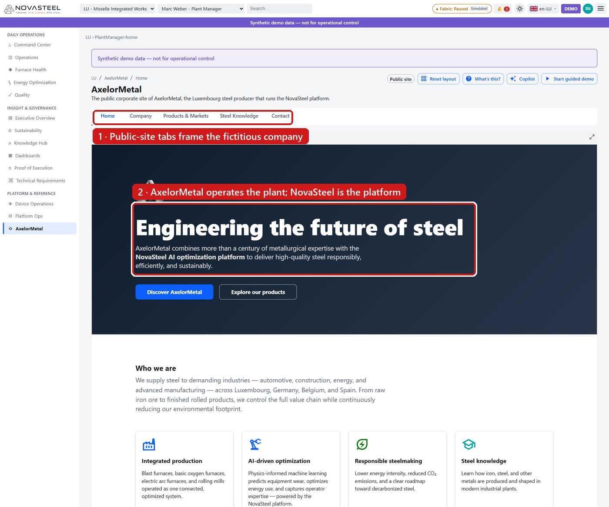

1. Public-site tabs (Home, Company, Products & Markets, Steel Knowledge, Contact) — the fictitious company frame.
2. Hero statement — AxelorMetal operates the plant, NovaSteel is the platform being defended.

<a id="s2"></a>

#### S2 — Command Center (00:00-00:40 and 09:30-10:00)

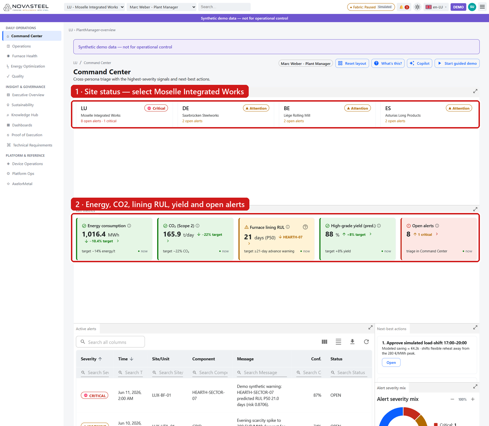

1. Site status strip — select **LU · Moselle Integrated Works** (`Critical`, 8 open alerts · 1 critical).
2. KPI band — energy consumption, CO₂ Scope 2, furnace lining RUL (21 d P50), high-grade yield, open alerts. This is the recap screen at 09:30 as well.

<a id="s3"></a>

#### S3 — Fabric core and edge boundary (00:40-01:20 and 09:30-10:00)

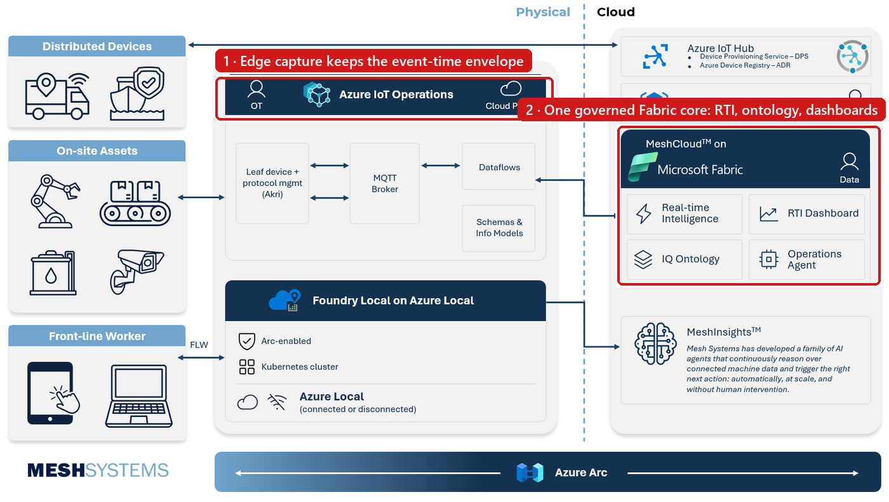

1. Edge capture — the event-time envelope is preserved before anything reaches the cloud.
2. One governed Fabric core — Real-Time Intelligence, RTI dashboard, IQ ontology, operations agent.

<a id="s4"></a>

#### S4 — Spot price and baseline dispatch (01:20-02:00)

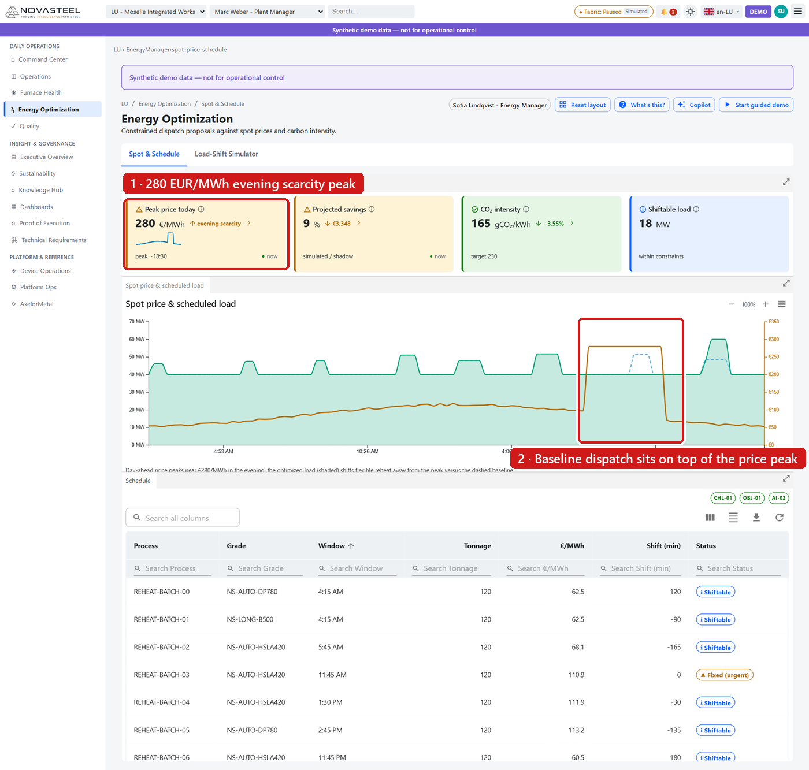

1. **Peak price today 280 €/MWh**, flagged `evening scarcity`.
2. The evening interval on the price/load chart — baseline dispatch still sits on top of the peak.

<a id="s5"></a>

#### S5 — Optimized dispatch (02:00-03:00)

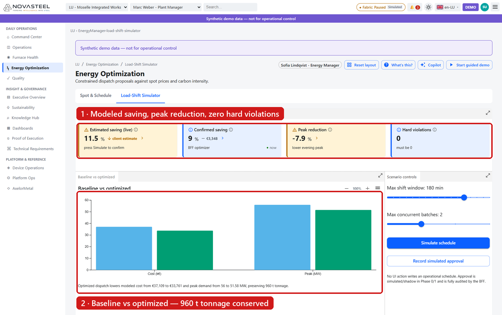

1. Savings KPIs — estimated/confirmed saving, peak reduction, and **Hard violations 0**. Say the number of hard violations out loud; it is the constraint claim.
2. Baseline versus optimized bars plus the caption: cost €37,109 → €33,761, peak 56 → 51.58 MW, **960 t tonnage conserved**.

<a id="s6"></a>

#### S6 — Thermal explorer (03:00-04:10)

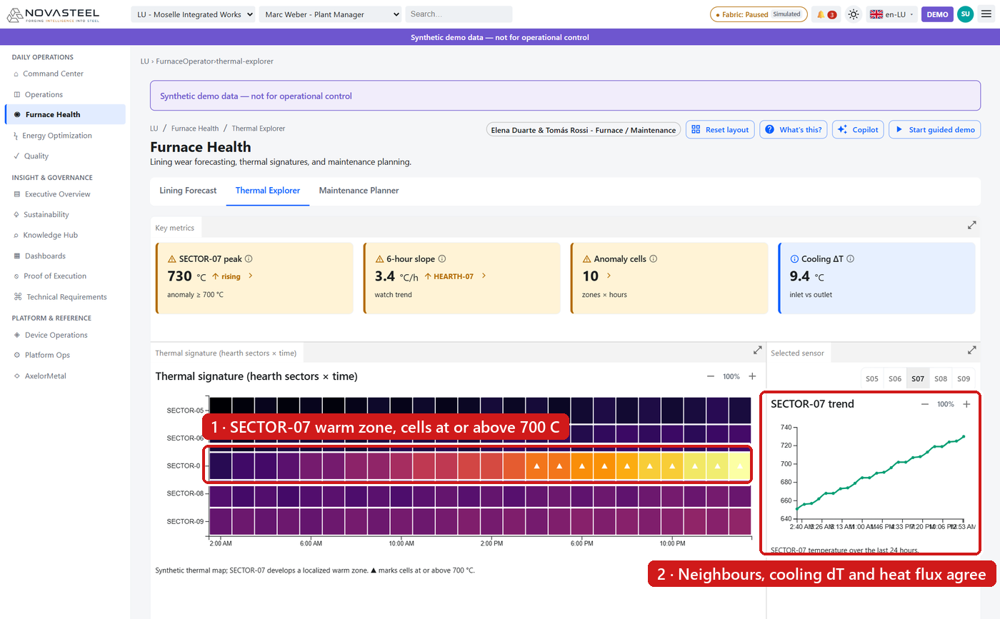

1. The SECTOR-07 row of the hearth heat map — ▲ marks cells at or above 700 °C.
2. The SECTOR-07 trend panel — neighbouring thermocouples, cooling-water ΔT and heat-flux residual agree, so this is unlike a single failing sensor.

<a id="s7"></a>

#### S7 — Lining forecast and RUL band (03:40-04:50)

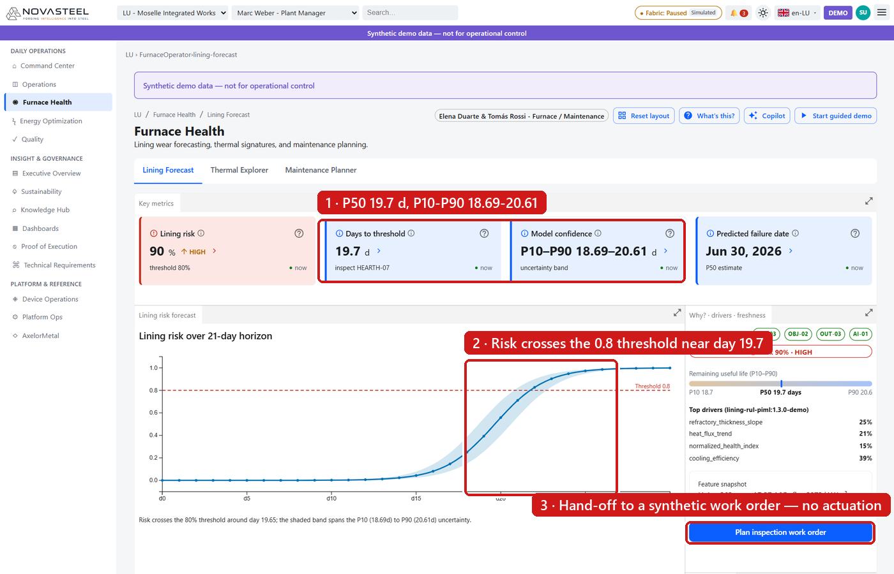

1. **Days to threshold 19.7 d** and **P10–P90 18.69–20.61** — quote the band, never a single date.
2. Where the risk curve crosses the **0.8** threshold, with the P10–P90 shading around it.
3. **Plan inspection work order** — the hand-off is a synthetic record; the platform never actuates the furnace.

<a id="s8"></a>

#### S8 — Copilot grounding (04:10-04:30, optional)

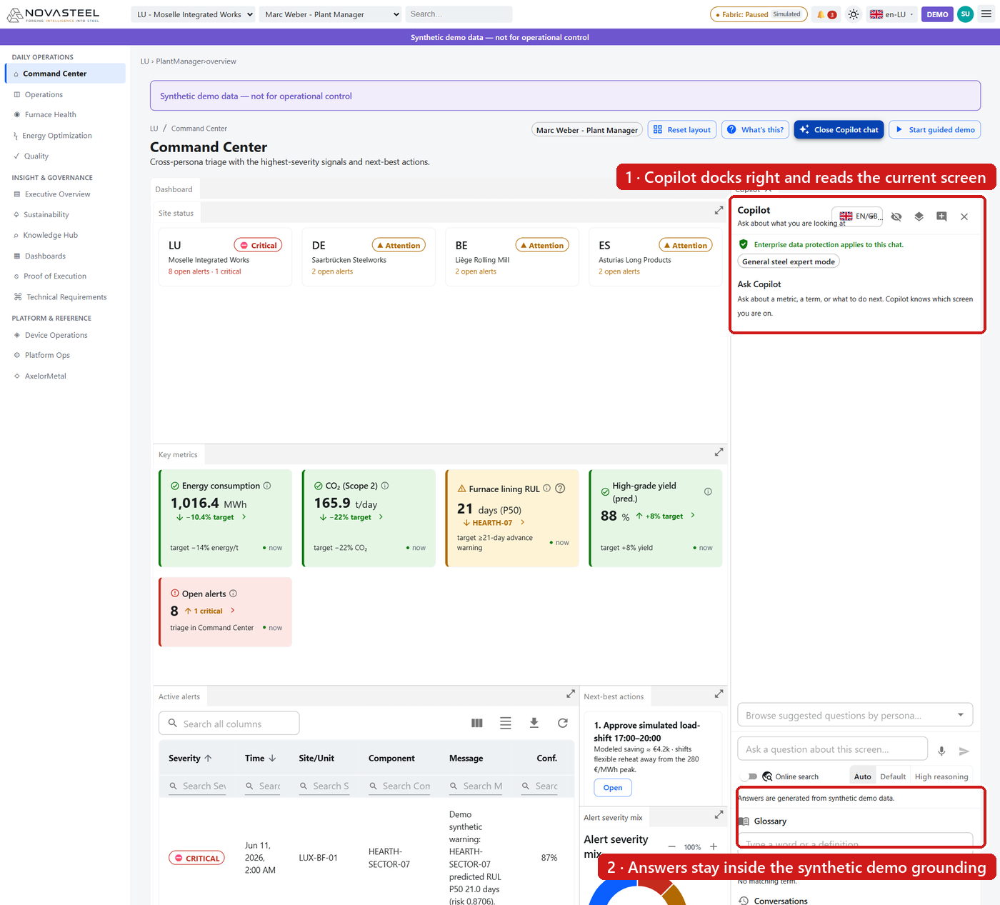

1. Copilot docks to the right and answers about the screen you are on — enterprise data protection is stated in the panel itself.
2. The grounding footer and glossary — answers come from synthetic demo data and the screen context, with no tool calls and no database access.

<a id="s9"></a>

#### S9 — Maintenance planner and work order (04:30-04:50)

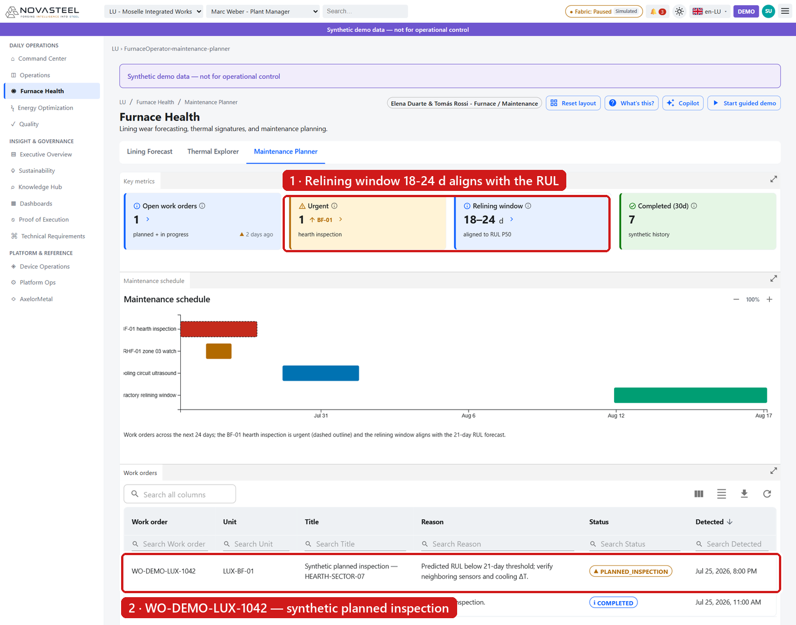

1. **Urgent 1** and **Relining window 18–24 d**, aligned to the RUL P50.
2. `WO-DEMO-LUX-1042` — synthetic planned inspection on `LUX-BF-01 / HEARTH-SECTOR-07`, status `PLANNED_INSPECTION`.

<a id="s10"></a>

#### S10 — Quality genealogy (04:50-05:20)

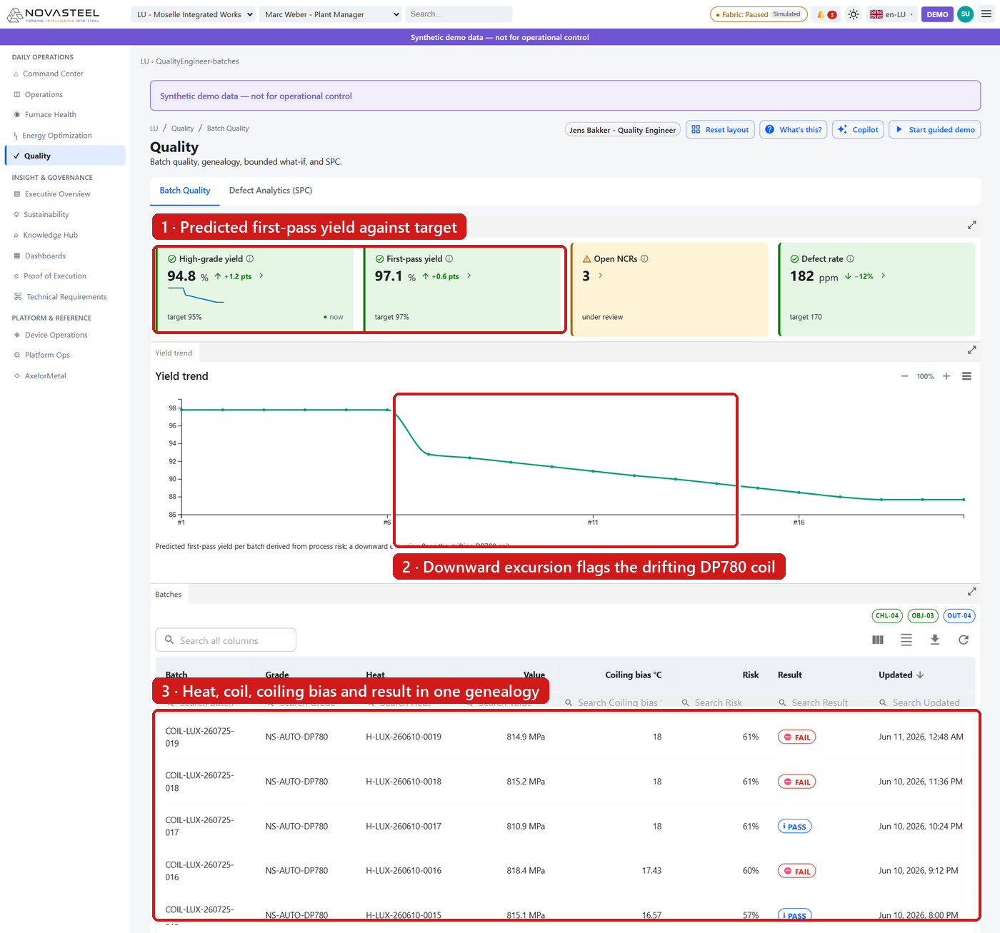

1. High-grade yield and predicted first-pass yield against their targets.
2. The downward excursion in the yield trend — the model warns before the first off-spec lab result.
3. The batch table — heat, coil, coiling bias, risk and result in one genealogy (`COIL-LUX-260725-017`, `NS-AUTO-DP780`).

<a id="s11"></a>

#### S11 — Defect analytics / SPC (05:20-06:10)

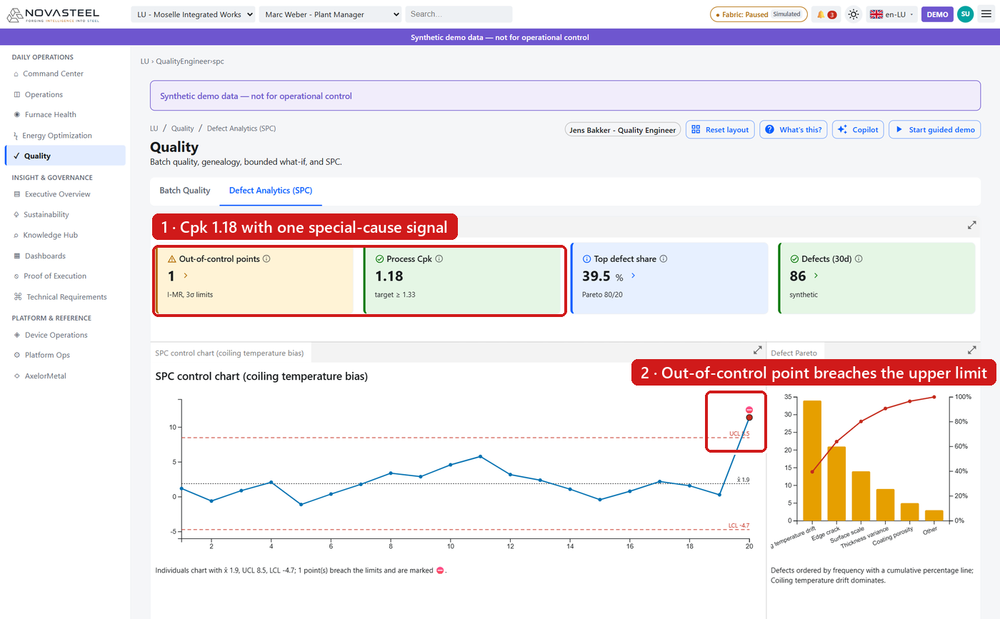

1. **Process Cpk 1.18** against a target of ≥1.33, with one out-of-control point.
2. The point breaching the upper control limit — coiling-temperature drift dominates the Pareto beside it.

<a id="s12"></a>

#### S12 — Knowledge capture and reviewer gate (06:10-07:50)

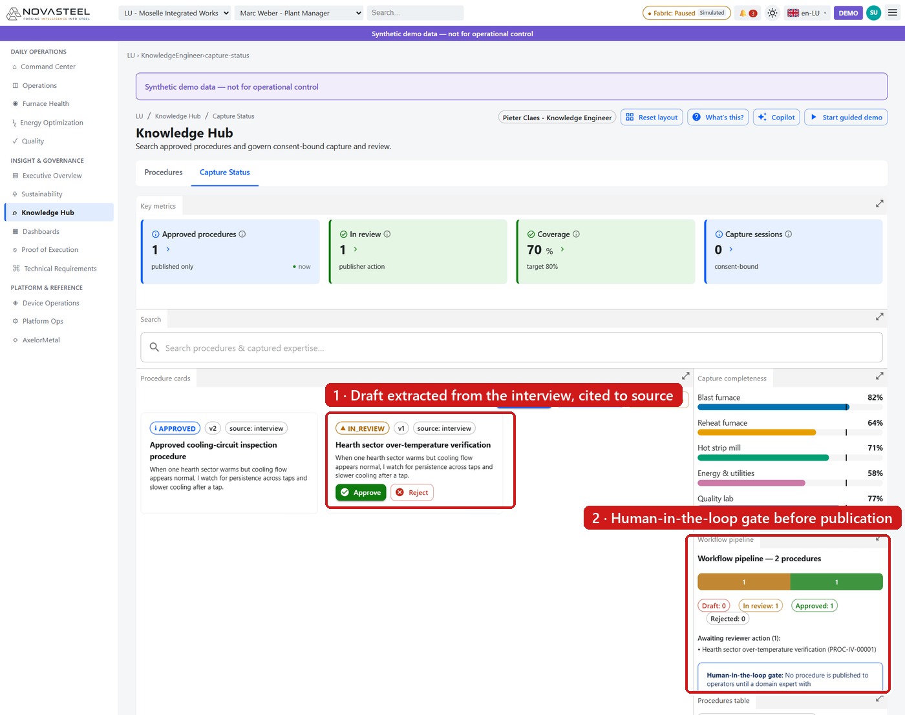

1. The `IN_REVIEW` card — extracted from the interview, `source: interview`, with **Approve / Reject** actions. It stays a draft.
2. The workflow pipeline and the **Human-in-the-loop gate**: no procedure is published to operators until a domain expert approves it.

<a id="s13"></a>

#### S13 — Sustainability and ETS exposure (07:50-08:40)

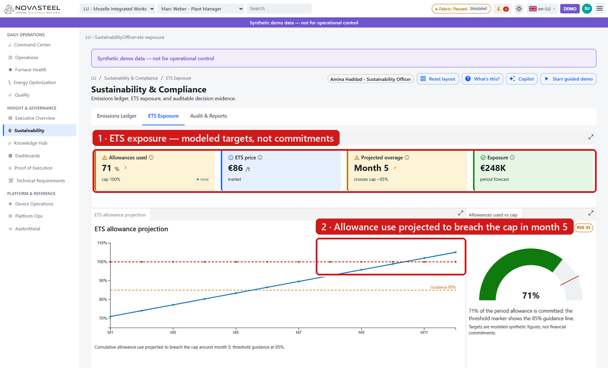

1. Allowances used, ETS price, projected overage and exposure — modeled synthetic figures, not financial commitments.
2. Where cumulative allowance use is projected to breach the cap (around month 5), against the 85% guidance line.

<a id="s14"></a>

#### S14 — Audit and decision evidence (08:40-09:30)

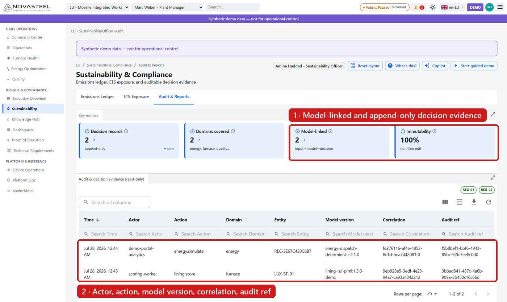

1. **Model-linked** and **Immutability 100%** — input → model → decision, append-only, no inline edit.
2. A single decision record: time, actor, action, domain, entity, model version, correlation id and audit ref.

<a id="s15"></a>

#### S15 — Executive overview (08:40-09:30)

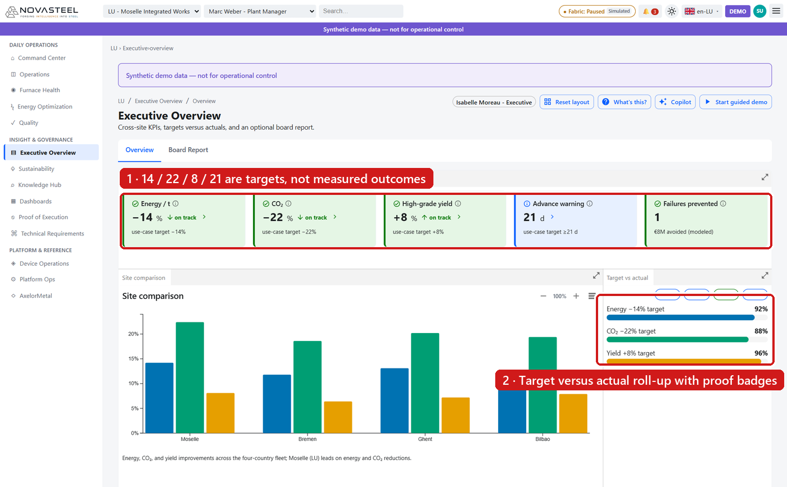

1. −14% energy, −22% CO₂, +8% yield, 21-day advance warning — say **targets**, not measured outcomes.
2. The target-versus-actual roll-up with its `OUT-0x` proof badges.

<a id="s16"></a>

#### S16 — Help assistant / explain mode (§4.2 insert)

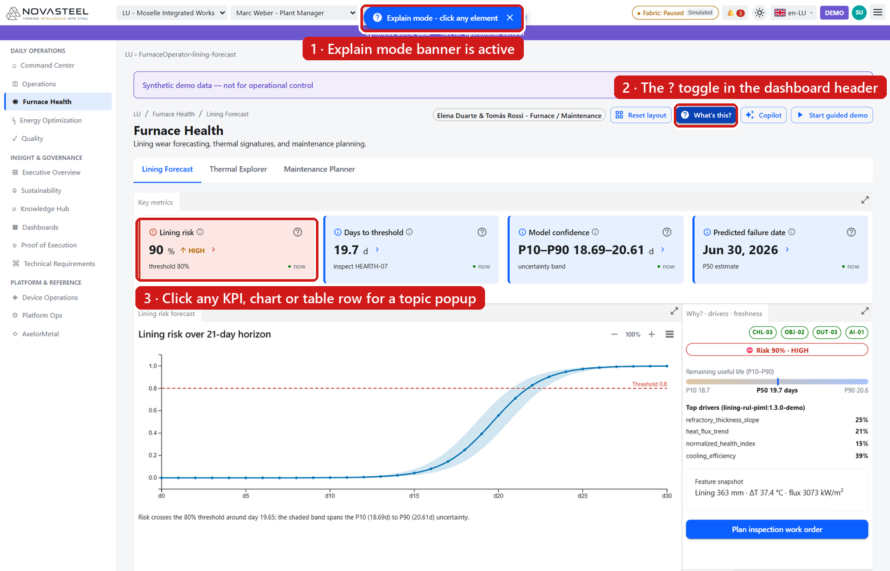

1. The blue **Explain mode — click any element** banner confirms the mode is active.
2. The **What's this?** toggle in the dashboard header is what turned it on.
3. Any KPI tile, chart or table row resolves a topic popup — KPI tiles always resolve, so click one first.

The next six cards are the **operator voice-capture PWA** (§4.5). They are portrait phone screens and the app is hardcoded dark, so they look deliberately different from the desktop cards above.

<a id="s20"></a>

#### S20 — Capture consent (06:10-06:50)

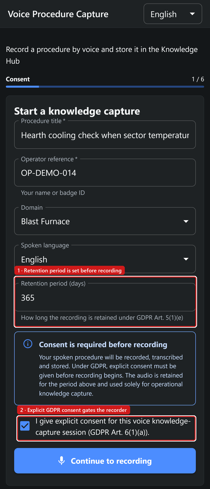

1. **Retention period (days)** is chosen before recording, not afterwards — GDPR Art. 5(1)(e) storage limitation is a field on the form.
2. The explicit consent checkbox (GDPR Art. 6(1)(a)) gates the recorder: **Continue to recording** does nothing until it is ticked.

<a id="s21"></a>

#### S21 — Recorder, idle (06:10-06:50)

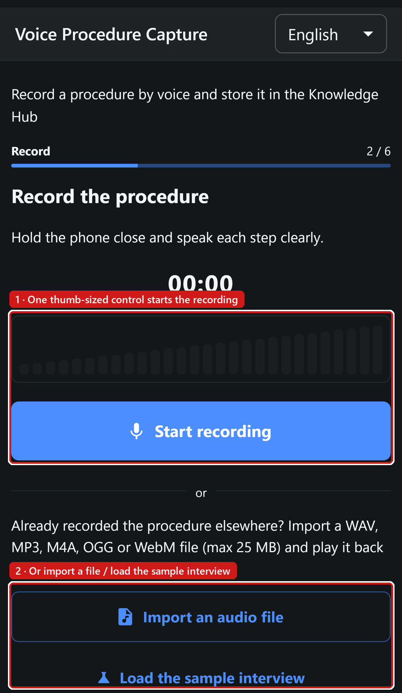

1. One thumb-sized **Start recording** control above the live input meter — designed for a gloved hand on a plant floor.
2. **Import an audio file** (WAV, MP3, M4A, OGG or WebM, max 25 MB) and **Load the sample interview** — the second one is the rehearsed demo path.

<a id="s22"></a>

#### S22 — Recorder, active (06:10-06:50)

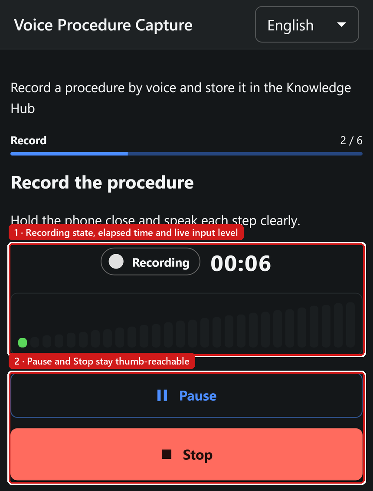

1. The **Recording** chip, elapsed timer and live input level — the operator can see the phone is actually hearing them.
2. **Pause** and **Stop** stay thumb-reachable at the bottom of the screen.

<a id="s23"></a>

#### S23 — Local review before upload (06:10-06:50)

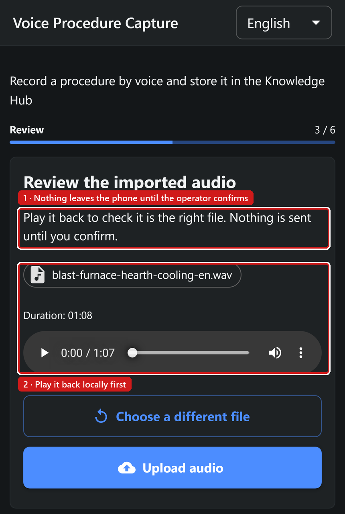

1. “Nothing is sent until you confirm.” — the audio stays on the device until the operator explicitly uploads it.
2. The file name, duration and a local player: the operator checks it is the right recording first. On the sample path this is `blast-furnace-hearth-cooling-en.wav`, 01:08.

<a id="s24"></a>

#### S24 — Transcript and confidence (06:50-07:30)

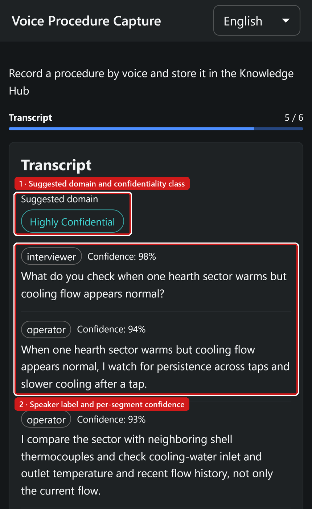

1. **Suggested domain** and the confidentiality classification — proposed by the platform, still the reviewer’s to confirm.
2. Every segment carries a speaker label (`interviewer` / `operator`) and its own **Confidence** score, so a reviewer knows which sentences to re-listen to.

<a id="s25"></a>

#### S25 — Draft created, not published (07:30-07:50)

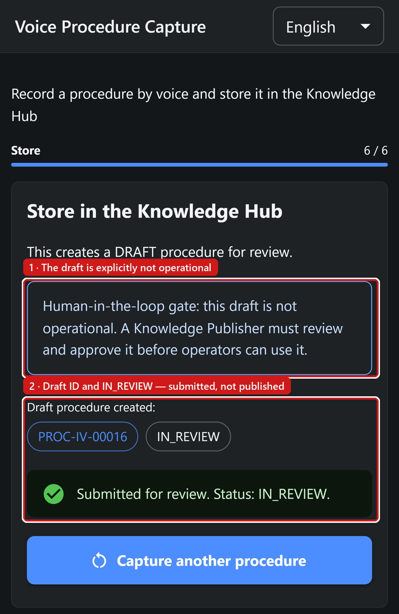

1. The on-screen human-in-the-loop gate: “this draft is not operational. A Knowledge Publisher must review and approve it before operators can use it.”
2. The created draft id (`PROC-IV-*`) and its status: **submitted for review**, not published. The operator role can contribute and submit; only a Knowledge Publisher can approve.

### 4.4 Regenerating the cue cards

The cue cards are derivatives of the committed first-party captures — no third-party imagery is involved (see [`../presentation/assets/PROVENANCE.md`](../presentation/assets/PROVENANCE.md)).

1. Re-capture the source screens if the UI changed, following the app-guide instructions in [`../presentation/assets/app-guide/en/README.md`](../presentation/assets/app-guide/en/README.md). The **S20**-**S25** sources are portrait phone captures of the deployed Voice Procedure Capture PWA (430x932 CSS viewport), not portal screens.
2. Adjust the crop and highlight rectangles in `tools\presentation\annotate_demo_screenshots.py` (coordinates are in source-capture pixels).
3. Run `python tools\presentation\annotate_demo_screenshots.py` and re-check every frame before rehearsal.

Pillow is the only dependency and must be restored from the Microsoft-protected feed only — see [`../tech/security_requirement.md`](../tech/security_requirement.md).

### 4.5 Operator voice capture beat (DM-5)

The 06:10-07:50 block runs in the **Voice Procedure Capture** PWA
(<https://novasteelv3-capture.calmbeach-dbad72b1.swedencentral.azurecontainerapps.io>), not in the desktop
portal. Run it on a real phone and mirror the screen if you can — the point of the beat is that capture
happens on the floor. A phone-sized browser window works as a substitute. See
[`../../apps/operator-capture-mfe/README.md`](../../apps/operator-capture-mfe/README.md) for the app itself.

Six steps, roughly 100 seconds:

1. **Consent** — title `Hearth cooling check when sector temperature rises`, operator reference `OP-DEMO-014`,
   domain **Blast Furnace**, retention `365` days. Tick the consent box, then **Continue to recording**. [S20](#s20)
2. **Record** — either **Start recording** and answer the question yourself, or tap **Load the sample
   interview**. Use the sample unless the room is quiet and you have rehearsed the answer. [S21](#s21) · [S22](#s22)
3. **Review** — play a few seconds back. Say the line on screen out loud: nothing is sent until the operator
   confirms. Then **Upload audio**. [S23](#s23)
4. **Upload** — transcription. Usually too fast to narrate; do not build a sentence around it.
5. **Transcript** — point at the suggested domain, the confidentiality chip, and one segment's speaker label
   and confidence score. Then **Save to Knowledge Hub**. [S24](#s24)
6. **Store** — read the human-in-the-loop notice, **Create draft procedure**, then **Submit for review**.
   Land on `PROC-IV-*` / `IN_REVIEW`. [S25](#s25)

**Preflight for this beat:** open the URL on the phone, grant the microphone permission once, and complete a
full rehearsal run so the service worker has cached the bundle and the sample WAV. Each rehearsal creates a
real draft procedure in the demo estate, which is expected — they queue up in the Knowledge Hub as
`IN_REVIEW` and are exactly what the reviewer beat shows.

**Honesty notes:**

- The persona, the voice and the audio are synthetic. Say so before you press record.
- The sample interview narrates the backend's own transcript fixture, so audio and transcript agree.
- If the app is opened with **no BFF configured**, it falls back to a client-side stub whose transcript is a
  *Continuous Casting* example that does **not** match the hearth-cooling audio. Never run the beat that way.
  If you end up there by accident, stop and switch to the cue cards rather than reading a transcript that
  contradicts what the room just heard.
- The app submits with a contributor identity. Submitting is allowed; approving and publishing are not. That
  asymmetry is the demo claim, so do not log in as a publisher to "make it work".

## 5. Expected cue sheet

| Cue | Expected value/state |
|---|---|
| Stream start | `ONLINE`, freshness <5 s, event rate visibly nonzero |
| Lining target | `LUX-BF-01 / HEARTH-SECTOR-07` |
| RUL alert | P50 19.65 days; P10 18.69; P90 20.61; risk 0.8995; confidence 0.78; `HIGH` |
| Work order | `WO-DEMO-LUX-1042`, synthetic, planned inspection |
| Price peak | 280 EUR/MWh evening scarcity interval |
| Energy outcome | 7.25% modeled cost reduction; 3.29% CO₂ reduction; 7.89% peak reduction; baseline 56.0→optimized 51.58 MW peak; equal tonnage (960 t); zero hard violations |
| Quality coil | `COIL-LUX-260725-017`, `NS-AUTO-DP780` |
| Quality outcome | Predicted first-pass yield approximately 88% -> 95% |
| Knowledge status | Draft, cited to transcript, expert review required |
| Capture draft | New `PROC-IV-*` id, status `IN_REVIEW`, `Submitted for review.` confirmation on the phone |
| Fabric health | Bronze/silver/gold current; quarantine only intentional negative tests |
| Copilot answer | Question “What is the risk?” on Furnace Health resolves to lining risk; answer cites at least one glossary source and the screen; `resolvedReasoning` shown in the footer |

If a value lands outside its expected band, switch to the cached deterministic result rather than changing the narrative or hiding the discrepancy.

## 6. Offline and degraded-mode strategy

### 6.1 Fallback ladder

Use the first working level and clearly say “replay” or “cached result”:

1. **Live cloud** — Fabric stream, semantic model, model endpoints, live STT.
2. **Local deterministic replay** — pre-generated event file and local UI/API, no external calls.
3. **Cached interactive** — static historical model plus saved inference/optimization/transcript responses.
4. **Recorded flow** — short chapter videos with presenter narration.
5. **Static proof pack** — screenshots/PDF and JSON examples.

Do not spend more than 10 seconds diagnosing during the 10-minute presentation. The audience should see an intentional fallback, not a terminal error.

### 6.2 Required fallback pack

Store the pack in an access-controlled, offline-capable demo folder and verify checksums:

- fleet overview and persona screenshots;
- the annotated cue cards `docs/demo/screenshots/s1-*.png` … `s25-*.png` (§4.3, §11) — they double as the static proof pack;
- 45-day thermal trend and three-frame hearth map;
- `model-inference` and alert-lifecycle JSON;
- baseline and optimized schedule/results;
- quality genealogy, drift, and what-if results;
- licensed synthetic interview WAV, transcript, extracted facts, and procedure draft;
- Fabric architecture/lineage image and contract-health report;
- help-popup screenshot (explain mode active on a KPI tile, showing all four topic sections);
- 90-second end-to-end recording;
- scenario manifest, expected values, and reset checklist.

The fallback pack must contain no credentials, production endpoints, real customer identifiers, real operator voices, or personal data.

## 7. Operator interview script

Use a fictional identifier, for example `OP-DEMO-014`, role “Senior Blast Furnace Operator (synthetic).”
This is the content the capture PWA records in [§4.5](#45-operator-voice-capture-beat-dm-5); the shipped
sample interview (`blast-furnace-hearth-cooling-en.wav`, ~68 s) is question 1 and its answer.

Presenter questions:

1. “What do you check when one hearth sector warms but cooling flow appears normal?”
2. “How do you tell a failing thermocouple from real lining degradation?”
3. “What should a new operator never change without engineering approval?”

Approved synthetic answer content:

- compare the sector with neighboring shell thermocouples;
- check cooling-water inlet/outlet temperature and recent flow history, not only the current flow;
- look for persistence across taps and slower cooling after a tap;
- validate sensor health and recent calibration;
- request cooling-circuit inspection and ultrasound measurement when signals agree;
- do not bypass alarms or change furnace/cooling controls from the interview guidance.

The extraction must retain source segment citations and separate `observation`, `recommended_check`, `rationale`, and `safety_boundary`. The procedure remains a draft until reviewed by reliability, operations, and safety owners.

## 8. Failure handling during the demo

| Symptom | Immediate action | Spoken bridge |
|---|---|---|
| No live events | Switch to local replay, then recorded stream | “I’ll switch to our deterministic replay so we can keep the same event sequence.” |
| Fabric tab inaccessible | Show lineage screenshot/clip | “This is the cached lineage view from the same validated run.” |
| Model endpoint slow | Reveal saved inference | “For a predictable demo we cache the signed result from this exact seed.” |
| Optimizer infeasible | Load known feasible result; show constraints | “The platform never relaxes hard production constraints silently.” |
| STT fails | Play WAV, then paste approved transcript | “We support offline replay; the review workflow is unchanged.” |
| Capture PWA microphone blocked | Tap **Load the sample interview** (or **Import an audio file**) and continue on the same path | “The recorder is one input among several — the review and approval path is identical whichever way the audio arrives.” |
| Capture PWA cannot reach the BFF | Do **not** continue in the client-side stub; narrate cue cards [S20](#s20)-[S25](#s25) and resume on the desktop Knowledge Hub | “The phone is offline, so here is the same flow from our rehearsal, and the draft it produced is already in the review queue.” |
| Browser crashes | Reopen direct URL or static summary | “The data and decisions are persisted; the presentation client is replaceable.” |
| Incorrect cue/value | Stop stream and load expected manifest result | “The live run differs from the rehearsed seed, so I’m switching to the validated scenario.” |
| Copilot returns an error | Resend once; if it fails again, skip the beat and continue | “The assistant deliberately refuses to invent an answer when it cannot reach its grounding, so it surfaces the error instead of guessing.” |
| Copilot/workspace dock in the wrong position | Use the header **Reset layout** button, or clear `novasteel.copilot.dock.v2` / `novasteel.dock.v1.<section>/<subView>` in local storage, or drag the panel back to the intended edge | “The layout is yours to arrange — it is remembered per browser and can be reset.” |
| Network fully lost | Use fallback ladder levels 2-5 | “The edge buffers data and preserves event time; here is the offline path.” |

Never expose stack traces, tokens, tenant details, or hidden production-like settings on the projector.

## 9. Recovery and reset

### 9.1 Soft reset between rehearsals

1. Pause the accelerated clock.
2. Stop publishers cleanly and wait for in-flight batches to drain.
3. Set scenario to `demo-full`, root seed `240725`, simulated start time to the manifest value.
4. Clear only the synthetic run's hot cache, alert state, demo work-order link, interview session, and UI selections.
5. Preserve the preloaded historical partitions and cached fallback artifacts.
6. Restore model responses and optimizer outputs from the matching manifest.
7. Reset alert to `ARMED`, stream to `PAUSED`, persona to Plant Manager.
8. Start for 30 seconds; verify sequence, event count, expected checksum, freshness, and synthetic labels.
9. Pause and mark control state `READY`.

### 9.2 Hard recovery

Use when the run is contaminated, sequence state is unknown, or scenario outputs do not reconcile:

1. Stop the simulator and disconnect its publisher.
2. Record the failed `run_id`; do not delete evidence until after diagnosis.
3. Create a new `run_id` and isolated synthetic namespace.
4. Reload the signed reference snapshot and historical scenario data.
5. Reset sink checkpoints/deduplication state for the new namespace only.
6. Replay the manifest and run contract, physical, and scenario assertions.
7. Refresh the semantic model and verify the cue sheet.
8. Reopen the seven tabs, test fallback files, and return to `READY`.

Never truncate a shared or production table, clear a shared event stream, or reuse production secrets as part of reset.

### 9.3 Post-demo

- Pause and stop the simulator.
- Save the run manifest, timestamps, and demo health report.
- Delete ad hoc microphone recordings unless retention was explicitly approved; retain only the approved synthetic artifact.
- Close sessions, remove temporary access grants, and confirm no publisher remains active.
- Record any fallback used and rehearse the failed chapter before the next presentation.

## 10. Go/no-go checklist

Proceed only when:

- all displayed data is labeled synthetic;
- deterministic manifests and expected cues validate;
- live stream and at least two fallback levels work;
- alert, optimizer, quality, and knowledge cached results are available;
- microphone/audio and privacy messaging are tested;
- no production credentials or data are visible;
- reset completes in under five minutes;
- presenter can finish the story entirely offline.

If any synthetic-data boundary, privacy control, or safety disclaimer is missing, the demo is **no-go**.

## 11. Device Operations demo beats (wave 3)

These beats are optional supplementary demonstrations for audiences specifically interested in device monitoring, OT-level visibility, or simulator controls. They can be inserted after DM-1 (command center) or as a standalone extension. Total added time: approximately 4–5 minutes.

### 11.1 Device Fleet overview (~1 min)

Navigate to **Device Operations → Device Fleet** (`/lu/device-operations/fleet`).

<a id="s17"></a>

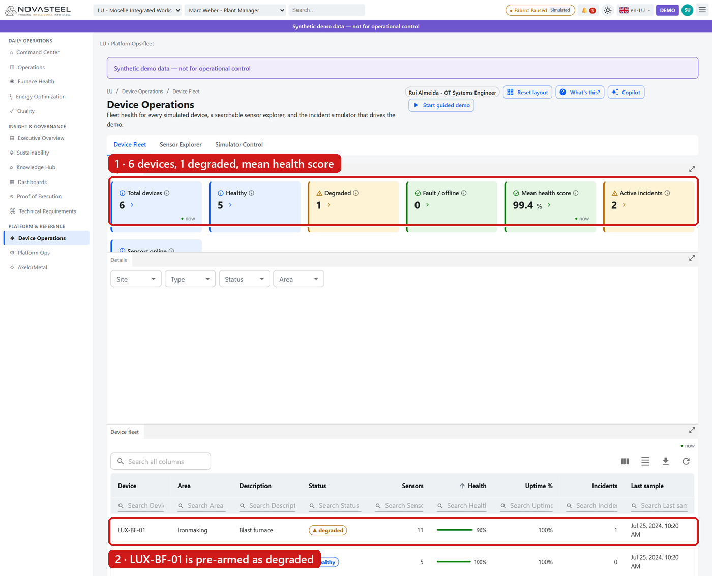

1. KPI band — 6 devices, 5 healthy, 1 degraded, mean health score 99.4%, active incidents.
2. The `LUX-BF-01` row, already `degraded` because demo-mode auto-seeding pre-armed the lining-wear incident.

| Time | Action | Presenter narrative | Proof point / fallback |
|---|---|---|---|
| +0:00 | Open Device Fleet | Show the KPI band: 6 devices, X healthy, X degraded, mean health score, active incidents, sensors online. | "Six devices, 34 sensors, all deterministic and synthetic. The health scores derive from individual sensor alarm/warning states — no manual override." |
| +0:30 | Point to LUX-BF-01 row (status: degraded) | Click to open the device detail panel. Show the sensor list — one or more sensors in `warning` status. | "The blast furnace is already degraded because the demo-mode auto-seeding has pre-armed the lining-wear incident. The platform never shows you a perfectly green all-OK fleet when something is developing." |
| +0:50 | "Open in Sensor Explorer" link | Navigate to Sensor Explorer pre-filtered to LUX-BF-01. | Link carries `deviceId` pre-selected. |

### 11.2 Sensor Explorer + chart (~1.5 min)

Stay on **Device Operations → Sensor Explorer** (pre-filtered to LUX-BF-01).

<a id="s18"></a>

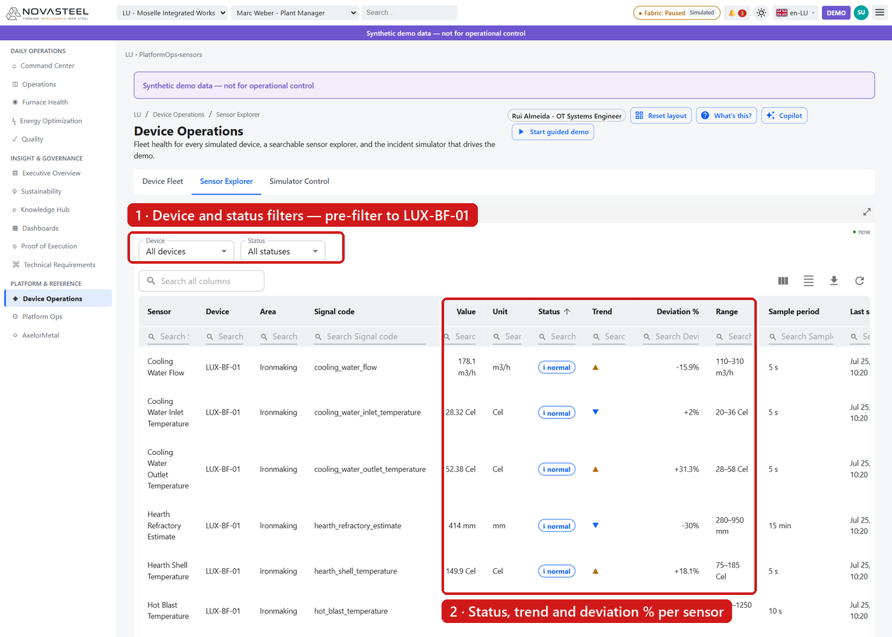

1. The device and status filters — arrive here pre-filtered to `LUX-BF-01` from the fleet link.
2. The status, trend and deviation % columns — the approach-band rule fires before a clamped waveform ever reaches its limit.

| Time | Action | Presenter narrative | Proof point / fallback |
|---|---|---|---|
| +0:00 | Show sensor table | Point to `hearth_temp_s07` row: status = `warning`, trend = `rising`, deviation % non-zero. | "The approach-band rule fires a warning before the value saturates. A naive threshold rule would never alarm because the waveform generator clamps values at the limit." |
| +0:25 | Click `hearth_temp_s07` row | Chart panel opens. Switch to **Control chart** type. | Line/area/bar/control chart types all load from the same series endpoint. |
| +0:50 | Show statistics strip | Min/max/mean/std dev/last computed over the visible window. | "All computed from the ring buffer — 1440 samples, 5-second tick, fully deterministic." |
| +1:10 | Toggle **Normalize (0–1)** | Curve rescales to [0, 1]. | Useful for showing multiple sensors on one axis if the audience wants to see correlated drift. |
| +1:20 | Click **View as table** | HTML table fallback renders. | "WCAG 2.2 AA — every chart has a screen-reader-navigable table equivalent." |

### 11.3 Live incident injection (Degrading Furnace) (~1.5 min)

Navigate to **Device Operations → Device Simulator** (`/lu/device-operations/simulator`).

> **Prerequisites:** the BFF must be running. The presenter must hold `Platform.Capacity.Manage` (or use the local demo header).

<a id="s19"></a>

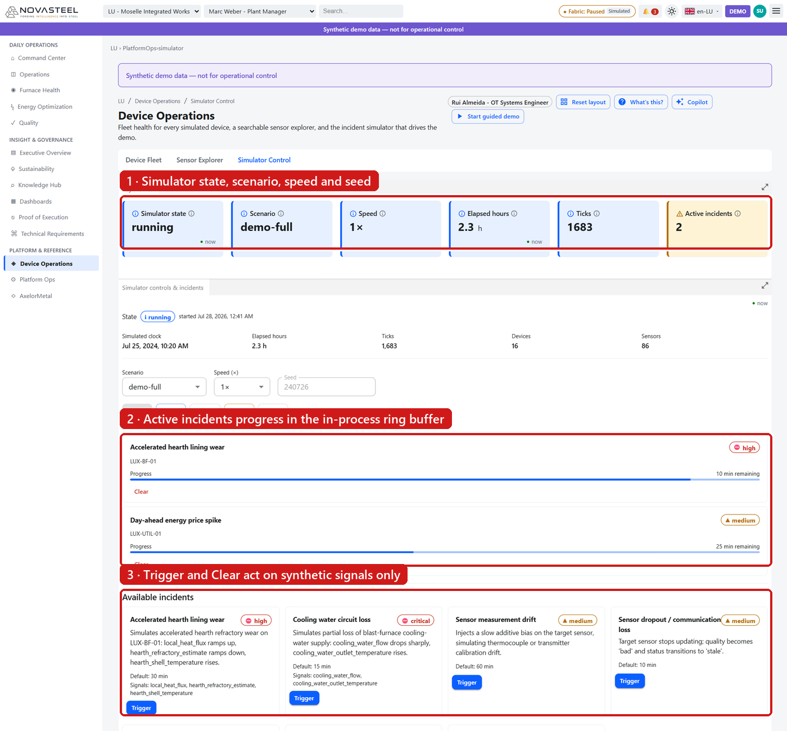

1. Simulator state, scenario `demo-full`, speed and seed — the run is deterministic.
2. Active incidents with their progress bars and **Clear** action.
3. The **Trigger** buttons: they act on the in-process ring buffer only — no OT system, PLC or historian is reachable from here.

| Time | Action | Presenter narrative | Proof point / fallback |
|---|---|---|---|
| +0:00 | Show Simulator KPI band | State = `running`, scenario = `demo-full`, seed = 240726, speed = 1.0×, elapsed hours, tick count, active incidents = 1. | "The simulator started with a lining-degradation seed and has been running since BFF startup. One incident is already active." |
| +0:25 | In the IncidentPanel, click **Trigger** next to `degrading-furnace` | Target-selection dialog appears. Leave device as `LUX-BF-01`, accept default 30-minute duration. Confirm. | The incident appears in the Active Incidents list with a progress bar. |
| +0:45 | Navigate back to Device Fleet | LUX-BF-01 row should now show the refreshed status. Navigate to Sensor Explorer and watch `hearth_temp_s07` rise. | "I just injected an incident from the UI. No OT system was touched — the ring buffer updated in-process. The UI reflects it on the next 5-second poll." |
| +1:10 | Clear the incident | Back in Device Simulator, click **Clear** on the active `degrading-furnace` entry. | Active incident disappears; sensor readings return to their pre-incident trajectory within a few ticks. |
| +1:25 | Explain the boundary | "The simulator is synthetic. It controls only the in-memory ring buffer inside the BFF process. It has no path to OT, no network connection to a PLC or historian, and no way to actuate anything real." | Use the security §25.4 language if pressed on the OT boundary. |

**Expected values for the cue sheet:**

| Cue | Expected |
|---|---|
| Device Fleet KPI band | totalDevices = 6; at least 1 degraded or fault |
| LUX-BF-01 initial status | `degraded` (pre-armed incident) |
| hearth_temp_s07 status | `warning` |
| Active incident after trigger | 1 or 2 (pre-armed + new), progressing |
| After clear | Active incidents reduced by 1 |

If any value is outside the expected band, use a cached screenshot/JSON and continue with the narrative.

## 12. Grounded-RAG decline demo beat (wave 3)

This beat demonstrates the knowledge query pipeline's decline-rather-than-hallucinate behaviour. Insert during or after DM-5 (Knowledge Hub). Adds approximately 1 minute.

### 12.1 Decline on ungrounded query

Navigate to **Knowledge Hub → Procedures** (or use the API directly with `drive_demo.py`).

| Time | Action | Presenter narrative | Proof point / fallback |
|---|---|---|---|
| +0:00 | POST to `/v1/knowledge/query` with a question outside procedure scope (e.g., `"What is the capital of France?"`) | Show the response: `"declined": true, "declineReason": "no_grounded_source"`. | "The grounded-RAG pipeline declines when no approved procedure shares a content term with the query. It does not invent an answer." |
| +0:20 | POST with a legitimate procedure question (e.g., `"What do I check when hearth sector temperature rises but cooling flow is normal?"`) | Show the response: `"declined": false`, answer with inline `[[chunk-id]]` citations, and `citations[]` referencing approved procedure IDs. | "Now it finds a grounded match and enforces per-sentence citations. Every sentence that makes a claim must carry a source reference." |
| +0:40 | Highlight the PII-clean output | Point out that no personal names, emails, or employee IDs appear in the answer. | "PII redaction runs on the generated answer before it leaves the service." |
| +0:55 | Close the beat | "The system declines rather than hallucinating. For a safety-critical industrial procedure library, a confident wrong answer is more dangerous than a clear 'I cannot answer this from approved sources'." | |

**Decline reasons for the FAQ:**

| `declineReason` | When it fires |
|---|---|
| `no_grounded_source` | RRF retrieval finds no chunk sharing a content term with the query, or retrieval returns empty |
| `content_policy_violation` | Input or output fails the Content Safety screen (severity ≥ 4) |
| `citation_enforcement_failed` | One or more generated sentences lack a valid `[[chunk_id]]` citation |

If the BFF is unavailable, use the cached decline-response JSON from the fallback pack and narrate the pipeline from the architecture diagram.
