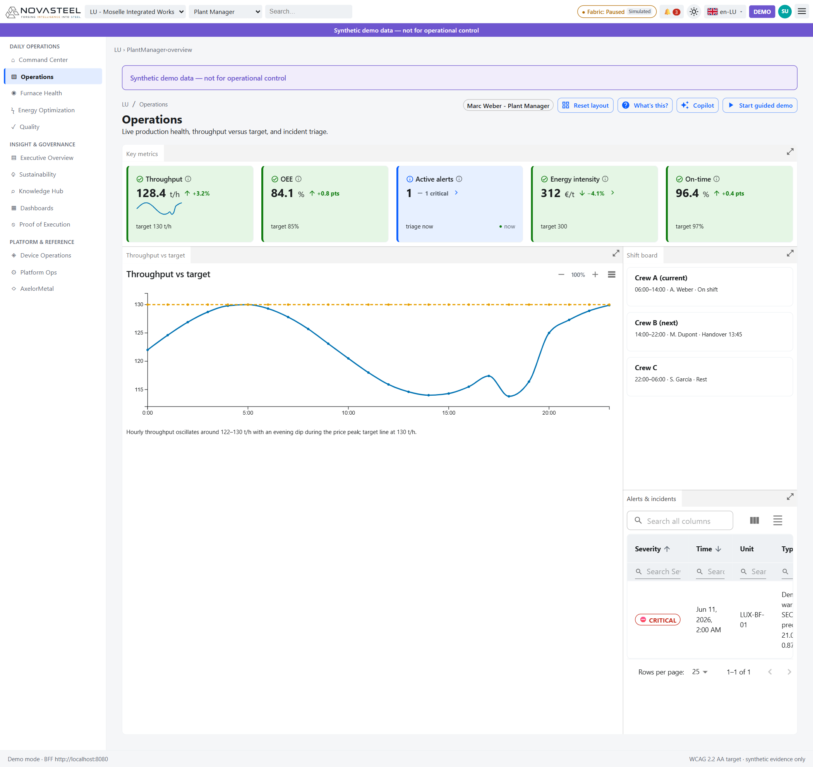

# 03 — Command Center and Operations

**Audience:** complete newcomers to steel and NovaSteel  
**Reading time:** 18 minutes  
**Persona:** Marc Weber — Plant Manager  
**Routes covered:** `/{site}/command-center/overview`, `/{site}/operations/overview`  
**Last updated:** 2026-07-27  
[🇫🇷 Version française](../fr/03-command-center-and-operations.md)

## How to read a NovaSteel dashboard

| Building block | What it means | Source |
|---|---|---|
| Synthetic-data banner | Demo data only; not for operational control. | `docs\demo\demo-runbook.md:37-44` |
| Persona chip | Shows the active role, for example “Marc Weber - Plant Manager.” | `apps\analytics-mfe\src\personaRoutes.ts:18-33` |
| Dock panels | Panels can be resized, rearranged, maximized, and reset; structural panels are not closable. | `apps\analytics-mfe\src\components\screens\common.tsx:158-187`; `docs\ux\dashboard-specification.md:407-442` |
| KPI card | Label, value, unit, trend arrow, delta, target, freshness dot, tooltip, and sometimes a “Why?” popover. | `apps\analytics-mfe\src\components\primitives\KpiCard.tsx:29-49`, `apps\analytics-mfe\src\components\primitives\KpiCard.tsx:97-144` |
| Freshness dot | Green/fresh, amber/stale, or fixture marker for offline synthetic fallback. | `apps\analytics-mfe\src\components\primitives\FreshnessBadge.tsx:14-38` |
| Severity colours | Always paired with text and an icon glyph, never colour alone. | `apps\analytics-mfe\src\components\primitives\SeverityPill.tsx:10-33`; `docs\ux\dashboard-specification.md:334-343` |
| Proof badge | Links visible evidence to the Proof of Execution register. | `apps\analytics-mfe\src\components\primitives\ProofBadge.tsx:13-70` |
| Data table | Global search, per-column search, sort, column chooser, density, export, refresh, pagination. | `apps\analytics-mfe\src\components\primitives\DataTable.tsx:248-428` |

**P50** means the median prediction: half the plausible outcomes are above it and half below it. A RUL P50 of 21 days means the model’s middle estimate is 21 days remaining (`apps\analytics-mfe\src\components\primitives\ConfidenceMeter.tsx:13-64`). **Confidence %** is the model or alert confidence rendered as a percentage in the `Conf.` column (`apps\analytics-mfe\src\components\screens\CommandCenter.tsx:176-182`).

---

## Command Center — `/{site}/command-center/overview`

**In one sentence.** The Command Center is Marc Weber’s cross-persona triage screen: which plant needs attention, which KPI target is at risk, and what action should open next.

**Steel-industry background (for newcomers).** A plant manager owns safety, production output, cost, and quality. MWh means megawatt-hour, a unit of electricity. Scope 2 CO₂ means emissions from purchased electricity. RUL means remaining useful life. High-grade yield is the share of premium steel passing specification the first time. These concerns match Marc Weber’s persona and the four outcome targets (`docs\personas\personas-and-journeys.md:67-107`; `docs\specs\solution-requirements.md:55-67`).

**What you see on screen.**

1. **Site status tiles.** LU Moselle Integrated Works is orange “Attention” with one active alert; DE Saarbrücken, BE Liège, and ES Asturias are blue “Healthy.” Good is Healthy and no open alerts; bad is Attention/Critical with active alerts (`apps\analytics-mfe\src\components\screens\CommandCenter.tsx:186-221`).
2. **Energy consumption KPI.** Green card, about 1,016.4 MWh, “−10.4% target,” target text “target −14% energy/t.” Good means lower energy per ton; bad means energy rises or misses the target (`apps\analytics-mfe\src\components\screens\CommandCenter.tsx:38-52`; `docs\presentation\proof_of_execution.md:317-327`).
3. **CO₂ Scope 2 KPI.** Green card, about 165.9 t/day, “−22% target.” Good means lower electricity-related emissions; the −22% is a target, not a measured result (`apps\analytics-mfe\src\components\screens\CommandCenter.tsx:53-67`; `docs\presentation\proof_of_execution.md:328-338`).
4. **Furnace lining RUL KPI.** Orange card, 21 days (P50), HEARTH-07, target “≥21-day advance warning.” Furnace lining is the heat-resistant protective layer inside a furnace. Bad is forecast life near or below the warning threshold; good is enough lead time for planned maintenance (`apps\analytics-mfe\src\components\screens\CommandCenter.tsx:68-92`; `docs\presentation\proof_of_execution.md:340-350`).
5. **High-grade yield KPI.** Green card, 88% predicted, “+8% target.” Predicted means model output, not a final lab measurement. Good means more premium steel passes first time; bad means downgrade, rework, or claim risk (`apps\analytics-mfe\src\components\screens\CommandCenter.tsx:93-107`; `docs\presentation\proof_of_execution.md:352-357`).
6. **Open alerts KPI.** Red card, 1 open alert and 1 critical. Good is zero critical alerts; bad is a red card requiring triage (`apps\analytics-mfe\src\components\screens\CommandCenter.tsx:108-123`).
7. **Active alerts table.** Columns are Severity, Time, Site/Unit, Component, Message, Conf., and Status. The visible row is CRITICAL for `LUX-BF-01`, `HEARTH-SECTOR-07`, with predicted RUL around 21 days, confidence around 87%, and status OPEN (`apps\analytics-mfe\src\components\screens\CommandCenter.tsx:163-184`, `apps\analytics-mfe\src\components\screens\CommandCenter.tsx:229-256`).
8. **Table controls.** The toolbar shows column chooser, density, export, and refresh, and every visible column has its own search field (`apps\analytics-mfe\src\components\primitives\DataTable.tsx:248-428`).
9. **Next-best actions.** Ranked action cards propose approving a simulated load shift, scheduling a hearth inspection, and reviewing quality drift. “Open” deep-links to the owning screen; it does not execute plant control (`apps\analytics-mfe\src\components\screens\CommandCenter.tsx:139-161`, `apps\analytics-mfe\src\components\screens\CommandCenter.tsx:260-282`).
10. **Alert severity mix donut.** The donut summarizes Critical, Warning, and Info counts. A good donut is empty or low severity; a bad donut has a large red critical share (`apps\analytics-mfe\src\components\screens\CommandCenter.tsx:127-137`, `apps\analytics-mfe\src\components\screens\CommandCenter.tsx:283-294`).

**Why this component was implemented.** The use case lists energy cost, CO₂ pressure, unpredictable furnace lining wear, quality issues, and knowledge loss (`docs\usecase\usecase.md:14-22`). The Command Center turns the first four into one triage landing page (`docs\ux\dashboard-specification.md:314-333`).

**Objective & evidence (proof of execution).**

| Use-case element | Requirement ID | Evidence in the running app | Where the number comes from (API route + source file) |
|---|---|---|---|
| Reduce energy consumption | OBJ-01, OUT-01 | Energy KPI shows MWh and `target −14% energy/t`. | `DataClient.getCommandSummary('all')` calls `GET /v1/command-center/summary?site=all` (`apps\analytics-mfe\src\api\dataClient.ts:155-160`). BFF computes `energyConsumptionMwh` from energy rows (`services\bff-api\src\bff_api\routes.py:49-59`; `services\bff-api\src\bff_api\repository.py:300-323`). Fixture fallback: `apps\analytics-mfe\src\api\fixtures.ts:459-480`. |
| Reduce CO₂ | OUT-02 | CO₂ Scope 2 KPI shows tonnes/day and `−22% target`. | Same summary route; BFF computes `scope2KgCo2e` from consumption × carbon intensity (`services\bff-api\src\bff_api\repository.py:300-324`). Caveat: `docs\presentation\proof_of_execution.md:328-338`. |
| Predict equipment failures | OBJ-02, OUT-03, AI-01 | RUL KPI shows 21 days (P50), warning target, and model “Why?” drivers. | Same summary route for KPI; OUT-03 and AI-01 are cataloged in `apps\analytics-mfe\src\proof\proofCatalog.ts:465-543`. |
| Improve high-grade yield | OBJ-03, OUT-04 | Yield KPI shows 88% predicted and `+8% target`. | Same summary route; BFF uses `qualityPredictedFirstPassYieldPct` (`services\bff-api\src\bff_api\repository.py:324-328`). Caveat: `apps\analytics-mfe\src\proof\proofCatalog.ts:495-518`. |
| Cross-domain triage | CHL-01..CHL-04 | Active alerts table and donut show open critical items. | `DataClient.getAlerts()` calls `GET /v1/realtime/alerts:poll` through `pollAlerts()` (`apps\analytics-mfe\src\api\dataClient.ts:286-317`). BFF serves `AlertEventBuffer` (`services\bff-api\src\bff_api\routes.py:97-116`; `services\bff-api\src\bff_api\services.py:75-84`). |

**How the data reaches this screen.** `CommandCenter` → `client.getCommandSummary('all')` and `client.getAlerts()` → `DataClient` → `GET /v1/command-center/summary?site=all` and `GET /v1/realtime/alerts:poll` → BFF repository `command_summary()` and `AlertEventBuffer`; if unavailable, deterministic fixtures are used (`apps\analytics-mfe\src\components\screens\CommandCenter.tsx:19-25`; `apps\analytics-mfe\src\api\dataClient.ts:127-160`, `apps\analytics-mfe\src\api\dataClient.ts:286-317`; `services\bff-api\src\bff_api\repository.py:300-341`; `apps\analytics-mfe\src\api\fixtures.ts:221-355`, `apps\analytics-mfe\src\api\fixtures.ts:459-480`).

**Honesty & caveats.** The headline figures are targets on synthetic data, not production measurements. The UI labels them as targets, and actions navigate or record demo decisions rather than controlling equipment (`docs\presentation\proof_of_execution.md:307-315`; `docs\specs\solution-requirements.md:96-105`).

**Try it yourself.** Open `http://localhost:5266/lu/command-center/overview`, search `HEARTH` in Active alerts, then open the inspection next-best action.

---

## Operations — `/{site}/operations/overview`

**In one sentence.** Operations shows current production health: throughput, equipment effectiveness, active alerts, energy intensity, on-time delivery, shift coverage, and incident triage.

**Steel-industry background (for newcomers).** Throughput is production speed in tonnes per hour. OEE, or Overall Equipment Effectiveness, combines availability, performance, and quality. Energy intensity is cost per tonne of steel. A shift board shows who is on duty and who takes over next. Incident triage means sorting abnormal events by severity so the highest-risk issue is handled first (`apps\analytics-mfe\src\components\screens\Operations.tsx:35-49`; `docs\ux\dashboard-specification.md:654-673`).

**What you see on screen.**

1. **KPI band.** Throughput 128.4 t/h, OEE 84.1%, Active alerts 1 with 1 critical, Energy intensity 312 €/t, and On-time 96.4%. Good means near targets: 130 t/h, 85%, zero critical, 300 €/t or lower, and 97% on-time (`apps\analytics-mfe\src\components\screens\Operations.tsx:35-41`).
2. **Throughput sparkline.** The throughput card includes a small trend line, so the manager sees direction before opening the main chart (`apps\analytics-mfe\src\components\screens\Operations.tsx:25-40`; `apps\analytics-mfe\src\components\primitives\KpiCard.tsx:124-131`).
3. **Throughput vs target chart.** The blue line is hourly throughput; the orange dashed line is the 130 t/h target. Good is near or above target without unsafe operation; bad is a sustained gap below the target (`apps\analytics-mfe\src\components\screens\Operations.tsx:25-33`, `apps\analytics-mfe\src\components\screens\Operations.tsx:55-74`).
4. **Shift board.** Crew A is current, Crew B is next with handover time, and Crew C is resting. Good is clear ownership; bad is missing handover responsibility during an incident (`apps\analytics-mfe\src\components\screens\Operations.tsx:77-97`).
5. **Alerts & incidents table.** The table columns are Severity, Time, Unit, Type/message, and Owner/status. The same CRITICAL hearth alert appears here, proving production triage shares the alert stream with Command Center (`apps\analytics-mfe\src\components\screens\Operations.tsx:43-49`, `apps\analytics-mfe\src\components\screens\Operations.tsx:99-113`; `apps\analytics-mfe\src\components\primitives\DataTable.tsx:248-428`).
6. **Incident-panel pattern.** The reusable `IncidentPanel` used by the device simulator displays active incidents, severity pills, progress bars, trigger buttons, target dialogs, and clear actions. It is not the main Operations chart, but it documents the same triage pattern for simulated incidents (`apps\analytics-mfe\src\components\devices\IncidentPanel.tsx:168-387`).

**Why this component was implemented.** The requirements say energy, quality, and asset-health decisions are fragmented across systems (`docs\specs\solution-requirements.md:32-43`). Operations gives Marc one live production-health view while keeping critical alerts visible.

**Objective & evidence (proof of execution).**

| Use-case element | Requirement ID | Evidence in the running app | Where the number comes from (API route + source file) |
|---|---|---|---|
| Plant-manager production view | CHL-01..CHL-04 context | KPI band combines production, OEE, alerts, energy, and delivery. | Throughput/OEE/energy/on-time are generated in `Operations.tsx` (`apps\analytics-mfe\src\components\screens\Operations.tsx:25-41`). Alert count uses `GET /v1/realtime/alerts:poll` (`apps\analytics-mfe\src\api\dataClient.ts:286-317`). |
| Alert and incident triage | OBJ-02, OUT-03, AI-01 | Critical hearth alert appears as an Operations incident. | `Operations` polls `client.getAlerts()` every 10 seconds (`apps\analytics-mfe\src\components\screens\Operations.tsx:19-24`). BFF route: `GET /v1/realtime/alerts:poll` (`services\bff-api\src\bff_api\routes.py:97-116`). Fixture alert: `apps\analytics-mfe\src\api\fixtures.ts:221-236`. |
| Energy-cost awareness | OBJ-01, OUT-01 | Energy intensity KPI shows 312 €/t versus target 300. | Displayed value is local screen data (`apps\analytics-mfe\src\components\screens\Operations.tsx:35-40`). OUT-01 proof: `apps\analytics-mfe\src\proof\proofCatalog.ts:415-438`. |
| Production delivery / quality context | OBJ-03, OUT-04 | OEE and On-time indicate stable production while alerts are handled. | Displayed values are local screen data (`apps\analytics-mfe\src\components\screens\Operations.tsx:35-41`). OUT-04 proof: `apps\analytics-mfe\src\proof\proofCatalog.ts:495-518`. |

**How the data reaches this screen.** `Operations` → `client.getAlerts()` → `DataClient.getAlerts()` → `pollAlerts()` → `GET /v1/realtime/alerts:poll` → BFF `AlertEventBuffer` seeded from `repository.alerts_rows()`; fallback is `fixtures.alerts()` (`apps\analytics-mfe\src\components\screens\Operations.tsx:19-24`; `apps\analytics-mfe\src\api\dataClient.ts:286-317`; `services\bff-api\src\bff_api\routes.py:97-116`; `services\bff-api\src\bff_api\services.py:75-84`; `apps\analytics-mfe\src\api\fixtures.ts:221-355`). Non-alert KPI values and throughput points are generated in `Operations.tsx` (`apps\analytics-mfe\src\components\screens\Operations.tsx:25-41`).

**Honesty & caveats.** This is a synthetic operational view. The throughput curve is generated by the front-end for demo readability, and the alert stream is synthetic fixture/BFF data. The screen supports triage and navigation; it does not change furnace controls, production schedules, or safety interlocks (`apps\analytics-mfe\src\components\screens\Operations.tsx:25-41`; `docs\specs\solution-requirements.md:96-105`).

**Try it yourself.** Open `http://localhost:5266/lu/operations/overview`, compare the blue throughput line with the orange target, then search the table for `CRITICAL`.

---

[◀ Previous: AxelorMetal corporate website](02-company-website.md) · [▲ Index](README.md) · [Next ▶ Furnace Health](04-furnace-health.md)
