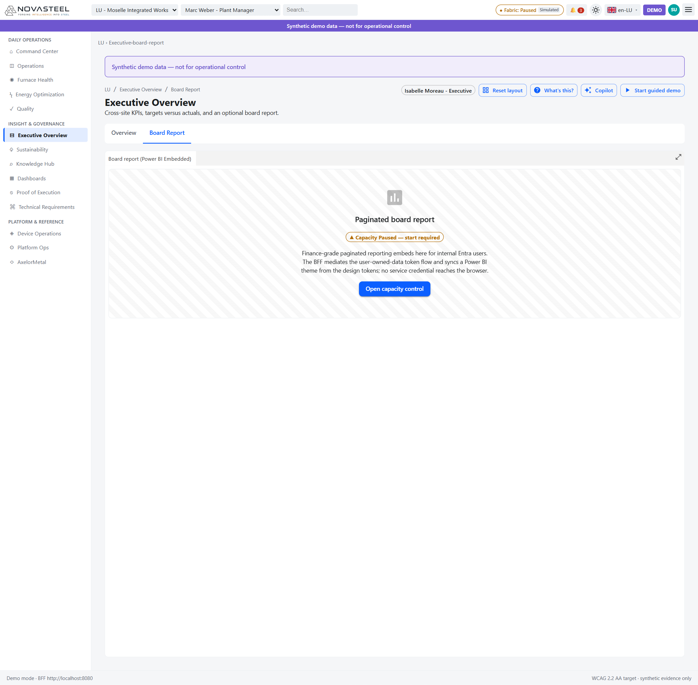

# 09 · Executive Overview

**Audience:** complete newcomer to steel and NovaSteel  
**Reading time:** 15 minutes  
**Persona:** Isabelle Moreau — Executive (COO)  
**Routes covered:** `/{site}/executive-overview/overview`, `/{site}/executive-overview/board-report`  
**Last updated:** 2026-07-27  
**Language:** 🇫🇷 [Version française](../fr/09-executive-overview.md)

---

## Executive Overview — `/{site}/executive-overview/overview`

**In one sentence.** A board-level cockpit that rolls four-country steel performance into targets, risk and return-on-investment evidence (`apps\analytics-mfe\src\components\screens\ExecutiveOverview.tsx`; `docs\personas\personas-and-journeys.md`).

**Background for newcomers.** A steel executive cares less about individual sensor values and more about whether the business is cheaper, cleaner, safer and more reliable. **Cost per tonne** means euros to make one metric tonne of steel. **Energy intensity** is energy per tonne; the brief says energy is 35% of production cost. **CO₂ intensity** is carbon dioxide equivalent per tonne and matters because the European Union Emissions Trading System (EU ETS) prices emissions. **Yield** is how much product is good the first time. **Unplanned downtime** is a surprise stop, and the brief says one furnace-lining failure can cost €8M (`docs\usecase\usecase.md`; `apps\analytics-mfe\src\proof\proofCatalog.ts`).

**What you see on screen.**
1. The shell shows site, persona, search, Fabric capacity, demo mode and language; the purple banner warns that data is synthetic and not for operational control (`apps\portal-shell\README.md`; `docs\README.md`).
2. The header names Isabelle Moreau — Executive, whose persona reviews portfolio investment and the four target outcomes (`docs\personas\personas-and-journeys.md`).
3. KPI cards show **Energy / t −14%**, **CO₂ −22%**, **High-grade yield +8%**, **Advance warning 21 d**, and **Failures prevented 1**. Tooltips state which values are targets or modeled, not audited production results (`ExecutiveOverview.tsx`; `proofCatalog.ts`).
4. The **Site comparison** bar chart compares energy, CO₂ and yield changes for Moselle (LU), Saarbrücken (DE), Liège (BE) and Asturias (ES), from `executiveSites()` (`ExecutiveOverview.tsx`; `apps\analytics-mfe\src\api\fixtures.ts`).
5. **Target vs actual** shows progress bars: energy 92%, CO₂ 88%, yield 96%, and 21-day warning 100%. Treat them as synthetic target-progress indicators (`ExecutiveOverview.tsx`).
6. The **Site scorecard** table lists site, energy delta, CO₂ delta, yield delta and open alerts; it is the shared sortable/searchable data table (`ExecutiveOverview.tsx`; `docs\ux\dashboard-specification.md`).
7. Dock controls come from the shared Dockview workspace, so panels can be rearranged without changing the data (`apps\analytics-mfe\src\components\screens\common.tsx`).

**Why this component was implemented.** The brief says energy cost, CO₂ pressure, furnace-lining failures and high-grade quality problems are the business pain points (`docs\usecase\usecase.md`). The executive view turns those pains into one investment story for Isabelle: are the four expected outcomes on track, and which site needs follow-up (`docs\personas\personas-and-journeys.md`)?

**Objective & evidence (proof of execution).**

| Use-case element | Requirement ID | Evidence in the running app | Where the number comes from (API route + source file) |
|---|---|---|---|
| Energy per tonne reduced 14% | `OUT-01` | “Energy / t −14%” KPI and target progress | No BFF call; `ExecutiveOverview.tsx` imports `executiveSites()` from `apps\analytics-mfe\src\api\fixtures.ts`. Proof status is Demo surrogate in `proofCatalog.ts`. |
| CO₂ reduced 22% | `OUT-02` | “CO₂ −22%” KPI and target progress | Local fixture roll-up; `proofCatalog.ts` says −22% is a target and the demo load-shift effect is smaller. |
| 21-day lining warning | `OUT-03` | “Advance warning 21 d” KPI | Proving screen uses `DataClient.getLiningForecast()` → `GET /v1/furnaces/{assetId}/lining-forecast` → scoring/fixture (`dataClient.ts`; `proofCatalog.ts`). |
| High-grade yield +8 points | `OUT-04` | “High-grade yield +8%” KPI | Proving screen uses `DataClient.getQualityBatches()` → `GET /v1/quality/batches` → fixture/model (`dataClient.ts`; `proofCatalog.ts`). |
| ROI framing for avoided failure | `CHL-03`, `OUT-03` | “Failures prevented 1”, “€8M avoided (modeled)” | Text in `ExecutiveOverview.tsx`; €8M failure cost from `docs\usecase\usecase.md` and `proofCatalog.ts`. |

**How the data reaches this screen.** `ExecutiveOverview.tsx` → `executiveSites()` → `apps\analytics-mfe\src\api\fixtures.ts`. Related proving screens use the standard path: screen component → `DataClient` → `/v1/...` BFF route → worker or deterministic fixture (`apps\analytics-mfe\src\api\dataClient.ts`; `docs\implementation\api-contracts.md`).

**Honesty & caveats.** The local defense is synthetic and advisory-only; it does not connect to production operational technology, programmable logic controllers, safety interlocks, furnaces, recipes, maintenance systems or production schedules (`docs\README.md`). `OUT-01`, `OUT-02` and `OUT-04` are Demo surrogate; `OUT-03` is Met with model caveats (`proofCatalog.ts`).

**Try it yourself.** Open `http://localhost:5266/{site}/executive-overview/overview` or use **Insight & Governance → Executive Overview → Overview**.

---

## Board Report — `/{site}/executive-overview/board-report`

**In one sentence.** A placeholder for a finance-grade Power BI board report that becomes active only when Fabric capacity and token mediation are ready (`apps\analytics-mfe\src\components\screens\ExecutivePowerBi.tsx`).

**Background for newcomers.** Power BI is Microsoft’s reporting tool. Microsoft Fabric is the analytics platform behind NovaSteel’s target Lakehouse, real-time analytics, semantic reporting and Power BI assets (`docs\README.md`; `docs\architecture\solution-architecture.md`). A board report packages the same evidence for senior review rather than shift action (`docs\ux\dashboard-specification.md`).

**What you see on screen.**
1. The **Board Report** tab is selected next to Overview (`ExecutivePowerBi.tsx`).
2. The striped panel labelled **Paginated board report** is a deliberate placeholder, not a failed chart (`ExecutivePowerBi.tsx`).
3. The badge says **Capacity Paused — start required** in the screenshot; good means Running and ready to embed (`ExecutivePowerBi.tsx`).
4. The text says the BFF mediates user-owned-data tokens and no service credential reaches the browser (`ExecutivePowerBi.tsx`; `docs\ux\dashboard-specification.md`).
5. **Open capacity control** routes the user toward the shell-owned capacity control when capacity is not running (`ExecutivePowerBi.tsx`; `apps\portal-shell\README.md`).

**Why this component was implemented.** Isabelle’s persona opens an Executive Value & ROI Cockpit before a board meeting, and the brief demands visible expected outcomes (`docs\personas\personas-and-journeys.md`; `docs\usecase\usecase.md`). This tab shows the reporting integration point without pretending a live Power BI tenant is already provisioned (`docs\README.md`).

**Objective & evidence (proof of execution).**

| Use-case element | Requirement ID | Evidence in the running app | Where the number comes from (API route + source file) |
|---|---|---|---|
| Portfolio reporting | `OUT-01`…`OUT-04` | Board Report tab beside KPI overview | Placeholder in `ExecutivePowerBi.tsx`; outcome IDs in `proofCatalog.ts`. |
| No browser credential leakage | `REG-02` | BFF-mediated token text | `ExecutivePowerBi.tsx`; architecture in `docs\ux\dashboard-specification.md`. |
| Capacity-aware reporting | Platform support | “Capacity Paused” badge and button | `client.getCapacity()` → `GET /v1/platform/capacity`; shell control in `CapacityPanel.razor` and `CapacityService.cs`. |

**How the data reaches this screen.** `ExecutivePowerBi.tsx` → `client.getCapacity()` → `GET /v1/platform/capacity` → BFF capacity adapter or local fixture (`apps\analytics-mfe\src\api\dataClient.ts`; `services\bff-api\src\bff_api\routes.py`; `services\bff-api\src\bff_api\capacity.py`). The report itself is not loaded in the local screenshot.

**Honesty & caveats.** The repository states that no Fabric tenant workspace, capacity, item deployment, row-level security behavior or Power BI tenant deployment has been proven in the local baseline (`docs\README.md`).

**Try it yourself.** Open `http://localhost:5266/{site}/executive-overview/board-report`, then use **Open capacity control** if the capacity is paused.

---

[◀ Previous: 08 · Knowledge Hub](08-knowledge-hub.md) · [▲ Index](README.md) · [Next ▶ 10 · Device Operations](10-device-operations.md)
