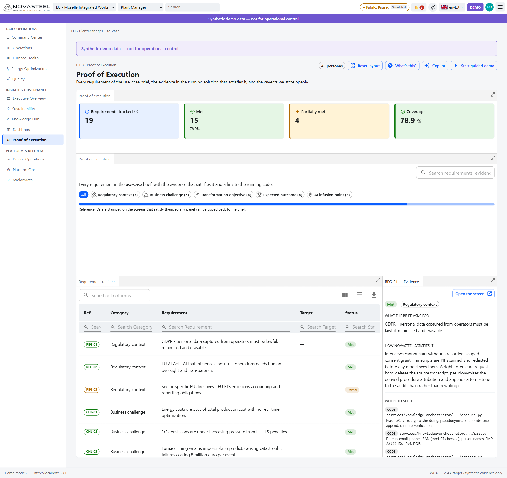
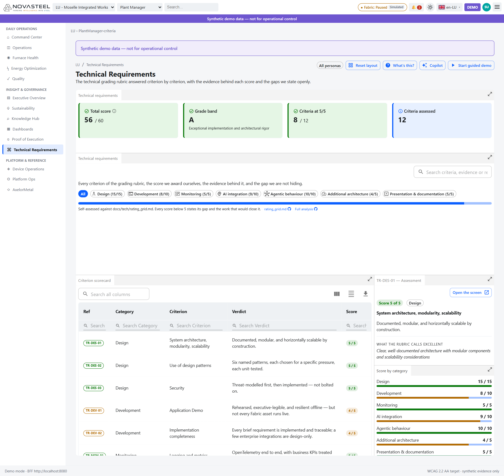

# 12 · Proof of Execution & Technical Requirements

**Audience:** jury, examiner, auditor, developer, or newcomer who wants proof  
**Reading time:** 30 minutes  
**Persona:** all personas; especially a defense panel  
**Routes covered:** `/{site}/proof-of-execution/requirements`, `/{site}/proof-of-execution/use-case`, `/{site}/technical-requirements/criteria`  
**Last updated:** 2026-07-27  
**Language:** 🇫🇷 [Version française](../fr/12-proof-of-execution.md)

---

## Requirement Register — `/{site}/proof-of-execution/requirements`

**In one sentence.** The evidence ledger: every statement in the use-case brief has a stable ID, status, proving screen, evidence and caveat (`apps\analytics-mfe\src\components\screens\ProofOfExecution.tsx`; `apps\analytics-mfe\src\proof\proofCatalog.ts`).

**Background for newcomers.** A proof register is a checklist for an examiner. Instead of claiming “NovaSteel satisfies the brief,” the app lists what is proven, where to see it, and what remains simulated. The same IDs are stamped on proving screens, so `OUT-03` always means the 21-day furnace-lining warning (`docs\presentation\proof_of_execution.md`; `ProofOfExecution.tsx`).

**Status vocabulary.**

| Status | Meaning | Why it matters |
|---|---|---|
| Met | Capability exists and runs in the demo. | A reviewer can click to a proving screen (`proofCatalog.ts`). |
| Partial | Capability exists but is narrower than the brief. | The limitation is stated before anyone discovers it by search (`docs\presentation\proof_of_execution.md`). |
| Demo surrogate | Mechanism is real; headline number is a synthetic target. | It separates “control built” from “real plant achieved it” (`proofCatalog.ts`). |

**What you see on screen.**
1. KPI cards show **19** requirements, **15** met, **4** partial/demo and **78.9%** coverage, computed by `proofCoverage()` (`proofCatalog.ts`; `ProofOfExecution.tsx`).
2. Category chips split the register into Regulatory context, Business challenge, Transformation objective, Expected outcome and AI infusion point (`proofCatalog.ts`).
3. The search box matches IDs, statements, targets, caveats and evidence (`ProofOfExecution.tsx`).
4. The progress bar is not 100%, deliberately, because caveats remain visible (`ProofOfExecution.tsx`; `docs\presentation\proof_of_execution.md`).
5. The register table has Ref, Category, Requirement, Target and Status columns, with sorting, search and export (`ProofOfExecution.tsx`; `docs\ux\dashboard-specification.md`).
6. The detail panel shows the selected row, explanation, evidence links and **Open the screen** when a proving route exists (`ProofOfExecution.tsx`).
7. The screenshot selects `REG-01`, explaining GDPR consent, personal-data minimization, erasure and audit tombstones (`proofCatalog.ts`).

**Why this component was implemented.** The brief lists regulatory context, five business challenges, four objectives, four expected outcomes and three AI infusion points (`docs\usecase\usecase.md`). The register turns those statements into traceable evidence instead of slideware (`docs\presentation\proof_of_execution.md`; `proofCatalog.ts`).

**Full requirement register.** This table reproduces the catalog in beginner-friendly wording (`apps\analytics-mfe\src\proof\proofCatalog.ts`).

| ID | Requirement, in plain language | Status | Proving screen(s) | Evidence |
|---|---|---|---|---|
| `REG-01` | Operator personal data must be lawful, minimized and erasable under the General Data Protection Regulation (GDPR). | Met | Sustainability & Compliance → Audit & Reports | Consent, PII redaction, erasure, tombstone audit; privacy routes (`proofCatalog.ts`). |
| `REG-02` | AI affecting industrial operations needs human oversight and transparency under the EU AI Act. | Met | Energy Optimization; Audit & Reports | Gated state graph, forbidden tools, prompt defense, content safety, approval alert (`proofCatalog.ts`). |
| `REG-03` | EU Emissions Trading System (EU ETS) accounting must be reportable. | Partial | ETS Exposure; Emissions Ledger | Gold-layer emissions and summary routes; demo constants caveat (`proofCatalog.ts`). |
| `CHL-01` | Energy is 35% of production cost and needs real-time optimization. | Met | Spot & Schedule; Load-Shift Simulator | Mixed-integer linear program (MILP); `POST /v1/energy/schedules:simulate` (`proofCatalog.ts`). |
| `CHL-02` | CO₂ is under EU ETS penalty pressure. | Met | Emissions Ledger | Carbon term in optimizer objective, emissions metric and ledger (`proofCatalog.ts`). |
| `CHL-03` | Furnace lining wear must be predicted before €8M failures. | Met | Lining Forecast | Physics features, remaining-useful-life (RUL) model, `GET /v1/furnaces/{assetId}/lining-forecast` (`proofCatalog.ts`). |
| `CHL-04` | High-grade automotive steel quality is inconsistent. | Met | Batch Quality; Defect Analytics (SPC) | Batch risk, statistical process control (SPC), quality what-if (`proofCatalog.ts`). |
| `CHL-05` | Retiring skilled operators are taking knowledge with them. | Met | Procedures; Capture Status | Consent-bound interviews, reviewed procedures, approved-only retrieval (`proofCatalog.ts`). |
| `OBJ-01` | Reduce energy consumption. | Met | Energy Optimization; Command Center | Energy per tonne from solved schedule (`proofCatalog.ts`). |
| `OBJ-02` | Predict equipment failures. | Met | Lining Forecast; Maintenance Planner | Continuous RUL scoring and Real-Time Intelligence activator (`proofCatalog.ts`). |
| `OBJ-03` | Improve steel quality. | Met | Quality screens | Predicted first-pass yield, defect Pareto, SPC and bounded what-if (`proofCatalog.ts`). |
| `OBJ-04` | Capture and structure operational expertise. | Met | Capture Status | Spoken interview to cited, reviewed, versioned procedure (`proofCatalog.ts`). |
| `OUT-01` | Energy consumption per tonne reduced by 14%. | Demo surrogate | Command Center; Executive Overview | Mechanism computes energy per tonne; −14% is synthetic target (`proofCatalog.ts`). |
| `OUT-02` | CO₂ emissions reduced by 22%. | Demo surrogate | Emissions Ledger; Executive Overview | Scope 2 recomputation; −22% is wider ambition, not demo result (`proofCatalog.ts`). |
| `OUT-03` | Furnace lining failure predicted with 21-day advance warning. | Met | Lining Forecast | Alert threshold P50 ≤ 21 days and risk ≥ 0.80 (`proofCatalog.ts`). |
| `OUT-04` | High-grade steel yield improved by 8 percentage points. | Demo surrogate | Batch Quality; Executive Overview | Scored synthetic yield; +8 is manifest target (`proofCatalog.ts`). |
| `AI-01` | Physics-informed machine learning predicts lining degradation from thermal signatures. | Met | Thermal Explorer | Thermal features and regression with uncertainty (`proofCatalog.ts`). |
| `AI-02` | Energy-dispatch agent schedules energy-intensive work around spot prices. | Met | Load-Shift Simulator | MILP solver, agent handoff and human approval route (`proofCatalog.ts`). |
| `AI-03` | Generative AI captures operator knowledge into searchable procedures. | Met | Procedures | Speech-to-text, grounded extraction, critic loop, hybrid retrieval (`proofCatalog.ts`). |

**Anti-drift design.** The markdown projection `docs\presentation\proof_of_execution.md`, the in-app screen, proof badges and this guide all point back to `apps\analytics-mfe\src\proof\proofCatalog.ts`. `ProofOfExecution.tsx` imports `PROOF_REQUIREMENTS`, and badges resolve through `PROOF_BY_ID`; an ID cannot silently mean different things on different screens (`ProofOfExecution.tsx`; `proofCatalog.ts`).

**Objective & evidence (proof of execution).**

| Use-case element | Requirement ID | Evidence in the running app | Where the number comes from (API route + source file) |
|---|---|---|---|
| Whole brief | `REG-01`…`AI-03` | Searchable register with caveats and open-screen links | No BFF route; `ProofOfExecution.tsx` imports `PROOF_REQUIREMENTS` from `proofCatalog.ts`. |
| Coverage score | All 19 | 19 total, 15 met, 4 partial/demo, 78.9% | `proofCoverage()` in `proofCatalog.ts`. |
| Stable IDs on screens | All 19 | Proof chips and detail panel | `ProofBadge` resolves `PROOF_BY_ID` (`ProofOfExecution.tsx`; `proofCatalog.ts`). |

**How the data reaches this screen.** `ProofOfExecution.tsx` → `PROOF_REQUIREMENTS`, `PROOF_CATEGORY_ORDER`, `proofCoverage()` → no BFF route → local catalog (`apps\analytics-mfe\src\proof\proofCatalog.ts`). Clicking a proving screen navigates to the destination, which then uses its own `DataClient` and BFF path if required (`apps\analytics-mfe\src\api\dataClient.ts`).

**Honesty & caveats.** The register is credible because it is not all green: `REG-03` is Partial; `OUT-01`, `OUT-02` and `OUT-04` are Demo surrogate (`proofCatalog.ts`). The proof document explicitly says caveats should be stated before a jury finds them by grep (`docs\presentation\proof_of_execution.md`).

**Try it yourself.** Open `http://localhost:5266/{site}/proof-of-execution/requirements`, search for `OUT-02` or `GDPR`, select a row and use **Open the screen**.

---

## Use Case — `/{site}/proof-of-execution/use-case`

**In one sentence.** The Use Case tab brings the original brief into the app and binds each brief line to proof IDs (`apps\analytics-mfe\src\components\screens\UseCaseBrief.tsx`).

**Background for newcomers.** A use-case brief is the short business story: industry, challenge, transformation objective, expected outcomes and AI mechanisms. NovaSteel’s source brief is `docs\usecase\usecase.md`; the component reproduces those sections with proof badges (`UseCaseBrief.tsx`; `docs\usecase\usecase.md`).

**What you see on screen.**
1. **Two tabs.** `Requirement Register` and `Use Case` sit above the workspace; the Use Case tab is the one selected here (`apps\analytics-mfe\src\components\screens\ProofOfExecution.tsx`).
2. **KPI band.** Requirements tracked **19**, Met **15**, Partially met **4**, Coverage **78.9 %** — computed from the same catalog the register uses, so the two tabs can never disagree (`UseCaseBrief.tsx`; `apps\analytics-mfe\src\proof\proofCatalog.ts`).
3. **Source of truth panel.** Titled *NovaSteel — AI-Powered Steel Production Optimization Platform*, it states “The original brief, reproduced word for word, with the reference ID that proves each statement”, links out to `docs/usecase/usecase.md` on GitHub, and shows a green **15 of 19 statements evidenced** chip (`UseCaseBrief.tsx`; `docs\usecase\usecase.md`).
4. **Industry profile.** Industry *Heavy Industry & Metals*, headquarters *Luxembourg*, operating region *Luxembourg, Germany, Belgium, Spain*, regulatory context *GDPR · EU AI Act · Sector-specific EU Directives* — the last row carrying the `REG-01`, `REG-02` and `REG-03` badges (`UseCaseBrief.tsx`).
5. **Business challenge panel.** The five challenges from the brief, each with its badge: energy at 35 % of production cost (`CHL-01`), ETS pressure on CO₂ (`CHL-02`), unpredictable lining wear costing €8M per event (`CHL-03`), quality consistency for automotive customers (`CHL-04`), and retiring operators (`CHL-05`).
6. **Transformation objective panel.** Reduce energy consumption (`OBJ-01`), predict equipment failures (`OBJ-02`), improve steel quality (`OBJ-03`), and capture expert knowledge (`OBJ-04`).
7. **Expected outcome and AI infusion point panels.** The target figures (e.g. energy per tonne −14 %) and the AI mechanisms — a physics-informed ML model predicting lining degradation from thermal signatures (`AI-01`) and an energy dispatch optimization agent scheduling around spot prices (`AI-02`).

**How to read the badge colours.** Green means the linked requirement is `met`; amber means `partial` or `demo`. A badge is not decoration — click through to the register tab and the same ID carries its evidence and its caveat (`UseCaseBrief.tsx`; `proofCatalog.ts`).

**Why this component was implemented.** The brief says to implement an “AI-driven production optimization platform” and lists measurable outcomes (`docs\usecase\usecase.md`). Rendering the brief inside the app prevents a gap between what the presenter says and what the application proves (`UseCaseBrief.tsx`; `docs\presentation\proof_of_execution.md`).

**Objective & evidence (proof of execution).**

| Use-case element | Requirement ID | Evidence in the running app | Where the number comes from (API route + source file) |
|---|---|---|---|
| Brief rendered in app | All 19 | Use Case component maps brief lines to badges | No BFF route; arrays `PROFILE`, `CHALLENGES`, `OBJECTIVES`, `OUTCOMES`, `AI_POINTS` in `UseCaseBrief.tsx`. |
| Source traceability | All 19 | Source link to `docs/usecase/usecase.md` | `USECASE_SOURCE_URL` in `UseCaseBrief.tsx`; source file `docs\usecase\usecase.md`. |
| Honest status display | All 19 | Badge color derives from linked proof IDs | `statusOf()` reads `PROOF_BY_ID` (`UseCaseBrief.tsx`; `proofCatalog.ts`). |

**How the data reaches this screen.** `UseCaseBrief.tsx` → local arrays lifted from `docs\usecase\usecase.md` → `PROOF_BY_ID` and `proofCoverage()` → no BFF route. Proving screens then use their own data routes (`UseCaseBrief.tsx`; `dataClient.ts`).

**Honesty & caveats.** The Use Case tab is a projection of the register, not a second source of truth — if a requirement slips, both tabs move together. The headline **78.9 % coverage** is deliberately not 100 %: four statements are only partially evidenced or shown through a demo surrogate, and the tab says so rather than hiding them (`UseCaseBrief.tsx`; `proofCatalog.ts`).

**Try it yourself.** Open `http://localhost:5266/lu/proof-of-execution/use-case`, read the *Business challenge* panel, then click the **Requirement Register** tab and find `CHL-03` — the €8M lining failure — to see the evidence behind the badge you just read.

---

## Technical Requirements — `/{site}/technical-requirements/criteria`

**In one sentence.** The grading rubric answered criterion by criterion: for each of the 12 technical criteria the app shows the score it awards itself, the evidence behind that score and — when the score is below 5 — the gap and the work that would close it (`apps\analytics-mfe\src\components\screens\TechnicalRequirements.tsx`; `apps\analytics-mfe\src\proof\technicalCatalog.ts`).

**Background for newcomers.** The two screens above answer *“does the app do what the business asked?”*. This one answers a different question: *“is it built well?”* A **rubric** (or rating grid) is the marking scheme an examiner uses — architecture, design patterns, security, monitoring, AI, and so on — each scored out of 5. NovaSteel publishes its own score against that grid inside the product, so nothing has to be taken on trust (`docs\tech\rating_grid.md`).

**Why it looks like the Proof of Execution screen.** It is deliberate. A jury moving between the two tabs only has to learn one layout: KPI band → category chips → searchable table → detail panel on the right (`TechnicalRequirements.tsx`).

**What you see on screen.**
1. **KPI band.** **Total score 56 / 60**, **Grade band A** — *“Exceptional implementation and architectural rigor”* —, **Criteria at 5/5: 8 / 12**, and **Criteria assessed: 12** (`techScorecard()` in `technicalCatalog.ts`).
2. **Category chips with running subtotals.** Design (15/15), Development (8/10), Monitoring (5/5), AI integration (9/10), Agentic behaviour (10/10), Additional architecture (4/5), Presentation & documentation (5/5). Click one to filter the table (`TechnicalRequirements.tsx`).
3. **A progress bar** for the total, plus the sentence *“Self-assessed against docs/usecase/rating_grid.md. Every score below 5 states its gap and the work that would close it.”* with two GitHub links: **rating_grid.md** and **Full analysis** (`RUBRIC_URL` in `TechnicalRequirements.tsx`).
4. **Search box** — it matches the ID, criterion, rubric bar, verdict, explanation, gap, uplift and every evidence label at once (`TechnicalRequirements.tsx`).
5. **Criterion scorecard table** with Ref, Category, Criterion, Verdict and Score columns, per-column search, column chooser, density toggle and export (`TechnicalRequirements.tsx`).
6. **Assessment panel** on the right. In the screenshot `TR-DES-01` is selected: a green **Score 5 of 5** chip, the **Design** category chip, the criterion title, the verdict, a *WHAT THE RUBRIC CALLS EXCELLENT* block quoting the rubric verbatim, and an **Open the screen** button that jumps to the screen which demonstrates the criterion.
7. **Score by category** panel underneath, one bar per category — green when the category is perfect, amber when points were left on the table.

**How to read the score colours.** Green = 5 / 5, amber = 4 / 5, red = 3 or below. There is no red on this screen today, but the amber is real and is meant to be seen (`scoreColor()` in `TechnicalRequirements.tsx`).

**Why this component was implemented.** A defense is graded against a rubric, and the honest move is to grade yourself first, in public, in the running product. Putting the self-assessment on screen — with the gaps attached — turns a claim (“the architecture is modular”) into something a reviewer can click through to the code that proves it (`docs\tech\rating_grid.md`; `docs\tech\technical-analysis.md`).

**The full rubric, criterion by criterion.** This table reproduces the catalog in beginner-friendly wording (`apps\analytics-mfe\src\proof\technicalCatalog.ts`).

| Ref | Category | Criterion | Score | Verdict, in plain language |
|---|---|---|---|---|
| `TR-DES-01` | Design | System architecture, modularity, scalability | 5 / 5 | Documented, modular and horizontally scalable by construction. |
| `TR-DES-02` | Design | Use of design patterns | 5 / 5 | Six named patterns, each chosen for a specific pressure, each unit-tested. |
| `TR-DES-03` | Design | Security | 5 / 5 | Threat-modelled first, then implemented — not bolted on. |
| `TR-DEV-01` | Development | Application demo | 4 / 5 | Rehearsed, executive-legible and resilient offline — but not every Fabric asset runs live. |
| `TR-DEV-02` | Development | Implementation completeness | 4 / 5 | Every brief requirement is implemented and traceable; a few enterprise integrations are design-only. |
| `TR-MON-01` | Monitoring | Logging and metrics | 5 / 5 | OpenTelemetry end to end, with business KPIs treated as first-class metrics. |
| `TR-AI-01` | AI integration | Use of AI technologies | 5 / 5 | Four distinct AI techniques, each answering a named line of the brief. |
| `TR-AI-02` | AI integration | AI model selection and deployment | 4 / 5 | Tiered model choice deployed securely in the EU — but the lifecycle story is documented, not tooled. |
| `TR-AGT-01` | Agentic behaviour | Autonomy and orchestration | 5 / 5 | A real state graph with autonomous safety work and a deliberate human gate. |
| `TR-AGT-02` | Agentic behaviour | Multi-agent coordination | 5 / 5 | All three named patterns — handoff, reflection and state graph — are implemented and traced. |
| `TR-ARC-01` | Additional architecture | Performance and reliability | 4 / 5 | Reliability is engineered into the design; it is not yet backed by measurement. |
| `TR-PRE-01` | Presentation & documentation | Clarity of explanation and presentation | 5 / 5 | Three audience registers — executive, technical and novice — each served deliberately. |

**The four gaps, stated openly.** These are the only criteria below 5, and the app prints each gap next to its score rather than rounding it away (`technicalCatalog.ts`).

| Ref | What is honestly missing |
|---|---|
| `TR-DEV-01` | Some Fabric artefacts (notebooks, Activator rules, the Real-Time Intelligence eventstream) are provisioned as templates and demonstrated from captured output rather than executed live inside the 10-minute demo window. |
| `TR-DEV-02` | Manufacturing Execution System (MES) and batch-historian integrations are specified in the architecture but not implemented; the demo reads a synthetic feed in their place. |
| `TR-AI-02` | There is no model registry artefact, training notebook or automated evaluation gate in the repository. Model versioning is a constant in code and the physics model is fitted analytically rather than trained, so the lifecycle is described in documentation rather than enforced by tooling. |
| `TR-ARC-01` | No load-test results, no published Service Level Objective / Agreement targets, and no circuit-breaker middleware in code. The reliability claims rest on infrastructure configuration and design intent rather than on measured behaviour under load. |

**Objective & evidence (proof of execution).**

| Use-case element | Requirement ID | Evidence in the running app | Where the number comes from (API route + source file) |
|---|---|---|---|
| Build quality is defensible | — (rubric, not brief) | 12 criteria, 56/60, grade A, with per-criterion evidence links | No BFF route; `techScorecard()` and `TECH_REQUIREMENTS` in `apps\analytics-mfe\src\proof\technicalCatalog.ts`. |
| Every score traces to code | — | Evidence chips resolve to GitHub file links | `githubUrlFor()` in `apps\analytics-mfe\src\proof\proofCatalog.ts`, reused by `TechnicalRequirements.tsx`. |
| Every gap has a named fix | `TR-DEV-01`, `TR-DEV-02`, `TR-AI-02`, `TR-ARC-01` | `gap` + `uplift` shown in the assessment panel | `gap` / `uplift` fields in `technicalCatalog.ts`. |
| Criterion → proving screen | 10 of 12 | **Open the screen** button | `primaryRoute` in `technicalCatalog.ts`; navigation via the `nav.intent` event (`TechnicalRequirements.tsx`). |

**How the data reaches this screen.** `TechnicalRequirements.tsx` → `TECH_REQUIREMENTS`, `TECH_CATEGORY_ORDER`, `techScorecard()` → **no BFF route** → the local catalog (`apps\analytics-mfe\src\proof\technicalCatalog.ts`). Like the register, it is a pure client-side projection of one file, so it renders identically offline. The long-form narrative behind the same scores lives in `docs\tech\technical-analysis.md`, and the rubric it is scored against in `docs\tech\rating_grid.md`; the three must be kept in step by hand.

**Honesty & caveats.** The score is a **self-assessment**, not an external audit — the screen says so in its own subtitle. 56/60 is not 60/60 on purpose: four criteria carry an amber score and a written gap. And because the catalog is a TypeScript file rather than a generated artefact, keeping it aligned with `docs\tech\technical-analysis.md` is a discipline, not an automated guarantee (`technicalCatalog.ts`).

**Try it yourself.** Open `http://localhost:5266/lu/technical-requirements/criteria`, click the amber **Development (8/10)** chip to filter down to the two 4/5 criteria, select `TR-DEV-02` and read its gap — then press **Open the screen** and land on the Requirement Register you read about at the top of this chapter.

---

[◀ Previous: 11 · Dashboard Collections](11-dashboard-collections.md) · [▲ Index](README.md) · [Next ▶ 13 · Platform Ops](13-platform-ops.md)
