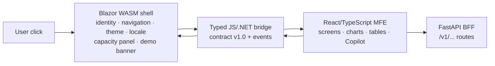
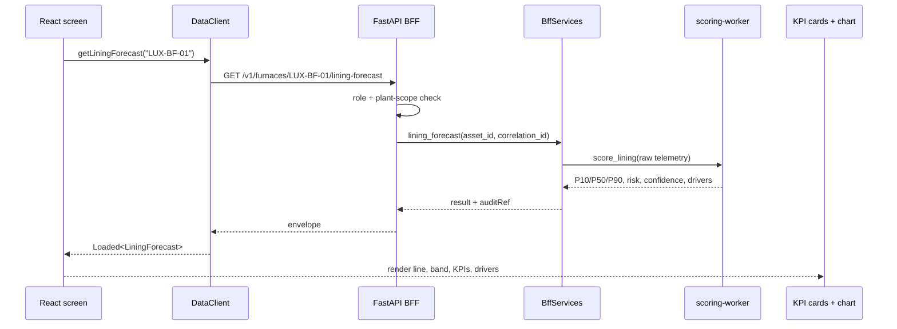
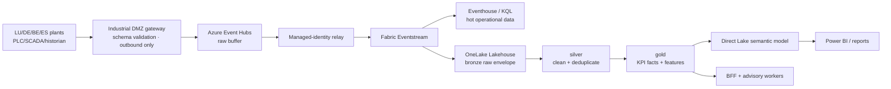

# 17 · How it works behind the screens

**Audience:** complete newcomers who need to explain what happens after a click.  
**Reading time:** ~18 minutes.  
**Last updated:** 2026-07-27  
**Language:** 🇫🇷 [Version française](../fr/17-how-it-works-behind-the-screens.md)

---

## The short answer

When you click a NovaSteel screen, three layers cooperate:

1. the **Blazor WebAssembly shell** owns the permanent application frame, route, site/persona selectors, locale, theme, demo banner, account menu, and Fabric-capacity control surface (`apps\portal-shell\Layout\MainLayout.razor:7-170`; `apps\portal-shell\Services\ShellState.cs:23-58`);
2. the **typed bridge** passes shell context into React and sends React events back to C# (`apps\portal-shell\Components\AnalyticsBridge.razor:20-44`; `apps\portal-shell\wwwroot\js\analyticsBridge.js:21-48`);
3. the **React/TypeScript microfrontend** renders the industrial screens, charts, tables, Dockview workspace, Copilot dock, and data clients (`apps\analytics-mfe\src\bridge.tsx:6-29`; `apps\analytics-mfe\src\components\screens\screenRegistry.ts:32-68`).

The local demo is deterministic and synthetic. NovaSteel is advisory-only: it never writes to a PLC, safety interlock, furnace, setpoint, recipe, CMMS, or production schedule (`docs\architecture\solution-architecture.md:22-29`; `README.md:35-39`).

---

## 1. The three-layer front end



| Layer | What it owns | Why that split exists |
|---|---|---|
| Blazor shell | Chrome, route grammar `/{site}/{section}/{subView}`, site/persona selectors, locale, theme, BFF connection pill, account menu, capacity panel. | The architecture keeps a C# shell while React handles dense dashboards (`docs\architecture\solution-architecture.md:40-50`; `apps\portal-shell\Pages\AnalyticsHost.razor:1-13`). |
| Bridge / contract | `themeMode`, `locale`, `activePersona`, `site`, `tokenRef`, `bffBaseUrl`, `permittedActions`, `navigation`, bridge version `1.0`. | The shell and MFE exchange a versioned, typed shape instead of guessing (`contracts\ui\shell-interop.v1.schema.json:1-83`; `apps\analytics-mfe\src\types.ts:9-35`). |
| React MFE | Screen registry, KPI cards, Dockview panels, D3-style charts, data tables, data clients, Copilot client. | MUI/D3/React are the dashboard layer; the shell still owns host lifecycle and identity context (`apps\analytics-mfe\src\components\screens\screenRegistry.ts:32-68`; `apps\analytics-mfe\src\api\dataClient.ts:103-149`). |

React can ask the shell to do shell-owned things. It emits `nav.intent` for navigation, `capacity.request` for BFF-mediated capacity actions, `capacity.panel` to open the shell capacity panel, `toast` for messages, and `telemetry` for bridge events (`apps\portal-shell\Pages\AnalyticsHost.razor:43-84`; `apps\analytics-mfe\src\components\screens\PlatformCapacity.tsx:74-99`). Capacity mutations go through the shell and include idempotency keys, so duplicate clicks do not become duplicate operations (`apps\portal-shell\Services\CapacityService.cs:56-110`).

---

## 2. One concrete request path: Furnace Lining Forecast

Open:

`http://localhost:5266/lu/furnace-health/lining-forecast`

The shell accepts `/{Site}/{Section}/{SubView}` and applies the route into shell state (`apps\portal-shell\Pages\AnalyticsHost.razor:1-39`). React maps `furnace-health/lining-forecast` to `FurnaceLiningForecast` (`apps\analytics-mfe\src\components\screens\screenRegistry.ts:33-38`).



The front-end screen calls `client.getLiningForecast(FURNACE_ASSET)`, where `FURNACE_ASSET` is `LUX-BF-01` (`apps\analytics-mfe\src\components\screens\FurnaceLiningForecast.tsx:18-55`). `DataClient.getLiningForecast()` calls `/v1/furnaces/${assetId}/lining-forecast` (`apps\analytics-mfe\src\api\dataClient.ts:169-173`). The BFF route is `@app.get("/v1/furnaces/{asset_id}/lining-forecast")`; it requires `MaintenanceEngineer.Read` or `Operator.Read`, verifies asset access, calls `services.lining_forecast(...)`, then returns an envelope (`services\bff-api\src\bff_api\routes.py:210-224`).

A **BFF** means **backend-for-frontend**: a server-side API shaped for the browser. It keeps authorization, audit, adapters, fixture loading, and worker calls away from the browser while returning predictable UI envelopes (`services\bff-api\src\bff_api\main.py:61-94`; `docs\implementation\api-contracts.md:59-65`).

The chart is computed in the UI from the response: React builds a 31-day risk projection using the P10/P50/P90 band and draws the median, uncertainty band, and 80% threshold (`apps\analytics-mfe\src\components\screens\FurnaceLiningForecast.tsx:21-38`; `apps\analytics-mfe\src\components\screens\FurnaceLiningForecast.tsx:118-140`).

---

## 3. Demo mode versus cloud mode

NovaSteel uses the same API boundaries in local and cloud-shaped modes. What changes is the adapter behind the boundary.

| Case | What happens |
|---|---|
| `DEMO_MODE=local` | The BFF defaults to `NS-DEMO-LUX-01`, accepts only documented `X-Demo-*` headers, known roles, and `NS-DEMO-*` plant scope (`services\bff-api\src\bff_api\config.py:93-168`; `services\bff-api\src\bff_api\auth.py:148-206`). |
| Local fixtures | The file-backed repository verifies fixture checksums and rejects local demo records unless they are `SYNTHETIC`, `DEMO-NONPERSONAL`, and in an `NS-DEMO-*` namespace (`services\bff-api\src\bff_api\repository.py:15-82`). |
| Configured cloud boundary | Azure Table audit/idempotency adapters are selected when the table endpoint is configured; otherwise local in-memory adapters are used (`services\bff-api\src\bff_api\adapters\factory.py:20-74`). |

**Determinism** means the same scenario and seed produce the same story. Synthetic records carry classification, privacy label, scenario, generator version, and seed (`docs\data\synthetic-data-and-simulators.md:7-17`). The validation report says independent generations and BFF re-runs matched and checksum/tamper protection passed (`docs\validation-report.md:41-49`).

---

## 4. Target cloud architecture, explained for beginners

The local app you run today is the Blazor shell, React bundle, FastAPI BFF, deterministic fixtures, and Python workers (`README.md:97-129`; `docs\README.md:62-75`). The target cloud architecture keeps the same flow but adds governed Microsoft Fabric data services.



| Component | Beginner meaning | NovaSteel use |
|---|---|---|
| Industrial DMZ gateway | A controlled buffer between plant networks and cloud. | It sends validated data outward; no cloud session reaches down into PLC/safety networks (`docs\architecture\deployment-topology.md:52-112`). |
| Azure Event Hubs | A durable event waiting room. | It buffers and replays plant telemetry before Fabric receives it (`docs\architecture\solution-architecture.md:57-90`). |
| Eventstream | Fabric's streaming entry point. | It routes events to hot KQL and a landing Lakehouse (`docs\architecture\solution-architecture.md:119-133`). |
| Eventhouse / KQL | Fast query store for recent telemetry and alarms. | Used for hot investigation and RTI dashboards (`docs\architecture\solution-architecture.md:121-126`). |
| OneLake / Lakehouse medallion | Governed historical store: bronze raw, silver cleaned, gold business facts. | Used for KPI truth, model features, and audit history (`docs\architecture\solution-architecture.md:148-157`). |
| Direct Lake + Power BI | One semantic model over gold data. | Board/reporting surfaces read shared KPI definitions without a second copied BI store (`docs\architecture\solution-architecture.md:127-132`). |

**Deployment honesty:** this guide follows the local deterministic baseline. `docs\README.md` states that no Azure, Fabric, Foundry, Speech, Eventstream, or Power BI tenant deployment has been performed for that baseline (`docs\README.md:1-9`). Fabric assets are source-controlled and locally validated, but tenant workspace/capacity/item deployment, RLS, and live query behavior remain unproven there (`docs\README.md:79-87`; `fabric\README.md:7-24`).

---

## 5. The three AI components

| Component | Takes in | Returns | How it is kept honest |
|---|---|---|---|
| Physics-informed RUL regression | Furnace telemetry for refractory thickness, heat flux, cooling water, and thermal features. | P10/P50/P90 remaining useful life, risk score, confidence, feature snapshot, and drivers. | It uses transparent least-squares regression and physical features, then records an audit entry (`services\scoring-worker\src\scoring_worker\rul_model.py:1-9`; `services\scoring-worker\src\scoring_worker\rul_model.py:106-197`; `services\bff-api\src\bff_api\services.py:95-126`). |
| MILP energy dispatch optimizer | Energy intervals, price, carbon intensity, heat batches, and constraints. | Baseline vs optimized schedule and savings. | It pins urgent batches, limits shift windows, enforces concurrency, and remains advisory/shadow approval only (`services\optimizer-worker\src\optimizer_worker\milp.py:1-8`; `services\optimizer-worker\src\optimizer_worker\milp.py:67-145`; `docs\validation-report.md:45`). |
| Grounded RAG / Copilot knowledge pipeline | Consent-bound transcripts, approved procedures, screen context, glossary, and curated grounding. | Cited answers, draft procedures, suggestions, and screen explanations. | Only approved procedures are indexed; retrieval uses BM25+cosine fusion; citations, content-term guards, a critic loop, and content safety restrict output (`services\knowledge-orchestrator\src\knowledge_orchestrator\retrieval.py:1-10`; `services\knowledge-orchestrator\src\knowledge_orchestrator\critic.py:1-9`; `services\knowledge-orchestrator\src\knowledge_orchestrator\content_safety.py:1-22`). |

The rule is: Python computes authoritative numbers; language models explain, retrieve, draft, or assist. Consequential outputs need human approval and audit linkage (`docs\architecture\solution-architecture.md:15-20`; `docs\presentation\faq.md:111-129`).

---

## 6. Security, identity, and governance

| Topic | Plain-language explanation | Source |
|---|---|---|
| Demo headers | Local mode uses `X-Demo-User`, `X-Demo-Roles`, `X-Demo-Plants`, display name, and locale; these are not accepted as real production identity. | `apps\analytics-mfe\src\config.ts:91-99`; `services\bff-api\src\bff_api\auth.py:148-206` |
| Real Entra identity | Non-demo mode requires a bearer token validated by an organization-provided Entra/JWKS boundary and fails closed if not configured. | `services\bff-api\src\bff_api\auth.py:97-145`; `docs\implementation\api-contracts.md:46-55` |
| Role gates | Stable app roles gate screens/routes: examples include `MaintenanceEngineer.Read`, `EnergyPlanner.Approve`, `Knowledge.Publisher`, `Platform.Capacity.Manage`. | `docs\implementation\api-contracts.md:30-44`; `services\bff-api\src\bff_api\routes.py:210-224` |
| Audit hash-chain | Consequential outputs are append-only; later outcomes append a new record rather than rewriting the original. | `docs\implementation\api-contracts.md:846-865`; `README.md:176-181` |
| Idempotency keys | Mutating capacity requests include `Idempotency-Key` to protect against duplicate submissions. | `apps\portal-shell\Services\CapacityService.cs:56-110`; `services\bff-api\src\bff_api\adapters\factory.py:46-74` |
| GDPR Article 17 | Erasure is designed across knowledge, Copilot, audit, and tombstone stores while preserving audit invariants. | `docs\README.md:32-50`; `docs\security\security-governance-and-threat-model.md:21-27` |
| EU AI Act | Final legal classification is a production gate; the design uses human oversight, logging, transparency, safety, and conservative treatment. | `docs\presentation\faq.md:111-129`; `docs\security\security-governance-and-threat-model.md:21-27` |
| WCAG target | The shell includes skip links, labels, accessible dialogs, and a footer stating WCAG 2.2 AA target. | `apps\portal-shell\Layout\MainLayout.razor:7-19`; `apps\portal-shell\Layout\MainLayout.razor:163-166`; `apps\portal-shell\Components\CapacityPanel.razor:5-17` |
| Protected package feeds | Python and NuGet restores must use Microsoft-protected feeds only; do not add unapproved sources. | `README.md:41-55`; `docs\tech\security_requirement.md:16-27`; `package.json:14-17` |

---

## 7. Quality gates

The documented baseline reports **571 automated tests** and **19 validation gates** passing: 8 contract, 60 simulator, 112 backend/integration, 230 knowledge/Copilot, 47 frontend, and 114 infrastructure (`docs\README.md:89-94`). The validation report records 66/66 persona/demo driver checks and 12/12 offline-fallback checks (`docs\validation-report.md:35-50`).

Run the broad local validation from the repository root:

```powershell
pwsh .\tools\validation\Validate-Repository.ps1 `
    -EvidencePath .\artifacts\validation\final\evidence-manifest.json
```

That is the no-cloud evidence refresh command (`docs\validation-report.md:26-33`; `README.md:84-95`). Targeted commands documented by the traceability guide are:

```powershell
npm run test:frontend
npm run test:bff
pytest tests/e2e
pytest tests/infra/test_capacity_sku_allow_list.py
npm run build
```

They cover frontend behavior, BFF behavior, persona journeys, capacity SKU allow-list enforcement, and build (`docs\presentation\assets\app-guide\en\16-traceability-matrix.md:165-176`).

---

## 8. Repository map

| Folder | What a newcomer finds |
|---|---|
| `apps` | `portal-shell` Blazor/C# and `analytics-mfe` React/TypeScript (`README.md:266-272`). |
| `services` | FastAPI BFF, optimizer, scoring, ingest, knowledge, and Copilot services (`README.md:272-273`). |
| `simulator` | Deterministic scenario generator, validators, and CLI (`README.md:274-275`). |
| `contracts` | UI, event, data, and API contracts (`README.md:275-276`). |
| `fabric` | Fabric definitions, KQL, Lakehouse, notebooks, pipelines, semantic model, validators (`fabric\README.md:26-49`). |
| `infra` | Bicep, policies, and OIDC deployment scripts (`README.md:276-277`). |
| `tests` | Contract, simulator, backend, integration, E2E, infra, and knowledge tests (`README.md:278-279`). |
| `tools` | Validation scripts, feed/security scans, SBOM, PPTX validation (`README.md:279-280`). |
| `docs` | Architecture, operations, demo runbook, presentation, security, research, and this guide (`README.md:280-281`). |
| `artifacts` | Validation, rehearsal, fallback, and final-handoff evidence (`README.md:280-281`). |

---

◀ [16 · Traceability matrix](16-traceability-matrix.md) · ▲ [Index](README.md) · [18 · Guided demo walkthrough](18-guided-demo-walkthrough.md) ▶
