# 18 · Guided demo walkthrough

**Audience:** a newcomer rehearsing the NovaSteel demo alone at `http://localhost:5266`.  
**Reading time:** ~20 minutes.  
**Last updated:** 2026-07-27  
**Language:** 🇫🇷 [Version française](../fr/18-guided-demo-walkthrough.md)

---

## 0. Prerequisites and startup

Run commands from the repository root. Do not add unapproved Python or NuGet package sources; the repository uses Microsoft-protected feeds (`README.md:41-55`; `docs\tech\security_requirement.md:16-27`).

Build once if the React bundle or portal changed:

```powershell
npm run build:analytics
dotnet restore .\apps\portal-shell\PortalShell.csproj --configfile .\NuGet.Config --locked-mode
npm run build:portal
```

These are the portal build commands in the root handoff (`README.md:102-108`).

Start the BFF:

```powershell
npm run run:bff
```

Verify it:

```powershell
Invoke-RestMethod http://127.0.0.1:8080/health/ready
```

The BFF serves the committed deterministic `demo-full` fixture on port 8080 (`README.md:99-120`).

Start the shell:

```powershell
dotnet run --project .\apps\portal-shell\PortalShell.csproj
```

Open `http://localhost:5266`. If your local launch profile prints a different port (for example `http://localhost:5000` when the `http` profile is not selected), use the same paths on that port; the route grammar is still `/{site}/{section}/{subView}` and the BFF default CORS list allows `http://localhost:5266`, `http://localhost:5000`, `http://localhost:5173`, and `https://localhost:7075` (`apps\portal-shell\Pages\AnalyticsHost.razor:1-4`; `services\bff-api\src\bff_api\config.py:141-146`).

---

## 1. Stop-by-stop tour

### Stop 1 — AxelorMetal website home

**URL:** `http://localhost:5266/lu/company-website/home`  
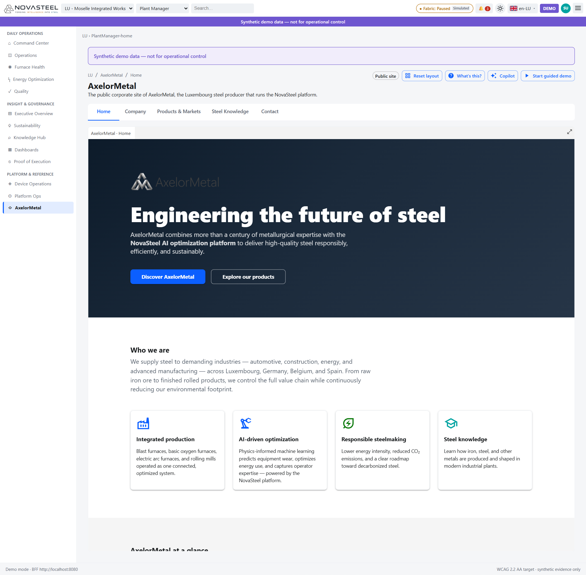

| What to look at | What to say / what it proves | Newcomer question answered |
|---|---|---|
| The hero says **Engineering the future of steel** and the cards say **Integrated production**, **AI-driven optimization**, **Responsible steelmaking**, and **Steel knowledge**. | “AxelorMetal is the fictitious operator; NovaSteel is the decision-support platform we are defending.” This establishes the business narrative before the platform screens (`apps\analytics-mfe\src\personaRoutes.ts:167-180`; `docs\presentation\assets\app-guide\en\16-traceability-matrix.md:43-50`). | “Who is this for?” |

### Stop 2 — Command Center

**URL:** `http://localhost:5266/lu/command-center/overview`  
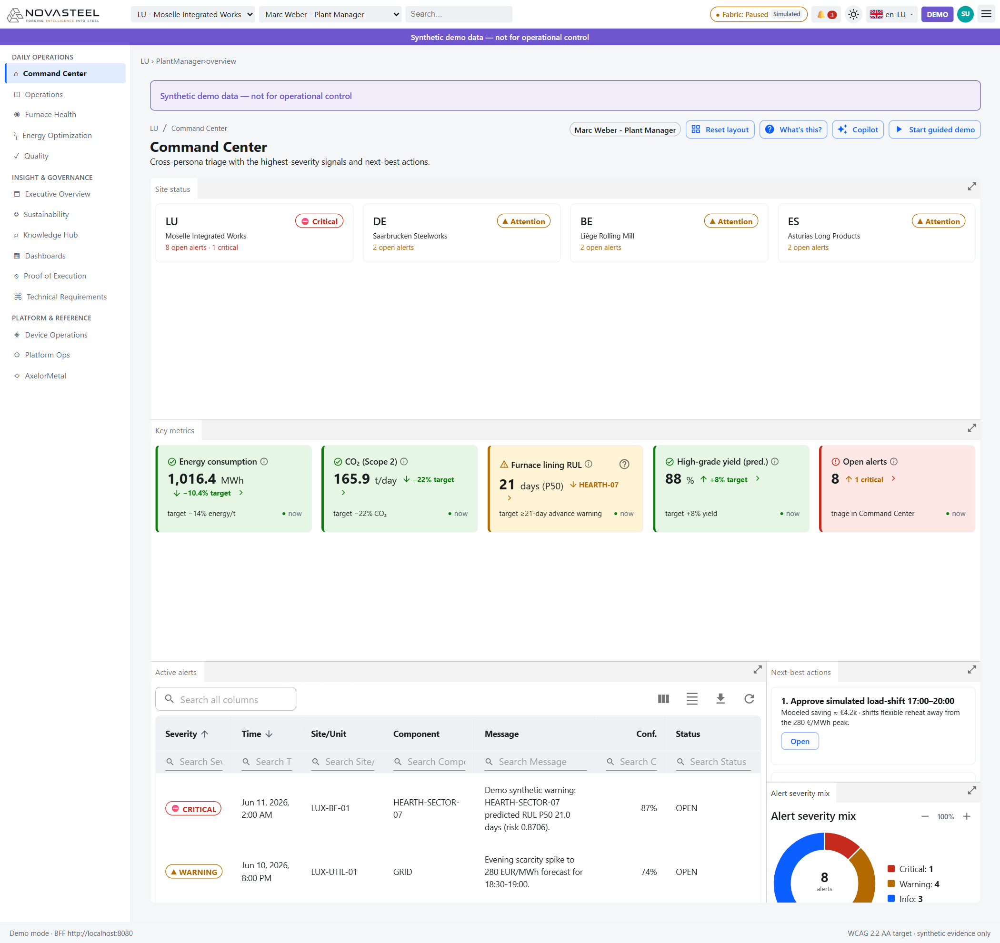

| What to look at | What to say / what it proves | Newcomer question answered |
|---|---|---|
| Four site cards, five KPI cards, a critical alert row, and **Next-best actions**. | “This is Marc Weber’s triage page: energy, CO₂, furnace RUL, high-grade yield, and alerts in one place.” It supports `OUT-01` and points to the other proof screens (`apps\analytics-mfe\src\personaRoutes.ts:18-24`; `docs\presentation\assets\app-guide\en\16-traceability-matrix.md:88-98`). | “Where do I see today’s priority?” |

### Stop 3 — Device Operations simulator

**URL:** `http://localhost:5266/lu/device-operations/simulator`  
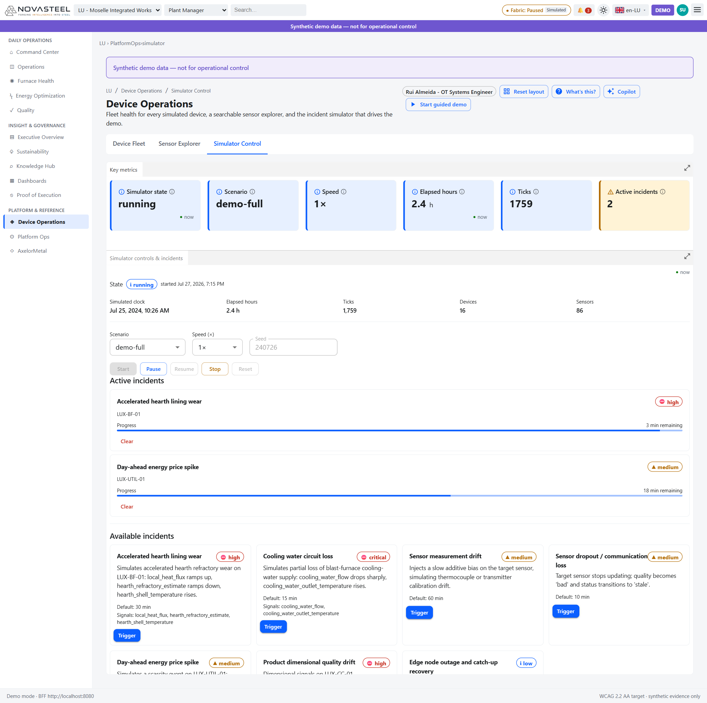

| What to look at | What to say / what it proves | Newcomer question answered |
|---|---|---|
| **Simulator state: running**, scenario **demo-full**, ticks, devices, sensors, and active lining/price incidents. | “The demo is repeatable. A deterministic in-process simulator drives the fault story, not manual screen edits.” This supports data provenance for `AI-01` (`docs\README.md:37-41`; `README.md:201-216`). | “Where do the signals come from?” |

### Stop 4 — Furnace Health: Lining Forecast

**URL:** `http://localhost:5266/lu/furnace-health/lining-forecast`  
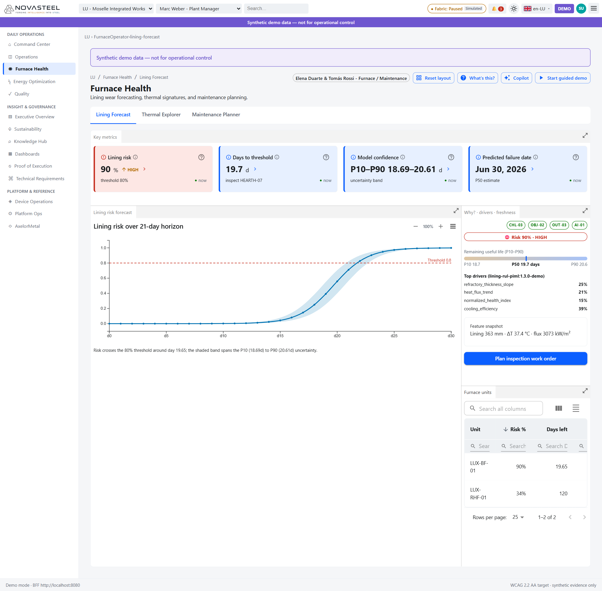

| What to look at | What to say / what it proves | Newcomer question answered |
|---|---|---|
| Lining risk near 90%, days to threshold around 19.7, P10–P90 band, red 80% threshold, and driver panel. | “This is the strongest AI proof: transparent RUL regression on synthetic thermal history, with uncertainty and drivers.” It proves `CHL-03`, `OBJ-02`, `OUT-03`, `AI-01` (`services\scoring-worker\src\scoring_worker\rul_model.py:106-197`; `docs\validation-report.md:43-44`). | “How does NovaSteel warn before an €8M lining failure?” |

### Stop 5 — Furnace Health: Maintenance Planner

**URL:** `http://localhost:5266/lu/furnace-health/maintenance-planner`  
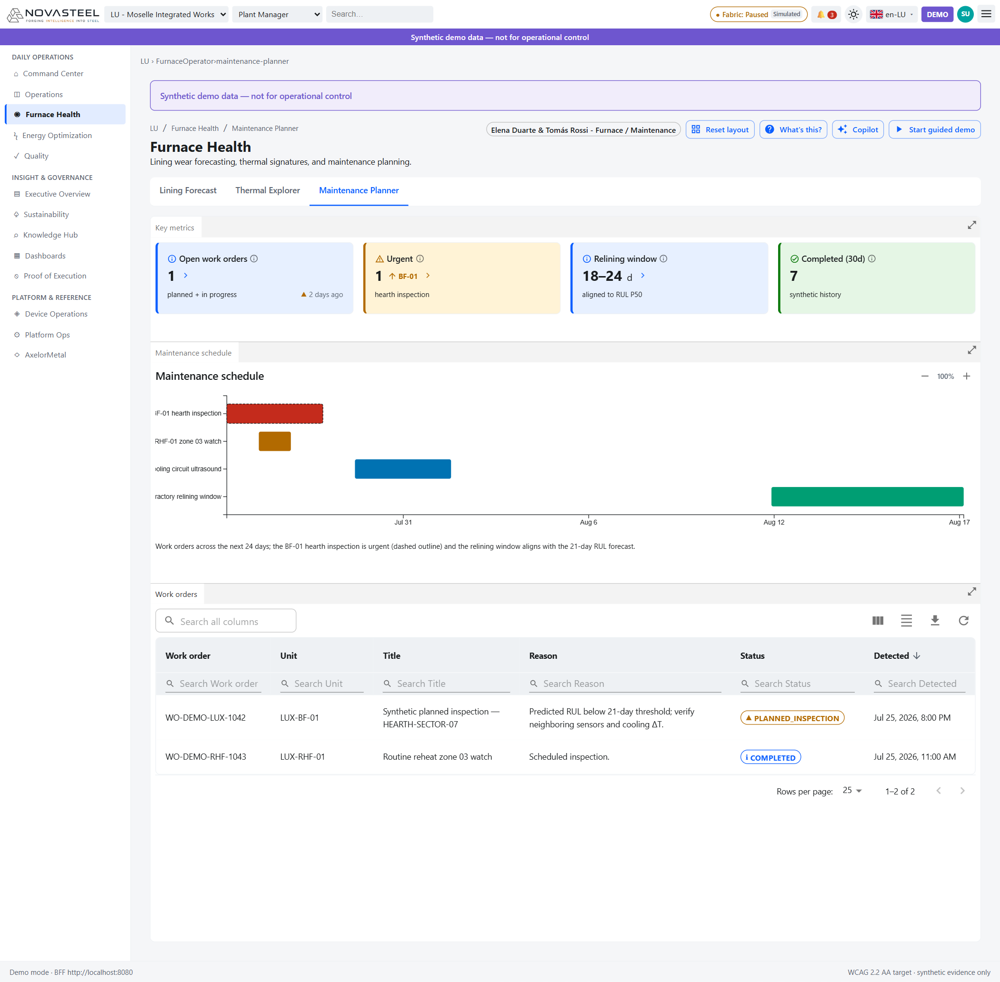

| What to look at | What to say / what it proves | Newcomer question answered |
|---|---|---|
| Urgent BF-01 inspection, relining window, Gantt-style plan, and synthetic work order `WO-DEMO-LUX-1042`. | “The forecast becomes a planned inspection. It does not actuate the furnace; the human maintenance process remains accountable.” It supports `OBJ-02` and `OUT-03` (`services\bff-api\src\bff_api\repository.py:276-285`; `docs\validation-report.md:43-44`). | “What happens after the risk alert?” |

### Stop 6 — Energy Optimization: Spot & Schedule

**URL:** `http://localhost:5266/lu/energy-optimization/spot-price-schedule`  
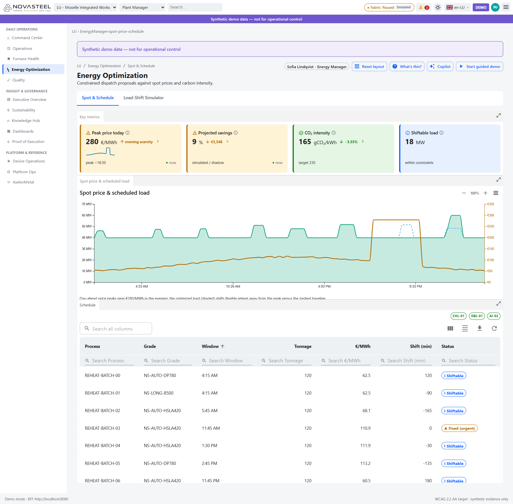

| What to look at | What to say / what it proves | Newcomer question answered |
|---|---|---|
| 280 EUR/MWh peak, projected savings, CO₂ intensity, shiftable load, price/load chart, and schedule rows. | “Energy is a production planning problem. The screen shows which flexible reheat batches can move away from a price peak.” It supports `CHL-01`, `OBJ-01`, and `REG-02` oversight (`docs\data\synthetic-data-and-simulators.md:128-135`; `docs\validation-report.md:45`). | “Why do steel plants care about spot electricity prices?” |

### Stop 7 — Energy Optimization: Load-Shift Simulator

**URL:** `http://localhost:5266/lu/energy-optimization/load-shift-simulator`  
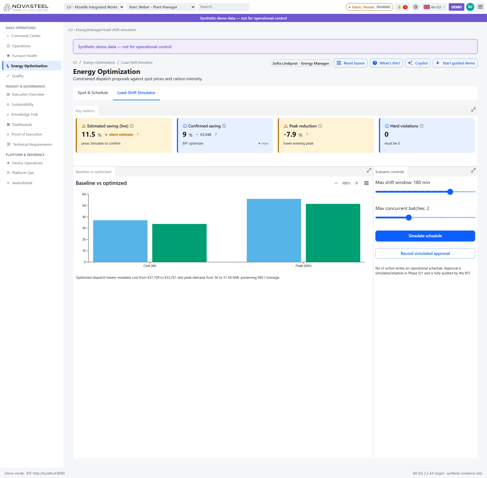

| What to look at | What to say / what it proves | Newcomer question answered |
|---|---|---|
| Baseline-vs-optimized bars, max-shift and concurrency sliders, **Simulate schedule**, and **Record simulated approval**. | “The MILP optimizer finds a feasible advisory schedule with zero hard violations. Approval is simulated/shadow and does not write production scheduling.” It proves `AI-02` (`services\optimizer-worker\src\optimizer_worker\milp.py:40-145`; `docs\validation-report.md:45`). | “Does the AI control production?” |

### Stop 8 — Quality: Batch Quality

**URL:** `http://localhost:5266/lu/quality/batches`  
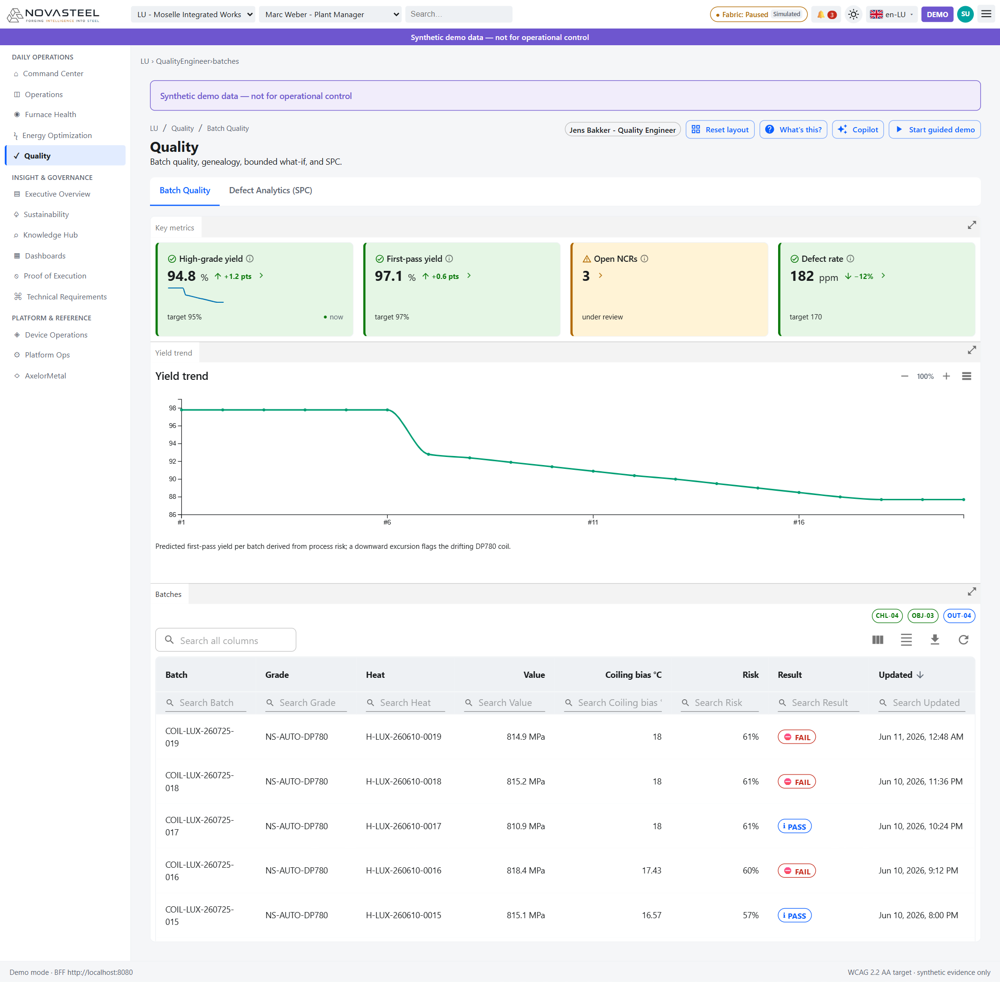

| What to look at | What to say / what it proves | Newcomer question answered |
|---|---|---|
| High-grade yield, first-pass yield, NCRs, defect rate, yield trend, and pass/fail batch table. | “Quality is traced batch by batch; predicted and measured quality are separated.” It supports `CHL-04`, `OBJ-03`, and `OUT-04` (`docs\data\synthetic-data-and-simulators.md:137-160`; `docs\validation-report.md:46`). | “How does NovaSteel show quality without hiding rejects?” |

### Stop 9 — Quality: SPC

**URL:** `http://localhost:5266/lu/quality/spc`  
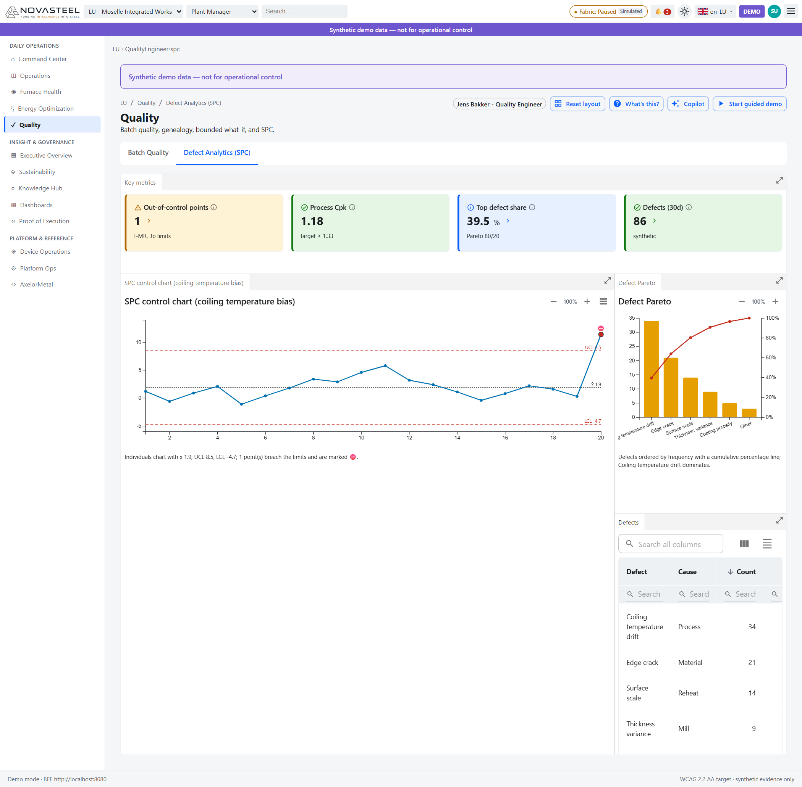

| What to look at | What to say / what it proves | Newcomer question answered |
|---|---|---|
| One out-of-control point, process Cpk, top defect share, control chart, and Pareto chart. | “SPC means statistical process control: it tells the engineer when variation stops looking normal.” It supports `OBJ-03` (`apps\analytics-mfe\src\components\screens\screenRegistry.ts:41-42`; `docs\presentation\assets\app-guide\en\16-traceability-matrix.md:97-99`). | “How do we see quality drift early?” |

### Stop 10 — Sustainability: emissions and ETS

**URL:** `http://localhost:5266/lu/sustainability-compliance/emissions-ledger`  
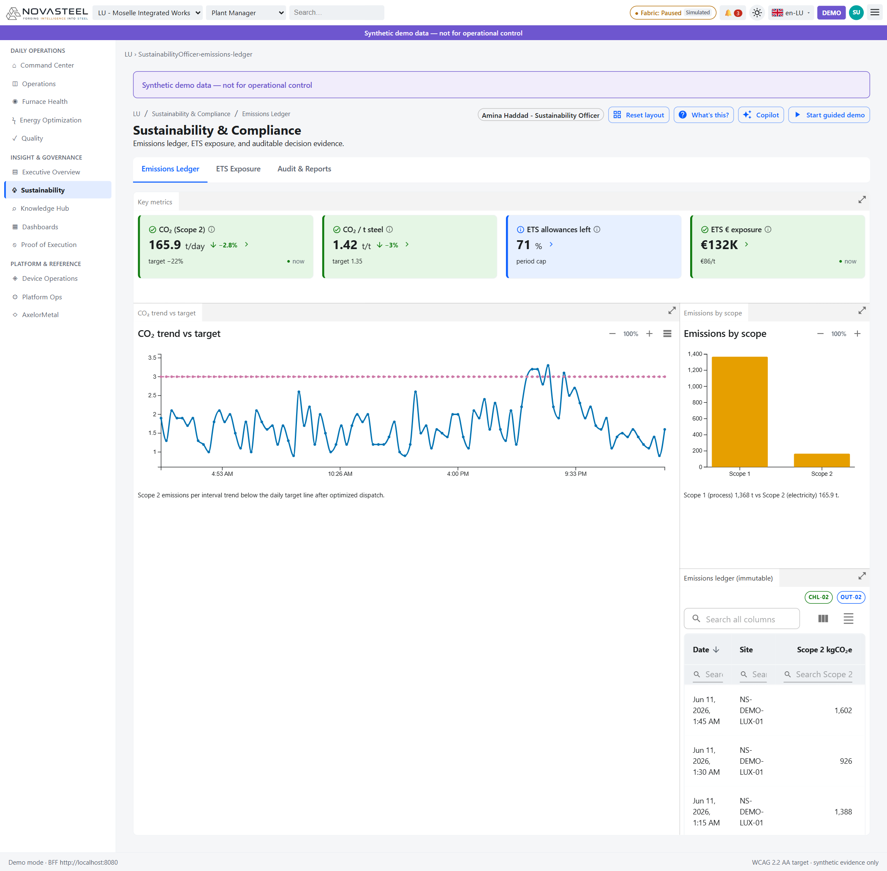

Then open:

**URL:** `http://localhost:5266/lu/sustainability-compliance/ets-exposure`  
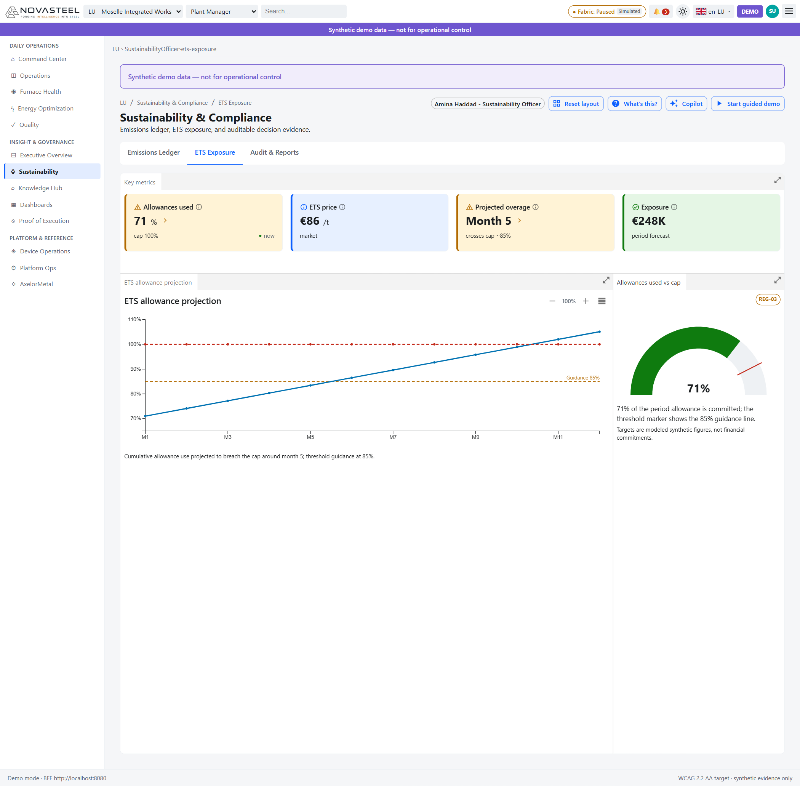

| What to look at | What to say / what it proves | Newcomer question answered |
|---|---|---|
| CO₂ trend vs target, scope chart, immutable ledger, ETS projection, 71% allowances used, and month-5 overage warning. | “Carbon is operational and financial. The app links energy decisions to emissions and ETS exposure while labelling values synthetic.” It supports `CHL-02`, `OUT-02`, and partial `REG-03` (`docs\architecture\solution-architecture.md:148-155`; `docs\presentation\assets\app-guide\en\16-traceability-matrix.md:106-108`). | “How does scheduling connect to carbon regulation?” |

### Stop 11 — Knowledge Hub: Procedures

**URL:** `http://localhost:5266/lu/knowledge-hub/procedures`  
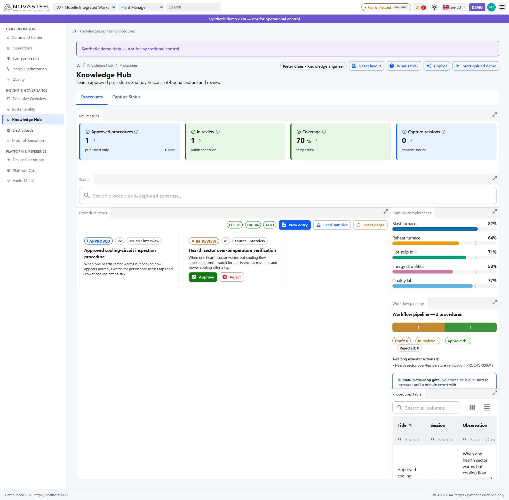

| What to look at | What to say / what it proves | Newcomer question answered |
|---|---|---|
| Approved procedure, in-review procedure, search, coverage bars, workflow pipeline, and human-in-the-loop gate. | “GenAI can draft from interviews, but a Knowledge Engineer reviews before anything becomes retrievable.” It proves `CHL-05` and `AI-03` (`services\knowledge-orchestrator\src\knowledge_orchestrator\orchestrator.py:190-242`; `services\knowledge-orchestrator\src\knowledge_orchestrator\retrieval.py:1-10`). | “How do operator stories become safe procedures?” |

### Stop 12 — Copilot panel

**URL:** `http://localhost:5266/lu/command-center/overview`, then click **Copilot**.  
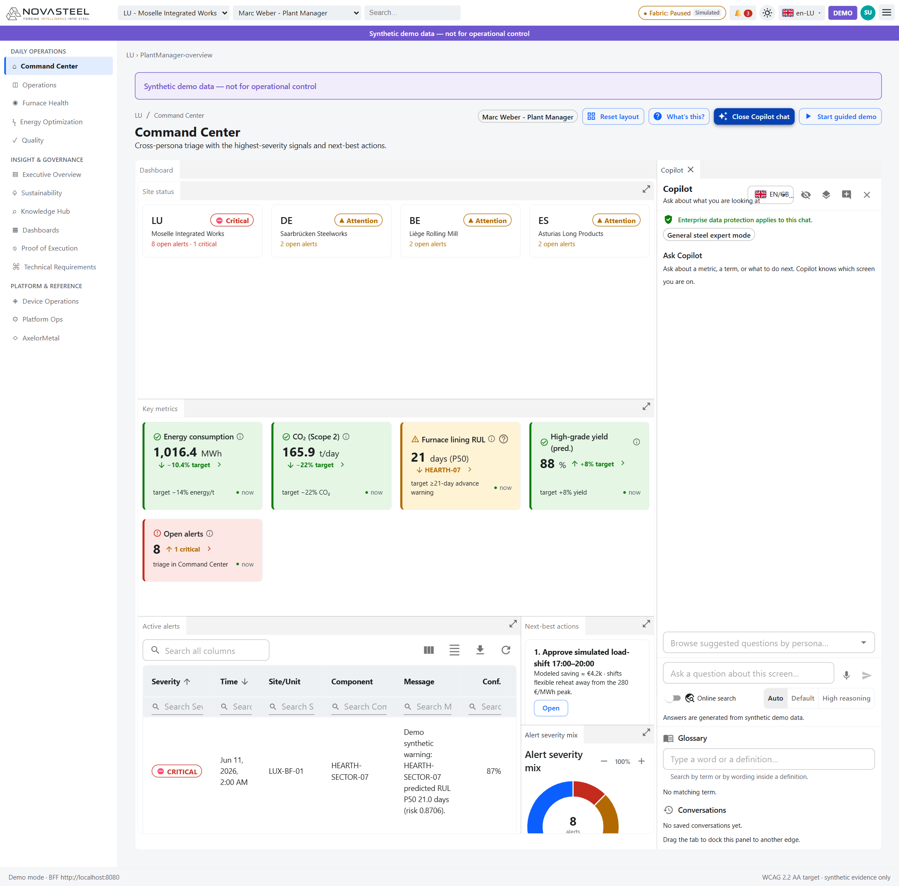

| What to look at | What to say / what it proves | Newcomer question answered |
|---|---|---|
| Right dock, green retention notice, suggested questions, glossary, composer, and reasoning options. | “Copilot explains the active screen. It has no data-plane tools; it answers from screen context, glossary, and grounded sources.” It demonstrates the cross-cutting assistant (`apps\analytics-mfe\src\api\copilotClient.ts:145-163`; `docs\implementation\api-contracts.md:300-306`). | “Can I ask plain-language questions?” |

### Stop 13 — Executive Overview

**URL:** `http://localhost:5266/lu/executive-overview/overview`  
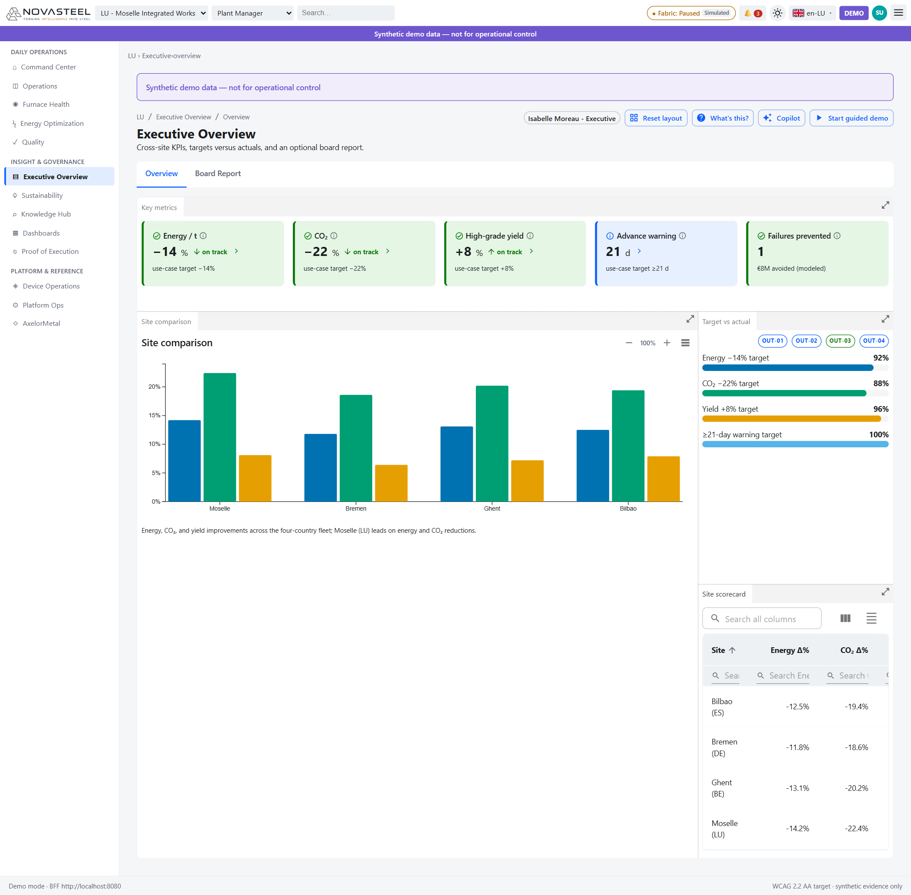

| What to look at | What to say / what it proves | Newcomer question answered |
|---|---|---|
| Energy, CO₂, high-grade yield, 21-day warning, failures prevented, site comparison, and target-vs-actual bars. | “This is the board-level roll-up. The numbers are targets or synthetic evidence, not realized production outcomes.” It supports `OUT-01`…`OUT-04` (`apps\analytics-mfe\src\components\screens\ExecutiveOverview.tsx:28-31`; `docs\presentation\oral-defense-and-slide-plan.md:21-29`). | “How does leadership see value?” |

### Stop 14 — Proof of Execution register

**URL:** `http://localhost:5266/lu/proof-of-execution/requirements`  
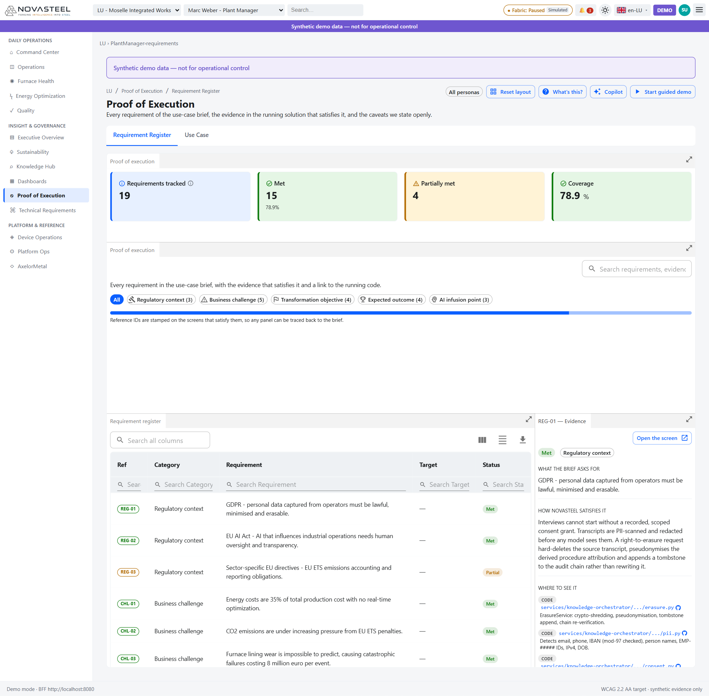

| What to look at | What to say / what it proves | Newcomer question answered |
|---|---|---|
| 19 requirements tracked, 15 met, 4 partial/surrogate, filter chips, register table, and evidence panel. | “This is the defense safety net: every claim maps to an ID, evidence, caveat, and source path.” It supports all 19 IDs (`apps\analytics-mfe\src\proof\proofCatalog.ts`; `docs\presentation\assets\app-guide\en\16-traceability-matrix.md:77-83`). | “Where do I answer ‘prove it’?” |

---

## 2. Ten jury questions and where on screen to answer them

| Jury question | Best screen | Short answer |
|---|---|---|
| Are the 14%, 22%, 21-day, and 8% numbers proven? | Executive Overview + Proof of Execution | They are targets except the synthetic RUL mechanism; the demo proves mechanics, not realized plant savings (`docs\presentation\faq.md:19-35`). |
| Why Microsoft Fabric? | Sustainability / chapter 17 | Fabric is the target governed core for hot KQL, OneLake medallion data, Direct Lake semantics, and Power BI (`docs\presentation\faq.md:38-54`). |
| Why Blazor plus React? | Any screen | Blazor owns shell/identity/navigation; React owns dense MUI/D3 dashboards (`docs\presentation\faq.md:65-67`). |
| Can AI control the furnace? | Maintenance Planner | No; the app is advisory-only and records human decisions (`docs\presentation\faq.md:71-73`). |
| What stops hallucination? | Copilot + Knowledge Hub | Python computes numbers; RAG/Copilot is grounded, cited, safety-screened, and tool-limited (`docs\presentation\faq.md:116-126`). |
| Is the data real? | Device Simulator + demo banner | No; it is deterministic synthetic data with seeds, fixtures, and checksums (`docs\data\synthetic-data-and-simulators.md:3-25`). |
| How is GDPR handled? | Knowledge Hub + `REG-01` | Consent, redaction, erasure, and audit-preserving tombstones are designed in (`docs\README.md:32-50`). |
| What if one identity is compromised? | Chapter 17 security table | App roles, Azure RBAC, Fabric, Foundry, and capacity identities are separate planes (`docs\presentation\faq.md:133-148`). |
| How do you prove energy savings? | Load-Shift Simulator + Proof | The demo shows a feasible synthetic recommendation; realized savings require pilot ledger reconciliation (`docs\validation-report.md:43-54`). |
| Where are source files? | Proof register + chapter 16 | Evidence rows point to route, API, worker, and test paths (`docs\presentation\assets\app-guide\en\16-traceability-matrix.md:133-162`). |

---

## 3. Troubleshooting

| Symptom | Likely cause | What to do |
|---|---|---|
| Blank analytics area | React bundle missing or stale. | Run `npm run build:analytics`; the JS bridge fallback says the analytics bundle is unavailable when import fails (`apps\portal-shell\wwwroot\js\analyticsBridge.js:12-40`). |
| BFF not reachable | `npm run run:bff` is not running, or port 8080 is unavailable. | Start the BFF and verify `http://127.0.0.1:8080/health/ready` (`README.md:110-120`). |
| Port already in use | Another process owns 8080 or the shell port. | Use `Get-NetTCPConnection -State Listen -LocalPort <port>` and stop only the owning PID; the README shows this pattern (`README.md:176-190`). |
| Stale React bundle | UI source changed but bundle was not rebuilt. | Run `npm run build:analytics`, then restart the shell (`README.md:102-108`). |
| CORS origin not allowed | Shell origin is not in BFF allowed origins. | Use one of the default origins or deliberately set `BFF_CORS_ORIGINS` (`services\bff-api\src\bff_api\config.py:141-146`). |
| Copilot answer fails | BFF or chat route error. | Reconnect BFF and resend once; Copilot does not silently fake grounded answers on error (`apps\analytics-mfe\src\api\copilotClient.ts:145-163`). |
| Capacity controls look simulated | Demo/local capacity mode. | Expected: demo capacity transitions are simulated and BFF-mediated; the browser never calls ARM (`apps\portal-shell\Components\CapacityPanel.razor:19-31`; `apps\portal-shell\Services\CapacityService.cs:6-11`). |

---

◀ [17 · How it works behind the screens](17-how-it-works-behind-the-screens.md) · ▲ [Index](README.md)
