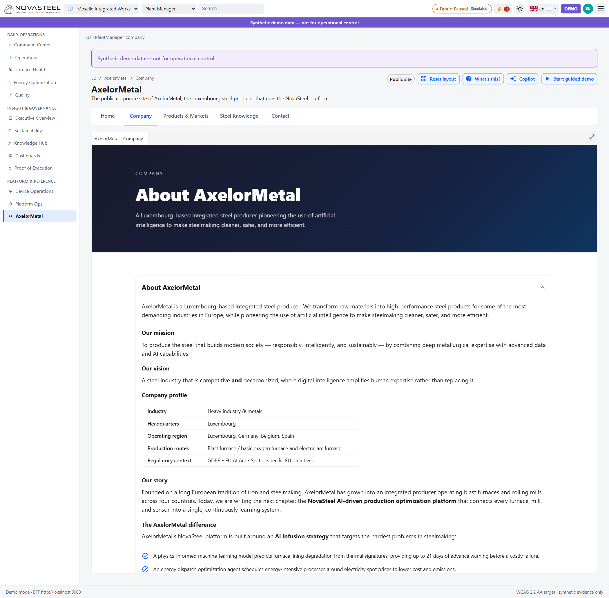
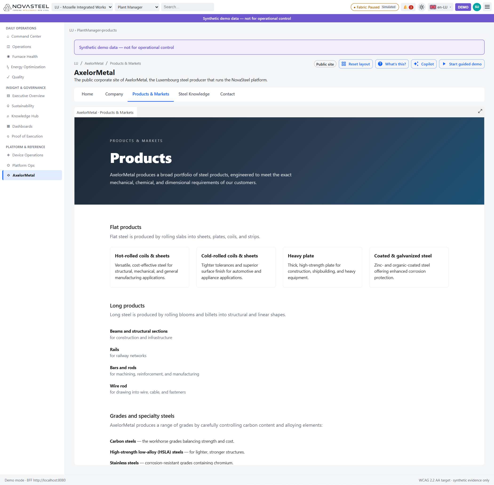
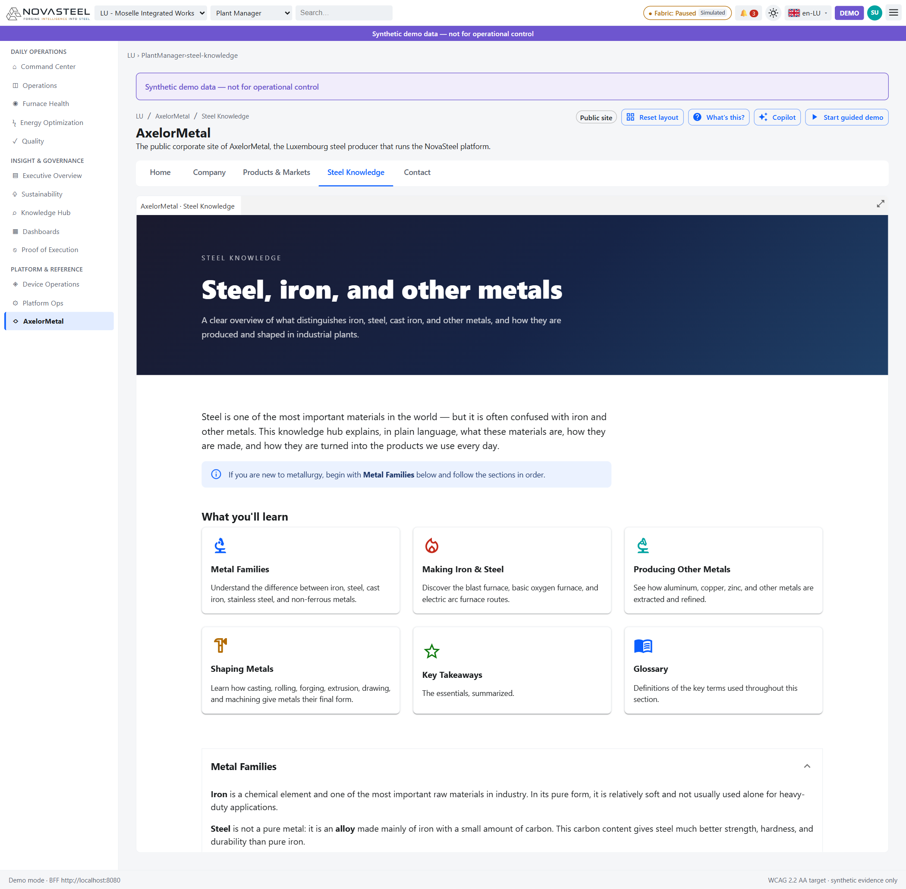
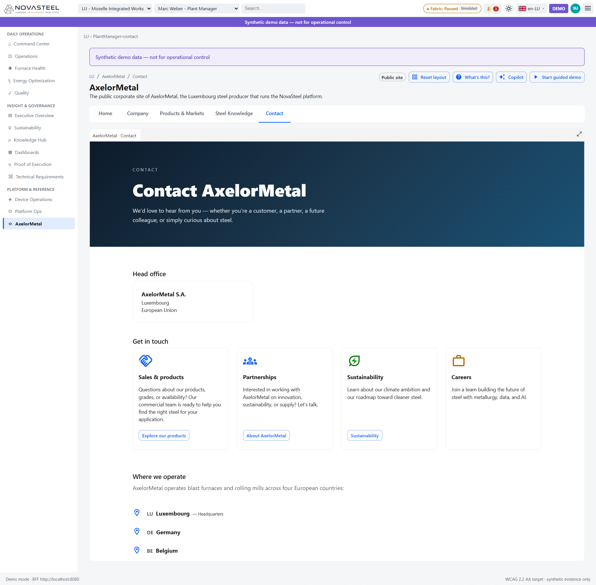

# 02 — Site corporate AxelorMetal

**Public visé :** personnes totalement débutantes dans l’acier et NovaSteel  
**Temps de lecture :** 16 minutes  
**Persona :** visiteur public / membre du jury / tous personas  
**Routes couvertes :** `/{site}/company-website/home`, `/{site}/company-website/company`, `/{site}/company-website/products`, `/{site}/company-website/steel-knowledge`, `/{site}/company-website/contact`  
**Dernière mise à jour :** 2026-07-27  
[🇬🇧 English version](../en/02-company-website.md)

## Pourquoi un site fictif est dans la défense

AxelorMetal est le producteur d’acier fictif luxembourgeois. NovaSteel est la plateforme d’aide à la décision fondée sur l’IA qu’il exploite. Le site existe pour que le jury comprenne d’abord l’opérateur, ses usines, ses produits et son contexte réglementaire avant de voir les tableaux de bord. Le runbook demande d’« ouvrir avec le site public AxelorMetal » pour installer ce récit avant d’entrer dans NovaSteel (`docs\demo\demo-runbook.md:3-6`).

La spécification UX dit que cette section est un site corporate fictif, pas un cockpit opérationnel (`docs\ux\dashboard-specification.md:901-904`). Les cinq sous-vues sont déclarées dans le routage et le registre d’écrans (`apps\analytics-mfe\src\personaRoutes.ts:167-180`; `apps\analytics-mfe\src\components\screens\screenRegistry.ts:59-63`). Le site est localisé en anglais, français, allemand, néerlandais et espagnol ; chaque article est un panneau docké plein cadre, non fermable (`docs\ux\dashboard-specification.md:915-919`; `apps\analytics-mfe\src\components\screens\CompanyWebsiteLayout.tsx:21-39`).

---

## Accueil (Home) — `/{site}/company-website/home`

**En une phrase.** La page Home présente AxelorMetal comme l’opérateur sidérurgique et NovaSteel comme la plateforme IA qui l’aide à produire un acier plus propre, plus sûr et plus efficace.

**Contexte sidérurgique pour débutants.** La sidérurgie (steelmaking) transforme du minerai de fer ou de la ferraille recyclée en acier, puis façonne cet acier en produits. Un producteur intégré (integrated producer) maîtrise plusieurs étapes : fabrication du fer, fabrication de l’acier, laminage et finition. Le laminage (rolling) consiste à faire passer l’acier entre de gros cylindres pour produire tôles, bobines, plaques, rails, barres ou poutres (`apps\analytics-mfe\src\components\screens\CompanyWebsiteHome.tsx:30-63`, `apps\analytics-mfe\src\components\screens\CompanyWebsiteHome.tsx:141-173`).

**Ce que vous voyez à l’écran.**

1. **Coque NovaSteel.** La barre supérieure montre site, persona, recherche, statut Fabric, badge démo, thème et langue ; la navigation gauche met AxelorMetal en surbrillance (`docs\ux\dashboard-specification.md:172-175`; `apps\analytics-mfe\src\personaRoutes.ts:167-180`).
2. **Bannière données synthétiques.** La bannière violette affiche « Synthetic demo data — not for operational control » : données de démonstration, pas de pilotage d’usine (`docs\demo\demo-runbook.md:37-44`).
3. **Onglets du site.** « Home », « Company », « Products & Markets », « Steel Knowledge » et « Contact » sont les cinq sous-vues routées (`apps\analytics-mfe\src\personaRoutes.ts:173-180`; `docs\ux\dashboard-specification.md:905-913`).
4. **Grand hero sombre.** « Engineering the future of steel » apparaît sur un dégradé bleu foncé avec les boutons « Discover AxelorMetal » et « Explore our products » (`apps\analytics-mfe\src\components\screens\CompanyWebsiteHome.tsx:81-139`).
5. **Cartes “Who we are”.** Quatre cartes expliquent production intégrée, optimisation par IA, sidérurgie responsable et connaissance acier. Le bleu marque production/IA, le vert la durabilité, le violet l’apprentissage (`apps\analytics-mfe\src\components\screens\CompanyWebsiteHome.tsx:30-55`, `apps\analytics-mfe\src\components\screens\CompanyWebsiteHome.tsx:141-173`).
6. **Table de profil plus bas.** « AxelorMetal at a glance » liste siège, région, industrie, routes de production et contexte réglementaire (`apps\analytics-mfe\src\components\screens\CompanyWebsiteHome.tsx:57-63`, `apps\analytics-mfe\src\components\screens\CompanyWebsiteHome.tsx:175-198`).

**Pourquoi ce composant a été implémenté.** Il transforme la ligne du cas d’usage « A Luxembourg-based integrated steel producer operating blast furnaces and rolling mills across four countries faces… » en histoire métier mémorisable (`docs\usecase\usecase.md:14-22`).

**Objectif & preuves d’exécution.**

| Élément du cas d’usage | ID d’exigence | Preuve dans l’application | Origine du chiffre ou contenu (route API + fichier source) |
|---|---|---|---|
| Identité et empreinte | CHL-01..CHL-05 contexte | Home raconte l’opérateur sidérurgique présent dans quatre pays. | Aucun appel API d’écran ; contenu statique dans `CompanyWebsiteHome.tsx` (`apps\analytics-mfe\src\components\screens\CompanyWebsiteHome.tsx:146-150`). |
| Objectif de transformation | OBJ-01..OBJ-04 | La carte « AI-driven optimization » cite usure, énergie et expertise opérateur. | Aucun appel API ; carte statique (`apps\analytics-mfe\src\components\screens\CompanyWebsiteHome.tsx:38-41`). Catalogue : `apps\analytics-mfe\src\proof\proofCatalog.ts:337-410`. |
| Cadre réglementaire | REG-01..REG-03 | Le bas de page cite GDPR, EU AI Act et directives sectorielles. | Aucun appel API ; contenu statique (`apps\analytics-mfe\src\components\screens\CompanyWebsiteHome.tsx:219-223`). |

**Comment les données arrivent à cet écran.** `CompanyWebsiteHome` rend du contenu React statique et des libellés traduits via `useAnalytics`; il n’appelle ni `DataClient` ni route BFF (`apps\analytics-mfe\src\components\screens\CompanyWebsiteHome.tsx:72-80`; `apps\analytics-mfe\src\api\dataClient.ts:151-322`).

**Honnêteté & limites.** AxelorMetal, ses personnes, ses usines et ses contacts sont fictifs ; cette page donne un contexte narratif, pas une preuve d’entreprise réelle (`docs\ux\dashboard-specification.md:901-904`).

**Essayez vous-même.** Ouvrez `http://localhost:5266/lu/company-website/home`, cliquez sur **Discover AxelorMetal**, puis revenez à Home.

---

## Entreprise (Company) — `/{site}/company-website/company`

**En une phrase.** La page Company explique mission, empreinte, routes de production, durabilité et conformité.

**Contexte sidérurgique pour débutants.** Un haut fourneau (blast furnace) utilise minerai, coke et calcaire pour produire du fer liquide. Un convertisseur à oxygène (basic oxygen furnace, BOF) transforme ce fer en acier en soufflant de l’oxygène. Un four à arc électrique (electric arc furnace, EAF) fait fondre de la ferraille avec des arcs électriques. La page présente AxelorMetal comme utilisant les deux grandes routes (`apps\analytics-mfe\src\components\screens\CompanyWebsiteCompany.tsx:203-219`).

**Ce que vous voyez à l’écran.**

1. **Bandeau hero.** « About AxelorMetal » décrit un producteur intégré luxembourgeois utilisant l’IA pour rendre la sidérurgie plus propre, sûre et efficace (`apps\analytics-mfe\src\components\screens\CompanyWebsiteCompany.tsx:68-89`).
2. **Accordéon About.** Le panneau ouvert contient mission, vision, profil, histoire, différence NovaSteel et cartes d’impact (`apps\analytics-mfe\src\components\screens\CompanyWebsiteCompany.tsx:91-189`).
3. **Table “Company profile”.** Elle liste industrie, siège, quatre pays, routes BF/BOF et EAF, et contexte réglementaire (`apps\analytics-mfe\src\components\screens\CompanyWebsiteCompany.tsx:118-136`).
4. **Puces d’infusion IA.** Les coches nomment prédiction du revêtement, optimisation du dispatch énergétique et capture de connaissance GenAI (`apps\analytics-mfe\src\components\screens\CompanyWebsiteCompany.tsx:147-165`; `docs\usecase\usecase.md:46-50`).
5. **Cartes d’impact.** −14 % énergie, −22 % CO₂, +8 % rendement haut de gamme et 21 jours d’alerte sont des cibles, pas des mesures (`apps\analytics-mfe\src\components\screens\CompanyWebsiteCompany.tsx:167-182`; `docs\presentation\proof_of_execution.md:307-315`).
6. **Accordéons inférieurs.** « Our Activities », « Sustainability » et « Compliance » couvrent BF/BOF, EAF, laminage, GDPR, EU AI Act, ETS, CBAM et sécurité (`apps\analytics-mfe\src\components\screens\CompanyWebsiteCompany.tsx:191-557`).

**Pourquoi ce composant a été implémenté.** Il rend visible l’objectif : « Implement an **AI-driven production optimization platform** that » réduit l’énergie, prédit les pannes, améliore la qualité et capture l’expertise (`docs\usecase\usecase.md:26-33`).

**Objectif & preuves d’exécution.**

| Élément du cas d’usage | ID d’exigence | Preuve dans l’application | Origine du chiffre ou contenu (route API + fichier source) |
|---|---|---|---|
| Stratégie IA | AI-01, AI-02, AI-03 | Les puces « AxelorMetal difference » nomment les trois patterns IA. | Aucun appel API ; contenu statique (`apps\analytics-mfe\src\components\screens\CompanyWebsiteCompany.tsx:147-165`). Catalogue : `apps\analytics-mfe\src\proof\proofCatalog.ts:520-608`. |
| Résultats attendus | OUT-01..OUT-04 | Quatre cartes affichent −14 %, −22 %, +8 % et 21 jours. | Aucun appel API ; cartes statiques (`apps\analytics-mfe\src\components\screens\CompanyWebsiteCompany.tsx:167-182`). Limite : `docs\presentation\proof_of_execution.md:307-315`. |
| Réglementaire | REG-01..REG-03 | Profil et Compliance citent GDPR, EU AI Act, ETS, IED, CBAM et OSH. | Aucun appel API ; contenu statique (`apps\analytics-mfe\src\components\screens\CompanyWebsiteCompany.tsx:123-128`, `apps\analytics-mfe\src\components\screens\CompanyWebsiteCompany.tsx:370-546`). |

**Comment les données arrivent à cet écran.** `CompanyWebsiteCompany` est statique ; la navigation utilise `emit('nav.intent')`, sans route BFF de données (`apps\analytics-mfe\src\components\screens\CompanyWebsiteCompany.tsx:59-67`).

**Honnêteté & limites.** Les chiffres sont les cibles de la démo synthétique ; le document de preuve précise que les magnitudes sont générées (`docs\presentation\proof_of_execution.md:307-315`).

**Essayez vous-même.** Ouvrez `http://localhost:5266/lu/company-website/company`, puis développez **Sustainability** et **Compliance**.

---

## Produits & marchés (Products & Markets) — `/{site}/company-website/products`

**En une phrase.** La page Products explique quels aciers AxelorMetal vend et pourquoi forme, nuance, surface, chimie et marché client comptent.

**Contexte sidérurgique pour débutants.** Les produits plats (flat products) sont tôles, plaques, bobines et bandes. Les produits longs (long products) sont poutres, rails, barres, ronds et fil machine. Une nuance d’acier (steel grade) définit chimie et propriétés mécaniques. HSLA (high-strength low-alloy) désigne un acier faiblement allié à haute résistance (`apps\analytics-mfe\src\components\screens\CompanyWebsiteProducts.tsx:23-40`, `apps\analytics-mfe\src\components\screens\CompanyWebsiteProducts.tsx:117-151`).

**Ce que vous voyez à l’écran.**

1. **Bandeau hero.** « Products » annonce les exigences mécaniques, chimiques et dimensionnelles (`apps\analytics-mfe\src\components\screens\CompanyWebsiteProducts.tsx:72-95`).
2. **Cartes produits plats.** « Hot-rolled coils & sheets », « Cold-rolled coils & sheets », « Heavy plate » et « Coated & galvanized steel ». Bon : produit adapté à l’usage ; mauvais : surface, épaisseur, résistance ou protection inadaptée (`apps\analytics-mfe\src\components\screens\CompanyWebsiteProducts.tsx:23-40`, `apps\analytics-mfe\src\components\screens\CompanyWebsiteProducts.tsx:97-115`).
3. **Liste produits longs.** Poutres, rails, barres, ronds et fil machine servent construction, rail, usinage, renfort, fabrication, câble et fixations (`apps\analytics-mfe\src\components\screens\CompanyWebsiteProducts.tsx:117-133`).
4. **Nuances et aciers spéciaux.** Aciers carbone, HSLA, inox et alliages montrent que l’acier est une famille de matériaux (`apps\analytics-mfe\src\components\screens\CompanyWebsiteProducts.tsx:135-152`).
5. **Alerte bleue.** Elle renvoie vers « Metal Families » dans Steel Knowledge pour les bases métallurgiques (`apps\analytics-mfe\src\components\screens\CompanyWebsiteProducts.tsx:154-160`).
6. **Marchés plus bas.** Automobile, construction, énergie et industrie sont décrits sous le premier écran (`apps\analytics-mfe\src\components\screens\CompanyWebsiteProducts.tsx:179-263`).

**Pourquoi ce composant a été implémenté.** Il relie le défi « Quality consistency issues in high-grade steel for automotive customers » aux produits et marchés visibles (`docs\usecase\usecase.md:20-22`).

**Objectif & preuves d’exécution.**

| Élément | ID d’exigence | Preuve dans l’application | Origine (route API + fichier source) |
|---|---|---|---|
| Défi qualité | CHL-04 | Produits et marchés expliquent l’enjeu de constance automobile. | Aucun appel API ; contenu statique (`apps\analytics-mfe\src\components\screens\CompanyWebsiteProducts.tsx:135-160`, `apps\analytics-mfe\src\components\screens\CompanyWebsiteProducts.tsx:187-237`). |
| Amélioration qualité | OBJ-03, OUT-04 | La page explique pourquoi le rendement haut de gamme compte. | Aucun appel API ; preuve OUT-04 dans le catalogue (`apps\analytics-mfe\src\proof\proofCatalog.ts:495-518`). |
| Relais connaissance | CHL-05 contexte | Le lien Metal Families oriente les débutants. | Aucun appel API ; navigation `navigate('steel-knowledge')` (`apps\analytics-mfe\src\components\screens\CompanyWebsiteProducts.tsx:154-160`). |

**Comment les données arrivent à cet écran.** Les contenus produit et marché sont embarqués dans le composant ; aucun `DataClient` ou BFF (`apps\analytics-mfe\src\components\screens\CompanyWebsiteProducts.tsx:23-69`, `apps\analytics-mfe\src\components\screens\CompanyWebsiteProducts.tsx:72-268`).

**Honnêteté & limites.** Le catalogue est illustratif, pas un vrai catalogue commercial (`docs\ux\dashboard-specification.md:901-904`).

**Essayez vous-même.** Ouvrez `http://localhost:5266/lu/company-website/products`, lisez **Grades and specialty steels**, puis cliquez **Metal Families**.

---

## Connaissance acier (Steel Knowledge) — `/{site}/company-website/steel-knowledge`

**En une phrase.** Steel Knowledge est la meilleure entrée pour débutants : familles de métaux, routes de production, mise en forme, diagrammes et glossaire.

**Contexte sidérurgique pour débutants.** Le fer (iron) est un élément chimique. L’acier (steel) est un alliage (alloy), surtout du fer avec un peu de carbone. La fonte (cast iron) contient plus de carbone, donc elle est dure mais cassante. L’inox (stainless steel) contient du chrome contre la rouille. Les métaux non ferreux (non-ferrous metals) ne sont pas majoritairement à base de fer (`apps\analytics-mfe\src\components\screens\CompanyWebsiteSteelKnowledge.tsx:169-258`).

**Ce que vous voyez à l’écran.**

1. **Bandeau hero.** « Steel, iron, and other metals » annonce une métallurgie en langage simple (`apps\analytics-mfe\src\components\screens\CompanyWebsiteSteelKnowledge.tsx:113-136`).
2. **Alerte débutant.** Le message conseille de commencer par **Metal Families** (`apps\analytics-mfe\src\components\screens\CompanyWebsiteSteelKnowledge.tsx:138-149`).
3. **Six cartes.** « Metal Families », « Making Iron & Steel », « Producing Other Metals », « Shaping Metals », « Key Takeaways », « Glossary » font défiler vers leurs sections (`apps\analytics-mfe\src\components\screens\CompanyWebsiteSteelKnowledge.tsx:60-99`, `apps\analytics-mfe\src\components\screens\CompanyWebsiteSteelKnowledge.tsx:151-167`).
4. **Accordéon Metal Families.** Il explique fer, acier, fonte, inox, aciers alliés et métaux non ferreux. Bonne lecture : l’acier est une famille ; mauvaise lecture : tous les matériaux ferreux sont identiques (`apps\analytics-mfe\src\components\screens\CompanyWebsiteSteelKnowledge.tsx:169-258`).
5. **Table comparative.** Elle compare composition et caractéristique des matériaux à base de fer (`apps\analytics-mfe\src\components\screens\CompanyWebsiteSteelKnowledge.tsx:212-238`).
6. **CompanyWebsiteDiagram / ProcessDiagram.** Plus bas, six illustrations zoomables. Trois sont des **diagrammes pleine largeur** — route intégrée BF/BOF, route EAF et détail EAF — qui occupent toute la colonne car leurs petites étiquettes ont besoin de place. Trois sont des **figures** affichées dans un cadre identique de 460 px au format 4:3, afin qu'elles s'alignent entre elles : une coupe de haut fourneau sous *The blast furnace route*, plus un gros plan de cage de laminoir et une vue d'ensemble de train à chaud sous *Shaping Metals → Rolling in practice*. Un clic ouvre une fenêtre avec zoom de 100 % à 400 % (`apps\analytics-mfe\src\components\screens\CompanyWebsiteSteelKnowledge.tsx:261-380`; `apps\analytics-mfe\src\components\screens\CompanyWebsiteDiagram.tsx:16-60`).
7. **Glossaire DataTable.** La table offre termes, définitions, recherche globale, recherche par colonne, tri, choix de colonnes, densité, export et pagination (`apps\analytics-mfe\src\components\screens\CompanyWebsiteSteelKnowledge.tsx:533-550`; `apps\analytics-mfe\src\components\primitives\DataTable.tsx:248-428`).

**Pourquoi ce composant a été implémenté.** Le cas d’usage indique que des opérateurs qualifiés partent à la retraite et que la connaissance disparaît trop vite (`docs\usecase\usecase.md:20-22`). Cette page n’est pas le système GenAI, mais elle applique la même idée : rendre explicite le vocabulaire industriel.

**Objectif & preuves d’exécution.**

| Élément | ID d’exigence | Preuve dans l’application | Origine (route API + fichier source) |
|---|---|---|---|
| Transmission de savoir | CHL-05, OBJ-04 | Leçons simples et glossaire consultable. | Aucun appel API ; contenu statique (`apps\analytics-mfe\src\components\screens\CompanyWebsiteSteelKnowledge.tsx:42-58`, `apps\analytics-mfe\src\components\screens\CompanyWebsiteSteelKnowledge.tsx:169-550`). |
| Contexte procédé pour IA | AI-01, AI-02 | Diagrammes et photographies montrent les équipements ensuite surveillés : la coupe du haut fourneau nomme le creuset à 1 600 °C qui use le réfractaire, et les figures de laminoir montrent le métal chaud dont le réchauffage pèse sur la facture d'énergie. | Aucun appel API ; images `/media/*.webp` via `ProcessDiagram` (`apps\analytics-mfe\src\components\screens\CompanyWebsiteDiagram.tsx:16-60`, `apps\analytics-mfe\src\components\screens\CompanyWebsiteSteelKnowledge.tsx:273-345`). |
| Acceptation site | S-24 / AC-S24-3 | Le glossaire prend en charge la recherche. | Aucun appel API ; `DataTable` (`apps\analytics-mfe\src\components\screens\CompanyWebsiteSteelKnowledge.tsx:533-550`; `apps\analytics-mfe\src\components\primitives\DataTable.tsx:248-428`). |

**Comment les données arrivent à cet écran.** Tableaux statiques pour les cartes et le glossaire, puis images `/media` via `ProcessDiagram`; aucun appel BFF ou fixture-worker (`apps\analytics-mfe\src\components\screens\CompanyWebsiteSteelKnowledge.tsx:42-107`; `apps\analytics-mfe\src\components\screens\CompanyWebsiteDiagram.tsx:77-87`).

**Honnêteté & limites.** Le contenu est simplifié pour une audience de démo ; ce n’est ni un manuel de métallurgie ni une procédure opératoire (`docs\demo\demo-runbook.md:106-121`).

**Essayez vous-même.** Ouvrez `http://localhost:5266/lu/company-website/steel-knowledge`, cliquez **Making Iron & Steel**, puis ouvrez la coupe du haut fourneau et testez le zoom. Ouvrez ensuite **Shaping Metals** et comparez les deux figures de laminoir — même cadre, un gros plan et une vue à l'échelle de l'usine.

---

## Contact — `/{site}/company-website/contact`

**En une phrase.** Contact complète la fiction en montrant comment clients, partenaires, acteurs durabilité et candidats approcheraient AxelorMetal.

**Contexte sidérurgique pour débutants.** Un producteur d’acier appartient à une chaîne de valeur : clients pour les produits et nuances, partenaires pour innovation et durabilité, communautés et régulateurs pour climat et vie privée, candidats pour carrière et sécurité (`apps\analytics-mfe\src\components\screens\CompanyWebsiteContact.tsx:24-53`).

**Ce que vous voyez à l’écran.**

1. **Bandeau hero.** « Contact AxelorMetal » invite clients, partenaires, futurs collègues et curieux (`apps\analytics-mfe\src\components\screens\CompanyWebsiteContact.tsx:71-92`).
2. **Carte siège.** « AxelorMetal S.A., Luxembourg, European Union » soutient le récit luxembourgeois (`apps\analytics-mfe\src\components\screens\CompanyWebsiteContact.tsx:94-101`).
3. **Cartes “Get in touch”.** « Sales & products », « Partnerships », « Sustainability », « Careers » ; bleu pour commercial/partenariat, vert pour durabilité, orange pour carrières (`apps\analytics-mfe\src\components\screens\CompanyWebsiteContact.tsx:24-53`, `apps\analytics-mfe\src\components\screens\CompanyWebsiteContact.tsx:103-127`).
4. **Where we operate.** Luxembourg, Germany, Belgium et Spain sont listés, Luxembourg étant le siège (`apps\analytics-mfe\src\components\screens\CompanyWebsiteContact.tsx:55-60`, `apps\analytics-mfe\src\components\screens\CompanyWebsiteContact.tsx:129-155`).
5. **Note privacy plus bas.** Une alerte GDPR décrit le traitement responsable des données personnelles (`apps\analytics-mfe\src\components\screens\CompanyWebsiteContact.tsx:157-170`).

**Pourquoi ce composant a été implémenté.** Il renforce le profil : « Headquarters: Luxembourg » et « Operating Region: Luxembourg, Germany, Belgium, Spain » (`docs\usecase\usecase.md:5-10`).

**Objectif & preuves d’exécution.**

| Élément | ID d’exigence | Preuve dans l’application | Origine (route API + fichier source) |
|---|---|---|---|
| Empreinte géographique | CHL-01..CHL-05 contexte | Les quatre pays sont visibles. | Aucun appel API ; tableau `LOCATIONS` (`apps\analytics-mfe\src\components\screens\CompanyWebsiteContact.tsx:55-60`). |
| Sensibilisation GDPR | REG-01 | L’alerte privacy explique le GDPR. | Aucun appel API ; alerte statique (`apps\analytics-mfe\src\components\screens\CompanyWebsiteContact.tsx:157-170`). |
| Navigation parties prenantes | OBJ-01..OBJ-04 contexte | Les cartes naviguent vers produits, company et durabilité. | Aucun appel API ; route intent (`apps\analytics-mfe\src\components\screens\CompanyWebsiteContact.tsx:62-67`, `apps\analytics-mfe\src\components\screens\CompanyWebsiteContact.tsx:103-127`). |

**Comment les données arrivent à cet écran.** `CompanyWebsiteContact` rend des constantes de cartes et de pays ; il n’appelle ni `DataClient` ni route BFF (`apps\analytics-mfe\src\components\screens\CompanyWebsiteContact.tsx:24-67`; `apps\analytics-mfe\src\api\dataClient.ts:151-322`).

**Honnêteté & limites.** Il n’y a pas de vrai formulaire de contact, workflow commercial ou envoi d’e-mail. C’est un artefact narratif (`docs\ux\dashboard-specification.md:901-919`).

**Essayez vous-même.** Ouvrez `http://localhost:5266/lu/company-website/contact`, cliquez **Explore our products**, puis revenez à Contact.

---

[◀ Précédent : shell et navigation](01-shell-and-navigation.md) · [▲ Index](LISEZMOI.md) · [Suivant ▶ Command Center et Operations](03-command-center-and-operations.md)

