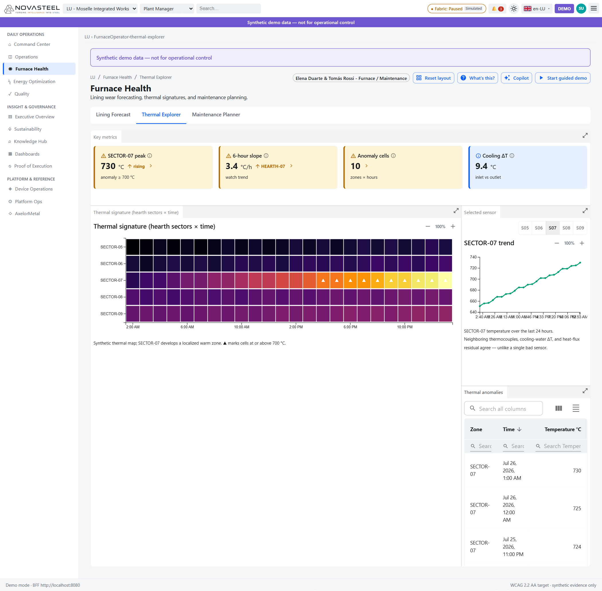

# 04 — Santé des fours

**Public visé :** personnes totalement débutantes en sidérurgie et analytique industrielle  
**Temps de lecture :** 18 minutes  
**Persona :** Elena Duarte, opératrice de four, et Tomás Rossi, ingénieur maintenance et fiabilité  
**Routes couvertes :** `/lu/furnace-health/lining-forecast`, `/lu/furnace-health/thermal-explorer`, `/lu/furnace-health/maintenance-planner`  
**Dernière mise à jour :** 2026-07-27  
[🇬🇧 English version](../en/04-furnace-health.md)

Santé des fours est le récit IA principal de NovaSteel : les capteurs montrent une zone chaude, le worker de scoring estime la durée de vie résiduelle (RUL), puis l’écran de maintenance transforme ce risque en ordre d’inspection synthétique. Cela correspond aux phrases du cas d’usage : « **Furnace lining wear** impossible to predict, causing catastrophic failures costing **€8M per event** », « **Furnace lining failure prediction** with **21-day advance warning** » et « A **physics-informed ML model** predicts furnace lining degradation from thermal signatures ». (`docs\usecase\usecase.md`; `apps\analytics-mfe\src\components\screens\FurnaceThermal.tsx`; `apps\analytics-mfe\src\components\screens\FurnaceLiningForecast.tsx`; `apps\analytics-mfe\src\components\screens\FurnaceMaintenance.tsx`)

Pour débuter : un **haut-fourneau** (blast furnace) produit de la fonte liquide. Son **creuset** (hearth) est la partie basse où s’accumule le métal chaud. Le **garnissage réfractaire** (refractory lining) est la paroi intérieure résistante à la chaleur. Une **percée** (breakout) est une fuite dangereuse de métal chaud lorsque cette paroi cède. (`docs\usecase\usecase.md`; `services\scoring-worker\src\scoring_worker\physics_features.py`)

---

## Prévision du garnissage (Lining Forecast) — `/lu/furnace-health/lining-forecast`

**En une phrase.** Cet écran prédit quand le garnissage du creuset risque de franchir un seuil et explique les facteurs de cette prévision. (`apps\analytics-mfe\src\components\screens\FurnaceLiningForecast.tsx`)

**Contexte sidérurgique pour débutants.** La **durée de vie résiduelle** (RUL, remaining useful life) est le temps estimé avant qu’un actif atteigne une limite définie. **P50** est l’estimation centrale ; **P10** est la borne prudente, plus tôt ; **P90** est la borne tardive. Une **bande de confiance** (confidence band) indique une plage probable, pas une date certaine. (`services\scoring-worker\src\scoring_worker\rul_model.py`; `docs\presentation\proof_of_execution.md`)

**Ce que vous voyez à l’écran.**
1. Le bandeau **Synthetic demo data — not for operational control** rappelle que la page est consultative. (`docs\demo\demo-runbook.md`; `apps\analytics-mfe\src\api\dataClient.ts`)
2. L’onglet actif est **Lining Forecast** et la pastille persona indique **Elena Duarte & Tomás Rossi — Furnace / Maintenance**. (`docs\personas\personas-and-journeys.md`; `apps\analytics-mfe\src\components\screens\FurnaceLiningForecast.tsx`)
3. Les KPI affichent **Lining risk 90% HIGH**, **Days to threshold 19.7 d**, **Model confidence P10–P90 18.69–20.61 d** et **Predicted failure date Jun 30, 2026**. Bon signe : risque bas et beaucoup de jours restants ; mauvais signe : risque élevé au-dessus du seuil de 80 %. (`apps\analytics-mfe\src\components\screens\FurnaceLiningForecast.tsx`; `services\bff-api\src\bff_api\routes.py`)
4. La courbe **Lining risk over 21-day horizon** place les jours en abscisse et le risque en ordonnée. La ligne rouge pointillée **Threshold 0.8** est le déclencheur ; la courbe bleue est la médiane ; la zone bleue pâle est l’incertitude P10–P90. (`apps\analytics-mfe\src\components\charts\LineChart.tsx`; `apps\analytics-mfe\src\components\screens\FurnaceLiningForecast.tsx`)
5. Le panneau **Why? · drivers · freshness** montre les badges **CHL-03**, **OBJ-02**, **OUT-03**, **AI-01**, puis **Risk 90% · HIGH**, **P50 19.7 days** et des facteurs comme la pente d’épaisseur réfractaire, le flux thermique, l’indice de santé normalisé et l’efficacité du refroidissement. (`apps\analytics-mfe\src\proof\proofCatalog.ts`; `apps\analytics-mfe\src\components\screens\FurnaceLiningForecast.tsx`)
6. **Feature snapshot** indique l’épaisseur du garnissage, le ΔT d’eau de refroidissement et le flux thermique. ΔT signifie l’écart entre l’eau entrante et sortante. (`services\scoring-worker\src\scoring_worker\physics_features.py`; `apps\analytics-mfe\src\components\screens\FurnaceLiningForecast.tsx`)
7. **Plan inspection work order** mène au planning ; le bouton n’écrit aucune consigne de four et ne touche aucun PLC. (`apps\analytics-mfe\src\components\screens\FurnaceLiningForecast.tsx`; `docs\personas\personas-and-journeys.md`)
8. Le tableau **Furnace units** compare **LUX-BF-01** et **LUX-RHF-01** par risque, jours restants, confiance, dernière inspection, ordres ouverts et santé. (`apps\analytics-mfe\src\components\screens\FurnaceLiningForecast.tsx`; `apps\analytics-mfe\src\api\fixtures.ts`)

**Pourquoi ce composant a été implémenté.** Il répond au défi « **Furnace lining wear** impossible to predict, causing catastrophic failures costing **€8M per event** » et illustre l’IA qui prédit la dégradation à partir de signatures thermiques. (`docs\usecase\usecase.md`)

**Objectif & preuves d’exécution.**

| Élément du cas d’usage | ID d’exigence | Preuve dans l’application | Origine du chiffre (route API + fichier source) |
|---|---|---|---|
| Usure imprévisible du garnissage ; échec à 8 M€ | `CHL-03` | Badge dans **Why?** et risque élevé. | `GET /v1/furnaces/{assetId}/lining-forecast`; `services\scoring-worker\src\scoring_worker\physics_features.py`; `services\scoring-worker\src\scoring_worker\rul_model.py`; `apps\analytics-mfe\src\proof\proofCatalog.ts` |
| Prédire les défaillances | `OBJ-02` | La RUL oriente vers la planification maintenance. | `apps\analytics-mfe\src\components\screens\FurnaceLiningForecast.tsx`; `services\bff-api\src\bff_api\routes.py` |
| Préavis de 21 jours | `OUT-03` | Le graphique et le seuil racontent le préavis de 21 jours. | `services\scoring-worker\src\scoring_worker\rul_model.py`; `docs\presentation\proof_of_execution.md` |
| IA informée par la physique | `AI-01` | Le panneau **Why?** expose facteurs et valeurs physiques. | `services\scoring-worker\src\scoring_worker\physics_features.py`; `services\scoring-worker\src\scoring_worker\rul_model.py` |

**Comment les données arrivent à cet écran.** `FurnaceLiningForecast.tsx` appelle `client.getLiningForecast('LUX-BF-01')` et `client.getFurnaces()`. `DataClient` cible `/v1/furnaces/{assetId}/lining-forecast` et `/v1/furnaces?site=...`; en cas d’indisponibilité, il utilise des fixtures. Le BFF appelle le scoring, où une régression OLS ajuste les caractéristiques thermiques et extrapole le temps avant défaillance. (`apps\analytics-mfe\src\components\screens\FurnaceLiningForecast.tsx`; `apps\analytics-mfe\src\api\dataClient.ts`; `services\bff-api\src\bff_api\routes.py`; `services\scoring-worker\src\scoring_worker\service.py`)

**Transparence & limites.** Les données synthétiques ne sont pas une preuve terrain. Une prédiction n’est pas une mesure. « Physics-informed » signifie ici des caractéristiques physiques dans une régression, pas un modèle thermodynamique complet. NovaSteel n’écrit aucune consigne, ne commande aucun PLC et ne contourne aucun interverrouillage de sécurité. (`docs\presentation\proof_of_execution.md`; `services\scoring-worker\src\scoring_worker\physics_features.py`; `docs\personas\personas-and-journeys.md`)

**Essayez vous-même.** Ouvrez http://localhost:5266 puis **Furnace Health → Lining Forecast**, ou allez à `http://localhost:5266/lu/furnace-health/lining-forecast`. (`docs\ux\dashboard-specification.md`; `apps\analytics-mfe\src\components\screens\FurnaceLiningForecast.tsx`)

---

## Explorateur thermique (Thermal Explorer) — `/lu/furnace-health/thermal-explorer`

**En une phrase.** Cet écran montre le motif thermique derrière la prévision afin de distinguer un vrai point chaud d’un capteur isolé défaillant. (`apps\analytics-mfe\src\components\screens\FurnaceThermal.tsx`)

**Contexte sidérurgique pour débutants.** Un **thermocouple** (thermocouple) est un capteur de température. Les **tuyères** (tuyeres) soufflent l’air chaud dans le bas du haut-fourneau. Une **signature thermique** (thermal signature) est un motif de chaleur sur plusieurs capteurs et dans le temps. (`docs\demo\demo-runbook.md`; `apps\analytics-mfe\src\components\screens\FurnaceThermal.tsx`)

**Ce que vous voyez à l’écran.**
1. Les KPI indiquent **SECTOR-07 peak 730 °C**, **6-hour slope 3.4 °C/h**, **Anomaly cells 10** et **Cooling ΔT 9.4 °C**. Une situation saine est stable ; une situation mauvaise chauffe et multiplie les anomalies. (`apps\analytics-mfe\src\components\screens\FurnaceThermal.tsx`; `apps\analytics-mfe\src\api\fixtures.ts`)
2. **Thermal signature (hearth sectors × time)** est une carte de chaleur : lignes **SECTOR-05** à **SECTOR-09**, colonnes horaires, couleurs claires plus chaudes, triangles blancs à 700 °C ou plus. (`apps\analytics-mfe\src\components\charts\Heatmap.tsx`; `apps\analytics-mfe\src\components\screens\FurnaceThermal.tsx`)
3. **SECTOR-07** devient jaune vers la droite, signe d’une zone chaude localisée qui progresse. (`apps\analytics-mfe\src\api\fixtures.ts`)
4. **Selected sensor** propose **S05–S09** ; **S07** est sélectionné. La courbe monte d’environ 650 °C à **730 °C**. (`apps\analytics-mfe\src\components\screens\FurnaceThermal.tsx`; `apps\analytics-mfe\src\components\charts\LineChart.tsx`)
5. La note précise que les thermocouples voisins, le ΔT de l’eau et le résidu de flux thermique concordent : c’est plus solide qu’une seule mesure isolée. (`apps\analytics-mfe\src\components\screens\FurnaceThermal.tsx`; `docs\demo\demo-runbook.md`)
6. Le tableau **Thermal anomalies** liste zone, heure et température ; des lignes visibles montrent **SECTOR-07** à **730**, **725** et **724 °C**. (`apps\analytics-mfe\src\components\screens\FurnaceThermal.tsx`)

**Pourquoi ce composant a été implémenté.** Il rend visible la notion de « thermal signatures » et soutient l’infusion IA de prévision du garnissage. (`docs\usecase\usecase.md`; `docs\presentation\proof_of_execution.md`)

**Objectif & preuves d’exécution.**

| Élément du cas d’usage | ID d’exigence | Preuve dans l’application | Origine du chiffre (route API + fichier source) |
|---|---|---|---|
| Usure imprévisible | `CHL-03` | Point chaud SECTOR-07 et tableau d’anomalies. | `apps\analytics-mfe\src\api\fixtures.ts`; `apps\analytics-mfe\src\components\screens\FurnaceThermal.tsx` |
| Prédire les défaillances | `OBJ-02` | Les preuves thermiques alimentent la RUL. | `GET /v1/telemetry?site=...`; `apps\analytics-mfe\src\api\dataClient.ts`; `services\bff-api\src\bff_api\routes.py` |
| Préavis de 21 jours | `OUT-03` | Le motif thermique est la preuve amont de la prévision. | `services\scoring-worker\src\scoring_worker\physics_features.py`; `services\scoring-worker\src\scoring_worker\rul_model.py` |
| IA informée par la physique | `AI-01` | Carte de chaleur et tendance capteur exposent la signature. | `apps\analytics-mfe\src\proof\proofCatalog.ts`; `apps\analytics-mfe\src\components\screens\FurnaceThermal.tsx` |

**Comment les données arrivent à cet écran.** `FurnaceThermal.tsx` utilise `thermalMatrix()` pour la carte et `client.getTelemetry()` pour l’état de table. `DataClient.getTelemetry()` appelle `/v1/telemetry?site=...&size=200`; le BFF expose aussi `/v1/furnaces/{asset_id}/telemetry`. (`apps\analytics-mfe\src\components\screens\FurnaceThermal.tsx`; `apps\analytics-mfe\src\api\fixtures.ts`; `apps\analytics-mfe\src\api\dataClient.ts`; `services\bff-api\src\bff_api\routes.py`)

**Transparence & limites.** La carte est synthétique. Une couleur chaude est un indice, pas une preuve. Il faut comparer capteurs voisins, ΔT d’eau et flux thermique ; NovaSteel ne commande ni air, ni charge, ni refroidissement, ni PLC. (`docs\demo\demo-runbook.md`; `docs\personas\personas-and-journeys.md`)

**Essayez vous-même.** Ouvrez http://localhost:5266 puis **Furnace Health → Thermal Explorer**, ou allez à `http://localhost:5266/lu/furnace-health/thermal-explorer`. (`apps\analytics-mfe\src\components\screens\FurnaceThermal.tsx`)

---

## Planificateur de maintenance (Maintenance Planner) — `/lu/furnace-health/maintenance-planner`

**En une phrase.** Cet écran transforme le risque de garnissage en calendrier de maintenance et ordres de travail synthétiques. (`apps\analytics-mfe\src\components\screens\FurnaceMaintenance.tsx`)

**Contexte sidérurgique pour débutants.** La **maintenance préventive** (preventive maintenance) suit un calendrier. La **maintenance prédictive** (predictive maintenance) suit l’état réel. Une **campagne** (campaign) est la période entre grands travaux ; un **regarnissage** (reline) remplace le réfractaire. (`docs\personas\personas-and-journeys.md`; `docs\presentation\proof_of_execution.md`)

**Ce que vous voyez à l’écran.**
1. Les KPI affichent **Open work orders 1**, **Urgent 1 BF-01**, **Relining window 18–24 d** et **Completed (30d) 7**. Bon signe : travail planifié dans la bonne fenêtre ; mauvais signe : urgence sans créneau. (`apps\analytics-mfe\src\components\screens\FurnaceMaintenance.tsx`)
2. **Maintenance schedule** est un Gantt : chaque barre horizontale est une tâche. **BF-01 hearth inspection** est urgente avec contour rouge pointillé ; **Refractory relining window** est la fenêtre verte plus tardive. (`apps\analytics-mfe\src\components\charts\GanttChart.tsx`; `apps\analytics-mfe\src\components\screens\FurnaceMaintenance.tsx`)
3. Le planning inclut aussi **RHF-01 zone 03 watch** et **Cooling circuit ultrasound**. (`apps\analytics-mfe\src\components\screens\FurnaceMaintenance.tsx`)
4. Le tableau **Work orders** affiche **WO-DEMO-LUX-1042**, **LUX-BF-01**, **Synthetic planned inspection — HEARTH-SECTOR-07**, avec le motif **Predicted RUL below 21-day threshold; verify neighboring sensors and cooling ΔT**. (`apps\analytics-mfe\src\api\fixtures.ts`; `apps\analytics-mfe\src\components\screens\FurnaceMaintenance.tsx`)
5. **PLANNED_INSPECTION** signifie inspection planifiée de démo, pas réparation terminée ni commande automatique d’usine. (`services\bff-api\src\bff_api\repository.py`; `services\bff-api\src\bff_api\routes.py`)
6. **WO-DEMO-RHF-1043** est une surveillance de four de réchauffage en statut **COMPLETED**. (`apps\analytics-mfe\src\api\fixtures.ts`)

**Pourquoi ce composant a été implémenté.** Il montre comment le risque à 8 M€ et le préavis de 21 jours deviennent un travail planifié avec propriétaire. (`docs\usecase\usecase.md`; `docs\presentation\proof_of_execution.md`)

**Objectif & preuves d’exécution.**

| Élément du cas d’usage | ID d’exigence | Preuve dans l’application | Origine du chiffre (route API + fichier source) |
|---|---|---|---|
| Risque de garnissage | `CHL-03` | Inspection urgente BF-01 liée au creuset. | `apps\analytics-mfe\src\api\fixtures.ts`; `services\bff-api\src\bff_api\repository.py` |
| Prédire les défaillances | `OBJ-02` | Le planning transforme le risque en travail. | `apps\analytics-mfe\src\proof\proofCatalog.ts`; `apps\analytics-mfe\src\components\screens\FurnaceMaintenance.tsx` |
| Préavis de 21 jours | `OUT-03` | Fenêtre de regarnissage alignée sur la RUL. | `apps\analytics-mfe\src\components\screens\FurnaceMaintenance.tsx`; `docs\presentation\proof_of_execution.md` |
| IA informée par la physique | `AI-01` | Le motif d’ordre cite la sortie modèle et les contrôles capteurs. | `services\scoring-worker\src\scoring_worker\service.py`; `apps\analytics-mfe\src\api\fixtures.ts` |

**Comment les données arrivent à cet écran.** `FurnaceMaintenance.tsx` appelle `client.getWorkOrders()`. Le client utilise des ordres déterministes pour la liste. Une création synthétique existe via `POST /v1/workorders` ; le BFF exige `Idempotency-Key`, écrit **PLANNED_INSPECTION**, lie l’alerte et audite l’action. (`apps\analytics-mfe\src\components\screens\FurnaceMaintenance.tsx`; `apps\analytics-mfe\src\api\dataClient.ts`; `services\bff-api\src\bff_api\routes.py`; `services\bff-api\src\bff_api\repository.py`)

**Transparence & limites.** Les ordres sont synthétiques et le Gantt n’est pas une vraie GMAO. NovaSteel n’arrête pas les fours, ne réserve pas d’équipes, n’écrit pas de consignes et ne touche pas aux sécurités PLC. (`services\bff-api\src\bff_api\routes.py`; `services\bff-api\src\bff_api\repository.py`; `docs\demo\demo-runbook.md`)

**Essayez vous-même.** Ouvrez http://localhost:5266 puis **Furnace Health → Maintenance Planner**, ou allez à `http://localhost:5266/lu/furnace-health/maintenance-planner`. (`apps\analytics-mfe\src\components\screens\FurnaceMaintenance.tsx`)

---

[◀ Précédent : Centre de commande et opérations](03-command-center-and-operations.md) | [▲ Index](LISEZMOI.md) | [Suivant ▶ Optimisation énergétique](05-energy-optimization.md)

