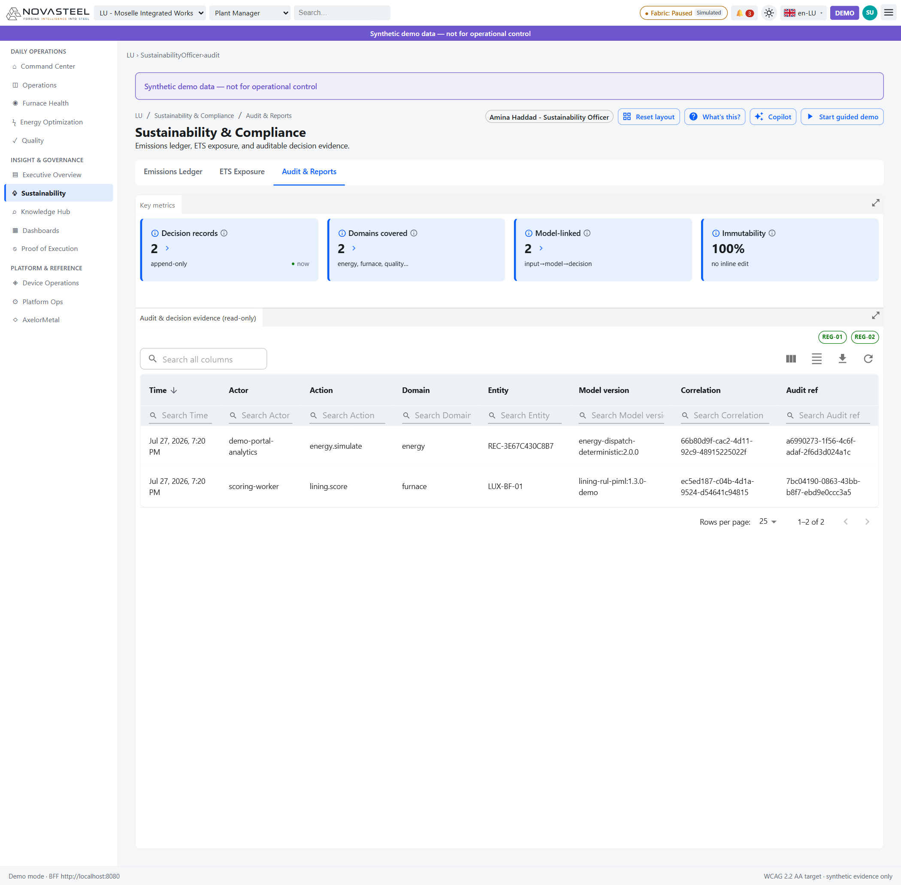

# 07 — Durabilité et conformité

**Audience :** grands débutants en sidérurgie et réglementation européenne  
**Temps de lecture :** 12 minutes  
**Persona :** Amina Haddad — Sustainability Officer  
**Routes couvertes :** `/{site}/sustainability-compliance/emissions-ledger`, `/{site}/sustainability-compliance/ets-exposure`, `/{site}/sustainability-compliance/audit`  
**Dernière mise à jour :** 2026-07-27  
[🇬🇧 English version](../en/07-sustainability-and-compliance.md)

La zone Durabilité de NovaSteel explique la performance carbone, l'exposition au système d'échange de quotas d'émission (EU ETS, European Union Emissions Trading System) et les preuves de décision avec des données synthétiques déterministes ; la BFF et les fixtures marquent ces données comme synthétiques et non destinées au contrôle opérationnel (`services\bff-api\src\bff_api\repository.py`, `apps\analytics-mfe\src\api\fixtures.ts`).

## Bases pour débutants

Le **système d'échange de quotas d'émission de l'Union européenne (EU ETS)** est un marché de plafonnement et d'échange. Le régulateur limite les émissions couvertes, les sidérurgistes restituent des quotas appelés **European Union Allowances (EUA)**, et un manque de quotas crée une exposition financière car il peut falloir en acheter en euros par tonne de dioxyde de carbone (CO₂) (`docs\presentation\proof_of_execution.md`).

| Scope | Sens simple | Exemple acier |
|---|---|---|
| Scope 1 | Émissions directes du procédé de l'entreprise. | Coke, gaz de haut-fourneau ou gaz naturel brûlé sur site. |
| Scope 2 | Émissions indirectes de l'électricité achetée. | Électricité réseau pour laminoirs, pompes, utilités et réchauffage. |
| Scope 3 | Autres émissions de la chaîne de valeur. | Mines, matières premières, transport ou usage client. |

NovaSteel implémente Scope 1 et Scope 2 dans cette zone ; le mécanisme d'ajustement carbone aux frontières (CBAM) et la directive sur les émissions industrielles ne sont pas implémentés en code (`docs\presentation\proof_of_execution.md`, `apps\analytics-mfe\src\proof\proofCatalog.ts`). Un **registre des émissions (emissions ledger)** est une liste traçable d'événements ; la démo calcule Scope 2 comme consommation électrique multipliée par l'intensité carbone réseau, avec une référence source (`services\bff-api\src\bff_api\repository.py`, `apps\analytics-mfe\src\api\fixtures.ts`). Une **chaîne de hachage (hash chain)** relie chaque enregistrement d'audit au hachage précédent ; une modification silencieuse casse les hachages suivants (`services\bff-api\src\bff_api\audit.py`, `services\knowledge-orchestrator\src\knowledge_orchestrator\audit.py`).

## Emissions Ledger — `/{site}/sustainability-compliance/emissions-ledger`

**En une phrase.** L'écran montre le CO₂ modélisé, l'intensité par tonne d'acier, la marge EU ETS et les lignes de registre derrière ces nombres.

**Contexte pour débutants.** Amina doit relier le coût carbone aux décisions d'usine, car le cas d'usage cite les « CO₂ emissions » sous pression des pénalités « EU Emissions Trading System (ETS) » et vise « CO₂ emissions reduced by 22% » (`docs\usecase\usecase.md`).

**Ce que vous voyez à l'écran.**  
1. Le bandeau violet **Synthetic demo data — not for operational control** avertit que les valeurs sont des fixtures, pas des mesures live (`services\bff-api\src\bff_api\repository.py`).
2. La pastille persona affiche **Amina Haddad - Sustainability Officer**, responsable du CO₂ et de l'ETS dans le persona (`docs\personas\personas-and-journeys.md`).
3. Quatre cartes KPI montrent **CO₂ (Scope 2) 165.9 t/day**, **CO₂ / t steel 1.42 t/t**, **ETS allowances left 71%** et **ETS € exposure €132K** à 86 €/t ; moins de CO₂ et plus de marge de quotas sont bons, une intensité qui monte ou une marge qui baisse sont mauvais (`apps\analytics-mfe\src\components\screens\SustainabilityEmissions.tsx`, `services\bff-api\src\bff_api\repository.py`).
4. **CO₂ trend vs target** trace une ligne bleue Scope 2 face à une cible pointillée, pour voir si les émissions par intervalle restent sous la cible journalière (`apps\analytics-mfe\src\components\screens\SustainabilityEmissions.tsx`).
5. **Emissions by scope** montre une grande barre Scope 1, environ 1 368 t, et une barre Scope 2, environ 165,9 t ; cela rappelle que l'acier intégré a de fortes émissions de procédé (`apps\analytics-mfe\src\components\screens\SustainabilityEmissions.tsx`, `apps\analytics-mfe\src\api\fixtures.ts`).
6. **Emissions ledger (immutable)** porte les badges `CHL-02` et `OUT-02`, avec recherche, colonnes, export, actualisation et lignes Date, Site, Scope 2 kgCO₂e ; bien signifie que chaque nombre remonte à un événement source (`apps\analytics-mfe\src\components\screens\SustainabilityEmissions.tsx`, `docs\presentation\proof_of_execution.md`).

**Pourquoi ce composant existe.** Il démontre le défi cité « CO₂ emissions under increasing pressure from EU Emissions Trading System (ETS) penalties » et la cible « CO₂ emissions reduced by 22% » (`docs\usecase\usecase.md`). Le catalogue associe l'écran à `CHL-02` et `OUT-02`, tout en rappelant que −22 % est une cible synthétique, pas une mesure de dépôt (`apps\analytics-mfe\src\proof\proofCatalog.ts`, `docs\presentation\proof_of_execution.md`).

**Objectif & preuves (proof of execution).**

| Élément du cas d'usage | ID d'exigence | Preuve dans l'app en fonctionnement | Origine du chiffre (route API + fichier source) |
|---|---|---|---|
| Pression CO₂ liée à l'ETS | `CHL-02` | Badge du registre, KPI CO₂, KPI exposition ETS. | `GET /v1/sustainability/emissions`, `GET /v1/sustainability/summary` ; `apps\analytics-mfe\src\api\dataClient.ts`, `services\bff-api\src\bff_api\routes.py`, `services\bff-api\src\bff_api\repository.py`. |
| Cible de réduction CO₂ | `OUT-02` | `target −22%` sur le KPI et badge du registre. | UI dans `SustainabilityEmissions.tsx` ; réserve dans `docs\presentation\proof_of_execution.md`. |
| Contexte ETS | `REG-03` | Le registre nourrit l'histoire d'exposition ETS, mais la preuve est partielle. | `GET /v1/sustainability/summary` ; `apps\analytics-mfe\src\proof\proofCatalog.ts`. |

**Comment la donnée arrive à l'écran.** `SustainabilityEmissions.tsx` appelle `client.getEmissions()` et `client.getSustainabilitySummary()` ; `DataClient` mappe vers `GET /v1/sustainability/emissions` et `GET /v1/sustainability/summary` ; FastAPI lit `DemoRepository.emissions_rows()` et `DemoRepository.sustainability_summary()` ; le mode hors ligne utilise `fixtures.emissions()` et `fixtures.sustainabilitySummary()` (`apps\analytics-mfe\src\components\screens\SustainabilityEmissions.tsx`, `apps\analytics-mfe\src\api\dataClient.ts`, `services\bff-api\src\bff_api\routes.py`, `services\bff-api\src\bff_api\repository.py`, `apps\analytics-mfe\src\api\fixtures.ts`).

**Honnêteté & limites.** Scope 2 est modélisé depuis énergie et intensité carbone, Scope 1 est une formule de démo, et aucun dépôt ETS officiel n'est produit (`services\bff-api\src\bff_api\repository.py`, `docs\presentation\proof_of_execution.md`).

**Essayez vous-même.** Ouvrez `http://localhost:5266/LU/sustainability-compliance/emissions-ledger` et comparez les cartes KPI au registre (`docs\ux\dashboard-specification.md`, `apps\analytics-mfe\src\components\screens\SustainabilityEmissions.tsx`).

## ETS Exposure — `/{site}/sustainability-compliance/ets-exposure`

**En une phrase.** L'écran convertit l'usage des quotas et les émissions modélisées en vue simple du risque financier.

**Contexte pour débutants.** L'exposition EU ETS est le coût possible de quotas supplémentaires quand les émissions dépassent le budget ; NovaSteel utilise un prix synthétique de 86 €/t et une projection déterministe, pas un compte de registre live (`apps\analytics-mfe\src\components\screens\SustainabilityEts.tsx`, `services\bff-api\src\bff_api\repository.py`).

**Ce que vous voyez à l'écran.**  
1. Les cartes KPI affichent **Allowances used 71%**, **ETS price €86/t**, **Projected overage Month 5** et **Exposure €248K** ; le jaune signale une revue, le vert reste une prévision modélisée (`apps\analytics-mfe\src\components\screens\SustainabilityEts.tsx`).
2. **ETS allowance projection** montre l'usage cumulé par mois, avec **Guidance 85%** en orange et **Cap 100%** en rouge ; approcher 85 % est une alerte précoce, dépasser 100 % signifie dépasser le plafond synthétique (`apps\analytics-mfe\src\components\screens\SustainabilityEts.tsx`).
3. La jauge **Allowances used vs cap** répète 71 % et porte le badge `REG-03` ; bien signifie qu'il reste de la marge, mal que l'aiguille avance vers le plafond (`apps\analytics-mfe\src\components\screens\SustainabilityEts.tsx`, `apps\analytics-mfe\src\proof\proofCatalog.ts`).
4. La légende indique que les cibles sont modélisées et synthétiques, pas des engagements financiers, point essentiel pour une discussion EU ETS honnête (`apps\analytics-mfe\src\components\screens\SustainabilityEts.tsx`, `docs\presentation\proof_of_execution.md`).

**Pourquoi ce composant existe.** L'objectif persona d'Amina est de gérer l'exposition aux coûts EU ETS, et le cas d'usage place les pénalités ETS parmi les pressions centrales (`docs\personas\personas-and-journeys.md`, `docs\usecase\usecase.md`). Le catalogue mappe ETS Exposure à `REG-03` et le marque partiel car benchmark et prix de quotas sont des constantes de démo (`apps\analytics-mfe\src\proof\proofCatalog.ts`).

**Objectif & preuves (proof of execution).**

| Élément du cas d'usage | ID d'exigence | Preuve dans l'app en fonctionnement | Origine du chiffre (route API + fichier source) |
|---|---|---|---|
| Obligations sectorielles EU ETS | `REG-03` | Badge de jauge, projection, prix et KPI exposition. | `GET /v1/sustainability/summary` ; constantes dans `apps\analytics-mfe\src\components\screens\SustainabilityEts.tsx` ; route dans `services\bff-api\src\bff_api\routes.py`. |
| Pression CO₂/ETS | `CHL-02` | L'exposition relie carbone et risque financier. | Résumé depuis `services\bff-api\src\bff_api\repository.py` ; calcul UI dans `SustainabilityEmissions.tsx`. |
| Honnêteté de dépôt | Réserve `REG-03` | Le texte précise que les cibles sont modélisées, pas des engagements. | `docs\presentation\proof_of_execution.md`, `apps\analytics-mfe\src\components\screens\SustainabilityEts.tsx`. |

**Comment la donnée arrive à l'écran.** `SustainabilityEts.tsx` appelle `client.getSustainabilitySummary()` ; `DataClient` demande `GET /v1/sustainability/summary` ; la BFF renvoie `DemoRepository.sustainability_summary()` ; 71 %, 85 %, 100 % et 248 k€ sont des constantes UI déterministes (`apps\analytics-mfe\src\components\screens\SustainabilityEts.tsx`, `apps\analytics-mfe\src\api\dataClient.ts`, `services\bff-api\src\bff_api\routes.py`, `services\bff-api\src\bff_api\repository.py`).

**Honnêteté & limites.** L'écran ne se connecte pas au registre de l'Union, ne calcule pas l'allocation gratuite légale, n'implémente pas CBAM et ne dépose rien auprès d'une autorité (`docs\presentation\proof_of_execution.md`, `apps\analytics-mfe\src\proof\proofCatalog.ts`).

**Essayez vous-même.** Ouvrez `http://localhost:5266/LU/sustainability-compliance/ets-exposure` et lisez la jauge 71 % avec la projection (`docs\ux\dashboard-specification.md`, `apps\analytics-mfe\src\components\screens\SustainabilityEts.tsx`).

## Audit & Reports — `/{site}/sustainability-compliance/audit`

**En une phrase.** L'écran est la table de preuves en lecture seule des décisions assistées par IA.

**Contexte pour débutants.** Un auditeur demande qui a agi, ce qui a changé, quel modèle ou règle l'a produit, et si l'enregistrement peut être modifié ; NovaSteel répond par un audit append-only et chaîné par hachage (`services\bff-api\src\bff_api\audit.py`, `docs\presentation\proof_of_execution.md`).

**Ce que vous voyez à l'écran.**  
1. Les KPI affichent **Decision records 2**, **Domains covered 2**, **Model-linked 2** et **Immutability 100%** ; bien signifie que les lignes visibles ont acteur/action/entité/modèle (`apps\analytics-mfe\src\components\screens\SustainabilityAudit.tsx`).
2. La table **Audit & decision evidence (read-only)** porte `REG-01` et `REG-02`, liés aux preuves RGPD et EU AI Act (`apps\analytics-mfe\src\components\screens\SustainabilityAudit.tsx`, `apps\analytics-mfe\src\proof\proofCatalog.ts`).
3. Les colonnes incluent Time, Actor, Action, Domain, Entity, Model version, Correlation et Audit ref ; les lignes visibles incluent `energy.simulate` et `lining.score` (`apps\analytics-mfe\src\components\screens\SustainabilityAudit.tsx`).
4. Recherche, contrôles de colonnes, téléchargement et actualisation indiquent une surface revue/export, pas édition ; le service audit expose append et query, pas update/delete publics (`services\bff-api\src\bff_api\audit.py`).
5. Un auditeur échantillonnerait les lignes, réconcilierait les sources et vérifierait la chaîne de hachage ; `verify()` recalcule la chaîne et échoue si une ligne a été altérée (`services\bff-api\src\bff_api\audit.py`, `services\knowledge-orchestrator\src\knowledge_orchestrator\audit.py`).

**Pourquoi ce composant existe.** Le RGPD demande des données licites, minimisées et effaçables, et le contexte EU AI Act demande supervision humaine, transparence et traçabilité ; `REG-01` et `REG-02` capturent ces contrôles (`docs\presentation\proof_of_execution.md`, `apps\analytics-mfe\src\proof\proofCatalog.ts`).

**Objectif & preuves (proof of execution).**

| Élément du cas d'usage | ID d'exigence | Preuve dans l'app en fonctionnement | Origine du chiffre (route API + fichier source) |
|---|---|---|---|
| Responsabilité RGPD et effacement | `REG-01` | Badge audit ; l'effacement ajoute un tombstone et conserve la vérification. | `GET /v1/audit/decisions`, `POST /v1/privacy/erasure-requests/{id}:execute` ; `services\bff-api\src\bff_api\routes.py`, `services\knowledge-orchestrator\src\knowledge_orchestrator\erasure.py`. |
| Traçabilité EU AI Act | `REG-02` | Lignes en lecture seule avec acteur, action, modèle et corrélation. | `GET /v1/audit/decisions` ; `services\bff-api\src\bff_api\audit.py` ; `SustainabilityAudit.tsx`. |
| Lignage opérationnel | `CHL-02`, lié | Exemples visibles énergie et four. | `DataClient.getAudit()` vers `/v1/audit/decisions` ; fallback dans `apps\analytics-mfe\src\api\fixtures.ts`. |

**Comment la donnée arrive à l'écran.** `SustainabilityAudit.tsx` appelle `client.getAudit()` ; `DataClient.getAudit()` demande `GET /v1/audit/decisions` ; la route BFF appelle `services.audit.query()` ; le mode hors ligne utilise `fixtures.auditDecisions()` (`apps\analytics-mfe\src\components\screens\SustainabilityAudit.tsx`, `apps\analytics-mfe\src\api\dataClient.ts`, `services\bff-api\src\bff_api\routes.py`, `services\bff-api\src\bff_api\audit.py`, `apps\analytics-mfe\src\api\fixtures.ts`).

**Honnêteté & limites.** L'UI a des contrôles d'export, mais ce n'est pas un dossier de dépôt officiel. L'effacement RGPD Article 17 existe pour les données connaissance via suppression, pseudonymisation et tombstone d'audit ; l'expiration automatique après `retentionDays` reste un runbook, pas un job actif (`services\knowledge-orchestrator\src\knowledge_orchestrator\erasure.py`, `docs\presentation\proof_of_execution.md`).

**Essayez vous-même.** Ouvrez `http://localhost:5266/LU/sustainability-compliance/audit`, filtrez un domaine et expliquez la chaîne acteur/action/entité/version (`apps\analytics-mfe\src\components\screens\SustainabilityAudit.tsx`, `services\bff-api\src\bff_api\routes.py`).

## Ce qu'il faudrait avant un vrai dépôt réglementaire

| Besoin | Pourquoi c'est important | Statut actuel |
|---|---|---|
| Plan de mesure, reporting et vérification | Les régulateurs exigent compteurs calibrés, périmètres légaux et vérification tierce. | Fixtures de démo seulement (`services\bff-api\src\bff_api\repository.py`). |
| Données live du registre EU ETS | La vraie exposition dépend des quotas détenus, restitués et gratuits. | Constantes de démo (`apps\analytics-mfe\src\components\screens\SustainabilityEts.tsx`). |
| Cartographie entité légale / installation | Les rapports ETS sont par installation autorisée, pas par site démo. | Routes `/{site}/...` et données `NS-DEMO-*` (`services\bff-api\src\bff_api\repository.py`). |
| Modèles de rapport et vérificateur | Exporter n'est pas déposer. | L'UX décrit l'export ; la preuve ne revendique aucun dépôt (`docs\ux\dashboard-specification.md`, `docs\presentation\proof_of_execution.md`). |
| CBAM / directive émissions industrielles | Peut compter dans de vrais permis et échanges acier. | Non implémenté (`docs\presentation\proof_of_execution.md`). |

---

[◀ Précédent : 06 — Qualité](06-quality.md) | [▲ Index](LISEZMOI.md) | [Suivant ▶ : 08 — Knowledge Hub](08-knowledge-hub.md)
