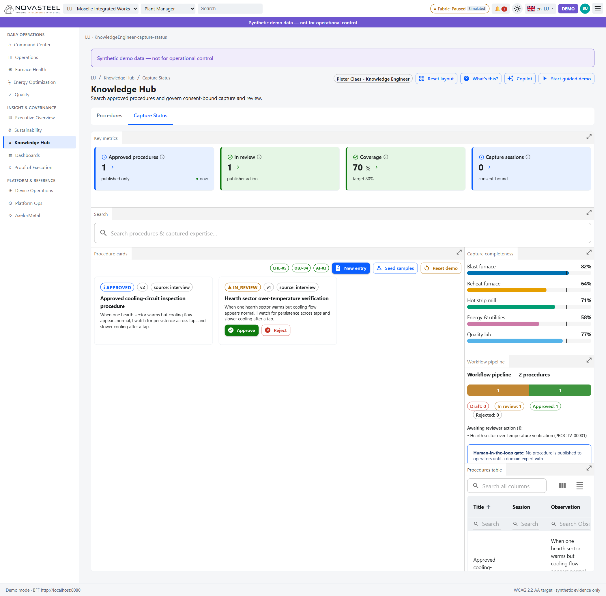

# 08 — Knowledge Hub

**Audience :** grands débutants en opérations sidérurgiques, IA générative et gouvernance de la confidentialité  
**Temps de lecture :** 12 minutes  
**Persona :** Pieter Claes — Knowledge Engineer / Admin  
**Routes couvertes :** `/{site}/knowledge-hub/procedures`, `/{site}/knowledge-hub/capture-status`  
**Dernière mise à jour :** 2026-07-27  
[🇬🇧 English version](../en/08-knowledge-hub.md)

Le Knowledge Hub est la zone IA la plus humaine de NovaSteel. Il répond au problème du cas d'usage : les « Skilled operators » partent à la retraite et la « knowledge » disparaît plus vite qu'elle n'est capturée ; il implémente aussi le troisième point d'infusion IA, un système de capture de connaissances par IA générative (GenAI) qui interviewe les opérateurs et transforme leur expertise en bibliothèques de procédures consultables (`docs\usecase\usecase.md`).

## Bases pour débutants

Les opérateurs sidérurgiques expérimentés savent souvent des choses jamais écrites : le bruit d'un four avant un problème, le motif de température qui montre qu'un capteur ment, ou le moment où appeler la maintenance. C'est du **savoir tacite**, et le persona Pieter existe pour le capturer sans danger avant qu'il ne disparaisse (`docs\personas\personas-and-journeys.md`).

Le flux NovaSteel est : consentement → reconnaissance vocale (speech-to-text) → extraction ancrée → revue par critique → revue humaine → procédure approuvée et recherchable. Ces étapes sont implémentées dans l'orchestrateur, la boucle critique et le workflow (`services\knowledge-orchestrator\src\knowledge_orchestrator\orchestrator.py`, `services\knowledge-orchestrator\src\knowledge_orchestrator\critic.py`, `services\knowledge-orchestrator\src\knowledge_orchestrator\procedure_workflow.py`).

La **génération augmentée par la recherche (RAG, retrieval-augmented generation)** signifie que l'IA récupère des sources approuvées avant de répondre. NovaSteel combine recherche lexicale BM25 et similarité cosinus, fusionne les rangs par **reciprocal rank fusion (RRF)**, et refuse si aucune source approuvée ne fonde la réponse (`services\knowledge-orchestrator\src\knowledge_orchestrator\retrieval.py`, `services\knowledge-orchestrator\src\knowledge_orchestrator\orchestrator.py`). « Pas de citation ⇒ pas de réponse » est essentiel, car une procédure inventée et dangereuse est pire qu'un refus clair (`services\knowledge-orchestrator\src\knowledge_orchestrator\grounding.py`, `docs\demo\demo-runbook.md`).

La chaîne sécurité/confidentialité exige le consentement avant capture, expurge ou pseudonymise les données personnelles (PII, personally identifiable information), filtre l'entrée et la sortie par sécurité du contenu, et interdit aux agents les outils publier/approuver/supprimer/planifier (`services\knowledge-orchestrator\src\knowledge_orchestrator\consent.py`, `services\knowledge-orchestrator\src\knowledge_orchestrator\pii.py`, `services\knowledge-orchestrator\src\knowledge_orchestrator\content_safety.py`, `services\knowledge-orchestrator\src\knowledge_orchestrator\tools.py`).

## Procedures — `/{site}/knowledge-hub/procedures`

**En une phrase.** L'écran permet à Pieter de rechercher l'expertise capturée, de revoir les cartes de procédure et de publier seulement la connaissance approuvée par un humain.

**Contexte pour débutants.** Une procédure est un jeu d'instructions fiable pour le travail en usine. Dans NovaSteel, elle peut être `DRAFT`, `IN_REVIEW`, `APPROVED` ou `REJECTED` ; seules les procédures approuvées sont généralement récupérables, et l'approbation exige le rôle `Knowledge.Publisher` (`services\knowledge-orchestrator\src\knowledge_orchestrator\procedure_workflow.py`, `docs\implementation\api-contracts.md`).

**Ce que vous voyez à l'écran.**  
1. L'en-tête indique **Knowledge Hub** et le sous-titre dit qu'il recherche les procédures approuvées et gouverne la capture liée au consentement, ce qui correspond à l'UX de Pieter (`docs\ux\dashboard-specification.md`).
2. Les KPI affichent **Approved procedures 1**, **In review 1**, **Coverage 70%** et **Capture sessions 0** ; bien signifie que la connaissance approuvée et la couverture montent, mal que trop de savoir reste en revue ou absent (`apps\analytics-mfe\src\components\screens\KnowledgeHub.tsx`).
3. Le champ **Search procedures & captured expertise...** filtre la bibliothèque ; avec du texte il appelle `client.searchKnowledge()`, à vide `client.getProcedures()` (`apps\analytics-mfe\src\components\screens\KnowledgeHub.tsx`, `apps\analytics-mfe\src\api\dataClient.ts`).
4. Le panneau **Procedure cards** porte les badges `CHL-05`, `OBJ-04` et `AI-03`, plus **New entry**, **Seed samples** et **Reset demo**, câblés aux routes de connaissance (`apps\analytics-mfe\src\components\screens\KnowledgeHub.tsx`, `apps\analytics-mfe\src\api\knowledgeClient.ts`).
5. La première carte est **Approved cooling-circuit inspection procedure**, marquée `APPROVED`, `v2` et `source: interview` ; approuvé signifie récupérable comme connaissance publiée (`apps\analytics-mfe\src\components\screens\KnowledgeHub.tsx`, `services\knowledge-orchestrator\src\knowledge_orchestrator\procedure_workflow.py`).
6. La deuxième carte est **Hearth sector over-temperature verification**, marquée `IN_REVIEW`, `v1` et `source: interview`, avec **Approve** et **Reject** ; c'est la porte humaine avant que les opérateurs puissent s'appuyer sur le brouillon (`apps\analytics-mfe\src\components\screens\KnowledgeHub.tsx`, `docs\personas\personas-and-journeys.md`).
7. **Capture completeness** montre Blast furnace 82 %, Reheat furnace 64 %, Hot strip mill 71 %, Energy & utilities 58 % et Quality lab 77 % ; les barres faibles indiquent les sujets où interviewer des experts proches de la retraite (`apps\analytics-mfe\src\api\fixtures.ts`, `apps\analytics-mfe\src\components\screens\KnowledgeHub.tsx`).
8. **Workflow pipeline — 2 procedures** montre une procédure en revue et une approuvée, suivi de **Human-in-the-loop gate**, qui précise qu'aucune procédure n'est publiée sans expert `Knowledge.Publisher` (`apps\analytics-mfe\src\components\screens\KnowledgeHub.tsx`, `services\knowledge-orchestrator\src\knowledge_orchestrator\procedure_workflow.py`).
9. La table **Procedures table** en bas contient des colonnes recherchables comme Title, Session, Observation, Review status et Version ; elle sert à la revue/export, tandis que les règles d'état sont côté serveur (`apps\analytics-mfe\src\components\screens\KnowledgeHub.tsx`, `services\knowledge-orchestrator\src\knowledge_orchestrator\procedure_workflow.py`).
10. La réponse ancrée n'est pas visible dans cette capture statique. Elle est implémentée via `POST /v1/knowledge/query`, qui renvoie des citations inline `[[chunk-id]]` ou un refus structuré comme `no_grounded_source` quand aucun contenu approuvé ne peut répondre (`services\bff-api\src\bff_api\routes.py`, `services\knowledge-orchestrator\src\knowledge_orchestrator\orchestrator.py`, `docs\demo\demo-runbook.md`).
11. Le bouton **Copilot** de l'en-tête ouvre un assistant contextuel séparé ; ce guide le mentionne brièvement car le guide 14 couvre les fonctions transverses (`apps\analytics-mfe\src\components\copilot\CopilotPanel.tsx`, `docs\demo\demo-runbook.md`).

**Pourquoi ce composant existe.** Le cas d'usage dit « Skilled operators retiring, with knowledge disappearing faster than it can be captured » et demande un « GenAI knowledge-capture system » qui interviewe les opérateurs et structure l'expertise en bibliothèques consultables (`docs\usecase\usecase.md`). Le persona Pieter possède la revue, la publication et les écarts de couverture (`docs\personas\personas-and-journeys.md`).

**Objectif & preuves (proof of execution).**

| Élément du cas d'usage | ID d'exigence | Preuve dans l'app en fonctionnement | Origine du chiffre (route API + fichier source) |
|---|---|---|---|
| Départ des opérateurs et perte de connaissance | `CHL-05` | Badges et cartes de procédure issues d'interviews. | `GET /v1/knowledge/procedures`, `GET /v1/knowledge/search` ; `apps\analytics-mfe\src\api\dataClient.ts`, `services\bff-api\src\bff_api\routes.py`, `services\bff-api\src\bff_api\knowledge_adapter.py`. |
| Capturer et structurer l'expertise | `OBJ-04` | Cycle draft/review/approved, versions, boutons d'approbation. | `POST /v1/knowledge/interviews`, `POST /v1/knowledge/procedures/{id}:submit`, `:approve`, `:reject` ; `services\knowledge-orchestrator\src\knowledge_orchestrator\procedure_workflow.py`. |
| Capture GenAI | `AI-03` | Extraction ancrée, boucle critique, recherche approuvée seulement, refus structuré. | `POST /v1/knowledge/query` ; `services\knowledge-orchestrator\src\knowledge_orchestrator\retrieval.py`, `grounding.py`, `critic.py`, `orchestrator.py`. |
| Capture RGPD licite/minimisée | `REG-01` | New entry exige le consentement ; PII expurgée. | `POST /v1/knowledge/interviews` ; `apps\analytics-mfe\src\components\screens\KnowledgeHub.tsx`, `services\knowledge-orchestrator\src\knowledge_orchestrator\consent.py`, `pii.py`. |

**Comment la donnée arrive à l'écran.** `KnowledgeHub.tsx` appelle `client.getProcedures()` ou `client.searchKnowledge()` via `DataClient` ; la BFF expose `GET /v1/knowledge/procedures` et `GET /v1/knowledge/search` ; `KnowledgeAdapter` délègue à `KnowledgeOrchestrator` ; le fallback hors ligne utilise `fixtures.procedures()` et `knowledgeCoverage()` (`apps\analytics-mfe\src\components\screens\KnowledgeHub.tsx`, `apps\analytics-mfe\src\api\dataClient.ts`, `services\bff-api\src\bff_api\routes.py`, `services\bff-api\src\bff_api\knowledge_adapter.py`, `apps\analytics-mfe\src\api\fixtures.ts`).

**Honnêteté & limites.** La capture prouve l'UI visible recherche/cartes/revue/couverture, pas un panneau de réponse affiché. Le comportement RAG et refus est documenté depuis le code BFF/orchestrateur et le runbook (`services\bff-api\src\bff_api\routes.py`, `services\knowledge-orchestrator\src\knowledge_orchestrator\orchestrator.py`, `docs\demo\demo-runbook.md`). Le mode démo hors ligne utilise des adaptateurs locaux déterministes ; Azure Foundry GPT-4o est câblé mais nécessite un modèle déployé (`services\bff-api\src\bff_api\knowledge_adapter.py`, `services\knowledge-orchestrator\src\knowledge_orchestrator\adapters\azure_foundry.py`, `docs\presentation\proof_of_execution.md`).

**Essayez vous-même.** Ouvrez `http://localhost:5266/LU/knowledge-hub/procedures`, cherchez `cooling` ou `hearth`, puis comparez les cartes approuvées et en revue (`apps\analytics-mfe\src\components\screens\KnowledgeHub.tsx`, `apps\analytics-mfe\src\api\fixtures.ts`).

## Capture Status — `/{site}/knowledge-hub/capture-status`

**En une phrase.** L'écran montre si la capture de connaissances est liée au consentement, revue, approuvée et assez large sur les sujets critiques.

**Contexte pour débutants.** Le statut de capture est la gouvernance : consentement enregistré, interviews transcrites, brouillons extraits, revue réalisée, et publication uniquement des versions approuvées (`services\knowledge-orchestrator\src\knowledge_orchestrator\consent.py`, `services\knowledge-orchestrator\src\knowledge_orchestrator\orchestrator.py`, `services\knowledge-orchestrator\src\knowledge_orchestrator\procedure_workflow.py`).

**Ce que vous voyez à l'écran.**  
1. L'onglet actif est **Capture Status**, mais la disposition dockée affiche encore KPI, recherche, cartes, complétude, pipeline et table (`apps\analytics-mfe\src\components\screens\KnowledgeHub.tsx`).
2. **Capture sessions 0** a la cible **consent-bound**, ce qui rappelle que le consentement `knowledge-capture` et une rétention positive sont requis avant l'enregistrement (`apps\analytics-mfe\src\components\screens\KnowledgeHub.tsx`, `services\bff-api\src\bff_api\routes.py`, `services\knowledge-orchestrator\src\knowledge_orchestrator\consent.py`).
3. **New entry** ouvre les champs titre, domaine, référence opérateur, jours de rétention, notice de consentement et case de consentement explicite au titre de l'article 6(1)(a) du RGPD ; le bouton reste désactivé tant que consentement et champs requis manquent (`apps\analytics-mfe\src\components\screens\KnowledgeHub.tsx`).
4. Le cycle est **draft → in review → approved** : `DRAFT` peut être soumis, `IN_REVIEW` approuvé ou rejeté, et `APPROVED`/`REJECTED` sont terminaux (`apps\analytics-mfe\src\components\screens\KnowledgeHub.tsx`, `services\knowledge-orchestrator\src\knowledge_orchestrator\procedure_workflow.py`).
5. **Coverage 70%** vise 80 % ; bien signifie que les domaines clés sont couverts, mal que l'expertise reste non documentée (`apps\analytics-mfe\src\components\screens\KnowledgeHub.tsx`, `apps\analytics-mfe\src\api\fixtures.ts`).
6. **Human-in-the-loop gate** confirme qu'aucune procédure n'atteint les opérateurs sans l'approbation `Knowledge.Publisher`, ce qui soutient la preuve de supervision EU AI Act (`apps\analytics-mfe\src\components\screens\KnowledgeHub.tsx`, `apps\analytics-mfe\src\proof\proofCatalog.ts`).
7. L'effacement RGPD Article 17 n'est pas visible, mais le backend supprime les transcriptions et conversations Copilot, pseudonymise l'attribution des procédures et ajoute un tombstone `erasure.executed` tout en préservant la chaîne de hachage (`services\knowledge-orchestrator\src\knowledge_orchestrator\erasure.py`, `docs\security\security-governance-and-threat-model.md`).

**Pourquoi ce composant existe.** La preuve dit que le pipeline transforme une interview orale en procédure structurée, citée, revue et versionnée, et que rien n'arrive dans la bibliothèque sans éditeur humain nommé et piste d'audit complète (`docs\presentation\proof_of_execution.md`). Pieter est responsable de cette porte de publication (`docs\personas\personas-and-journeys.md`).

**Objectif & preuves (proof of execution).**

| Élément du cas d'usage | ID d'exigence | Preuve dans l'app en fonctionnement | Origine du chiffre (route API + fichier source) |
|---|---|---|---|
| Capturer l'expertise avant sa perte | `OBJ-04` | KPI Coverage, barres, pipeline, gate humaine. | `knowledgeCoverage()` et statuts ; `apps\analytics-mfe\src\api\fixtures.ts`, `apps\analytics-mfe\src\components\screens\KnowledgeHub.tsx`. |
| Système GenAI de capture | `AI-03` | Consentement → STT → extraction → critique → revue → procédure approuvée. | `POST /v1/knowledge/interviews` ; `services\knowledge-orchestrator\src\knowledge_orchestrator\orchestrator.py`, `critic.py`, `adapters\local_speech.py`, `adapters\local_foundry.py`, `adapters\azure_foundry.py`. |
| Capture RGPD licite, minimisée, effaçable | `REG-01` | Dialogue de consentement, rétention, redaction PII, effacement Article 17. | `services\knowledge-orchestrator\src\knowledge_orchestrator\consent.py`, `pii.py`, `erasure.py` ; route privacy dans `services\bff-api\src\bff_api\routes.py`. |
| Supervision humaine de l'IA | `REG-02` | Gate `Knowledge.Publisher` et outils agent interdits. | `services\knowledge-orchestrator\src\knowledge_orchestrator\procedure_workflow.py`, `tools.py`, `apps\analytics-mfe\src\proof\proofCatalog.ts`. |

**Comment la donnée arrive à l'écran.** `KnowledgeHub.tsx` calcule les compteurs depuis `proceduresState.data`, obtient la couverture via `knowledgeCoverage()`, et utilise `KnowledgeClient` pour créer, soumettre, approuver, rejeter, semer ou réinitialiser. `KnowledgeClient` mappe vers `POST /v1/knowledge/interviews`, `POST /v1/knowledge/procedures/{id}:submit`, `:approve`, `:reject` ; `KnowledgeAdapter` encapsule `KnowledgeOrchestrator` (`apps\analytics-mfe\src\components\screens\KnowledgeHub.tsx`, `apps\analytics-mfe\src\api\knowledgeClient.ts`, `services\bff-api\src\bff_api\routes.py`, `services\bff-api\src\bff_api\knowledge_adapter.py`, `services\knowledge-orchestrator\src\knowledge_orchestrator\orchestrator.py`).

**Honnêteté & limites.** La capture montre zéro session actuelle et deux procédures de base ; elle ne prouve ni microphone live ni consentement de production. Le mode démo injecte de l'audio synthétique fixture et une extraction locale déterministe ; Azure Speech, Azure Content Safety et Azure Foundry demandent une configuration cloud (`services\bff-api\src\bff_api\knowledge_adapter.py`, `services\knowledge-orchestrator\src\knowledge_orchestrator\adapters\azure_speech.py`, `services\knowledge-orchestrator\src\knowledge_orchestrator\adapters\azure_content_safety.py`, `services\knowledge-orchestrator\src\knowledge_orchestrator\adapters\azure_foundry.py`).

**Essayez vous-même.** Ouvrez `http://localhost:5266/LU/knowledge-hub/capture-status`, cliquez **New entry** pour inspecter le consentement, puis annulez sauf si vous voulez une session synthétique (`apps\analytics-mfe\src\components\screens\KnowledgeHub.tsx`, `apps\analytics-mfe\src\api\knowledgeClient.ts`).

## Pourquoi grounding, refus et RGPD vont ensemble

| Contrôle | Raison simple | Preuve dépôt |
|---|---|---|
| Grounding (ancrage) | Les réponses doivent citer un texte approuvé ou des segments de transcription. | `services\knowledge-orchestrator\src\knowledge_orchestrator\grounding.py`, `retrieval.py`. |
| RAG approuvé seulement | Les brouillons ne deviennent pas des réponses officielles. | `services\knowledge-orchestrator\src\knowledge_orchestrator\procedure_workflow.py`, `retrieval.py`. |
| Refus structuré | Sans source approuvée, le système refuse au lieu d'inventer. | `services\knowledge-orchestrator\src\knowledge_orchestrator\retrieval.py`, `docs\demo\demo-runbook.md`. |
| Redaction PII | Noms, emails, téléphones, IDs employés et données proches sont minimisés. | `services\knowledge-orchestrator\src\knowledge_orchestrator\pii.py`. |
| Double sécurité contenu | Entrée utilisateur et sortie modèle sont filtrées. | `services\knowledge-orchestrator\src\knowledge_orchestrator\content_safety.py`, `adapters\azure_content_safety.py`. |
| Effacement Article 17 | Les données personnelles peuvent être supprimées ou pseudonymisées sans casser la chaîne d'audit. | `services\knowledge-orchestrator\src\knowledge_orchestrator\erasure.py`, `docs\security\security-governance-and-threat-model.md`. |

---

[◀ Précédent : 07 — Durabilité et conformité](07-sustainability-and-compliance.md) | [▲ Index](LISEZMOI.md) | [Suivant ▶ : 09 — Executive Overview](09-executive-overview.md)
