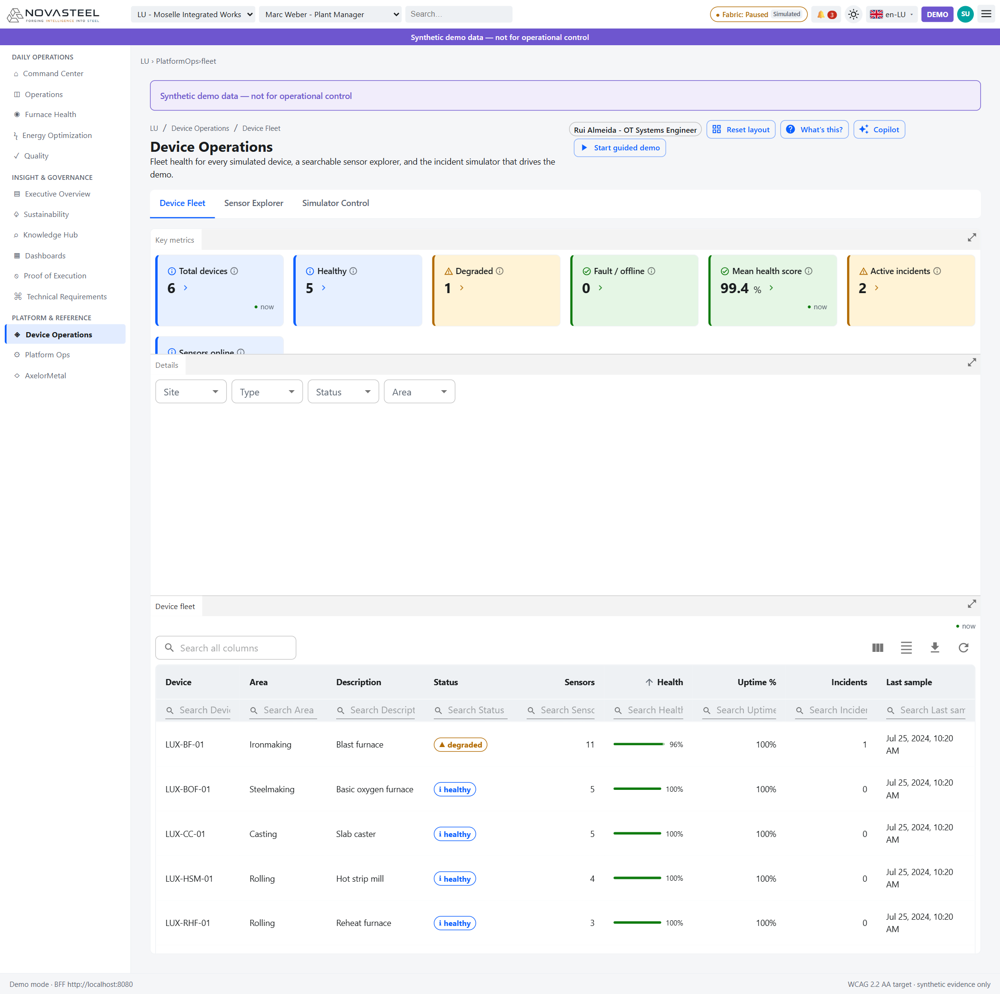
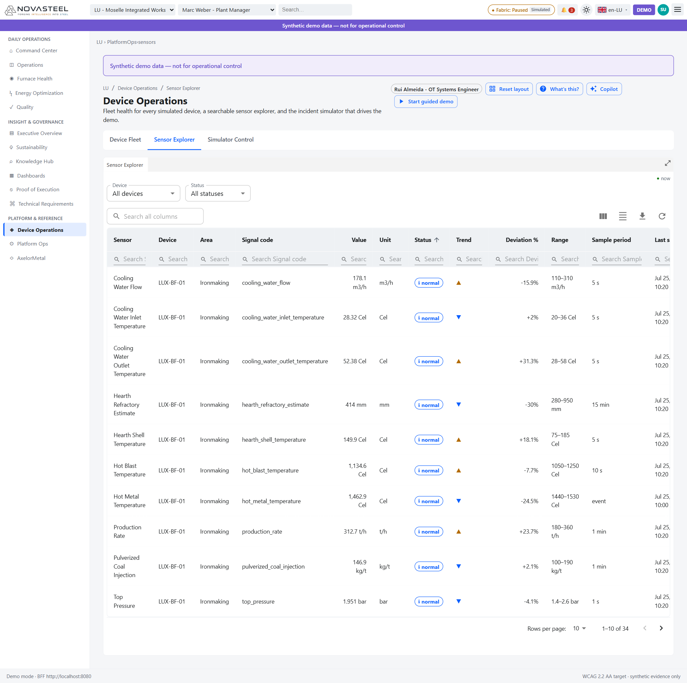

# 10 — Opérations des équipements

**Public visé :** personnes débutantes en sidérurgie, télémétrie industrielle et supervision OT  
**Temps de lecture :** 17 minutes  
**Persona :** Rui Almeida, ingénieur systèmes OT  
**Routes couvertes :** `/lu/device-operations/fleet`, `/lu/device-operations/sensors`, `/lu/device-operations/simulator`  
**Dernière mise à jour :** 2026-07-27  
[🇬🇧 English version](../en/10-device-operations.md)

Opérations des équipements est la couche **technologie opérationnelle** (OT, operational technology) derrière la démo. L’OT désigne la technologie du terrain qui surveille les équipements physiques ; l’IT désigne les systèmes d’information métier. NovaSteel lit une télémétrie OT simulée pour garder une démo sûre et reproductible. (`docs\ux\dashboard-specification.md`; `docs\data\synthetic-data-and-simulators.md`)

Sur le site Luxembourg, la flotte contient **6 équipements** et la table de capteurs **34 capteurs**. Le simulateur couvre les quatre sites ; son contrôle affiche donc **17 équipements** et **91 capteurs**. (`docs\data\synthetic-data-and-simulators.md`; `apps\analytics-mfe\src\api\deviceClient.ts`)

Un **capteur** (sensor) remonte une valeur physique : température, pression, débit ou flux thermique. La **télémétrie** (telemetry) est le flux de ces valeurs. Le **temps événement** (event time) est l’heure de mesure dans l’horloge simulée ; le **temps d’ingestion** (ingestion time) est l’heure de réception par un système. (`services\bff-api\src\bff_api\routes.py`; `apps\analytics-mfe\src\api\deviceDomain.ts`)

---

## Flotte d’équipements (Device Fleet) — `/lu/device-operations/fleet`

**En une phrase.** Cet écran résume la santé de la flotte luxembourgeoise simulée qui alimente NovaSteel. (`apps\analytics-mfe\src\components\screens\DeviceFleet.tsx`)

**Contexte sidérurgique pour débutants.** Les équipements visibles couvrent la préparation de la fonte, l’élaboration de l’acier, la coulée, le laminage et les utilités : haut-fourneau, convertisseur à oxygène, coulée de brames, four de réchauffage, laminoir à chaud et système énergie. (`docs\data\synthetic-data-and-simulators.md`; `apps\analytics-mfe\src\api\deviceFixtures.ts`)

**Ce que vous voyez à l’écran.**
1. Les KPI affichent **Total devices 6**, **Healthy 5**, **Degraded 1**, **Fault / offline 0**, **Mean health score 99.4%** et **Active incidents 2**. La carte **Sensors online** est partiellement masquée par le dock, mais le composant la calcule à partir des capteurs. Bon signe : équipements sains, santé moyenne élevée et zéro incident ; mauvais signe : degraded, fault, offline ou incidents en hausse. (`apps\analytics-mfe\src\components\screens\DeviceFleet.tsx`; `apps\analytics-mfe\src\api\deviceFixtures.ts`)
2. Les filtres **Site**, **Type**, **Status** et **Area** réduisent la table sans rechargement. (`apps\analytics-mfe\src\components\screens\DeviceFleet.tsx`; `docs\ux\dashboard-specification.md`)
3. Le tableau **Device fleet** montre équipement, zone, description, statut, capteurs, santé, disponibilité, incidents et dernier échantillon. La première ligne est **LUX-BF-01**, **Ironmaking**, **Blast furnace**, **degraded**, **11** capteurs, **96%** de santé, **100%** de disponibilité et **1** incident. (`apps\analytics-mfe\src\components\screens\DeviceFleet.tsx`; `apps\analytics-mfe\src\api\deviceFixtures.ts`)
4. Les autres lignes visibles incluent **LUX-BOF-01**, **LUX-CC-01**, **LUX-HSM-01** et **LUX-RHF-01**, affichés en bonne santé. (`docs\data\synthetic-data-and-simulators.md`; `apps\analytics-mfe\src\api\deviceFixtures.ts`)
5. La barre de santé vient des états capteurs : capteur stale → offline, alarm → fault, warning → degraded, tous normal → healthy. (`docs\data\synthetic-data-and-simulators.md`; `apps\analytics-mfe\src\api\deviceFixtures.ts`)
6. Cliquer une ligne ouvre la liste des capteurs de l’équipement et l’action **Open in Sensor Explorer**. (`apps\analytics-mfe\src\components\screens\DeviceFleet.tsx`)

**Pourquoi ce composant a été implémenté.** Il soutient la phrase « A **physics-informed ML model** predicts furnace lining degradation from thermal signatures » en montrant si les équipements qui produisent ces signatures sont fiables. (`docs\usecase\usecase.md`; `docs\data\synthetic-data-and-simulators.md`)

**Objectif & preuves d’exécution.**

| Élément du cas d’usage | ID d’exigence | Preuve dans l’application | Origine du chiffre (route API + fichier source) |
|---|---|---|---|
| Fondation OT des signatures thermiques | Preuve de support pour `AI-01`; pas de badge direct Device Operations dans `proofCatalog.ts` | Les KPI montrent les 6 équipements LU, la santé et les incidents. | `GET /v1/devices?site=NS-DEMO-LUX-01&size=200`; `apps\analytics-mfe\src\api\deviceClient.ts`; `services\bff-api\src\bff_api\routes.py` |
| Prédire les défaillances | Support pour `OBJ-02` | **LUX-BF-01** est degraded avec un incident. | `services\bff-api\src\bff_api\device_adapter.py`; `docs\data\synthetic-data-and-simulators.md` |
| Usure du garnissage | Support pour `CHL-03` | Le haut-fourneau dégradé est la source OT derrière Furnace Health. | `apps\analytics-mfe\src\api\deviceFixtures.ts`; `apps\analytics-mfe\src\components\screens\DeviceFleet.tsx` |

**Comment les données arrivent à cet écran.** `DeviceFleet.tsx` appelle `deviceClient.getDevices()` puis `deviceClient.getDevice(deviceId)` après sélection. `DeviceClient` appelle `/v1/devices?site=...&size=200` et `/v1/devices/{deviceId}`. Le `DeviceAdapter` du BFF lit le simulateur en mémoire ; les fixtures front-end prennent le relais si le BFF est indisponible. (`apps\analytics-mfe\src\components\screens\DeviceFleet.tsx`; `apps\analytics-mfe\src\api\deviceClient.ts`; `services\bff-api\src\bff_api\routes.py`; `services\bff-api\src\bff_api\device_adapter.py`; `apps\analytics-mfe\src\api\deviceFixtures.ts`)

**Transparence & limites.** La flotte est synthétique et sert une démo répétable. NovaSteel lit de la télémétrie simulée et ne se connecte à aucun PLC, interverrouillage de sécurité ou actionneur réel. (`docs\data\synthetic-data-and-simulators.md`; `docs\demo\demo-runbook.md`)

**Essayez vous-même.** Ouvrez http://localhost:5266 puis **Device Operations → Device Fleet**, ou allez à `http://localhost:5266/lu/device-operations/fleet`. (`apps\analytics-mfe\src\components\screens\DeviceFleet.tsx`)

---

## Explorateur de capteurs (Sensor Explorer) — `/lu/device-operations/sensors`

**En une phrase.** Cet écran permet de rechercher, filtrer et tracer les capteurs individuels des équipements simulés. (`apps\analytics-mfe\src\components\screens\DeviceSensors.tsx`)

**Contexte sidérurgique pour débutants.** Un **code signal** (signal code) est le nom technique court d’une mesure, comme `cooling_water_flow` ou `local_heat_flux`. La **période d’échantillonnage** (sample period) indique la fréquence attendue. (`apps\analytics-mfe\src\api\deviceFixtures.ts`; `apps\analytics-mfe\src\components\devices\deviceFormat.ts`)

**Ce que vous voyez à l’écran.**
1. Les filtres indiquent **Device: All devices** et **Status: All statuses**, avec recherche globale et recherche par colonne. (`apps\analytics-mfe\src\components\screens\DeviceSensors.tsx`)
2. La table affiche **1–10 of 34** capteurs. Les colonnes incluent Sensor, Device, Area, Signal code, Value, Unit, Status, Trend, Deviation %, Range, Sample period et Last sample. (`docs\data\synthetic-data-and-simulators.md`; `apps\analytics-mfe\src\components\screens\DeviceSensors.tsx`)
3. Les lignes visibles de **LUX-BF-01** incluent **Cooling Water Flow 281.5 m3/h**, température d’entrée **29.1 Cel**, sortie **51.57 Cel**, vent chaud **1,129.5 Cel**, métal chaud **1,462.9 Cel**, **Local Heat Flux 165.6 kW/m2**, cadence **284 t/h**, charbon pulvérisé **125.2 kg/t** et pression de gueulard **1.562 bar**. (`apps\analytics-mfe\src\api\deviceFixtures.ts`; `../screenshots/device-operations-sensors.png`)
4. La pastille bleue **normal** signifie que la valeur est dans sa bande normale. Les glyphes de tendance indiquent montée, baisse ou stabilité. (`apps\analytics-mfe\src\components\devices\deviceFormat.ts`; `apps\analytics-mfe\src\components\screens\DeviceSensors.tsx`)
5. **Deviation %** compare la valeur au milieu de sa plage configurée. (`apps\analytics-mfe\src\api\deviceFixtures.ts`)
6. Cliquer une ligne ouvre `SensorChartPanel` : type courbe, aire, barres ou carte de contrôle ; fenêtres 15m, 1h, 8h ou 24h ; normalisation 0–1 ; polling live ; zoom. (`apps\analytics-mfe\src\components\devices\SensorChartPanel.tsx`; `apps\analytics-mfe\src\api\deviceDomain.ts`; `apps\analytics-mfe\src\components\charts\useBrushZoom.ts`)
7. Lecture des graphiques : une **courbe** (line chart) montre l’évolution ; une **aire** (area chart) remplit la magnitude ; des **barres** (bar chart) comparent des points ; une **carte de contrôle** (control chart) ajoute moyenne, UCL et LCL pour repérer le hors-bande. (`apps\analytics-mfe\src\components\charts\LineChart.tsx`; `apps\analytics-mfe\src\components\charts\AreaChart.tsx`; `apps\analytics-mfe\src\components\charts\BarChart.tsx`; `apps\analytics-mfe\src\components\charts\ControlChart.tsx`)

**Pourquoi ce composant a été implémenté.** Il permet de vérifier les signaux bruts derrière les « thermal signatures » avant de faire confiance à une prévision. (`docs\usecase\usecase.md`; `apps\analytics-mfe\src\components\screens\DeviceSensors.tsx`)

**Objectif & preuves d’exécution.**

| Élément du cas d’usage | ID d’exigence | Preuve dans l’application | Origine du chiffre (route API + fichier source) |
|---|---|---|---|
| Signatures thermiques pour IA | Support pour `AI-01`; pas de badge direct Device Operations | La table expose refroidissement, chaleur, pression et production. | `GET /v1/devices/sensors?site=NS-DEMO-LUX-01&size=200`; `apps\analytics-mfe\src\api\deviceClient.ts`; `services\bff-api\src\bff_api\routes.py` |
| Prédire les défaillances | Support pour `OBJ-02` | Le clic ouvre une série temporelle pour vérifier une dérive. | `GET /v1/devices/sensors/{sensor_id}/series?window=...&points=120`; `apps\analytics-mfe\src\components\devices\SensorChartPanel.tsx` |
| Usure du garnissage | Support pour `CHL-03` | LUX-BF-01 contient flux thermique, estimation réfractaire, températures d’eau et coque. | `apps\analytics-mfe\src\api\deviceFixtures.ts`; `docs\data\synthetic-data-and-simulators.md` |

**Comment les données arrivent à cet écran.** `DeviceSensors.tsx` appelle `deviceClient.getSensors()`. `DeviceClient` appelle `/v1/devices/sensors?site=...&size=200`; lorsqu’une ligne est sélectionnée, `SensorChartPanel` appelle `/v1/devices/sensors/{sensor_id}/series?window=...&points=120`. Le BFF filtre par périmètre de plante et site. (`apps\analytics-mfe\src\components\screens\DeviceSensors.tsx`; `apps\analytics-mfe\src\components\devices\SensorChartPanel.tsx`; `apps\analytics-mfe\src\api\deviceClient.ts`; `services\bff-api\src\bff_api\routes.py`)

**Transparence & limites.** Les signaux sont simulés. La **règle de bande d’approche** (approach-band rule) classe normal, warning, alarm ou stale : 90 % interne de la plage = normal, à 5 % d’une limite = warning, au-delà d’une limite de plus de 5 % = alarm, échantillon mauvais ou ancien = stale. (`docs\data\synthetic-data-and-simulators.md`; `apps\analytics-mfe\src\api\deviceFixtures.ts`)

**Essayez vous-même.** Ouvrez http://localhost:5266 puis **Device Operations → Sensor Explorer**, ou allez à `http://localhost:5266/lu/device-operations/sensors`. (`apps\analytics-mfe\src\components\screens\DeviceSensors.tsx`)

---

## Contrôle du simulateur (Simulator Control) — `/lu/device-operations/simulator`

**En une phrase.** Cet écran pilote le simulateur déterministe et injecte les incidents catalogués de la démo. (`apps\analytics-mfe\src\components\screens\DeviceSimulator.tsx`; `apps\analytics-mfe\src\components\devices\SimulatorControls.tsx`; `apps\analytics-mfe\src\components\devices\IncidentPanel.tsx`)

**Contexte sidérurgique pour débutants.** Un **incident de défaut** (fault incident) est un scénario anormal contrôlé. La **détermination** (determinism) signifie que le même scénario et la même graine produisent les mêmes mesures ; une **graine** (seed) est le nombre de départ de cette séquence. (`docs\data\synthetic-data-and-simulators.md`; `services\bff-api\src\bff_api\device_adapter.py`)

**Ce que vous voyez à l’écran.**
1. Les KPI affichent **Simulator state running**, **Scenario demo-full**, **Speed 1×**, **Elapsed hours 2.4 h**, **Ticks 1759** et **Active incidents 2**. (`apps\analytics-mfe\src\components\screens\DeviceSimulator.tsx`; `services\bff-api\src\bff_api\device_adapter.py`)
2. Le panneau montre l’état **running**, l’horloge simulée **Jul 25, 2024, 10:26 AM**, **2.4 h**, **1,759** ticks, **17** équipements et **91** capteurs. C’est le simulateur complet quatre sites, pas seulement Luxembourg. (`docs\data\synthetic-data-and-simulators.md`; `apps\analytics-mfe\src\components\devices\SimulatorControls.tsx`)
3. Les contrôles affichent **Scenario demo-full**, **Speed 1×**, seed **240726**, et les boutons **Start**, **Pause**, **Resume**, **Stop**, **Reset**. Les boutons dépendent de l’état et de la permission `Platform.Capacity.Manage`. (`apps\analytics-mfe\src\components\devices\SimulatorControls.tsx`; `services\bff-api\src\bff_api\routes.py`)
4. **Active incidents** liste **Accelerated hearth lining wear** sur **LUX-BF-01** en sévérité high avec environ **3 min remaining**, puis **Day-ahead energy price spike** sur **LUX-UTIL-01** en medium avec environ **18 min remaining**. (`apps\analytics-mfe\src\components\devices\IncidentPanel.tsx`; `docs\data\synthetic-data-and-simulators.md`)
5. **Available incidents** montre les sept incidents : usure du garnissage, perte d’eau de refroidissement, dérive capteur, dropout capteur, pic prix énergie, dérive qualité et panne edge/rattrapage. (`apps\analytics-mfe\src\api\deviceFixtures.ts`; `docs\data\synthetic-data-and-simulators.md`)
6. Certains incidents ont une cible par défaut ; les incidents génériques ouvrent un dialogue de choix de cible. (`apps\analytics-mfe\src\components\devices\IncidentPanel.tsx`)

**Pourquoi ce composant a été implémenté.** La démo a besoin d’un comportement anormal répétable pour prouver l’histoire IA en sécurité, surtout le scénario de préavis de 21 jours sur le garnissage. (`docs\usecase\usecase.md`; `docs\data\synthetic-data-and-simulators.md`; `services\bff-api\src\bff_api\device_adapter.py`)

**Objectif & preuves d’exécution.**

| Élément du cas d’usage | ID d’exigence | Preuve dans l’application | Origine du chiffre (route API + fichier source) |
|---|---|---|---|
| Flux d’entrée pour IA informée par la physique | Support pour `AI-01`; pas de badge direct Device Operations | Le simulateur expose signaux et incidents reproductibles. | `GET /v1/devices/simulator`; `services\bff-api\src\bff_api\routes.py`; `services\bff-api\src\bff_api\device_adapter.py` |
| Prédire les défaillances | Support pour `OBJ-02` | `degrading-furnace` crée les conditions d’usure. | `POST /v1/devices/incidents`; `apps\analytics-mfe\src\api\deviceFixtures.ts`; `docs\data\synthetic-data-and-simulators.md` |
| Démo du préavis de 21 jours | Support pour `OUT-03` | Le scénario `demo-full` (seed `240726`) amorce l’incident de garnissage. | `services\bff-api\src\bff_api\device_adapter.py`; `docs\data\synthetic-data-and-simulators.md` |

**Comment les données arrivent à cet écran.** `DeviceSimulator.tsx` appelle `deviceClient.getSimulator()` et interroge toutes les 5 secondes en mode running. Les boutons appellent `POST /v1/devices/simulator/commands`; les déclenchements appellent `POST /v1/devices/incidents`; **Clear** appelle `DELETE /v1/devices/incidents/{activeIncidentId}`. (`apps\analytics-mfe\src\components\screens\DeviceSimulator.tsx`; `apps\analytics-mfe\src\api\deviceClient.ts`; `services\bff-api\src\bff_api\routes.py`; `apps\analytics-mfe\src\components\devices\SimulatorControls.tsx`; `apps\analytics-mfe\src\components\devices\IncidentPanel.tsx`)

**Transparence & limites.** Le simulateur ne contrôle qu’un tampon en mémoire dans le BFF. Il n’a aucun chemin vers l’OT réel, aucun lien PLC, aucun lien d’interverrouillage de sécurité et aucun actionneur. (`docs\demo\demo-runbook.md`; `docs\data\synthetic-data-and-simulators.md`; `services\bff-api\src\bff_api\device_adapter.py`)

**Essayez vous-même.** Ouvrez http://localhost:5266 puis **Device Operations → Simulator Control**, ou allez à `http://localhost:5266/lu/device-operations/simulator`. (`apps\analytics-mfe\src\components\screens\DeviceSimulator.tsx`)

---

[◀ Précédent : Vue exécutive](09-executive-overview.md) | [▲ Index](LISEZMOI.md) | [Suivant ▶ Collections de tableaux de bord](11-dashboard-collections.md)

