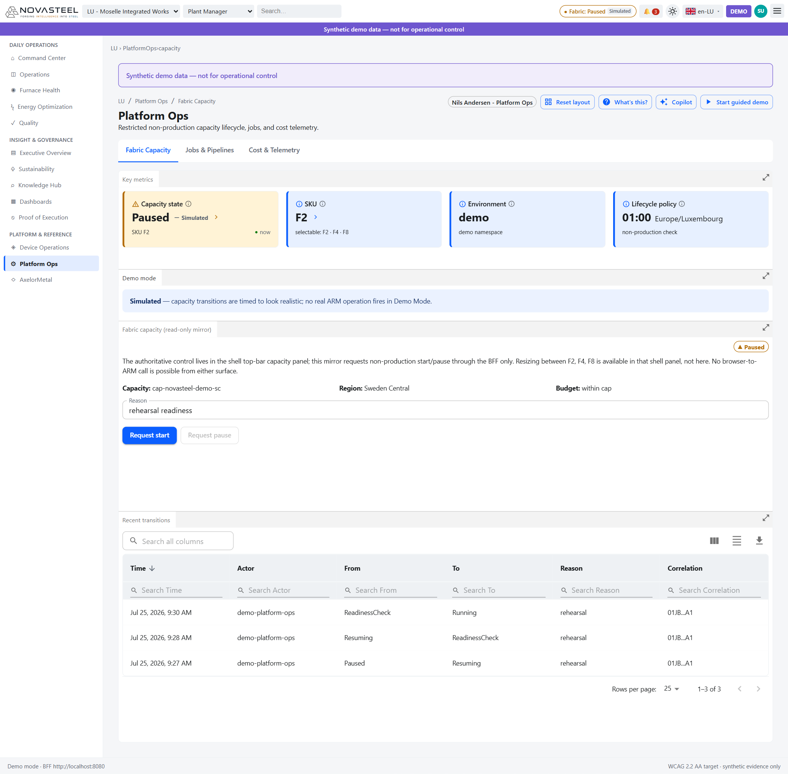
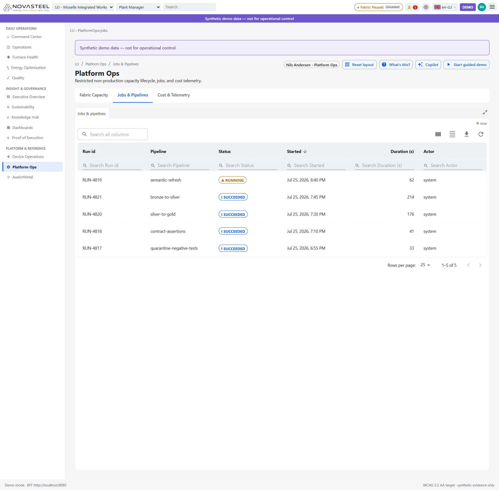
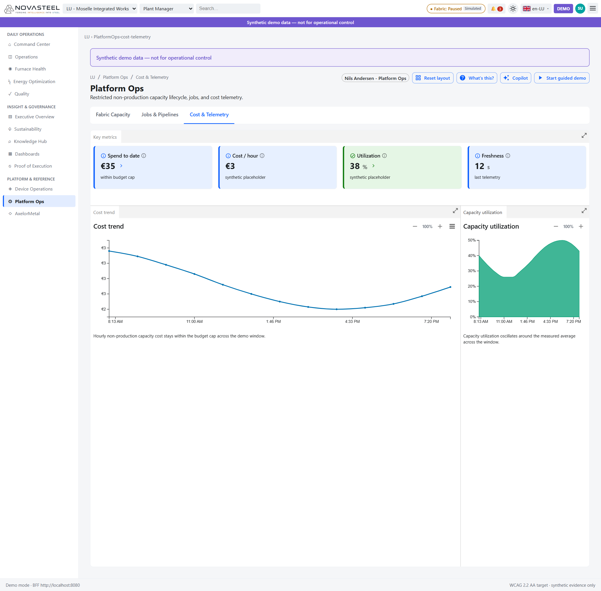

# 13 · Exploitation plateforme

**Audience :** débutant complet en exploitation cloud et sidérurgie  
**Temps de lecture :** 20 minutes  
**Persona :** Nils Andersen — Platform Ops  
**Parcours couverts :** `/{site}/platform-ops/capacity`, `/{site}/platform-ops/jobs`, `/{site}/platform-ops/cost-telemetry`, dialogue shell de capacité  
**Dernière mise à jour :** 2026-07-27  
**Langue :** 🇬🇧 [English version](../en/13-platform-ops.md)

---

## Capacité Fabric (Fabric Capacity) — `/{site}/platform-ops/capacity`

**En une phrase.** Une vue d'exploitation pour l'état de capacité Microsoft Fabric, les demandes start/pause non-production et l'audit du cycle de vie (`apps\analytics-mfe\src\components\screens\PlatformCapacity.tsx`; `docs\personas\personas-and-journeys.md`).

**Contexte pour débutants.** Microsoft Fabric est la plateforme analytique Microsoft : lakehouse, pipelines, temps réel, notebooks, modèles sémantiques et Power BI (`docs\README.md`; `docs\architecture\solution-architecture.md`). Une **capacité Fabric** est la réserve de calcul. Un **F-SKU** est sa taille ; NovaSteel autorise F2, F4 et F8 en démo. Les unités de capacité évoluent linéairement : F4 ≈ 2× F2 par heure, F8 ≈ 4× (`apps\portal-shell\README.md`; `PlatformCapacity.tsx`). Pauser la nuit économise une capacité non-production inactive ; le contrôle est à 01:00 Europe/Luxembourg pour dev/test/demo, jamais production (`docs\operations\operations-and-cost.md`; `infra\bicep\modules\logicapp-capacity-lifecycle.bicep`).

**Ce que vous voyez à l'écran.**
1. Les cartes KPI montrent Capacity state, SKU, Environment et Lifecycle policy. La capture indique Paused/Simulated, F2, demo, 01:00 Europe/Luxembourg (`PlatformCapacity.tsx`).
2. La note bleue Demo mode dit que les transitions sont simulées et qu'aucune opération Azure Resource Manager (ARM) ne part (`PlatformCapacity.tsx`).
3. Le panneau **Fabric capacity (read-only mirror)** précise que le contrôle autoritaire est dans le shell et que le microfrontend n'appelle jamais ARM (`PlatformCapacity.tsx`; `apps\portal-shell\README.md`).
4. ID capacité, région Sweden Central, budget et raison sont visibles (`PlatformCapacity.tsx`).
5. **Request start** et **Request pause** dépendent du rôle `Platform.Capacity.Manage` et de l'état ; les états intermédiaires verrouillent les mutations (`PlatformCapacity.tsx`; `CapacityState.cs`).
6. La table Recent transitions liste Time, Actor, From, To, Reason et Correlation (`PlatformCapacity.tsx`; `apps\analytics-mfe\src\api\fixtures.ts`).

**Pourquoi ce composant a été implémenté.** Les écrans métier dépendent de l'analytique, mais la baseline locale est synthétique et attentive aux coûts (`docs\README.md`). Platform Ops rend disponibilité, coût et audit explicites (`docs\operations\operations-and-cost.md`; `docs\ux\dashboard-specification.md`).

**Objectif & preuves (proof of execution).**

| Élément du cas d'usage | ID exigence | Preuve dans l'application | Origine du nombre (route API + fichier source) |
|---|---|---|---|
| Disponibilité analytique | Surface support | État, SKU, politique, transitions | `PlatformCapacity.tsx` → `DataClient.getCapacity()` → `GET /v1/platform/capacity` (`routes.py`) → adaptateur `capacity.py`. |
| Cycle de vie maîtrisé | Surface support | Politique 01:00 Europe/Luxembourg | `docs\operations\operations-and-cost.md`; `infra\bicep\modules\logicapp-capacity-lifecycle.bicep`. |
| Mutation contrôlée par rôle | Surface support | Boutons selon rôle/état | `PlatformCapacity.tsx`; `CapacityState.cs`; `_capacity_mutation()` dans `routes.py`. |
| Pas d'ARM navigateur | Frontière `REG-02` | Texte du miroir | `PlatformCapacity.tsx`; `apps\portal-shell\README.md`; `CapacityService.cs`. |

**Comment les données arrivent à l'écran.** `PlatformCapacity.tsx` → `client.getCapacity()` → `GET /v1/platform/capacity` → `services.capacity.status()` → adaptateur local ou ARM (`dataClient.ts`; `routes.py`; `capacity.py`). Les demandes start/pause émettent `capacity.request` vers le shell (`PlatformCapacity.tsx`; `CapacityService.cs`).

**Honnêteté & limites.** Demo Mode est simulé. La baseline locale ne prouve pas une capacité Fabric tenant réelle ni un workspace Power BI (`docs\README.md`). La production n'est jamais pausée automatiquement (`docs\operations\operations-and-cost.md`).

**Essayez vous-même.** Ouvrez `http://localhost:5266/{site}/platform-ops/capacity`.

---

## Jobs & pipelines — `/{site}/platform-ops/jobs`

**En une phrase.** Une table qui indique si les jobs et pipelines de données sont en cours, réussis ou échoués (`apps\analytics-mfe\src\components\screens\PlatformJobs.tsx`).

**Contexte pour débutants.** Un **job** est une exécution. Un **pipeline** est un processus répétable. NovaSteel utilise un modèle médaillon : bronze = données proches du brut, silver = nettoyées, gold = prêtes métier (`docs\README.md`; `docs\operations\operations-and-cost.md`).

**Ce que vous voyez à l'écran.**
1. L'onglet Jobs & Pipelines est sélectionné (`PlatformJobs.tsx`).
2. Les colonnes sont Run id, Pipeline, Status, Started, Duration (s), Actor (`PlatformJobs.tsx`; `docs\ux\dashboard-specification.md`).
3. La capture montre `semantic-refresh` RUNNING et `bronze-to-silver`, `silver-to-gold`, `contract-assertions`, `quarantine-negative-tests` SUCCEEDED (`fixtures.ts`).
4. Le composant relit la fixture toutes les 12 secondes (`PlatformJobs.tsx`).

**Pourquoi ce composant a été implémenté.** Les décisions énergie, CO₂, four, qualité et connaissance ne sont crédibles que si les pipelines sont sains. Le document opérations exige durée, fraîcheur, rapprochement et quarantaine (`docs\operations\operations-and-cost.md`).

**Objectif & preuves (proof of execution).**

| Élément du cas d'usage | ID exigence | Preuve dans l'application | Origine du nombre (route API + fichier source) |
|---|---|---|---|
| Fraîcheur des données | Transversal | Table des runs | Aucun BFF live ; `PlatformJobs.tsx` charge `jobs()` depuis `fixtures.ts`. |
| Chemin bronze→silver→gold | Support `OBJ-01`…`OBJ-04` | Lignes bronze/silver/gold | `fixtures.ts`; modèle médaillon dans `docs\README.md`. |
| Contrats et quarantaine | Gouvernance | Lignes contract/quarantine | `fixtures.ts`; `docs\operations\operations-and-cost.md`. |

**Comment les données arrivent à l'écran.** `PlatformJobs.tsx` → `jobFixture()` → `apps\analytics-mfe\src\api\fixtures.ts` → aucun BFF. Les lignes sont marquées source `fixture` et pollées (`PlatformJobs.tsx`).

**Honnêteté & limites.** C'est une télémétrie synthétique, pas l'historique live de Fabric (`PlatformJobs.tsx`; `docs\README.md`).

**Essayez vous-même.** Ouvrez `http://localhost:5266/{site}/platform-ops/jobs` et cherchez `gold`.

---

## Coût & télémétrie (Cost & Telemetry) — `/{site}/platform-ops/cost-telemetry`

**En une phrase.** Une vue FinOps avec dépense, coût horaire, utilisation et fraîcheur synthétiques (`apps\analytics-mfe\src\components\screens\PlatformCost.tsx`).

**Contexte pour débutants.** La **télémétrie** regroupe les mesures système : coût, utilisation, fraîcheur, erreurs, latence. **FinOps** signifie gérer le coût cloud avec discipline d'ingénierie et de finance (`docs\operations\operations-and-cost.md`; `apps\portal-shell\README.md`).

**Ce que vous voyez à l'écran.**
1. Les cartes affichent Spend to date €35, Cost/hour €3, Utilization 38 %, Freshness 12 s ; le composant précise que c'est synthétique (`PlatformCost.tsx`).
2. **Cost trend** est une courbe sur la fenêtre démo (`PlatformCost.tsx`; `fixtures.ts`).
3. **Capacity utilization** est une aire verte ; une utilisation très basse la nuit justifie la pause (`PlatformCost.tsx`; `docs\operations\operations-and-cost.md`).
4. Les infobulles préviennent que le vrai €/h dépend de la région, devise et offre (`PlatformCost.tsx`; `docs\presentation\faq.md`).

**Pourquoi ce composant a été implémenté.** La plateforme doit prouver sa santé technique et sa discipline de coût. Le plan opérations demande coût capacité, utilisation, alertes budget et revue des coûts (`docs\operations\operations-and-cost.md`).

**Objectif & preuves (proof of execution).**

| Élément du cas d'usage | ID exigence | Preuve dans l'application | Origine du nombre (route API + fichier source) |
|---|---|---|---|
| Exploitation maîtrisée par les coûts | Surface support | Cartes coût/utilisation/fraîcheur | Aucun BFF live ; `PlatformCost.tsx` calcule depuis `costTrend()` dans `fixtures.ts`. |
| Justification pause | Surface support | Graphique d'utilisation | Fixture `fixtures.ts`; runbook `docs\operations\operations-and-cost.md`. |
| Caveat prix | Gouvernance | Infobulle “synthetic placeholder” | `PlatformCost.tsx`; `docs\presentation\faq.md`. |

**Comment les données arrivent à l'écran.** `PlatformCost.tsx` → `costTrend()` → `apps\analytics-mfe\src\api\fixtures.ts` → aucun BFF (`PlatformCost.tsx`).

**Honnêteté & limites.** Ne citez pas €3/h comme prix Fabric. C'est illustratif ; le réel dépend de la région, devise, offre, SKU et consommation mesurée (`PlatformCost.tsx`; `docs\presentation\faq.md`).

**Essayez vous-même.** Ouvrez `http://localhost:5266/{site}/platform-ops/cost-telemetry`.

---

## Dialogue shell de capacité Fabric — `/{site}/platform-ops/capacity` et pastille Fabric

**En une phrase.** La surface de contrôle autoritaire pour start, pause et changement de SKU ; elle appartient au shell Blazor, pas au microfrontend React (`apps\portal-shell\Components\CapacityPanel.razor`; `apps\portal-shell\README.md`).

**Contexte pour débutants.** **ARM** signifie Azure Resource Manager, l'API de contrôle Azure. Le navigateur ne doit pas appeler ARM directement : il faut rôles, listes blanches, audit, idempotence et identité managée. NovaSteel passe par le shell et le Backend-for-Frontend (BFF) FastAPI (`CapacityService.cs`; `routes.py`).

**Ce que vous voyez à l'écran.**
1. Le dialogue latéral s'ouvre depuis la pastille Fabric et grise l'application (`CapacityPanel.razor`).
2. L'état est **Paused** et la note Simulated dit qu'aucune opération ARM ne part (`CapacityPanel.razor`; `CapacityState.cs`).
3. Les faits montrent ID, SKU F2, environnement demo, région Sweden Central et source Live BFF/Simulated (`CapacityPanel.razor`).
4. La politique rappelle 01:00 Europe/Luxembourg, non-production seulement (`CapacityPanel.razor`; `logicapp-capacity-lifecycle.bicep`).
5. Le champ Reason rend chaque demande auditable (`CapacityPanel.razor`; `routes.py`).
6. Le sélecteur SKU propose seulement F2, F4, F8 ; Apply SKU est désactivé sans rôle, pendant une transition ou sans changement (`CapacityPanel.razor`; `CapacityState.cs`).
7. Start/pause sont sensibles à l'état et au rôle ; l'historique des transitions est en dessous (`CapacityPanel.razor`; `CapacityService.cs`).

**Liste blanche SKU en quatre endroits.**

| Endroit | Contrôle | Source |
|---|---|---|
| Azure Policy | `restrict-fabric-capacity-sku` autorise F2/F4/F8 | `infra\policy\definitions\restrict-fabric-capacity-sku.json` |
| Bicep | `fabricSkuName` a `@allowed(['F2','F4','F8'])` | `infra\bicep\main.bicep` |
| BFF | `SCALABLE_SKUS = ('F2','F4','F8')` et validation | `services\bff-api\src\bff_api\capacity.py`; `routes.py` |
| Shell | `DefaultSkuOptions = ['F2','F4','F8']` | `apps\portal-shell\Services\CapacityState.cs` |

`tests\infra\test_capacity_sku_allow_list.py` verrouille les quatre couches.

**Clé d'idempotence.** Chaque mutation porte `Idempotency-Key` ; une répétition identique est sûre, une répétition avec autre corps produit un conflit (`CapacityService.cs`; `idempotency.py`; `docs\implementation\api-contracts.md`).

**Pourquoi le microfrontend ne possède jamais le contrôle.** Le shell Blazor possède identité, barre supérieure, routage et panneau capacité. Le microfrontend React peut afficher l'état ou demander l'ouverture du panneau, mais il ne détient aucun secret et n'appelle pas ARM (`apps\portal-shell\README.md`; `docs\ux\dashboard-specification.md`).

**Pourquoi ce composant a été implémenté.** Le cas d'usage dépend de Fabric, mais la baseline est synthétique et attentive au coût. Le dialogue rend la dépense visible, réversible et auditée, tout en protégeant la production (`docs\README.md`; `docs\operations\operations-and-cost.md`).

**Objectif & preuves (proof of execution).**

| Élément du cas d'usage | ID exigence | Preuve dans l'application | Origine du nombre (route API + fichier source) |
|---|---|---|---|
| Cycle de vie capacité | Surface support | État, SKU, politique, raison, start/pause | `CapacityPanel.razor` → `CapacityState` → `CapacityService` → `/v1/platform/capacity/*` (`routes.py`). |
| Rôle | Surface support | Lecture seule sans `Platform.Capacity.Manage` | `CapacityPanel.razor`; `CapacityState.cs`; `_capacity_mutation()` (`routes.py`). |
| Gouvernance SKU | Surface support | Dropdown F2/F4/F8 | Policy, Bicep, BFF et shell testés par `test_capacity_sku_allow_list.py`. |
| Pas d'ARM navigateur | Frontière `REG-02` | Design BFF only | `CapacityService.cs`; `capacity.py`. |
| Repli déterministe | Fiabilité démo | Simulation locale si BFF absent | `CapacityState.cs`; `LocalCapacityAdapter` dans `capacity.py`. |

**Comment les données arrivent à l'écran.** Pastille Fabric → `CapacityPanel.razor` → `CapacityState.RefreshAsync()` → `CapacityService.GetStatusAsync()` → `GET /v1/platform/capacity` → adaptateur BFF. Start, pause et SKU utilisent `POST /v1/platform/capacity/start-requests`, `pause-requests`, `sku-requests` avec idempotence (`CapacityPanel.razor`; `CapacityState.cs`; `CapacityService.cs`; `routes.py`).

**Honnêteté & limites.** En local/démo, aucun appel ARM ne part. Le support d'alias Azure Policy pour le SKU Fabric doit être vérifié dans le tenant cible avant Deny (`infra\bicep\modules\policy-assignments.bicep`). Le cycle de vie tenant réel n'est pas prouvé localement (`docs\README.md`).

**Essayez vous-même.** Ouvrez une page, cliquez la pastille **Fabric**, inspectez les SKU, saisissez une raison et essayez une action permise.

---

[◀ Précédent : 12 · Proof of Execution](12-proof-of-execution.md) · [▲ Index](LISEZMOI.md) · [Suivant ▶ 14 · Cross-cutting Features](14-cross-cutting-features.md)
