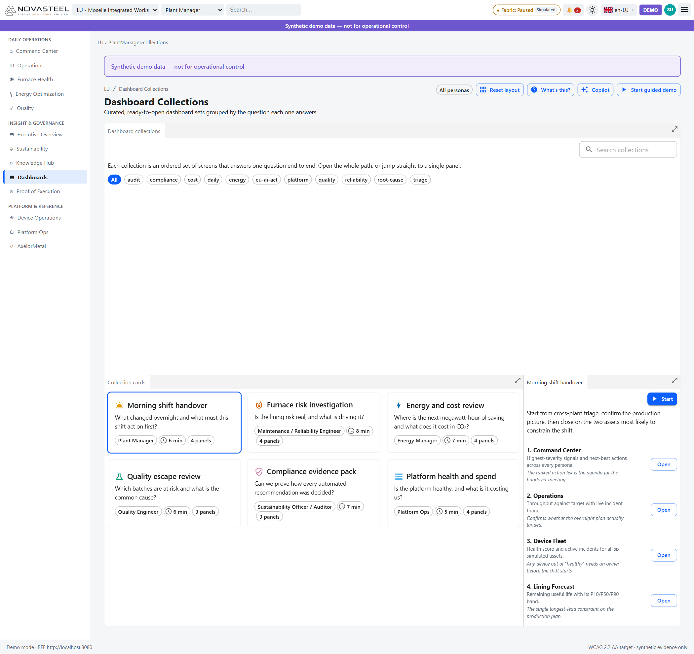
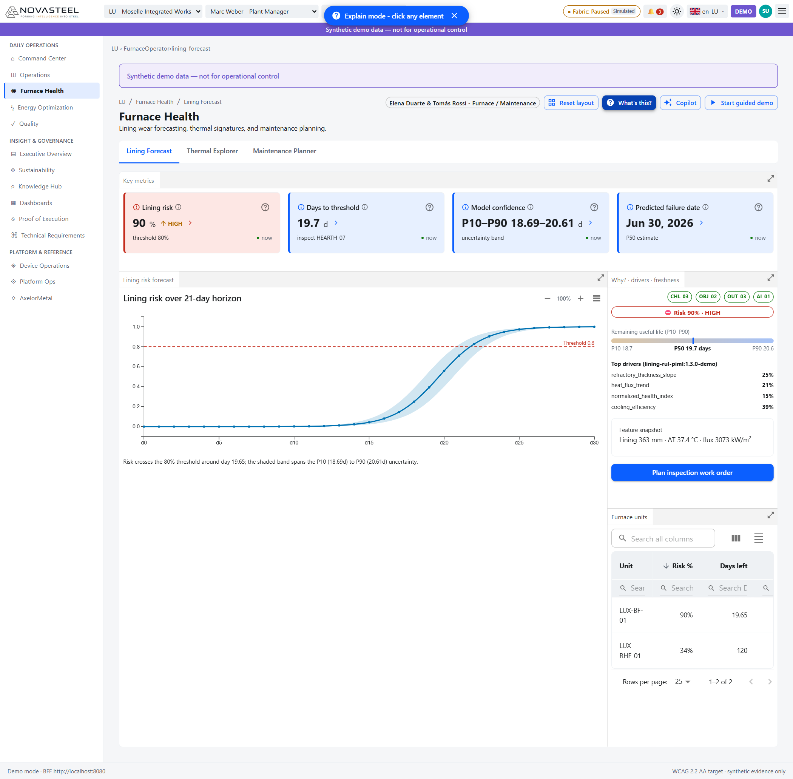
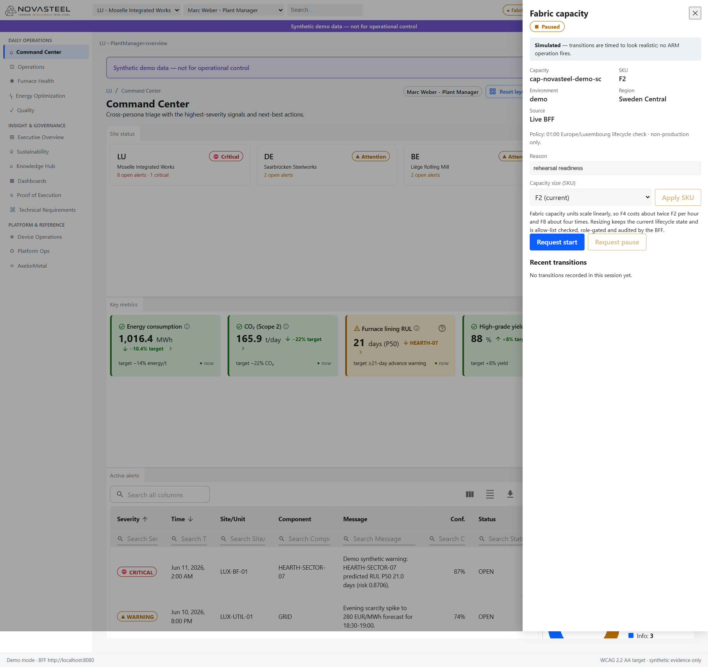
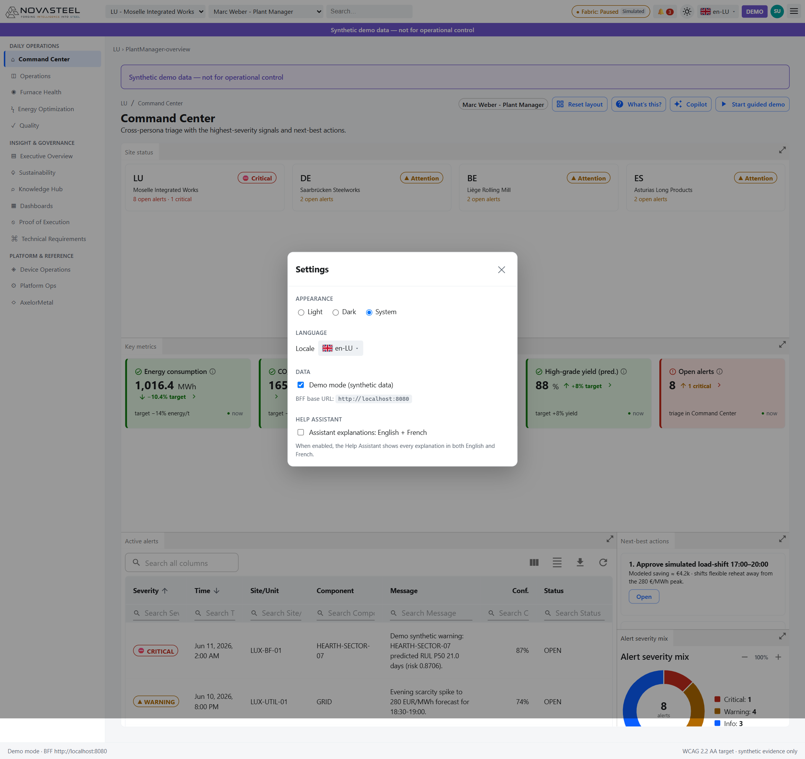
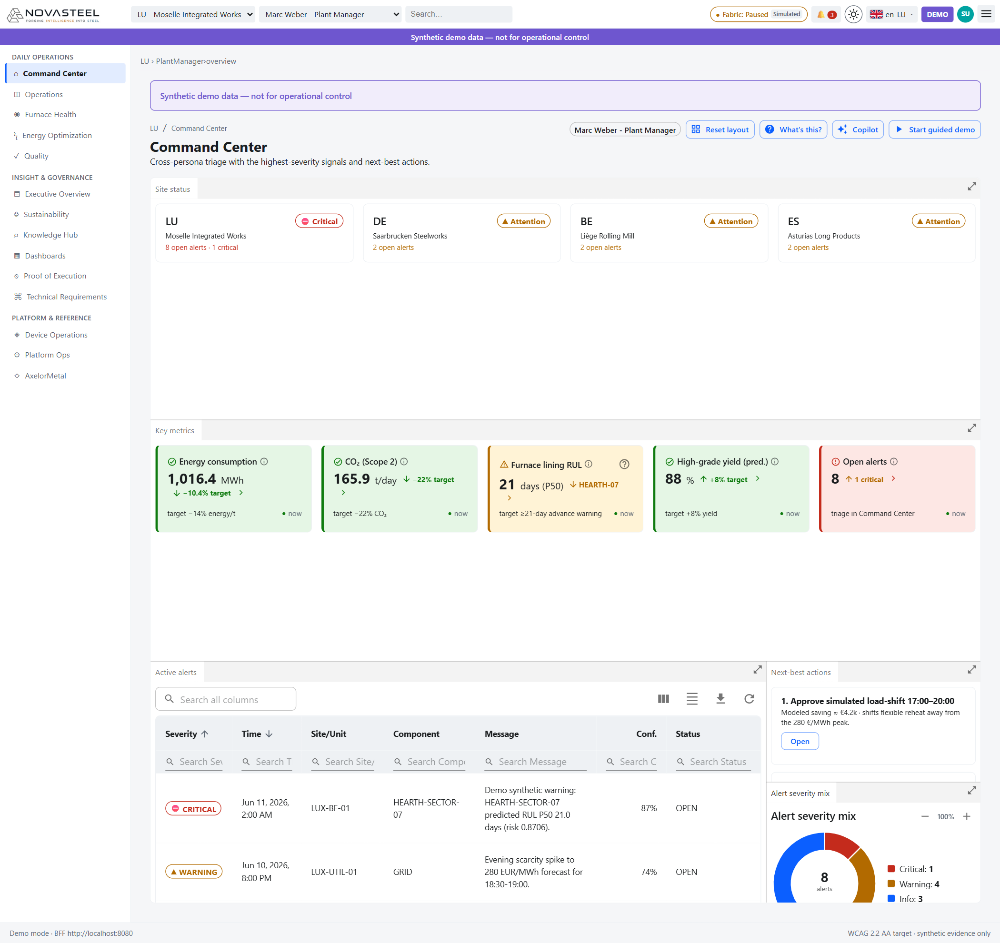
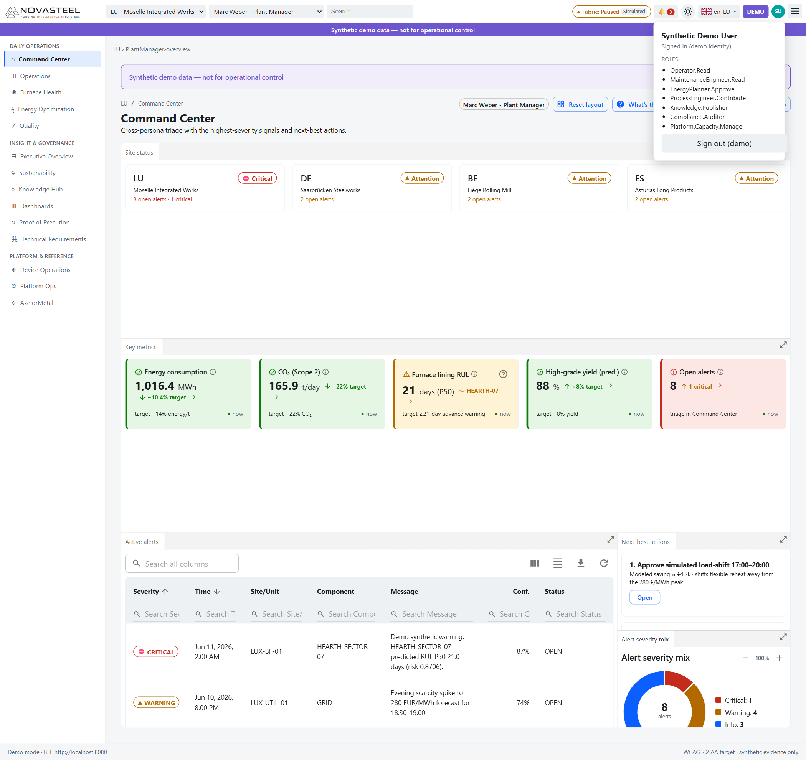

# 14 · Fonctionnalités transverses

**Public visé :** débutants qui connaissent les écrans et veulent comprendre ce qui apparaît partout.  
**Temps de lecture :** ~16 minutes.  
**Related routes:** toutes les routes du portail NovaSteel; surtout `/lu/command-center/overview`, `/lu/platform-ops/capacity`, `/lu/dashboards/collections`.  
**Dernière mise à jour :** 2026-07-27  
**Langue :** 🇬🇧 [English version](../en/14-cross-cutting-features.md)

---

Transverse signifie « non limité à un seul écran métier ». Ces fonctions rendent chaque écran utilisable, honnête, explicable et répétable. Elles ne changent pas la frontière de sécurité : données synthétiques, recommandations consultatives, prédictions différentes des mesures (`docs\architecture\solution-architecture.md:22-29`; `apps\analytics-mfe\src\components\AnalyticsDashboard.tsx:102-119`).

## 1. Espace de travail Dockview

**Ce que c'est.** Un espace à panneaux déplaçables et redimensionnables. Les panneaux Dockview peuvent être arrangés, groupés, maximisés et réinitialisés (`docs\ux\dashboard-specification.md:34-35`).

**Ce que vous voyez.** Des onglets comme `Key metrics`, `Site status`, `Collection cards`, des flèches de maximisation et le bouton `Reset layout` (`apps\analytics-mfe\src\components\AnalyticsDashboard.tsx:147-160`).

**Pourquoi.** Les opérateurs comparent KPI, graphique, table et panneau d'explication. Dockview adapte la même vue à un mur de contrôle, un laptop ou une tablette (`docs\ux\dashboard-specification.md:30-36`).

**Preuve.** Le collecteur dérive les panneaux du JSX et garde les panneaux structurels non fermables sauf callback explicite (`apps\analytics-mfe\src\components\dock\dockPanels.ts:111-139`, `apps\analytics-mfe\src\components\dock\dockPanels.ts:198-212`). La disposition est stockée par écran, restaurée et réinitialisée (`apps\analytics-mfe\src\components\dock\WorkspaceDock.tsx:101-128`, `apps\analytics-mfe\src\components\dock\WorkspaceDock.tsx:266-277`, `apps\analytics-mfe\src\components\dock\WorkspaceDock.tsx:336-360`). Les flèches de maximisation sont des actions d'en-tête (`apps\analytics-mfe\src\components\dock\WorkspaceDock.tsx:64-96`).

## 2. Chat Copilot docké

**Ce que c'est.** Un chat docké qui répond sur l'écran courant, les termes acier et les données synthétiques.

**Ce que vous voyez.** `Copilot` ouvre un panneau à droite avec choix de langue, protection des données, mode contexte, questions suggérées, champ de question, recherche en ligne, niveau de raisonnement, glossaire et conversations.

**Pourquoi.** Les débutants ont besoin d'explications simples sans quitter l'écran.

**Exigence servie.** Préservation du savoir et GenAI : `AI-03`, `CHL-05`; transparence IA : `REG-02` (`docs\presentation\proof_of_execution.md:259-276`, `docs\presentation\proof_of_execution.md:362-406`).

**Preuve.** `CopilotDock` héberge dashboard et chat, garde le dashboard non fermable, docke Copilot à droite, désactive les fenêtres flottantes et persiste la disposition (`apps\analytics-mfe\src\components\copilot\CopilotDock.tsx:59-80`, `apps\analytics-mfe\src\components\copilot\CopilotDock.tsx:115-123`, `apps\analytics-mfe\src\components\copilot\CopilotDock.tsx:177-216`). `CopilotPanel` envoie contexte section/subView/site seulement si le mode contexte est activé et affiche sources, conversations, langue, mode temporaire, recherche et raisonnement (`apps\analytics-mfe\src\components\copilot\CopilotPanel.tsx:284-313`, `apps\analytics-mfe\src\components\copilot\CopilotPanel.tsx:400-548`). Il limite le rendu markdown pour éviter l'injection HTML (`apps\analytics-mfe\src\components\copilot\CopilotPanel.tsx:120-157`).

## 3. Aide “What's this?” et aide bilingue

**Ce que c'est.** Un mode d'explication : `Explain mode - click any element`. Le prochain clic explique le widget au lieu de l'activer.

**Ce que vous voyez.** Bandeau bleu, contour de l'élément, popup explicative. Avec l'option bilingue, l'explication peut afficher anglais et français.

**Pourquoi.** Le public ne connaît pas forcément l'acier. L'aide doit être attachée au KPI, bouton, table ou graphique exact.

**Exigence servie.** Transparence EU AI Act et support du savoir opérateur : `REG-02`, `AI-03`, `CHL-05` (`docs\presentation\proof_of_execution.md:105-152`, `docs\presentation\proof_of_execution.md:406-439`).

**Preuve.** Le dashboard affiche `What's this?` et transmet scope, locale et `helpBilingual` (`apps\analytics-mfe\src\components\AnalyticsDashboard.tsx:161-172`, `apps\analytics-mfe\src\components\AnalyticsDashboard.tsx:240-247`). L'assistant intercepte les clics, empêche l'action normale, résout la cible, dessine le cadre et sort avec Escape (`apps\analytics-mfe\src\components\help\HelpAssistant.tsx:61-132`, `apps\analytics-mfe\src\components\help\HelpAssistant.tsx:212-320`). Settings expose la case bilingue (`apps\portal-shell\Components\SettingsDialog.razor:63-72`).

## 4. Visite guidée

**Ce que c'est.** Une visite pour présenter la démo de manière fiable.

**Ce que vous voyez.** `Start guided demo` est toujours disponible dans le dock, avec numéro d'étape, titre, récit, headline, Next/Back et auto-advance.

**Pourquoi.** La soutenance doit raconter la même histoire sans dépendre de données réelles.

**Exigence servie.** Les étapes relient les quatre résultats et les points IA; la première répète −14 % énergie, −22 % CO₂, +8 % rendement et alerte 21 jours (`apps\analytics-mfe\src\components\DemoTour.tsx:27-70`).

**Preuve.** Le tableau de bord affiche le bouton sans condition (`apps\analytics-mfe\src\components\AnalyticsDashboard.tsx:189-196`) et monte `DemoTour` sur chaque écran (`apps\analytics-mfe\src\components\AnalyticsDashboard.tsx:241`). `DemoTour` navigue par `nav.intent` et utilise des étapes déterministes (`apps\analytics-mfe\src\components\DemoTour.tsx:82-108`, `apps\analytics-mfe\src\components\DemoTour.tsx:116-168`).

## 5. Panneau Fabric capacity

**Ce que c'est.** Contrôle shell pour le cycle de vie et le SKU d'une capacité Microsoft Fabric non-production.

**Ce que vous voyez.** Panneau `Fabric capacity` avec état, capacité, SKU, environnement, région, source, motif, choix SKU, `Apply SKU`, `Request start`, `Request pause` et transitions.

**Pourquoi.** Fabric coûte lorsqu'il tourne. Le contrôle est visible, gouverné par rôle, audité et séparé des dashboards.

**Exigence servie.** Maîtrise coût/gouvernance de plateforme (`docs\ux\dashboard-specification.md:34-35`).

**Preuve.** La pastille ouvre le panneau (`apps\portal-shell\Layout\MainLayout.razor:44-53`). Le panneau précise que la simulation ne lance pas ARM et désactive les contrôles selon rôle/état (`apps\portal-shell\Components\CapacityPanel.razor:19-22`, `apps\portal-shell\Components\CapacityPanel.razor:62-82`, `apps\portal-shell\Components\CapacityPanel.razor:135-155`). Le README du shell indique que les requêtes React passent par le shell et le BFF, jamais directement vers ARM (`apps\portal-shell\README.md:8-18`).

## 6. Settings

**Ce que c'est.** Modale pour apparence, langue, mode de données, URL BFF et aide bilingue.

**Ce que vous voyez.** `Light`, `Dark`, `System`; locale; URL BFF en lecture seule; aide bilingue.

**Pourquoi.** Ces préférences affectent toutes les pages et doivent vivre dans le shell.

**Exigence servie.** Accessibilité et opération multilingue (`docs\ux\dashboard-specification.md:14-16`, `docs\usecase\usecase.md:7-10`).

**Preuve.** `SettingsDialog` définit ces sections (`apps\portal-shell\Components\SettingsDialog.razor:17-72`). Il gère focus, Escape et focus trap (`apps\portal-shell\Components\SettingsDialog.razor:103-160`). L'état correspond à `ThemeMode`, `Locale` et `HelpBilingual` (`apps\portal-shell\Services\ShellState.cs`).

## 7. Thème et mode sombre

**Ce que c'est.** Thème light, dark ou system pour shell et dashboards.

**Ce que vous voyez.** Même structure Command Center, surfaces plus sombres, contraste adapté.

**Pourquoi.** Les salles de contrôle et de présentation ont des éclairages différents; le thème aide aussi l'accessibilité.

**Preuve.** Le shell cycle le mode et change titre/icône (`apps\portal-shell\Services\ShellState.cs:182-190`; `apps\portal-shell\Layout\MainLayout.razor:230-243`). Le contrat transporte `themeMode` (`contracts\ui\shell-interop.v1.schema.json:18-25`). React construit le thème et met à jour les tokens (`apps\analytics-mfe\src\components\AnalyticsDashboard.tsx:42-44`, `apps\analytics-mfe\src\components\AnalyticsDashboard.tsx:89-92`).

## 8. Menu compte

**Ce que c'est.** Identité et rôles de démonstration.

**Ce que vous voyez.** `Synthetic Demo User`, `Signed in (demo identity)`, rôles et `Sign out (demo)`.

**Pourquoi.** Démontrer l'UI gouvernée par rôles sans exposer de vrais identifiants. Le navigateur reçoit une référence de token opaque, pas un bearer token (`contracts\ui\shell-interop.v1.schema.json:41-45`; `README.md:35-39`).

**Preuve.** MainLayout affiche utilisateur, rôles et toggle sign-in (`apps\portal-shell\Layout\MainLayout.razor:71-89`). `AuthDemoContext` définit rôles/actions et périmètre demo (`apps\portal-shell\Services\AuthDemoContext.cs:24-34`, `apps\portal-shell\Services\AuthDemoContext.cs:70-77`).

## 9. Localisation et unités

**Ce que c'est.** Comportement partagé de langue et formatage.

**Ce que vous voyez.** Drapeau/locale dans le shell, `en-LU` dans les captures, puis libellés traduits si l'on change de locale.

**Pourquoi.** Le cas d'usage couvre Luxembourg, Allemagne, Belgique, Espagne (`docs\usecase\usecase.md:7-10`).

**Preuve.** Les locales shell sont `en-LU`, `fr-LU`, `de-DE`, `nl-BE`, `es-ES` (`apps\portal-shell\Services\ShellState.cs:37-38`). Le catalogue React couvre anglais, français, allemand, néerlandais et espagnol avec fallback (`apps\analytics-mfe\src\i18n\messages.ts:15-20`, `apps\analytics-mfe\src\i18n\messages.ts:21-123`). Le contexte React fixe `unitSystem: 'metric'` (`apps\analytics-mfe\src\components\AnalyticsDashboard.tsx:70-83`).

## 10. Composants UI partagés

| Composant | Ce que c'est | Pourquoi | Preuve |
|---|---|---|---|
| KPI card + why-popover | Tuile métrique avec statut, valeur, tendance, cible, fraîcheur et “Why?”. | Les valeurs IA doivent montrer confiance, fraîcheur et facteurs. | `apps\analytics-mfe\src\components\primitives\KpiCard.tsx:79-219`; `apps\analytics-mfe\src\components\primitives\WhyPopover.tsx:15-82`; `docs\ux\dashboard-specification.md:30-33`. |
| Data table | Table triable, recherchable, colonnes masquables, export, densité, refresh. | Voir les lignes de preuve, pas seulement les graphiques. | `apps\analytics-mfe\src\components\primitives\DataTable.tsx:76-183`; `apps\analytics-mfe\src\components\primitives\DataTable.tsx:248-313`; `apps\analytics-mfe\src\components\primitives\DataTable.tsx:340-428`. |
| Freshness badge | Indicateur d'âge/source. | Distinguer BFF live, fixture et stale. | `apps\analytics-mfe\src\components\primitives\FreshnessBadge.tsx:14-38`. |
| Confidence meter | Barre P10/P50/P90. | Montrer l'incertitude des prédictions. | `apps\analytics-mfe\src\components\primitives\ConfidenceMeter.tsx:13-64`; `docs\presentation\proof_of_execution.md:340-352`. |
| Severity pill | Statut avec texte, glyphe et couleur. | Ne pas dépendre uniquement de la couleur. | `apps\analytics-mfe\src\components\primitives\SeverityPill.tsx:10-33`; `docs\ux\dashboard-specification.md:14-16`. |
| Proof badge | Badge d'ID d'exigence cliquable. | Relier chaque panneau au brief. | `apps\analytics-mfe\src\components\primitives\ProofBadge.tsx:13-19`, `apps\analytics-mfe\src\components\primitives\ProofBadge.tsx:28-50`; `docs\presentation\proof_of_execution.md:16-28`. |
| State boundary | Loading, empty, error. | Rendre chaque état compréhensible. | `apps\analytics-mfe\src\components\primitives\StateBoundary.tsx:41-99`. |

---

◀ Previous [13 · Platform Ops](13-platform-ops.md) · ▲ Index ([LISEZMOI.md](LISEZMOI.md)) · Next ▶ [15 · Glossaire](15-glossary.md)

