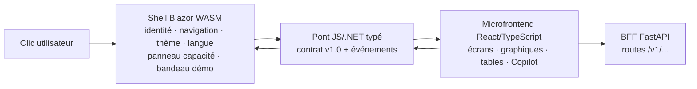
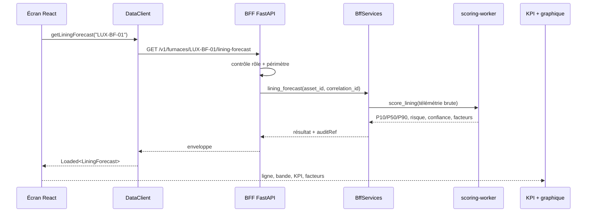
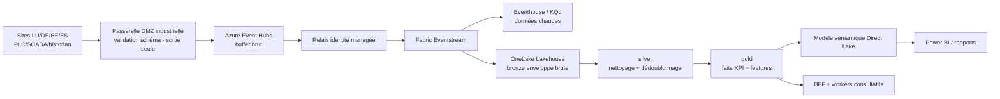

# 17 · Ce qui se passe derrière les écrans

**Public visé :** nouveaux arrivants devant expliquer ce qui se passe après un clic.  
**Temps de lecture :** ~18 minutes.  
**Dernière mise à jour :** 2026-07-27  
**Langue :** 🇬🇧 [English version](../en/17-how-it-works-behind-the-screens.md)

---

## La réponse courte

Quand vous cliquez dans NovaSteel, trois couches coopèrent :

1. le **shell Blazor WebAssembly en C#** possède le cadre permanent, la route, les sélecteurs de site/persona, la langue, le thème, le bandeau de démonstration, le menu compte et le panneau de capacité Fabric (`apps\portal-shell\Layout\MainLayout.razor:7-170`; `apps\portal-shell\Services\ShellState.cs:23-58`) ;
2. le **pont typé (typed bridge)** transmet le contexte du shell à React et renvoie les événements React vers C# (`apps\portal-shell\Components\AnalyticsBridge.razor:20-44`; `apps\portal-shell\wwwroot\js\analyticsBridge.js:21-48`) ;
3. le **microfrontend React/TypeScript** dessine les écrans industriels, graphiques, tables, espaces Dockview, dock Copilot et clients de données (`apps\analytics-mfe\src\bridge.tsx:6-29`; `apps\analytics-mfe\src\components\screens\screenRegistry.ts:32-68`).

La démonstration locale est déterministe et synthétique. NovaSteel est **consultatif uniquement (advisory-only)** : il n'écrit jamais vers un automate PLC, un verrouillage de sécurité, un four, une consigne (setpoint), une recette, une GMAO/CMMS ou un planning de production (`docs\architecture\solution-architecture.md:22-29`; `README.md:35-39`).

---

## 1. Les trois couches du front-end



| Couche | Ce qu'elle possède | Pourquoi ce découpage |
|---|---|---|
| Shell Blazor | Chrome, grammaire `/{site}/{section}/{subView}`, site, persona, langue, thème, pastille de connexion BFF, compte, capacité. | L'architecture garde un shell C# tout en confiant les tableaux de bord denses à React (`docs\architecture\solution-architecture.md:40-50`; `apps\portal-shell\Pages\AnalyticsHost.razor:1-13`). |
| Pont / contrat | `themeMode`, `locale`, `activePersona`, `site`, `tokenRef`, `bffBaseUrl`, `permittedActions`, `navigation`, version `1.0`. | Le shell et le MFE échangent une forme typée et versionnée, au lieu de deviner (`contracts\ui\shell-interop.v1.schema.json:1-83`; `apps\analytics-mfe\src\types.ts:9-35`). |
| MFE React | Registre d'écrans, cartes KPI, panneaux Dockview, graphiques, tables, clients API et client Copilot. | React/MUI/D3 servent la couche analytique ; le shell garde l'identité et le cycle de vie hôte (`apps\analytics-mfe\src\components\screens\screenRegistry.ts:32-68`; `apps\analytics-mfe\src\api\dataClient.ts:103-149`). |

React peut demander au shell d'exécuter des actions qui appartiennent au shell. Il émet `nav.intent` pour naviguer, `capacity.request` pour une action capacité médiée par le BFF, `capacity.panel` pour ouvrir le panneau du shell, `toast` pour un message utilisateur et `telemetry` pour un événement de pont (`apps\portal-shell\Pages\AnalyticsHost.razor:43-84`; `apps\analytics-mfe\src\components\screens\PlatformCapacity.tsx:74-99`). Les mutations de capacité passent par le shell et portent une clé d'idempotence, afin qu'un double-clic ne produise pas deux opérations (`apps\portal-shell\Services\CapacityService.cs:56-110`).

---

## 2. Un chemin concret : Furnace Lining Forecast

Ouvrez :

`http://localhost:5266/lu/furnace-health/lining-forecast`

Le shell accepte `/{Site}/{Section}/{SubView}` et applique ces paramètres dans l'état du shell (`apps\portal-shell\Pages\AnalyticsHost.razor:1-39`). React associe `furnace-health/lining-forecast` au composant `FurnaceLiningForecast` (`apps\analytics-mfe\src\components\screens\screenRegistry.ts:33-38`).



L'écran appelle `client.getLiningForecast(FURNACE_ASSET)`, avec `FURNACE_ASSET = LUX-BF-01` (`apps\analytics-mfe\src\components\screens\FurnaceLiningForecast.tsx:18-55`). `DataClient.getLiningForecast()` appelle `/v1/furnaces/${assetId}/lining-forecast` (`apps\analytics-mfe\src\api\dataClient.ts:169-173`). La route BFF `@app.get("/v1/furnaces/{asset_id}/lining-forecast")` exige `MaintenanceEngineer.Read` ou `Operator.Read`, vérifie l'accès à l'actif, appelle `services.lining_forecast(...)`, puis renvoie une enveloppe (`services\bff-api\src\bff_api\routes.py:210-224`).

Un **BFF (backend-for-frontend)** est une API serveur adaptée au navigateur. Il garde côté serveur l'autorisation, l'audit, les adaptateurs, les fixtures et les appels workers, tout en renvoyant des enveloppes stables à l'interface (`services\bff-api\src\bff_api\main.py:61-94`; `docs\implementation\api-contracts.md:59-65`).

Le graphique est calculé dans l'interface : React construit une projection de risque de 31 jours à partir de la bande P10/P50/P90, puis dessine la médiane, l'incertitude et le seuil 80 % (`apps\analytics-mfe\src\components\screens\FurnaceLiningForecast.tsx:21-38`; `apps\analytics-mfe\src\components\screens\FurnaceLiningForecast.tsx:118-140`).

---

## 3. Mode démo et mode cloud

NovaSteel utilise les mêmes frontières d'API en local et dans la forme cloud cible. Ce qui change est l'adaptateur derrière la frontière.

| Cas | Comportement |
|---|---|
| `DEMO_MODE=local` | Le BFF prend `NS-DEMO-LUX-01` par défaut et n'accepte que les en-têtes `X-Demo-*`, les rôles connus et un périmètre `NS-DEMO-*` (`services\bff-api\src\bff_api\config.py:93-168`; `services\bff-api\src\bff_api\auth.py:148-206`). |
| Fixtures locales | Le dépôt vérifie les checksums et refuse les enregistrements qui ne sont pas `SYNTHETIC`, `DEMO-NONPERSONAL` et dans `NS-DEMO-*` (`services\bff-api\src\bff_api\repository.py:15-82`). |
| Frontière cloud configurée | Les adaptateurs Azure Table pour audit/idempotence sont choisis si l'endpoint est configuré ; sinon les adaptateurs mémoire locaux sont utilisés (`services\bff-api\src\bff_api\adapters\factory.py:20-74`). |

Le **déterminisme** signifie qu'un même scénario et une même graine (seed) produisent la même histoire. Les enregistrements synthétiques portent classification, label de confidentialité, scénario, version générateur et graine (`docs\data\synthetic-data-and-simulators.md:7-17`). Le rapport de validation indique que les générations indépendantes et relances BFF correspondent, avec protection par checksum (`docs\validation-report.md:41-49`).

---

## 4. Architecture cloud cible, version débutant

L'application locale actuelle est le shell Blazor, le bundle React, le BFF FastAPI, les fixtures déterministes et les workers Python (`README.md:97-129`; `docs\README.md:62-75`). La cible cloud ajoute les services de données Microsoft Fabric gouvernés.



| Composant | Sens simple | Usage NovaSteel |
|---|---|---|
| Passerelle DMZ industrielle | Zone tampon contrôlée entre usine et cloud. | Elle envoie des données validées vers l'extérieur ; aucune session cloud ne descend vers les PLC/systèmes de sécurité (`docs\architecture\deployment-topology.md:52-112`). |
| Azure Event Hubs | Salle d'attente durable pour événements. | Buffer et rejeu de la télémétrie avant Fabric (`docs\architecture\solution-architecture.md:57-90`). |
| Eventstream | Porte d'entrée streaming dans Fabric. | Routage vers KQL chaud et Lakehouse d'atterrissage (`docs\architecture\solution-architecture.md:119-133`). |
| Eventhouse / KQL | Magasin rapide pour télémétrie et alarmes récentes. | Investigation chaude et tableaux RTI (`docs\architecture\solution-architecture.md:121-126`). |
| OneLake / medallion | Historique gouverné : bronze brut, silver nettoyé, gold métier. | Source de vérité KPI, features modèles et audit (`docs\architecture\solution-architecture.md:148-157`). |
| Direct Lake + Power BI | Modèle sémantique unique sur gold. | Rapports directionnels avec les mêmes définitions KPI, sans second magasin BI (`docs\architecture\solution-architecture.md:127-132`). |

**Honnêteté de déploiement :** ce guide suit le baseline local déterministe. `docs\README.md` indique qu'aucun déploiement de tenant Azure, Fabric, Foundry, Speech, Eventstream ou Power BI n'a été réalisé pour ce baseline (`docs\README.md:1-9`). Les assets Fabric existent dans le dépôt et se valident localement, mais les workspaces/capacités/items tenant, le RLS et le comportement de requête restent non prouvés dans ce baseline (`docs\README.md:79-87`; `fabric\README.md:7-24`).

---

## 5. Les trois composants IA

| Composant | Entrées | Sorties | Garde-fous |
|---|---|---|---|
| Régression RUL informée par la physique | Télémétrie four : épaisseur réfractaire, flux thermique, eau de refroidissement et variables thermiques. | Durée restante P10/P50/P90, risque, confiance, snapshot de features, facteurs. | Régression transparente par moindres carrés, variables physiques et audit (`services\scoring-worker\src\scoring_worker\rul_model.py:1-9`; `services\scoring-worker\src\scoring_worker\rul_model.py:106-197`; `services\bff-api\src\bff_api\services.py:95-126`). |
| Optimiseur d'énergie MILP | Intervalles énergie, prix, carbone, lots, contraintes. | Planning baseline vs optimisé et économies. | Lots urgents épinglés, fenêtres bornées, concurrence contrôlée, approbation consultative/shadow uniquement (`services\optimizer-worker\src\optimizer_worker\milp.py:1-8`; `services\optimizer-worker\src\optimizer_worker\milp.py:67-145`; `docs\validation-report.md:45`). |
| RAG ancré / Copilot connaissance | Transcriptions sous consentement, procédures approuvées, contexte écran, glossaire, grounding sélectionné. | Réponses citées, brouillons de procédures, suggestions, explications d'écran. | Procédures approuvées seulement, fusion BM25+cosinus, citations, garde de termes, boucle critique et sécurité de contenu (`services\knowledge-orchestrator\src\knowledge_orchestrator\retrieval.py:1-10`; `services\knowledge-orchestrator\src\knowledge_orchestrator\critic.py:1-9`; `services\knowledge-orchestrator\src\knowledge_orchestrator\content_safety.py:1-22`). |

Règle : Python calcule les nombres d'autorité ; les modèles de langage expliquent, recherchent, rédigent ou assistent. Les sorties importantes exigent approbation humaine et lien d'audit (`docs\architecture\solution-architecture.md:15-20`; `docs\presentation\faq.md:111-129`).

---

## 6. Sécurité, identité et gouvernance

| Sujet | Explication | Source |
|---|---|---|
| En-têtes de démo | Le local utilise `X-Demo-User`, `X-Demo-Roles`, `X-Demo-Plants`, nom affiché et langue ; ce n'est pas une identité production. | `apps\analytics-mfe\src\config.ts:91-99`; `services\bff-api\src\bff_api\auth.py:148-206` |
| Identité Entra réelle | Hors démo, jeton bearer validé par une frontière Entra/JWKS fournie par l'organisation ; échec fermé si non configurée. | `services\bff-api\src\bff_api\auth.py:97-145`; `docs\implementation\api-contracts.md:46-55` |
| Rôles | Des rôles applicatifs stables gardent routes et contrôles : `MaintenanceEngineer.Read`, `EnergyPlanner.Approve`, `Knowledge.Publisher`, `Platform.Capacity.Manage`. | `docs\implementation\api-contracts.md:30-44`; `services\bff-api\src\bff_api\routes.py:210-224` |
| Chaîne d'audit | Les sorties importantes sont append-only ; les résultats ultérieurs ajoutent une ligne plutôt que réécrire. | `docs\implementation\api-contracts.md:846-865`; `README.md:176-181` |
| Idempotence | Les mutations capacité portent `Idempotency-Key` pour éviter les doublons. | `apps\portal-shell\Services\CapacityService.cs:56-110`; `services\bff-api\src\bff_api\adapters\factory.py:46-74` |
| RGPD Article 17 | L'effacement couvre connaissance, Copilot, audit et tombstones tout en préservant les invariants. | `docs\README.md:32-50`; `docs\security\security-governance-and-threat-model.md:21-27` |
| EU AI Act | La classification légale reste une porte production ; la conception applique supervision humaine, logs, transparence et sécurité. | `docs\presentation\faq.md:111-129`; `docs\security\security-governance-and-threat-model.md:21-27` |
| WCAG | Le shell inclut lien d'évitement, labels, dialogues accessibles et footer visant WCAG 2.2 AA. | `apps\portal-shell\Layout\MainLayout.razor:7-19`; `apps\portal-shell\Layout\MainLayout.razor:163-166`; `apps\portal-shell\Components\CapacityPanel.razor:5-17` |
| Feeds protégés | Les restaurations Python et NuGet doivent utiliser uniquement les feeds Microsoft protégés ; n'ajoutez pas de sources non approuvées. | `README.md:41-55`; `docs\tech\security_requirement.md:16-27`; `package.json:14-17` |

---

## 7. Portes qualité

Le baseline documentaire annonce **571 tests automatisés** et **19 portes de validation** au vert : 8 contrats, 60 simulateur, 112 backend/intégration, 230 knowledge/Copilot, 47 frontend et 114 infrastructure (`docs\README.md:89-94`). Le rapport de validation consigne 66/66 contrôles de parcours et 12/12 contrôles de fallback offline (`docs\validation-report.md:35-50`).

Commande large depuis la racine :

```powershell
pwsh .\tools\validation\Validate-Repository.ps1 `
    -EvidencePath .\artifacts\validation\final\evidence-manifest.json
```

C'est la commande de rafraîchissement local sans cloud (`docs\validation-report.md:26-33`; `README.md:84-95`). Commandes ciblées documentées :

```powershell
npm run test:frontend
npm run test:bff
pytest tests/e2e
pytest tests/infra/test_capacity_sku_allow_list.py
npm run build
```

Elles couvrent front-end, BFF, parcours persona, allow-list SKU et build (`docs\presentation\assets\app-guide\en\16-traceability-matrix.md:165-176`).

---

## 8. Carte du dépôt

| Dossier | Ce qu'on y trouve |
|---|---|
| `apps` | `portal-shell` Blazor/C# et `analytics-mfe` React/TypeScript (`README.md:266-272`). |
| `services` | BFF FastAPI, optimiseurs, scoring, ingestion, connaissance et Copilot (`README.md:272-273`). |
| `simulator` | Générateur déterministe, validateurs et CLI (`README.md:274-275`). |
| `contracts` | Contrats UI, événements, données et API (`README.md:275-276`). |
| `fabric` | Définitions Fabric, KQL, Lakehouse, notebooks, pipelines, modèle sémantique, validateurs (`fabric\README.md:26-49`). |
| `infra` | Bicep, politiques et scripts OIDC (`README.md:276-277`). |
| `tests` | Tests contrats, simulateur, backend, intégration, E2E, infra, connaissance (`README.md:278-279`). |
| `tools` | Validation, scans sécurité/feeds, SBOM, validation PPTX (`README.md:279-280`). |
| `docs` | Architecture, opérations, runbook, présentation, sécurité, recherche et ce guide (`README.md:280-281`). |
| `artifacts` | Preuves de validation, répétitions, fallbacks et handoff final (`README.md:280-281`). |

---

◀ [16 · Matrice de traçabilité](16-traceability-matrix.md) · ▲ [Sommaire](LISEZMOI.md) · [18 · Parcours guidé de démonstration](18-guided-demo-walkthrough.md) ▶

