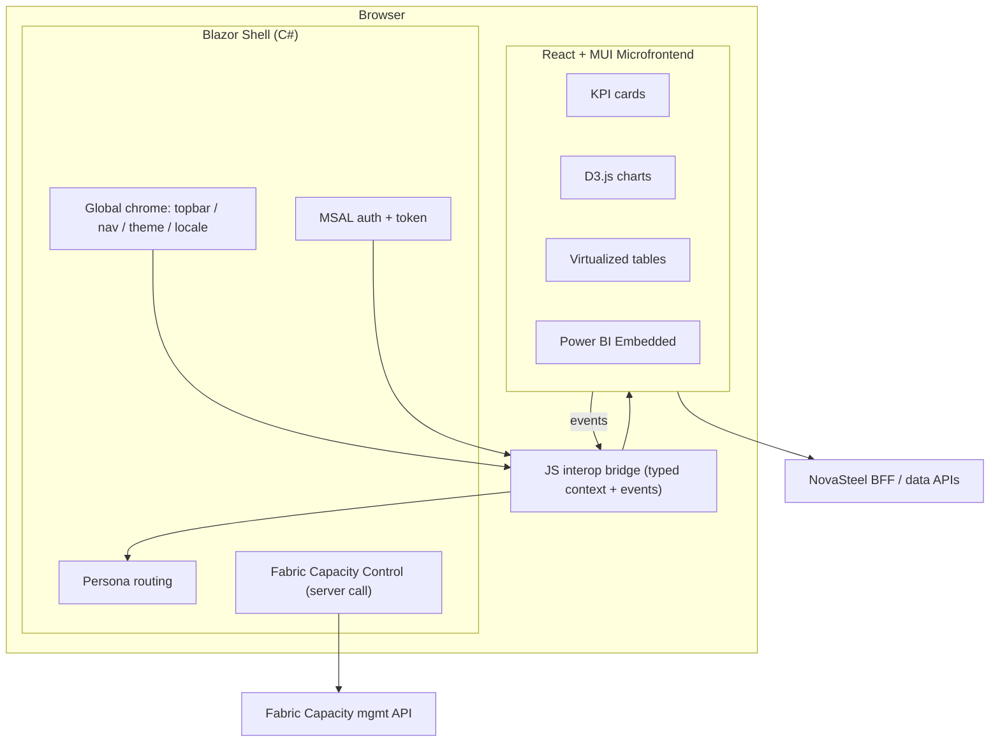
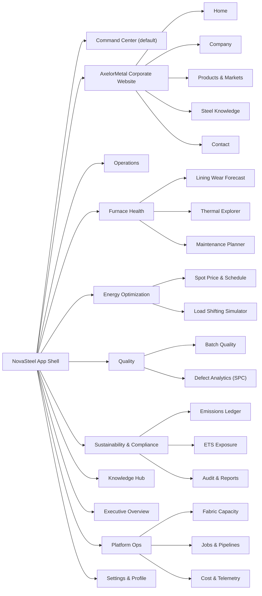
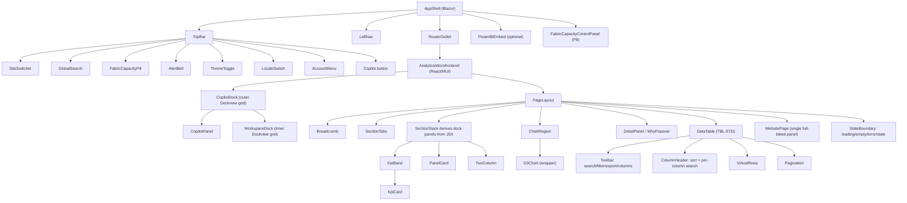

# NovaSteel — Persona Dashboard UX Specification

> **Status:** Implementation-ready · **Owner:** UX (`ux-spec`) · **Product:** NovaSteel AI‑Powered Steel Production Optimization Platform
> **Scope:** GUI/UX only. This document specifies the front-end experience. The [solution architecture](../architecture/solution-architecture.md), [security governance](../security/security-governance-and-threat-model.md), and [personas](../personas/personas-and-journeys.md) govern technical boundaries, controls, and canonical persona names.

---

## 1. Document Control

| Field | Value |
| --- | --- |
| Version | 1.0 |
| Related todos | `business-spec` (personas), `solution-architecture` (system), `security-spec` (RBAC/governance), `fabric-research` (capacity/Power BI), `data-demo-spec` (demo data) |
| Standards targeted | WCAG 2.2 AA · Microsoft Fluent 2 visual language · GDPR / EU AI Act transparency cues |
| Primary UI stack | Blazor WASM C# shell · React/TypeScript MFE · Material UI (MUI) · D3.js · optional internal Power BI |
| Shell decision | See §4 (Blazor WASM host + React/MUI microfrontend — accepted ADR-004) |

### 1.1 How to read this spec

Each persona section (§12) follows the same template: **Purpose → Screen(s) → Wireframe → KPI cards → Charts → Tables → Data bindings → Interaction states → Acceptance criteria**. Cross-cutting standards (tables §13, charts §14, states §15, tokens §7, a11y §17, i18n §18) are defined once and referenced by ID (e.g., `TBL-STD`, `STATE-LOAD`) to keep persona sections implementation-ready without duplication.

---

## 2. Purpose & Goals

AxelorMetal operators, engineers, and leaders need a single, persona-aware GUI to monitor and optimize energy use, CO₂ emissions, furnace-lining health, and steel quality across four countries (LU, DE, BE, ES), while capturing retiring operators' expertise.

**UX goals**

1. **One shell, many lenses** — a shared global frame with persona-specific tabs/sections so each role sees only what it needs first, without losing cross-role navigability.
2. **Decision speed** — a **Command Center** landing view surfaces the highest-severity signals and next-best actions within one glance and one click.
3. **Trust & transparency** — every AI-derived value (prediction, recommendation) is visibly labeled with confidence, freshness, and a "why" affordance (EU AI Act alignment).
4. **Operable everywhere** — responsive from control-room 4K wall displays to a plant-floor tablet, keyboard- and screen-reader-complete (WCAG 2.2 AA).
5. **Cost-aware platform control** — a first-class, role-gated GUI control to start/stop Microsoft Fabric capacity with a visible lifecycle state, so the demo/analytics backend is only paid for when needed.
6. **Flexible workspace** — every screen is a Dockview workspace whose panels can be resized, rearranged, grouped, maximized, and reset without changing the advisory-only safety boundary.

**Non-goals (out of UX scope):** choice of message bus, ML serving topology, data-lake schema, network design. Where the UI depends on these, it is expressed as an **API dependency** (§16) and a **binding contract**, not an implementation.

---

## 3. Canonical persona tabs and privileged operations

The eight business personas are defined in [personas and journeys](../personas/personas-and-journeys.md). `P1`–`P8` below identify UI areas, not replacement role names; Furnace Operator and Maintenance/Reliability Engineer share the Furnace Health area. Platform Ops is a restricted supporting surface, not a ninth business persona.

| UI area | Canonical persona(s) | Role summary | Primary goals | Default landing | Key data domains |
| --- | --- | --- | --- | --- | --- |
| P1 | **Plant Manager** | Runs a site's daily production | Throughput, alerts, energy, quality trade-offs | Command Center | Production, alerts, energy, quality |
| P2 | **Furnace Operator** + **Maintenance/Reliability Engineer** | Operates safely; plans interventions | Explain thermal signals, assess RUL, plan work | Furnace Health | Thermal signatures, predictions, maintenance |
| P3 | **Energy Manager** | Reviews constrained dispatch recommendations | Improve energy/cost/carbon decisions | Energy Optimization | Spot prices, simulated schedules, CO₂ intensity |
| P4 | **Quality Engineer** | Protects high-grade steel quality | Reduce defects and preserve genealogy | Quality | Batch quality, defect Pareto, SPC |
| P5 | **Sustainability Officer** | Owns CO₂/ETS reporting | Track emissions, exposure, evidence | Sustainability | CO₂, ETS allowances, audit projection |
| P6 | **Knowledge Engineer/Admin** | Governs knowledge capture and publication | Review and publish approved procedures | Knowledge Hub | Consent-bound interviews, procedures, coverage |
| P7 | **Executive** | Owns portfolio investment decisions | Portfolio KPIs, targets versus evidence | Executive Overview | Cross-site roll-ups |
| P8 | **Restricted Platform Ops support surface** | Operates non-production analytics capacity | Health, jobs, cost, lifecycle | Platform Ops | Capacity, jobs, cost, telemetry |

Persona visibility is **additive and configurable**: a user may hold multiple persona roles; the global nav shows the union of their permitted sections, and the landing view respects the user's primary persona (with an override in Settings).

---

## 4. Recommended Shell & Front-End Architecture (reconciling "C# for front")

The brief mentions "C# for front." Below is the UX-scoped recommendation. It constrains only the **presentation shell**; it does not decide backend/service architecture.

### 4.1 Accepted decision — Blazor WASM host + embedded React/MUI microfrontend

**Use a Blazor WebAssembly C# shell as the outer application shell, hosting a React + Material UI analytics microfrontend for data-dense dashboard surfaces.**

| Concern | Owned by Blazor shell (C#) | Owned by React/MUI microfrontend |
| --- | --- | --- |
| Authentication / MSAL sign-in, token acquisition | ✅ | consumes token via bridge |
| Global chrome: top bar, left nav, breadcrumbs, theme/locale switch | ✅ | reflects theme/locale via props |
| Routing between persona sections | ✅ (Blazor router) | internal sub-routing within a section |
| Data-dense dashboards: KPI cards, D3 charts, virtualized tables | | ✅ (MUI + D3) |
| Power BI Embedded surfaces | either (see §14.4) | ✅ preferred |
| Fabric capacity control panel | ✅ (requests the FastAPI BFF only) | mirrors state read-only |

**Integration pattern:** the React microfrontend is mounted into a Blazor page via a small JS interop bridge (a `<div id="ns-analytics-root">` container that a React root hydrates). The shell passes a typed context payload down (theme mode, locale, token reference, active persona, demo-mode flag); the microfrontend raises navigation, telemetry, and capacity-request events through the typed bridge (§16.5). Neither client holds a workload credential or authorizes a server operation.

**Why this over alternatives**

| Option | Verdict | Rationale |
| --- | --- | --- |
| **Blazor shell + React/MUI microfrontend** (accepted) | ✅ | Satisfies "C# for front" for shell/identity/routing while giving data-dense surfaces the MUI + D3 ecosystem the brief requires. The bundle is versioned and released with the shell during Phase 0 to prevent bridge skew. |
| Pure Blazor (MudBlazor + Blazor charts) | ⚠️ Acceptable, not preferred | Keeps one language, but the brief explicitly centers Material UI (React) and D3.js; Blazor charting/table virtualization is less mature for this data density. |
| Pure React/MUI SPA (drop C#) | ⚠️ Possible | Best pure DX for the described UI, but ignores the "C# for front" intent for the shell; acceptable only if the team explicitly waives C# for presentation. |
| Server-rendered MVC/Razor + React islands | ❌ | Heavier, weaker SPA-grade interactivity for a live command center. |

**UX-scoped decision:** this is ADR-004: the **Blazor WASM shell + React/MUI microfrontend** contract is the accepted frontend boundary. The remaining UX standards stay host-agnostic where possible.

### 4.2 Component/runtime boundary diagram



---

## 5. Design Principles

1. **Signal over chrome.** Data ink first; chrome recedes. High-contrast status colors reserved for genuine state changes.
2. **Progressive disclosure.** Overview → drill → detail. No screen presents more than ~7 primary objects above the fold.
3. **Consistent semantics.** A red pill means the same thing everywhere; a KPI card layout never varies across personas.
4. **Explainable AI.** Every model output shows source, confidence, and last-updated; a "Why?" popover is always one tab-stop away.
5. **Fail visible, fail safe.** Loading, empty, error, and stale states are designed, not incidental (§15).
6. **Accessible by construction.** Nothing conveyed by color alone; full keyboard path; live regions for alerts (§17).
7. **Fluent-aligned, brand-tuned.** Microsoft Fluent 2 spacing, depth, and motion, themed with NovaSteel industrial palette (§7).

---

## 6. Information Architecture

### 6.1 Global sitemap



### 6.2 Navigation model

- **Left rail (primary):** persona sections, collapsible to icons; grouped by "Operate", "Optimize", "Govern", "Platform".
- **Top bar (global):** brand + site switcher (LU/DE/BE/ES/All) · **global search** · **Fabric capacity status pill** · alerts bell · demo-mode badge · theme toggle · locale switch · account menu.
- **Section tabs (secondary):** within a persona section, MUI Tabs switch sub-views (e.g., Furnace Health → Forecast / Thermal / Maintenance).
- **Breadcrumb:** Site › Section › Sub-view, always reflecting router state.
- **Command Center** is reachable from anywhere via the brand logo and `g c` keyboard shortcut.

### 6.3 URL model (deep-linkable)

```
/{siteCode}/{sectionSlug}/{subViewSlug}?filters=...&range=...&demo=1
e.g. /de/furnace-health/lining-forecast?range=P30D&unit=BF2
```
All filters, time ranges, and selected entities serialize to the query string so any view is shareable and bookmarkable.

---

## 7. Design Tokens

Tokens are the single source of truth; MUI theme and Blazor CSS variables both consume them. Names follow Fluent-style semantic aliasing (`color.role.state`).

### 7.1 Color — semantic roles

| Token | Light | Dark | Usage |
| --- | --- | --- | --- |
| `color.bg.canvas` | `#F5F6F8` | `#141719` | App background |
| `color.bg.surface` | `#FFFFFF` | `#1E2224` | Cards, panels |
| `color.bg.surfaceAlt` | `#EEF1F4` | `#262B2E` | Table header, subtle fills |
| `color.text.primary` | `#1A1D1F` | `#F2F4F5` | Body text (contrast ≥ 7:1) |
| `color.text.secondary` | `#5A6470` | `#AEB6BF` | Labels, captions (≥ 4.5:1) |
| `color.brand.primary` | `#0B5FFF` | `#4C8DFF` | Primary actions, active nav |
| `color.brand.accent` | `#00A3A1` | `#3FD0CE` | NovaSteel teal accent |
| `color.status.critical` | `#C42B1C` | `#FF6B5E` | Critical alerts |
| `color.status.warning` | `#B26A00` | `#FFB84D` | Warnings, thresholds |
| `color.status.success` | `#0F7B0F` | `#5BD75B` | Healthy, on-target |
| `color.status.info` | `#0B5FFF` | `#4C8DFF` | Informational |
| `color.status.stale` | `#8A6D3B` | `#D6B77A` | Stale/degraded data |
| `color.chart.seq[1..8]` | palette A | palette B | Categorical D3 series (color-blind safe: Okabe–Ito) |
| `color.focus.ring` | `#0B5FFF` | `#8FB6FF` | 2px focus outline (a11y) |

> **Status is never color-only.** Each status pairs with an icon and text label (§17).

### 7.2 Typography

| Token | Value | Use |
| --- | --- | --- |
| `font.family.base` | `Segoe UI Variable, Segoe UI, system-ui, "Noto Sans", sans-serif` | Fluent-aligned; Noto fallback for full locale coverage |
| `font.family.mono` | `Cascadia Code, Consolas, monospace` | Metrics, IDs, code |
| `font.size.display` / `h1` / `h2` / `h3` | 32 / 24 / 20 / 16 px | Headings |
| `font.size.body` / `caption` | 14 / 12 px | Body / captions |
| `font.weight.regular/semibold/bold` | 400 / 600 / 700 | — |
| `font.lineHeight.base` | 1.5 | Readability |

### 7.3 Spacing, radius, elevation, motion

| Token | Value |
| --- | --- |
| `space.[xs,s,m,l,xl,2xl]` | 4 / 8 / 16 / 24 / 32 / 48 px (8px grid) |
| `radius.[s,m,l,pill]` | 4 / 8 / 12 / 999 px |
| `elevation.[0..3]` | Fluent depth shadows (0 flat → 3 dialogs/flyouts) |
| `motion.duration.[fast,base,slow]` | 100 / 200 / 400 ms |
| `motion.easing.standard` | `cubic-bezier(0.33, 0, 0.67, 1)` |
| `zindex.[nav, sticky, overlay, modal, toast]` | 100 / 200 / 900 / 1000 / 1100 |

### 7.4 Breakpoints

| Token | Range | Layout |
| --- | --- | --- |
| `bp.xs` | < 600 | Single column, nav in drawer, tables → card list |
| `bp.sm` | 600–904 | 1–2 columns, collapsible rail |
| `bp.md` | 905–1239 | 2–3 columns, icon rail |
| `bp.lg` | 1240–1919 | Full 12-col grid, expanded rail |
| `bp.xl` | ≥ 1920 | Wall-display: 12-col + denser KPI band, larger type scale |

---

## 8. Screen Inventory

| ID | Screen | Persona(s) | Route | Key components |
| --- | --- | --- | --- | --- |
| S-00 | Command Center | P1,P7 (all) | `/{site}/command-center` | Alert stream, KPI band, action queue, mini-maps |
| S-01 | Operations | P1 | `/{site}/operations` | Live throughput, OEE, shift board, alert table |
| S-02 | Furnace — Lining Forecast | P2 | `/{site}/furnace-health/lining-forecast` | Risk timeline, confidence band, unit table |
| S-03 | Furnace — Thermal Explorer | P2 | `.../thermal` | D3 heatmap, time-series, anomaly markers |
| S-04 | Furnace — Maintenance Planner | P2,P6 | `.../maintenance` | Gantt, work-order table |
| S-05 | Energy — Spot & Schedule | P3 | `/{site}/energy/spot-schedule` | Price curve, schedule overlay, savings KPI |
| S-06 | Energy — Load-Shift Simulator | P3 | `.../simulator` | Scenario controls, before/after chart |
| S-07 | Quality — Batch Quality | P4 | `/{site}/quality/batches` | Yield KPI, batch table, drill drawer |
| S-08 | Quality — Defect Analytics (SPC) | P4 | `.../spc` | Control charts, Pareto, defect table |
| S-09 | Sustainability — Emissions Ledger | P5,P7 | `/{site}/sustainability/emissions` | CO₂ trend, intensity, ledger table |
| S-10 | Sustainability — ETS Exposure | P5 | `.../ets` | Allowance gauge, exposure projection |
| S-11 | Sustainability — Audit & Reports | P5 | `.../audit` | Immutable audit table, export |
| S-12 | Knowledge Hub | P6 | `/{site}/knowledge` | Search, procedure cards, interview status |
| S-13 | Executive Overview | P7 | `/{site}/executive` | Portfolio KPI band, site comparison, targets |
| S-14 | Platform Ops — Fabric Capacity | P8 | `/{site}/platform/fabric-capacity` | Capacity lifecycle control (§11) |
| S-15 | Platform Ops — Jobs & Pipelines | P8 | `.../jobs` | Job table, run history |
| S-16 | Platform Ops — Cost & Telemetry | P8 | `.../cost` | Cost trend, capacity-utilization chart |
| S-17 | Settings & Profile | all | `/settings` | Theme, locale, persona default, demo mode, units |
| S-18 | Global Search Results | all | `/search?q=` | Grouped results, filters |
| S-19 | Notifications / Alert Detail | all | overlay/`/alerts/{id}` | Alert detail, ack/assign, timeline |
| S-20 | Device Fleet | all (reader) | `/{site}/device-operations/fleet` | KPI band, device table, device detail panel with sensor list |
| S-21 | Sensor Explorer | all (reader) | `/{site}/device-operations/sensors` | Device/status filters, sensor table, SensorChartPanel |
| S-22 | Device Simulator | `Platform.Capacity.Manage` | `/{site}/device-operations/simulator` | KPI band, SimulatorControls, IncidentPanel |
| S-23 | Dashboard Collections | all (reader) | `/{site}/dashboards/collections` | Collection card grid, role/tag filters, constituent-screen links |
| S-24 | AxelorMetal Corporate Website | all | `/{site}/company-website/{home|company|products|steel-knowledge|contact}` | Full-bleed docked website page, localized article content, glossary table |

Every screen also defines its four cross-cutting states (`STATE-LOAD`, `STATE-EMPTY`, `STATE-ERROR`, `STATE-STALE`) per §15.

---

## 9. Global Components

### 9.1 App shell (annotated ASCII)

```
+--------------------------------------------------------------------------------------+
| [≡] NovaSteel  | Site:[DE ▼] |  🔎 Search everything…        | ⚡Fabric:RUNNING ▲ | 🔔3 | 🌓 | 🌐EN | 👤 |
+------+-------------------------------------------------------------------------------+
| N A  |  Breadcrumb:  DE  ›  Furnace Health  ›  Lining Forecast                        |
| V R  +-------------------------------------------------------------------------------+
| I A  |  [ Forecast ]  [ Thermal ]  [ Maintenance ]        <-- section tabs (MUI)      |
| G I  +-------------------------------------------------------------------------------+
| A L  |                                                                               |
| T    |   ┌── KPI band (cards) ─────────────────────────────────────────────┐         |
| I ▸  |   │ [Lining Risk] [Days to Threshold] [Confidence] [Open WOs]        │         |
| O    |   └──────────────────────────────────────────────────────────────────┘        |
| N    |   ┌── Primary chart (D3) ────────────┐  ┌── Side panel ──────────────┐         |
|      |   │ Risk timeline w/ confidence band │  │ Why? / drivers / freshness │         |
|      |   └──────────────────────────────────┘  └────────────────────────────┘         |
|      |   ┌── Data table (virtualized, filterable, exportable) ───────────────┐        |
|      |   └──────────────────────────────────────────────────────────────────┘        |
+------+-------------------------------------------------------------------------------+
| Footer: env badge · data-as-of timestamp · build · a11y statement · demo-mode note   |
+--------------------------------------------------------------------------------------+
```

### 9.2 Global navigation (left rail)

- Grouped items with icons + labels; collapsed state shows icons with tooltips (accessible names preserved).
- Active item: 3px `color.brand.primary` inset bar + bold label + `aria-current="page"`.
- Keyboard: `Tab` order top→bottom; `Enter`/`Space` activates; roving tabindex within group.
- Persona-gated: items the user lacks permission for are hidden (not disabled) to avoid clutter; a "Request access" affordance lives in Settings.
- The AxelorMetal corporate website is grouped as narrative/public context rather than an operational persona section; all five sub-views remain available in demo mode.

### 9.3 Command Center (S-00)

Purpose: cross-persona triage landing. Layout:

```
+------------------------- COMMAND CENTER (DE / All Sites) -------------------------+
|  KPI BAND:  [Energy €/t ▲] [CO₂ t/day ▼] [Furnace Risk] [High-grade Yield] [ETS €]|
+-------------------------------+--------------------------------------------------+
|  ACTIVE ALERTS (live region)  |   NEXT-BEST ACTIONS (ranked, per persona)        |
|  ● CRIT Furnace BF2 lining    |   1. Approve load-shift 14:00–17:00 (save €4.2k) |
|  ● WARN Spot price spike 18h  |   2. Schedule BF2 inspection (risk 82%)          |
|  ● WARN Batch #A19 out-of-spec|   3. File ETS weekly report (due 2d)             |
+-------------------------------+--------------------------------------------------+
|  SITE MINI-MAP / STATUS TILES:  [LU ●] [DE ●] [BE ●] [ES ●]  (color+icon status)  |
+-----------------------------------------------------------------------------------+
```

- Alert stream is a `role="log"`/`aria-live="polite"` region; critical alerts escalate to `assertive` with a non-color icon + sound-optional.
- Each action card has a primary CTA that deep-links to the owning screen with context pre-filtered.

### 9.4 Alerts & notifications

| Property | Spec |
| --- | --- |
| Severity | `critical` / `warning` / `info`, each icon+color+label |
| Delivery | Bell counter (top bar) · Command Center stream · optional toast for new criticals |
| Detail (S-19) | Title, severity, source system, entity, timestamp, confidence, recommended action, ack/assign, timeline |
| Actions | Acknowledge, Assign, Snooze, Open source, Create work order |
| A11y | Toaster uses `role="status"`; focus not stolen; dismiss reachable by keyboard; auto-dismiss ≥ 6s or persists until acted |
| i18n | Severity + relative time localized; timestamps show locale + site timezone |

### 9.5 Global search

- Scope selector: All / Alerts / Batches / Equipment / Procedures / Reports.
- Type-ahead (debounced 250 ms) with grouped results and keyboard nav (`↑/↓`, `Enter`).
- Results screen (S-18) groups by entity type with per-group filters and a global text filter.
- Empty/no-match uses `STATE-EMPTY` with suggested scopes; errors use `STATE-ERROR`.

### 9.6 Copilot Chat (outer dock)

The analytics header includes a **Copilot** button next to the persona chip. Activating it opens the chat assistant in an outer Dockview grid (`dockview-react@7.0.2`) beside the current workspace. While Copilot is closed, the inner workspace dock remains the only visible dock. While Copilot is open, the outer dock keeps the chat panel mounted across navigation so the transcript is preserved.

```text
+--------------------------- DASHBOARD WORKSPACE ------------------+----------- COPILOT -----------+
| KPI cards, charts, tables and current persona screen              | Shield · language · controls   |
|                                                                   | transcript                     |
|                                                                   | suggestions / composer         |
|                                                                   | glossary / conversations       |
+-------------------------------------------------------------------+-------------------------------+
```

**Dock behaviour**

| Capability | Requirement |
| --- | --- |
| Entry/exit | Header **Copilot** button toggles the outer dock; close button inside the panel returns to the workspace-only view. |
| Default position | Chat docks to the right of the dashboard at first open, with an initial width suitable for a chat transcript. |
| Repositioning | The Copilot tab can be dragged to any edge of the Dockview grid. |
| No floating | Floating groups are disabled. Copilot is always docked, never a free-floating window over the dashboard. |
| Persistence | Dock layout persists in `localStorage` under `novasteel.copilot.dock.v2`; invalid or unavailable storage falls back to the default right-docked layout without breaking the page. |

**Panel controls and content**

| Area | Spec |
| --- | --- |
| Enterprise data protection | A green shield row reads **"Enterprise data protection applies to this chat."** It is visible before any message is sent. |
| Context chip | Shows the current screen as chat context; the request also sends `section`, `subView`, and `site` so ambiguous questions are resolved by screen. On Furnace Health, "What is the risk?" is treated as **Lining risk**. |
| Language selector | `EN/US`, `FR`, `DE`, `NL`, `ES`; changing it re-localizes panel chrome, suggestions, glossary lookups, source labels, errors, and subsequent answer requests. |
| Temporary chat | Toggle marks the current turn as temporary; temporary answers render normally but are not saved to conversation history. |
| New chat | Starts an empty thread without deleting saved conversations. |
| Online-search switch | Allows answers to cite the curated offline public-context corpus with official URLs. It is not a live search engine and must not be described as one in UI help. |
| Reasoning | Toggle group: Auto / Default / High reasoning. Auto is resolved server-side and the answered tier is shown on the assistant bubble. |
| Suggestions | Persona/screen-specific chips render before the first turn; selecting a chip sends that question with the same context as typed input. |
| Transcript | User and assistant bubbles show role labels; assistant bubbles show the resolved reasoning tier and a source list. Online sources link to their official URL; screen and glossary sources are text-only. |
| Composer | Multiline text field; `Enter` sends, `Shift+Enter` inserts a newline. Send is disabled for blank input or while a turn is pending. |
| Dictation | Microphone uses the browser Web Speech API only. Audio never reaches the NovaSteel backend, creating no consent or retention obligation. Unsupported browsers show a disabled microphone with an explanatory tooltip. |
| Glossary box | Instant definition lookup below the composer; it searches terms and wording inside definitions, previews current-screen terms when empty, and updates with the chat language. |
| Conversations | Saved conversations list most-recently updated first; each row restores the thread and has a delete button. Delete removes only that owner-scoped in-process history; a container restart clears it by design. |

Answers use constrained markdown only: paragraphs separated by blank lines, `**bold**`, and `_italic_`. The renderer is deliberately minimal and does not accept model-produced links or HTML; links appear only in the structured source list returned by the BFF.

**Accessibility and states**

- Every interactive control has an accessible name (`aria-label`, visible label, or labelled MUI control); toggle state is conveyed with `aria-pressed`/native switch semantics.
- The transcript is a polite live region so newly appended messages and "thinking" status are announced without stealing focus.
- The panel is keyboard-operable end to end: tab order follows header → transcript → suggestions/composer → glossary/history; `Enter` sends from the composer and `Shift+Enter` inserts a newline.
- Errors render as `STATE-ERROR` inside the transcript using `role="alert"`. The failed question is restored into the composer, the optimistic user bubble is removed, and no fallback answer is invented.
- Source type is never color-only: each item is labelled as screen context, glossary, AxelorMetal knowledge, or online result.

### 9.7 Dockview workspace model (all screens)

Every analytics screen is rendered through a Dockview workspace, not only the Copilot chat. This is a layout layer over the existing screen JSX; it does not change API access, model behavior, or the advisory-only safety boundary.

**Two-level docking**

| Level | Component | Purpose |
| --- | --- | --- |
| Outer dock | `CopilotDock` | Hosts the current workspace and, when open, the Copilot chat. It exists so the chat panel can stay mounted while the operator navigates between screens. |
| Inner dock | `WorkspaceDock` | Hosts the current screen's panels. With Copilot closed — the default presentation path — this is the only visible dock. |

**Panel derivation**

Screens keep declaring ordinary JSX. `SectionStack` calls `collectDockPanels(children)`, which recognizes `KpiBand`, `PanelCard`, `TwoColumn`, and chart containers by a static `dockRole` marker (`kpi`, `panel`, `split`) rather than by import identity. This avoids an import cycle and prevents the dock tab metadata from drifting away from the screen layout. Opaque children whose `children` is a render function, such as state boundaries, can name their panel with `dockTitle` / `dockId` / `dockHeight` props or `data-dock-*` attributes; otherwise they fall back to positional labels.

**Tabs, close behavior, and state**

| Rule | UX requirement |
| --- | --- |
| Structural panels | KPI bands, primary tables, and full-page website panels are not closable. Their tabs show no X because closing them would leave the screen empty with no obvious recovery path. |
| Closable panels | A tab shows an X only when the owning screen supplied `onDockClose`. The close action calls that screen callback, so React state remains the single source of truth and the panel disappears through normal reconciliation. |
| Current closable panels | Device Fleet detail panel and Sensor Explorer chart panel. |
| Background tabs | Panels use Dockview `renderer: 'always'` so in-flight fetches, chart state, and `document.getElementById` drill-downs survive while a tab is not visible. |
| Reconciliation | A saved layout is restored once on mount. Afterwards panels are added or removed imperatively so the operator's arrangement survives row selections and late-loading KPI bands. A late panel is anchored above its declared successor to preserve declaration order. |

**Persistence and reset**

| Surface | Storage key |
| --- | --- |
| Inner workspace dock | `novasteel.dock.v1.<section>/<subView>` |
| Outer Copilot dock | `novasteel.copilot.dock.v2` |

The dashboard header exposes **Reset layout** only when a dock is mounted. Activating it clears the persisted layout and rebuilds the default arrangement. The implementation also exposes `window.NOVASTEEL_ANALYTICS_CONFIG.disableDock = true` as a host escape hatch that falls back to the previous vertical stack when a container cannot provide a bounded height.

**Presentation and accessibility implications**

- Each dock group has a tab-bar maximize/restore button (`OpenInFull` / `CloseFullscreen`) with an accessible label. This is the fastest presenter path to take one chart or table full screen and return to the workspace.
- Dragging and resizing are convenience interactions, not the only way to recover: all content remains reachable through dock tabs, structural panels cannot be accidentally removed, and **Reset layout** restores a known-good order.
- Panel content keeps the normal table/chart accessibility rules in §13–§17. Inside a dock, `DockedContext` removes duplicate card chrome because the tab already provides the frame and title.
- KPI drill-downs call `revealPanel(id)`: inside a dock this activates the target tab; outside a dock it falls back to scrolling and focusing the target section.

### 9.8 Theme, locale, demo-mode, capacity — top-bar controls

Covered in §11 (capacity), §18 (locale), §19 (theme), §20 (demo mode).

### 9.9 Help Assistant — explain mode

A **"What's this?"** toggle button in the dashboard header (with `data-help-surface` so the help system does not capture its own click) enters *explain mode*. While active, the cursor becomes a help cursor across the entire viewport, a centred banner confirms the mode, and clicking any visual element selects it with a primary-coloured frame and opens a floating popup beside the cursor explaining that element in plain language. Selecting another element replaces the previous popup. The user exits with the banner close button, the popup Escape key, or by pressing Escape anywhere. The audience is explicitly someone who has never seen a steel plant and has never used the portal — the goal is to teach both the application and the steelmaking process.

Implementation: `apps/analytics-mfe/src/components/help/HelpAssistant.tsx`, `resolveHelpTarget.ts`, `helpTypes.ts`.

#### 9.9.1 Topic resolution

`resolveHelpTarget(from, scope)` walks up at most 24 ancestors from the clicked element and collects candidates in three layers. `pickHelpKey(keys, catalog)` then returns the first key that exists in the resolved catalog.

**Precedence (strict, first match wins):**

| Priority | Layer | How it matches | Example |
| --- | --- | --- | --- |
| 1 | Structural shape | `<th>` → `generic.tableHeader`; `<tr>` inside `<tbody>` → `generic.tableRow`; `.dv-tab` or `role="tab"` → `generic.dockTab` | A column header resolves to its own topic rather than the enclosing table's `data-help`. |
| 2 | Declared `[data-help]` | Nearest ancestor with the attribute. If a `scope` is active, tries `"<scope>:<topic>"` first, then bare `topic`. | `data-help="kpi:peak"` on `furnace-health/thermal-explorer` resolves to key `furnace-health/thermal-explorer:kpi:peak`, allowing the same metric id `peak` to mean shell temperature on one screen and grid demand on another. |
| 3 | DOM-shape fallback | `article` → `generic.kpi`, `figure` → `generic.chart`, `table` → `generic.table`, `[data-dock-panel]` → `generic.panel`, `button` or `role="button"` → `generic.button` | A figure with no `data-help` still resolves to the generic chart explanation. |

**The nearest declared topic wins.** An individual chart's `data-help="chart.pareto"` beats a containing `ChartContainer`'s `<figure>` shape because the walk finds the declared attribute before it reaches the figure element. When a structural match and a declared topic are both found, the structural keys lead and the declared keys are appended as fallbacks — this lets a header row inside a known table borrow the table's explanation when no row-specific topic has been written.

**Architectural payoff.** Only three shared primitives (`KpiCard`, `DataTable`, `ChartContainer`) plus two screen files (`CompanyWebsiteDiagram`, `KnowledgeHub`) carry `data-help` attributes. Every other screen in the application is explainable for free through the structural and DOM-shape fallback layers, because the screens are composed of those primitives.

**Label resolution order.** A page-supplied label always beats the catalog `title`:

1. `data-help-label` attribute on the resolved element.
2. `aria-label` attribute.
3. Text content of the first `<figcaption>`, heading (`h1`–`h6`), or `[data-help-label-source]` descendant.

Labels are truncated to 90 characters with an ellipsis.

**`data-help-surface`** marks a subtree as the assistant's own chrome. Elements inside it are exempt from the help cursor and from the capture-phase click interception. This attribute is critical on the header toggle button itself; without it, the capture-phase handler swallows the button's click and explain mode can never be turned off. (This was a real bug found during testing.)

**`data-help-detail`** carries an existing expert-facing tooltip through as a secondary, italicised line in the popup. The expert tooltip (`metric.tooltip`) is deliberately *not* reused as the primary help text: the tooltip is written for someone who already knows the process, while the help popup is written for a newcomer encountering the measurement for the first time.

#### 9.9.2 Content and house style

Each topic in the help catalog implements the `HelpTopic` interface:

| Field | Required | Purpose |
| --- | --- | --- |
| `title` | Yes | Short name shown when the element has no accessible name. |
| `what` | Yes | Plain-language answer to "what am I looking at?" |
| `steel` | No | Why the measurement or visual matters to a steel plant — teaches the process, not the software. |
| `useIt` | No | What the reader can do with it on this screen — teaches the software, not the process. |

**House style rules:** assume the reader has never seen a steel plant and has never used this portal; two short sentences per field; no acronym without its expansion; no marketing language.

The catalog currently contains **87 topics** (79 in the base `helpMessages.ts`, 1 in the satellite `helpDiagramMessages.ts`, and 7 in the satellite `helpKnowledgeMessages.ts`).

**Worked example** — `kpi:energy` (English):

```json
{
  "title": "Energy intensity",
  "what": "Electricity and fuel used to make one tonne of steel, in kilowatt-hours per tonne.",
  "steel": "Making steel means heating iron ore or scrap to around 1,600 degrees Celsius. Energy is therefore both the biggest cost and the biggest source of emissions.",
  "useIt": "Compare against the target line. A fall here flows straight through to cost and to carbon."
}
```

#### 9.9.3 Bilingual mode

A settings toggle (`context.helpBilingual`), off by default, shows English and French together in the same popup. When the portal locale is French, French leads; every other locale leads with English.

**Merging rules:**

- Titles join with ` / ` (e.g. "Energy intensity / Intensité énergétique").
- Body fields (`what`, `steel`, `useIt`) stack with a blank line (`\n\n`) between the two languages.
- Optional fields remain optional: if `steel` is absent in English, it stays absent in the merged catalog.

The merged bilingual catalogs (`BILINGUAL_EN_FR`, `BILINGUAL_FR_EN`) are precomputed at module load, not merged per render.

#### 9.9.4 Localisation and parity

Topics exist in all five supported locales (`en`, `fr`, `de`, `nl`, `es`). The test `helpCatalogs.test.ts` enforces:

1. Every locale declares **exactly** the same set of topic keys as English.
2. Every locale declares the same optional fields (presence/absence) as English.
3. No topic field is empty or whitespace-only.
4. Every locale defines all `help.*` chrome strings.

These constraints exist because missing i18n keys fail silently in this codebase — a missing translation renders as its key string with no runtime error.

New topics are added through **satellite catalog files** spread into `HELP_CATALOGS` — `helpDiagramMessages.ts` is the working example. This structure ensures that a whole-file rewrite of one locale catalog cannot silently drop satellite entries, because the satellite is merged separately and the parity test catches any mismatch.

#### 9.9.5 Accessibility and interaction states

| Concern | Implementation |
| --- | --- |
| Keyboard exit | `Escape` key fires `onExit()` via a capture-phase `keydown` listener, leaving explain mode entirely. |
| Popup close without exiting | The popup close button clears the selection but leaves explain mode active. |
| Click swallowing | During explain mode, all clicks are intercepted in the capture phase (`preventDefault` + `stopPropagation`) so interactive elements explain themselves instead of navigating or submitting. |
| Popup placement | The popup flips horizontally and vertically to stay inside the viewport, with a 12 px margin and an 18 px cursor gap. |
| Scroll and resize | The selection frame repositions on `scroll` (capture) and `resize` events. If the selected element is removed from the DOM, the selection clears automatically. |
| Screen navigation | Changing `scope` (navigating to a different section/tab) clears any active selection so the frame is never drawn over a stale layout. |
| ARIA | The popup carries `role="dialog"` with `aria-label`. The banner includes an accessible exit button label. |

---

## 10. Component Hierarchy



**Reusable primitives:** `KpiCard`, `D3Chart`, `DataTable` (`TBL-STD`), `StateBoundary`, `WhyPopover`, `FilterBar`, `ExportMenu`, `SeverityPill`, `FreshnessBadge`, `ConfidenceMeter`, `TimeRangePicker`, `EntityDrawer`.

---

## 11. Fabric Capacity Lifecycle Control

A role-gated UI exposes the **authoritative** non-production lifecycle defined in [deployment topology](../architecture/deployment-topology.md). It is a cost-control and readiness surface, never a browser-to-ARM control plane and never a production automation mechanism.

### 11.1 Two surfaces

1. **Top-bar status pill** (all users, read-only): state, SKU, freshness, and a “Simulated” marker when Demo Mode is active.
2. **Platform Ops panel** (restricted support surface): `Platform.Capacity.Manage` users may request non-production start, pause, or a **resize between the audited demo SKUs (F2/F4/F8)** through the BFF. Resizing remains a measured FinOps/platform change: it is allow-list bounded, reason-bearing, audited, and never available in production.

### 11.2 State → UI mapping

| State | Pill | Panel behavior |
| --- | --- | --- |
| `Paused` | neutral “Paused” | **Request start** with reason, budget state, and readiness expectation |
| `ResumeRequested` / `Resuming` | informational progress | Disable mutations; poll operation and show correlation ID |
| `ReadinessCheck` | informational progress | Show checks for Fabric, Eventstream/KQL, Lakehouse/semantic model, APIs, budget, and paused simulator |
| `Running` | healthy “Running” | **Request pause** only after drain checks; show the current SKU (F2/F4/F8) and budget state, not a price promise |
| `DrainRequested` / `Draining` / `SuspendRequested` | warning progress | Disable mutations; show pending simulator, replay, pipeline, or refresh precondition |
| `Failed` | error | Show correlation ID/log link and offer documented fallback; do not retry blindly |

### 11.3 Role checks and guardrails

- **Authorization:** only `Platform.Capacity.Manage` may request start, pause, or a SKU change. All others see a read-only state and an access-request explanation.
- **BFF mediation:** the client calls only `GET /v1/platform/capacity`, `POST /v1/platform/capacity/start-requests`, `POST /v1/platform/capacity/pause-requests`, and `POST /v1/platform/capacity/sku-requests`; it never calls ARM.
- **Safety and cost:** the panel shows the non-production 01:00 Europe/Luxembourg lifecycle-check policy. It does not offer an idle timer, automatic resume, production selection, or any browser-side ARM call.
- **SKU allow-list:** the selectable SKUs come from the BFF status payload (`skuOptions`), which is bounded by the same list the Azure Policy `restrict-fabric-capacity-sku` definition enforces, so the UI can never offer a SKU that ARM would deny. `tests/infra/test_capacity_sku_allow_list.py` pins the policy, `main.bicep`, the BFF and the shell fallback together. A rejected request surfaces the BFF's own message rather than failing silently.
- **Resize is not a lifecycle transition:** a paused capacity stays paused and a running capacity stays running across a SKU change, so a burst tier can be staged before a rehearsal without resuming spend. Resizes are refused mid-transition and when the target SKU already matches.
- **Concurrency and audit:** requests require a reason and a UUID idempotency key; an in-flight state disables duplicate mutations and shows actor, state, timestamp, correlation ID, and audit history.
- **Demo Mode:** controls remain interactive but return only simulated transitions. The persistent **Simulated** badge is mandatory.

### 11.4 Control panel wireframe

```
+---------------------- FABRIC CAPACITY (Platform Ops) ----------------------+
| Status: ▲ RUNNING   SKU: F2   Region: Sweden Central   Budget: within cap  |
| Policy: 01:00 Europe/Luxembourg lifecycle check · non-production only       |
+-----------------------------------------------------------------------------+
| [ Request pause ]  Reason [________________]   (role-gated; BFF mediated)  |
+-----------------------------------------------------------------------------+
| Capacity size  [ F2 (baseline) ▾ ]  [ Apply SKU ]                          |
| F4 ≈ 2× F2 and F8 ≈ 4× F2 per hour · resizing does not start or stop it     |
+-----------------------------------------------------------------------------+
| Recent transitions (TBL-STD: search / filter / sort / export)              |
| Time            Actor             From → To        Reason / correlation     |
| 10:02           Platform operator Paused→Running   rehearsal / 01J...       |
+-----------------------------------------------------------------------------+
```

---

## 12. Persona Sections (screens, wireframes, KPIs, charts, tables, bindings, states, acceptance)

Each section reuses `TBL-STD` (§13), the chart catalog (§14), and `STATE-*` (§15).

### 12.1 P1 — Operations / Plant Manager (S-01)

**Purpose:** Give the site manager live production health and a single place to triage.

```
+------------------------------- OPERATIONS (DE) -------------------------------+
| KPI: [Throughput t/h ▲] [OEE %] [Active Alerts] [Energy €/t] [On-time %]      |
+-------------------------------------+----------------------------------------+
| Throughput vs target (D3 line+band) | Shift board (current/next crew)         |
+-------------------------------------+----------------------------------------+
| Alerts & incidents  (TBL-STD, global search, per-column search, export CSV)   |
+-------------------------------------------------------------------------------+
```

- **KPI cards:** Throughput (t/h, Δ vs target, sparkline), OEE (%), Active Alerts (count by severity), Energy intensity (€/t), On-time (%). Each: value, unit, trend arrow, delta, freshness badge, "Why?" where AI-derived.
- **Charts:** C-LINE (throughput vs target with confidence band), C-DONUT (alert severity mix).
- **Tables:** Alerts table — columns: Severity, Time, Site/Unit, Type, Message, Confidence, Owner, Status. Full `TBL-STD`.
- **Bindings:** `GET /sites/{site}/production/live`, `GET /alerts?site&status=open`. See §16.
- **States:** all four; stale banner if live feed > 60s old.
- **Acceptance:** AC-P1-1 KPI band renders < 1.5s p95 with skeletons first; AC-P1-2 alert table supports per-column search + severity filter + CSV export; AC-P1-3 new critical alert appears in table and Command Center within 5s and is announced via live region.

### 12.2 P2 — Furnace Health / Furnace Operator and Maintenance-Reliability Engineer (S-02/03/04)

**Purpose:** Predict lining wear to give the promised 21-day advance warning and avoid €8M failures.

```
+------------------------- FURNACE — LINING FORECAST (BF2) --------------------+
| KPI:[Lining Risk %][Days to Threshold][Model Confidence][Predicted Fail Date] |
+-----------------------------------------------+-----------------------------+
| Risk timeline w/ 21-day horizon + conf. band  | Drivers / Why? / freshness  |
| (D3 line + area band + threshold marker)       | (thermal hotspots, cycles)  |
+-----------------------------------------------+-----------------------------+
| Furnace units table (TBL-STD): Unit, Risk, Days-left, Conf, Last insp, WOs    |
+-------------------------------------------------------------------------------+
```

- **Thermal Explorer (S-03):** C-HEATMAP (D3 thermal signature over furnace zones × time) with anomaly markers; C-LINE for a selected sensor; brushing links heatmap ↔ time-series.
- **Maintenance Planner (S-04):** C-GANTT of work orders; work-order `TBL-STD` with export.
- **KPI cards:** Lining Risk %, Days-to-Threshold, Model Confidence, Predicted Failure Date (with confidence range).
- **AI transparency:** every predicted value shows model version, confidence meter, "last scored" time, and a "Why?" popover listing top drivers (EU AI Act cue).
- **Bindings:** `GET /furnace/{unit}/lining-forecast`, `GET /furnace/{unit}/thermal?range`, `GET /maintenance/workorders?unit`.
- **Acceptance:** AC-P2-1 forecast chart shows 21-day horizon + confidence band + threshold crossing marker; AC-P2-2 units table sortable by risk desc by default, per-column search on Unit; AC-P2-3 heatmap keyboard-navigable with data table fallback (§17); AC-P2-4 every predicted number exposes confidence + "Why?".

### 12.3 P3 — Energy Optimization / Energy Manager (S-05/06)

**Purpose:** Schedule energy-intensive processes around electricity spot prices and carbon intensity.

```
+--------------------- ENERGY — SPOT PRICE & SCHEDULE (DE) --------------------+
| KPI:[Today €/MWh][Projected savings €][CO₂ intensity gCO₂/kWh][Shiftable MW] |
+-------------------------------------------------------------------------------+
| Spot price curve (24–48h) + scheduled loads overlay (D3 line + stacked area)  |
+-------------------------------------------------------------------------------+
| Schedule table (TBL-STD): Process, Window, MW, €/MWh, CO₂, Status, Action     |
+-------------------------------------------------------------------------------+
```

- **Load-Shift Simulator (S-06):** scenario controls (drag windows / sliders); before/after C-BAR of cost and CO₂; “Simulate schedule” and Phase 0/1 “Record simulated approval” actions (role-gated). No UI action writes an operational schedule.
- **KPI cards:** current price, projected savings, CO₂ intensity, shiftable capacity.
- **Charts:** C-LINE (price) + C-AREA (scheduled load) overlay; C-BAR before/after.
- **Bindings:** `POST /v1/energy/schedules:simulate`, `POST /v1/energy/recommendations/{id}:approve`, and read projections supplied by the BFF.
- **Acceptance:** AC-P3-1 price+schedule overlay aligns on shared time axis with tooltip crosshair; AC-P3-2 simulator recomputes savings < 300 ms on control change (client-side) with debounced server persist; AC-P3-3 schedule table supports filtering by status + export.

### 12.4 P4 — Quality / Quality Engineer (S-07/08)

**Purpose:** Improve high-grade steel consistency (+8% yield) via batch monitoring and SPC.

```
+------------------------------ QUALITY — BATCHES ----------------------------+
| KPI:[High-grade yield %][First-pass %][Open NCRs][Defect rate ppm]          |
+-------------------------------------------------------------------------------+
| Yield trend (D3 line) | Defect Pareto (D3 bar)                               |
+-------------------------------------------------------------------------------+
| Batch table (TBL-STD, global search, export): Batch, Grade, Yield, Result…   |
+-------------------------------------------------------------------------------+
```

- **SPC (S-08):** C-CONTROL (X̄/R or I-MR control chart) with UCL/LCL and rule-violation markers; C-PARETO defect table.
- **KPI cards:** yield %, first-pass %, open NCRs, defect ppm.
- **Bindings:** `GET /quality/batches?site&range`, `GET /quality/spc?metric`, `GET /quality/defects?range`.
- **Acceptance:** AC-P4-1 control chart marks out-of-control points with icon+color+aria; AC-P4-2 batch table row → detail drawer with full result set; AC-P4-3 Pareto ordered desc with cumulative % line.

### 12.5 P5 — Sustainability & Compliance / Sustainability Officer (S-09/10/11)

**Purpose:** Track CO₂, ETS exposure, and provide an auditable compliance trail (GDPR/EU AI Act/ETS).

```
+----------------------- SUSTAINABILITY — EMISSIONS LEDGER -------------------+
| KPI:[CO₂ t/day ▼][CO₂/t steel][ETS allowances left][ETS €exposure]          |
+-------------------------------------------------------------------------------+
| CO₂ trend vs target (D3 line) | Emissions by source (D3 stacked bar)         |
+-------------------------------------------------------------------------------+
| Emissions ledger (TBL-STD, immutable, export CSV/XLSX/PDF)                    |
+-------------------------------------------------------------------------------+
```

- **ETS Exposure (S-10):** C-GAUGE (allowances used vs cap) + C-LINE projection to period end.
- **Audit & Reports (S-11):** immutable audit `TBL-STD` (append-only, no inline edit), export to PDF/CSV; column set includes actor, action, entity, timestamp, hash/ref.
- **Bindings:** `GET /sustainability/emissions?site&range`, `GET /sustainability/ets?site`, `GET /audit?range&entity`.
- **Acceptance:** AC-P5-1 emissions ledger exports match on-screen filtered rows; AC-P5-2 audit table is read-only with per-column search + date-range filter; AC-P5-3 ETS gauge shows threshold + projected overage.

### 12.6 P6 — Knowledge Hub / Knowledge Engineer/Admin (S-12)

**Purpose:** Capture retiring operators' expertise into a searchable procedure library (GenAI interviews).

```
+------------------------------- KNOWLEDGE HUB -------------------------------+
| 🔎 Search procedures & captured expertise…            [Filter: equipment ▼] |
+-------------------------------------------------------------------------------+
| Procedure cards (grid)          | Interview capture status (progress)         |
+-------------------------------------------------------------------------------+
| Procedures table (TBL-STD): Title, Equipment, Author, Updated, Confidence     |
+-------------------------------------------------------------------------------+
```

- Search-first layout; each GenAI-generated procedure card shows a "source: interview + confidence" badge and a review/approve state.
- **Charts:** C-PROGRESS (capture completeness by equipment/domain).
- **Bindings:** `GET /knowledge/search?q`, `GET /knowledge/procedures`, `GET /knowledge/interviews/status`.
- **Acceptance:** AC-P6-1 global text search returns grouped, keyboard-navigable results; AC-P6-2 AI-authored content is clearly labeled and shows review status; AC-P6-3 procedures table supports per-column search and export.

### 12.7 P7 — Executive Overview / Executive (S-13)

**Purpose:** Cross-site KPIs, targets vs. actuals, ROI narrative.

```
+---------------------------- EXECUTIVE OVERVIEW (All Sites) -----------------+
| KPI band: [Energy/t −14% tgt][CO₂ −22% tgt][Yield +8% tgt][ETS €][Failures] |
+-------------------------------------------------------------------------------+
| Site comparison (D3 grouped bar) | Target vs actual (D3 bullet)              |
+-------------------------------------------------------------------------------+
| Site scorecard table (TBL-STD, export PDF): Site, Energy, CO₂, Yield, Alerts  |
+-------------------------------------------------------------------------------+
| [ Optional Power BI report tab — see §14.4 ]                                  |
+-------------------------------------------------------------------------------+
```

- KPI cards frame each headline metric against its use-case target (−14% energy, −22% CO₂, +8% yield, 21-day warning).
- **Power BI embedding** offered as an optional "Board Report" tab for finance-grade paginated reports.
- **Acceptance:** AC-P7-1 each KPI shows actual vs target with progress indicator; AC-P7-2 site comparison filterable by metric; AC-P7-3 optional Power BI tab loads embedded report with token-based auth and respects theme.

### 12.8 P8 — Platform Ops support surface (S-14/15/16)

Covered by §11 (Fabric Capacity), plus:

- **Jobs & Pipelines (S-15):** job `TBL-STD` (Run id, pipeline, status, started, duration, actor) with per-column search, status filter, export; row → run detail drawer with logs link.
- **Cost & Telemetry (S-16):** C-LINE cost trend, C-AREA capacity utilization, KPI cards (spend to date, cost/hr, utilization %).
- **Acceptance:** AC-P8-1 capacity lifecycle meets §11; AC-P8-2 job table auto-refreshes with visible last-updated + manual refresh; AC-P8-3 cost chart supports range selection.

---

### 12.9 Device Operations (S-20/21/22)

**Purpose:** real-time monitoring and controlled simulation of the 6-device, 34-sensor industrial estate at site `NS-DEMO-LUX-01`. Serves the `device-operations` route group (`device-operations/fleet`, `device-operations/sensors`, `device-operations/simulator`). All strings are translated into EN/FR/DE/NL/ES via `deviceMessages.ts`.

#### S-20 — Device Fleet (`device-operations/fleet`)

**Purpose:** fleet-level health overview with a sensor detail panel for the selected device.

**KPI band (7 cards):**

| Card label | Source field | Tooltip |
|---|---|---|
| Total devices | `kpi.totalDevices` | Total registered for the site |
| Healthy | `kpi.healthyCount` | All sensors normal, no active incidents |
| Degraded | `kpi.degradedCount` | ≥ 1 sensor in warning state |
| Fault / offline | `kpi.faultCount` | ≥ 1 sensor in alarm or stale state |
| Mean health score | `kpi.meanHealthScore` | Average 0–1 across all devices |
| Active incidents | `kpi.activeIncidents` | Count of active incidents on site |
| Sensors online | `kpi.sensorsOnline` | Sensors reporting good/uncertain quality |

**Device table:** columns `deviceId`, `area`, `assetType`, `status` (chip: healthy/degraded/fault/offline), `healthScore` (progress bar), `activeIncidents`, `sensorsOnline/sensorsTotal`, `lastSampleAt`. Status filter chips above the table (All / Healthy / Degraded / Fault / Offline). `pageSizeOptions=[10,25,100]`.

**Device detail panel:** shown inline when a device row is selected. Lists the device's sensors in a compact table (displayName, status chip, value, unit, lastSampleAt). "Open in Sensor Explorer" link navigates to S-21 pre-filtered to the selected device.

**Acceptance:** AC-S20-1 fleet KPI band reflects current sensor-status derivations; AC-S20-2 status filter chips update the table without a page reload; AC-S20-3 selecting a device row loads its sensors; AC-S20-4 "Open in Sensor Explorer" navigates with `deviceId` pre-selected.

#### S-21 — Sensor Explorer (`device-operations/sensors`)

**Purpose:** cross-device sensor investigation with time-series chart drill-down.

**Filters:** device dropdown (All devices / individual device IDs), status dropdown (All statuses / normal / warning / alarm / stale).

**Sensor table:** `TBL-STD` compliant. Columns: displayName, deviceId, area, signalCode, unit, value, status (chip), quality, trend (rising/falling/flat), deviationPct, lastSampleAt. Sortable and per-column-searchable on all columns. `pageSizeOptions=[10,25,100]`. Clicking a row opens the `SensorChartPanel` below (or in a side panel on `lg`+).

**SensorChartPanel features:**

| Feature | Detail |
|---|---|
| Chart types | Line, Area, Bar, Control chart (with UCL/LCL and nominal band) |
| Time window | Selectable (e.g., 15m / 1h / 6h / 24h); maps to `window` query param |
| Normalize | Toggle 0–1 normalisation for multi-sensor comparison |
| Live polling | Auto-refresh every 5 s when enabled |
| Zoom | Zoom in / zoom out / reset buttons |
| Statistics strip | Min / Max / Mean / Std dev / Last — computed over the visible window |
| Accessible fallback | "View as table" (WCAG 2.2 AA) renders the series as an HTML `<table>` |
| Nominal band | Shaded `[nominalLow, nominalHigh]` reference region |
| UCL/LCL | Control-chart limits shown when `ucl`/`lcl` are present in the series response |

The panel header shows the sensor display name, device ID, unit, and a close button.

**Acceptance:** AC-S21-1 device/status filters combined correctly narrow the table; AC-S21-2 clicking a row opens the chart panel; AC-S21-3 all chart types render and switch without error; AC-S21-4 "View as table" fallback is keyboard-reachable; AC-S21-5 live polling badge indicates polling state.

#### S-22 — Device Simulator (`device-operations/simulator`)

**Purpose:** operator-controlled simulator state machine and incident injection.

**KPI band (6 cards):**

| Card label | Source field | Detail |
|---|---|---|
| Simulator state | `kpi.state` | stopped / running / paused |
| Scenario | `kpi.scenario` | Active scenario name |
| Speed | `kpi.speed` | Acceleration factor (e.g., 1.0×, 5.0×) |
| Elapsed hours | `kpi.elapsed` | Simulated hours since last start |
| Ticks | `kpi.ticks` | Total tick count |
| Active incidents | `kpi.incidents` | Count of active incidents |

**SimulatorControls:** Start / Pause / Resume / Stop / Reset buttons. A scenario dropdown and seed/speed-factor inputs. Read-only when the caller does not hold `Platform.Capacity.Manage`; a permission hint is shown (`device.simulator.permissionHint`). Controls are unavailable in offline/fixture mode (`device.simulator.offlineHint`).

**IncidentPanel (two sub-panels):**

- *Available incidents:* catalog list showing each incident's ID, severity chip, default duration, and a "Trigger" button. On click, a target-selection dialog appears (target device dropdown, optional sensor dropdown, optional duration override).
- *Active incidents:* list of currently active incidents with a progress bar (`elapsedMinutes / durationMinutes`), a "Clear" button, and remaining-time display.

**Acceptance:** AC-S22-1 simulator KPI band updates on every read; AC-S22-2 start/pause/resume/stop transitions respect the state machine (invalid transitions show a clear error, not a silent failure); AC-S22-3 triggering an incident appears in the active list within one poll cycle; AC-S22-4 clearing an incident removes it from the active list; AC-S22-5 read-only mode is enforced when the caller lacks `Platform.Capacity.Manage`.

---

### 12.10 Dashboard Collections (`dashboards/collections`, S-23)

**Purpose:** pre-built, role-annotated collections of screens to scaffold a multi-tab investigation workflow. Route: `dashboards/collections`.

**Screen layout:** a grid of collection cards. Each card shows the collection name, a role badge (recommended persona/role), the estimated time, tags (e.g., `daily`, `reliability`, `energy`), and an ordered list of constituent screens with links. Clicking a card launches the constituent screens in a multi-tab layout or opens the first screen and provides a breadcrumb to the collection.

**Predefined collections (wave 3, from `dashboardCollections.ts`):**

| Collection ID | Name | Role | Est. time | Tags | Constituent screens |
|---|---|---|---|---|---|
| `morning-shift-handover` | Morning Shift Handover | Plant Manager | 6 min | daily, triage | Command Center · Operations · Device Fleet · Lining Forecast |
| `furnace-risk-investigation` | Furnace Risk Investigation | Maintenance/Reliability Engineer | 8 min | reliability, root-cause | Lining Forecast · Thermal Explorer · Sensor Explorer · Maintenance Planner |
| `energy-cost-review` | Energy Cost Review | Energy Manager | 7 min | energy, cost | Spot & Schedule · Load-Shift Simulator · Emissions Ledger · ETS Exposure |
| `quality-escape-review` | Quality Escape Review | Quality Engineer | 6 min | quality, root-cause | Batch Quality · Defect Analytics SPC · Sensor Explorer |
| `compliance-evidence-pack` | Compliance Evidence Pack | Sustainability Officer, Auditor | 7 min | compliance, audit, eu-ai-act | Audit & Reports · Emissions Ledger · Procedures |
| `platform-health-review` | Platform Health Review | Platform Ops | 5 min | platform, cost | Fabric Capacity · Jobs & Pipelines · Simulator Control · Cost & Telemetry |

**Acceptance:** AC-S23-1 all six predefined collections render; AC-S23-2 constituent-screen links deep-link correctly; AC-S23-3 role badges and time estimates are visible; AC-S23-4 tags are filterable.

### 12.11 AxelorMetal Corporate Website (`company-website/*`, S-24)

**Purpose:** provide an in-app public-company narrative for AxelorMetal before the operator enters the NovaSteel decision-support platform. It is a fictitious corporate website, not an operational cockpit.

**Sub-views**

| Sub-view | Route suffix | Content |
|---|---|---|
| Home | `home` | Hero, company positioning, featured products, sustainability and navigation cards. |
| Company | `company` | AxelorMetal story, values, footprint, and corporate profile. |
| Products & Markets | `products` | Product families and customer/market positioning. |
| Steel Knowledge | `steel-knowledge` | Plain-language steelmaking primer plus a searchable 10-row glossary table. |
| Contact | `contact` | Local contact and inquiry content for the fictitious company. |

**Dock behavior:** each page is one full-bleed, non-closable dock panel titled `AxelorMetal · <page>`. `WebsiteBody` claims the whole article as one panel so the collector does not split marketing content into operational fragments. It resets `DockedContext` to `false`, allowing ordinary cards inside the article to keep their normal chrome, and uses `dockBleed` so the hero band reaches the panel edge.

**Localization and assets:** content is localized in EN/FR/DE/NL/ES. Brand assets are the AxelorMetal mark and wordmark under the portal shell brand folder, with development copies in the analytics MFE public assets.

**Acceptance:** AC-S24-1 all five sub-views route and render; AC-S24-2 tab titles are meaningful and page-specific; AC-S24-3 Steel Knowledge glossary supports text search; AC-S24-4 all website strings are localized in the five product locales; AC-S24-5 the dock treats each article as one full-bleed non-closable panel.

---

## 13. Table Specification Standard (`TBL-STD`)

**Every table in this product implements the following unless a per-table note narrows it.** Persona sections reference `TBL-STD` instead of restating it.

| Capability | Requirement |
| --- | --- |
| **Sorting** | Click header to sort asc/desc/none; multi-column via `Shift`+click; sort state in URL; `aria-sort` on headers. Default sort declared per table (e.g., alerts by severity+time desc). |
| **Column filtering** | Type-appropriate filters (text contains, numeric range, enum multi-select, date range) via a filter row or header menu; active filters shown as removable chips in the toolbar. |
| **Per-column header search** | Each searchable column header exposes an inline search input (magnifier icon) that filters on that column only; debounced 250 ms; combinable across columns (AND). |
| **Global text search** | Toolbar search box filters across all searchable columns (OR match, highlighted); coexists with per-column search (AND-combined). |
| **Pagination / virtualization** | Default: row virtualization (windowing) for large sets (> 200 rows) for smooth scroll; classic pagination available as a display option (page size 25/50/100). Server-side paging for very large sets via `?page&size&sort&filter`. |
| **Export** | Where data is exportable (not for gated/PII-restricted views), a toolbar Export menu → CSV, XLSX, and PDF (print view). Export honors current filters, sort, and column selection. |
| **Column management** | Show/hide/reorder columns, sticky first column, resizable widths; persisted per user. |
| **Row interactions** | Row hover, keyboard row focus, `Enter` opens detail drawer; optional multi-select with checkbox + bulk actions. |
| **Density** | Comfortable / compact toggle (compact default on `bp.xl` wall displays). |
| **States** | Uses `StateBoundary`: skeleton rows (loading), empty illustration + reset-filters CTA (empty), inline error with retry (error), stale ribbon (stale). |
| **Accessibility** | Native semantic table or `role="grid"` with full keyboard grid nav, `aria-rowcount`/`aria-colindex` for virtualized rows, header association, focus-visible, screen-reader announcements for sort/filter changes (§17). |
| **i18n** | Numbers, dates, units localized; RTL-aware layout; column labels translated. |

### 13.1 Table toolbar (ASCII)

```
+---------------------------------------------------------------------------+
| 🔎 [ global search…        ]   Filters:( Severity: Crit,Warn ✕ )( Site:DE ✕)|
|                               [ Columns ▾ ] [ Density ▾ ] [ Export ▾ ] [⟳] |
+---------------------------------------------------------------------------+
| ▾Severity🔎 | ▾Time🔎 | ▾Unit🔎 | ▾Type🔎 | Message🔎 | Conf | Owner🔎 | … |
+---------------------------------------------------------------------------+
| ● CRIT  10:02  BF2   Lining   Predicted…   82%   A.Weber  …               |
+---------------------------------------------------------------------------+
| Rows 1–50 of 1,284      [ ‹ 1 2 3 … 26 › ]   Page size [50 ▾]  (or ∞ virt) |
+---------------------------------------------------------------------------+
```

### 13.2 Per-table configuration matrix

| Table | Default sort | Global search | Per-col search cols | Export | Virtualization | Notes |
| --- | --- | --- | --- | --- | --- | --- |
| Alerts (S-01/S-00) | severity,time desc | ✅ | Severity,Unit,Type,Message,Owner | CSV,XLSX | ✅ | live-updating |
| Furnace units (S-02) | risk desc | ✅ | Unit,Last insp | CSV | pagination | — |
| Thermal anomalies (S-03) | time desc | ✅ | Zone,Sensor | CSV | ✅ | linked to heatmap |
| Work orders (S-04) | due asc | ✅ | Unit,Assignee,Status | CSV,PDF | ✅ | — |
| Energy schedule (S-05) | window asc | ✅ | Process,Status | CSV | pagination | inline actions |
| Batches (S-07) | time desc | ✅ | Batch,Grade,Result | CSV,XLSX | ✅ | row→drawer |
| Defects (S-08) | count desc | ✅ | Defect,Cause | CSV | pagination | Pareto-linked |
| Emissions ledger (S-09) | date desc | ✅ | Source,Site | CSV,XLSX,PDF | ✅ | export = compliance |
| Audit (S-11) | time desc | ✅ | Actor,Action,Entity | CSV,PDF | ✅ | **read-only/immutable** |
| Procedures (S-12) | updated desc | ✅ | Title,Equipment,Author | CSV | ✅ | — |
| Site scorecard (S-13) | site asc | ✅ | Site | PDF | pagination | exec export |
| Jobs (S-15) | started desc | ✅ | Pipeline,Status,Actor | CSV | ✅ | auto-refresh |
| Capacity transitions (S-14) | time desc | ✅ | Actor,Reason | CSV | pagination | audit trail |

---

## 14. Chart Catalog & Data Visualization

D3.js is the primary charting engine (custom, accessible, themeable via tokens). MUI provides layout/containers; Power BI is optional for board-grade reports.

### 14.1 Chart types

| ID | Type | Used in | Why this choice |
| --- | --- | --- | --- |
| C-LINE | Time-series line (+ optional confidence band) | throughput, forecast, price, CO₂ | Trends over time; band communicates model uncertainty |
| C-AREA | Stacked area | scheduled load, capacity utilization | Composition over time |
| C-BAR | Bar / grouped bar | before/after, site comparison, emissions by source | Categorical comparison |
| C-DONUT | Donut | alert severity mix | Part-to-whole at a glance (paired with legend + labels) |
| C-HEATMAP | Matrix heatmap | thermal signatures (zone × time) | Dense 2-D intensity; reveals hotspots |
| C-GANTT | Timeline/Gantt | maintenance planner | Schedule of work orders |
| C-CONTROL | SPC control chart | quality SPC | UCL/LCL + rule violations |
| C-PARETO | Pareto (bar + cumulative line) | defect analytics | 80/20 prioritization |
| C-GAUGE | Gauge / bullet | ETS allowances, KPI vs target | Single value vs threshold/target |
| C-PROGRESS | Progress/bullet | knowledge capture completeness | Completion tracking |
| C-SPARK | Sparkline | KPI cards | Micro-trend inline |

### 14.2 Shared chart behaviors

- Tooltips on hover/focus; crosshair for time-series; brushing + zoom where dense (thermal, price).
- Legends are interactive (toggle series) and keyboard-operable.
- All charts consume `color.chart.seq` (Okabe–Ito, color-blind safe) and adapt to dark/light via tokens.
- Responsive: charts resize via container observer; on `bp.xs` they simplify (fewer ticks, hide minor gridlines).
- **Accessibility (§17):** each chart has (a) an accessible name + text summary, (b) a "View as table" toggle exposing the underlying `TBL-STD` data, (c) keyboard-focusable data points where interactive, (d) never color-only encoding (use shape/pattern/label too).

**`CHART-ZOOM` — every chart scales.** `ChartContainer` renders a zoom group (`−` / percentage /
`+` / reset) available on every chart, so the behaviour is implemented once rather than per chart
type. Range is 50–300 % in steps, with 100 % as the reset target.

The zoom is a **real re-render, not a bitmap scale.** The chart body sits in a scrollable viewport
wrapping an inner box whose CSS width is set to the zoom percentage. Because every D3 chart sizes
itself from a `ResizeObserver` (`useChartDimensions`), widening the inner box makes the observer
fire and the chart redraws at the larger geometry — axes, tick density, labels and stroke widths are
all drawn natively. Text stays crisp and a presenter can zoom into a dense 24-hour series on a
projector without pixelation. At exactly 100 % the container sets `width: 100%` and no overflow, so
the default rendering path is unchanged.

Zoom is available on all chart types including gauges and donuts. Controls are localized
(`chart.zoomIn`, `chart.zoomOut`, `chart.zoomReset`, `chart.zoomLevel` with a `{level}` placeholder)
and the percentage readout carries an accessible name so a screen-reader user hears "Zoom level
200 %" rather than a bare number.

### 14.3 KPI card anatomy

```
+---------------------------+
| Label (i)                 |
|  128.4  t/h   ▲ +3.2%   › |
|  ▁▂▃▅▆▇  (sparkline)      |
|  vs target 130 · as of 10:02 |
+---------------------------+
```
Elements: label, big value + unit, trend arrow + delta (icon+color+sign), sparkline (C-SPARK), target/context line, freshness badge, "Why?" popover for AI-derived values (confidence + drivers). Click → drill to owning screen.

**`KPI-EXPLAIN` — every card explains itself.** Each card carries a `tooltip` written in plain
language: what the number measures, where it comes from (fixture, model version, or optimiser),
and how to read it. The tooltip is attached to an info icon next to the label that is reachable
by keyboard (`tabIndex=0`), so the explanation is available on hover *and* on focus rather than
hover-only. Because the four headline figures are pilot **targets** rather than measurements,
their tooltips say so explicitly and name the measured demo value where one exists — the
TARGET-vs-EVIDENCE discipline of the oral defense is enforced in the UI, not just the deck.

**`KPI-DRILL` — every card that has somewhere to go, goes there.** A card with a drill-down
renders a chevron affordance and becomes a single focusable button whose accessible name is
composed as `"{label}: open {actionHint}"` (e.g. *"Advance warning: open the lining forecast"*),
so a screen-reader user hears the destination before activating it. Two destinations exist:

| Pattern | Used when | Mechanism |
| --- | --- | --- |
| Cross-screen | The detail lives on another tab/persona screen | `emit('nav.intent', { route })` — the shell owns navigation |
| Same-screen reveal | The detail is a panel or chart already on this screen | `revealPanel(id)` — smooth-scrolls to the panel and focuses it |

Cards that represent a constraint, a policy guarantee, or a live market price have no meaningful
detail view; these stay deliberately inert (no chevron, no pointer cursor) rather than offering a
dead click. All 67 cards across the 16 KPI-bearing screens carry a tooltip; drill-downs are
present wherever a destination genuinely exists.

**`KPI-TINT` — each card carries its own pastel background.** A KPI band of eight identical white
cards is hard to scan and harder to point at during a live demo ("the third one from the left" is a
bad sentence in a defense). Each card therefore gets a soft tinted background drawn from an
eight-colour pastel ramp, selected by a **stable hash of `metric.id`**, so a given KPI keeps the
same colour on every render, on every screen, and between sessions — the colour becomes a
recognisable landmark rather than decoration that shuffles.

| # | Light | Dark |
|---|---|---|
| 0 | `#E3F2FD` blue | `#1A2733` |
| 1 | `#E8F5E9` green | `#1A2B1E` |
| 2 | `#FFF3E0` orange | `#2B2317` |
| 3 | `#F3E5F5` purple | `#261A2B` |
| 4 | `#E0F7FA` cyan | `#17292B` |
| 5 | `#FBE9E7` red-orange | `#2B1D1A` |
| 6 | `#F1F8E9` lime | `#222B1A` |
| 7 | `#EDE7F6` deep purple | `#201A2B` |

The dark-mode ramp is a separate set of desaturated tints, not the light values dimmed, so tinting
never fights the dark theme. **The tint is never the only carrier of meaning** — status is still
encoded by the trend arrow, sign and label, per §14.2 and §17. Worst-case measured text contrast
across all pairings is **4.97:1** (secondary text on the two purple tints in light mode), above the
WCAG 2.2 AA 4.5:1 floor.

### 14.4 Power BI embedding (optional)

- Offered where paginated/board-grade reporting adds value: Executive Overview (Board Report tab), Sustainability (regulatory report), Cost & Telemetry.
- Embedded for **your organization** for internal Entra users. The BFF mediates the user-owned-data flow; no service credential or app-owns-data authorization bypass reaches the browser.
- Theme sync: pass a Power BI theme JSON derived from design tokens so embedded visuals match dark/light.
- States: token fetch → `STATE-LOAD` skeleton; failure → `STATE-ERROR` with retry; requires Fabric capacity `Running` (surface capacity prompt if `Stopped`).
- Requires Fabric capacity; the report tab shows a capacity hint and, for P8, a shortcut to the capacity control (§11).

---

### 14.5 Illustrated process diagrams (`DIAGRAM-PROCESS`)

The AxelorMetal corporate website (§9.8) carries three illustrated diagrams of
the steelmaking process on the **Steel Knowledge** page. They exist to give a
visitor — a juror, a new joiner, a business stakeholder — a mental model of the
plant before they look at any telemetry. Everything the operational screens
measure happens at one of the numbered stages on these pictures.

| Rendition stem | Placement | Subject |
|---|---|---|
| `steel-route-blast-furnace` | Opens the *Making Iron & Steel* section | The integrated route end to end: extraction → blast furnace → basic oxygen furnace → continuous casting → rolling → finished products |
| `steel-route-electric-arc-furnace` | After *The electric arc furnace route* | The same journey starting from recycled scrap and electricity |
| `eaf-process-detail` | Immediately after it | A ten-step deep dive into the EAF route |

**Component.** `ProcessDiagram` (`components/screens/CompanyWebsiteDiagram.tsx`).

- Renders a `<figure>` with a `<figcaption>` carrying a bold title and a
  plain-language caption. The artwork is informative, not decorative, so each
  image carries full alternative text naming every stage — a screen-reader user
  gets the same content as a sighted one.
- **Zoomable lightbox.** The diagrams carry a lot of small labels that are not
  readable inline, so clicking the figure opens a dialog where the artwork can
  be magnified from 100 % to 400 % in 50 % steps and panned. The cursor is
  `zoom-in` on the figure to advertise this. Zoom resets when the lightbox is
  reopened.
- **Graceful degradation.** If the asset cannot be served the figure removes
  itself rather than rendering a broken image — the surrounding editorial text
  stands on its own.
- **Help Assistant.** The figure declares `data-help="website.processDiagram"`
  and a `data-help-label` carrying the diagram title, so explain mode names the
  specific diagram rather than falling back to `generic.chart`. The lightbox
  root is marked `data-help-surface` so its own controls stay clickable while
  explain mode is active (§9.9).
- **Localisation.** Chrome strings (`website.diagram.enlarge`,
  `website.diagram.close`) and the help topic exist in all five locales. In line
  with §9.8, long-form editorial body copy — including the diagram captions —
  stays English-only.

**Asset pipeline.** Sources are ~8 MB PNGs at 2816 × 1536. Committing them
would add ~24 MB to the repository permanently, so `.gitignore` excludes
`docs/images/*.png` and only the optimised renditions are tracked: WebP at
quality 86, in a 900 px `-sm` variant and an 1800 px full variant per diagram,
about 1.4 MB for all six. `srcSet`/`sizes` let the browser take the cheaper one
on small screens, and `loading="lazy"` keeps them off the critical path.
Quality 86 is the point where the small in-diagram labels stay legible at 400 %
zoom while each file stays under 400 KB. `docs/images/README.md` records the
provenance and the exact regeneration command.

---

## 15. Interaction States (`STATE-*`)

Every data surface (card, chart, table, panel) implements all four, plus success/optimistic feedback where it mutates data.

| State | ID | Visual | Behavior | A11y |
| --- | --- | --- | --- | --- |
| Loading | `STATE-LOAD` | Skeleton shimmer matching final layout (never spinners-only for content) | Show within 100 ms; preserve layout to avoid shift | `aria-busy="true"`, polite "Loading …" |
| Empty | `STATE-EMPTY` | Illustration + one-line reason + primary CTA (e.g., "Clear filters", "Start capture") | Distinguish "no data yet" vs "no match for filters" | Text alternative, actionable button focusable |
| Error | `STATE-ERROR` | Inline error card: what failed, correlation id, **Retry** | Retry re-issues request; don't wipe good neighboring data | `role="alert"`, focus moved to error, human-readable message |
| Stale | `STATE-STALE` | Amber ribbon "Data as of HH:MM — refreshing" + `color.status.stale` | Auto-retry; manual refresh; keep last-good data visible | Announced politely; not color-only (icon+text) |
| Success/optimistic | — | Toast/inline confirmation; optimistic row update with rollback on failure | Applies to simulated/shadow decision recording, alert acknowledgement, and capacity-request submission | `role="status"` |

**Global rules:** never a blank screen; never a dead spinner (>10s → escalate to error with retry); every failed mutation is reversible or clearly final; partial failures degrade gracefully (render what loaded, mark what didn't).

---

## 16. Data Bindings & API Dependencies

The UI binds to a **BFF (Backend-for-Frontend)** whose contracts are owned by `solution-architecture`; this section specifies the **shape the UX requires**, not the implementation.

### 16.1 Binding contract conventions

- All list endpoints accept `?site, range, page, size, sort, filter, q` (global search) and per-column `col:value` filters; return `{ items, total, asOf, page, size }`.
- All AI-derived payloads include `{ value, confidence, modelVersion, scoredAt, drivers[] }` to power confidence meters and "Why?" popovers.
- All responses include `asOf` (UTC) so the UI can compute freshness/stale state.
- Errors return `{ code, message, correlationId }` for `STATE-ERROR`.

### 16.2 Endpoint dependency map (UX-required)

| Screen | Endpoints (indicative) | Notes |
| --- | --- | --- |
| S-00 Command Center | `/v1/command-center/summary`, `/v1/realtime/alerts` | SSE with poll fallback |
| S-01 Operations | `/v1/realtime/alerts`, BFF read projections | Live data is visibly stale when degraded |
| S-02/03/04 Furnace | `/v1/furnaces/{assetId}/lining-forecast`, `/v1/workorders` | Forecast is an AI payload; work order is synthetic in Phase 0 |
| S-05/06 Energy | `POST /v1/energy/schedules:simulate`, `POST /v1/energy/recommendations/{id}:approve` | Simulate/propose; Phase 0/1 approval remains simulated/shadow |
| S-07/08 Quality | `/v1/quality/batches`, `/v1/quality/batches/{batchId}/genealogy`, `POST /v1/quality/what-if` | No recipe/setpoint write |
| S-09/10/11 Sustainability | `/v1/audit/decisions` plus BFF sustainability read projections | Export-heavy, authorization-scoped |
| S-12 Knowledge | `/v1/knowledge/search`, `/v1/knowledge/procedures`, `/v1/knowledge/interviews` | Search only approved procedures |
| S-13 Executive | BFF executive read projections and optional internal Power BI mediation | Optional Power BI |
| S-14/15/16 Platform | `/v1/platform/capacity` and start/pause request routes | No browser ARM call or scale action |
| Global | `/v1/me`, `/v1/search`, `/v1/copilot/suggestions`, `/v1/copilot/glossary`, `/v1/copilot/conversations`, `/v1/copilot/chat`, BFF locale projection | Shell bootstrap and Copilot chat; chat history is in-process only |

### 16.3 Realtime

- Live surfaces (Command Center, Operations alerts, capacity state) use SSE where available, falling back to polling with visible `asOf`. Reconnect shows `STATE-STALE`, not a crash.

### 16.4 Auth & authorization binding

- Token acquired by the Blazor shell (MSAL); microfrontend receives a short-lived access reference via the interop bridge. `/me` returns the permission set that drives nav visibility, simulated/shadow decision actions, capacity controls, and export availability. UX never makes authorization decisions locally beyond hiding/disabling; the BFF enforces.

### 16.5 Shell ↔ microfrontend interop contract (typed)

| Direction | Message | Payload |
| --- | --- | --- |
| shell → MFE | `context.update` | `{ themeMode, locale, activePersona, site, demoMode, tokenRef }` |
| shell → MFE | `navigate` | `{ section, subView, params }` |
| MFE → shell | `nav.intent` | `{ route }` (for shell router) |
| MFE → shell | `capacity.request` | `{ action: start|pause }` (shell routes the request through the BFF) |
| MFE → shell | `capacity.panel` | `{ open: true }` (a capacity tile asks the shell to surface its own control dialog; the MFE never owns that surface) |
| MFE → shell | `telemetry` | `{ event, props }` |
| MFE → shell | `toast` | `{ severity, message }` |

---

## 17. Accessibility (WCAG 2.2 AA)

**Target:** WCAG 2.2 Level AA across the app. Key commitments:

| Area | Requirement |
| --- | --- |
| Perceivable — contrast | Text ≥ 4.5:1 (≥ 3:1 large); UI components/graphics ≥ 3:1; verified for both themes (§7). |
| Not color-alone | Every status/series uses icon/shape/label in addition to color (1.4.1). |
| Keyboard | 100% operable by keyboard; logical tab order; no traps; visible focus (`color.focus.ring`, ≥ 2px, 2.4.7); skip-to-content link. |
| WCAG 2.2 additions | 2.4.11 **Focus Not Obscured** (sticky headers never hide focus); 2.5.7 **Dragging Alternatives** (schedule/Gantt drag has button/keyboard equivalents); 2.5.8 **Target Size** ≥ 24×24 px; 3.3.7 **Redundant Entry** avoided; 3.3.8 **Accessible Authentication** (no cognitive-only test) — handled by shell MSAL. |
| Charts | Accessible name + text summary; "View as table" fallback (`TBL-STD`); focusable data points; patterns for color-blind (Okabe–Ito palette). |
| Tables | Semantic headers, `aria-sort`, grid keyboard nav, virtualized-row aria counts; announce sort/filter/pagination changes via live region. |
| Live regions | Alerts: polite by default, assertive for criticals; toasts `role="status"`; loading `aria-busy`; errors `role="alert"` with focus move. |
| Forms/dialogs | Labels + descriptions, error text tied via `aria-describedby`, focus trap in modals, `Esc` closes, focus returns to trigger. |
| Motion | Respect `prefers-reduced-motion`: disable non-essential animation; no motion-only info; nothing flashes > 3×/s (2.3.1). |
| Zoom/reflow | Usable at 200% zoom and 320px reflow without loss (1.4.10); text spacing adjustable (1.4.12). |
| Screen readers | Verified with NVDA + Narrator (Windows) and VoiceOver; landmark regions (`banner`, `navigation`, `main`, `contentinfo`). |
| Testing | axe-core in CI on every screen; manual keyboard + SR pass per persona section is an acceptance gate. |

---

## 18. Localization & Internationalization

- **Locales (initial):** English, French, German, Dutch, Spanish (covering LU/DE/BE/ES operations). Architecture supports adding locales without code changes.
- **Mechanism:** ICU MessageFormat resource bundles fetched via `/i18n/{locale}`; the Blazor shell and React microfrontend share the same message catalog keys.
- **Formatting:** all numbers, dates, times, currencies (€), and units via `Intl`/`.NET` culture APIs; **units toggle** (metric default; per-user preference in Settings) for t/h, MWh, gCO₂/kWh, °C.
- **Timezones:** display in site timezone with explicit label; UTC in exports/audit.
- **Layout:** all strings externalized; layouts tolerate +40% text expansion; **RTL-ready** (logical CSS properties) even though initial locales are LTR.
- **Content:** AI-generated knowledge/procedures store source language and show a translation affordance; regulatory report labels localized.
- **Persistence:** locale from `/me`, overridable in Settings and via top-bar 🌐 switch; persisted per user and reflected in URL where relevant.

---

## 19. Theming (Dark / Light)

- Two first-class themes (light default) plus **System** (follows OS `prefers-color-scheme`); toggle in top bar (🌓) and Settings.
- Both themes are token-driven (§7) and meet AA contrast; charts, Power BI theme JSON, and skeletons all switch coherently.
- No flash on load: theme resolved before first paint (shell sets a `data-theme` attribute; MFE reads it via interop context).
- High-contrast: honor Windows High Contrast / forced-colors mode (use `forced-colors` media query; don't suppress system colors).
- Preference persisted per user (`/me`) and per device fallback (localStorage).

---

## 20. Demo Mode

Purpose: run persuasive, safe demos and offline walkthroughs without live plant data or real platform cost.

| Aspect | Spec |
| --- | --- |
| Activation | Toggle in Settings and via `?demo=1`; persisted per session; requires no special role. |
| Indicator | Persistent "DEMO" badge in top bar + subtle canvas watermark so demo data is never mistaken for production. |
| Data | Serves deterministic synthetic datasets (owned by `data-demo-spec`) covering all personas, including seeded alerts, forecasts, and a scripted "incident" for storytelling. |
| Behavior | All interactions work (filters, drills, exports); mutations (schedule apply, alert ack) are simulated and reset on reload. |
| Fabric capacity | Capacity control (§11) is fully interactive but **simulated** — a "Simulated" badge shows and no real API call fires; lifecycle transitions are timed to look realistic. |
| Guided tour | Optional step-through overlay highlighting each persona's headline value (energy −14%, CO₂ −22%, yield +8%, 21-day warning). |
| Exit | One click returns to live mode; a confirmation prevents accidental switch during a live session. |

---

## 21. Responsive Layout Behavior

| Breakpoint | Nav | KPI band | Charts | Tables |
| --- | --- | --- | --- | --- |
| `xs` (<600) | Drawer (hamburger) | 1-col stacked cards | Simplified, full-width, one at a time | Card-list transform (label:value stacks) with expandable rows; per-column search via filter sheet |
| `sm` (600–904) | Collapsible rail | 2-col | 1–2 per row | Horizontal scroll with sticky first column |
| `md` (905–1239) | Icon rail | 3–4 col | 2 per row | Full table, condensed density |
| `lg` (1240–1919) | Expanded rail | 4–5 col | 2–3 per row | Full `TBL-STD` comfortable |
| `xl` (≥1920, wall) | Expanded, larger hit areas | Dense KPI band (up to 6) | 3+ per row, larger type | Compact density default, more rows visible |

- Content reflows without horizontal scroll at 320px (1.4.10); touch targets ≥ 24px (≥ 44px on `xs` touch).
- Control-room wall mode (`xl`): auto-refresh emphasized, larger status pills, optional kiosk (hide account chrome).

---

## 22. Acceptance Criteria (roll-up)

Global gates (in addition to per-persona AC in §12):

- **AC-G1 Persona-aware shell:** nav shows only permitted sections; landing respects primary persona; multi-persona users see the union; overridable in Settings.
- **AC-G2 Command Center:** surfaces highest-severity alerts + ranked next-best actions; each action deep-links with context pre-filtered; live region announces new criticals ≤ 5s.
- **AC-G3 Tables:** every table implements `TBL-STD` — sorting, column filtering, per-column header search, global text search, pagination/virtualization, export where marked, and column management — verified against §13.2.
- **AC-G4 Charts:** D3 charts render from token palette, are color-blind safe, have "View as table" + text summary, and are keyboard-operable where interactive.
- **AC-G5 States:** every data surface implements loading/empty/error/stale; no blank screens; no dead spinners > 10s; failed mutations reversible or clearly final.
- **AC-G6 Fabric capacity control:** read-only pill for all; role-gated non-production start/pause/resize requests through the BFF, visible authoritative lifecycle state, audit trail, 01:00-policy cue, and simulated behavior in Demo Mode. Resizing is bounded by the policy-enforced SKU allow-list, leaves lifecycle state unchanged, and is refused mid-transition; no production or browser-to-ARM action is present.
- **AC-G6b KPI card affordances (`KPI-EXPLAIN` / `KPI-DRILL`):** every KPI card carries a plain-language tooltip reachable by hover *and* keyboard focus that names what the value measures and its source; every card with a genuine destination is a single focusable control with a chevron and an accessible name of the form `"{label}: open {destination}"`; target figures are labelled as targets, never as measurements. Verified by `KpiCard.test.tsx` and the per-screen tooltip audit.
- **AC-G7 Accessibility:** WCAG 2.2 AA — axe-core clean in CI, full keyboard path, SR pass (NVDA/Narrator/VoiceOver) per persona; AA contrast in both themes; reduced-motion honored.
- **AC-G8 Localization:** all UI strings externalized; EN/FR/DE/NL/ES selectable; numbers/dates/units/currency localized; +40% expansion tolerated; RTL-ready.
- **AC-G9 Theming:** light/dark/system with no FOUC; tokens drive MUI, D3, and Power BI theme; forced-colors honored.
- **AC-G10 Demo mode:** deterministic synthetic data across all personas; persistent DEMO badge; simulated mutations reset on reload.
- **AC-G11 AI transparency:** every AI-derived value shows confidence, freshness, and a "Why?" affordance (EU AI Act cue).
- **AC-G12 Shell reconciliation:** Blazor shell hosts React/MUI microfrontend per §4 with the typed interop contract (§16.5); if architecture overrides the host, only §4 changes and all other sections remain valid.
- **AC-G13 Deep-linkability:** site, section, filters, and time range serialize to the URL; any view is shareable/bookmarkable.
- **AC-G14 Performance (UX budgets):** KPI band first meaningful paint < 1.5s p95 (skeleton < 100ms); table interaction (sort/filter) < 200ms client-side; chart resize < 100ms; virtualized tables scroll at 60fps for 10k rows.
- **AC-G15 Dockview workspace:** every routable screen with panels renders through `WorkspaceDock` unless the explicit host escape hatch disables it; tab titles are meaningful; structural panels have no close affordance; closable panels delegate to owner state; reset layout clears persisted workspace keys.

---

## 23. Open Questions / Handoffs

| # | Question | Owner |
| --- | --- | --- |
| Q1 | Map Entra groups and plant scopes to the canonical persona-to-app-role matrix. | `security-spec` / Platform Admin |
| Q2 | Final BFF contract shapes (§16) and realtime transport (SSE vs WebSocket). | `solution-architecture` |
| Q3 | Fabric capacity mgmt API + auto-pause policy defaults (§11). | `fabric-research` |
| Q4 | Synthetic dataset coverage & scripted demo incident (§20). | `data-demo-spec` |
| Q5 | Power BI workspace/report availability for embedding (§14.4). | `fabric-research` |
| Q6 | Validate the Blazor WASM ↔ React bridge with accessibility, token-broker, and versioning tests. | `frontend-implementation` |

---

*End of specification.*
